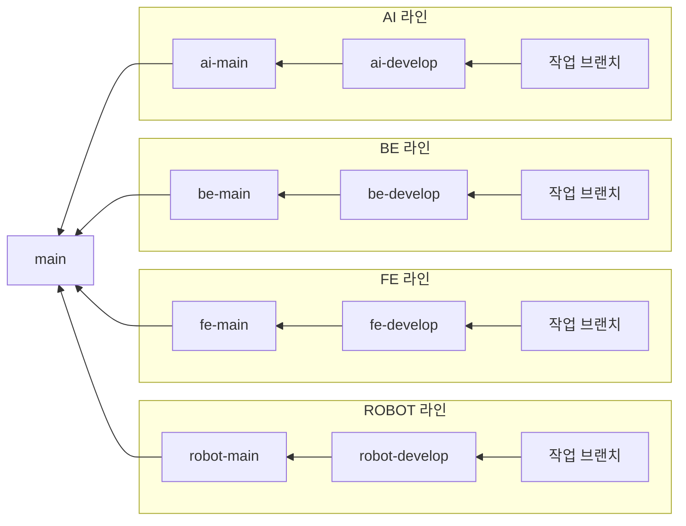

# BOMI 팀 개발 행동 강령

이 문서는 BOMI 프로젝트에 참여하는 모든 팀원이 동일한 방식으로 Git과 GitLab을 사용하기 위한 협업 규칙입니다. 모든 팀원은 작업 전에 이 문서를 읽고 아래 절차를 따릅니다.

> **권위 관계.** 이 문서는 Git 사용법(브랜치 만들기, 커밋, MR)을 다룹니다. 대화 런타임의
> 설계·타이밍·안전 로직과 작업 규칙의 원본은 **`임시보류_claude.md`**(통합 스프린트 동안
> 보관 중인 구 `CLAUDE.md`)에 있습니다. 브랜치·git 상태·작업 규칙(커밋 위생, 완료 조건,
> 티켓 서식)은 그 문서 §25~§29가 이 문서보다 우선합니다. 이 문서와 §25~§29가 어긋나면
> §25~§29를 따르고 이 문서를 고칩니다.
>
> 현재 루트 `CLAUDE.md`는 시연 통합 스프린트 계약(§0~§7)이며, 스프린트가 끝나면 구
> 문서가 복귀합니다. 그때 이 문단의 파일 이름을 되돌립니다.

## 1. 핵심 규칙 요약

- `main`은 시연·배포 가능한 안정 버전만 관리합니다.
- 개발 라인은 하나가 아니라 **`ai` / `be` / `fe` / `robot` 네 개**이며, 라인마다
  `<라인>-develop`이 그 라인의 완료된 기능을 통합하는 브랜치입니다(§2).
- 모든 작업은 자신이 속한 라인의 최신 `<라인>-develop`에서 새 브랜치를 만들어 시작합니다.
- 브랜치 이름 서식은 라인마다 실제 관행이 다르며, 이 문서는 그 관행을 통일하지 않고 있는
  그대로 적습니다(§2).
- 라인 브랜치는 해당 라인의 `<라인>-develop`으로 Merge Request(MR)를 생성합니다.
- `main`과 각 라인의 `<라인>-main` / `<라인>-develop`에는 직접 Push하지 않습니다.
- MR은 최소 1명의 승인 후 병합합니다.
- 비밀번호, API Key, `.env` 등 민감정보는 절대 커밋하지 않습니다.
- 저장소는 GitLab(`lab.ssafy.com`)에서 호스팅되며, 별도 GitLab Group Owner 없이 팀원별로
  저장소 권한을 부여합니다.

## 2. 브랜치 구조

라인마다 독립된 `develop`/`main` 쌍을 가집니다(`임시보류_claude.md` §25가 원본입니다).



### `main`

- 시연 또는 배포할 수 있는 안정 버전만 관리합니다.
- 평상시 기능 개발의 대상 브랜치로 사용하지 않습니다.
- 릴리스 시점에만 `<라인>-develop → <라인>-main`, 최종적으로 `<라인>-main → main` MR을
  생성합니다.

### `<라인>-develop`

- 그 라인 팀원들의 완료된 기능을 통합하는 브랜치입니다.
- 모든 작업 브랜치는 자기 라인의 최신 `<라인>-develop`에서 생성합니다.
- 작업은 MR을 통해서만 병합합니다.
- **다른 라인의 `develop`을 베이스로 브랜치를 만들지 않습니다.** AI 작업은 `ai-develop`
  에서, BE 작업은 `be-develop`에서 시작합니다.

### 작업 브랜치 — 서식은 라인마다 다르고, 통일하지 않습니다

머지 커밋의 브랜치명을 라인별로 집계하면 두 가지 서식이 실제로 쓰입니다.

| 서식 | 예시 | 합계 | 라인별 분포 |
| --- | --- | --- | --- |
| **경로형** `<라인>/<타입>/S15P11E102-<n>-<slug>` | `robot/feat/S15P11E102-222-wakeword-stopping-condition` | 78건 | be 33, robot 22, ai 13, infra 6, fe 4 |
| **한글슬러그형** `S15P11E102-<n>-<라인>-<한글슬러그>` | `S15P11E102-295-ai-기여문서정합` | 49건 | ai 30, be 19 |
| 이 문서가 예전에 규정하던 `feat|fix|docs|refactor|chore/*` | — | 1건(그마저 티켓 키가 붙어 있었습니다) | — |

이 표에서 읽어야 할 것은 통일된 규칙이 아니라 실제 관행입니다:

- **FE·ROBOT·INFRA 는 경로형만 씁니다.**
- **AI 는 한글슬러그형이 우세**합니다(30:13).
- **BE 는 경로형이 우세**합니다(33:19).

새 브랜치를 만들 때는 **자기 라인에서 이미 더 많이 쓰이는 서식을 따릅니다.** 두 서식을
강제로 통일하지 않는 이유는, 통일하려면 `.claude/hooks/pre-push-gate.sh`의 라인 파싱과
`ticket` 스킬도 함께 고쳐야 해서 이 문서 하나로 끝나는 일이 아니기 때문입니다.

권장 영역 약어:

- `ai`: AI 대화 런타임(`robot/ai_chat/`)
- `be`: Backend
- `fe`: Frontend
- `robot`: ROS 2 및 로봇 하드웨어 제어(`robot/ai_vision/`, `robot/ros2_ws/` 등)
- `iot`: 센서 및 장치(Raspberry Pi)
- `infra`: 서버·배포·CI 설정

### 한 라인을 체크아웃하면 다른 라인의 소스가 untracked 로 보입니다 — 정상입니다

라인마다 담당 디렉터리가 다르고, 각 라인의 `develop`은 자기 라인이 손댄 파일만 포함합니다.
그래서 예를 들어 `ai-develop`을 체크아웃한 작업 트리에서는 `backend/src` 전체에 자바 파일이
2~3개뿐입니다. **삭제된 것이 아니라 이 라인에 없는 것입니다.** `git status`에 낯선 디렉터리가
untracked 로 뜨거나 예상보다 파일이 적게 보여도, 그것만으로 "구현이 안 되어 있다"거나
"파일이 유실됐다"고 판단하지 않습니다. 다른 라인의 상태를 함께 봐야 한다면 그 라인의
`<라인>-develop`을 별도 worktree로 열어 대조합니다.

이 절이 있는 이유는 실제 사고 때문입니다. `be` 라인이 체크아웃된 상태에서 AI 라인 전용
`robot/ai_chat/`을 고치려던 시도가 있었습니다. 그 시점에 해당 `.py` 파일들이 작업 트리에
보이지 않았습니다. 원격에는 있었으므로 유실은 아니었지만, 그대로 진행했다면 라인이 뒤섞였을
것입니다. 또, 라인 차이를 모른 채 다른 라인의 코드를 찾다가 "구현되지 않았다"는 잘못된
결론이 난 사례도 있었고, 이를 막기 위해 두 라인을 함께 보는 읽기 전용 worktree를 따로
만들어야 했습니다.

## 3. 팀원의 최초 참여 절차

### 3.1 저장소 접근 권한 확인

GitLab 초대 또는 알림으로 받은 그룹/프로젝트 접근 권한을 먼저 확인합니다. 권한이 없으면
Private 저장소를 Clone할 수 없습니다.

### 3.2 저장소 Clone

```bash
git clone https://lab.ssafy.com/s15-webmobile3-sub1/S15P11E102.git
cd S15P11E102
git switch ai-develop   # 자신이 속한 라인의 develop 으로 바꿉니다 (ai/be/fe/robot)
```

`ai-develop` 은 예시입니다. 자신이 맡은 라인에 맞춰 `be-develop` / `fe-develop` /
`robot-develop` 중 하나로 바꿉니다.

### 3.3 연결 상태 확인

```bash
git branch
git remote -v
```

정상 기준:

- 현재 브랜치 앞에 `* <라인>-develop`이 표시됩니다.
- `origin`이 `lab.ssafy.com/s15-webmobile3-sub1/S15P11E102.git`을 가리킵니다.

### 3.4 개인 환경변수 생성

PowerShell:

```powershell
Copy-Item .env.example .env
```

Git Bash, macOS 또는 Linux:

```bash
cp .env.example .env
```

`.env`는 각 팀원이 자신의 환경에서만 관리합니다. 서버 주소와 계정 등 민감정보는 GitLab이
아닌 팀에서 합의한 보안 채널로 공유합니다.

다음 명령으로 `.env`가 Git에서 제외되는지 확인합니다.

```bash
git check-ignore -v .env
```

## 4. 기능 개발 절차

### 4.1 Jira 티켓 확인 또는 생성

작업을 시작하기 전에 Jira 티켓(`S15P11E102-<n>`)에서 다음 내용을 확인하거나 작성합니다.

- 작업 목적
- 요구사항
- 완료 조건
- 담당자
- 관련 라인(ai/be/fe/robot)

동일한 기능을 두 명이 중복 개발하지 않도록 담당자를 지정한 뒤 시작합니다. 티켓 서식은
`임시보류_claude.md` §27과 `.claude/skills/jira-safe-edit/`를 따릅니다.

### 4.2 최신 `<라인>-develop` 반영

```bash
git switch ai-develop
git pull origin ai-develop
```

`ai-develop`은 예시이며 자신의 라인으로 바꿉니다. **로컬 `<라인>-develop`에서 직접 코드를
수정하지 않습니다.** 실수로 수정했다면 브랜치를 생성한 뒤 작업을 이어갑니다.

```bash
git switch -c S15P11E102-295-ai-기여문서정합
```

**계획·티켓 작성·구현 전에 반드시 `git fetch --all --prune`으로 최신 상태를 확인합니다**
(`.claude/skills/branch-preflight/`). 이미 머지된 작업을 다시 계획하는 사고를 막기
위함입니다.

### 4.3 작업 브랜치 생성

자기 라인에서 우세한 서식을 따릅니다(§2).

```bash
# AI 라인 (한글슬러그형이 우세)
git switch -c S15P11E102-295-ai-기여문서정합

# BE / ROBOT / FE 라인 (경로형)
git switch -c be/feat/S15P11E102-257-컬럼정의서정합
git switch -c robot/feat/S15P11E102-222-wakeword-stopping-condition
```

브랜치는 한 가지 목적만 갖도록 작게 구성합니다. 라인이 다른 변경(예: 프런트엔드와 백엔드)은
각 라인의 브랜치와 MR로 분리합니다 — 같은 브랜치에서 두 라인을 함께 고치지 않습니다.

### 4.4 작업 중 상태 확인

```bash
git status
git diff
```

커밋 전에는 변경한 파일과 실제 변경 내용을 확인합니다.

## 5. 커밋 규칙

### 5.1 파일 추가

가능하면 변경한 파일을 명시적으로 추가합니다.

```bash
git add robot/ai_chat/src/bomi_ai_chat/graph/gate.py
git add docs/carebot/PROGRESS.md
```

전체 파일을 추가해야 할 때만 다음 명령을 사용합니다.

```bash
git add .
```

스테이징 결과를 반드시 확인합니다.

```bash
git status
git diff --cached
```

### 5.2 커밋 메시지

형식(`임시보류_claude.md` §27):

```text
[영역](카테고리) S15P11E102-<n> 제목 — 부제
```

- 영역 ∈ {`AI`, `BE`, `AI+BE`, `ROBOT`, `HW`}
- 카테고리는 소문자 한 단어(`infra`, `api`, `jobs`, `rag`, `schema`, `dialogue`, `prompt`,
  `memory`, `test`, `docs` 등)

예시:

```bash
git commit -m "[AI](docs) S15P11E102-295 기여 문서를 실제 브랜치 구조에 맞춘다 — 없는 절차를 규정으로 남겨두지 않는다"
git commit -m "[BE](schema) S15P11E102-257 컬럼 정의서를 실제 마이그레이션과 맞춘다"
git commit -m "[ROBOT](jobs) S15P11E102-208 현관 하트비트 워치를 추가한다"
```

`type: 요약` 형식(`feat:`, `fix:` 등)은 이 저장소에서 쓰지 않습니다. 커밋 하나에는 가능한
한 하나의 논리적인 변경만 포함합니다.

**시연 통합 기간에는 한 커밋이 한 라인의 경로만 건드립니다.** `robot/ai_chat/**` ·
`ros2_ws/**` · `iot/**` · `backend/**` 를 한 커밋에 섞지 않습니다. 시연이 끝난 뒤 라인별
브랜치로 `git cherry-pick <해시>` 하나만으로 환류할 수 있게 만드는 규칙이며, 근거는 루트
[`CLAUDE.md`](CLAUDE.md) §0에 있습니다.

### 5.3 브랜치 Push

최초 Push:

```bash
git push -u origin S15P11E102-295-ai-기여문서정합
```

이후 같은 브랜치의 Push:

```bash
git push
```

**AI 라인에서 `robot/ai_chat/`의 파이썬 파일을 건드린 push 는
`.claude/hooks/pre-push-gate.sh`가 자동으로 가로채 ruff와 pytest를 돌립니다.** 둘 중 하나라도
빨간 상태면 push 가 거부됩니다(§10). 문서만 고친 push 는 이 게이트를 타지 않습니다.

## 6. Merge Request(MR) 규칙

이 저장소는 GitHub이 아니라 **GitLab**(`lab.ssafy.com`)에서 호스팅되며, Pull Request가
아니라 **Merge Request(MR)**를 씁니다.

라인 작업 MR의 대상과 소스 브랜치는 다음과 같습니다.

```text
target: ai-develop
source: S15P11E102-295-ai-기여문서정합
```

즉, 평상시 병합 방향은 다음과 같습니다.

```text
(ai 라인 브랜치)    → ai-develop
(be 라인 브랜치)    → be-develop
(fe 라인 브랜치)    → fe-develop
(robot 라인 브랜치) → robot-develop
```

`main`에는 라인 작업 브랜치를 직접 병합하지 않습니다. 시연 또는 배포 버전을 만들 때만
`<라인>-develop → <라인>-main`, 이어서 `<라인>-main → main` MR을 생성합니다.

### 병합이 곧 배포입니다

병합 대상 브랜치에 따라 Jenkins가 EC2를 실제로 건드립니다. 이 사실을 모르고 병합하면
운영 서버가 예고 없이 바뀝니다.

| 병합 대상 | 실행되는 Pipeline | 운영 EC2 영향 |
| --- | --- | --- |
| `main` | `ci/Jenkinsfile.integration` | **MQTT 브로커·Backend·Frontend가 순서대로 재배포됩니다** |
| `be-main` | `ci/Jenkinsfile.backend`, `ci/Jenkinsfile.mqtt` | Backend 재배포, MQTT 관련 경로가 바뀐 경우 브로커 재배포 |
| `fe-main` | `ci/Jenkinsfile.frontend` | Frontend 재배포 |
| `ai-main` / `robot-main` | `ci/Jenkinsfile.ai` / `ci/Jenkinsfile.robot` | 없음 — 빌드·테스트 검증만 하고 배포는 하지 않습니다 |

자세한 내용은 [`ci/README.md`](ci/README.md)를 봅니다. 젯슨과 라즈베리파이는 어떤
Pipeline도 배포하지 않으며, 해당 기계에서 브랜치를 직접 checkout해 실행합니다.


### 6.1 MR 작성 항목

`.github/PULL_REQUEST_TEMPLATE.md`와 `.github/ISSUE_TEMPLATE/feature.md`는 **GitHub 전용
템플릿이라 이 저장소가 쓰는 GitLab에서는 렌더링되지 않는 죽은 파일입니다.** GitLab이
실제로 읽는 것은 `.gitlab/merge_request_templates/Default.md`이며, MR을 새로 만들면
이 템플릿이 자동으로 채워집니다.

템플릿의 절 구성은 아래 6개와 같지만, **테스트 절의 `- [ ] 로컬 테스트 완료` 체크박스는
그대로 두지 말고 실제 명령 출력의 숫자로 바꿔 씁니다.** 체크박스는 무엇을 확인했는지
알려주지 않기 때문입니다.

MR 본문은 **`.claude/skills/mr-body/` 스킬이 정하는 6개 절**을 존댓말로 작성합니다.

- 📌 작업 내용
- 🔍 주요 변경 사항
- 🧪 테스트 내용 (실제 명령 출력의 숫자, "로컬 테스트 완료" 같은 표현 금지)
- 📷 스크린샷
- ✅ 리뷰 요청 사항
- 📝 참고 사항

관련 Jira 티켓 링크, 민감정보 포함 여부, 아직 구현하지 않은 부분은 위 절 중 해당하는 곳에
녹여 씁니다. API 변경은 요청·응답 예시를, MQTT 변경은 토픽과 메시지 예시를 포함합니다.

### 6.2 MR 크기

- 하나의 MR은 하나의 목적을 가집니다.
- 리뷰하기 어려운 대규모 MR은 기능 단위로 나눕니다.
- 불필요한 포맷 변경을 기능 코드와 섞지 않습니다.
- MR을 만든 뒤 본인이 먼저 `Changes`(GitLab의 diff 뷰)를 검토합니다.
- MR을 만들기 전에 `git ls-remote --heads origin <브랜치명>`으로 브랜치가 실제로 원격에
  존재하는지 확인합니다 — 링크가 죽은 채로 공유되는 것을 막기 위함입니다.

## 7. 리뷰와 병합 규칙

- 작성자가 아닌 팀원 최소 1명이 리뷰합니다.
- 승인되지 않은 MR은 병합하지 않습니다.
- 리뷰에서 요청한 변경이 있으면 수정 후 다시 리뷰를 요청합니다.
- 모든 토론과 지적사항을 해결(Resolve)한 뒤 병합합니다.
- 병합 방식은 GitLab의 기본 병합(Merge commit)을 사용합니다 — 실제 병합 이력이
  `Merge branch 'X' into 'ai-develop'` 형태로 남는 것이 이 저장소의 실제 관행입니다.
- 병합 후 원격 작업 브랜치는 삭제합니다.

리뷰어는 다음을 확인합니다.

- 요구사항과 완료 조건을 만족하는가
- 실행 또는 테스트 방법이 명확한가
- 기존 기능에 부작용이 없는가
- 민감정보가 포함되지 않았는가
- 코드와 문서가 함께 갱신되었는가(AI 라인은 `docs/carebot/PROGRESS.md` 포함,
  `임시보류_claude.md` §22a)
- 아직 구현되지 않은 부분이 명시되었는가 — "구현됨"과 "검증됨"을 구분했는가

## 8. 병합 후 정리

작업 브랜치가 병합되면 로컬에서 다음을 실행합니다.

```bash
git switch ai-develop
git pull origin ai-develop
git branch -d S15P11E102-295-ai-기여문서정합
```

원격 브랜치는 GitLab의 브랜치 삭제 버튼으로 삭제합니다(또는 병합 시 자동 삭제 옵션을
사용합니다). 다른 작업을 시작할 때는 다시 자기 라인의 최신 `<라인>-develop`에서 새 브랜치를
생성합니다.

## 9. 충돌 처리 원칙

MR에 충돌이 표시되면 작업 브랜치에서 자기 라인의 최신 `<라인>-develop`을 반영합니다.

```bash
git switch S15P11E102-295-ai-기여문서정합
git fetch origin
git merge origin/ai-develop
```

충돌 파일을 수정한 뒤:

```bash
git add 충돌을해결한파일
git commit
git push
```

충돌 해결 과정에서 다른 팀원의 변경을 임의로 삭제하지 않습니다. 의도가 불분명하면 해당
작성자와 함께 해결합니다.

공용 브랜치(`main`, `<라인>-main`, `<라인>-develop`)에는 `git push --force`를 사용하지
않습니다.

## 10. 영역별 최소 테스트

### AI (`robot/ai_chat/`)

```bash
cd robot/ai_chat
venv/Scripts/ruff.exe check src tests
venv/Scripts/pytest.exe -q -m "not integration and not manual"
```

`integration`과 `manual`은 하드웨어·자격증명·외부 API가 필요해 제외합니다 — 마이크가 없는
노트북이 push 를 막아서는 안 되기 때문입니다(`임시보류_claude.md` §26). **이 두 줄은 참고용 명령이
아니라 실제로 강제됩니다.** `robot/ai_chat/`의 파이썬을 건드린 브랜치를 push 하면
`.claude/hooks/pre-push-gate.sh`가 같은 두 명령을 자동으로 돌리고, 하나라도 빨가면 push
자체를 거부합니다(exit 2). 게이트를 우회하려고 `--no-verify`를 쓰지 않습니다 —
빨간 게이트로 push 하는 것은 이 저장소에서 절대 금지 사항입니다(§13).

훅은 두 개입니다. `.claude/hooks/pre-push-gate.sh`가 push 직전의 마지막 관문이고,
`.claude/hooks/ruff-touched-file.sh`는 파이썬 파일을 고친 **직후에** 그 파일 하나에만
ruff를 돌려 알려줍니다. 편집과 검사 사이의 시간 간격을 없애는 것이 목적이며, push를
막지는 않습니다.

### Backend

```powershell
cd backend
.\gradlew.bat test
```

백엔드 테스트는 세 태스크로 나뉘어 있고, 기본 `test`는 나머지 둘을 제외합니다
(`backend/build.gradle` 상단 주석에 이유가 있습니다).

| 태스크 | 무엇을 도는가 | 전제 |
| --- | --- | --- |
| `test` | 단위 테스트만 | 외부 의존 없음, 무료 |
| `integrationTest` | Qdrant 연동 | Qdrant 필요, 무료(결정적 대역 임베딩) |
| `billedTest` | 실제 임베딩 API 호출 | **과금됩니다.** 돌릴 사람이 명시적으로 켭니다 |

DB가 없는 로컬 환경에서는 Health Controller 단위 테스트 또는 DB 자동설정을 제외한 실행
결과를 MR에 기록합니다. 제공 서버 연동이 필요한 테스트는 실행 여부와 미실행 사유를
명시합니다.

### Frontend

```bash
cd frontend
npm ci
npm run build
```

`npm run build`는 `tsc --noEmit && vite build`이므로 타입 검사가 먼저 돕니다
(`frontend/package.json`). 타입만 빠르게 보려면 `npm run typecheck`를 씁니다.
**프론트에는 자동 테스트가 없습니다** — 검증 수단은 타입 검사와 빌드뿐이므로, MR에는
직접 확인한 화면과 조작 경로를 적습니다.

### Robot(ROS2) / IoT

- 실제 장치가 필요한 테스트인지 명시합니다.
- Mock 테스트와 실제 장치 테스트를 구분합니다.
- 사용한 ROS 2, Python, 장치 환경을 MR에 기록합니다.

테스트할 수 없는 기능은 성공한 것처럼 작성하지 않고, 미검증 사유와 후속 검증 계획을
기록합니다. "Logic verified, hardware unverified"가 정직한 표현입니다(`임시보류_claude.md` §22a).

## 11. 민감정보 관리

다음 파일과 값은 절대 Git에 포함하지 않습니다.

```text
.env
application-local.yml
application-secret.yml
실제 MQTT 인증정보
DB 비밀번호
API Key
SSH Private Key
장치별 실제 네트워크 설정
```

저장소에는 예시 파일만 포함합니다.

```text
.env.example
frontend/.env.example
backend/.env.example
infra/production.env.example
infra/mqtt.env.example
robot/config/robot.example.yaml
iot/raspberry-pi/translator/config/device.example.yaml
iot/raspberry-pi/translator/config/dht11.env.example
iot/raspberry-pi/zigbee2mqtt/.env.example
```

실제 비밀값을 Push했다면 파일 삭제만으로 해결되지 않습니다. 즉시 팀에 알리고 해당
비밀번호나 Key를 폐기·재발급해야 합니다.

## 12. 공유 서버 및 Docker 주의사항

- 공유 서버의 컨테이너를 임의로 종료하거나 재생성하지 않습니다.
- 데이터 삭제 가능성이 있는 명령은 실행 전에 담당자와 확인합니다.
- 공유 환경에서는 `docker compose down -v`를 절대 임의 실행하지 않습니다.
- 서버 접속정보와 운영 환경변수는 Jira 티켓, MR, 코드에 작성하지 않습니다.

## 13. 절대 금지 사항

- `main` 직접 Push
- `<라인>-develop` / `<라인>-main` 직접 Push
- 승인 없이 다른 팀원의 브랜치 수정
- 공용 브랜치 또는 다른 팀원 브랜치에 `git push --force` 사용
- `.env`, API Key, DB 비밀번호, SSH Key 커밋
- 동작 또는 테스트 확인 없이 MR 병합
- 리뷰 지적사항을 해결하지 않고 임의 병합
- 공유 서버에서 `docker compose down -v` 실행
- `node_modules`, `dist`, Gradle 빌드 결과물 커밋
- IntelliJ 개인 설정인 `.idea` 커밋
- 준비되지 않은 기능을 구현 완료로 보고
- AI 라인에서 `.claude/hooks/pre-push-gate.sh`가 막은 push 를 `--no-verify`로 우회

## 14. 문제가 생겼을 때

다음 상황에서는 임의로 이력을 변경하지 말고 팀에 먼저 공유합니다.

- `main` 또는 `<라인>-develop`/`<라인>-main`에 잘못 Push한 경우
- 민감정보를 커밋하거나 Push한 경우
- 다른 팀원의 변경을 덮어쓴 경우
- 대규모 충돌이 발생한 경우
- 공유 서버나 DB 데이터에 영향을 줄 수 있는 경우

상황 공유 시 다음 정보를 제공합니다.

```bash
git status
git branch --show-current
git log --oneline -5
git remote -v
```

비밀번호나 토큰이 포함된 출력은 반드시 가린 뒤 공유합니다.

## 15. 일일 작업 체크리스트

작업 시작:

```text
[ ] 저장소 접근 권한 확인
[ ] 자기 라인 확인 (ai/be/fe/robot)
[ ] git fetch --all --prune 로 최신 상태 확인
[ ] 자기 라인의 <라인>-develop 으로 이동
[ ] origin/<라인>-develop 최신 변경 Pull
[ ] 작업 목적에 맞는 새 브랜치 생성 (자기 라인의 실제 서식으로, §2)
[ ] 관련 Jira 티켓 확인 또는 생성
```

작업 종료 및 MR 생성 전:

```text
[ ] git status와 diff 확인
[ ] 민감정보 및 불필요한 파일 제외
[ ] 담당 라인의 테스트 또는 빌드 실행 (§10)
[ ] 명확한 커밋 메시지 작성 ([영역](카테고리) S15P11E102-<n> 제목 — 부제)
[ ] 작업 브랜치 Push (AI 라인은 pre-push-gate.sh 통과 확인)
[ ] <라인>-develop 대상 MR 생성
[ ] git ls-remote --heads origin <브랜치명> 으로 브랜치가 원격에 있는지 확인
[ ] 테스트 결과(실제 숫자)와 미구현 항목 기록 (mr-body 6개 절)
[ ] 본인이 Changes 를 먼저 검토
```

병합 전:

```text
[ ] 최소 1명 승인
[ ] 리뷰 지적사항 해결
[ ] 충돌 없음
[ ] 필요한 테스트 통과 (게이트가 빨간 채로 병합하지 않음)
```
