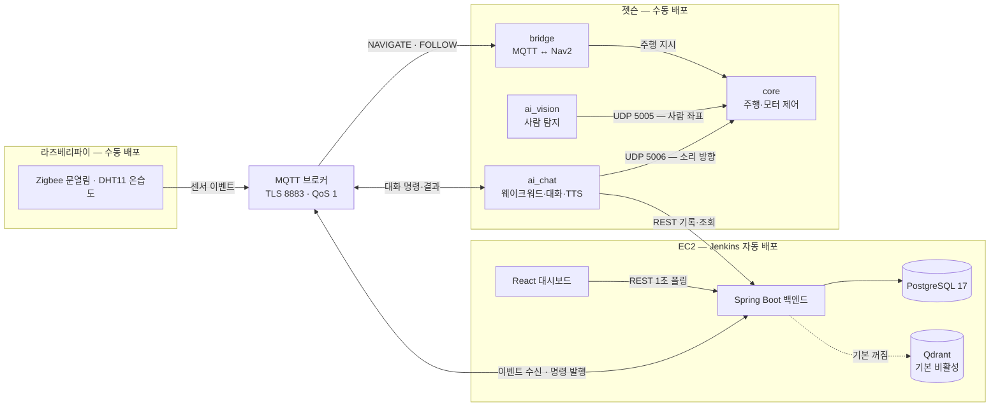

# BOMI

> 일상을 기억하고, 먼저 살피고, 필요한 순간 곁으로 이동하는 AIoT 돌봄 로봇

BOMI는 1인 가구와 돌봄이 필요한 사용자의 일상을 지원하는 **AIoT 기반 개인 맞춤형 돌봄 로봇**입니다. 주거 공간의 센서와 이동형 로봇, 대화형 AI, 보호자 대시보드를 연결해 사용자의 상태를 살피고 일상 기록과 이상 징후를 보호자에게 전달합니다.

## 목차

1. [로봇 외형](#로봇-외형)
2. [왜 만들었나](#왜-만들었나)
3. [시연 시나리오 네 가지](#시연-시나리오-네-가지)
4. [시스템 구성](#시스템-구성)
5. [기술 스택](#기술-스택)
6. [구현 및 검증 현황](#구현-및-검증-현황)
7. [빠른 시작](#빠른-시작)
8. [저장소 구조](#저장소-구조)
9. [문서](#문서)
10. [협업 규칙](#협업-규칙)
11. [보안](#보안)
12. [이용 조건](#이용-조건)

## 로봇 외형

| 외형 없는 내부 구조 | 외형 적용 모습 |
| :---: | :---: |
|  |  |

외형 내부는 전원·구동, 연산·I/O, 카메라·마이크, LiDAR의 4단 구조로 구성되며, 외형을 적용한 상태에서도 상단 LiDAR와 전면 카메라가 주변 환경과 사용자를 인식합니다.

## 왜 만들었나

혼자 사는 어르신의 이상 징후는 보통 **다음 방문자가 올 때까지** 아무도 알아채지 못합니다.
고정형 AI 스피커는 부르는 사람 곁으로 갈 수 없고, 어르신이 기기 앞으로 와서 말을 걸어야
합니다. BOMI는 반대로 움직입니다 — 현관·온습도 센서가 생활의 신호를 올리면 로봇이
**필요한 자리로 이동해 말을 걸고**, 그 대화와 하루의 기록을 보호자 대시보드로 전달합니다.

<!-- 시연 영상 업로드 후 아래 형식으로 추가합니다.
[](https://youtu.be/VIDEO_ID)
-->

## 시연 시나리오 네 가지

로봇이 실제로 수행하는 흐름입니다. 트리거가 다를 뿐 "감지 → 이동 → 대화 → 기록 → 복귀"의
한 가지 뼈대를 공유합니다.

| 시나리오 | 트리거 | 흐름 |
| --- | --- | --- |
| 보미야 호출 | 로봇의 웨이크워드 인식 | 짧은 첫 응답 → 사람을 찾아가는 명령(`FOLLOW_START`) 발행 → 본 대화. 고정 좌표로 이동하는 방식이 아니며, 회전 탐색·접근 주행은 안전 킬 스위치 뒤에 있어 기본은 꺼져 있습니다 |
| 현관 인사 | 현관 센서의 문 열림 이벤트 | 현관으로 이동 → 도착 → 귀가 인사 대화 → 기본 위치 복귀 |
| 복약 알림 | 백엔드 스케줄러의 복약 예정 시각 (1분 폴링) | 거실로 이동 → 도착 → 복약 안내 대화 → 기본 위치 복귀 |
| 온습도 안부 | 온습도 센서가 임계(30℃ 또는 80%)에 도달 | 거실로 이동 → 도착 → 안부 대화 → 기본 위치 복귀 |

이 밖에 시나리오에 속하지 않는 상시 동작이 두 가지 있습니다 — 확인이 필요한 상황(무응답,
위험 발화)을 보호자에게 알리는 **이상 징후 알림**, 그리고 귀가·대화·돌봄 기록을 보여 주는
**보호자 대시보드**(1초 폴링 기반 준실시간)입니다.

현관 인사 시나리오의 전체 구조입니다. 센서 감지부터 로봇 이동과 음성 응답까지 하나의
시나리오로 관리됩니다.

| 귀가 시나리오 한눈 요약 |
| :---: |
|  |

대표로 현관 인사의 흐름입니다. 이동과 대화는 동시에 진행되지 않습니다 — 로봇이 현관에
**도착한 뒤에야** 백엔드가 대화 시작을 명령합니다. (출발 순간의 환호 한마디만 예외입니다.)

```mermaid
flowchart LR
    accTitle: 귀가 시나리오 흐름
    accDescr: 문 열림 이벤트가 백엔드에 도착하면 로봇이 현관으로 이동하고, 도착 결과를 받은 백엔드가 대화 시작을 명령해 귀가 인사가 오간 뒤 기본 위치로 복귀합니다.
    classDef step fill:#fff6b6,stroke:#af7e02
    classDef done fill:#adf0c7,stroke:#087429
    DO["문 열림<br/>(현관 센서)"]:::step --> BE["백엔드<br/>귀가 시나리오 시작"]:::step
    BE -->|"NAVIGATE ENTRANCE"| MV["로봇, 현관으로 이동"]:::step
    MV -->|"ARRIVED"| ST["START_CONVERSATION"]:::step
    ST --> TALK["귀가 인사 대화<br/>(최대 5분)"]:::step
    TALK --> RET["기본 위치 복귀"]:::step
    RET --> DONE["기록 후 COMPLETED"]:::done
```



메시지 단위의 정확한 시퀀스는 [아키텍처 장표 모음](<docs/architecture/아키텍처 다이어그램.md>)의 C2에 있습니다.

## 시스템 구성

기계는 셋입니다. 라즈베리파이가 센서 이벤트를 올리고, EC2의 백엔드가 시나리오를 만들어
명령을 내리고, 젯슨 위의 로봇 프로세스들이 그 명령을 수행해 결과를 회신합니다. 모든
기계 간 통신은 MQTT 브로커 하나를 지나고, 보호자 대시보드만 REST 폴링을 씁니다.

| 전체 시스템 한눈 요약 |
| :---: |
|  |



- **MQTT**: 센서·로봇 이벤트와 명령·결과. 기계 간 통신의 단일 통로입니다.
- **REST**: 로봇의 기록·조회 호출과 보호자 대시보드의 1초 주기 폴링.
- **UDP**: 젯슨 내부 전용 두 갈래 — 비전의 사람 좌표(5005)와 대화 AI의 소리 방향(5006)이
  주행 제어(core)로 들어갑니다.
- **ROS 2**: 로봇 내부의 위치 추정과 자율주행(Nav2).

> 실시간 스트리밍(WebSocket) 자리는 백엔드 문서(`/asyncapi/websocket/`)에 미리 잡아 두었으나
> 아직 구현체가 없습니다. 현재 대시보드의 "실시간"은 폴링입니다.

자세한 구성은 [시스템 아키텍처 문서](<docs/architecture/시스템 개요.md>)를 참고하세요.

### 하드웨어

내부 구조 사진과 4단 구성은 문서 상단의 [로봇 외형](#로봇-외형)에 있습니다.
배선과 부품 상세는 [하드웨어 문서](docs/hardware/README.md)를 참고하세요.

## 기술 스택

| 영역 | 기술 |
| --- | --- |
| Frontend | React 19, TypeScript, Vite, Three.js |
| Backend | Spring Boot 3.4, Java 17, Gradle, JPA, Flyway, Spring Integration MQTT |
| AI | Python 3.10~3.12, LangGraph 대화 런타임, openWakeWord, STT(RTZR)·TTS(Typecast)·LLM(Gemini) |
| Robot | Ubuntu 22.04, ROS 2 Humble, Nav2, SLAM Toolbox, YOLO11n + ByteTrack |
| Data | PostgreSQL 17 (정본) · Qdrant (의미 검색 — 기본 비활성, 임베딩이 4096차원이라 pgvector 인덱스 불가) |
| IoT / Message | Raspberry Pi 5, Eclipse Mosquitto, Zigbee2MQTT |
| Hardware | Jetson Orin Nano, YDLIDAR, Camera, IMU, RP2040 Pico |
| Infra | Docker Compose, Jenkins, Nginx |

## 구현 및 검증 현황

> 2026-08-16 기준. 세부 검증 상태의 단일 출처는 [docs/carebot/진행 상황.md](<docs/carebot/진행 상황.md>)입니다.

| 항목 | 상태 |
| --- | --- |
| 센서 이벤트 수신·검증·중복 제거 | ✅ 로컬 검증 완료 |
| 현관 귀가 및 온습도 안부 시나리오 | ✅ 로컬 E2E 검증 완료 |
| 로봇 명령·결과 수신 및 시나리오 상태 전이 | ✅ 대역 로봇으로 검증 완료 |
| 보호자 대시보드 (1초 폴링 기반 준실시간) | ✅ 구현 |
| 개인화 대화 런타임 | 🟡 자동 검증 완료, 실기 검증 진행 중 |
| 실제 센서 및 Nav2 주행 통합 | 🟡 실물 통합 검증 진행 중 |

> 로컬 E2E 검증에서는 실제 센서와 로봇을 계약이 동일한 대역으로 교체했습니다.
> "구현됨"과 "실기에서 검증됨"은 이 저장소에서 구분해 기록합니다.

## 빠른 시작

로컬에서 백엔드·프런트엔드·브로커를 띄우는 최소 경로입니다.
로봇과 IoT 장치는 별도의 ROS 2·하드웨어 환경이 필요합니다 —
[Robot README](robot/README.md) · [IoT README](iot/README.md).

### 요구 사항

- Docker 및 Docker Compose
- Node.js 20.19 이상 (Vite 8 요구)
- Java 17

### 1. 환경변수 준비

```bash
cp .env.example .env
```

PowerShell에서는 `Copy-Item .env.example .env`. 복사한 `.env`의 `change-me` 값을
로컬 개발용 값으로 바꿉니다.

### 2. PostgreSQL과 MQTT 실행

```bash
docker compose up -d
docker compose ps
```

**성공 신호**: `ps` 출력에서 `postgres`와 `mosquitto` 두 서비스가 `running (healthy)` 또는
`running`으로 보입니다.

| 서비스 | 주소 |
| --- | --- |
| PostgreSQL | `127.0.0.1:5432` |
| MQTT | `localhost:1883` |
| MQTT WebSocket | `localhost:9001` |

### 3. Backend 실행

```bash
cd backend
./gradlew bootRun
```

Windows에서는 `gradlew.bat bootRun`.
**성공 신호**: `http://localhost:8080/api/health` 가 응답하고, 로그에 Flyway 마이그레이션
적용과 `Started BomiBackendApplication`이 보입니다.

### 4. Frontend 실행

```bash
cd frontend
npm ci
npm run dev
```

**성공 신호**: `http://localhost:5173` 에서 보호자 대시보드가 열립니다.

> 막히면 [시나리오 통합 가이드](<docs/scenario/실기 통합 가이드.md>)와 각 라인 README를
> 먼저 확인하세요. 시연·포팅 절차는 [exec/](exec/01-build-deploy.md)에 단계별로 있습니다.

## 저장소 구조

| 경로 | 무엇을 하는가 | 스택 | 배포 |
| --- | --- | --- | --- |
| [backend/](backend/README.md) | 이벤트·시나리오·기록 관리. 로봇 명령의 발원지 | Spring Boot 3.4 · Java 17 | Jenkins 자동 |
| [frontend/](frontend/README.md) | 보호자 대시보드. 백엔드 REST를 1초 폴링 | React 19 · TypeScript | Jenkins 자동 |
| [robot/](robot/README.md) | 주행(ROS 2)·대화 AI·비전. 백엔드 명령을 소비하고 결과 회신 | ROS 2 Humble · Python | 수동 (젯슨) |
| [iot/](iot/README.md) | 현관·온습도 센서의 이벤트 발행 | Zigbee2MQTT · Python | 수동 (라즈베리파이) |
| [docs/](docs/) | 아키텍처·계약·DB·시나리오 문서 | — | — |
| [infra/](infra/README.md) | Compose·Nginx·Mosquitto·Jenkins 설정 | Docker | EC2 |
| [ci/](ci/README.md) | 영역별 Jenkins Pipeline 정의 | — | — |
| [scripts/](scripts/deploy/README.md) | 배포·CI 스크립트와 개발·시연 보조 도구 | — | — |
| [exec/](exec/01-build-deploy.md) | 빌드·배포·시연 절차 문서 4종 | — | — |

자동 배포 경로는 [`ci/Jenkinsfile.integration`](ci/Jenkinsfile.integration) 하나이며 EC2의
Backend·Frontend·MQTT 브로커만 해당됩니다. 젯슨과 라즈베리파이는 CI에서 빌드 검증만 하고
배포는 수동입니다.

## 문서

- [시스템 아키텍처](<docs/architecture/시스템 개요.md>) · [아키텍처 장표 모음](<docs/architecture/아키텍처 다이어그램.md>)
- [API·메시지 계약](docs/api/README.md)
- [데이터베이스](docs/database/README.md)
- [MQTT 시나리오 계약 v1](<docs/mqtt/시나리오 계약 v1.md>) · [토픽·봉투 공통 규칙](<docs/mqtt/토픽 규약.md>)
- [시나리오 통합 가이드](<docs/scenario/실기 통합 가이드.md>) · [로컬 E2E 검증 보고서](<docs/scenario/로컬 E2E 검증 보고.md>)
- [하드웨어 구성](docs/hardware/README.md)
- [빌드·배포·시연 절차 (exec/)](exec/01-build-deploy.md)
- 라인별 안내: [Frontend](frontend/README.md) · [Backend](backend/README.md) · [Robot](robot/README.md) · [IoT](iot/README.md)

운영 배포에는 브라우저에서 여는 도구 세 가지가 함께 올라가며, 셋 다 Nginx Basic 인증 뒤에
있습니다 — 운영자 콘솔 `/operator-console/`, DB 뷰어 `/db-viewer/`, 웨이포인트 편집기
`/waypoint-editor/`. API 문서 진입점은 `/docs/`(Swagger UI와 MQTT AsyncAPI)입니다.

<!-- ## 팀
| 이름 | 담당 라인 | 주요 기여 |
| --- | --- | --- |
팀원 정보를 채운 뒤 이 주석을 해제하세요. -->

## 협업 규칙

- `main`: 시연·배포 가능한 안정 버전
- `<라인>-main` / `<라인>-develop`: 라인은 `ai` / `be` / `fe` / `robot` 네 개이며,
  라인마다 독립된 통합 브랜치 쌍을 가집니다
- 작업 브랜치: 자기 라인에서 이미 우세한 서식을 따릅니다 (경로형
  `be/feat/S15P11E102-257-…` 또는 한글슬러그형 `S15P11E102-295-ai-…`)

자세한 개발 및 리뷰 규칙은 [CONTRIBUTING.md](CONTRIBUTING.md)를 참고하세요.

## 보안

비밀번호, API Key, MQTT 인증정보, SSH 개인키 및 장치 네트워크 설정은 저장소에 커밋하지
않습니다. 실제 설정 대신 `.env.example`과 `*.example.yaml`을 사용합니다.

## 이용 조건

본 저장소는 SSAFY(삼성 청년 SW·AI 아카데미) 15기 프로젝트 산출물입니다. 별도의 오픈소스
라이선스를 부여하지 않았으며, 코드와 문서의 사용은 팀 및 SSAFY 규정을 따릅니다.
