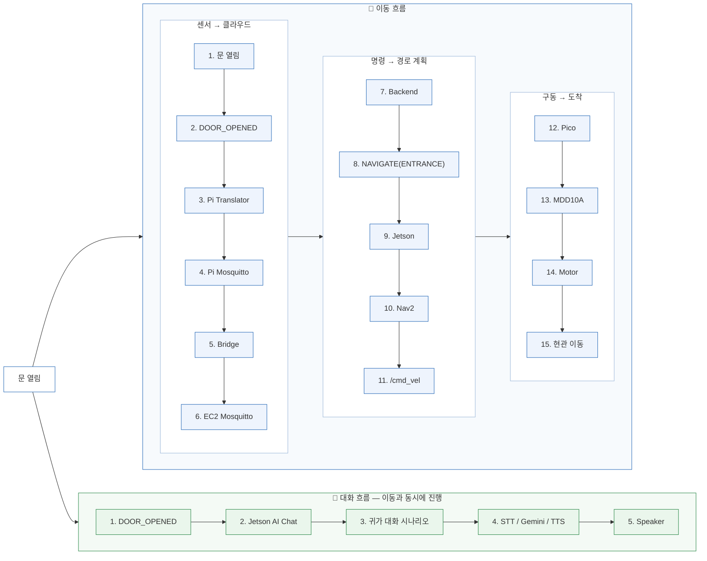
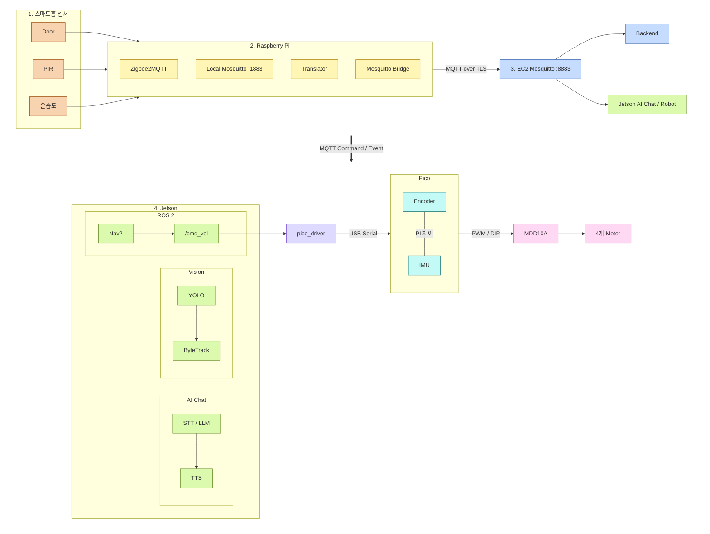

# BOMI

> 일상을 기억하고, 먼저 살피고, 필요한 순간 곁으로 이동하는 AIoT 돌봄 로봇

BOMI는 1인 가구와 돌봄이 필요한 사용자의 일상을 지원하는 **AIoT 기반 개인 맞춤형 돌봄 로봇**입니다. 주거 공간의 센서와 이동형 로봇, 대화형 AI, 보호자 대시보드를 연결해 사용자의 상태를 살피고 일상 기록과 이상 징후를 보호자에게 전달합니다.

## 📑 목차

1. [🤖 로봇 외형](#-로봇-외형)
2. [💡 왜 만들었나](#-왜-만들었나)
3. [🎬 시연 시나리오](#-시연-시나리오)
4. [💻 웹 페이지 화면](#-웹-페이지-화면)
5. [🧩 시스템 구성](#-시스템-구성)
6. [🔧 기술 스택](#-기술-스택)
7. [🚀 실행 방법](#-실행-방법)
8. [📁 저장소 구조](#-저장소-구조)
9. [📚 문서](#-문서)
10. [👥 팀](#-팀)
11. [🤝 협업 규칙](#-협업-규칙)
12. [🔒 보안](#-보안)
13. [📜 이용 조건](#-이용-조건)

## 🤖 로봇 외형

| 외형 없는 내부 구조 | 외형 적용 모습 |
| :---: | :---: |
|  |  |

외형 내부는 전원·구동, 연산·I/O, 카메라·마이크, LiDAR의 4단 구조로 구성되며, 외형을 적용한 상태에서도 상단 LiDAR와 전면 카메라가 주변 환경과 사용자를 인식합니다.

## 💡 왜 만들었나

혼자 사는 어르신의 이상 징후는 다음 방문자가 도착하기 전까지 발견되지 않는 경우가 많습니다.
고정형 AI 스피커는 사용자가 기기 앞으로 이동해 말을 걸어야 동작합니다. BOMI는 현관·온습도
센서가 감지한 생활 신호를 계기로 로봇이 사용자 위치로 이동해 대화를 시작하고, 대화 내용과
일상 기록을 보호자 대시보드로 전달합니다.

제품 방향의 결정 과정은 [돌봄봇 설계](<docs/design/돌봄봇 설계.md>),
침묵 사다리·T1~T4 등 주요 용어와 판단 근거는 [개념과 설계 판단](<docs/carebot/개념과 설계 판단.md>)에 정리되어 있습니다.

<!-- 시연 영상 업로드 후 아래 형식으로 추가합니다.
[](https://youtu.be/VIDEO_ID)
-->

## 🎬 시연 시나리오

네 시나리오는 트리거만 다르고 "감지 → 이동 → 대화 → 기록 → 복귀"의 공통 구조를 가집니다.

| 시나리오 | 트리거 | 흐름 |
| --- | --- | --- |
| 보미야 호출 | 로봇의 웨이크워드 인식 | 짧은 첫 응답 → 사람을 찾아가는 명령(`FOLLOW_START`) 발행 → 본 대화. 고정 좌표로 이동하는 방식이 아니며, 회전 탐색·접근 주행은 안전 킬 스위치 뒤에 있어 기본은 꺼져 있습니다 |
| 현관 인사 | 현관 센서의 문 열림 이벤트 | 현관으로 이동 → 도착 → 귀가 인사 대화 → 기본 위치 복귀 |
| 복약 알림 | 백엔드 스케줄러의 복약 예정 시각 (1분 폴링) | 거실로 이동 → 도착 → 복약 안내 대화 → 기본 위치 복귀 |
| 온습도 알림 | 온습도 센서가 임계(30℃ 또는 80%)에 도달 | 거실로 이동 → 도착 → 안부 대화 → 기본 위치 복귀 |

> 🔊 아래 시연 영상에는 음성이 포함되어 있습니다.

### 보미야 호출
https://github.com/user-attachments/assets/70dae8e7-7df1-4af9-909a-50f85d4beb19

"보미야" 하고 부르면 소리가 나는 곳으로 이동합니다.

### 현관 인사
https://github.com/user-attachments/assets/b3370b72-ec84-431c-820e-700f7dc8fc24

현관문이 열리면 이를 감지하고, 먼저 마중 나갑니다.



**핵심 이해 포인트**

1. 센서 이벤트가 MQTT를 통해 서버와 로봇으로 전달됨
2. 로봇은 Nav2 경로 계획을 통해 현관으로 이동함
3. 동시에 AI Chat이 귀가 음성 응답을 수행함

> 그림의 "동시에 진행"은 출발 시점의 안내 발화에 해당합니다. 귀가 인사 본대화는
> 로봇이 현관에 도착한 뒤 백엔드의 `START_CONVERSATION` 명령으로 시작됩니다.

메시지 단위의 정확한 시퀀스는 [아키텍처 장표 모음](<docs/architecture/아키텍처 다이어그램.md>)의 C2에,
현관 인사의 실패 규칙 10개는 [귀가 환영 시나리오](<docs/scenario/귀가 환영 시나리오.md>)에 있습니다.
네 시나리오가 공유하는 메시지 규칙의 최종 기준은 [시나리오 계약 v1](<docs/mqtt/시나리오 계약 v1.md>)이고,
시나리오가 실패해 로봇이 잠겼을 때(SAFE_STOP) 푸는 절차는 [운영자 시나리오 취소](<docs/scenario/운영자 시나리오 취소.md>)입니다.

### 복약 알림
https://github.com/user-attachments/assets/449c477d-8919-4814-a0ce-ebe6b529e5bb

복약 시간을 기억하고 챙겨 드립니다.

### 온습도 알림
https://github.com/user-attachments/assets/5b62d9d2-2dd6-44cf-b145-3ad0d61a088a

환경을 살피고 먼저 안부를 묻습니다.

### 상시 동작·부가 기능

시나리오 외 상시 동작은 두 가지입니다. 무응답·위험 발화 등 확인이 필요한 상황을 보호자에게
알리는 **이상 징후 알림**과, 귀가·대화·돌봄 기록을 제공하는 **보호자 대시보드**(1초 폴링 기반
준실시간)입니다.

### 사용자 따라다니기
https://github.com/user-attachments/assets/15367ec8-7c80-41e5-96aa-a899e60192fe

어르신의 걸음에 맞춰 함께 이동합니다.

### 응급 상황 발생 시 보호자 알림
https://github.com/user-attachments/assets/a54a09e6-0212-4bef-98c5-98af125e09f9

<table width="100%">
<tr>
<td width="50%"></td>
<td width="50%">응급 상황을 감지하면 보호자에게 알림을 전송합니다.</td>
</tr>
</table>

## 💻 웹 페이지 화면

<table>
<tr>
<td></td>
<td></td>
</tr>
<tr>
<td></td>
<td></td>
</tr>
</table>

화면 구성은 다음과 같습니다. 데이터는 백엔드 REST를 1초 주기로 폴링해 갱신합니다.

| 경로 | 화면 | 내용 |
| --- | --- | --- |
| `/` | 랜딩 | 서비스 소개. Three.js 3D 로봇 씬 포함 |
| `/dashboard` `/bomi-home` `/confirmation-requests` `/health` `/medications` `/schedules` `/records` `/care-plan` | 보호자 원페이지 | 네 구역을 한 화면에 배치 — ① 확인할 일(어르신 발화에서 추출된 사실의 승인·거절) ② 보미와 집(로봇·재실 상태) ③ 복약 관리 ④ 일정 관리. 여덟 경로 모두 같은 화면의 해당 구역으로 이동 |
| `/elder/profile` | 어르신 프로필 | 기본 정보와 성향 조회·수정 |
| `/conversation-preferences` | 대화 주제 설정 | 대화 기억에서 파생된 선호 주제 관리 |

## 🧩 시스템 구성

시스템은 세 대의 기계로 구성됩니다. 라즈베리파이가 센서 이벤트를 발행하고, EC2의 백엔드가
시나리오를 생성해 명령을 내리며, 젯슨의 로봇 프로세스가 명령을 수행해 결과를 회신합니다.
기계 간 통신은 MQTT 브로커 하나를 경유하고, 보호자 대시보드만 REST 폴링을 사용합니다.



- **MQTT**: 센서·로봇 이벤트와 명령·결과. 기계 간 통신의 단일 통로입니다.
- **REST**: 로봇의 기록·조회 호출과 보호자 대시보드의 1초 주기 폴링.
- **UDP**: 젯슨 내부 전용 두 갈래 — 비전의 사람 좌표(5005)와 대화 AI의 소리 방향(5006)이
  주행 제어(core)로 들어갑니다.
- **ROS 2**: 로봇 내부의 위치 추정과 자율주행(Nav2).

> 실시간 스트리밍(WebSocket) 자리는 백엔드 문서(`/asyncapi/websocket/`)에 미리 잡아 두었으나
> 아직 구현체가 없습니다. 현재 대시보드의 "실시간"은 폴링입니다.

**[상세보기](<docs/architecture/시스템 개요.md>)** · [전체 장표 12장](<docs/architecture/아키텍처 다이어그램.md>)

### 하드웨어

내부 구조 사진과 4단 구성은 문서 상단의 [로봇 외형](#-로봇-외형)에 있습니다.
배선과 부품 상세는 [하드웨어 문서](docs/hardware/README.md)를 참고하세요.

## 🔧 기술 스택

| 영역 | 기술 |
| --- | --- |
| Frontend | React 19, TypeScript, Vite, Three.js |
| Backend | Spring Boot 3.4, Java 17, Gradle, JPA, Flyway, Spring Integration MQTT |
| AI | Python 3.10~3.12, LangGraph 대화 런타임, openWakeWord, STT(RTZR)·TTS(Typecast)·LLM(Gemini) |
| Robot | Ubuntu 22.04, ROS 2 Humble, Nav2, SLAM Toolbox, YOLO11n + ByteTrack |
| Data | PostgreSQL 17 (정본) · Qdrant (의미 검색 — 기본 비활성, 임베딩이 4096차원이라 pgvector 인덱스 불가) |
| IoT / Message | Raspberry Pi 5, Eclipse Mosquitto, Zigbee2MQTT |
| Hardware | Jetson Orin Nano, YDLIDAR, Camera, IMU, RP2040 Pico |
| Infra | Docker Compose, Jenkins, Nginx |

테이블 19개의 정의는 [MVP 데이터 모델](docs/database/mvp-erd.md), 스키마 변경 절차와 사고
기록은 [Flyway 가이드](<docs/database/Flyway 가이드.md>), 의미 검색의 동작 검증 기록은
[RAG 런타임 감사](<docs/architecture/RAG 런타임 감사.md>)를 참고하십시오.

## 🚀 실행 방법

로컬에서 백엔드·프런트엔드·브로커를 띄우는 최소 경로입니다.
로봇과 IoT 장치는 별도의 ROS 2·하드웨어 환경이 필요합니다 —
[Robot README](robot/README.md) · [IoT README](iot/README.md).

**요구 사항**: Docker 및 Docker Compose · Node.js 20.19 이상 (Vite 8 요구) · Java 17

<details>
<summary><b>1. 환경변수 준비</b></summary>

```bash
cp .env.example .env
```

PowerShell에서는 `Copy-Item .env.example .env`. 복사한 `.env`의 `change-me` 값을
로컬 개발용 값으로 바꿉니다.

</details>

<details>
<summary><b>2. PostgreSQL과 MQTT 실행</b></summary>

```bash
docker compose up -d
docker compose ps
```

**성공 신호**: `ps` 출력에서 `postgres`와 `mosquitto` 두 서비스가 `running (healthy)` 또는
`running`으로 보입니다.

| 서비스 | 주소 |
| --- | --- |
| PostgreSQL | `127.0.0.1:5432` |
| MQTT | `localhost:1883` |
| MQTT WebSocket | `localhost:9001` |

</details>

<details>
<summary><b>3. Backend 실행</b></summary>

```bash
cd backend
./gradlew bootRun
```

Windows에서는 `gradlew.bat bootRun`.
**성공 신호**: `http://localhost:8080/api/health` 가 응답하고, 로그에 Flyway 마이그레이션
적용과 `Started BomiBackendApplication`이 보입니다.

</details>

<details>
<summary><b>4. Frontend 실행</b></summary>

```bash
cd frontend
npm ci
npm run dev
```

**성공 신호**: `http://localhost:5173` 에서 보호자 대시보드가 열립니다.

</details>

> 문제가 발생하면 [실기 통합 가이드](<docs/scenario/실기 통합 가이드.md>)와 각 라인 README를
> 확인하십시오. 시연·포팅 절차는 [exec/](exec/01-build-deploy.md)에 단계별로 정리되어 있습니다.

## 📁 저장소 구조

| 경로 | 무엇을 하는가 | 스택 | 배포 |
| --- | --- | --- | --- |
| [backend/](backend/README.md) | 이벤트·시나리오·기록 관리. 로봇 명령의 발원지 | Spring Boot 3.4 · Java 17 | Jenkins 자동 |
| [frontend/](frontend/README.md) | 보호자 대시보드. 백엔드 REST를 1초 폴링 | React 19 · TypeScript | Jenkins 자동 |
| [robot/](robot/README.md) | 주행(ROS 2)·대화 AI·비전. 백엔드 명령을 소비하고 결과 회신 | ROS 2 Humble · Python | 수동 (젯슨) |
| [iot/](iot/README.md) | 현관·온습도 센서의 이벤트 발행 | Zigbee2MQTT · Python | 수동 (라즈베리파이) |
| [docs/](docs/) | 아키텍처·계약·DB·시나리오 문서 | — | — |
| [infra/](infra/README.md) | Compose·Nginx·Mosquitto·Jenkins 설정 | Docker | EC2 |
| [ci/](ci/README.md) | 영역별 Jenkins Pipeline 정의 | — | — |
| [scripts/](scripts/deploy/README.md) | 배포·CI 스크립트와 개발·시연 보조 도구 | — | — |
| [exec/](exec/01-build-deploy.md) | 빌드·배포·시연 절차 문서 4종 | — | — |

자동 배포 경로는 [`ci/Jenkinsfile.integration`](ci/Jenkinsfile.integration) 하나이며 EC2의
Backend·Frontend·MQTT 브로커만 해당됩니다. 젯슨과 라즈베리파이는 CI에서 빌드 검증만 하고
배포는 수동입니다.

## 📚 문서

전체 안내와 읽기 순서는 [docs 문서 안내](docs/README.md)에 있습니다.

- **docs/architecture/** — [시스템 개요](<docs/architecture/시스템 개요.md>) · [아키텍처 다이어그램](<docs/architecture/아키텍처 다이어그램.md>) · [RAG 런타임 감사](<docs/architecture/RAG 런타임 감사.md>)
- **docs/mqtt/** — [시나리오 계약 v1](<docs/mqtt/시나리오 계약 v1.md>) · [토픽 규약](<docs/mqtt/토픽 규약.md>) · [MQTT 계약 쉽게 이해하기](<docs/mqtt/MQTT 계약 쉽게 이해하기.md>)
- **docs/scenario/** — [귀가 환영 시나리오](<docs/scenario/귀가 환영 시나리오.md>) · [실기 통합 가이드](<docs/scenario/실기 통합 가이드.md>) · [운영자 시나리오 취소](<docs/scenario/운영자 시나리오 취소.md>) · [로컬 E2E 검증 보고](<docs/scenario/로컬 E2E 검증 보고.md>)
- **docs/database/** — [MVP 데이터 모델](docs/database/mvp-erd.md) · [데이터베이스](docs/database/README.md) · [Flyway 가이드](<docs/database/Flyway 가이드.md>) · [온보딩 환경 설계](<docs/database/온보딩 환경 설계.md>) · [질문 세트 v1](docs/database/onboarding-question-set-v1.json) · [컬럼정의서 안내](docs/database/column-definition/README.md)
- **docs/carebot/** — [진행 상황](<docs/carebot/진행 상황.md>) · [코드 읽는 순서](<docs/carebot/코드 읽는 순서.md>) · [개념과 설계 판단](<docs/carebot/개념과 설계 판단.md>) · [대조표](<docs/carebot/대조표.md>) · [검증 절차](<docs/carebot/검증 절차.md>) · [개인화 로컬 점검](<docs/carebot/개인화 로컬 점검.html>)
- **docs/natural-conversation/** — [현재 구조 감사](<docs/natural-conversation/현재 구조 감사.md>) · [구현 계획](<docs/natural-conversation/구현 계획.md>) · [목표 구조](<docs/natural-conversation/목표 구조.md>)
- **docs/hardware/** — [하드웨어 구성](docs/hardware/README.md) · [오디오 에코 바지인 검증](<docs/hardware/오디오 에코 바지인 검증.md>)
- **docs/design/** — [돌봄봇 설계](<docs/design/돌봄봇 설계.md>)
- **docs/api/** — [API·메시지 계약](docs/api/README.md)
- **docs/meeting/** — [회의록 규약](docs/meeting/README.md)
- **exec/** — [빌드·배포](exec/01-build-deploy.md) · [외부 서비스](exec/02-external-services.md) · [DB 덤프](exec/03-database-dump.md) · [시연 시나리오](exec/04-demo-scenario.md)
- **라인별 README** — [Frontend](frontend/README.md) · [Backend](backend/README.md) · [Robot](robot/README.md) · [IoT](iot/README.md)

운영 배포에는 브라우저에서 여는 도구 세 가지가 함께 올라가며, 셋 다 Nginx Basic 인증 뒤에
있습니다 — 운영자 콘솔 `/operator-console/`, DB 뷰어 `/db-viewer/`, 웨이포인트 편집기
`/waypoint-editor/`. API 문서 진입점은 `/docs/`(Swagger UI와 MQTT AsyncAPI)입니다.

## 👥 팀

<p align="center">
  
</p>

<!-- 이름·담당 라인·주요 기여 표를 팀이 채워 넣을 자리입니다. -->

## 🤝 협업 규칙

- `main`: 시연·배포 가능한 안정 버전
- `<라인>-main` / `<라인>-develop`: 라인은 `ai` / `be` / `fe` / `robot` 네 개이며,
  라인마다 독립된 통합 브랜치 쌍을 가집니다
- 작업 브랜치: 자기 라인에서 이미 우세한 서식을 따릅니다 (경로형
  `be/feat/S15P11E102-257-…` 또는 한글슬러그형 `S15P11E102-295-ai-…`)

자세한 개발 및 리뷰 규칙은 [CONTRIBUTING.md](CONTRIBUTING.md)를 참고하세요.

## 🔒 보안

비밀번호, API Key, MQTT 인증정보, SSH 개인키 및 장치 네트워크 설정은 저장소에 커밋하지
않습니다. 실제 설정 대신 `.env.example`과 `*.example.yaml`을 사용합니다.

## 📜 이용 조건

본 저장소는 SSAFY(삼성 청년 SW·AI 아카데미) 15기 프로젝트 산출물입니다. 별도의 오픈소스
라이선스를 부여하지 않았으며, 코드와 문서의 사용은 팀 및 SSAFY 규정을 따릅니다.
