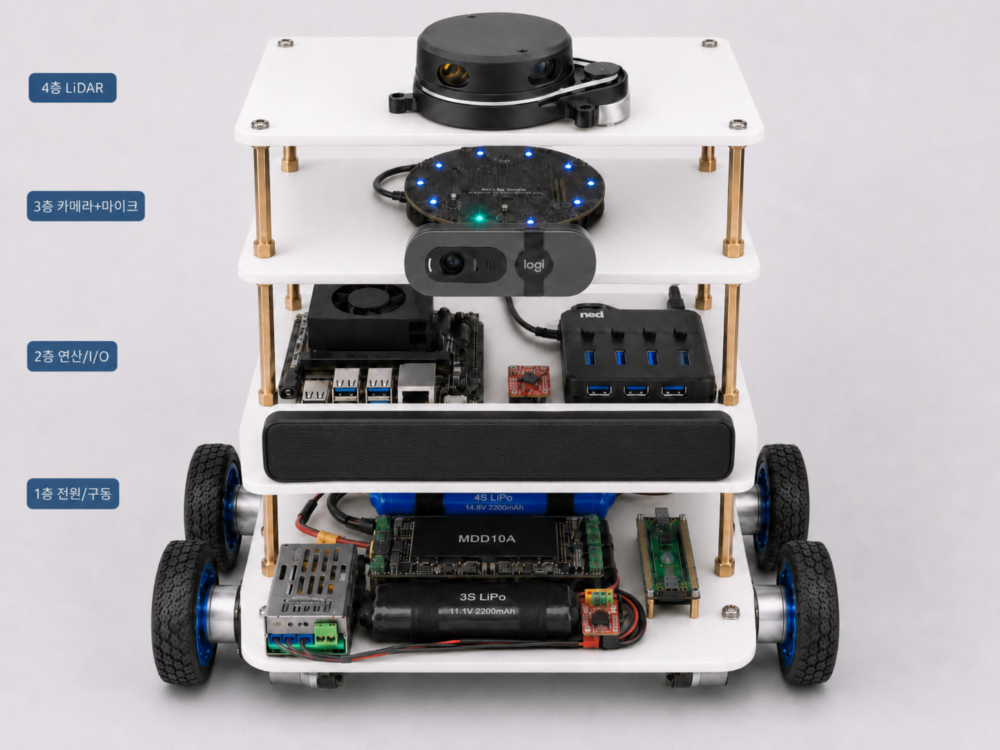
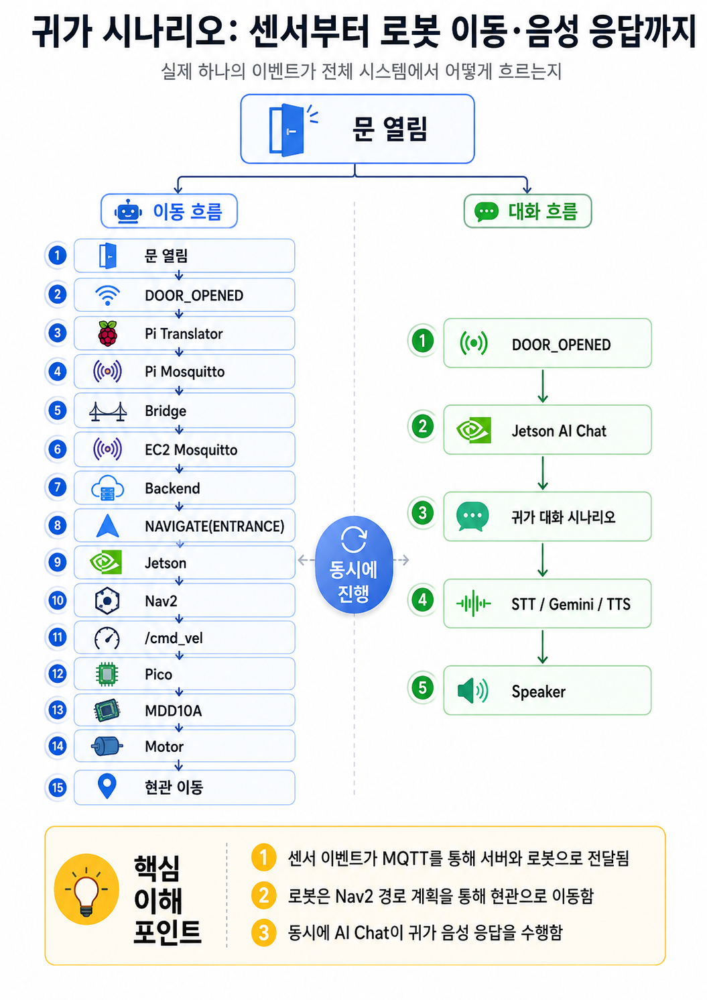
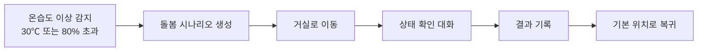
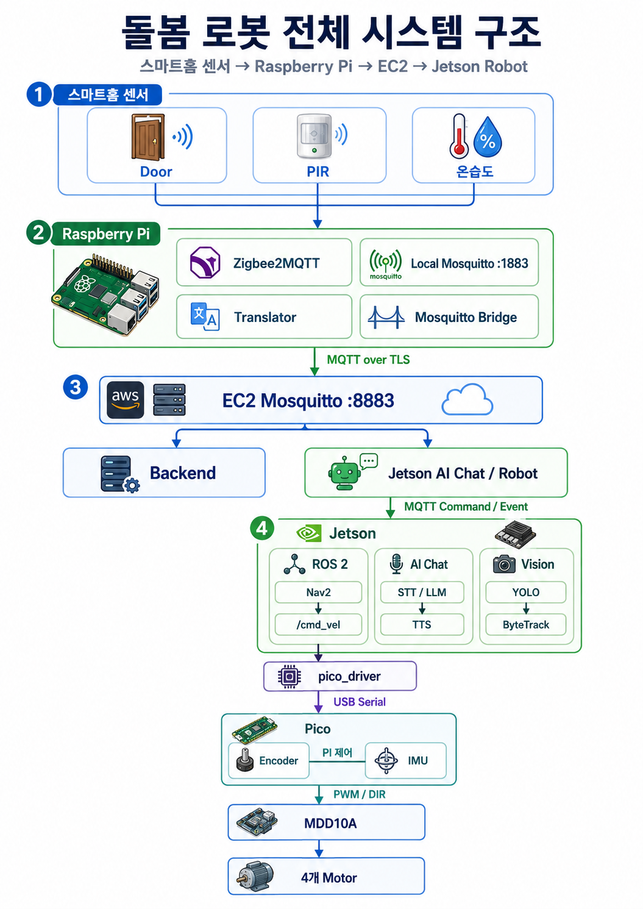
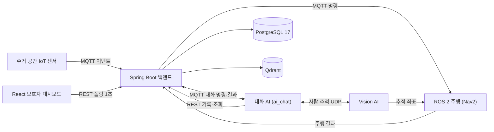

# BOMI

> 일상을 기억하고, 먼저 살피고, 필요한 순간 곁으로 이동하는 AIoT 돌봄 로봇

BOMI는 1인 가구와 돌봄이 필요한 사용자의 일상을 지원하는 **AIoT 기반 개인 맞춤형 돌봄 로봇**입니다. 주거 공간의 센서와 이동형 로봇, 대화형 AI, 보호자 대시보드를 연결해 사용자의 상태를 살피고 일상 기록과 이상 징후를 보호자에게 전달합니다.

## 로봇 외형

| 외형 없는 내부 구조 | 외형 적용 모습 |
| :---: | :---: |
|  |  |

외형 내부는 전원·구동, 연산·I/O, 카메라·마이크, LiDAR의 4단 구조로 구성되며, 외형을 적용한 상태에서도 상단 LiDAR와 전면 카메라가 주변 환경과 사용자를 인식합니다.

## 시연 영상

전체 시나리오 시연 영상은 추후 공개할 예정입니다.

<!-- YouTube 업로드 후 아래 형식으로 교체합니다.
[](https://youtu.be/VIDEO_ID)
-->

## 주요 기능

- **생활 환경 감지**: 현관, 온습도 등 주거 공간의 센서 이벤트를 수집합니다.
- **자율 이동 및 사용자 대응**: 상황에 맞는 위치로 이동해 인사하거나 안부를 확인합니다.
- **개인 맞춤형 음성 대화**: STT/TTS와 사용자 기억을 활용해 자연스러운 대화를 제공합니다.
- **돌봄 시나리오 관리**: 이벤트 발생부터 이동, 대화, 복귀, 완료까지 전체 흐름을 관리합니다.
- **이상 징후 및 응급 알림**: 확인이 필요한 상황을 보호자에게 전달합니다.
- **보호자 대시보드**: 사용자 상태와 귀가·대화·돌봄 기록을 실시간으로 확인합니다.

## 대표 시나리오

### 귀가 맞이

현관 센서 이벤트가 서버와 로봇으로 전달되면, 로봇의 현관 이동과 AI 음성 응답이 동시에 진행됩니다.

<p align="center">
  
</p>

### 생활 환경 안부 확인



### 시연 시나리오 네 가지

| 시나리오 | 트리거 | 흐름 |
| --- | --- | --- |
| 보미야 호출 | 로봇의 웨이크워드 인식 | 짧은 첫 응답 → 거실로 이동(이동 중 침묵) → 도착 → 사람에게 접근 → 본 대화 |
| 현관 인사 | 현관 센서의 문 열림 이벤트 | 현관으로 이동 → 도착 → 귀가 인사 대화 → 기본 위치 복귀 |
| 복약 알림 | 백엔드 스케줄러의 복약 예정 시각 | 거실로 이동 → 도착 → 복약 안내 대화 → 기본 위치 복귀 |
| 온습도 안부 | 온습도 센서가 임계(30℃ 또는 80%)를 넘김 | 거실로 이동 → 도착 → 안부 대화 → 기본 위치 복귀 |

## 시스템 구성

스마트홈 센서에서 Raspberry Pi와 EC2를 거쳐 Jetson 로봇까지 이어지는 전체 구성입니다.

<p align="center">
  
</p>

각 구성 요소의 논리적인 연결과 데이터 흐름은 다음과 같습니다.



- **MQTT**: 센서·로봇 이벤트, 명령 및 상태 전달
- **REST**: 명확한 요청·응답, 기록 조회, 보호자 대시보드의 1초 주기 폴링
- **ROS 2**: 로봇 제어, 위치 추정 및 자율주행

> 실시간 스트리밍(WebSocket) 자리는 백엔드 문서(`/asyncapi/websocket/`)에 미리 잡아 두었으나
> 아직 구현체가 없습니다. 현재 대시보드의 "실시간"은 폴링입니다.

자세한 내용은 [시스템 아키텍처 문서](docs/architecture/system-overview.md)를 참고하세요.

## 기술 스택

| 영역 | 기술 |
| --- | --- |
| Frontend | React, TypeScript, Vite, Three.js |
| Backend | Spring Boot 3.4, Java 17, Gradle, JPA, Flyway, MQTT |
| AI | Python 3.10~3.12, STT/TTS, 대화 런타임(LangGraph), Vision |
| Robot | Ubuntu 22.04, ROS 2 Humble, Nav2, SLAM Toolbox |
| Data | PostgreSQL 17, Qdrant (의미 검색 — 임베딩이 4096차원이라 pgvector 인덱스 불가) |
| IoT / Message | Raspberry Pi 5, Eclipse Mosquitto, Zigbee |
| Hardware | Jetson Orin Nano, LiDAR, Camera, IMU |
| Infra | Docker Compose, Jenkins, Nginx |

## 구현 및 검증 현황

| 항목 | 상태 |
| --- | --- |
| 센서 이벤트 수신·검증·중복 제거 | ✅ 로컬 검증 완료 |
| 현관 귀가 및 온습도 안부 시나리오 | ✅ 로컬 E2E 검증 완료 |
| 로봇 명령·결과 수신 및 시나리오 상태 전이 | ✅ 대역 로봇으로 검증 완료 |
| 보호자 대시보드 (1초 폴링 기반 준실시간) | ✅ 구현 |
| 개인화 대화 런타임 | 🟡 자동 검증 완료, 실기 검증 진행 중 |
| 실제 센서 및 Nav2 주행 통합 | 🟡 실물 통합 검증 진행 중 |

> 로컬 E2E 검증에서는 실제 센서와 로봇을 계약이 동일한 대역으로 교체했습니다. 실물 연동 상태는 기능별 문서에서 별도로 관리합니다.

## 빠른 시작

### 요구 사항

- Docker 및 Docker Compose
- Node.js와 npm
- Java 17

로봇과 IoT 장치 실행에는 별도의 ROS 2 및 하드웨어 환경이 필요합니다.

### 1. 환경변수 준비

```bash
cp .env.example .env
```

PowerShell에서는 다음 명령을 사용합니다.

```powershell
Copy-Item .env.example .env
```

복사한 `.env`의 `change-me` 값을 로컬 개발용 값으로 변경하세요.

### 2. PostgreSQL과 MQTT 실행

```bash
docker compose up -d
docker compose ps
```

| 서비스 | 주소 |
| --- | --- |
| PostgreSQL | `127.0.0.1:5432` |
| MQTT | `localhost:1883` |
| MQTT WebSocket | `localhost:9001` |

### 3. Backend 실행

```bash
cd backend
./gradlew bootRun
```

Windows에서는 `gradlew.bat bootRun`을 사용합니다. 실행 후 `http://localhost:8080/api/health`에서 상태를 확인할 수 있습니다.

### 4. Frontend 실행

```bash
cd frontend
npm ci
npm run dev
```

기본 개발 서버 주소는 `http://localhost:5173`입니다.

Robot과 IoT 실행 방법은 각각 [Robot README](robot/README.md)와 [IoT README](iot/README.md)를 참고하세요.

## 저장소 구조

```text
frontend/   보호자용 React 대시보드
backend/    이벤트·시나리오·기록을 관리하는 Spring Boot 백엔드
robot/      ROS 2 워크스페이스, 자율주행 및 로봇 제어
iot/        Raspberry Pi, Jetson, 센서 및 MQTT 연동
docs/       아키텍처, API, 데이터베이스와 시나리오 문서
infra/      Docker Compose, PostgreSQL/Qdrant, Mosquitto, Jenkins, Nginx 설정
ci/         영역별 Jenkins Pipeline 정의
scripts/    배포·CI 스크립트와 개발·시연 보조 도구(`ci/`, `deploy/`, `dev/`, `data-import/`)
```

EC2의 Backend·Frontend·MQTT 브로커만 Jenkins가 자동 배포하며, 그 경로는
[`ci/Jenkinsfile.integration`](ci/Jenkinsfile.integration) 하나입니다. 젯슨과 라즈베리파이는
빌드 검증만 CI에서 하고 배포는 수동입니다.

## 문서

- [시스템 아키텍처](docs/architecture/system-overview.md)
- [API 명세](docs/api/README.md)
- [데이터베이스](docs/database/README.md)
- [MQTT 시나리오 계약 v1](docs/mqtt/scenario-contract-v1.md) · [토픽·봉투 공통 규칙](docs/mqtt/topic-convention.md)
- [시나리오 통합 가이드](docs/scenario/integration-guide.md)
- [로컬 E2E 검증 보고서](docs/scenario/local-e2e-report.md)
- [하드웨어 구성](docs/hardware/README.md)
- [Frontend](frontend/README.md) · [Backend](backend/README.md) · [Robot](robot/README.md) · [IoT](iot/README.md)

운영 배포에는 브라우저에서 여는 도구 세 가지가 함께 올라가며, 셋 다 Nginx Basic 인증 뒤에
있습니다 — 운영자 콘솔 `/operator-console/`, DB 뷰어 `/db-viewer/`, 웨이포인트 편집기
`/waypoint-editor/`. API 문서 진입점은 `/docs/`(Swagger UI와 MQTT AsyncAPI)입니다.

## 협업 규칙

- `main`: 시연·배포 가능한 안정 버전
- `<라인>-main` / `<라인>-develop`: 라인은 `ai` / `be` / `fe` / `robot` 네 개이며,
  라인마다 독립된 통합 브랜치 쌍을 가집니다
- 작업 브랜치: 자기 라인에서 이미 우세한 서식을 따릅니다 (경로형
  `be/feat/S15P11E102-257-…` 또는 한글슬러그형 `S15P11E102-295-ai-…`)

자세한 개발 및 리뷰 규칙은 [CONTRIBUTING.md](CONTRIBUTING.md)를 참고하세요.

## 보안

비밀번호, API Key, MQTT 인증정보, SSH 개인키 및 장치 네트워크 설정은 저장소에 커밋하지 않습니다. 실제 설정 대신 `.env.example`과 `*.example.yaml`을 사용합니다.
