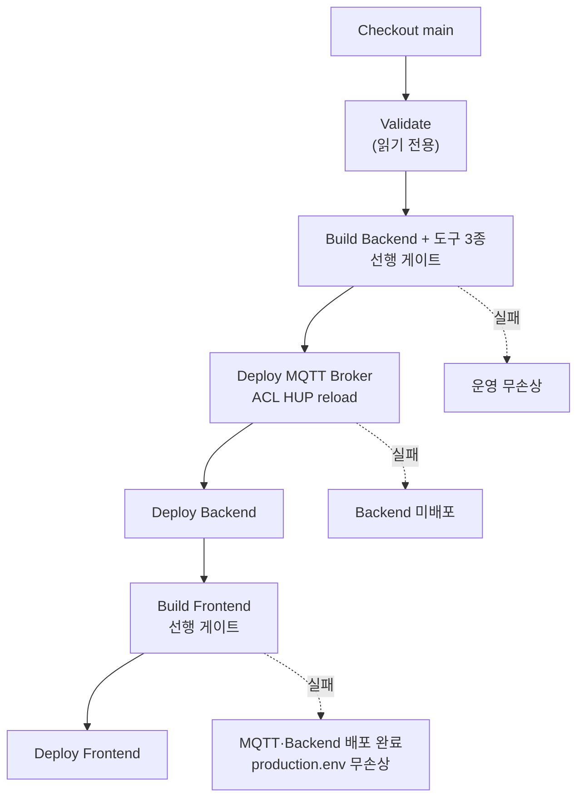

# 영역별 Jenkins Pipeline

| Pipeline | 대상 브랜치 | 동작 |
| --- | --- | --- |
| `Jenkinsfile.integration` | `main` | **현재 유일한 EC2 자동 배포 경로.** MQTT Broker·Backend·Frontend를 순서대로 배포 |
| `Jenkinsfile.backend` | `be-main` | Backend만 EC2에 배포 |
| `Jenkinsfile.mqtt` | `be-main` | MQTT 관련 경로가 바뀐 경우에만 Mosquitto 재배포 |
| `Jenkinsfile.frontend` | `fe-main` | Frontend만 EC2에 배포 |
| `Jenkinsfile.ai` | `ai-main` | 빌드·테스트 검증만 수행 |
| `Jenkinsfile.robot` | `robot-main` | 빌드 검증만 수행 |
| 루트 `Jenkinsfile` | (브랜치 검증 없음) | **레거시.** `deploy-production.sh` 호출. 새 Job을 이것으로 만들지 않습니다 |

각 Jenkins Job의 SCM Branch Specifier와 GitLab push trigger branch filter는 **위 표의
대상 브랜치와 정확히 같게** 지정합니다. 예를 들어 Backend Job은 Specifier `*/be-main`,
filter `be-main`이고, 통합 Job은 `*/main`과 `main`입니다.

`Jenkinsfile`의 `BOMI_RELEASE_BRANCH`와 Job의 Branch Specifier가 어긋나면
`HEAD is not the latest origin/<branch> commit`으로 배포가 즉시 중단됩니다 —
**둘은 항상 같이 바꿉니다.** `<라인>-develop`과 기능 브랜치는 운영 Job에서 허용하지
않습니다.

루트 `Jenkinsfile`은 `verify_release_commit`·`require_absolute_path`·`reload_nginx_config`를
전부 건너뜁니다. 저장소에 살아 있는 파이프라인은 이 표의 7개가 전부입니다.

AI 프로젝트는 `robot/ai_chat/`에 있습니다. 디렉터리가 없을 때 AI Job은 보류가 아니라
**실패**로 표시합니다. AI·Robot 배포 대상 장치가 준비되기 전까지 두 Pipeline은 원격
배포를 수행하지 않습니다.

이 파일들과 `scripts/ci`, `scripts/deploy`, `infra` 운영 설정은 각 영역의 main으로
릴리스되기 전에 해당 develop 브랜치에도 반영되어야 합니다.

## 시연 스프린트 한정 — 통합 Pipeline

시연 통합 기간에는 라인별 브랜치 전략을 접고 모든 도메인을 `main` 하나로 모읍니다.
(2026-08-12 커밋 `ed08b300` 이전에는 통합 지점이 `hotfix/scenario-integration`이었습니다.)
이 기간의 EC2 배포는 `Jenkinsfile.integration` **하나만** 담당하며, 범위는 MQTT Broker,
Backend, Frontend입니다.

배포 순서와 각 단계에서 실패했을 때 운영이 어떤 상태인지는 다음과 같습니다.



Job을 하나로 합친 이유는 Jenkins의 Job 트리거가 "브랜치" 단위지 "경로" 단위가 아니기
때문입니다. `Jenkinsfile.backend`와 `Jenkinsfile.frontend`를 둘 다 같은 브랜치에 걸면
push 한 번에 두 Job이 **동시에** 뜨고, 두 Job이 같은 `production.env`를 읽고-고쳐-덮어쓰기
때문에(`deploy-common.sh`의 `set_env_value`) 서로의 이미지 태그를 유실시킬 수 있습니다.
Job이 하나면 `disableConcurrentBuilds()` 하나로 전부 직렬화되어 이 문제가 사라집니다.

젯슨(`robot/ai_chat`·`bridge`·`ros2_ws`)과 파이(`iot`)는 수동 배포이므로 이 Pipeline의
대상이 아닙니다. 해당 기계들은 이 브랜치를 직접 checkout해서 실행합니다.

### MQTT Broker를 함께 배포합니다 (2026-08-07 추가)

운영 Mosquitto의 ACL과 `mosquitto.conf`는 이미지에 굽지 않고 이 저장소의
`infra/docker/mosquitto/production/`을 그대로 바인드 마운트합니다
(`infra/compose.mqtt.prod.yml`). 그런데 그 파일들을 배포하는 `Jenkinsfile.mqtt`는
Job 트리거가 `be-main`이고 `BOMI_RELEASE_BRANCH=be-main`이 하드코딩되어 있습니다.
시연 브랜치에서 ACL을 완화한 커밋(`8a001e2b`)은 `be-main`에 없으므로, 이 스테이지가
없으면 완화된 ACL은 **어떤 자동 경로로도 브로커에 도달하지 못합니다.**

`Deploy MQTT Broker`는 `Deploy Backend` **앞**에 둡니다. mosquitto는 SIGHUP으로 ACL을
다시 읽지만 이미 승인된 구독은 그대로 남습니다. 순서를 뒤집으면 Backend가 옛 ACL로
구독을 승인받은 상태로 남고 완화는 다음 재시작까지 무효화되며, MQTT는 거부를
클라이언트에 알리지 않으므로 그 사실이 로그에도 남지 않습니다.

변경 감지는 두지 않습니다. `has-changes.sh`는 직전 성공 빌드와의 diff를 보는데, ACL
완화 커밋은 이미 이 브랜치 히스토리에 있어서 diff에 걸리지 않고 영원히 skip됩니다.
Mosquitto 배포는 멱등이고 HUP reload라 매번 돌려도 저렴합니다.

MQTT 전제조건은 `Validate`에서 끝까지 확인합니다. `Deploy MQTT`가 `Deploy Backend`
앞에 있으므로 MQTT가 깨지면 Backend 배포까지 막히기 때문에, 그 실패를 운영에 손대기
전 단계로 끌어옵니다. 확인 항목은 `deploy-mqtt.sh`·`verify-mqtt.sh` 셸 문법,
`/home/ubuntu/bomi/secrets/mqtt.env` 읽기 가능 여부, `compose.mqtt.prod.yml`의
`--profile tools` 스키마입니다. **`mqtt.env`는 `production.env`와 다른 파일입니다** —
없으면 `scripts/deploy/MQTT_DEPLOYMENT.md` 2~3절을 먼저 수행합니다.

### Frontend도 배포합니다 — 맨 뒤에 (2026-08-07 변경)

그 전까지 통합 Pipeline은 Frontend를 배포하지 않았습니다. 막고 있던 이유 둘을 모두
해소했습니다.

**(1) 빌드가 성립하지 않았습니다.** `frontend/Dockerfile`이 `tsconfig.json`과
`vite.config.ts`를 COPY하지 않아, `npm run build`의 첫 단계인 `tsc --noEmit`이 도움말을
출력하고 `exit 1`로 죽었습니다(`&&` 뒤의 `vite build`는 실행조차 되지 않습니다).
`bomi-fe-production` #11이 이 이유로 실패했고, **`fe-main`도 같은 Dockerfile이라 그쪽
배포 역시 깨져 있었습니다.** 두 줄을 되살렸습니다.

**(2) 랜딩 페이지가 `fe-main`과 갈라져 있었습니다.** `fe-main`의 `LandingPage.tsx`,
`LandingPage.css`, `BomiHeroScene.tsx`(three.js), `assets/landing/*.webp`를 이 브랜치로
가져오고 `styles.css`를 `fe-main` 것으로 되돌렸습니다. 이 브랜치가 `styles.css`에
접어넣었던 랜딩 427줄을 걷어내야 `LandingPage.css`와의 캐스케이드 충돌
(`.landing-page`, `.landing-header`, `.landing-hero`, `.landing-hero__copy`,
`.landing-brand`)이 사라집니다. 걷어낸 427줄의 클래스는 19개 전부 `.landing-*` 계열이라
다른 페이지에 영향이 없습니다. hotfix의 `bomiService.ts` 실서버 연동과
`MockDataNotice` 배선은 보존했습니다.

접합부는 맞물립니다 — hotfix의 `App.tsx`는 랜딩 라우트에서
`getElementById('landing-main')`으로 포커스를 옮기고, `fe-main`의 `LandingPage.tsx`가
`<main id="landing-main" tabIndex={-1}>`을 렌더합니다.

검증(2026-08-07 시점): `tsc --noEmit` strict 0 에러, `vite build` 성공(60 모듈,
three.js는 `BomiHeroScene` 청크로 lazy 분리). TypeScript 버전은
`frontend/package.json`이 `"latest"`로 지정하므로 고정되어 있지 않습니다 —
재현 가능한 빌드는 `package-lock.json`에만 의존합니다.

**순서를 맨 뒤로 둡니다.** Frontend 게이트를 앞에 두면 프론트가 깨질 때 지금 정상
동작하는 Backend·MQTT 배포까지 같이 막힙니다. 맨 뒤면 프론트가 깨져도 그 둘은 이미
배포를 마친 뒤입니다.

### Build와 Deploy를 분리한 이유 (2026-08-07 사고 기록)

`scripts/deploy/deploy-backend.sh`의 실행 순서는 다음과 같습니다.

```
set_env_value BACKEND_IMAGE_TAG  →  compose up -d postgres  →  compose build backend
```

이미지 빌드가 **마지막**입니다. 컴파일이 깨지면 이미 `production.env`가 존재하지 않는
태그로 덮여 있고 운영 PostgreSQL은 재기동된 뒤입니다. 실제로 이 순서 때문에
`hotfix`의 `backend/build.gradle`이 구버전이라는 사실을 배포 시도로 처음 발견했고,
그 과정에서 운영 DB 커넥션이 끊겨 백엔드가 `PSQLException`을 뱉었습니다.

배포 스크립트는 be 라인의 자산이므로 건드리지 않고, Pipeline에 선행 게이트를 둡니다.
`Build Backend` 스테이지는 새 SHA 태그로 이미지를 빌드만 하고 `production.env`와
실행 중인 컨테이너를 일절 건드리지 않습니다. Compose의 변수 우선순위가
셸 환경 > `--env-file`이므로 `BACKEND_IMAGE_TAG`를 셸로 넘기면 파일을 읽기만 합니다.
여기서 깨지면 운영은 무손상이고, 통과하면 Deploy 단계의 `compose build`는 캐시
적중이라 즉시 끝납니다.

### Jenkins Job 설정

- Script Path: `ci/Jenkinsfile.integration`
- Branch Specifier: `*/main`
- Refspec: **기본값 유지** (`+refs/heads/*:refs/remotes/origin/*`)
  `deploy-common.sh`의 `verify_release_commit`가 `refs/remotes/origin/main`을 읽으므로,
  refspec이 특정 브랜치로 좁혀져 있으면 그 ref가 만들어지지 않아 실패합니다.
- GitLab push trigger branch filter: `main`

`Jenkinsfile.integration`의 `BOMI_RELEASE_BRANCH`와 Job의 Branch Specifier가 서로 다르면
`HEAD is not the latest origin/<branch> commit`으로 배포가 중단됩니다. 둘은 항상 같이 바꿉니다.

알아두면 좋은 규약이 몇 가지 더 있습니다.

- `has-changes.sh`의 종료 코드는 일반 셸 관례와 다릅니다. `0` = 배포 필요, `1` = 생략,
  그 외 = 오류입니다. "성공/실패"로 옮겨 적으면 뜻이 뒤집힙니다.
- `Jenkinsfile.mqtt`의 Validate는 실제 시크릿이 아니라 `infra/mqtt.env.example`로
  compose 스키마만 검사합니다.
- `Jenkinsfile.integration`은 `git rev-parse --short=12 HEAD`를 이미지 태그로 씁니다.
  롤백할 때 필요한 값입니다.
- timeout은 integration 50분, backend·frontend·mqtt·ai 15분, robot 20분, 루트 20분입니다.

### 시연 후 원복

`Jenkinsfile.integration`과 해당 Job을 제거하고, `Jenkinsfile.backend`·`Jenkinsfile.frontend`
Job의 Branch Specifier를 `be-main`·`fe-main`으로 되돌립니다. 그 두 파일은 시연 스프린트
동안 수정하지 않았으므로 그대로 사용할 수 있습니다.

MQTT는 `Jenkinsfile.mqtt`와 `be-main` Job으로 돌아갑니다. 그때 `infra/docker/mosquitto/
production/acl`을 파일 하단의 "복구용 원본" 기준으로 최소 권한으로 되돌리는데, 원본에
빠져 있던 `bomi-jetson`의 `robot/+/results` read와 `iot/+/events` read를 **반드시**
포함해야 합니다. 되돌리기 전에 `on_subscribe` granted QoS 확인 로직을 넣는 편이
낫습니다 — 그래야 다음 누락이 관측 가능해집니다.
