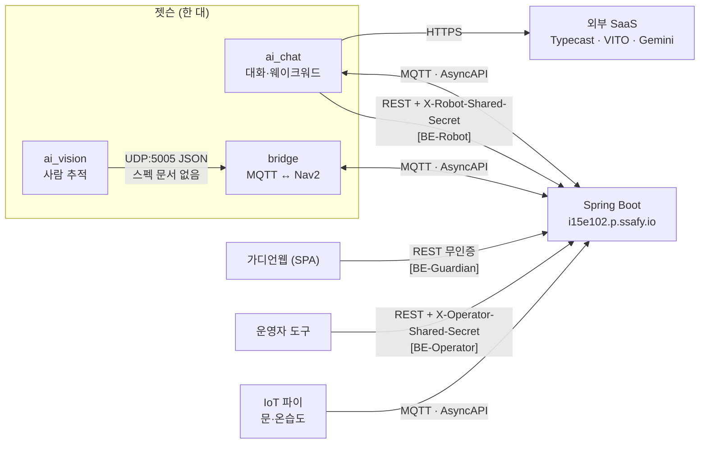
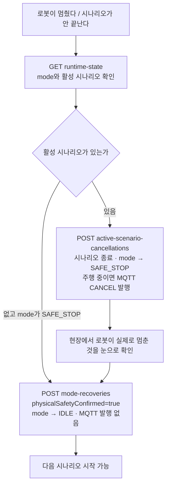

# API·메시지 계약 문서

## 1. 목적

BOMI의 서비스 간 계약을 한 진입점에서 열람하기 위한 안내입니다. REST의 기계 판독 계약은 OpenAPI로, MQTT의 기계 판독 스펙은 AsyncAPI로 관리하며 두 문서는 서로 링크로 오갈 수 있습니다. 다만 5개 시나리오 메시지의 최종 기준은 [`../mqtt/scenario-contract-v1.md`](../mqtt/scenario-contract-v1.md)이며, AsyncAPI나 설명 문서와 충돌하면 시나리오 계약 v1을 우선합니다.

OpenAPI와 AsyncAPI의 브라우저 렌더링용 스펙 파일은 Spring Boot 정적 리소스 디렉터리에서 각각 한 벌만 관리합니다. 이는 동일 스펙의 YAML·JSON 사본을 이중 관리하지 않는다는 뜻이며, 시나리오 메시지 의미의 계약 우선순위는 위 기준을 따릅니다.

### 한 장으로 보는 이음새

아래 표들은 모두 이 그림의 각주입니다. **누가 무엇으로 붙어 있는지**가 먼저 보여야 합니다.



## 2. 도메인별 문서 위치

| 도메인 | 무엇을 보는가 | 어디서 보는가 |
| --- | --- | --- |
| Backend — 로봇·AI 채널 | 로봇(`ai_chat`)이 호출하는 REST API | Swagger UI → `[BE-Robot] 로봇·AI 채널 API` |
| Backend — 가디언웹 채널 | 가디언웹이 호출하는 REST API | Swagger UI → `[BE-Guardian] 가디언웹 채널 API` |
| Backend — 운영자 채널 | 현장 안전 확인 뒤 시나리오를 강제 종료하거나 Robot mode를 복구하는 제한 API 3종 | Swagger UI → `[BE-Operator] 운영자 안전 복구 API` |
| Backend — 전체 | 위 세 채널과 운영용 엔드포인트 전부 | Swagger UI → `[BE-All] 백엔드 전체 API` |
| AI Vision (REST 안) | 인식 요청·결과 Callback 계약 | Swagger UI → `[AI-Vision] ...` (**채택되지 않은 계약** — 아래 설명) |
| AI Chat (REST 안) | 문장·TTS 생성 계약 | Swagger UI → `[AI-Chat] ...` (**채택되지 않은 계약** — 아래 설명) |
| IoT·Robot·AI 주행 | MQTT 토픽과 메시지 계약 | AsyncAPI 뷰어 `/asyncapi/mqtt/` |
| 스트리밍 (예정) | WebSocket 메시지 계약 | `/asyncapi/websocket/` (**구현체 없음**) |
| 프론트엔드 | 자체 제공 API가 없습니다 | 해당 없음 |

### AI 서비스의 REST 스펙은 왜 호출할 수 없는가

두 스펙은 "아직 안 만든 것"이 아니라 **채택되지 않은 설계**입니다. 두 AI 라인 모두
구현은 끝났지만, 계약서가 그린 HTTP 서버가 아닌 다른 이음새로 붙었습니다.

| 스펙 | 스펙이 그린 모습 | 실제로 구현된 모습 |
| --- | --- | --- |
| `vision-ai.openapi.yaml` | Spring Boot → AI Vision `POST /api/v1/recognitions` | `robot/ai_vision`이 UDP(포트 5005)로 `{status, command, track_id, reason}` JSON을 ROS2 `vision_udp_bridge`에 직접 보냅니다. HTTP 서버가 없습니다 |
| `vision-callback.openapi.yaml` | AI Vision → Spring Boot `POST /api/v1/integrations/vision/results` | 수신 컨트롤러 자체가 없습니다. 인식 결과는 백엔드로 올라가지 않고 로봇 안에서 소비됩니다 |
| `voice-ai.openapi.yaml` | Spring Boot·Robot → 자체 대화·음성 AI 서버 | `robot/ai_chat`이 외부 SaaS를 직접 호출합니다 — TTS는 Typecast, STT는 VITO, LLM은 Gemini(SSAFY GMS 프록시) |

따라서 세 스펙은 **읽을 수는 있으나 호출할 수 없고, 지금 코드의 근거도 아닙니다.**
표시명 끝의 `(계약·미구현)`은 그 표식이며, 되살릴지 폐기할지는 별도 판단이 필요합니다.

`robot/ai_chat`은 HTTP 서버가 아니라 **MQTT 소비자이자 Backend 호출자**입니다.
`ai_chat`이 **호출하는** 백엔드 API는 실제로 동작하며 `[BE-Robot]` 그룹에 있습니다.
`ai_chat`이 **구독·발행하는** 메시지는 AsyncAPI 뷰어에 있습니다.

| `ai_chat` 모듈 | 호출 대상 |
| --- | --- |
| `context_client` | `POST /api/v1/seniors/{seniorId}/conversation-context` |
| `door_client` | `POST /api/v1/seniors/{seniorId}/door-events` |
| `conversation_client` | `/api/v1/robot/conversation-events` |
| `contract_client` | `/api/v1/robot/onboarding/sessions`, `.../{sessionId}/next`, `.../{sessionId}/answers`, `/api/v1/robot/clarifications/active`, `.../{candidateId}/answer` |
| `fact_client` | `/api/v1/robot/fact-candidates`, `.../cancel` |
| `notify/backend_notifier` | `/api/v1/robot/guardian-alerts` |

### 채널별 인증 — Swagger `Try it out`이 배포에서 실패하는 이유

| 채널 | 필요한 헤더 | Swagger UI 입력란 |
| --- | --- | --- |
| `[BE-Robot]` (`/api/v1/robot/**`, `/api/v1/seniors/**`) | `X-Robot-Shared-Secret` | **없음** |
| `[BE-Guardian]` | 없음 | 해당 없음 |
| `[BE-Operator]` | `X-Operator-Shared-Secret` | 있음 |

`ROBOT_SHARED_SECRET`이 설정된 배포에서는 로봇 채널이 헤더 없이는 `401`입니다. 그런데 이
헤더에는 OpenAPI `@SecurityScheme`이 없어 Swagger UI에 입력란조차 나오지 않습니다(스킴이
선언된 것은 운영자 채널뿐입니다). 결과적으로 **`[BE-Robot]` 그룹은 GET이라도 배포 환경의
Swagger에서 401로 실패합니다.** 계약을 읽는 용도로만 쓰고, 실제 호출은 로봇 런타임이나
헤더를 직접 붙일 수 있는 도구로 하십시오.

## 3. 팀 공용 배포 주소

진입점은 `/docs/` 하나입니다. 여기서 세 문서로 전부 갈 수 있습니다.

```text
https://i15e102.p.ssafy.io/docs/
├── HTTP API
│   └── /swagger-ui/index.html
└── Event/Streaming API
    ├── /asyncapi/mqtt/
    └── /asyncapi/websocket/
```

문서 주소와 실제 통신 주소는 다릅니다.

| 프로토콜 | 실제 통신 주소 | 상태 |
| --- | --- | --- |
| HTTP | `https://i15e102.p.ssafy.io/api/v1/...` | 동작 |
| WebSocket | `wss://i15e102.p.ssafy.io/api/v1/ws` | 미구현 |
| MQTT | `mqtts://i15e102.p.ssafy.io:8883` | 동작 |

개별 스펙 파일도 같은 배포 서버에서 받을 수 있습니다.

```text
/openapi/vision-ai.openapi.yaml
/openapi/vision-callback.openapi.yaml
/openapi/voice-ai.openapi.yaml
/openapi/bomi-mqtt.asyncapi.yaml
/openapi/bomi-mqtt.asyncapi.json
```

Swagger UI의 `Try it out`은 **GET에만 허용됩니다.** POST·PUT·PATCH·DELETE 계약은 문서에 보이지만 실행 버튼은 비활성입니다. 운영자 채널 API는 별도 shared-secret 인증이 필요한 POST이며, 실물 환경에서는 Swagger가 아니라 통제된 운영 도구로만 호출합니다. 그 도구는 **이미 만들어져 배포돼 있습니다** — `backend/tools/operator_console`(Streamlit)이 basic auth 뒤 `/operator-console/` 경로에 있고, `OPERATOR_SHARED_SECRET`은 그 컨테이너가 쥡니다. 새로 만들지 말고 이것을 쓰십시오.

MQTT와 WebSocket은 HTTP가 아니라 브라우저에서 발행·구독 시험을 할 수 없습니다. 두 페이지는 계약 열람 전용입니다.

배포 문서는 배포된 Backend 이미지에 포함된 파일이므로, 최신 Git 변경은 Backend가 다시 배포된 뒤 반영됩니다.

### 운영자 채널 API 3종

운영자 채널에는 엔드포인트가 세 개 있고, **순서가 곧 설명**입니다. 조회로 상태를 확인하고,
필요하면 시나리오를 강제로 끝내고(이때 mode는 `SAFE_STOP`이 됩니다), 현장에서 물리 안전을
확인한 뒤에야 `IDLE`로 되돌립니다.



| 엔드포인트 | 하는 일 | mode 변화 | MQTT |
| --- | --- | --- | --- |
| `GET /api/v1/operator/robots/{deviceId}/runtime-state` | 현재 mode와 활성 시나리오 조회 | 없음 | 없음 |
| `POST /api/v1/operator/robots/{deviceId}/active-scenario-cancellations` | 끝나지 않는 시나리오를 강제 종료 | → `SAFE_STOP` | 주행 중이면 `CANCEL` 발행 |
| `POST /api/v1/operator/robots/{deviceId}/mode-recoveries` | 안전 확인 뒤 정상 복귀 | → `IDLE` | 발행하지 않음 |

절차의 자세한 내용은 [`../scenario/operator-navigation-cancellation.md`](../scenario/operator-navigation-cancellation.md)에 있습니다.

#### mode 복구 API 상세

```http
POST /api/v1/operator/robots/{deviceId}/mode-recoveries
X-Operator-Shared-Secret: <운영 환경의 별도 secret>
Content-Type: application/json

{
  "physicalSafetyConfirmed": true,
  "reason": "현장 점검 후 이동 경로와 모터 상태 확인"
}
```

이 API는 다음 조건을 모두 만족할 때 Robot mode를 `IDLE`로만 복구합니다.

- Robot이 등록·활성 상태이고 어르신이 배정되어 있음
- 활성 Scenario가 없음
- 현재 mode가 `SAFE_STOP`, 또는 활성 Scenario 없이 남은 비정상 `SCENARIO_ACTIVE`
- 현장 담당자가 실제 장치의 안전을 확인했고 `physicalSafetyConfirmed=true`로 요청함
- 감사 이력에 남길 비어 있지 않은 `reason`이 있음

이미 `IDLE`이면 멱등 no-op입니다. 복구는 MQTT 이동·취소 명령을 발행하지 않으며 서버의 `OPERATOR_ID`를 감사 이력에 기록합니다. 배포 환경의 `OPERATOR_SHARED_SECRET` 또는 `OPERATOR_ID`가 비어 있으면 fail-closed로 `503`을 반환하고, `X-Operator-Shared-Secret`이 일치하지 않으면 `401`을 반환합니다.

> **실물 환경에서 Swagger `Try it out`으로 이 API를 호출하지 않습니다.** 먼저 Robot 담당자가 현장에서 물리 안전을 확인해야 합니다. 이 API는 실제 E-stop 해제, 모터 정지 또는 이동 경로 안전 확인을 대신하지 않습니다. 활성 Scenario가 있으면 mode를 강제로 바꾸지 말고 시나리오를 정상 종료하거나 원인을 조사합니다.

## 4. 스펙 목록

| 스펙 | 형식 | 호출·전달 방향 | 표현·구현 원본 |
| --- | --- | --- | --- |
| 로봇·AI 채널 API | OpenAPI (자동생성) | Robot·AI → Spring Boot | 컨트롤러 코드 |
| 가디언웹 채널 API | OpenAPI (자동생성) | 가디언웹 → Spring Boot | 컨트롤러 코드 |
| 운영자 채널 API | OpenAPI (자동생성) | 인증된 운영자 → Spring Boot | 컨트롤러 코드 |
| AI Vision 인식 요청 | OpenAPI (수기) | Spring Boot → AI Vision | [`vision-ai.openapi.yaml`](../../backend/src/main/resources/static/openapi/vision-ai.openapi.yaml) |
| AI Vision 결과 Callback | OpenAPI (수기) | AI Vision → Spring Boot | [`vision-callback.openapi.yaml`](../../backend/src/main/resources/static/openapi/vision-callback.openapi.yaml) |
| 대화·음성 생성 | OpenAPI (수기) | Spring Boot·Robot → 대화·음성 AI | [`voice-ai.openapi.yaml`](../../backend/src/main/resources/static/openapi/voice-ai.openapi.yaml) |
| MQTT 메시지 계약 | AsyncAPI (수기) | IoT·Robot·AI ↔ Spring Boot | 기계 판독: [`bomi-mqtt.asyncapi.yaml`](../../backend/src/main/resources/static/openapi/bomi-mqtt.asyncapi.yaml), 의미 기준: [`scenario-contract-v1.md`](../mqtt/scenario-contract-v1.md) |

관련 문서:

- 5개 시나리오 메시지 최종 계약: [`../mqtt/scenario-contract-v1.md`](../mqtt/scenario-contract-v1.md)
- MQTT 공통 토픽·봉투 규칙: [`../mqtt/topic-convention.md`](../mqtt/topic-convention.md)
- 시나리오: [`../scenario/homecoming-welcome.md`](../scenario/homecoming-welcome.md)

## 5. 네이밍 규칙

### 스펙 파일명

```text
<domain>-<service>.openapi.yaml    REST 계약
<domain>.asyncapi.yaml             메시지 계약
```

### 드롭다운 표시명

도메인 접두어를 대괄호로 붙입니다. 접두어가 없으면 어느 도메인의 계약인지 목록에서 구분되지 않습니다.

```text
[BE-Robot]     백엔드 · 로봇·AI 채널
[BE-Guardian]  백엔드 · 가디언웹 채널
[BE-Operator]  백엔드 · 운영자 안전 복구
[BE-All]       백엔드 · 전체
[AI-Vision]    AI Vision
[AI-Chat]      대화·음성 AI
[MQTT]         메시지 계약
```

구현체가 아직 없는 계약은 표시명 끝에 `(계약·미구현)`을 붙이고 스펙 `info.description` 첫 문단에도 같은 사실을 적습니다.

### 컨트롤러 태그

모든 `@RestController`에 `@Tag`를 붙이고 **description에 호출 주체를 적습니다.**

```java
@Tag(name = "Robot Door Event", description = "현관 이벤트 전달 — 로봇(ai_chat door_client)이 호출합니다.")
```

`OpenApiDocumentationTest.everyControllerDeclaresATagNamingItsCaller` 가 이를 강제합니다. 태그를 빠뜨리면 springdoc이 클래스명으로 기본 태그를 만들어 주기 때문에 Swagger는 멀쩡해 보이고, "이 API를 누가 호출하는가"라는 정보만 조용히 사라집니다.

## 6. 새 스펙을 추가할 때 수정할 곳

정적 스펙 파일을 하나 추가하면 **세 곳**을 함께 고칩니다. 하나라도 빠지면 배포에서 404가 나거나 드롭다운에 나타나지 않습니다.

1. `backend/src/main/resources/application.yml` — `springdoc.swagger-ui.urls`에 표시명과 경로를 추가합니다.
2. `infra/nginx/conf.d/bomi.conf` — 문서 `location` 정규식의 허용 목록에 파일명을 추가합니다.
3. `docs/api/README.md` — 위 2절 표와 4절 표에 한 줄씩 추가하고, **11절의 노출 경로 목록에도** 추가합니다(그 목록은 nginx 허용 목록의 사본이라 빠뜨리면 문서가 곧바로 거짓이 됩니다).

`springdoc.group-configs`로 만든 **그룹**은 `swagger-ui.urls`에 적지 않습니다. springdoc이 `display-name`으로 이미 드롭다운에 넣으므로, 또 적으면 같은 항목이 두 번 뜹니다. `OpenApiDocumentationTest.dropdownHasNoDuplicateEntries` 가 이를 잡습니다.

새 API 채널이 생겨 그룹을 추가할 때는 `group-configs`에 `paths-to-match`와 함께 등록하고, `OpenApiDocumentationTest.channelGroupsContainOnlyTheirOwnPaths` 에 확인을 추가합니다.

## 7. 로컬 문서 확인

PostgreSQL 없이 실행할 수 있는 `docs` Profile을 사용합니다.

Windows PowerShell:

```powershell
cd backend
.\gradlew.bat bootRun --args="--spring.profiles.active=docs"
```

macOS 또는 Linux:

```bash
cd backend
./gradlew bootRun --args='--spring.profiles.active=docs'
```

실행 후 다음 주소를 엽니다.

```text
http://localhost:8080/docs/
http://localhost:8080/swagger-ui.html
http://localhost:8080/asyncapi/mqtt/
http://localhost:8080/asyncapi/websocket/
```

PowerShell에서 드롭다운 구성을 확인할 수도 있습니다.

```powershell
$config = Invoke-RestMethod http://localhost:8080/v3/api-docs/swagger-config
$config.urls | Format-Table name, url
```

`docs` Profile은 문서 확인만을 위한 Profile입니다. 실제 API·DB 연동 테스트에는 사용하지 않습니다.

### 실제 개발 환경 실행

Backend 기능과 함께 확인하려면 PostgreSQL을 먼저 실행하고 기본 Profile로 Backend를 시작합니다.

```powershell
docker compose up -d postgres
cd backend
.\gradlew.bat bootRun
```

## 8. 계약 읽는 방법

각 OpenAPI 명세에는 다음 내용이 포함되어 있습니다.

- 호출 주체와 대상 서버
- 요청·응답 필수 필드
- 정상 및 실패 응답 예시
- 내부 서비스 인증 방식
- 멱등성 식별자
- enum과 필드 길이 제한
- 오류 응답 형식

AsyncAPI 명세에는 토픽 주소, 발행자·구독자, 메시지별 필드표와 예시가 포함되어 있습니다.

문서를 제공하는 주소와 각 API를 실제로 호출하는 주소는 구분합니다.

- Vision Callback 스펙은 수신 주소로 배포 Backend인 `https://i15e102.p.ssafy.io`를 적고 있지만, **그 컨트롤러는 아직 없습니다** — `/api/v1/integrations/vision/results`는 백엔드에 구현되어 있지 않습니다.
- AI Vision과 대화·음성 AI의 **REST 서버**는 만들지 않았고 앞으로도 계획이 없습니다(2절 참고). 명세의 `localhost` 주소는 채택되지 않은 설계의 예시입니다.
- AI 서버의 실제 주소와 인증정보는 환경변수 또는 비밀 저장소로 주입하며 Git에 저장하지 않습니다.

## 9. 변경 규칙

계약을 변경할 때는 다음 순서를 따릅니다.

1. 5개 시나리오 메시지를 바꾼다면 [`../mqtt/scenario-contract-v1.md`](../mqtt/scenario-contract-v1.md)를 먼저 수정합니다.
2. 시나리오 상태와 호출·전달 방향에 미치는 영향을 확인합니다.
3. `backend/src/main/resources/static/openapi/`의 기계 판독 스펙을 수정합니다.
4. 요청·응답 예시와 오류 응답을 함께 수정합니다.
5. MQTT와 REST에서 사용하는 `eventId`, `scenarioId`, `requestId`, `commandId`, `robotId`의 생성 주체와 의미가 일치하는지 확인합니다.
6. MQTT 계약을 바꿨다면 `scenario-contract-v1.md`, `bomi-mqtt.asyncapi.yaml`, `docs/mqtt/topic-convention.md`를 **함께** 고칩니다. `AsyncApiDocumentationTest.everyDocumentedTopicExistsInTheMarkdownContract` 는 AsyncAPI 토픽이 최종 시나리오 계약에 빠지지 않았는지 검사합니다.
7. `./gradlew test --tests "com.ssafy.bomi.docs.*"` 로 문서 검사를 통과하는지 확인합니다.
8. Robot·AI·Backend 담당자에게 계약 변경 리뷰를 요청합니다.

스펙 원본을 `docs/api/`에 복사해서 이중 관리하지 않습니다.

## 10. AsyncAPI 뷰어에 대한 설계 메모

MQTT 계약은 Swagger UI에서 볼 수 없습니다. OpenAPI 3.x는 HTTP 전용이라 토픽·QoS·발행자/구독자를 표현할 문법이 없습니다. 억지로 `paths`에 넣으면 호출 가능한 REST처럼 보여 오해를 만듭니다.

그래서 별도의 정적 뷰어(`/asyncapi/mqtt/`)를 두되 **새 서버나 새 도메인은 만들지 않았습니다.** Swagger UI와 같은 Backend에서, 같은 주소 아래에서, 서로 링크로 오갑니다.

뷰어는 외부 라이브러리를 쓰지 않는 순수 HTML·CSS·JS입니다. 운영 Nginx의 CSP가 `script-src 'self'`이므로 CDN 렌더러는 차단되고, 번들을 저장소에 넣을 Node 빌드 단계도 없기 때문입니다.

AsyncAPI 뷰어가 렌더링하는 기계 판독 스펙의 원본은 YAML 하나이며, 브라우저가 읽을 JSON은 `AsyncApiSpecController`가 같은 파일을 변환해 내려줍니다. JSON 사본을 따로 커밋하면 두 파일을 맞춰야 하므로 그렇게 하지 않았습니다. 이 단일 원본 원칙은 YAML·JSON 표현에 관한 것이며, 5개 시나리오 메시지 의미의 최종 기준은 [`../mqtt/scenario-contract-v1.md`](../mqtt/scenario-contract-v1.md)입니다.

## 11. 배포 노출 정책

운영 Nginx는 팀 공용 계약 열람을 위해 다음 경로만 Backend로 전달합니다.

```text
/swagger-ui.html
/swagger-ui/**
/docs/
/asyncapi/mqtt/
/asyncapi/mqtt/renderer.js
/asyncapi/websocket/
/asyncapi/style.css
/v3/api-docs/swagger-config
/v3/api-docs/bomi-robot
/v3/api-docs/bomi-guardian
/v3/api-docs/bomi-operator
/v3/api-docs/bomi-backend
/openapi/vision-ai.openapi.yaml
/openapi/vision-callback.openapi.yaml
/openapi/voice-ai.openapi.yaml
/openapi/bomi-mqtt.asyncapi.yaml
/openapi/bomi-mqtt.asyncapi.json
```

- 문서와 스펙은 조회 전용이며 GET·HEAD 이외의 요청은 거부합니다.
- 자동 생성 API 문서의 그룹 없는 `/v3/api-docs`는 외부에 공개하지 않습니다.
- 현재 문서 경로에는 별도 로그인이 없으므로 공개 가능한 계약과 예시만 작성합니다.
- 스펙과 예시에는 실제 서비스 토큰이나 비밀번호를 기록하지 않습니다.
- 문서에 새 스펙을 추가하면 6절의 세 곳을 함께 변경합니다.

## 12. 남은 합의 항목

- [ ] 모든 서비스가 타임존을 포함한 ISO 8601 시각을 사용함
- [ ] 내부 서비스 토큰을 저장소가 아닌 환경변수 또는 비밀 저장소로 주입함

> 원래 이 목록에는 네 항목이 더 있었습니다 — AI Vision의 `requestId` 반환과 결과 enum 합의,
> 대화·음성 AI의 멱등 응답, `audioUri` 접근 방식. 넷 다 **REST 경로를 전제로 한 항목**인데
> 그 경로는 채택되지 않았으므로(2절 참고) 합의할 대상이 사라졌습니다. REST 스펙을 되살리기로
> 결정한다면 그때 함께 되살리십시오.
