# 아키텍처 장표 모음

> 팀 Miro 보드의 장표를 저장소로 가져온 것입니다. 원본 보드:
> https://miro.com/app/board/uXjVPMaJRWc=/
>
> **정본은 코드입니다.** 모든 장표는 2026-08-16에 `main` 코드와 전수 대조해 정정했습니다
> (시나리오 워치독 10분, waypoints 실측 좌표, SPEAK 발행 0건 등). 코드가 바뀌면 이 문서와
> Miro 보드를 함께 갱신하십시오.
>
> 읽는 순서: 전경 한 장(X) → 배포 토폴로지(A) → 기술 스택(H) → MQTT 배선(B) →
> 백엔드 내부(E) → ai_chat 내부(D) → 상태·안전(F) → 시나리오 4장(C1~C4) → 로컬 저장소(G)

## X. 시스템 전경 — 센서에서 모터까지 한 장

센서(파이) → 브로커 → 백엔드(EC2) → 젯슨(대화·비전·주행) → 하드웨어(Pico·모터)로 이어지는
전 구간입니다. 실선 화살표는 실제로 오가는 경로이고, 점선은 기본 설정에서 꺼져 있는 경로입니다.

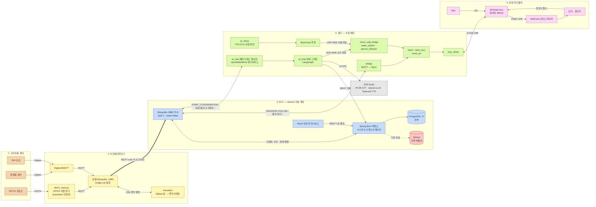

## A. 배포 토폴로지 — 기계와 프로세스

어느 기계에서 어떤 프로세스가 돌고, 무엇이 자동 배포이고 무엇이 수동인지입니다.
CI/CD가 배포하는 것은 EC2의 백엔드·프런트엔드·브로커뿐이고, 젯슨과 라즈베리파이는
`main`을 직접 checkout 해 수동 배포합니다.

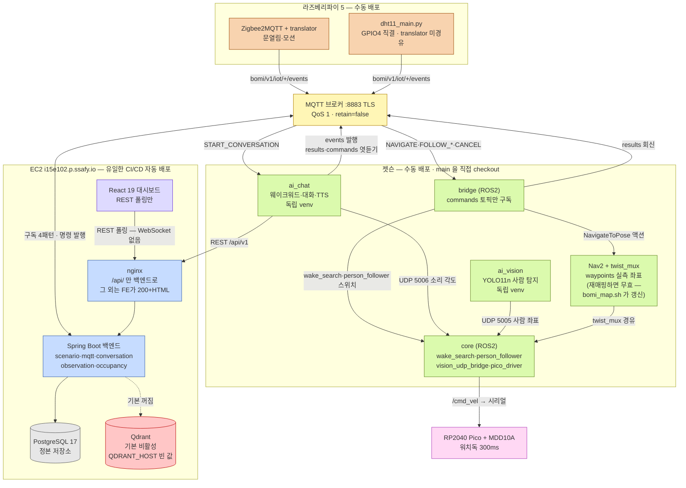

## H. 기술 스택 — 매니페스트 기준

각 라인이 실제 매니페스트(package.json·build.gradle·pyproject·requirements)에 선언한
것만 담았습니다. 붉은 상자는 팀이 이미 밟았던 함정입니다.

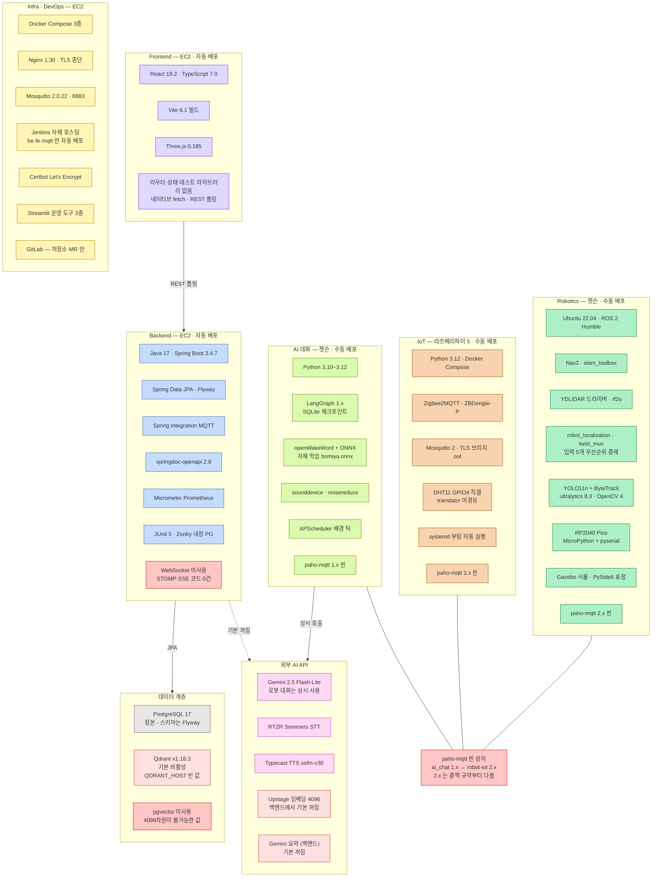

## B. MQTT 토픽 배선 — 코드가 기준

브로커를 지나는 토픽은 6개뿐입니다. 점선은 "엿듣기"(구독하지만 그 채널의 주인이 아님)이고,
아래 규칙 상자들은 어기면 **에러 응답 없이 조용히 폐기**되는 것들입니다.

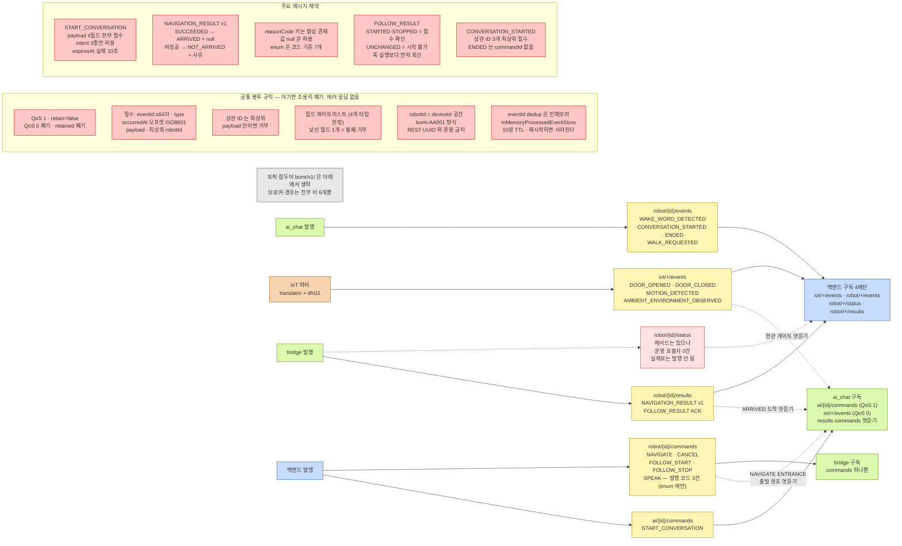

## E. 백엔드 내부 — 모듈과 DB

MQTT 파서에서 오케스트레이터를 지나 DB까지, 백엔드 안의 실제 배선입니다.

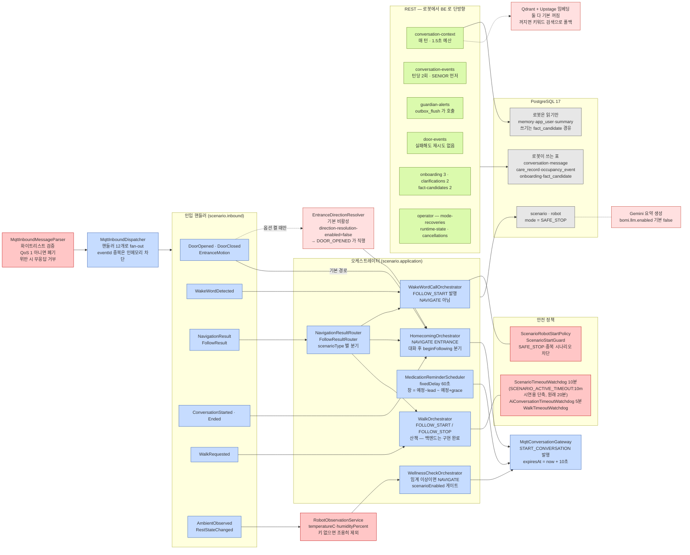

## D. ai_chat 내부 — 스레드와 그래프

마이크는 한 스레드만 쥘 수 있어서, MQTT 수신·도착 감시·환호는 각자 스레드로 돌고
실제 대화는 전부 메인 루프의 LangGraph 파이프라인을 지납니다.

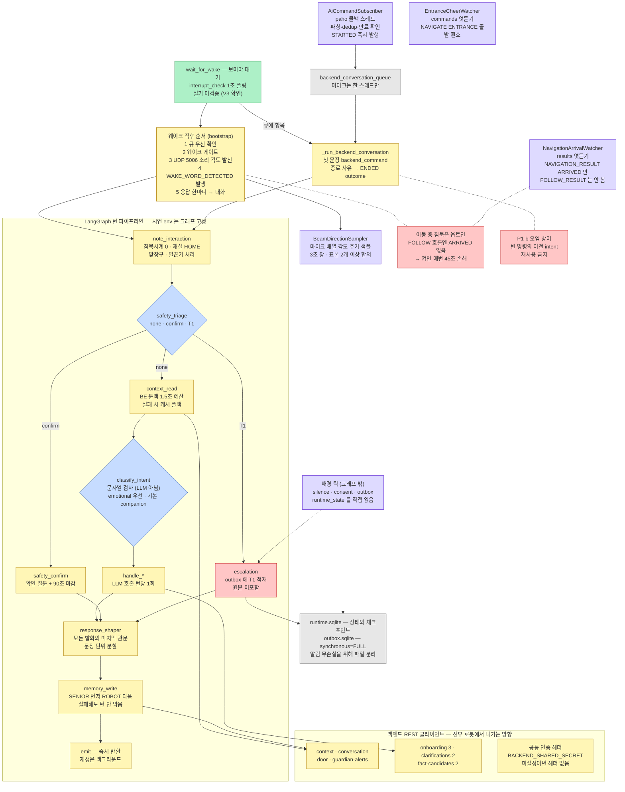

## F. 상태·안전 — SAFE_STOP과 타임아웃

`COMPLETED`가 아닌 모든 시나리오 종료는 로봇을 `SAFE_STOP`으로 잠급니다.
자동 복구 경로는 없고, 해제 수단은 운영자 REST와 `reset-demo.sql` 둘뿐입니다.

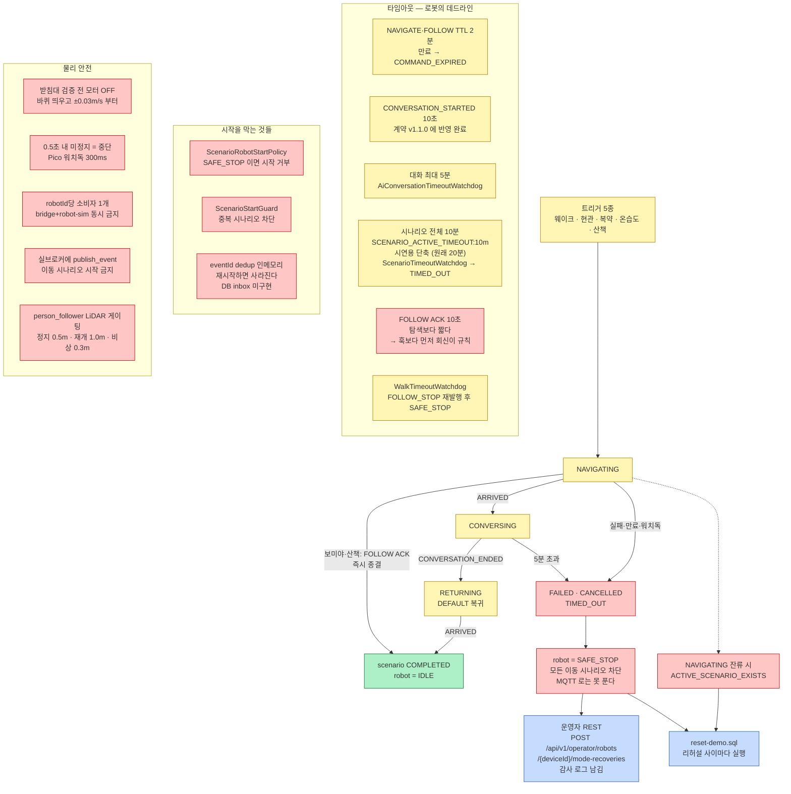

## C1. 보미야 호출 — FOLLOW_START 방식

고정 좌표로 이동하는 시나리오가 아닙니다. 백엔드는 `FOLLOW_START`를 내리고 즉시 종결하며,
회전 탐색과 접근은 전부 로봇 내부에서 — 그것도 킬 스위치를 켠 경우에만 — 일어납니다.

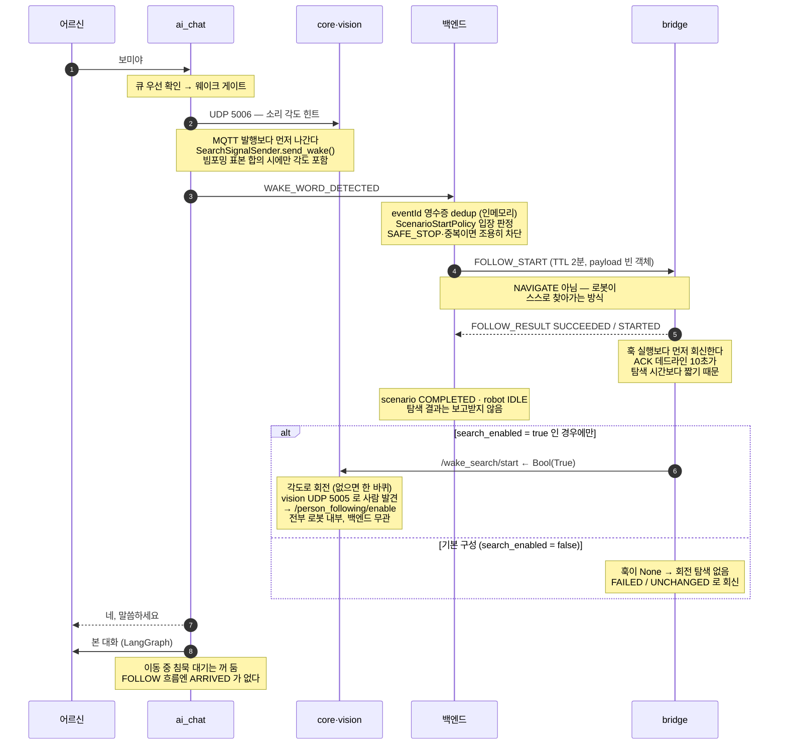

## C2. 현관 인사

문 열림 이벤트 하나로 시작합니다. 방향 판정은 기본 꺼짐이라, 기본 구성에서는
`DOOR_OPENED`가 곧바로 귀가 시나리오를 엽니다.

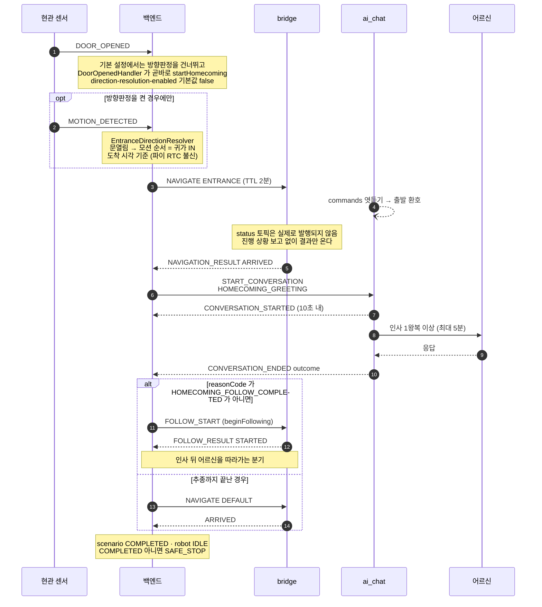

## C3. 복약 알림

로봇이 시계를 보는 것이 아니라, 백엔드 스케줄러가 1분마다 복약 창을 검사해
시나리오를 엽니다.

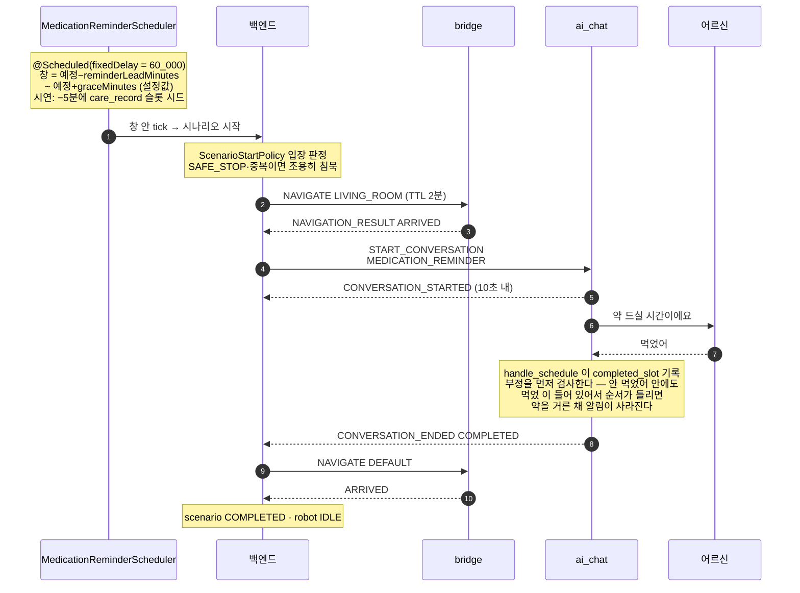

## C4. 온습도 안부

DHT11이 30초마다 읽어 올리고, 백엔드가 임계(30.0℃ 또는 80.0% **이상**)를 판정합니다.

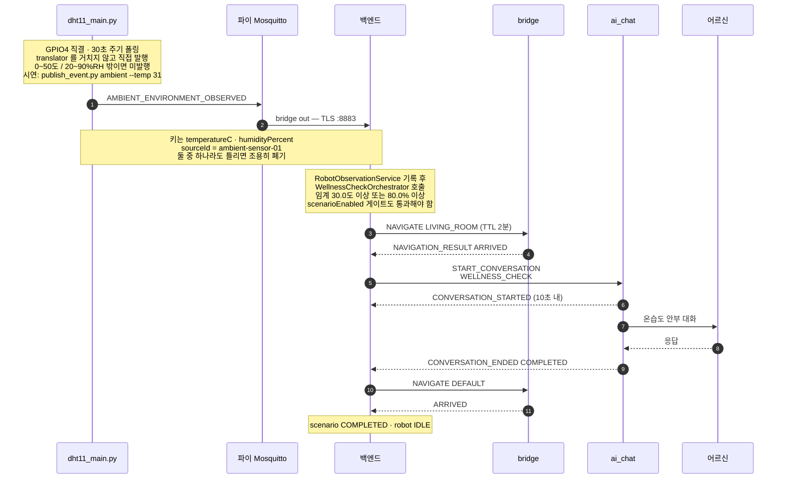

## G. 로봇 로컬 저장소 — 두 개의 SQLite

같은 SQLite인데 파일이 둘인 이유: 보호자 알림(outbox)만은 전원이 끊겨도 잃으면
안 되기 때문입니다.

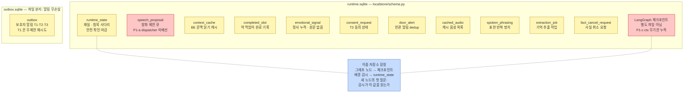
