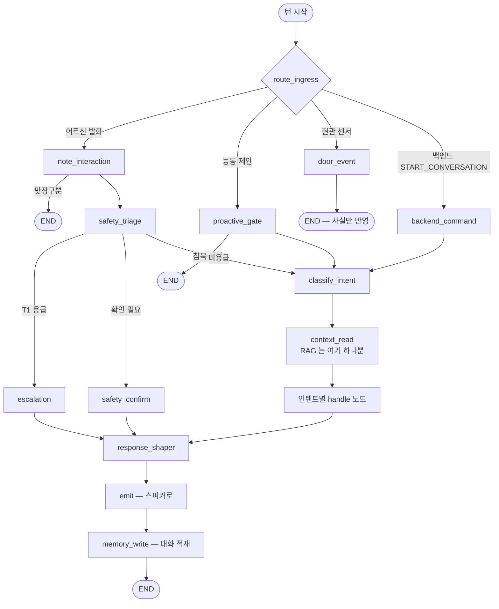
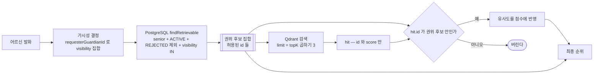

# LangGraph·RAG·벡터 검색·메모리 런타임 감사 보고서

> **2026-08-06 시점의 스냅샷입니다.** 판정 본문은 2026-08-16 재확인에서 대부분 그대로
> 유효했으나, 달라진 항목은 §10 "재확인 로그"에 적었습니다. 그 이후의 코드 변경은 이
> 문서에 반영돼 있지 않습니다.

- 기준일: 2026-08-06 / 마지막 재확인: 2026-08-16
- 대상: `robot/ai_chat`의 대화 런타임과 Spring Boot backend의 문맥·기억·요약·문서 검색
- 감사 당시 작업 브랜치: AI·backend 각각의 RAG 강화 브랜치. **두 브랜치 모두 스쿼시 머지
  뒤 정리되어 지금은 원격에서 찾을 수 없다.** 이 문서의 판정은 `main`에서 §9의 "주요 구현
  근거"에 적힌 파일 경로로 확인한다 — 커밋 해시가 아니라 파일이 좌표다.
- 판정 원칙: 선언된 의존성이나 클래스 존재가 아니라 **기본 진입점에서 호출되는가**, 실제
  응답과 프롬프트까지 이어지는가, 실패가 관측되는가, 자동화 테스트가 있는가로 판단했다.

## 1. 결론

LangGraph는 로봇의 기본 대화 런타임이다. 반면 LangChain은 직접 의존성·애플리케이션
import·호출 경로가 없으므로 현재 활용도와 영향도는 0이다. 이 프로젝트의 RAG는
LangChain 체인이 아니라 `LangGraph -> backend HTTP -> PostgreSQL 권위 후보 ->
Qdrant 재정렬/키워드 폴백 -> 프롬프트`로 구성된 맞춤형 2-Step RAG다.

문서 RAG와 메모리 검색은 E2E 대화 흐름에 연결됐다. 다만 의미 검색은 배포 기본값이
꺼져 있고, 실제 Upstage 키와 Qdrant가 모두 준비된 경우에만 실행된다. 따라서 “Qdrant
코드가 있다”와 “운영 턴에서 의미 검색이 사용됐다”는 같은 사실이 아니다. 이 감사에서
그 차이를 `availability`(조립 시점의 기능 가용성)와 요청별 `retrieval`(이번 요청이 실제로
실행한 것) 두 층으로 분리해 API·로봇 상태·로그·메트릭에 노출하도록 고쳤다. 무료 검증에서는
공식 Qdrant 1.18.3 서버와 결정적 4096차원 임베딩을 사용해 AI Python 프로세스부터 Spring
HTTP, PostgreSQL, Qdrant, 다음 턴 프롬프트까지 실제 교차 모듈 E2E를 통과시켰다. 유료
Upstage 호출과 현장 음성·MQTT는 이 검증에 포함되지 않는다.

| 기술/기능 | 런타임 실제 사용 | 현재 활용도 | 실제 영향 | 근거와 판정 |
|---|---|---:|---|---|
| LangChain | 없음 | 0% | 없음 | `pyproject.toml` 직접 의존성 없음, `src/`·`tests/` import 없음. 추가하지 않는 것이 맞다. |
| LangGraph | 기본 활성화 | 높음 | 모든 반응형/능동형 대화의 분기·상태·체크포인트 | `USE_GRAPH_RUNTIME` 기본 `true`; `StateGraph`, `SqliteSaver`; `build_graph()` 결과를 턴 진입점이 invoke한다. |
| RAG | 실제 연결 | 중~높음 | 개인화 기억·요약 및 복지 정보가 LLM 프롬프트에 유입 | 정보 의도 분류 후 `includeDocuments=true`; backend 문맥 응답을 `context_read`와 prompt builder가 소비한다. |
| 벡터 임베딩 | 조건부 실행 | 기본 0, 활성 시 높음 | 기억/요약 의역 검색 및 재색인 비용 | `EMBEDDING_ENABLED=false` 기본. 후보가 있을 때 질의당 query 임베딩 최대 1회; sync 행당 passage 1회. |
| Qdrant | 조건부 실행 | 기본 0, 활성 시 높음 | PostgreSQL 후보의 순위만 변경 | host·임베딩 모두 가용할 때만 사용. content/권한의 원장이 아니며, hit ID가 권위 후보 밖이면 버린다. |
| PostgreSQL 장기 기억 | 실제 연결 | 높음 | 프로필·기억·대화 요약의 권위 데이터 | senior/lifecycle/verification/visibility를 먼저 필터링하고 keyword/semantic/importance/recency를 결합한다. |
| `conversation_summary` 벡터 | 실제 연결 | 중간 | 최근 대화와 다른 의역 질문의 요약 회수 | 같은 query vector로 별도 collection을 검색하고 권위 summary 후보만 재정렬한다. write-only가 아니다. |
| 번들 복지 코퍼스 | 기본 활성화 | 정보 턴에서 높음 | 출처가 있는 무료 정보 응답 | `welfare-corpus.json`을 로컬 lexical 검색하며 source/version/chunk/citation/url을 보존한다. |
| SentenceTransformer 라우터 | 운영 제거 | 0% | 약 732MB 상주와 6초대 초기화를 제거 | 60건 고정 평가에서 정확도 이득이 없어 `router-eval` 선택 의존성으로 이동했다. |

“현재 활용도”는 이 체크아웃의 코드 및 기본 설정 판정이다. 실제 배포 환경변수와
Prometheus 시계열에는 접근하지 않았으므로 운영 트래픽의 사용률로 오해하면 안 된다.

## 2. 턴의 흐름

### 2.1 그래프 위상 — 네 갈래 진입과 공통 파이프라인

턴은 네 갈래로 들어와 한 파이프라인으로 합류한다. RAG 는 그중 `context_read` 한
노드에서만 일어난다.

응급 T1(`escalation`)과 확인 응답(`safety_confirm`)이 `classify_intent`·`context_read`를
**건너뛴다**는 점이 이 그림의 핵심이다. 긴급 응답이 외부 검색이나 LLM 의 성공에
의존해서는 안 된다. `emit`이 `memory_write`보다 먼저인 것도 같은 이유다 — 응답 재생이
블로킹 기록 API 뒤에 줄 서지 않는다.

시연 4개 시나리오 중 3개(현관 인사·복약 알림·온습도 안부)가 `backend_command` 갈래로
들어온다. 아래 2.2 가 그리는 것은 그중 반응형 한 갈래의 내부다.

### 2.2 검색 한 번의 내부 — `context_read` 안에서 일어나는 일

```mermaid
flowchart LR
    A["사용자 발화 / STT"] --> B["LangGraph safety_triage"]
    B -->|"비응급"| C["classify_intent (로컬 규칙)"]
    B -->|"T1"| X["확인·긴급 응답"]
    C --> D["context_read"]
    D --> E["BackendContextClient POST /conversation-context"]
    E --> F["Spring ConversationContextService"]
    F --> G["PostgreSQL 권위 후보 선필터"]
    G --> H["query embedding 1회 (조건부)"]
    H --> I["Qdrant memory + conversation_summary"]
    I --> J["권위 후보 안에서만 재정렬"]
    F --> K["번들 복지 코퍼스 (info만)"]
    J --> L["retrieval 실제 결과 + 기억·요약"]
    K --> L
    L --> M["로봇 RetrievalStatus + 프롬프트"]
    M --> N["LLM handler"]
    N --> O["response_shaper"]
    O --> P["emit / TTS dispatch"]
    P --> Q["memory_write / 대화 적재"]
    Q --> R["백그라운드 사실 추출·요약·재색인"]
```

핵심 순서는 `classify_intent -> context_read`다. 이전 순서는 정보 의도를 알기 전에
문맥 API를 호출해 “복지제도 알려줘”도 `includeDocuments=false`가 됐다. 현재는 info
의도에서만 문서를 요청하며, backend가 반환한 문서 근거와 검색 저하 상태가 최종
프롬프트까지 유지된다.

응급 T1은 이 흐름을 의도적으로 우회한다. 긴급 확인 응답을 외부 검색·LLM 성공에
의존시키지 않는 안전 설계다. `emit`도 블로킹 가능한 `memory_write`보다 먼저라서
응답 재생이 기록 API 뒤에 대기하지 않는다.

## 3. 기술별 상세 판정

### 3.1 LangChain

애플리케이션 코드에서 사용하지 않는다. 강의/skill 참고 문서에 문자열이 존재하지만
런타임 근거가 아니다. 현재 흐름은 고정 그래프와 명시적 HTTP/검색 adapter로 충분하며,
LangChain을 추가하면 기능 없이 의존성과 추적 표면만 늘어난다.

기대효과가 생길 수 있는 시점은 다수 provider·retriever를 표준 Runnable로 교체해야
하고 그 중복 비용이 측정됐을 때뿐이다. 지금은 도입하지 않는 것이 우선안이다.

### 3.2 LangGraph

`langgraph`와 SQLite checkpointer가 직접 의존성이고 `USE_GRAPH_RUNTIME=true`가
기본이다. 어르신 ID가 `thread_id`이며 침묵 단계·대화 ID 등 상태가 재부팅과 턴을
넘어 유지된다. 테스트는 실제 compiled graph를 invoke해 조건 분기와 대화 턴을
검증한다.

실제 영향은 크다. 노드 순서 하나가 문서 검색 실행 여부를 결정했고, state에서
`conversation_id=None`을 잘못 덮으면 매 발화마다 새 대화가 열렸다. 즉 LangGraph는
장식용 orchestration이 아니라 대화 일관성과 안전 분기를 지배한다.

남은 문제는 로봇 SQLite와 backend 요청을 관통하는 분산 trace ID가 없다는 점이다.
턴 단계 로그와 backend 메트릭은 생겼지만, 한 현장 턴을 두 프로세스에서 자동으로
결합하는 tracing은 후속 과제다.

### 3.3 RAG와 문서 코퍼스

개인 기억 RAG는 PostgreSQL에서 권위 후보를 가져온 뒤 의미 점수·키워드·중요도·
최근성을 조합한다. 공개 정보 RAG는 3개의 버전 고정 복지로 청크를 로컬 검색한다.
현재 corpus 규모에서는 embedding/vector DB가 이점보다 운영비용이 크므로 lexical
검색을 택했다. 각 결과는 `source`, `version`, `chunkId`, `citation`, `url`을 유지한다.

코퍼스 근거는 복지로의 [복지멤버십 안내](https://www.bokjiro.go.kr/ssis-tbu/twatza/wmAplyMng/selectWmGdnc.do),
[노인맞춤돌봄서비스](https://www.bokjiro.go.kr/ssis-tbu/twataa/wlfareInfo/moveTWAT52011M.do?wlfareInfoId=WLF00003191&wlfareInfoReldBztpCd=01),
[독거노인·장애인 응급안전안심서비스](https://www.bokjiro.go.kr/ssis-tbu/twataa/wlfareInfo/moveTWAT52011M.do?wlfareInfoId=WLF00001093)다.

문제는 자동 갱신/만료 검증이 없고 청크가 3개뿐이라는 점이다. 정책 변경 시 snapshot
교체와 회귀셋 검토가 필요하다. 모델은 “안내가 실제 수급 결정을 뜻하지 않으며 최신
자격을 기관에서 확인해야 한다”는 제한을 포함하지만, corpus freshness 경보는 없다.

### 3.4 임베딩과 Qdrant

저장 계약을 명시적 `STORED`, `UNAVAILABLE`, `RETRYABLE_FAILURE`,
`DIMENSION_MISMATCH`로 바꿨다. 오직 `STORED` 뒤에만 DB 행을 `SYNCED`로 바꾼다.
일시 장애는 `PENDING/STALE`로 남아 재색인되고, 입력/모델 오류는 `FAILED`로 남아
무한 자동 과금을 막는다. 배치의 일부 성공은 행별 트랜잭션으로 보존한다.

검색에서는 query embedding을 한 번 만들고 memory와 summary collection에 재사용한다.
Qdrant는 UUID·score만 반환한다. stale point나 잘못된 senior payload가 있어도 그 ID가
PostgreSQL의 허용 후보 집합에 없으면 최종 문맥에 들어오지 않는다.

**의미 검색 hit 는 순위만 바꾸고 행을 추가하지 못한다.** Qdrant payload 는 색인 시점의
사본이라 낡을 수 있고, 공개 범위가 바뀐 기억이 그 사본을 근거로 보호자에게 새어나가면
안 된다. Qdrant 쪽 `seniorId` 필터는 **효율 장치이지 프라이버시 경계가 아니다.**
`retrieval.hitCount` 도 Qdrant 가 돌려준 hit 수가 아니라 이 권위 필터를 통과해 수용된
유사도의 개수다 — 대시보드를 만들 때 두 값을 같은 것으로 보면 안 된다.

실제 영향은 의미가 같은 다른 표현의 기억과 요약을 찾는 것이다. 기본 비활성화
상태에서는 한국어 조사 제거 keyword fallback이 동작하며, API가 `semanticUsed=false`
와 사유를 반환한다. 즉 저하가 침묵하지 않는다.

Qdrant 1.18.3 공식 Windows 바이너리를 실제로 띄운 뒤 collection 생성, 4096차원
upsert/search, senior 필터, 삭제·복구, 초기화 멱등성을 포함한 전용 통합 테스트 9건을
통과했다. 이어 별도 Python AI 프로세스가 Spring Boot 무작위 포트에 HTTP 요청을 보내는
교차 E2E 1건도 통과했다. 실제 Upstage는 승인·비밀값이 없어 호출하지 않았으며, 결정적
임베딩 통과를 provider 호환성·과금·실 지연 검증으로 간주하지 않는다.

### 3.5 장기 기억과 요약

memory는 `senior_id`, `ACTIVE`, `verification_status != REJECTED`, 요청자별 visibility를
PostgreSQL에서 먼저 적용한다. guardian 요청에는 raw message와 summary 원문도
제공하지 않는다. 오래된 기억은 최근성 감점, 최근에 사용한 기억은 재사용 감점을
받고 실제 선택된 기억의 `last_used_at`을 갱신한다.

summary는 `superseded_by_id IS NULL` 후보만 색인/검색하며 guardian 경로에서는
제외한다. 예전에는 요약 벡터를 쓰면서 검색하지 않는 write-only 비용이었지만,
현재는 별도 collection hit가 관련 summary 후보 순위에 실제 반영된다.

### 3.6 SentenceTransformer 라우터

60개 한국어 고정 회귀셋 측정 결과는 다음과 같다.

| 구현 | 정확도 | macro-F1 | 초기화 | working set 증가 | 의료/날씨 중앙값 |
|---|---:|---:|---:|---:|---:|
| 기존 SentenceTransformer | 71.67% | 0.7014 | 6.42초 | 732.3MB | 22.196/22.085ms |
| 현재 주제+조회 의도 규칙 | 100% | 1.0000 | import 0.0052초 | 0.8MB | 0.005/0.004ms |
| 단순 키워드 기준선 | 71.67% | 0.6975 | 해당 없음 | 해당 없음 | 해당 없음 |

고정 수작업 셋의 100%를 일반화 성능으로 해석하지 않는다. 다만 기존 모델은 날씨
recall 35%, 전체 정확도는 키워드 기준선과 같으면서 8GB 장치 메모리를 약 732MB
사용했다. 운영 제거 근거로는 충분하다. 실제 익명화 holdout에서 의료 recall 95%
또는 macro-F1 90% 미만일 때 더 작은 분류 모델을 재검토한다.

### 3.7 위 판정에 붙는 단서 (2026-08-16 재확인에서 추가)

원래 감사가 판정 자체는 맞게 내렸지만, 그 판정을 읽는 사람이 함께 알아야 할 인접 사실이
몇 가지 빠져 있었다. 판정을 뒤집지는 않되 여기 붙여 둔다.

| 사실 | 어느 판정에 붙는가 | 왜 중요한가 |
|---|---|---|
| `VectorStore.delete()`의 프로덕션 호출자가 없다(테스트만 부른다) | §3.4 "stale point 가 있어도 안전하다" | 안전한 것은 맞지만 **stale point 는 계속 쌓인다.** 기억이 `SUPERSEDED`/`REJECTED` 로 바뀌어도 Qdrant 포인트는 남는다. 권위 필터가 노출은 막고 인덱스는 자란다 |
| `EmbeddingSyncService.retryFailed()`의 프로덕션 진입점이 없다(REST·CLI·스케줄러 어디에도) | §3.4 `FAILED` 계약, §4 헬스 | `RagHealthIndicator` 는 `FAILED` 행이 하나라도 있으면 `DEGRADED` 를 낸다. 즉 **한 번 FAILED 가 생기면 운영자가 손으로 SQL 을 치기 전까지 헬스가 영구 DEGRADED** 다 |
| `QdrantVectorStore` 의 `reachable` 은 첫 실패에 false 로 잠기고 재연결하지 않는다 | §3.4 "일시 장애는 PENDING/STALE 로 남아 재색인된다" | 재색인 잡도 같은 래치에 걸린 스토어를 쓴다. 실제 복구 조건은 "장애가 끝나는 것"이 아니라 **앱 재시작**이다 |
| `verifyDimensions()` 는 로그만 남기고 기동을 막지 않는다 | §3.4 `DIMENSION_MISMATCH` | 차원이 어긋나면 이후 모든 upsert 가 거부되는데 앱은 정상 기동한다. 조용한 실패 지점이다 |
| `bomi.context.*` 가 `application.yml` 에 한 줄도 없다 | §3.3 점수식 | 문맥 조립 다이얼(topK, 반감기, relevanceFloor 등)이 전부 자바 기본값으로만 동작한다. "설정으로 조정 가능"처럼 읽히지만 배포 설정에 조정 지점이 없다 |
| 문서 검색 limit 이 요약 개수 다이얼(`summaryLimit`)을 재사용한다 | §3.3 "3개의 청크" | 전용 프로퍼티가 없어서 요약 개수를 바꾸면 문서 개수도 함께 바뀐다 |
| 로봇이 `retrieval` 키가 없으면 `retrievalStatus` 를, 그것도 없으면 `availability` 를 읽는다 | §4 두 층 분리 | 백엔드가 한 층만 보내도 로봇이 견디도록 짜여 있다. 이 관용을 언제까지 둘지가 후속 판단 대상이다 |

## 4. 관측성 — 무엇이 보이고 무엇이 아직 안 보이는가

backend `/actuator/health/rag`는 semantic mode, embedding/Qdrant/corpus 가용성,
`PENDING/STALE/FAILED/SYNCED` 합계를 반환한다. 의미 검색을 기대하도록 설정했는데
실제 adapter가 불가하거나 corpus가 꺼졌거나 FAILED 행이 있으면 `DEGRADED`다.

⚠️ **이 엔드포인트는 외부에서 호출할 수 없다.** 운영 Nginx 가 `^~ /actuator` 를 404 로
막는다(`infra/nginx/conf.d/bomi.conf`). 확인하려면 컨테이너 안에서
`curl localhost:8080/actuator/health` 를 부르거나 `backend-net` 안에서 접근해야 한다.
또한 `DEGRADED` 는 `application.yml` 의 `health.status.http-mapping` 에서 HTTP 200 으로
매핑돼 있어, 상태 코드만 보는 감시는 열화를 놓친다.

Micrometer 가 Prometheus 형식으로 검색 요청·폴백 사유·hit 수·전체 및 embedding/vector
단계 지연, Upstage 실제 호출 수/결과/지연, sync 실행·행 결과·상태 backlog 를 내보낸다.
로봇은 턴 시간을 `context`, backend가 보고한 `embedding`, `vector_search`, `llm`,
`tts_dispatch`로 나눈다. 비동기 TTS 실제 합성 완료 지연은 별도 로그이며 전체 턴
반환 시간과 합치지 않는다.

⚠️ **수집하는 주체가 아직 없다.** Prometheus·Grafana 서비스가 저장소와 운영 Compose
어디에도 없고, 노출 경로 `/actuator/prometheus` 역시 위와 같은 이유로 외부에서 막혀
있다. 즉 지금 존재하는 것은 **메트릭 정의**이지 시계열이 아니다. 운영 baseline·경보는
§7 P1-2 의 미완 항목이다.

요청별 진실은 다음 두 층으로 분리됐다.

- `availability.semanticSearch`: 이 요청을 조립할 당시 기능이 실행 가능한가.
- `retrieval.semanticRequested/semanticUsed/fallbackReason/hitCount/latencyMs`: 이 요청에서
  실제 무엇을 실행하고 얻었는가.

따라서 빈 hit, 미요청, 모델 불가, Qdrant 실패, 차원 불일치를 같은 “빈 배열”로
뭉개지 않는다. 로봇 prompt는 의미 검색이 폴백되면 과거 사실을 모두 검색한 것처럼
단정하지 않도록 지시한다.

남은 관측 공백은 dashboard/alert rule 파일, 실제 운영 baseline, 로봇-backend 공통
trace ID, TTS 완료의 turn correlation이다. 메트릭을 추가한 것과 운영에서 경보가
실제로 울리는 것은 다른 완료 조건이다.

## 5. 테스트와 확인 범위

아래 통과 건수는 **2026-08-06 실행 결과**다. 이후 테스트가 계속 추가됐으므로 지금 같은
명령을 돌리면 숫자가 다르다. 이 표가 증명하는 것은 "몇 개가 통과했는가"가 아니라 **각
범위가 무엇을 증명하고 무엇을 증명하지 못하는가**의 구분이다.

그래서 각 칸에 측정 시점을 함께 적는다. 이 문서만 읽고 다른 문서의 숫자와 비교하면 어느
쪽이 맞는지 판단할 수 없기 때문이다 — 현재값은 [`../carebot/PROGRESS.md`](../carebot/PROGRESS.md)
와 [`../carebot/VERIFICATION.md`](../carebot/VERIFICATION.md) 가 갖는다.

| 범위 | 결과 | 실제로 증명하는 것 | 증명하지 못하는 것 |
|---|---|---|---|
| AI 전체 pytest | 712 passed (2026-08-06 실측 — 2026-08-16 재실행에서는 `1035 tests collected`) | compiled graph, 실제 `BackendContextClient` POST 계약, intent→document flag, retrieval 상태→prompt, memory_write | 현장 마이크/스피커, 실제 Spring/Qdrant/Upstage |
| AI Ruff | 통과 | `src`, `tests`, `evals` 정적 품질 | 런타임 외부 연동 |
| backend 집중 테스트 | 98 passed (2026-08-06 실측. **"집중 테스트 집합"의 정의가 이 문서 안에만 있어 그대로 재현할 수 없다** — 다시 세려면 오른쪽 "증명하는 것" 열의 범위를 `--tests` 인자로 옮겨 적어야 한다) | 저장 실패/부분복구, 권위 필터, 한국어 회귀, 문서 HTTP, health/metrics, env/OpenAPI | live Qdrant 네트워크 |
| backend OpenAPI | 통과 | 기존 계약 문서 회귀 없음 | AI가 실제 배포 endpoint를 호출함 |
| backend 전체 | 543 passed (2026-08-06 실측 — 2026-08-15 기준 테스트 클래스 104개·메서드 709개, [`../carebot/PROGRESS.md`](../carebot/PROGRESS.md) §1) | 무료 단위·Spring·embedded PostgreSQL 회귀 전체 | 실제 Qdrant·Upstage 경계 |
| Qdrant `integrationTest` | 9 passed | 공식 1.18.3 서버의 collection/upsert/search/filter/delete/recovery | 실제 Upstage 벡터 품질 |
| 교차 모듈 RAG E2E | 1 passed | AI HTTP→Spring→PG/Qdrant→prompt→대화 저장→사실 추출→메모리 재색인→다음 턴 회상 | 실제 생성 LLM·TTS·Upstage |
| Upstage | 미실행 | 대역으로 모델/차원/실패 계약 검증 | 실 키·과금·provider 지연 |
| 현장 음성/MQTT | 미실행 | 해당 없음 | 실제 하드웨어 E2E |

첫 전체 실행에서는 `DoorEventServiceTest`가 DB의 `AWAY` bulk update 뒤 테스트
트랜잭션 1차 캐시에 남은 `UNKNOWN` 객체를 읽어 1건 실패했다. 실제 DB·이벤트 계약을
바꾸지 않고 실제 다음 요청처럼 영속성 문맥을 비운 뒤 확인하도록 수정했다. 해당 클래스와
전체 543건을 다시 실행해 failures/errors/skipped가 모두 0임을 XML로 확인했다.

교차 E2E는 AI 브랜치의 Python 드라이버를 별도 프로세스로 실행한다. 실제
`BackendContextClient`, `BackendConversationClient`, `BackendFactClient`가 Spring Boot의
무작위 HTTP 포트를 호출한다. 테스트는 복지로 문서 근거가 첫 프롬프트에 도달하는지,
두 턴이 한 대화의 4개 메시지로 저장되는지, HOBBY 후보가 동의에 따라 MEMORY로 자동
구체화되는지, PENDING 행을 실제 Qdrant에 재색인한 뒤 다음 AI 턴에서 기억과 과거 요약이
함께 프롬프트에 들어오는지 확인한다. 남은 외부 경계는 유료 Upstage와 현장 음성·MQTT다.

## 6. 발견 문제와 조치

"상태"는 모두 **2026-08-06 기준**이다. 2026-08-16 재확인에서 달라진 것은 미완 두 건의
비고이며, 완료 항목은 다시 확인해도 그대로였다(§10).

| 문제 | 실제 영향 | 조치 | 상태 (2026-08-06 기준) |
|---|---|---|---|
| Qdrant upsert 결과와 무관하게 `SYNCED` 가능 | DB는 성공이라 믿지만 vector 없음 | 명시적 write status와 성공 후 상태 전이 | 완료 |
| feature availability만 반환 | 이번 요청의 실제 semantic 사용/실패를 알 수 없음 | 요청별 retrieval 계약·로봇 소비 | 완료 |
| `context_read`가 분류보다 먼저 | 정보 질문도 문서 미요청 | graph 순서 변경과 E2E 회귀 | 완료 |
| 문서 adapter가 빈 결과 | RAG 명칭과 달리 정보 근거 없음 | 버전 고정 복지 corpus와 인용 보존 | 완료(MVP) |
| summary vector가 write-only | 비용만 들고 검색 효과 없음 | summary collection 검색·재정렬 연결 | 완료 |
| Qdrant 결과가 권한 원장처럼 사용될 위험 | stale/private/deleted/cross-user 노출 | PostgreSQL 선필터 후 ID 점수만 결합 | 완료 |
| 의미 검색 실패가 빈 배열로 보임 | 로봇의 과도한 확신 | reason/hit/latency + 안전 prompt | 완료 |
| 라우터가 8GB 장치에서 무거움 | 732MB, 6초대 cold start | 규칙으로 축소, 평가 도구로만 유지 | 완료 |
| Qdrant 유실 시 DB가 계속 `SYNCED` | 재색인 잡이 아무 일도 안 함 | 승인형 STALE 전환 복구 runbook | 문서화 완료 |
| bulk update 뒤 테스트가 1차 캐시를 읽음 | DB는 정상인데 전체 회귀가 거짓 실패 | 새 영속성 문맥에서 robot snapshot 검증 | 완료 |
| 사용자별 canary 없음 | 운영 전체 토글만 가능 | 격리 canary 절차, cohort flag 후속 | 미완(P1) — 2026-08-16 재확인에서도 cohort·canary 플래그가 backend 코드와 `application.yml` 어디에도 없음 |
| live cross-module/Qdrant E2E 없음 | 직렬화·포트·collection 오류를 놓침 | 공식 Qdrant + 별도 AI 프로세스 자동화 | 완료(무료 경계) |
| 실제 Upstage provider E2E 없음 | 차원·지연·과금 호환성 확증 불가 | 승인형 billed canary 절차와 미검증 경계 명시 | 미완(P0 승인/비밀값 필요) — `billedTest` 태스크와 `@Tag("billed")` 테스트는 준비돼 있고, 없는 것은 키와 승인뿐 |

## 7. 우선 개선안과 기대효과

### P0 — 기본 활성화 전 필수

1. 현재 로컬에서 통과한 Qdrant 9건 + 교차 E2E 1건을 Docker 또는 공식 바이너리가 있는
   CI 필수 잡으로 고정한다. 기대효과는 직렬화·포트·collection·시간차 오류를 모든
   변경에서 배포 전에 찾는 것이다.
   **2026-08-16 상태: 미착수.** 실행 수단은 이미 있다 — `backend/build.gradle`에
   `integrationTest`(`QDRANT_HOST` 필요)와 `billedTest` 태스크가 등록돼 있다. 없는 것은
   호출자뿐이다. 백엔드 이미지는 `./gradlew bootJar` 만 실행하고(`backend/Dockerfile`),
   `ci/Jenkinsfile.integration` 의 스테이지 목록(Checkout·Validate·Build·Deploy)에도
   테스트 스테이지가 없다 — 즉 **backend 단위 테스트조차 CI 에서 돌지 않는다.**
2. 유료 호출 승인을 받은 짧은 canary에서 현재 provider의 4096차원, timeout, 실 지연,
   호출 수를 확인한다. 호출 상한과 잔액을 먼저 기록한다.

### P1 — 운영 안정화

1. senior/cohort별 semantic feature flag를 추가한다. 기대효과는 전체 사용자 롤백 없이
   1~5% canary와 대조군 품질 비교가 가능해지는 것이다.
2. Prometheus dashboard와 alert rule을 저장소에 버전 관리한다. 폴백률·P95 지연·FAILED
   backlog·실 과금 증가량에 운영 기준선을 붙인다.
3. 로봇 turn ID를 backend request/log/metric exemplar에 전달한다. 기대효과는 “느린
   턴”을 embedding, Qdrant, LLM, TTS 중 어느 단계가 만들었는지 한 번에 추적하는 것이다.
4. corpus snapshot 만료일과 회귀 query set을 추가한다. 갱신 PR에서 citation URL,
   날짜, 검색 hit, 안전 문구가 자동 검증되게 한다.

### P2 — 측정 후 선택

1. 실제 익명화 발화 holdout으로 라우터와 검색 nDCG/recall을 평가한다. 임계값 아래일
   때만 작은 분류 모델·hybrid retrieval을 검토한다.
2. corpus가 수백~수천 chunk로 늘고 lexical 실패가 측정될 때만 문서 embedding/Qdrant를
   도입한다. 현재 3개 chunk에는 비용과 복구 복잡도가 이익보다 크다.
3. LangSmith나 OpenTelemetry는 공통 trace ID와 운영 요구가 확정된 뒤 검토한다.
   LangChain 도입의 명분으로 사용하지 않는다.

## 8. MVP와 후속 경계

MVP는 현재 구현된 고정 LangGraph, PostgreSQL 권위 memory/summary, 조건부 Qdrant
재정렬, 무료 번들 corpus, 요청별 retrieval truth, keyword fallback, metrics/health다.
기본은 유료 의미 검색 OFF이며, 이 상태에서도 문서 질문과 개인 기억 대화가 동작한다.

후속은 실제 Upstage provider canary, Qdrant 교차 E2E의 CI 필수화, cohort canary,
dashboard/alerts, corpus 갱신 자동화, 분산 tracing이다. 이 항목을 마치기 전
`EMBEDDING_ENABLED=true`를 운영 기본값으로 바꾸지 않는다. 구체적인 활성화·비용
상한·롤백·재색인 명령은
`infra/RAG_OPERATIONS.md`를 따른다.

## 9. 변경 근거

작업은 논리 단위 커밋 13개(backend 7 + AI 6)로 나뉘어 있었고, **둘 다 스쿼시 머지로
`main`에 들어간 뒤 원본 브랜치가 정리됐다.** 아래 목록은 "무엇을 어떤 단위로 바꿨는가"의
기록이며, **원래 해시로 `git show` 를 시도하지 말 것** — `main`에서 도달할 수 없다.
확인은 아래 "주요 구현 근거"의 파일 경로로 한다.

backend 논리 단위:

- Qdrant 저장 결과와 임베딩 상태 정합화
- 요청별 검색 상태와 복지 문서 근거 연결
- RAG 검색·임베딩 상태 계측
- RAG 활성화·복구 운영 절차 고정
- LangGraph·RAG 런타임 감사 보고서(이 문서)
- AI부터 Qdrant 재색인까지 실제 교차 E2E 고정
- 현관 점유 bulk 갱신 테스트의 1차 캐시 오판 제거

AI 논리 단위:

- 검색 의도·가용성 계약과 문서 근거를 프롬프트까지 연결
- 검색 실행 계약과 문맥 순서 정합화
- 대화 턴 단계별 지연 연결
- 실측으로 무거운 의도 라우터 제거
- 문서 검색 실행 계약을 실제 HTTP client 경로에 고정
- 실제 backend 클라이언트를 사용하는 교차 E2E 드라이버

주요 구현 근거:

- backend: `context/application/ConversationContextService.java`,
  `QdrantMemorySearch.java`, `ClasspathDocumentCorpusSearch.java`
- 저장: `embedding/application/EmbeddingSyncService.java`,
  `vector/infrastructure/QdrantVectorStore.java`
- 계약: `context/api/ConversationContextResponse.java`
- 관측: `observability/RagMetrics.java`, `RagHealthIndicator.java`
- AI: `graph/build.py`, `graph/context.py`, `prompts/builder.py`, `turn_timer.py`
- 평가: `evals/router_cases.json`, `evals/evaluate_router.py`,
  `evals/router-evaluation.md`

## 10. 재확인 로그

이 문서는 스냅샷이다. 원문을 고쳐 덮어쓰는 대신, 다시 확인한 날짜와 결과를 여기에 쌓는다.

| 재확인일 | 확인한 것 | 결과 |
|---|---|---|
| 2026-08-16 | §1 판정표, §3.4 저장 계약 4값, §3.6 라우터 수치, §5 Qdrant 통합 9건, 복지 코퍼스 3청크 | 전부 현행 코드와 일치 |
| 2026-08-16 | §4 관측성 | Prometheus·Grafana 미배포. `/actuator` 는 운영 nginx 에서 404, `DEGRADED` 는 HTTP 200 |
| 2026-08-16 | §6 미완 2건 | cohort·canary 플래그 여전히 없음. Upstage billed 경로는 태스크만 준비된 상태 |
| 2026-08-16 | §7 P0-1 (CI 필수 잡) | 미착수. backend 테스트가 CI 에서 아예 실행되지 않음 |
| 2026-08-16 | §9 커밋 해시 13개 | `main` 에서 전부 도달 불가. 파일 경로 좌표로 교체 |
