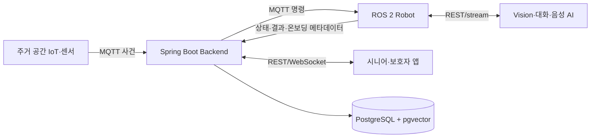

# 시스템 개요

BOMI 백엔드는 사용자 동의, 로봇 상태, 시나리오, 대화 문맥, 확정된 개인화·돌봄 사실을 중앙 관리한다. 장애물 회피·경로 추종·음성 스트리밍·프레임별 Vision 판정·고빈도 센서 측정은 로봇 또는 AI 내부에서 처리하고 업무에 필요한 결과만 전달한다.

## 통신

- MQTT: IoT·로봇 사건, 명령, 진행 상태, 최종 결과
- REST: 앱 입력, 명확한 요청·응답과 조회
- WebSocket: 백엔드에서 앱으로 상태·알림 전달
- Robot–AI 직접 통신: 중앙 DB에 보존하지 않는 음성·영상

## 데이터 책임

| 책임 | 저장 위치 |
| --- | --- |
| 사용자·동의 | `app_user` |
| 보호자 연결·PRIMARY 관리 권한 | `care_relationship` |
| 로봇 배정·모드·최신 환경 | `robot` |
| 앱·로봇 공용 온보딩 | `onboarding_session`, `onboarding_answer` |
| 로봇 행동 | `scenario` |
| Raw 발화 | `conversation`, `conversation_message` |
| 대화·일간 요약 | `conversation_summary` |
| 재질의·민감정보 확인·협의 | `fact_candidate` |
| 장기 개인화 사실 | `memory` |
| 확정 돌봄 사실 | `care_record` |

앱과 로봇은 [`../database/onboarding-question-set-v1.json`](../database/onboarding-question-set-v1.json)을 공유한다. UI와 자연어 질문 방식은 달라도 질문 코드, 필수 필드, 동의 게이트, 정규화 JSON, 최종 매핑은 같다.

대화 문맥은 현재 발화, 최근 Raw 6~12개, 관련 요약, 허용된 장기 기억 3~10개, 동의된 관련 돌봄 기록만 조립한다. 기억은 사용자·수명·확인·공개 범위를 먼저 필터링한 뒤 키워드와 벡터 결과를 합친다.

민감정보는 명확해도 최종 확인한다. 누락·모호·낮은 인식 신뢰도는 한 필드씩 재질의한다. 대리 관리는 활성 PRIMARY 보호자 한 명만 가능하고 SECONDARY는 변경할 수 없다.

음성·영상, 전체 프롬프트·모델 응답, 토큰, Vision 특징값은 중앙 DB에 저장하지 않는다. 휴식은 지속시간을 만족한 최종 전이만, 온습도는 최신 스냅샷과 의미 있는 관찰만 보존한다. 모든 MQTT ID·sequence의 수신 원장은 아직 없다.
