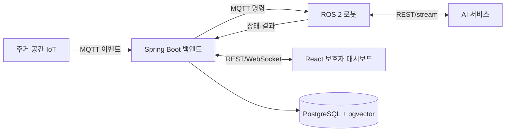

# 시스템 개요

BOMI 백엔드는 이벤트, 시나리오, 기록, 상태, 알림을 중앙 관리합니다. 단, 장애물 회피·경로 추종·음성 스트리밍처럼 즉시성이 중요한 처리는 로봇 또는 AI 시스템 내부에서 직접 수행하고 주요 결과만 백엔드에 기록합니다.

## 통신 기준

- MQTT: IoT/로봇 이벤트, 명령, 상태
- REST: 명확한 요청·응답 및 조회
- WebSocket: 백엔드에서 대시보드로 실시간 상태 전달
- GPIO/UART/I2C: 장치와 센서의 하드웨어 통신
