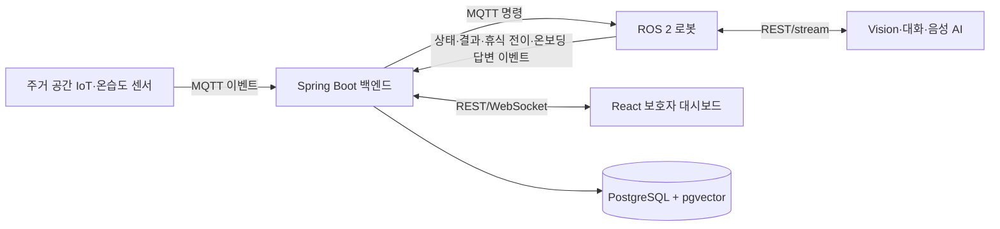

# 시스템 개요

BOMI 백엔드는 이벤트, 시나리오, 기록, 상태, 알림을 중앙 관리합니다. 단, 장애물 회피·경로 추종·음성 스트리밍·프레임별 자세 판정·고빈도 온습도 측정처럼 즉시성이 높거나 원시 데이터 양이 큰 처리는 로봇·센서 또는 AI 시스템 내부에서 직접 수행하고 주요 결과와 최신값만 백엔드에 기록합니다.

## 통신 기준

- MQTT: IoT/로봇 이벤트, 명령, 상태
- REST: 명확한 요청·응답 및 조회
- WebSocket: 백엔드에서 대시보드로 실시간 상태 전달
- GPIO/UART/I2C: 장치와 센서의 하드웨어 통신

## 추가 기능의 책임 경계

- 초기 설문은 `onboarding_session`이 질문 진행 위치와 시작·종료 시각을, `app_user.onboarding_status`가 현재 진행 요약을 맡습니다. `onboarding_answer`는 질문 코드·출처 대화·확인 상태만 저장하며, 최종 사용값은 `app_user`, `memory`, `care_record`에서 조회합니다.
- 로봇은 같은 답변 재전송에 같은 `eventId`를 사용합니다. 다만 현재 9테이블 ERD에는 답변 `eventId`, 수정 순번, 최종 반영 원장이 없으므로 Backend 재시작을 넘어선 멱등 처리는 보장하지 않습니다. 실제 재전송 문제가 확인되면 수신 이벤트·반영 원장을 추가합니다.
- Vision은 일정 시간 이상 누움이 확정됐을 때만 휴식 전이를 내보냅니다. 카메라 프레임·관절 좌표·초당 자세 분류는 중앙 DB에 저장하지 않습니다.
- Robot은 휴식 중 `REST_GUARD`로 일반 능동 기능을 억제하지만 호출 감지·안전 감지·긴급 대응과 호출 시 안전한 접근은 유지합니다.
- 온습도 센서는 최신값과 임계 사건만 Backend에 전달합니다. 중앙 DB는 `robot` 최신 스냅샷과 의미 있는 `care_record`만 보존합니다.
