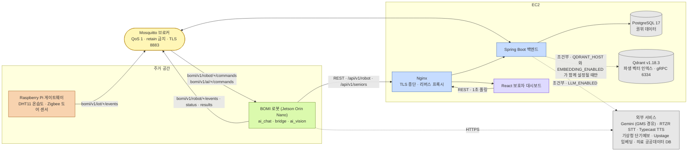
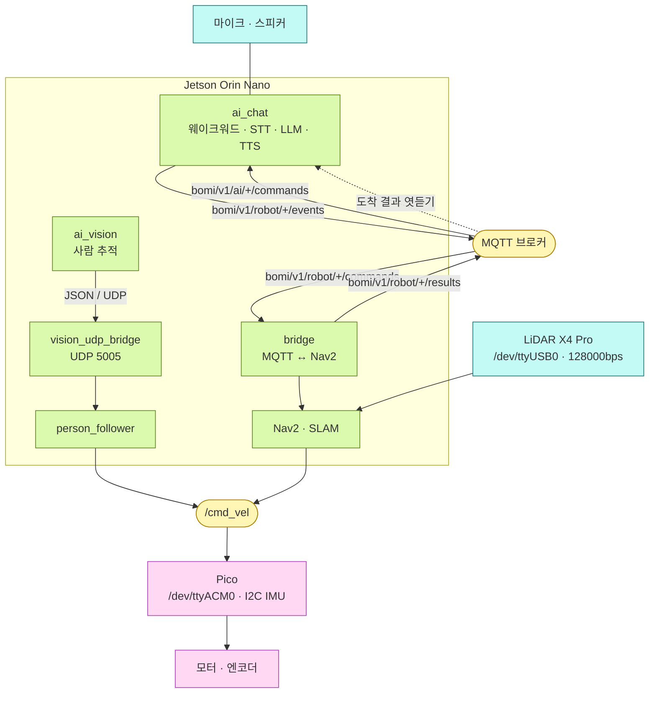

# 시스템 개요

> 기준: `main` (2026-08-16). 구성요소가 바뀌면 이 문서를 먼저 고칩니다.

BOMI 백엔드는 이벤트, 시나리오, 기록, 상태, 알림을 중앙 관리합니다. 단, 장애물 회피·경로 추종·웨이크워드 인식·음성 인식과 합성처럼 즉시성이 중요한 처리는 로봇 안에서 직접 수행하고 주요 결과만 백엔드에 기록합니다.

이 문서는 "무엇이 무엇과 어떤 채널로 말하는가"만 다룹니다. 각 채널의 계약은 별도 문서에 있습니다 — 메시지 계약은 [`docs/mqtt/시나리오 계약 v1.md`](<../mqtt/시나리오 계약 v1.md>), 데이터 소유권과 스키마는 [`docs/database/mvp-erd.md`](../database/mvp-erd.md), 배포 토폴로지는 [`infra/README.md`](../../infra/README.md)입니다.

## 시스템 전경

로봇은 백엔드와 **두 채널**로 말합니다. 시나리오 명령과 결과는 MQTT 로, 대화 문맥 조립·대화 적재·사실 후보 등록은 REST 로 오갑니다. 어느 한쪽이 다른 쪽을 대신하지 않습니다 — MQTT 에는 요청·응답이 없고, REST 로는 백엔드가 로봇을 먼저 부를 수 없습니다.

Qdrant 와 외부 LLM 으로 가는 화살표가 점선인 것은 **운영 기본값이 꺼져 있기 때문**입니다. `application.yml` 의 기본값이 `EMBEDDING_ENABLED=false`·`LLM_ENABLED=false` 이고, 운영 Compose 도 같은 값을 명시적으로 넘깁니다. 두 경로가 죽어도 대화와 시나리오는 동작합니다 — 의미 검색은 한국어 조사 제거 키워드 폴백으로 내려앉고, 대화 요약은 생성 없이 넘어갑니다.

PostgreSQL 상자에 pgvector 가 없는 것은 실수가 아닙니다. Upstage 임베딩이 4096차원인데 pgvector 0.8.5 의 인덱스 상한이 `vector` 2,000 / `halfvec` 4,000 차원이라 인덱스를 만들 수 없어, 의미 검색을 외부 벡터 스토어(Qdrant)로 옮겼습니다. PostgreSQL 에는 재색인 대상을 찾기 위한 부기 컬럼 세 개만 있습니다. 자세한 근거는 [`docs/database/Flyway 가이드.md`](<../database/Flyway 가이드.md>) 를 보십시오.

## 로봇 내부 — 젯슨 한 대의 세 프로세스

전경 그림의 `BOMI 로봇` 상자 안은 이렇게 나뉩니다. 세 프로세스는 서로 다른 채널로 말하며, 공유하는 것은 `/cmd_vel` 한 토픽뿐입니다.

`ai_chat` 은 ROS 2 노드가 아닙니다. MQTT 를 구독하고 백엔드 REST 를 호출하는 순수 Python 프로세스이며, ROS 2 그래프에는 들어가지 않습니다. `ai_chat` 이 `bomi/v1/robot/+/results` 를 **구독만** 하는 점선이 중요합니다. 이동 중 침묵을 만들기 위해 bridge 가 발행하는 도착 결과를 엿들을 뿐, 백엔드·bridge 계약에는 손대지 않습니다.

`/cmd_vel` 을 Nav2 와 `person_follower` 가 함께 쓴다는 점도 이 그림의 핵심입니다. 두 발행자가 동시에 살아 있으면 주행이 서로를 덮어씁니다. 도착 후 사람 접근 경로(`ai_vision` → UDP → `person_follower`)는 **코드와 로직 테스트까지 되어 있으나 젯슨 실기 검증은 아직 남아 있습니다.** 진행 상황은 [`docs/carebot/진행 상황.md`](<../carebot/진행 상황.md>) 의 실기 검증 열에 기록합니다.

## 통신 기준

| 채널 | 무엇이 오가는가 | 구체적으로 | 계약 문서 |
|---|---|---|---|
| MQTT | IoT·로봇 이벤트, 로봇 상태, 시나리오 명령, 실행 결과, 대화 시작 명령 | `bomi/v1/iot/+/events`, `bomi/v1/robot/+/{events,status,results}`, `bomi/v1/robot/{id}/commands`, `bomi/v1/ai/{robotId}/commands` — QoS 1 고정, retain 금지 | [`docs/mqtt/토픽 규약.md`](<../mqtt/토픽 규약.md>), [`docs/mqtt/시나리오 계약 v1.md`](<../mqtt/시나리오 계약 v1.md>) |
| REST | 로봇→백엔드 문맥 조립·대화 적재·사실 후보, 보호자 대시보드 조회·조작, 운영자 안전 복구 | `/api/v1/robot/**`, `/api/v1/seniors/**`, `/api/v1/guardian/**`, `/api/v1/operator/**` | Swagger `/swagger-ui.html` 의 채널별 그룹, [`docs/api/README.md`](../api/README.md) |
| UDP | 젯슨 안에서 비전 추적 좌표를 ROS 2 로 넘김 | `5005` 포트, JSON 한 줄 | `robot/ros2_ws/src/core/core/vision_udp_bridge.py` |
| ROS 2 | 로봇 내부 주행·센서 | `/cmd_vel`, `/scan`, `/person_following/enable` 등 | `robot/ros2_ws/` |
| 시리얼·GPIO·I2C | 장치와 센서 | Pico `/dev/ttyACM0`(IMU 는 Pico 에 I2C 로 붙음), LiDAR `/dev/ttyUSB0` 128000bps, DHT11 은 라즈베리파이 GPIO4 | [`docs/hardware/`](../hardware/) |

REST 채널은 호출 주체마다 인증 방식이 다릅니다. 로봇 채널은 `X-Robot-Shared-Secret`, 운영자 채널은 `X-Operator-Shared-Secret`, 운영 EC2 에 떠 있는 Streamlit 도구(운영자 콘솔·db-viewer·waypoint-editor)는 Nginx 의 `auth_basic` 으로 막습니다. 세 방식이 공존하므로 "어느 채널인가"를 먼저 정하고 인증을 고릅니다.

### WebSocket 은 아직 없습니다

`spring-boot-starter-websocket` 의존성은 들어와 있지만 핸들러·설정·엔드포인트가 없어 `wss://.../api/v1/ws` 는 존재하지 않습니다. 보호자 대시보드의 실시간성은 **1초 주기 폴링**으로 만들고, 탭이 숨겨지면 주기를 늘립니다. 스트리밍이 붙을 자리와 규칙은 백엔드가 서빙하는 `/asyncapi/websocket/` 페이지에 미리 잡아 두었습니다.

## 다음에 읽을 것

| 알고 싶은 것 | 문서 |
|---|---|
| 전 구간을 그림으로 한 번에 보고 싶다 | [`아키텍처 다이어그램.md`](<아키텍처 다이어그램.md>) — Miro 장표 12장 (전경·배포·MQTT·시나리오 시퀀스) |
| 시나리오가 어떤 메시지로 흘러가는가 | [`docs/mqtt/시나리오 계약 v1.md`](<../mqtt/시나리오 계약 v1.md>) |
| 어떤 데이터를 누가 소유하는가 | [`docs/database/mvp-erd.md`](../database/mvp-erd.md) |
| 대화 런타임이 어떻게 만들어졌는가 | [`docs/carebot/코드 읽는 순서.md`](<../carebot/코드 읽는 순서.md>) |
| EC2 에 무엇이 어떻게 뜨는가 | [`infra/README.md`](../../infra/README.md) |
| 하드웨어 결선과 장치 | [`docs/hardware/`](../hardware/) |
