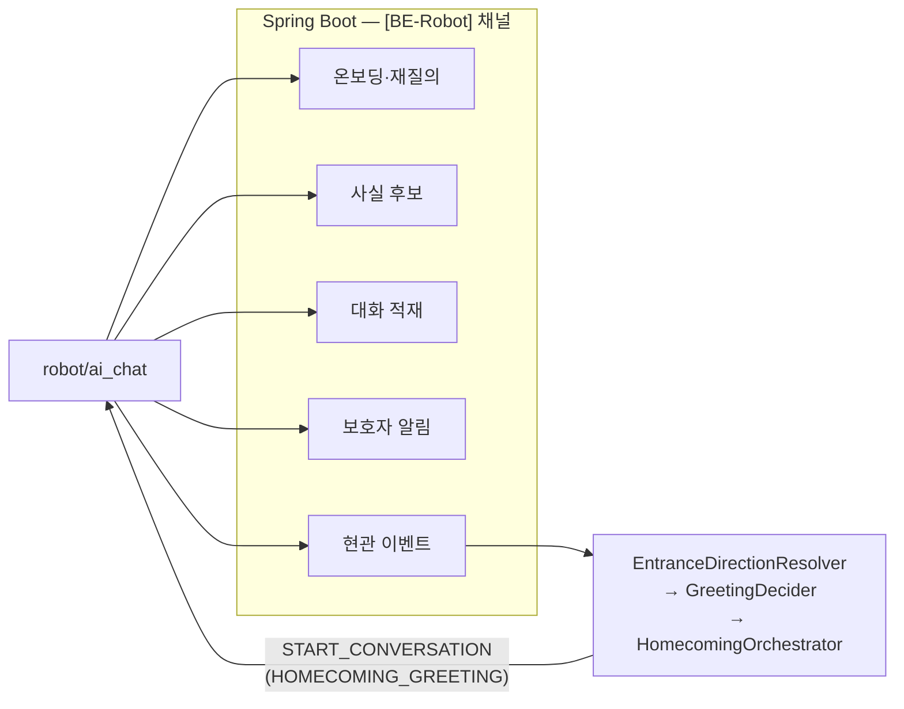

# 돌봄 로봇 대화 런타임 — 진행 상황

> **이 문서의 목적**: 코드를 전부 읽지 않고도 지금 상태를 판단할 수 있게 한다.
> 특히 **실패한 것 · 검증이 필요한 것 · 목표에서 벗어난 것**을 숨기지 않는다.
>
> **갱신 시점**: 티켓 하나를 푸시할 때마다. 그리고 결정이 바뀌거나 새 위험이 드러날 때.
> **마지막 갱신**: 의미 검색을 시연 서버에서 켠 기록 추가 (내용 2026-08-10, 커밋 `4e7e990c` 2026-08-12)
>
> **이 문서가 두 번 거짓말을 했습니다.**
>
> 한 번째. 08-02 이후 커밋 다섯 개(263·212·233×3)가 이 문서를 갱신하지 않고 들어갔고,
> 그동안 §1 표는 233 을 "미실시"로 적고 있었습니다. 실제로는 실기를 착수해 여섯 건을
> 찾아 고친 뒤였습니다. 297 에서 바로잡았습니다.
>
> 두 번째. **2026-08-08 ~ 08-12 의 시나리오 통합 스프린트 커밋 9건이 또 갱신 없이
> 들어갔습니다.** 그 사이 신설된 모듈 여덟 개(`ai_commands`·`navigation_watch`·
> `entrance_cheer`·`homecoming_gate`·`display_status`·`search_signal`·
> `conversation_control`·`turn_timer`)가 이 문서에 한 번도 등장하지 않고,
> §2.5·§2.6 은 이미 해소된 위험을 아직 위험으로 적고 있었습니다. 2026-08-15 문서
> 최신화에서 바로잡았습니다.
>
> 갱신을 빠뜨리면 다음 사람은 없는 문서가 아니라 **틀린 문서**를 읽습니다.

## 함께 보는 문서

| 문서 | 언제 보나 |
|---|---|
| [VERIFICATION.md](VERIFICATION.md) | 직접 돌려보고 성공/실패를 판정하고 싶을 때 |
| [READING-ORDER.md](READING-ORDER.md) | 코드를 읽어야 할 때, 어디부터 |
| [CONCEPTS.md](CONCEPTS.md) | 용어와 "왜 이렇게 만들었나"가 궁금할 때 |
| [TRACE-MAP.md](TRACE-MAP.md) | 관찰한 동작이 예상과 다를 때, 어떤 말이 어떤 함수를 지나 어디에 쓰이는지 |
| [PERSONALIZATION-LOCAL-TEST.html](PERSONALIZATION-LOCAL-TEST.html) | 개인화 로컬 점검 결과를 브라우저로 볼 때 |
| [../natural-conversation/](../natural-conversation/current-state-audit.md) | **다음 작업 흐름 (2026-08).** 감사(현재 실태, 파일:라인 근거) → 구현 계획(P0~P3, Phase 1~7) → 목표 설계. 앞으로의 대화 기능 작업은 이 계획을 따릅니다 |

---

## 1. 한눈에 보기

| 티켓 | 내용 | 코드 | 자동 검증 | 실기 검증 | 머지 |
|---|---|---|---|---|---|
| 200 | 주입 시계·모듈 구조 | 완료 | 통과 | **미실시** | ai-develop |
| 201 | 스키마 보강 | 완료 | 통과 | 해당 없음 | be-develop |
| 202 | 로컬 저장소·발신 큐 | 완료 | 통과 | **미실시** | ai-develop |
| 203 | 문맥 조립 API | 완료 | 통과 | 해당 없음 | be-develop |
| 204 | 반응형 1왕복 | 완료 | 통과 | **미실시** | ai-develop |
| 205 | 에코·barge-in | 완료 | 통과 | **미실시** | ai-develop |
| 206 | 능동 발화 게이트 | 완료 | 통과 | **미실시** | ai-develop |
| 207 | 침묵 사다리 | 완료 | 통과 | **미실시** | ai-develop |
| 208 | 현관·재실 | 완료 | 통과 | **미실시** | ai-develop |
| 209 | 온보딩·재질의 | 완료 | 통과 | **미실시** | 푸시됨 |
| 210 | 트리아지·T1 | 완료 | 통과 | **미실시** | 푸시됨 |
| 211 | T2 요약·보호자 채널 | 완료 | 통과 | **미실시** | 푸시됨 (BE/AI 각각) |
| 212 | 회귀 세트·튜닝 | **절반 완료** | 통과 (신규 45건) | **미실시** | ai-develop (305 로 리베이스) |
| **218** | **Qdrant 벡터 스토어·임베딩** | 완료 | 통과 (+ 실서버 Qdrant 7건, 실 API 1건) | **미실시** | 푸시됨 (BE/AI 각각) |
| **226** | **BE 현관 방향 판정·인사 결정** | 완료 | 통과 | **미실시** | 푸시됨 |
| **227** | **BE 온보딩·재질의 계약 API** | 완료 | 통과 | 해당 없음 | be-develop |
| **230** | **BE care_record 시각 컬럼** | 완료 | 통과 (실 PostgreSQL 백필 8건) | 해당 없음 | be-develop 머지됨 |
| **232** | **런타임 배선** | 완료 | 통과 | **미실시** | 푸시됨 |
| **233** | **실기 통합 점검** | 체크리스트 + 준비단계 수정 6건, **대조표 + 상태 도구** | 통과 | **부분 실시** (준비단계만, 본검사 미완) | ai-develop |
| **263** | **정서 핸들러·T3 지연** | 완료 | 통과 (신규 20건) | **미실시** | **ai-develop** |
| **296** | **작업 규칙 자동화 커밋** | 완료 | 해당 없음 | 해당 없음 | ai-develop |
| **297** | **인계 전 문서 정합** | 완료 | 해당 없음 | 해당 없음 | ai-develop |
| **299** | **테스트 게이트 복구 (222 낙진)** | 완료 | 통과 (`454 passed`) | 해당 없음 | ai-develop |
| **307** | **로봇 채널 인증 헤더 배선** | 완료 | 통과 | **미실시** | 푸시됨 |
| **311** | **날씨·의료 조회를 그래프에 잇는다** | 완료 | 통과 (`470 passed`) | **미실시** | 푸시됨 |
| **319** | **테스트 게이트 복구 (298 낙진)** | 완료 | 통과 (`454 passed`) | 해당 없음 | 푸시됨 |
| **341** | **실기 로그 후속 — T1 고착 해제·응답 자연화 (333 의 1·2번 동봉)** | 완료 | 통과 (`655 passed`) | **미실시** (내일 젯슨 예정) | 푸시됨 |
| **360** | **자유 대화 약속 등록 (AI)** | 완료 | 통과 (`838 passed`, ruff 클린) | **미실시** | 푸시됨 |
| **361** | **일간 요약(DAILY) 생성 (BE)** | 완료 | 통과 (`677 tests, 0 failed`) | 해당 없음 | 푸시됨 |
| **362** | **보호자 일일 요약 발송 스케줄러 (BE)** | 완료 | 통과 (`677 tests, 0 failed`) | 해당 없음 | 푸시됨 |
| **363** | **Raw 보존기간 만료 삭제 (BE)** | 완료 | 통과 (`677 tests, 0 failed`) | **미실시** (기본값 꺼짐) | 푸시됨 |

> **"머지" 열을 읽는 법 (2026-08-15 보강).** 이 열은 각 티켓이 **당시** 어느 브랜치로
> 올라갔는지를 적은 이력입니다. **2026-08-06 11:47 에 4개 라인(ai/be/fe/robot)이 `main` 으로
> 통합됐으므로, 이 표의 코드는 `ai-develop`·`be-develop`·`푸시됨` 어느 것으로 적혀 있든
> 지금은 전부 `main` 에 있습니다.** 어디서 확인할지 찾을 때는 브랜치가 아니라 `main` 을
> 보십시오.

**360~363 은 "완료 처리된 티켓의 미이행분"입니다.** 254(대화 요약)와 211(T2 일일 요약)이
둘 다 "완료"로 닫혔지만, 각 티켓 본문이 요구한 `dailySummary()` cron 과 발송 스케줄러가
실제로는 들어가지 않았습니다. 코드는 있는데 부르는 사람이 0건이라 한 번도 돈 적이 없고,
실패가 아니라 침묵이라 로그에도 남지 않았습니다. 363(Raw 삭제)도 같은 모양입니다 —
`raw_messages_expires_at` 을 채우기만 하고 읽는 코드가 저장소에 없었습니다.

**363 은 기본값이 꺼짐입니다.** 이번 네 건 중 유일하게 되돌릴 수 없는 작업이고, 백업·
소프트삭제·감사테이블이 없습니다. 켜기 전에 삭제 대상 건수를 SELECT 로 먼저 확인하십시오.

**360 의 실기 미검증 항목.** 추출 프롬프트가 상대 날짜("다음 주 화요일")를 절대 시각으로
옮기는 품질은 실제 모델 출력으로만 확인됩니다. 로직(모양 검증·과거/먼 미래 거절·강등)은
테스트로 고정했지만, **모델이 어떤 형태의 startsAt 을 실제로 뱉는지는 젯슨에서 처음
확인됩니다.** 잘못된 형태는 전부 기억으로 강등되므로 실패 방향은 안전하지만, 강등만
계속되면 기능이 조용히 0% 가 됩니다 — 실기에서 `fact_contract` 의 warning 로그를 보십시오.

**212 를 "절반 완료"로 적은 이유.** 티켓 제목이 "회귀 세트 **및** 임계치 실측 튜닝"입니다. 회귀 세트는 만들었고, **실측 튜닝은 하지 않았습니다** — 실제 어르신도, 실기 하드웨어도 없이 측정한 숫자는 측정이 아닙니다. 자세한 것은 §2.8.

**212·233 은 305 에서 `ai-develop` 에 올라왔습니다.** 그전까지는 각자의 브랜치에만 있었고, 두 티켓을 그냥 머지하면 `graph/gate.py` 를 포함해 169줄이 충돌했습니다. 리베이스로 올려서 `.py` 충돌 0건으로 끝냈습니다. 자세한 것은 §3.10.

218·226·227·230·232·233·263·296·297 은 원래 계획에 없던 신설 티켓입니다. 사유는 §3.

**209 는 227 이 선행이었습니다.** 227(서버 계약 API)을 먼저 만들고 209(로봇 대화)를 붙였습니다. 227 이 `be-develop` 에 머지되기 전까지 실제 호출 검증은 불가능합니다 — 지금은 대역으로만 검증했습니다.

**자동 검증 현황**:

| 대상 | 시점 | lint | 테스트 |
|---|---|---|---|
| **`main` (현재)** | **2026-08-15 실측** | 🔴 **`Found 2 errors`** (`UP035`, `bootstrap.py:37` 외 1) | **`1035 tests collected`** |
| 백엔드 `main` | 2026-08-15 실측 | — | 104 클래스 / 709 테스트 메서드 |
| `ai-develop` + 341 | 2026-08-05 | `All checks passed` | `655 passed in 19.58s` |
| `ai-develop` + 305(212·233 반영) | 2026-08-04 | `All checks passed` | `504 passed in 11.44s` |
| `ai-develop` (305 이전, 299 까지) | 2026-08-04 | `All checks passed` | `454 passed in 16.70s` |
| `ai-develop` (299 이전, 222 머지 후) | 2026-08-04 | `All checks passed` | 🔴 완주 불가 — §2.0 참고 |

> 🔴 **지금 `main` 의 lint 는 초록불이 아닙니다.** `ruff check src tests` 가 `UP035`
> (`typing.Callable` → `collections.abc`) 2건으로 실패합니다. 아래 옛 행들이 전부
> `All checks passed` 라서 "통과 상태"로 착각하기 쉬우니, **현재 행만 보십시오.**
>
> 로봇 테스트 수집 명령: `env -u PYTHONPATH venv/Scripts/python.exe -m pytest
> --collect-only -q -m "not integration and not manual"` (§6 환경 함정 — ROS 의
> `PYTHONPATH` 가 붙어 있으면 pytest 가 죽습니다).

**212·233 은 305 에서 `ai-develop` 에 리베이스로 올라왔습니다.** 그대로 머지했다면 `graph/gate.py` 를 포함해 5개 파일 169줄이 충돌했을 것을, 212 를 먼저 리베이스하고 233 의 자체 3커밋만 `--onto` 로 옮겨서 `.py` 충돌 0건·문서/설정 충돌만 102줄로 줄였습니다.

**233 브랜치에 있던 263 중복 커밋(`bcdd8af`)은 리베이스 중 `--skip` 으로 버렸습니다.** `ai-develop` 에는 이미 `9fd1dfa` 로 263 이 들어 있었으므로, `--skip` 하지 않았다면 이력에 두 번 남을 뻔했습니다. `git log --oneline --grep="S15P11E102-263" origin/ai-develop` 결과가 1건인 것으로 확인했습니다.

---

## 2. 🔴 지금 가장 중요한 위험

읽는 순서대로 중요합니다. (한때 "5가지"였으나 이후 늘었습니다 — 제목의 숫자를 지웁니다.)

### 2.0 해소됨 — `ai-develop` 의 테스트가 다시 초록입니다 (299)

297 이 발견하고 **299 가 고쳤습니다.** 고치기 전에는 이랬습니다.

```
tests/test_pipeline.py  ->  13 failed, 6 passed, 1 deselected in 2.73s
tests/test_pipeline.py::test_loop_stops_cleanly_on_keyboard_interrupt  ->  응답 없음(무한 대기)
```

299 이후:

```
venv/Scripts/pytest.exe -q -m "not integration and not manual"  ->  454 passed in 16.70s
venv/Scripts/ruff.exe check src tests                           ->  All checks passed!
```

**원인은 222 의 낙진 네 갈래였고, 전부 테스트 대역 쪽이었습니다.**

| # | 무엇이 깨졌나 | 왜 |
|---|---|---|
| 1 | `test_pipeline.py` 13건 + 무한 대기 | `SequenceAudioInput.capture()` 가 `onset_timeout_seconds` 를 안 받음 |
| 2 | `test_medical_pipeline_safety.py` 1건 | 같은 이유로 `StubAudioInput.capture()` 도 시그니처 불일치 |
| 3 | `test_main.py` 5건 | `WAKEWORD_ENABLED` 기본값이 `True` 라 단위 테스트가 `openwakeword` 를 import·다운로드하려 함 |
| 4 | `test_project_contract.py` 1건 | `.env.example` 이 `WAKEWORD_ENABLED`·`WAKEWORD_MODEL_PATH` 를 문서화하지 않음 |

**무한 대기의 정체가 이 사건의 교훈입니다.** `_run_once_inner` 는 capture 실패를
`except Exception` 으로 삼키고 루프를 계속 돕니다(단계 하나가 실패해도 로봇이 멈추면
안 되기 때문에 옳은 설계입니다). 그런데 대역의 시그니처가 어긋나자 매 호출이 그
자리에서 `TypeError` 로 죽어 **결과를 하나도 소비하지 못한 채 영원히 돌았습니다.**
`pre-push-gate.sh` 가 300초 타임아웃까지 매달렸고, 증상이 "실패"가 아니라 "안 끝남"
이라 원인을 게이트나 자기 코드에서 찾게 만들었습니다.

→ 재발 방지로 대역에 `AudioSequenceExhausted(BaseException)` 를 넣었습니다.
`Exception` 이 아니라 `BaseException` 인 것이 핵심입니다 — 파이프라인의 관용이
무한 반복으로 바뀌기 전에 pytest 가 잡습니다.

**같은 유형이 298 에서 다시 나왔습니다 (319 가 고쳤습니다).** 299 의 재발 방지 장치는
`pipeline.py` 가 쓰는 대역에만 들어갔습니다. 298 이 `bootstrap.py` 의 `capture()` 호출에
`onset_timeout_seconds` 인자를 추가했을 때, `tests/test_bootstrap.py` 의
`ScriptedAudioIn`·`FlakyAudio` 두 대역은 이 변경을 받지 않아 똑같이 매 호출이
`TypeError` 로 죽고 `test_the_loop_puts_each_utterance_through_the_graph` 가 무한
대기에 빠졌습니다. 319 에서 두 대역 모두 `onset_timeout_seconds=None` 을 받아
무시하도록 시그니처만 맞췄습니다 — `BaseException` 재발 방지 장치는 `pipeline.py`
전용 설계라 이 파일에는 옮기지 않았습니다.

**세 번째로 같은 유형이 나왔습니다 (309 가 고쳤습니다).** 이번에는 오디오가 아니라
대화 적재 쪽이었습니다. 306 이 `record_turn` 의 반환을 단일 문자열에서
`(conversationId, messageId)` 튜플로 넓혔는데, 212 가 만든
`tests/test_naturalness_replay.py` 의 `NullConversationClient` 는 여전히 문자열
하나를 돌려줬습니다. 그래서 `build.py._record_turn` 의 튜플 언패킹이
`ValueError: too many values to unpack` 으로 죽고, `memory_write` 노드가 터지면서
**자연스러움과 아무 상관 없는 이유로** 회귀 세트 2건이 빨간불이 됐습니다
(`test_the_sentence_limit_is_a_policy_dial_not_a_literal`,
`test_scenario[09b-emotional-turn-keeps-the-prohibitions]`). 대역을 계약에 맞춰
`("conversation-1", "message-1")` 로 고쳐 `540 passed` 로 돌아왔습니다.

**교훈 (세 번 반복된 것)**: 대역이 실제 인터페이스에서 조용히 벗어나는 것이 이
저장소에서 가장 자주 재발하는 실패입니다 — 222·298·306 세 번 모두 **프로덕션
호출부만 바뀌고 테스트 대역이 안 따라갔습니다.** 인터페이스(시그니처든 반환형이든)를
바꾸는 티켓은 그것을 구현한 **모든** 대역을 같은 커밋에서 확인해야 합니다
(`grep -rn "def capture(" tests/`, `grep -rn "def record_turn" tests/`). 증상이
매번 엉뚱한 곳에서 나타나는 것이 이 실패의 특징입니다 — 무한 대기로, 혹은
"자연스러움 테스트 실패"로.

### 2.1 실기를 아직 끝까지 돌려보지 못했습니다 (232 로 전제조건 해소, 233 준비단계 통과)

> **232 전까지는 더 나빴습니다.** 200~211 에서 만든 것이 **실행 경로에 하나도 연결돼
> 있지 않았습니다.** `main.py` 가 띄우는 것은 200번 이전의 `ConversationPipeline`
> 이었고, 게이트·침묵 사다리·트리아지·현관·온보딩·보호자 알림이 전부 꺼진 채였습니다.
> 각 MR 에 "부트스트랩이 아직 호출하지 않습니다"라고 조각조각 적혀 있던 것들이,
> 합치면 그 상태였습니다. 232 가 이것을 연결했습니다.

이제 **실기에서 확인할 것이 생겼습니다.** → 233

#### 08-03 에 실제로 책상에 앉았고, 준비 단계에서만 여섯 건이 나왔습니다

실기 점검 체크리스트의 첫 항목부터 돌리자 **점검 대상이 아니라 "돌려 보기" 자체가 막혔습니다.** 여섯 건 모두 `36f8201` 에서 고쳤습니다.

| # | 무엇이 막혔나 | 왜 자동 테스트가 못 잡았나 |
|---|---|---|
| 1 | 노트북에서 없는 USB 마이크(`reSpeaker`)를 요구하며 기동 거부 | 214 가 하드웨어 기본값을 모드와 무관하게 걸었습니다 |
| 2 | 로그는 완벽한데 **스피커만 조용함** — `--once` 가 재생 스레드(daemon)를 죽임 | 원리적으로 무음인데 증상이 "무음"이라 오디오·키를 먼저 의심하게 됩니다 |
| 3 | 잭이 비어 있어도 PortAudio 는 정상으로 열고 정상으로 재생을 마침 | 로그로는 영원히 알 수 없습니다. 귀로만 확인됩니다 |
| 4 | **STT 가 문장을 잘라 먹음** — `AUDIO_SILENCE_THRESHOLD=300` 인데 발화 청크가 대부분 300 미만 | "ASR 이 나쁘다"로 오진하기 딱 좋습니다. ASR 문제가 아니었습니다 |
| 5 | 테스트가 개발자의 **실제 저장소**에 쓰고 있었음 (`runtime_state` 오염) | `conftest` 가 `LOCALSTORE_DIR` 을 지우기만 해서 기본값으로 떨어졌습니다 |
| 6 | 체크리스트 명령이 PowerShell 로 적혀 Git Bash 에서 안 돌았음 | 점검하러 갔는데 점검 도구부터 고쳐야 했습니다 |

**4번이 가장 큽니다.** 임계치 하나가 어긋나 있으면 그 위의 모든 판정(트리아지 표현 목록, 동의 판정, 지남력 표지, 맞장구)이 **잘린 텍스트**를 받습니다. 실측 도구 두 개(`tests/manual/mic_level_check.py`, `speaker_probe.py`)를 이때 만들었습니다.

#### 08-05, 처음으로 젯슨 실기에서 대화가 끝까지 돌았습니다

08-03 은 노트북이었습니다. 08-05 에 **젯슨(Jetson Orin Nano, aarch64) + reSpeaker
+ USB 스피커**로 옮겨 0절부터 다시 돌렸고, 대화가 실제로 왕복했습니다.

**돈 것** — STT→LLM→TTS 왕복, 지남력 질문(날짜·시각·요일·장소), 도시가 있는 날씨 조회,
`care_record` 의 진료 예약을 읽어 답하기, 네 갈래(info/companion/emotional/schedule)
판정, 그리고 **T1 이 확인 질문 → 상승 → outbox → 보호자 배달까지 끝까지** 갔습니다.
`falling back to cache` 는 0 이었습니다(백엔드 문맥이 매 턴 실제로 조회됐다는 뜻).

**막힌 것 — 젯슨에서만 드러난 환경 문제 5건.** 전부 `.env`·경로·런타임 문제이지
로직 문제가 아니었고, 그래서 자동 테스트로는 원리적으로 잡히지 않습니다.

| # | 무엇이 막혔나 | 왜 조용한가 |
|---|---|---|
| 1 | `venv/Scripts/*.exe` — 문서가 Windows 경로 | 리눅스에는 그런 경로가 없어 첫 명령부터 안 돕니다 |
| 2 | ROS2 가 `PYTHONPATH` 로 새어 pytest 가 `launch_testing`/`lark` 로 죽음 | 테스트 코드와 무관한데 테스트 실패로 보입니다 |
| 3 | `.env` 가 CRLF — 값 끝에 `\r` 이 붙음 | **API 키가 조용히 실패합니다.** 빈 줄이 내는 `$'\r'` 에러는 오히려 착한 실패입니다 |
| 4 | `AUDIO_INPUT_DEVICE=1` (노트북 값이 남아 있었음) — 젯슨의 1번은 HDMI, 입력 채널 0개 | `Invalid number of channels` 로 보여서 채널 수를 의심하게 됩니다. 장치가 틀린 것이었습니다 |
| 5 | 장치 인덱스가 재부팅·재연결마다 **뒤바뀜** (24↔25) | 어제 맞던 번호가 오늘 틀립니다. 매번 0-5 를 다시 해야 합니다 |

#### 그리고 코드 결함 4건 — 실기에서만 나올 수 있는 것들이었습니다

| # | 무엇 | 왜 자동 테스트가 못 잡았나 | 조치 |
|---|---|---|---|
| 1 | **TTS 재생이 죽음** — USB 스피커가 raw ALSA `hw:` 라 WAV 의 레이트로는 안 열림 (`Invalid sample rate`) | 대역 오디오에는 고정 샘플레이트가 없습니다. STT·LLM 은 정상이고 스피커만 조용합니다 | 출력도 `_resample_int16` 을 타게 함 |
| 2 | **에코 되먹임** — `_wait_for_playback` 이 웨이크워드 경로에만 있고, `WAKEWORD_ENABLED=0`(점검이 5절까지 강제하는 경로)에는 없었음 | 대역 재생은 즉시 끝나서 겹칠 시간이 없습니다 | 없던 분기에 호출 추가 |
| 3 | 🔴 **T1 폭주** — 아래 별도 항목 | | 중복 억제 신설 |
| 4 | **프롬프트 뼈대가 음성으로 샘** — `[현재 정보]`·`[날씨 정보]`·`어르신:` 를 로봇이 소리 내어 말함 | 프롬프트 조립은 테스트했지만 "모델이 그것을 베끼는가"는 실제 모델로만 보입니다 | 프롬프트 금지 + 셰이퍼에서 결정적 제거 |
| 5 | **4-4 확인됨** — 첫 의료·날씨 질문에서 임베딩 모델이 그 자리에서 로딩 | 실측 **36.1초** / 21.5초. 지연 예산은 2초입니다 | 그래프 경로에 워밍업 추가 |

#### 🔴🔴 T1 폭주 — 이번 실기의 최악 발견

에코(위 2번)와 트리아지가 만나 **자기증식 루프**가 됐습니다. 로봇이
`"제가 아드님께 연락드릴게요"` 라고 말하면 → 그 문장이 마이크로 되돌아오고 →
그 안의 응급 표현을 트리아지가 **다시** 감지해 → T1 을 또 올립니다.

**20:58~21:04 사이 동일한 T1 이 15회 이상 보호자에게 배달됐습니다.** 그중에는
`"오늘은 너무 즐겁다"`, `"근처 병원 알려줘"` 에 붙은 것도 있었습니다.

에코와 **별개인 두 번째 결함**이 여기 있었습니다 — `triage.py` 에 **중복 억제가 아예
없었습니다.** 같은 사유로 3분간 15번을 그대로 다 보냅니다. CLAUDE.md §9 는 위양성을
감수하라고 했지 같은 알림을 열다섯 번 보내라고 하지 않았고, 이것이야말로 §9 가 경고한
**알림 피로 → 진짜 응급이 묻힘** 경로입니다. 에코를 고쳐도 이 구멍은 남으므로
`policy.T1_DUPLICATE_SUPPRESSION_SEC`(기본 10분)으로 따로 막았습니다.
억제되는 것은 **보호자 알림뿐이고 어르신에게 가는 응답은 그대로**이며, 사유가 다르면
(emergency 뒤의 self_harm_override) 억제하지 않습니다.

#### 아직 못 고친 것

| 무엇 | 왜 |
|---|---|
| 종료 시 `double free or corruption` / `pthread_join failed` (PortAudio·ALSA) | 크래시가 C 계층(`pa_linux_alsa.c`)에서 납니다. **개발 노트북(Windows)에서는 재현도 검증도 불가**하므로 추측으로 고치지 않았습니다. 젯슨에서 재현하며 잡아야 합니다 |
| 지연이 2.0~2.6초로 예산 초과가 잦음 | 워밍업으로 최악(36초)은 없앴지만 평상시도 예산 경계입니다. 4-2 로 재측정 필요 |

#### 그래서 지금 정확히 어디까지 왔나

| 범위 | 상태 |
|---|---|
| 0. 준비 (환경·장치·에코 설정) | **통과** (젯슨 기준, 08-05) |
| A. 기본 왕복 | **통과** — 젯슨에서 왕복 확인. 지연 녹취는 남았습니다 |
| 5절 일부 (지남력·날씨·일정·정서·트리아지) | **부분** — 갈래와 T1 배달은 봤고, 42개 매트릭스는 미실시 |
| 3절 에코 실측 (거리·볼륨·임계치) | **미실시** — 되먹임은 코드로 막았으나 `ECHO_*` 는 여전히 추정값 |
| B~G (게이트·사다리·온보딩·현관·의미검색) | **미실시** |
| `SELF_HARM_MARKERS_REVIEWED` | **여전히 False** |

Jetson, 실제 어르신 발화, 원거리 마이크, 실기 임계치는 **아직 확인되지 않았습니다.** B~G 의 검증은 여전히 전부 대역(fake)을 쓴 자동 테스트입니다.

#### 남아 있는 점검 도구 (대조표 + 상태 도구)

| 무엇 | 어디 | 역할 |
|---|---|---|
| 대조표 | [`TRACE-MAP.md`](TRACE-MAP.md) | 어떤 말이 어떤 함수를 지나 DB·API 어디에 쓰이는지 |
| 상태 도구 | `robot/ai_chat/tests/manual/probe.py` | `--save` / `--diff` 로 **발화 하나가 바꾼 것만** 표시 |
| 실행·판정 절차 | [`VERIFICATION.md`](VERIFICATION.md) | 영역별 실행 명령과 성공·실패의 모습 |

> 233 의 실기 점검 본문·결과지 두 문서는 2026-08-12 커밋 `4e7e990c` 에서 삭제됐고
> **복원하지 않기로 했습니다**(2026-08-15). 따라서 위 표의 "미실시" 항목들을 다시 돌린다면
> 결과를 적을 곳은 이 문서(§1 표의 실기 검증 열)입니다.

#### 문서를 쓰는 동안 코드에서 발견한 것 3건 (실기 이전)

| # | 무엇 | 왜 조용한가 |
|---|---|---|
| 1 | 당시 `ai-develop` 은 로그가 전부 꺼져 있었음 (`main.py` 의 `basicConfig` 주석 처리, `-v` 없음) | 로봇은 정상적으로 대답합니다. 안 보이는 것은 판정 근거뿐입니다. **해소됨** — `main.py:_setup_logging` 이 `main` 에 있고, 콘솔과 `{LOCALSTORE_DIR}/logs/ai_chat.log` 회전 파일 양쪽에 붙습니다 |
| 2 | **날씨는 도시명이 있을 때만 실제로 조회됨** (311 로 배선은 끝남) | `context_read._lookup_weather_documents` 가 `extract_city()` 로 도시를 못 뽑으면 조회를 아예 건너뜁니다. 그런데 어르신은 `"대전 몇 도야"` 가 아니라 **`"오늘 몇 도야"` 라고 말합니다** — 즉 실사용에서 더 흔한 쪽이 조회가 안 되는 쪽이고, 그때 LLM 이 자연스러운 문장으로 기온을 지어냅니다. 집 주소를 기본 도시로 쓸지가 미결 → 5-3 스텝으로 고정 |
| 3 | 잘못된 API 경로가 **200 + HTML** 을 돌려줌 | nginx 가 `/api/` 만 백엔드로 보내고 나머지는 프론트로 넘깁니다. 상태 코드로 판정하면 전부 초록입니다. `/actuator` 도 일부러 404 라 헬스체크에 못 씁니다 → 0-6 스텝으로 고정 |

문서 오류도 하나 바로잡았습니다: 대화 저장점(checkpoint)이 `checkpoint.sqlite` 라는 별도
파일에 있다고 적혀 있었으나, `graph/build.py` 가 `runtime_db_path()` 를 쓰므로 실제로는
`runtime.sqlite` **안에** 있습니다.

무엇이 위험한가:

- **aarch64 패키지 설치**가 실기에서 실패할 수 있습니다(200 완료조건이었으나 미실시). 소스 빌드로 넘어가면 몇 시간이 날아갑니다
- **에코 임계치**가 추정치라 실제로는 로봇이 자기 말에 멈추거나, 반대로 끼어들기를 못 잡을 수 있습니다
- **원거리 마이크 성능**은 소프트웨어로 못 고칩니다. 여기서 막히면 설계가 아니라 하드웨어 배치 문제입니다

→ 항목: [`docs/hardware/audio-echo-bargein-verification.md`](../hardware/audio-echo-bargein-verification.md)

### 2.2 자해 표현 목록이 아직 사람의 검토를 받지 않았습니다

**트리아지는 이제 동작합니다**(210). 이전의 "항상 `False`" 상태는 해소됐고, `NOT IMPLEMENTED` 경고도 사라졌습니다.

남은 위험은 하나입니다. `policy.SELF_HARM_MARKERS` 는 **보수적인 출발점**이며, 이 목록을
즉흥적으로 만들지 말고 사람이 검토해야 한다는 요구(유래는 §8 부록)를 아직 만족하지
못했습니다.

```
self-harm marker list has not been human-reviewed yet (docs/carebot/PROGRESS.md §2.2).
Detection is active but conservative; review the list in policy.py before
deploying to a real senior.
```

왜 비워두지 않고 채웠는가: 비어 있으면 이 기기는 자해 신호를 **전혀** 감지하지 못합니다. 검토를 기다리는 동안 감지 능력이 0 인 것보다, 보수적인 목록으로 감지하면서 검토를 받는 편이 낫다고 판단했습니다. 검토 전 상태는 위 경고로 드러납니다.

**검토할 때 봐 주실 것**: 애매한 관용구("죽겠다", "미치겠다")를 일부러 넣지 않았습니다 — 한국어에서 그 둘은 대개 강조 표현이고, 엉뚱한 자해 알림을 받은 가족은 그 뒤로 알림을 다르게 대합니다. 반대로 테스트가 `"그만 살고 싶어"` 가 빠진 것을 잡았습니다. 이런 종류의 공백이 더 있을 것입니다.

검토가 끝나면 `policy.SELF_HARM_MARKERS_REVIEWED = True` 로 바꾸고 그 사실을 커밋 메시지에 남깁니다.

### 2.3 해소됨 — 모든 인텐트에 핸들러가 있습니다 (263)

`handle_emotional` 이 `NotImplementedError` 여서 "외로워"에 **아무 대답도 하지 않았습니다.** 외로움이 1번 문제인데 하필 외로움 표현에만 침묵하는, 이 제품에서 가장 나쁜 모양의 실패였습니다. 정보 질문에는 답하고 잡담에도 답하면서, 속마음을 꺼낼 때만 조용했습니다.

263 에서 구현했습니다. 이제 `classify_intent` 가 분류하는 인텐트 중 미구현이 없습니다.

| 발화 예 | 분류 | 결과 |
|---|---|---|
| "오늘 며칠이야" | info | 정상 |
| "심심해" | companion | 정상 |
| "약 먹었어" | schedule | 정상 (206) |
| **"외로워"** | emotional | **정상 (263)** |
| "외로운데 오늘 며칠이야" | emotional | 정상 (263) — 정서를 정보보다 먼저 봅니다 |

**함께 들어간 것: T3 동의 질문의 지연.** 속마음을 꺼낸 직후 "가족분께 전해도 될까요"로 끊으면, 로봇은 그 한 문장으로 말벗에서 감시 장치가 됩니다. 그 뒤로 어르신은 털어놓지 않고, 그러면 T3 로 보낼 내용 자체가 사라집니다(CLAUDE.md §9). 그래서 45분 뒤에 묻도록 제안 큐에 넣습니다.

게이트에 `not_before` 연기 확인을 추가했습니다. **이 확인이 없으면 지연은 장식입니다** — 큐에 넣은 제안은 다음 틱에 바로 후보가 되기 때문입니다. 폐기가 아니라 연기인 것이 중요합니다(아직 이른 것을 폐기하면 영영 사라집니다).

**253 에서 갱신됨.** 여기서 말하는 "45분 뒤 제안 큐에 넣습니다"는 더 이상 정확하지 않습니다 — 253 이후로는 정서 발화 한 번이 아니라 누적 신호가 문턱을 넘겼을 때만 큐잉하고, 어르신의 "응"/"아니" 답도 실제로 판정합니다. §6의 253 절 참고.

미검증: 실기. "외로워"는 시연에서 누구든 가장 먼저 시도할 발화이므로 233 에서 우선 확인 대상입니다.

### 2.4 해소됨 — 의미 검색을 시연 서버에서 켰습니다 (2026-08-10)

**아래 2.4 원문은 켜기 전 상태의 기록입니다.** 2026-08-10 에 시연 서버
(`i15e102.p.ssafy.io`)에서 실제로 켰고, 다음을 확인했습니다.

- `secrets/production.env` 에 `EMBEDDING_ENABLED=true`, `EMBEDDING_SYNC_ENABLED=true`
  추가(원본은 `production.env.bak-20260810` 로 백업). `UPSTAGE_API_KEY` 는 이미
  들어 있었고, 두 스위치가 **파일에 아예 없어서** compose 기본값 `false` 로
  뜨고 있었습니다 — 원문이 예고한 실패 모양 그대로입니다.
- 기동 로그: `embedding ON: model=embedding-passage dim=4096`.
- 백로그 색인 1회로 종료: `embedding sync: 20 memories, 0 summaries indexed,
  0 failed, 0 deferred (20 billed calls, cap 30)`. DB 20행 전부
  `embedding_status=SYNCED`, Qdrant `memory` 컬렉션 `points_count=20` (status
  green, `indexed_vectors_count=0` 은 정상 — 10,000건 미만은 전수 탐색).
- **DB 종결 상태가 아니라 실제 조회로 확인**했습니다.
  `POST /api/v1/seniors/{id}/conversation-context` 응답:
  `availability.semanticSearch=true`, `retrieval.semanticUsed=true`,
  `hitCount=18`, `latencyMs=201` (임베딩 110ms + 벡터 검색 68ms). 턴 예산
  약 2초 안에 충분히 들어옵니다.

#### 회상 씨앗과 가족 명부 (같은 날, `scripts/dev/seed-reminiscence.sql`)

의미 검색을 켠 직후, 회상 대화의 재료를 넣었습니다. 기존 memory 20행은 전부 대화에서
자동 추출된 부스러기라("아이스에 등록하고 동 연동을 확인했다") "이어짐"(§17.2)을
만들 수 없었습니다.

- **memory 10행** — `importance=5`, `keywords` 채움, **타임스탬프 전부 NULL**.
  최근성 가중치가 반감기 30일 지수 감쇠라, 사건 연도를 넣으면 점수가 0 에 수렴합니다.
  NULL 이면 감점 없이 1.0 고정 — 늙지 않는 씨앗이 됩니다.
- **known_person 3행** — ★ `KnownPerson.isAvoidTarget()` 이
  `!Boolean.FALSE.equals(isDeceased)` 라, `is_deceased` 를 NULL 로 두면 **살아 있는
  손자도 회피 대상**이 됩니다. 살아 있는 가족은 `FALSE` 를 명시했습니다. 확립된
  사별 사실이 없어 회피 대상은 일부러 비워 두었고, 추가 형식만 주석으로 남겼습니다.
- **실제 조회로 확인**: `"옛날에 학교 다닐 때가 생각나네"` → 상위 6건이 전부 새
  씨앗, 1~3위가 교사 관련(점수 0.28 vs 기존 행 0.04대). `"주말에 손자가 온다고
  하네"` → 손자 씨앗 0.4389 로 1위, `avoidTopics=[]`(손자가 막히지 않음).
- 색인: `embedding sync: 10 memories ... indexed (10 billed calls)`. memory 30행 전부 SYNCED.

김순자는 시연 페르소나(`@example.invalid`)이므로 위 생애 사실은 지어낸 것입니다.
**실제 어르신에게 쓸 때는 전부 그분의 실제 이야기로 교체합니다** — 스크립트 머리말에
같은 경고를 두었습니다.

**남은 한 걸음:** 시연 직전 `EMBEDDING_SYNC_ENABLED=false` 로 내리고 재기동합니다
(질의 임베딩만 돌고 배경 배치가 겹치지 않게). 지금 켜 둔 이유는 회상 씨앗을 새로
넣을 예정이고, 새 memory 행은 `PENDING` 으로 들어와 이 잡이 있어야 색인되기
때문입니다. 한 실행 상한은 30행이므로 그보다 많이 넣으면 5분씩 더 걸립니다.

#### 2.4-원문 (보존) — 의미 검색은 만들어졌으나 아직 꺼져 있었습니다 (218)

218 에서 Qdrant 와 Upstage 임베딩을 붙였습니다. 실서버 Qdrant 로 4096차원 코사인 HNSW 컬렉션 생성과 저장→검색 왕복을, 실제 Upstage API 로 passage/query 가 같은 벡터 공간을 쓰는 것을 확인했습니다.

**그런데 기본값이 꺼짐입니다.** 임베딩 API 가 과금되고 잔액이 프로토타입 시연까지 감당해야 하므로, `EMBEDDING_ENABLED` 와 `EMBEDDING_SYNC_ENABLED` 를 명시적으로 켜야 동작합니다. 켜지지 않은 동안은 여전히 **키워드 겹침 × 중요도 × 최근성**으로만 순위를 매기고, 한국어 조사 때문에 "무릎이"와 "무릎"이 매칭되지 않습니다.

즉 **"이어짐"(CLAUDE.md §17.2)은 스위치를 켜기 전까지 여전히 거의 작동하지 않습니다.** 응답의 `availability.semanticSearch` 가 그 사실을 알려주며, AI WIP 커밋 `26e9635`부터 로봇도 이를 `retrieval_status`·로그·프롬프트 경고로 실제 소비합니다.

배포 시 필요한 것: EC2 시크릿에 `UPSTAGE_API_KEY`(현재 없음), `QDRANT_DATA_DIR`, `QDRANT_API_KEY`.

#### AI WIP — 문서 요청 순서와 검색 상태 소비 (26e9635)

- 그래프 순서를 `classify_intent → context_read`로 바꿔 일반 반응형 정보 질문도
  `includeDocuments=true`를 전송합니다. `"복지제도 알려줘"` 전체 그래프 회귀로
  고정했습니다.
- 현재 `availability`와 차기 BE의 요청별 `retrieval`(`semanticRequested`,
  `semanticUsed`, `fallbackReason`, `hitCount`, `latencyMs`)을 구분해 상태·로그·프롬프트에
  전달합니다. 없는 필드는 `false`가 아니라 모름으로 유지합니다.
- 문서의 `source`, `version`, `chunkId`, `citation`, `url`을 최종 프롬프트까지 보존하고,
  코퍼스 미가용과 정상 조회 0건을 다른 경고로 처리합니다.
- **논리 검증:** ruff clean, `704 passed`. **미검증:** 실제 BE 요청별 계약, 실제 문서
  코퍼스, Qdrant·Upstage·Spring Boot를 포함한 교차 모듈 E2E.

### 2.5 백엔드 인증은 붙었지만 **시크릿이 비면 통째로 열립니다** (307)

> 2026-08-15 정정. 이 절은 원래 "인증이 없습니다"였습니다. 307 이 서블릿 필터를 붙여
> 그 서술은 더 이상 사실이 아니지만, **위험이 사라진 것이 아니라 성격이 바뀌었습니다.**

`RobotChannelAuthFilter` 가 `/api/v1/robot/**` 와 `/api/v1/seniors/**` 를 막습니다.
로봇은 `X-Robot-Shared-Secret` 헤더를 붙여야 하고, 없으면 `401` 입니다.

문제는 **fail-open** 입니다. `ROBOT_SHARED_SECRET` 환경변수가 비어 있으면 필터가 스스로
등록을 건너뜁니다. 즉 시크릿을 설정하지 않은 배포는 **인증이 없는 것과 정확히 같은
상태**가 되고, 그 사실이 로그 한 줄 말고는 어디에도 드러나지 않습니다.

- 시크릿이 설정된 배포: `POST /api/v1/seniors/{id}/conversation-context` 는 헤더 없이 `401`
- 시크릿이 빈 배포: **누구나** 호출하면 어르신의 프로필·기억·복약이 나옵니다

`requesterGuardianId` 가 요청자의 자기 신고 값이라는 점은 그대로입니다 — 필터는 "로봇이
맞는가"만 보고, "이 보호자가 이 어르신의 보호자인가"는 보지 않습니다.

**배포 점검 항목**: `ROBOT_SHARED_SECRET` 이 실제로 주입됐는지 확인하십시오. 운영자 채널의
`OPERATOR_SHARED_SECRET` 은 반대로 fail-closed(비면 `503`)라 규칙이 서로 다릅니다.

### 2.6 해소됨 — 로봇→백엔드 '쓰기' 경로가 전부 이어졌습니다

> 2026-08-15 정정. 이 절은 "현관 이벤트 수신 엔드포인트가 없다 → 226" 으로 남아
> 있었지만, 엔드포인트도 방향 판정도 인사 오케스트레이터도 전부 있습니다.

203 이 만든 것은 **읽기 전용 문맥 조립**뿐이었습니다. 227 이 온보딩·재질의를, 211 이 대화 적재와 알림 수신을, 226 이 현관 이벤트를 채웠습니다.

| 경로 | 상태 | 백엔드 수신부 |
|---|---|---|
| 온보딩 세션 진행·답변 제출 | ✅ 227 | `RobotOnboardingController` |
| 활성 `fact_candidate` 조회·응답 | ✅ 227 | `RobotClarificationController` |
| 사실 후보 제출·취소 | ✅ 255·348 | `RobotFactIntakeController` |
| 대화 이벤트 적재(`conversation_message`) | ✅ 211 | `RobotConversationController` |
| 보호자 알림 수신(로봇 outbox 목적지) | ✅ 211 | `RobotGuardianAlertController` |
| 현관 이벤트 수신 | ✅ 226 | `RobotDoorEventController` (`POST /api/v1/seniors/{seniorId}/door-events`) |



현관 인사는 이제 닫힌 고리입니다. 로봇이 문 열림을 올리면 백엔드가 방향을 판정하고
(`EntranceDirectionResolver`), 인사할지 결정하고(`GreetingDecider`), 시나리오를 열어
(`HomecomingOrchestrator`) 로봇에게 `START_CONVERSATION` 을 내립니다. 이 시나리오는
`CLAUDE.md §1` 의 시연 4개 중 하나입니다.

**남은 것은 실기 검증입니다.** 위 경로들은 코드로 이어져 있고 단위 테스트가 있지만,
실제 젯슨·실브로커에서 끝까지 도는 것은 별도로 확인해야 합니다.

### 2.7 침묵 사다리가 실기에서 한 번도 돌지 않을 상태였습니다 (208 에서 고침)

발견하고 고쳤지만, 같은 종류의 실수가 또 생길 수 있으므로 남겨 둡니다.

`silence_tick` 은 그래프를 거치지 않고 `runtime_state` 를 읽습니다. 그런데 `note_interaction`(어르신이 말한 턴)은 LangGraph checkpoint 에만 썼습니다. 그래서 `runtime_state.last_user_interaction_at` 은 기본값 0 에 머물고, 틱은 `<= 0.0` 가드에서 매번 조용히 되돌아갔습니다.

**즉 207 의 침묵 사다리가 production 에서는 한 번도 동작하지 않았습니다.** 테스트는 `runtime_store` 에 값을 직접 넣어주기 때문에 전부 통과했습니다.

→ `note_interaction`·`door_event`·`memory_write` 가 이제 내구 저장소에도 씁니다. 회귀 테스트: `test_note_interaction_persists_the_survival_signal`.

**교훈**: 저장소가 두 개(checkpoint / runtime_state)이고 수명이 다릅니다. 안전 감시가 읽는 쪽은 항상 `runtime_state` 입니다. 새 노드를 만들 때 "이 값을 틱이 읽는가"를 먼저 물어야 합니다.

### 2.8 임계치가 여전히 추정값입니다 (212 의 남은 절반)

212 에서 만든 것은 **회귀 세트**입니다 — 임계치를 안전하게 바꿀 수 있는 발판입니다. 임계치 자체는 여전히 추정값입니다.

| 다이얼 | 현재 | 왜 아직 추정인가 |
|---|---|---|
| `SILENCE_LADDER_SEC` | 3시간/45분/20분 | 실제 어르신의 하루 리듬이 필요합니다. 지어낸 값으로 조정하면 숫자만 바뀝니다 |
| `BACKCHANNELS` (8개) | 상상으로 만든 목록 | 티켓이 "실제 녹취록에서 채운다"고 적었습니다. 녹취가 없습니다. **상상 목록을 상상으로 검증하면 통과했다는 사실만 남습니다** |
| `ECHO_GUARD_SEC`, `ECHO_VAD_THRESHOLD_MULTIPLIER` | 추정 | 실제 스피커·마이크가 필요합니다 → 233 |
| `MEAL_REMINDER_TIMES`, `WATER_REMINDER_TIMES` | 일반적인 시각 | 그 어르신의 식사 시간을 모릅니다 |
| outbox 백오프 | 추정 | 실제 네트워크 단절 패턴이 필요합니다 |

**대신 확보한 것**: 이 값들이 전부 `policy.py` 에서 읽히고 있다는 사실을 테스트로 고정했습니다(`test_every_tuning_dial_has_a_reader`). 읽는 사람이 없는 다이얼은 고쳐도 아무 일이 일어나지 않는데, **실제로 그런 다이얼이 하나 있었습니다** — §3.10.

---

### 2.9 해소됨(로직) — T1 한 번이 대화 전체를 삼켰습니다 (341, 실기 미검증)

2026-08-05 실기 로그에서 발견했습니다. `safety_level`/`escalation` 이 checkpoint 로
다음 턴에 넘어오는데 아무도 지우지 않아서, `safety_triage` 의 "미리 세팅된 T1 통과"
분기가 지난 턴의 결과를 사전 세팅으로 오인했습니다. **T1 이 한 번 나오면 이후 모든
발화가 — "괜찮아요"조차 — 분류 없이 T1 로 직행했고**(6분간 14연속, 재시작 후에도
지속), 매번 같은 문장("제가 아드님께 연락드릴게요")이 나갔습니다. 311 의 중복 억제는
보호자 알림 도배만 막았고 응답 루프는 남아 있었습니다.

341 이 세 겹으로 고쳤습니다. ① `note_interaction` 이 매 반응형 턴에 안전 상태를
리셋하고, ② 시효(`expires_at`) 지난 확인 질문을 답 판정에 쓰지 않으며, ③ 억제 창
안의 반복 T1 은 "조금 전에 가족분께 연락드렸어요"로 답합니다. 회귀 테스트 7건을
추가했고 로직은 초록입니다. **실기(젯슨)에서는 아직 재현·확인하지 않았습니다** —
내일 실기에서 T1 시나리오 뒤에 평범한 발화가 평범하게 분류되는지가 확인 항목입니다.

### 2.10 감사(2026-08-06)가 찾은 배선 결함 5건과 개인정보 로깅 2건

자연스러운 대화 작업 착수 전에 코드 전수 감사를 했고
([근거 전체](../natural-conversation/current-state-audit.md)), 티켓에 안 잡혀 있던
결함이 나왔습니다.

**갱신 (같은 날, `ai/natural-conversation-wip`):** 아래 표의 **1·2번은 해소**됐습니다
(세션 테스트 18건으로 고정, 감사 문서 §0 해소 현황 참고). T4 봉인의 정서 턴 한정
문제도 전 반응형 턴 검사로 해소됐고, "기억하지 마"의 로컬 처리(봉인+대기 행 삭제)가
추가됐습니다. **3·4·5·6·7번은 여전히 유효합니다.**

| # | 결함 | 위치 | 영향 |
|---|---|---|---|
| 1 | `speaking` 이 재생 정상 종료 시 안 내려감 | `output.py:364·426` 쓰기, 복원은 바지인 경로뿐 | 2번째 턴부터 모든 발화가 바지인으로 오분류 (로그·의도 왜곡) |
| 2 | `interrupted_remainder` 소비처 없음 | 쓰기 `ingress.py:270`, 읽기 `gate.py:354` | 끊긴 발화 나머지가 영원히 재발화 안 됨 |
| 3 | `proposal_meta` writer 없음 | 읽기 `handlers.py:345` 뿐 | 능동 복약 알림 직후 "약 먹었어" 완료 보고가 슬롯을 못 찾을 수 있음 |
| 4 | `audio_ctx` writer 없음 | 게이트가 읽기만 (`gate.py:290`) | 게이트 4(끼어들기 방지)가 항상 통과 — 사실상 비활성 |
| 5 | T2 적재 4곳에 동의 확인 없음 | `ticks.py:481,533,580,599` | `outbox.py:64-67` 이 요구하는 규칙이 코드에 없음. 서버 최종 방어선에만 의존 |
| 6 | 로봇 최종 발화 전문이 로그 파일에 남음 | `output.py:388` (INFO → `ai_chat.log` 20MB×5) | 원문 미기재 보증이 보호자 알림 payload 에만 걸려 있음 |
| 7 | 어르신 발화 원문이 stdout 으로 출력 | `bootstrap.py:1219` `print` | 로그 파일엔 안 남지만 콘솔 캡처(journald·tmux)에 남음 |

같은 감사에서 **세션 수명주기 계층(웨이크워드 감지→ack→지속→종료)의 자동 테스트가
0건**임이 확인됐습니다 — 그래프 내부는 566건으로 두꺼운데, 실기에서 사고가 났던
바로 그 바깥 계층이 비어 있습니다. Phase 1 의 첫 산출물이 이 테스트입니다.

---

## 3. 목표에서 벗어난 결정 (전부 기록)

계획과 달라진 것은 이 8건이고, 각각 사유가 있습니다.

### 3.1 pgvector → 외부 벡터 스토어 (Qdrant) — 218 신설

**계획**: 201 에서 `CREATE EXTENSION vector` + 임베딩 컬럼
**실제**: 제외하고 별도 티켓으로 분리

사유(측정된 사실):

| 타입 | 저장 상한 | 인덱스 상한 |
|---|---|---|
| `vector` | 16,000 | **2,000** |
| `halfvec` | 16,000 | **4,000** |

Upstage 임베딩은 **4096차원**이라 `halfvec` 으로도 인덱스가 불가능하고, 남는 선택지는 인덱스 없는 순차 스캔뿐이었습니다. 한국어 품질 때문에 모델을 포기할 수 없다는 판단(사용자 결정)에 따라 저장소를 바꿨습니다.

201 에는 대신 재색인 단서가 되는 부기 컬럼(`embedding_status` 등)을 남겼습니다.

**218 에서 종결되었습니다.** Qdrant 컨테이너, `VectorStore` 포트·어댑터, Upstage 클라이언트, 비동기 재색인 잡이 들어갔습니다. pgvector 는 이미지에만 남고 확장은 켜지 않으며, `FlywayMigrationValidationTest.pgvectorIsNotUsed` 가 그것을 능동적으로 검증합니다.

핵심 설계 하나: **벡터 스토어의 hit 는 순위만 바꾸고 행을 추가하지 못합니다.** Qdrant payload 는 색인 시점 사본이라 임의로 낡을 수 있어서, 공개범위가 바뀐 기억이 그 사본을 근거로 보호자에게 새어나가면 안 됩니다. 회귀 6건으로 고정했습니다(색인 후 PRIVATE 이 된 기억, SUPERSEDED, REJECTED, 다른 어르신, 삭제된 행).

### 3.2 트리아지 스텁을 예외 → `False` (210 에서 해소)

204 에서 스텁이 예외를 던져 반응형 대화 자체가 성립하지 않아, 항상 `False` + 경고로 바꿨습니다. **210 이 실제 판별기를 넣으면서 이 임시 상태는 끝났습니다.** 남은 것은 §2.2 의 목록 검토뿐입니다.

### 3.3 `application-docs.yml` 이 인메모리 DB 를 쓰도록 변경

이 프로파일이 JPA 자동설정을 제외하고 있어서, 리포지토리를 쓰는 컨트롤러가 생길 때마다 깨졌습니다. 203 에서 H2 로 전체 컨텍스트를 띄우게 바꿨고, 실제로 **221(가디언 API)이 같은 이유로 깨뜨린 것을 이 변경이 함께 고쳤습니다.**

### 3.4 테스트 의존성 `embedded-postgres` 추가

201 의 완료조건이 "빈 PostgreSQL 에서 Flyway + Hibernate validate"인데 이 환경에 Docker·psql·sudo 가 없었습니다. Docker 없이 실제 PG 바이너리를 띄우는 라이브러리를 테스트 의존성으로 넣었습니다.

부수 효과가 이득이라고 판단했습니다 — 이전에는 사람이 Docker 를 띄워 눈으로 확인하는 수동 절차였고, H2 슬라이스는 Hibernate 가 만든 스키마를 Hibernate 로 검증하는 자기참조라 마이그레이션 불일치를 원리적으로 못 잡습니다.

### 3.5 ★ 인사 판정이 로봇 게이트 → 백엔드로 이동 — 226 신설

**계획**: `door_event` 가 인사를 제안하고 로봇의 4게이트가 심판한다
**실제**: 로봇은 사실만 반영하고, 판정과 문구는 백엔드가 정해 명령으로 내려준다

사유: 사용자 결정입니다(2026-08-01). 인사의 내용이 **백엔드만 아는 사실**에 달려 있습니다 — 오늘 일정, 미복용 약, 동의 상태. 로봇에서 다시 조회해 다시 고르면 같은 우선순위 규칙이 두 곳에 생기고, "왜 로봇이 우산을 말하지 않았는가"에 답할 곳이 두 곳이 됩니다.

이 변경의 범위:

| 바뀐 것 | 어디 |
|---|---|
| `door_event` 가 END 로 끝난다(제안 없음) | `graph/ingress.py`, `graph/build.py` |
| `backend_command` 진입 경로 신설(게이트를 건너뛴다) | `graph/ingress.py` |
| `handle_greeting` 이 얇아졌다(백엔드 문구를 옮길 뿐) | `graph/handlers.py` |
| 로봇은 방향을 판정하지 않는다 | `contracts/door.py`, `door/occupancy.py` |
| CLAUDE.md §5·§6·§7·§11·§22·§24 | 문서 |

**함께 바뀐 것**: 로봇의 4게이트는 여전히 '로봇이 스스로 시작하는' 발화 전부를 심판합니다. 백엔드 명령만 별도 경로입니다. 게이트를 거치게 하면 백엔드가 보낸 인사가 로봇의 쿨다운에 조용히 삼켜지고, 백엔드는 자기가 보낸 인사가 나갔다고 기록합니다.

`policy.GREETING_TTL_SEC` 은 남겨 두었습니다. 마감 시간 판정은 226 이 갖지만, 로봇 쪽에도 같은 값이 있어야 늦게 도착한 명령을 버릴 수 있습니다(아직 그 검사는 구현하지 않았습니다 — §6 의 208 항목).

### 3.6 로봇 로컬 스키마에 컬럼을 뒤늦게 추가

`runtime_state` 에 `away_since`, `door_open_since` 를 더했습니다. `CREATE TABLE IF NOT EXISTS` 는 이미 있는 표에 컬럼을 더해주지 않으므로, `PRAGMA table_info` 로 확인하고 `ALTER TABLE ADD COLUMN` 하는 멱등 마이그레이션을 `localstore/schema.py` 에 명시했습니다.

이 DB 는 '운영 상태'이므로 Flyway 급 관리를 하지 않는다는 원칙은 유지합니다. 다만 **이미 돌고 있던 로봇이 KeyError 로 죽는 것**은 원칙 문제가 아니라 결함이므로 이 정도는 적어 둡니다.

### 3.7 계약 대화에서 LLM 을 쓰는 곳을 좁혔습니다 — 227 신설

**계획**: 209 가 온보딩·재질의를 진행한다
**실제**: 상태 기계를 백엔드로 옮기고(227 신설), 로봇에서 LLM 이 닿는 범위를 좁혔다

209 를 착수하려고 백엔드를 대조했더니 로봇이 호출할 API 가 하나도 없었습니다. 엔티티와 리포지토리만 있었고, 203 은 읽기 전용 문맥 조립만 만들었습니다.

계약 조항들은 전부 로봇이 지킬 수 없는 것들입니다 — 한 번에 한 필드, 선행 동의, 채널 간 이어받기, 한 대화에 후보 하나. 로봇에 없는 데이터에 의존하거나, 로봇 버전마다 같아야 합니다. 그래서 서버로 옮겼습니다(208 의 인사 판정과 같은 판단입니다).

그리고 로봇 쪽에서도 경계를 그었습니다.

| 판정 | 누가 |
|---|---|
| 질문 문장 | 계약 (`robotPrompt` 그대로) |
| 동의 예/아니오, 복창 확인 | **규칙** |
| 필드명 → 사람의 질문, 발화 → 값 추출 | LLM |

동의와 확인을 모델에게 맡기면 "동의한 것으로 보인다"가 되고, 그 근거는 재현되지 않습니다. 나중에 "어르신이 정말 동의했는가"를 물었을 때 답할 수 있어야 합니다.

### 3.8 통증은 '부위'로 갈립니다 — 계획에 없던 구분

**계획**: 급성 증상 표현을 찾으면 확인 질문
**실제**: 통증은 부위를 함께 보고, 만성 부위면 평범한 턴으로 흘려보낸다

기존 end-to-end 테스트가 잡아줬습니다. `"무릎이 아파"` 가 응급으로 분류되면서 테스트가 깨졌고, 그것이 맞는 지적이었습니다.

> "무릎이 아파"는 독거노인에게 **가장 흔한 말 중 하나**입니다. 그것마다 "아드님께 연락드릴까요?"를 묻는 로봇은 무섭고, 보호자는 곧 알림을 읽지 않게 됩니다. **그리고 그때부터 "가슴이 아파"를 놓칩니다.**

| 통증 부위 | 처리 |
|---|---|
| 고위험 (가슴·머리·배·명치) | 확인 질문 |
| 만성 (무릎·허리·어깨·삭신) | 평범한 턴 — 말벗이 듣는다 |
| 말하지 않음 (`"아파"`) | 확인 질문 — 애매하므로 물어서 확정 |

### 3.9 시제 어미가 아니라 '시각 표현'으로 판정합니다

티켓은 "부정과 시제"라고 적혀 있지만, 시제 어미로 판정하면 안 된다는 것이 구현 중에 드러났습니다.

한국어는 완료된 사건이 지금 중요할 때에도 과거형을 씁니다.

```
"넘어졌어요"    과거형이지만 방금 넘어진 것이다. 명백한 응급
"어제 아팠어"   같은 과거형이지만 응급이 아니다
```

둘을 가르는 것은 어미가 아니라 **시각 표현**입니다. 어미(ㅆ 받침)로 판정하면 `"넘어졌어"` 를 억제하게 되고, 그것은 되돌릴 수 없는 미탐입니다.

`"어제부터 아파"` 는 어제 일이 아니라 지금도 아픈 것이므로 억제하지 않습니다.

### 3.10 DEGRADATION_ORDER 가 문서에만 있었습니다 — 212 에서 발견

`policy.DEGRADATION_ORDER` 는 문자열 네 개짜리 목록이었고, **그것을 읽는 코드가 하나도 없었습니다.** `context.py` 주석은 "압박 상황에서는 낮춘 값이 들어온다"고 말했지만 넣는 사람이 없었습니다.

티켓은 "저하 순서 **동작 검증**"을 요구했는데 검증할 동작이 없었습니다. 그래서 212 에서 **구현**했습니다(`degradation.py` 신설).

이 실패가 위험한 이유: 상수와 주석이 있으면 사람들은 그것이 동작한다고 믿습니다. "저하 순서는 정해져 있습니다"라고 말할 수 있고, 그 문장이 사실이 아닙니다. 그리고 아무 테스트도 실패하지 않습니다 — 아무 코드도 그것을 부르지 않으니까요.

같은 실패를 다시 잡기 위해 **고아 다이얼 검사**를 넣었습니다. 티켓이 나열한 14개 다이얼 각각에 대해 "읽는 코드가 있는가"를 확인합니다.

판단이 필요했던 것: **무엇으로 저하를 판단하는가.** §18 은 "자원 또는 네트워크 압박"이라고만 적혀 있습니다. 실제로 가진 신호는 턴 왕복 시간뿐이라(메모리·CPU 는 재는 곳이 없습니다) 그것을 골랐습니다 — 8GB 램이 얼마나 찼는지는 어르신에게 아무 의미가 없고, 대답이 4초 뒤에 오는 것은 의미가 있습니다. **이 선택은 리뷰 대상입니다.**

4단계(`simplify_probes`)는 **이미 기본 동작**이었습니다. 프로브는 처음부터 고정 문구 + 캐시 오디오이고 생성을 쓰지 않습니다. 그래서 저하 단계와 무관하게 항상 True 를 돌려주도록 했습니다 — False 가 가능하면 언젠가 "평상시에는 프로브도 생성하자"로 읽히고, 그러면 네트워크가 끊긴 순간 생존 확인이 나가지 않습니다.

---

## 4. 잘 되고 있는 것

- **완료조건을 주장하지 않고 실행합니다.** 201 의 "빈 PG + Flyway + validate", 202 의 "재시작 후 복원", "네트워크 차단 → 복구 후 전송"이 전부 자동 테스트로 고정돼 있습니다
- **안전 설계가 코드에 반영돼 있습니다.** occupancy 기본값 UNKNOWN, 일간 지표 NULL 허용(모르는 것 ≠ 0), T1 무한 재시도, T4 를 큐에 넣으면 예외, 회피 목록을 금지문으로
- **모르는 것을 모른다고 말합니다.** `ctx_is_cached`, `availability.semanticSearch`, 트리아지 경고 로그 — 전부 "이 기능이 지금 온전하지 않다"를 호출부에 전달합니다
- **경계가 지켜지고 있습니다.** 핸들러가 I/O 를 직접 하지 않고, 저장소는 `localstore/`·`backend_client/` 를 통하고, 검색 권위는 백엔드에 있습니다

---

## 5. 팀에 알릴 사항

### 5.1 두 develop 브랜치가 연달아 빨간 채로 머지됐습니다

| 시점 | 브랜치 | 원인 | 조치 |
|---|---|---|---|
| 203 작업 중 | `be-develop` | 221(가디언 API)이 `docs` 프로파일을 깨뜨림 (4건) | 203 머지로 해소 |
| 205 작업 중 | `ai-develop` | 214(오디오 기본값 변경)가 테스트를 안 고침 (4건) | 205 머지로 해소 |

둘 다 **제 변경 없이도 실패하는 것**을 별도 워크트리에서 확인했습니다.

→ **MR 파이프라인에서 테스트가 실제로 도는지 확인이 필요합니다.** 두 번 연속이면 우연이 아닙니다.

### 5.2 스프린트 종료와 티켓 이월

착수 시점 활성 스프린트가 2026-08-02 종료 예정이었습니다(경위는 §8 부록). 200~212 는 몇 주치 작업이므로 이월 처리가 필요합니다.

---

## 6. 티켓별 상세

### 200 — 주입 시계·모듈 구조 ✅ (실기 1건 미실시)

| 완료 조건 | 결과 |
|---|---|
| `time.time()` 이 `clock.py` 뿐 | ✅ |
| `SimClock(speed=8640)` 하루 10초 테스트 | ✅ |
| **Jetson 실기 `pip install -e .`** | ❌ **미실시 (장비 없음)** |

`.agents` 규칙 문서와 CLAUDE.md §21 충돌은 precedence 배너로 해소했습니다.

### 201 — 스키마 보강 ✅

V2~V5 추가, V1 무수정. **빈 PostgreSQL 에서 V1~V5 순차 실행 후 Hibernate validate 통과**를 자동 테스트로 검증.

- T4 = `PRIVATE` 로 확정 (컬럼정의서가 "시니어 전용"으로 정의 → 값 추가 불필요)
- `NotificationTier` 에 T4 를 **일부러 두지 않음** (T4 는 알림이 생기지 않는 상태)
- 218 에서 반영: `mvp-erd.md` §12a(벡터 스토어), `flyway-guide.md` FAQ, `vector-fields.csv`. 컬럼정의서 **xlsx 본체는 여전히 미반영** — V2 의 `notification_tier` 부터 밀려 있어 한 칸만 맞추면 더 헷갈립니다. 별도 정리 필요

### 202 — 로컬 저장소·발신 큐 ✅ (실기 미실시)

| 완료 조건 | 결과 |
|---|---|
| 재시작 후 `silence_level`·`occupancy`·대기 후보 복원 | ✅ |
| 네트워크 차단 3건 → 복구 후 전송 + 지연 표시 | ✅ |

핵심 결정: **DB 파일을 둘로 나눔.** SQLite `synchronous` 가 DB 단위라, "발신 큐만 동기 쓰기"를 만족하려면 파일 분리가 유일한 방법이었습니다.

미구현: 실제 보호자 채널(211), APScheduler 배선(206), 캐시 오디오 실제 렌더링(207)

### 203 — 문맥 조립 API ✅

| 완료 조건 | 결과 |
|---|---|
| 단일 호출로 6종 조립 | ✅ |
| top-k 3~10 조절 | ✅ (범위 밖은 clamp) |
| 문맥 과적재 방지 | ✅ |

미구현: 문서 코퍼스, **인증**, 한국어 형태소 분석. 의미 검색은 218 에서 구현되었으나 기본값이 꺼짐입니다(§2.4)

### 204 — 반응형 1왕복 ⚠️

| 완료 조건 | 결과 |
|---|---|
| `build_prompt()` 단독 테스트 | ✅ 14건 |
| 턴 왕복 시간 실측 로그 | ✅ |
| 백엔드 차단 시 캐시 응답 | ✅ |
| **STT → 그래프 → TTS 왕복** | ⚠️ **부분** (외부 API·오디오는 대역) |

미구현: `pipeline.py` 연결, 핸들러 5개

### 205 — 에코·barge-in ⚠️

로직 3건 모두 자동 테스트로 고정. **실기 3건 전부 미확인.**

핵심 결정: **진행 상황의 권위를 재생 핸들로 고정.** CLAUDE.md 가 "동기화 버그가 가장 나기 쉬운 지점"이라 경고한 곳이라, barge-in 시 state 가 아니라 핸들에게 묻습니다.

### 206 — 능동 발화 게이트 ✅ (실기 미실시)

| 완료 조건 | 결과 |
|---|---|
| quiet hours 에 medium 연기, critical 통과 | ✅ |
| 쿨다운 중 ambient 차단 | ✅ |
| 후보 전원 탈락 시 emit 미도달 | ✅ (`route_gate` 가 `END`) |

CLAUDE.md 가 미리 경고한 **함정 두 개**를 처리했습니다.

- **자정을 넘는 창**(22:00~07:00). `start > end` 를 따로 다룹니다. 단순 비교는 이 창에서 항상 False 가 되어 **밤새도록** 틀립니다
- **로컬 시각 변환**. `clock.now()` 는 UTC 라 `time_zone` 으로 바꿉니다. 안 하면 한국 사용자에게 9시간 어긋납니다

그 외:

- **완료 무효화** — 8:55 "약 먹었어" → 9시 알림 폐기. 완료 판정에서 **부정을 먼저** 봅니다("안 먹었어"에도 "먹었"이 들어 있어서, 안 그러면 정반대로 판정하고 어르신이 약을 거른 채 알림이 사라집니다)
- **큐 정리** — 이긴 것과 만료된 것은 지우고, 진 생존자는 남겨 다음 틱에 다시 경쟁시킵니다
- **스케줄러는 제안만 넣습니다.** 직접 말하면 quiet hours 도 쿨다운도 우회되고 그 우회는 코드 어디에도 안 적힙니다
- 압축 시계로 서울 09~23시를 흘려 제안 7건이 순서대로 투입되고 재실행해도 중복되지 않는 것을 확인

**새로 드러난 공백**: `schedule_tick` 이 **식사·수분만** 다룹니다. 복약 시각은 백엔드 `care_record` 에 있는데 그것을 읽어오는 경로가 아직 없습니다. 임의로 정하면 실제 처방과 어긋나므로 없는 채로 뒀습니다.

→ 즉 **로봇이 스스로 시각을 보고 복약 알림을 띄우지는 않습니다.** 문맥 API 에 `careRecords` 가 오지만 시각 정보의 형태가 정해지지 않았습니다.

> 2026-08-15 보강. 다만 **복약 알림 자체는 동작합니다** — 주체가 로봇이 아니라 백엔드입니다.
> `MedicationReminderScheduler` 가 1분마다 폴링해 창(예정 −lead ~ 예정 +15분) 안의 슬롯을
> 찾으면 `START_CONVERSATION(MEDICATION_REMINDER)` 를 내리고, 로봇은 그 명령을 받아
> 대화를 엽니다. `CLAUDE.md §1` 의 시연 4개 시나리오 중 하나입니다.
> 이 절이 말하는 "별도 작업"은 **로봇 단독 판단 경로**에 한한 이야기입니다.

---

### 207 — 침묵 사다리 ✅ (실기 미실시)

| 완료 조건 | 결과 |
|---|---|
| SimClock 하루치 시나리오 4종 | ✅ 정상 침묵 / 외출 / 낮잠 / 무응답 |
| 사다리 소진 시 T1 이 outbox 에 적재 | ✅ |

CLAUDE.md 가 경고한 **`_is_absence_expected` 함정**을 처리했습니다.

- **`UNKNOWN` 은 '예상된 부재'가 아닙니다.** 현관 노드가 죽으면 occupancy 가 UNKNOWN 이 되는데, 그때 사다리를 멈추면 **라즈베리파이 하나가 죽은 것만으로 안전 감시가 통째로 꺼지고 아무도 모릅니다**
- `AWAY` 는 정지, `UNKNOWN` 은 보수적 가동. 둘을 같게 다루지 않는 것을 테스트로 고정
- `RESTING` 은 정지가 아니라 **늦춤**. 쉬다가 쓰러질 수도 있습니다

**테스트가 실제 결함을 잡았습니다**: 처음엔 경과 시간으로 도달한 칸에 바로 점프하게 만들었는데, 그러면 **사다리 3칸이 건너뛰어집니다.** 2→3칸 간격이 20분뿐이라 틱이 조금만 밀려도(절전·재부팅·coalesce) 3칸을 지나쳐 곧바로 T1 이 나갑니다. 3칸은 모든 게이트를 뚫는 **마지막 기회**라, 건너뛰면 보호자에게 갈 필요 없던 알림이 갑니다. 한 틱에 한 칸만 올라가도록 고쳤습니다.

압축 시계로 30분씩 흘려 **3.0h → 4.0h → 4.5h 에 한 칸씩, 5.0h 에 T1 적재**를 눈으로 확인했습니다.

**206 에서 제가 넣은 결함도 고쳤습니다**: `silence_tick`/`door_watch_tick` 이 `(senior_id, app)` 을 받는데 스케줄러가 `senior_id` 만 넘기고 있었습니다. `_guard` 가 예외를 삼켜서 테스트에 안 잡혔고, **실기에서는 두 감시가 조용히 아무것도 안 하는 상태**가 됐을 것입니다.

**새로 드러난 공백 2건**:

- **루틴 베이스라인이 없습니다.** "N시간 조용함"이 아니라 "이 사람이 조용할 리 없는 때에 조용함"이 원하는 트리거인데, 그 판단에 필요한 이벤트 로그 축적이 없습니다. **1차 오탐 필터가 빠진 상태**이고 그만큼 오탐이 많습니다
- **critical 프로브용 캐시 오디오가 실제로 렌더링돼 있지 않습니다.** 없으면 경고를 남기게 했지만, 그 상태로는 **네트워크가 끊긴 순간 마지막 프로브를 말할 수 없습니다**

---

### 208 — 현관·재실 ✅ (실기 미실시)

| 완료 조건 | 결과 |
|---|---|
| 문 이벤트 → 재실 즉시 반영, 게이트를 거치지 않음 | ✅ |
| 방향을 만들지 않음(문 활동은 UNKNOWN) | ✅ 센서 토픽의 `direction` 도 신뢰하지 않음 |
| 낡은 관측이 새 발화를 덮어쓰지 않음 | ✅ `observed_at` 비교로 고정 |
| 하트비트 중단 → UNKNOWN 강등 + T2 | ✅ |
| Pi 시각이 틀려도 도착 시각으로 정규화 | ✅ 어긋남이 크면 경고 로그 |
| 문 방치·야간 외출·미귀가 → outbox, 반복 없음 | ✅ |
| 미귀가 T2 → T1 두 단계 | ✅ |
| 이벤트가 백엔드로 전달, 실패가 감시를 멈추지 않음 | ✅ (서버 엔드포인트는 226) |
| `door_event` 가 인사를 제안하지 않음 | ✅ 테스트로 고정 |
| 백엔드 명령이 게이트를 건너뜀 | ✅ 테스트로 고정 |

**설계의 중심은 "로봇은 방향을 모른다"입니다.** §3.5 의 소유권 이동에 따라, 로봇이 할 수 있는 유일하게 안전한 판정은 UNKNOWN 입니다. 문이 열렸다는 것만으로는 어르신이 나갔는지 들어왔는지 택배가 왔는지 알 수 없고, HOME 이라고 두면 빈 집에 사다리가 돌고 AWAY 라고 두면 집에 있는 사람의 감시가 꺼집니다.

두 가지는 방향 없이도 로봇이 판정합니다.

- **발화 → HOME.** 집 안에서 목소리가 들리면 센서가 뭐라 했든 집에 있습니다
- **하트비트 끊김 → UNKNOWN.** 죽은 파이가 낡은 AWAY 를 남겨서는 안 됩니다

**문 방치는 로봇이 혼자 정확히 판정할 수 있는 유일한 현관 신호입니다.** 접점 센서가 열림/닫힘을 직접 보고하므로 방향이 필요 없습니다.

**미귀가·야간 배회는 백엔드가 AWAY 를 확정해 준 뒤에만 감지됩니다.** 외출 순간에 네트워크가 끊겨 있으면 occupancy 는 UNKNOWN 에 머물고 이 틱은 미귀가를 알 수 없습니다 — 대신 오탐도 내지 않습니다. 일단 AWAY 가 확정되면 그 뒤로는 네트워크 없이 계속 셉니다. 그것이 이 검사를 로봇에 남긴 이유입니다.

압축 시계로 확인한 것: 문 열림 → UNKNOWN, Pi 시계 1785542410초 어긋남 경고, 문 닫힘 → 개방 시각 해제, 백엔드 AWAY 확정 → +6h T2 → +12h T1, 귀가 발화 → HOME, **뒤늦게 도착한 낡은 AWAY 는 적용되지 않음**, 하트비트 끊김 → UNKNOWN + T2, 이후 5틱 추가 알림 0건.

**새로 드러난 공백 3건**:

- **인사가 아직 한 번도 나가지 않습니다.** 로봇 쪽 수신 경로(`backend_command`)는 만들었지만 판정하는 쪽(226)이 없습니다. 208 이 '완료'인데도 어르신은 현관에서 아무 말도 듣지 못합니다
- **인사 명령의 마감 시간 검사가 없습니다.** `backend_command` 가 도착한 명령을 무조건 말합니다. 백엔드가 45초를 지켜 보내는 것을 전제하고 있는데, **로봇 쪽에도 방어가 있어야 합니다** — 없으면 큐가 밀린 브로커 하나 때문에 빈 현관에 "어서오세요"가 나갑니다
- **문 이벤트 전달 실패는 재시도하지 않습니다.** 의도된 결정입니다(인사 TTL 이 45초라 늦은 재전송은 무의미). 잃는 것은 외출 빈도 추세(T2)의 데이터 한 점이고, 그 추세는 백엔드 몫입니다(211). 문 이벤트 전용 큐가 필요해지면 그때 만듭니다 — **보호자 알림 outbox 에 섞으면 안 됩니다**

---

### 227 — BE 온보딩·재질의 계약 API ✅

209 를 착수하려다 발견한 공백을 채운 신설 티켓입니다. 상세는 §3.7.

로봇용 엔드포인트 5개. 상태 기계는 서버가 가집니다 — 한 번에 한 필드, 선행 동의, 채널 간 이어받기, 한 대화에 후보 하나. 전부 로봇에 없는 데이터에 의존하거나 로봇 버전마다 같아야 하는 규칙입니다.

질문 세트는 `docs/database/onboarding-question-set-v1.json` 하나이고, 빌드가 백엔드 클래스패스로 복사합니다. **사본을 만들지 않습니다** — 문구가 갈라지면 동의 문구가 갈라지고, 그것은 계약 위반입니다.

**테스트가 잡은 결함**: `OnboardingAnswer.confirm(UNVERIFIED, null)` 이 `confirmed_at` 을 채우고 있었습니다. 어르신이 듣고 동의한 적 없는 값에 확인 시각이 남으면, 나중에 그 행이 "동의했다"는 근거로 쓰입니다.

**미구현**: `memory`/`care_record`/`care_relationship` 최종 반영. 해당 후보는 CONFIRMED 에 머뭅니다(값은 합의됐고 최종 행은 없는 상태). `app_user`(동의 4종 + 호칭)는 반영하며, 그것이 계약의 필수 질문 전부입니다.

---

### 209 — 온보딩·재질의 ✅ (실기 미실시, 실제 호출 미검증)

| 완료 조건 | 결과 |
|---|---|
| 온보딩 세션을 음성만으로 완주 (필수 질문 + 동의 거절 경로) | ✅ 워크스루로 확인 |
| 복약 용량 누락 시 한 필드만 재질의 | ✅ |
| 한 대화에서 두 번째 후보를 질의하지 않음 | ✅ |
| 백엔드에 못 닿을 때 시도하지 않고 조용히 넘어감 | ✅ |

**설계의 중심은 "무엇을 LLM 에게 맡기지 않는가"입니다.**

| 판정 | 누가 | 왜 |
|---|---|---|
| 질문 문장 | **계약** (`robotPrompt` 그대로) | 다듬으면 앱 화면의 문장과 달라진다. 동의 문구라면 계약 위반 |
| 동의 예/아니오 | **규칙** | 모델에게 물으면 "동의한 것으로 보인다"가 되고 재현되지 않는다 |
| 복창 확인 | **규칙** | 같은 이유. "어르신이 정말 동의했는가"에 답할 수 있어야 한다 |
| 필드명 → 사람의 질문 | **LLM** | `"dose"` 를 소리내어 읽으면 돌봄 로봇이 아니라 서식이다 |
| 발화 → 값 추출 | **LLM** | 턴당 생성 호출 1회 예산 안에서 |

**얼버무림은 긍정도 부정도 아닙니다.** "글쎄"를 긍정으로 읽으면 동의한 적 없는 동의가 기록되고, 부정으로 읽으면 거절한 적 없는 거절이 기록되어 딸린 질문이 영영 안 나옵니다. 판정 불가의 올바른 처리는 다시 묻기입니다.

**오프라인이면 아무것도 하지 않습니다.** 개방형 핸들러가 캐시로 내려가는 것과 정반대입니다 — 계약을 서버가 강제하는데 서버에 못 닿으면 계약이 없는 상태이고, 그 상태로 민감정보를 물으면 안 됩니다.

**테스트와 워크스루가 잡은 결함 4건**:

1. `"네"` 를 부분 문자열로 찾아 **"좋네", "약이 참 많네"가 전부 동의로 읽혔습니다.** 한 글자 표지는 낱말이 통째로 같을 때만 인정하도록 고쳤습니다
2. `"그래"` 가 **"그래서 어제 병원에 갔는데…"** 에 걸렸습니다. 부분 일치는 짧은 발화에서만 인정합니다
3. 로봇이 어르신에게 **"GRANTED. 이렇게 맞을까요?"** 라고 말했습니다. 동의 답변은 그 자체가 명시적 확인이므로 복창하지 않습니다
4. 모델이 `"{}"` 를 돌려줬고 **그대로 TTS 로 나갔습니다.** 한글이 한 글자도 없으면 말하지 않습니다

**새로 드러난 공백 2건**:

- **온보딩 답변이 서버에서 누적되지 않습니다.** 계약이 한 필드씩 되묻는 이상 재답변은 본질적으로 '부분'인데, 227 의 `submitAnswer` 가 `answerValue` 를 통째로 덮어씁니다. 재질의 경로는 병합하는데 온보딩 경로만 덮어쓰는 비대칭이며, 그대로 두면 "혈압약" → "한 알" 순서로 답할 때 약 이름이 사라집니다. **227 브랜치에 수정 커밋을 올렸습니다**
- **실제 호출 미검증.** 227 이 머지되기 전까지 두 계약이 실제로 맞물리는지 확인할 수 없습니다. 대역으로만 검증했습니다

---

### 210 — 안전 트리아지·T1 에스컬레이션 ✅ (실기 미실시)

| 완료 조건 | 결과 |
|---|---|
| 부정/시제 3종 케이스 | ✅ "안 아파" / "어제 아팠어" / "아파" |
| T1 발생 시 outbox 적재 + 차분한 응답 | ✅ |
| 네트워크 차단 중 T1 유실 없음 | ✅ |
| 트리아지 미구현 경고가 더 이상 안 나옴 | ✅ |

**키워드 한 번에 부르지 않습니다.** 증상 표현은 애매하므로 확인 질문 하나를 던지고, 그 답으로 판정합니다 — 침묵 사다리가 프로브로 하는 것과 같은 기법입니다.

**애매하면 부릅니다.** 계약 대화(209)와 정반대입니다.

| | 애매한 답 | 왜 |
|---|---|---|
| 동의 판정 (209) | **기록하지 않는다** | 잘못 기록하면 신뢰를 잃는다 |
| 안전 판정 (210) | **부른다** | 놓치면 사람을 잃는다 |

명시적 요청("아들한테 전화해줘")과 자해는 확인 질문 없이 곧바로 부릅니다. 앞은 이미 확인한 것을 또 묻는 셈이고, 뒤는 말을 취소할 기회를 주는 것이 도움이 되지 않기 때문입니다.

**대답이 없어도 잊히지 않습니다.** 확인 질문에 답이 없으면 그 턴은 오지 않으므로, 마감을 `runtime_state` 에 남기고 `silence_tick` 이 봅니다. 이 검사는 `_is_absence_expected` 보다 **앞**입니다 — 새벽 3시에 "숨이 안 쉬어져"라고 말한 뒤의 침묵은 수면이 아닙니다.

**보호자 알림에 발화 원문을 싣지 않습니다.** 필요한 것은 "가서 봐 주세요"이지 원문이 아니고, 원문을 실으면 T4("우리끼리 얘기")가 T1 알림에 묻어 나가는 경로가 생깁니다.

**테스트·워크스루가 잡은 것 2건**: 기존 end-to-end 테스트가 `"무릎이 아파"` 오탐을(§3.8), 신규 테스트가 자해 목록에서 `"그만 살고 싶어"` 누락을 잡았습니다.

**미구현**: 자해 목록 검토(§2.2). 그리고 **에스컬레이션이 신뢰도 점수가 아니라 단일 판정입니다** — CLAUDE.md §10 은 여러 약한 신호의 조합을 요구하는데, 지금은 발화 하나로 결정하고 나머지 신호(occupancy·rest_state·ambient)는 payload 에 싣기만 합니다. 점수화는 212 의 실측 튜닝과 함께 해야 합니다.

---

### 211 — T2 일일 요약·보호자 채널 ✅ (실기 미실시)

브랜치 둘로 나눠 진행했습니다. 백엔드가 선행이고, 로봇이 그 위에 붙습니다.

| 완료 조건 | 결과 |
|---|---|
| 하루 1회만 발송 (재실행해도 두 번 안 받음) | ✅ |
| 동의 거절 시 미발송 | ✅ |
| 집계 못한 지표가 NULL 로 남고 0 으로 안 보임 | ✅ |
| 보호자 화면에서 T1(즉시)과 T2(요약)가 구분 | ✅ |
| 대화 이벤트 → 발화량 칸이 채워짐 | ✅ |

**§2.6 의 공백 둘이 메워졌습니다.** 로봇이 대화를 적재하고, outbox 가 실제로 갈 곳이 생겼습니다. 남은 것은 현관 이벤트 수신(226)뿐입니다.

**로봇이 푸시 서버에 직접 보내지 않습니다.** 자격증명을 로봇에 놓으면 푸시 토큰이 기기마다 내려가고, 로봇 한 대가 털리면 그 토큰도 함께 털립니다. 채널이 웹앱이든 푸시든 로봇 코드는 바뀌지 않습니다.

**거절과 실패를 구분합니다.** 서버가 "동의가 없어 보내지 않는다"고 답하는 것은 실패가 아닙니다. `NotifyError` 로 올리면 outbox 가 영원히 재시도하고 매 재시도가 배터리를 깎는 라디오 깨우기가 되는데, 그 결정은 재시도로 바뀌지 않습니다.

**대화 적재는 실패해도 턴을 막지 않습니다.** 발화량 지표는 유실돼도 생명에 지장이 없습니다. 통계 때문에 대화를 망치지 않습니다 — 같은 이유로 outbox 에 넣지 않습니다(거기에 통계를 섞으면 T1 이 통계 뒤에 줄을 섭니다).

**지남력 반복은 로봇이 표시하고 서버가 셉니다.** 로봇은 매번 똑같이 따뜻하게 답하고(프롬프트는 반복 횟수를 모릅니다), 서버는 그 반복을 T2 추세로 셉니다. 둘을 분리할 수 있어서 둘 다 가능합니다.

**새로 드러난 공백 3건**:

- **일간 배치를 아무도 스케줄하지 않습니다.** `sendDailySummary` 는 만들었지만 어르신 로컬 새벽에 도는 배선이 없습니다. 지금은 테스트와 수동 호출로만 돕니다
- **`care_record` 에 시각 컬럼이 없습니다** → **230 신설**. 시각이 `details` JSON 안에 규약으로 들어 있어 SQL 범위 질의를 못 하고, 집계가 그 어르신의 돌봄기록을 전부 로드해 메모리에서 파싱합니다. 배치를 스케줄하기 전에 들어가야 합니다
- **식사·수분·수면·기분이 여전히 NULL 입니다.** 데이터 출처가 없습니다 — 식사·수분은 로봇의 `schedule_tick` 응답에서, 수면은 vision 에서 와야 합니다

---

### 306 — 대화 연속성 결함 수정 ✅ (실기 미실시, 백엔드 실제 messageId 필드 미검증)

**무엇이 깨져 있었는가.** `graph/turn.py` 가 매 턴 `"conversation_id": conversation_id` 를
무조건 입력에 실었는데, 실런타임 호출부(`bootstrap.py`)는 이 인자를 넘기지 않아 값이
항상 `None` 이었습니다. `state.py` 의 `conversation_id` 에는 reducer 가 없어(기본
LastValue 채널) 그 `None` 이 체크포인터에 저장돼 있던 값을 매 턴 덮어썼습니다.
백엔드는 `conversationId=null` 을 "새 대화"로 해석하므로, 실제로는 **발화마다 새
`conversation` 행이 생기고 있었습니다** — "최근 대화" 문맥 조립이 항상 비어 있던
근본 원인입니다. 테스트 대역 둘(`FakeConversationClient`, `RecordingConversationClient`)
이 호출마다 무조건 `"conversation-1"` 을 돌려줘서, 이 결함이 있어도 테스트는 계속
초록이었습니다.

| 완료 조건 | 결과 |
|---|---|
| 3턴 실행 후 발급된 대화가 1개, 2턴째 SENIOR 행의 conversation_id 가 null 아님 | ✅ |
| fetch_context 가 2턴째부터 conversation_id 를 싣는다 | ✅ |
| 유휴 임계값(`policy.CONVERSATION_BOUNDARY_IDLE_SEC`, 30분)을 넘기면 새 대화로 연다 (SimClock 검증) | ✅ |
| record_turn 이 messageId 를 돌려주고 state(`last_message_id`)에 남는다 | ✅ (대역·실제 클라이언트 파싱 모두 테스트, 백엔드가 실제로 그 필드를 채우는지는 255 선행 필요) |
| 전 테스트 초록 | ✅ `462 passed in 17.62s` |

**고친 것 다섯 가지.**

1. `graph/turn.py` — `conversation_id` 를 조건부로만 입력에 넣습니다. 값이 없으면 키
   자체를 빼서 LangGraph 가 체크포인트 값을 그대로 보존하게 합니다.
2. `graph/ingress.note_interaction` — 새 헬퍼 `_conversation_boundary` 가 마지막
   상호작용과 지금 사이의 간격을 재서, `policy.CONVERSATION_BOUNDARY_IDLE_SEC`(30분,
   조정 방향 주석 포함)를 넘으면 `conversation_id` 를 명시적으로 `None` 으로 되돌려
   새 대화를 엽니다. `door_event`·`backend_command`·능동 발화 경로는 이 로직을 타지
   않으므로(트리거가 다름) 결함도 없고 동작도 그대로입니다 — 회귀 확인 완료.
3. `backend_client/conversation_client.py` 와 `graph/build.py._record_turn` —
   반환을 `conversationId` 단일 값에서 `(conversationId, messageId)` 로 넓혔습니다.
   `messageId` 는 '어르신 발화' 행에 대해서만 `state.last_message_id`(state.py 에 신설)
   로 남습니다 — 255 번(fact_candidate 추출)의 `sourceMessageId` 가 이 값을 요구합니다.
4. `jobs/scheduler.py` — `contract_tick` 에 conversation_id 를 등록 시점이 아니라
   **매 틱마다** 새로 읽어 넘기는 `_contract_tick_job` 래퍼를 추가했습니다. 스케줄러는
   그래프 checkpoint 를 못 보므로 `localstore/runtime`(신설 컬럼 `conversation_id`)을
   읽습니다 — `memory_write` 가 `last_spoke_at` 을 찍는 자리에서 같이 찍습니다.
5. 테스트 대역 두 개를 서버와 같은 계약으로 바꿨습니다 — `conversation_id` 가
   `None` 이면 새 id 를 발급하고 카운터를 올리고, 아니면 그대로 에코합니다. 예전
   대역(무조건 `"conversation-1"`)은 이 결함이 있어도 초록으로 보이는 함정이었습니다.

**의도적으로 판단한 것.** `CONVERSATION_BOUNDARY_IDLE_SEC` 이름을 티켓 예시
(`CONVERSATION_IDLE_TIMEOUT_SEC`)와 다르게 지었습니다 — 그 이름은 이미
웨이크워드 '리슨 세션'을 얼마 만에 끊을지(15초)에 쓰이고 있어서, 같은 이름을 다른
의미로 재사용하면 값을 덮어써 리슨 세션 타임아웃이 30분으로 바뀌는 사고가 납니다.
값은 30분으로 잡았습니다 — 화장실 다녀오는 정도의 공백은 이어 붙이되, 자리를
비웠다 한참 뒤에 돌아온 것은 새 대화로 봅니다. 실측 튜닝 전의 추정값입니다.

**새로 드러난 것.** 이 브랜치가 `ai-develop`(298 반영 후)에서 갈라진 뒤, 별개의
결함(298 이 `bootstrap.py` 의 `capture()` 호출에 `onset_timeout_seconds` 를 추가했지만
`tests/test_bootstrap.py` 의 대역 둘은 그 인자를 안 받아 테스트가 무한 대기에
빠지는 문제)이 발견되어 **S15P11E102-319** 로 분리되었고, 그 수정이 게이트를
초록으로 만들기 위해 이 브랜치에도 반영되어 있습니다. 306 의 범위 밖입니다.

### 307 — 로봇 채널 인증 헤더 배선 ⚠️ (로봇 쪽만, 백엔드 통합 미검증)

브랜치 둘로 나눠 진행 중입니다. 로봇(이 저장소, `307-ai` 워크트리)과 백엔드(`307-be`, 별도 워크트리·`be-develop`)가 각자 작업한 뒤 함께 리뷰합니다. 이 절은 로봇 쪽만 다룹니다.

| 완료 조건 | 결과 |
|---|---|
| 로봇 네 클라이언트(문맥/계약/대화이벤트/현관이벤트)가 모두 공유 시크릿 헤더를 실어 보낸다 | ✅ |
| 401/403 이 캐시 폴백·조용한 실패와 구분되는 경고 로그로 남는다 | ✅ (단위 테스트로 재현) |
| 다른 실패 사유(네트워크 끊김 등)까지 전부 시끄러워지지는 않는다 | ✅ |
| 실제 백엔드 필터를 대상으로 401 을 맞아본다 | ❌ **UNVERIFIED — be-develop 의 307 쪽이 아직 이 워크트리에 없음** |

핵심 결정: **헤더를 클라이언트 넷이 각자 얹지 않고, 세션을 만드는 곳(`backend_client/session.py`) 한 곳에서만 얹었습니다.** 이름 오타나 갱신 누락이 생길 자리를 넷에서 하나로 줄입니다. 기존 기본값은 `session or requests`(모듈 자체를 세션처럼 씀) 였는데, 이번에 `session or build_backend_session(settings)`(진짜 `requests.Session`)로 바꿔 커넥션 재사용이 덤으로 따라옵니다.

**401 은 클라이언트마다 다른 방식으로 드러납니다.** `context_client` 는 여전히 캐시로 내려가고(계약을 바꾸지 않습니다), `contract_client` 는 여전히 `BackendUnavailable` 을 올리고, `conversation_client`·`door_client` 는 여전히 그 턴을 포기합니다 — 다만 넷 모두 그 전에 "AUTH FAILURE" 로 시작하는 별도 경고를 남겨, 배포 때 시크릿을 안 맞춘 실수가 흔한 오프라인 동작처럼 조용히 지나가지 않게 했습니다.

**미검증 사항**:

- `.env.example`(robot/ai_chat) 에 `BACKEND_SHARED_SECRET` 을 추가했지만, 실제 배포 정의(docker-compose 등)에 변수를 통과시키고 실행 중인 컨테이너 안에서 값이 도달하는지 확인하는 것은 이 워크트리 범위 밖입니다.
- 헤더 이름 `X-Robot-Shared-Secret` 이 백엔드와 실제로 합의된 이름인지, 그리고 실제 401 응답 형태가 여기서 가정한 것과 같은지는 be-develop 의 307 PR 과 교차 확인이 필요합니다 — 이 워크트리에는 그 필터가 없어 mock 백엔드로만 검증했습니다.
### 311 — 날씨·의료 조회를 그래프에 잇는다 ✅ (실기 미실시)

| 완료 조건 | 결과 |
|---|---|
| 날씨 질문 1턴에서 생성 LLM 호출 1회 유지 | ✅ (`test_weather_question_makes_exactly_one_generation_call`) |
| 날씨·의료 질문의 프롬프트에 "참고 자료" 렌더 (그래프를 태워서) | ✅ (`test_turn_end_to_end.py`, `app.invoke` 경유) |
| 의료 판정이 한 턴에 한 번만 수행 | ✅ (`test_medical_determination_is_reused_by_context_read_in_the_same_turn`) |
| 조회 실패 시 지어내지 않고 되묻거나 솔직히 답함 | ✅ 날씨·의료 각각 고정 |
| legacy 경로(`pipeline.py`)의 기존 동작 불변 | ✅ 기존 테스트 그대로 통과 |

**문제**: `llm/medical_flow.py`(병원·약국·의약품 function-calling)와 `weather/` 클라이언트가 legacy 경로(`pipeline.py`, `--legacy`) 전용이었습니다. `classify_intent` 는 의료·날씨 질문을 정확히 `info` 로 분류하지만, `handle_info` 는 조회 능력이 없어 근거 없는 LLM 생성 한 번으로 끝났습니다 — "근처 병원 어디야"에 그럴듯하지만 지어낸 답이 나갔습니다.

**설계 판단 — 조회를 어느 노드에 둘 것인가.** `medical_flow.handle_medical_query` 는 자체적으로 Gemini function-calling 왕복을 합니다. 이것을 `handle_info` 안에서 그대로 부르면 §23(핸들러 직접 I/O 금지)을 깨고, 핸들러가 스스로 "말할지 여부"가 아니라 "무엇을 조회할지"까지 정하게 됩니다. 그래서 조회 자체를 **`context_read`**(`graph/context.py`)로 올렸습니다 — 이미 문맥을 조립하는 노드이고, `ctx["documents"]` 는 `prompts/builder.py` 가 `info` 인텐트에서 "참고 자료"로 이미 렌더하는 슬롯이라 빌더 시그니처를 바꿀 필요가 없었습니다. `handle_info` 는 여전히 `_generate()` 한 번만 부르는 얇은 핸들러로 남습니다.

**두 번째 판단(311 당시) — 반응형 턴은 이 시점에 아직 `intent` 가 없었다.** 당시 그래프 순서는 `context_read -> classify_intent` 였습니다. 그래서 `context_read` 안에 의료 힌트 사전 판정을 두었습니다. 이후 `26e9635`가 문서 코퍼스 요청 누락을 고치기 위해 순서를 `classify_intent -> context_read`로 바꿨으며, 의료 힌트 게이트 자체는 값싼 1차 필터로 유지합니다.

**세 번째 판단 — 라우터를 두 번 안 부르게.** 현재는 `classify_intent`가 의료 라우터 결과를 `state["is_medical_query"]`에 남기고, 뒤의 `context_read`가 재사용합니다. `note_interaction`은 매 반응형 턴 이 값을 먼저 `None`으로 지워 지난 판정이 새지 않게 합니다. 능동·백엔드 명령처럼 intent가 이미 있는 경로도 분류 노드에서 의료 판정 캐시만 비웁니다.

**도시 추출 통합**: `pipeline.py`(legacy)에 메서드로만 있던 도시 추출을 `weather/client.py::extract_city` 로 옮기고, `pipeline.py` 는 그 함수를 호출하도록 바꿨습니다. 두 경로가 같은 구현 하나를 씁니다.

**조회 실패 처리**: 날씨(기상청 API)·의료(Gemini function-calling) 조회가 예외를 던지면, 결과 없이 넘어가는 대신 "지금 확인할 수 없다, 지어내지 말고 솔직히 답하거나 되물어라"는 지시문을 "참고 자료" 문서로 만들어 넣습니다. 도시를 특정 못 한 날씨 질문(예: "오늘 날씨 어때")은 조회 '실패'가 아니라 정보 부족이라 이 처리 대상이 아닙니다 — legacy 경로와 동일합니다.

**부수적으로 고친 것 (범위 밖, 별도 세션이 처리)**: `tests/test_bootstrap.py` 의 `ScriptedAudioIn.capture()`/`FlakyAudio.capture()` 가 `onset_timeout_seconds` 를 받지 않아 전체 테스트 스위트가 무한 대기에 빠지는 **선행 버그**를 발견했습니다(298 이후 `bootstrap.py` 가 그 인자로 호출하도록 바뀌었는데 테스트 대역이 안 따라감 — 299 가 고친 것과 같은 종류입니다). 이 티켓 범위 밖이라 별도 세션이 **S15P11E102-319** 로 고쳤습니다.

**미검증**: 실기(Jetson, 실제 기상청/Gemini API 왕복). 자동 테스트는 전부 대역입니다.

### 294 — CI 파이프라인이 없는 경로를 보는 문제 수정 ✅ (일부 미결)

| 완료 조건 | 결과 |
|---|---|
| `ci/Jenkinsfile.ai` 가 `robot/ai_chat` 확인, 경로 없으면 `error`(UNSTABLE 아님) | ✅ |
| `scripts/ci/verify-ai.sh` 가 `robot/ai_chat` 에서 `ruff check src tests` + 마커 제외 `pytest` 실행 | ✅ |
| 통과 로그에 실제 건수·소요 시간 | ✅ `540 passed in 14.87s`(로컬 venv), ruff `All checks passed!` |
| `ci/README.md`·`verify-ai.sh` 에 `ai/` 전제 미잔존, `pre-push-gate.sh:14-17` 주석이 새 사실과 일치 | ✅ |
| 고의로 깨뜨린 커밋이 파이프라인을 실패시키는 것을 실제 Jenkins 로 확인 | ❌ **미실시 — `ai-main` 에 `robot/ai_chat` 이 아직 릴리스되지 않아 불가능(선행 조건)** |

**손댄 파일 4개**: `ci/Jenkinsfile.ai`(`fileExists('ai')` → `fileExists('robot/ai_chat')`, `unstable(...)` → `error(...)`), `scripts/ci/verify-ai.sh`(경로 `ai` → `robot/ai_chat`, `ruff check src tests` 신규 추가, pytest 에 `-m "not integration and not manual"` 추가), `ci/README.md`(향후 생성/`UNSTABLE` 문단을 실제 경로/`실패`로 교체), `.claude/hooks/pre-push-gate.sh`(14~17행 주석 — "verify-ai.sh 가 존재하지 않는 ai/ 를 가리켜 죽는다"는 낡은 전제를 "경로는 고쳤지만 도커 빌드가 분 단위라 push 직전 게이트로는 여전히 부적합하다"로 정정).

**의도적으로 범위에서 뺀 것 (티켓 본문이 명시)**: 작업 내용 5번(트리거 브랜치를 `ai-main` 외에 `develop` 대상까지 넓힐지)과 6번(pip 캐시 전략, torch 의존성 timeout 대응)은 사람이 결정할 사항이라 이 워크트리에서 건드리지 않았습니다. 둘 다 `Jenkinsfile.ai`/`verify-ai.sh` 를 추가로 고쳐야 하는 미결 항목으로 남습니다.

**Jenkinsfile.ai 를 코드로 직접 실행해 검증하지 못한 이유**: Jenkins 서버 자체가 이 워크트리에서 접근 불가합니다. `fileExists('robot/ai_chat')`/`error(...)` 분기는 Groovy 문법을 읽고 고쳤을 뿐 Jenkins 파서로 돌려보지 않았습니다 — **UNVERIFIED**.


### 256 — 표현 다양성 배선 ✅ (실기 미실시)

| 완료 조건 | 결과 |
|---|---|
| 같은 종류의 능동 알림을 두 번 내보내면, 두 번째 프롬프트에 "표현 반복 피하기" 섹션과 첫 발화 문장이 들어 있다 | ✅ (`test_naturalness_replay.py` 시나리오 `08-varies-its-phrasing`, `proactive` 경로로 그래프 전체를 태움) |
| 반응형 턴, 특히 능동 턴 직후의 반응형 턴 프롬프트에는 그 섹션이 절대 나타나지 않는다 | ✅ (`graph/context.py._lookup_recent_phrasings` 가 `trigger_type` 을 가드로 씀) |
| 식사 권유와 수분 권유는 서로 다른 키로 분리되고, 같은 끼니(아침/점심/저녁)는 같은 키로 묶인다 | ✅ (`test_phrasing.py::test_meal_and_water_get_different_keys`, `test_same_meal_slot_shares_a_key_across_days`) |
| 침묵 프로브와 T3 동의 질문은 기록·조회 대상에서 빠진다 | ✅ (`policy.RECENT_PHRASING_EXCLUDED_ORIGIN_PREFIXES`, `test_phrasing.py::test_silence_probe_is_excluded`·`test_t3_consent_question_is_excluded`) |
| 보관 기간 만료, 재시작, 개수 상한 초과를 각각 검증 | ✅ (`test_phrasing.py::test_retention_expiry`·`test_survives_restart`·`test_max_rows_per_key_caps_storage`) |
| 기록 과정에서 예외가 발생해도 로봇은 침묵하지 않고 발화를 끝까지 마친다 | ✅ (`graph/build.py._record_phrasing` 이 예외를 삼키고 경고 로그만 남김. `memory_write` 의 다른 실패 처리와 같은 자리) |
| 새로 추가한 policy 상수를 실제로 읽는 운영 코드가 존재한다 | ✅ (`RECENT_PHRASING_RETENTION_DAYS`·`RECENT_PHRASING_MAX_ROWS_PER_KEY`·`RECENT_PHRASING_EXCLUDED_ORIGIN_PREFIXES` 모두 `localstore/phrasings.py`·`graph/phrasing.py` 가 읽음) |
| 백엔드·Flyway 변경 없음, 로봇 테스트 전체·lint 통과 | ✅ (554 passed, ruff 0 오류) |

**문제**: 프롬프트 빌더(`prompts/builder.py._format_recent_phrasings`)와 `state.py` 의 `recent_phrasings` 필드는 이미 있었지만, 그 값을 실제로 채우는 코드가 레포 어디에도 없었습니다 — "표현 반복 피하기" 섹션이 한 번도 프롬프트에 실린 적이 없었습니다. `tests/test_naturalness_replay.py._run_with_phrasings` 의 docstring 은 "게이트가 넣는 값"이라고 적혀 있었지만, 실제로는 `graph/gate.py` 의 반환 dict 에 그 키가 없었습니다 — 우회 테스트 헬퍼가 배선이 없다는 사실을 가려온 것입니다.

**설계 판단 — 어디서 기록하고 어디서 조회할 것인가.** 기록은 `graph/build.py.memory_write` 가 발화가 최종 확정된 직후(`response_shaper` 다음) 담당하고, 조회는 `graph/context.py.context_read` 가 담당합니다. 둘 다 새 순수 함수 `graph/phrasing.phrasing_key(origin, intent)` 를 공유해서 같은 규칙으로 키를 만듭니다 — 한쪽만 고치면 저장은 되는데 조회가 안 되는(또는 그 반대) 조용한 어긋남을 막기 위해서입니다.

**설계 판단 — 왜 `trigger_type` 가드가 핵심인가.** `speech_origin`·`intent` 는 체크포인트되는 `ConvState` 필드라 reducer 가 없습니다(기본 LastValue 채널). 능동 턴이 `"silence_ladder:1"` 을 남기면, 아무도 지우지 않는 한 바로 다음 반응형 턴(어르신이 말을 건 턴)에도 그 값이 그대로 남아 있습니다. 그래서 기록·조회 양쪽 모두 `state.get("trigger_type") in ("proactive", "backend_command")` 를 먼저 확인합니다 — 이 값은 매 턴 `route_ingress` 가 명시적으로 세우므로 새지 않습니다. 이 가드가 없었다면 "능동 턴 직후의 반응형 턴에 섹션이 새지 않는다"는 완료 조건을 지킬 수 없었습니다.

**설계 판단 — 왜 침묵 프로브와 T3 동의 질문을 빼는가.** `policy.RECENT_PHRASING_EXCLUDED_ORIGIN_PREFIXES = ("silence_ladder", "t3_consent")` 로 origin 접두사 매칭을 합니다. 침묵 프로브는 생존 확인이 목적이라 매번 다른 문구가 오히려 "새 질문"으로 들려 혼란을 줍니다. T3 동의 질문은 애초에 `handlers.py` 에서 origin 자체가 콜론 뒤에 고정된 한국어 문장이라(id 가 아니라 문장), 다양화할 대상이 없습니다 — 티켓 원안은 "id 가 붙어 키가 늘어난다"를 이유로 들었지만 실제로는 문구가 고정이라는 것이 이유이고, 접두사 매칭으로 결과는 동일합니다.

**설계 판단 — 정책 상수를 어디에 둘 것인가.** `RECENT_PHRASING_LOOKBACK`(프롬프트에 몇 개를 보여줄지)은 이미 있었고, 새로 `RECENT_PHRASING_RETENTION_DAYS`(보관 기간)와 `RECENT_PHRASING_MAX_ROWS_PER_KEY`(저장소 상한)를 추가했습니다. 둘을 분리한 이유는 "프롬프트에 몇 개를 보여줄까"와 "저장소에 몇 개까지 쌓아 둘까"가 다른 질문이기 때문입니다 — 보관 기간 안이어도 매일 같은 알림이 쌓이면 무한정 자라므로 별도 상한이 필요합니다(§18 microSD 쓰기 절감).

**테스트 우회 제거.** `tests/test_naturalness_replay.py` 의 `_run_with_phrasings` (핸들러를 직접 부르는 우회)를 없애고, `_run_proactive_turn` 으로 바꿔 `jobs/ticks._invoke_proactive` 와 같은 모양으로 `trigger_type="proactive"` 로 그래프 전체(게이트 → `context_read` → `handle_companion` → `response_shaper` → `memory_write`)를 태우도록 시나리오 08 을 다시 썼습니다. `repeatTurns: 2` 로 같은 제안을 두 번 흘려서, 두 번째 프롬프트에 첫 번째 발화가 실제로 실려 오는지 봅니다.

**미검증**: 실기(Jetson, 실제 스케줄러 틱이 사흘에 걸쳐 같은 알림을 몇 번 내는지). 자동 테스트는 압축 시계와 대역 LLM 으로 확인했습니다.

### 253 — 정서 동의 지연 완성 (T3 답변 판정·누적 문턱·봉인) ✅ (실기 미실시)

| 완료 조건 | 결과 |
|---|---|
| "외로워" 류 발화에 로봇이 항상 응답한다 (263 유지, 회귀 없음) | ✅ (`test_emotional_handler.py`, 21 passed) |
| LLM 실패·프롬프트 템플릿 부재 모두 핸들러 밖으로 예외가 안 새고 정서 전용 폴백이 나간다 | ✅ (`test_a_generation_failure_uses_the_emotional_fallback_not_the_generic_one`, `test_a_missing_prompt_template_still_answers_on_the_emotional_path`) |
| 고백한 그 턴에서는 동의 질문이 나오지 않는다 | ✅ (263 부터 유지, `test_the_consent_question_is_not_asked_in_the_same_turn`) |
| 한 번의 정서 발화로는 동의 요청이 안 생기고, 누적 문턱을 넘겼을 때만 정확히 한 건 생긴다 | ✅ (`test_a_single_emotional_utterance_does_not_queue_a_consent_question`, `test_the_consent_question_is_queued_once_the_threshold_is_crossed`) |
| "우리끼리 얘기"가 섞인 턴은 봉인되고, 그 대화로는 동의 요청이 안 만들어진다 | ✅ (`test_t3_consent.py` §2, `emotion.is_conversation_sealed`) |
| 침묵 사다리 진행 중·안전 확인 대기·occupancy AWAY 면 동의 질문을 안 올린다 | ✅ (`test_the_tick_does_not_ask_while_the_silence_ladder_is_running` 등 3건) |
| "아니"에는 보호자 알림이 0건, DECLINED 로 확정되며 다시 안 묻는다 | ✅ (`test_declined_answer_sends_nothing_and_does_not_reask`) |
| "응"에는 보호자 알림이 정확히 1건, payload 에 발화 원문이 없다 | ✅ (`test_granted_answer_enqueues_exactly_one_t3_with_no_raw_text`, `test_the_outbox_payload_never_contains_the_utterance`) |
| 동의 질문 턴·답 판정 턴 모두 생성 호출 0회 | ✅ (`test_asking_the_question_speaks_the_seed_without_calling_the_llm`, `test_granted_answer_...` 의 `_llm().calls == 0`) |
| 새 틱(`consent_tick`)이 실기 스케줄러와 압축 시계 경로 양쪽에 등록돼 있다 | ✅ (`test_consent_tick_is_registered_in_the_scheduler`, `test_consent_tick_runs_inside_run_all_ticks_once`) |
| 재시작해도 누적 신호와 대기 중인 요청이 이어진다 | ✅ (`test_signals_and_a_pending_request_survive_a_restart`, `db.close_all()` 로 재부팅 흉내) |
| (BE 라인 별도 작업) 상위 동의 없는 어르신에게는 질문 자체를 안 만든다 | ⏸️ 범위 밖 — `ConversationContextResponse.SeniorProfile` 에 `guardianSharingConsent` 가 없어 로봇이 상위 동의 여부를 볼 수 없다. BE 티켓 필요 |
| 로봇 테스트 전체·lint 통과 | ✅ (579 passed, ruff 0 오류) |

**무엇이 바뀌었는가.** 263 은 정서 발화 한 번마다 즉시 동의 질문을 45분 뒤로 예약했습니다. 253 은 그 즉시-큐잉을 걷어내고, `localstore/emotion.py`(신규)에 발화 원문 없이 신호만 누적하다가 `jobs/ticks.consent_tick`(신규)이 주기적으로 문턱(`policy.T3_CONSENT_SIGNAL_THRESHOLD`, 기본 3)을 넘겼는지·자연스러운 창인지(사다리 0, 안전 확인 없음, occupancy != AWAY)·봉인 여부를 확인해서 질문을 큐에 넣습니다.

**두 번째 결함: 질문을 던지고도 답을 못 알아들었다.** 45분 뒤 동의 질문이 나가도 "응"/"아니"가 그냥 평범한 대화로 흘러갔습니다 — 보호자 알림이 영원히 0건이었던 이유입니다. `ConvState.pending_consent`(신규, `pending_contract` 와 같은 패턴)로 "방금 로봇이 던진 동의 질문의 request_id"를 다음 턴까지 들고 다니고, `handlers._resolve_consent_answer` 가 `contract_dialogue.read_affirmation` 으로 규칙 판정합니다. `localstore/consent.py`(신규)의 `consent_request` 표가 PENDING/GRANTED/DECLINED 생애주기를 갖습니다.

**설계 판단 — 왜 질문·답변 턴 모두 LLM 을 안 쓰는가.** 263 코드는 동의 질문도 `_generate()`(LLM)로 다시 썼습니다. 253 은 온보딩 계약 문장과 같은 원칙을 적용해, 이긴 제안의 `seed`(= `consent_tick` 이 확정한 문장)를 그대로 말합니다 — 나중에 "정말 무엇을 물었는가"가 매번 달라지면 안 되기 때문입니다.

**설계 판단 — `pending_consent` 를 `classify_intent` 어디서 확인하는가.** `state.get("intent")` 가 이미 채워져 있으면 곧바로 반환하는 기존 첫 줄보다 **먼저** 확인합니다. `intent` 는 reducer 가 없는 채널이라 질문을 던진 능동 턴의 `intent="emotional"` 이 checkpoint 에 남을 수 있고, 그 우연에 기대면 질문과 답 사이에 다른 능동 발화(예: 복약 알림)가 끼는 순간 라우팅이 조용히 어긋납니다.

**남은 결함도 고쳤다: `_generate` 의 `build_prompt` 호출이 try 밖에 있었다.** 템플릿 파일이 없으면 `FileNotFoundError` 가 핸들러를 그대로 뚫고 나가던 것을, 생성 호출과 같은 try 안으로 옮겼습니다. 정서 턴 전용 폴백(`_EMOTIONAL_FALLBACK`)도 신설했습니다 — 일반 폴백("다시 한 번 말씀해 주시겠어요?")은 방금 마음을 꺼낸 사람에게 최악의 문장이기 때문입니다.

**세 번째 결함: 온보딩 대기 중 정서 표현이 필드값 후보로 삼켜졌다.** `_pending_contract_intent` 는 의문형일 때만 양보했고, "외로워"는 의문형이 아니라서 여전히 온보딩 필드값 추출 대상으로 넘어갔습니다. 정서 표지가 있으면 같은 이유로 양보하도록 예외를 추가했습니다.

**킬스위치 둘.** `policy.T3_CONSENT_ENABLED`(코드 상수, 기본 켜짐)와 `config.py` 의 `T3_CONSENT_ENABLED` 환경변수(운영 비상구)를 `consent_tick` 이 모두 확인합니다. 둘 중 하나만 꺼져도 질문을 올리지 않습니다 — 실기에서 이상 신고가 들어와도 재배포 없이 그날 안에 끌 수 있어야 하기 때문입니다.

**범위 밖으로 명시.** 완료 조건의 마지막 항목(상위 동의 없는 어르신에게 질문 자체를 안 만드는 것)은 백엔드가 `guardianSharingConsent` 를 대화 문맥에 실어줘야 로봇이 판단할 수 있습니다. AI 워크트리에서 `backend/` 를 건드리지 않는다는 CLAUDE.md §25 원칙에 따라 별도 BE 티켓으로 남겼습니다.

미검증: 실기(Jetson) 전체. `emotion.is_conversation_sealed`·`consent_tick` 의 자연스러운 창 판정은 자동 테스트로만 확인했고, 실제 발화 리듬에서 문턱(3회)이 적절한지는 실사용 데이터로 튜닝해야 합니다.

### 255 — 사실 추출 큐 (로봇 절반) ✅ (BE 절반은 별도 티켓, 실기 미실시)

| 완료 조건 | 결과 |
|---|---|
| "요즘 손자가 자주 놀러 와요" 발화 뒤 큐에 대기 행 1건, 그 턴의 생성 호출은 여전히 1회 | ✅ (`test_turn_end_to_end.py::test_a_memorable_utterance_queues_one_extraction_job_without_extra_llm_calls`) |
| 큐를 비우면 사실 후보 1행·기억 1행이 생기고, "본인만 보기·자동 저장"으로 표시된다 | ⏸️ 백엔드 책임(255-be). 로봇 쪽은 `fact-candidates` 로 제출까지만 검증(`test_extraction_flush.py`) |
| "이제 아침 약 안 먹어" 류는 자동 저장 안 되고 보호자 확인 대기로 남는다 | ⏸️ 백엔드의 위험도 분류(factType→targetDomain 화이트리스트) 책임. 로봇은 factType 을 붙여 그대로 실어 보낼 뿐 판정하지 않음 |
| 동의 거부·회피 대상·허용 목록 밖 내용은 저장되지 않는다 | ⏸️ 동의·회피 목록은 백엔드 책임. 로봇 쪽 "회피"는 계약 대화 진행 중 스킵·봉인된 대화 스킵으로 한정(§ 아래) |
| "본인만 보기" 기억이 보호자 화면에 노출되지 않고, 응급 응답이 저장 작업을 기다리지 않는다 | 앞절 백엔드 책임 / 뒷절 ✅ (`test_graph_build.py::test_emit_runs_before_memory_write`, `test_turn_end_to_end.py::test_speaking_starts_before_the_blocking_conversation_record_call`) |
| 마이그레이션 검증 테스트 통과 | 해당 없음(로봇 절반에는 마이그레이션이 없음) |
| 로봇 테스트 전체·lint 통과 | ✅ (`620 passed`, ruff 0 오류) |

**무엇을 만들었는가.** `localstore/extraction.py`(신규) + `schema.py` 의 `extraction_job` 표(conversation_id/source_message_id nullable, content, preceding_robot_utterance, extracted)가 큐다. `graph/build.py.memory_write` 가 `_enqueue_extraction` 으로 반응형 턴마다(스킵 조건을 다 통과하면) LLM 없이 한 행만 남기고, `jobs/ticks.extraction_flush`(신규, `EXTRACTION_FLUSH_INTERVAL_SEC` = 계약 틱과 같은 10분 주기)가 턴 밖에서 이 행을 읽어 `prompts.build_memory_extraction_prompt`(신규 템플릿 `memory_extract.md`, `contract_extract.md` 의 금지 규칙을 계승)로 생성 호출을 한 뒤, `backend_client/fact_client.py`(신규)의 `BackendFactClient.submit_fact_candidates` 로 `POST /api/v1/robot/fact-candidates` 에 제출합니다.

**일곱 번째 스킵 조건 — 티켓에 없던 것을 추가했습니다.** 티켓 본문은 여섯 가지(킬스위치·능동턴·T1·onboarding/clarification·6자 미만·봉인)만 요구했지만, 서버의 `FactCandidate.fromConversationMessage` 가 `sourceMessageId` 를 `requireNonNull` 로 강제한다는 티켓 자신의 각주를 따라, **메시지 id 를 서버가 못 돌려준 턴은 애초에 큐잉하지 않습니다**(`graph/build.py._enqueue_extraction`). 이 표에는 재시도 횟수 컬럼이 없어서, id 없이 큐잉하면 그 행은 매 flush 마다 조용히 같은 400 을 반복해서 받습니다 — outbox 처럼 `GAVE_UP` 으로 포기할 수단도 없습니다. 발화량 지표가 유실돼도 되는 것과 같은 판단(`_record_turn` 의 `(None, None)` 경로)으로, 이 손실을 감수하는 편을 택했습니다.

**엣지 재배선 — `response_shaper → emit → memory_write → END`.** 티켓이 지정한 대로, 기존 `response_shaper → memory_write → emit` 순서를 뒤집었습니다. `memory_write` 는 `conversation_client.record_turn` 을 블로킹 HTTP 로 부르는데(`backend_timeout_seconds` 만큼, 기본값 기준 최대 몇 초), 이게 `emit`(비블로킹 TTS 시작) 앞에 있으면 T1 확인 응답조차 재생 시작 전에 그 호출을 기다립니다. `test_graph_build.py::test_emit_runs_before_memory_write` 로 배선 자체를, `test_turn_end_to_end.py::test_speaking_starts_before_the_blocking_conversation_record_call` 로 실제 호출 순서(재생 시작이 `record_turn` 보다 먼저)를 검증했습니다.

**킬스위치 둘 — T3 패턴 그대로.** `policy.EXTRACTION_ENABLED`(코드 상수, 기본 켜짐) + `config.py` 의 `EXTRACTION_ENABLED` 환경변수(운영 비상구). `_enqueue_extraction` 과 `extraction_flush` 둘 다 확인하고, 하나라도 꺼지면 아무것도 하지 않습니다. `.env.example` 에도 추가했습니다(`test_project_contract.py::test_env_example_covers_every_runtime_setting` 가 문서·코드 불일치를 잡아냈습니다).

**백엔드 계약과 교차 확인이 필요합니다 — 미검증.** `POST /api/v1/robot/fact-candidates` 의 정확한 요청·응답 필드명은 255-be 쪽 구현이 이 시점에 확정돼 있지 않아, CLAUDE.md §12 의 계약 형태(`seniorId`/`conversationId`/`sourceMessageId`)를 따라 합리적으로 추정했습니다(`{"seniorId", "conversationId", "sourceMessageId", "facts": [{"factType", "content"}]}`). `factType` 값 목록(FAMILY/HOBBY/DAILY_LIFE/HEALTH/OTHER)도 백엔드의 `factType→targetDomain` 화이트리스트와 이름이 맞는지 확인되지 않았습니다. 255-be 가 먼저 배포돼야 하고(티켓 본문의 "배포 순서는 백엔드 → 로봇" 경고), 배포 후 실제 계약과 맞춰야 합니다.

**253 의 `is_conversation_sealed` 스텁을 그대로 소비했습니다.** `emotion.is_conversation_sealed` 는 253 시점 그대로이고(하드 블로커 아님, 티켓 본문의 명시적 지시), 이 값이 어긋나 있으면 "봉인된 대화에서 큐 미적재" 조건은 실질 검증되지 않습니다 — 253 의 PROGRESS 절과 같은 미검증 범위입니다.

미검증: 실기(Jetson) 전체. 실제 백엔드 엔드포인트에 대고 제출해 본 적이 없고, LLM 이 실제로 무엇을 "기억할 만하다"고 고르는지도 대역 LLM 으로만 확인했습니다.

### 295 — 기여 문서 정합 ✅ (문서 전용, 코드 변경 없음)

| 완료 조건 | 결과 |
|---|---|
| `CONTRIBUTING.md` 를 처음 읽는 사람이 올바른 브랜치를 만들 수 있음 | ✅ 라인별 4갈래 구조로 교체 |
| 예시 브랜치 이름이 원격에 실제로 존재하는 서식과 일치 | ✅ 경로형/슬러그형 실측 분포(78:49)를 라인별로 그대로 기술, 통일하지 않음 |
| 단일 `develop` 을 전제하는 문장이 남아 있지 않음 | ✅ §1~§15 전체 치환 |
| 라인 간 untracked 현상이 문서에 설명됨 | ✅ §2 신규 절 추가 |
| GitHub 과 GitLab 이 혼용되어 있지 않음 | ✅ clone 주소·MR 용어 전부 GitLab 기준으로 치환, `.github/PULL_REQUEST_TEMPLATE.md` 는 죽은 파일이라고 §6.1 에 명시(이전 여부는 범위 밖) |
| `CLAUDE.md` §25 와의 권위 관계가 문서상 명확 | ✅ 문서 머리에 한 줄 선언 |

**무엇을 고쳤나**: `CONTRIBUTING.md`(456줄) 절반 이상을 다시 썼습니다 — 전면 재작성이 아니라
정정입니다. 커밋 위생, 리뷰 예절, 체크리스트의 취지처럼 사실과 어긋나지 않는 서술은 그대로
남기고, 단일 `develop` 전제·GitHub 용어·`type: 요약` 커밋 형식만 실제(라인 4갈래, GitLab MR,
`[영역](카테고리) S15P11E102-<n> 제목 — 부제`)로 교체했습니다. §10(로봇 최소 테스트)에는
`ruff`/`pytest` 두 줄과 `.claude/hooks/pre-push-gate.sh` 가 이를 강제로 검사한다는 사실을
추가했습니다.

**의도적으로 통일하지 않은 것**: 브랜치 이름 서식(경로형 vs 한글슬러그형)은 라인마다 실제
관행이 다릅니다(FE·ROBOT·INFRA 는 경로형만, AI 는 슬러그형 우세 30:13, BE 는 경로형 우세
33:19). 통일하려면 `pre-push-gate.sh` 의 라인 파싱과 `ticket` 스킬도 함께 고쳐야 해서 범위가
커지므로, 이 티켓에서는 분포를 있는 그대로 문서화만 했습니다.

**미검증**: 없음 — 순수 문서 변경이라 코드 게이트(ruff/pytest) 대상이 아닙니다.

---

## 7. 갱신 이력

| 시점 | 내용 |
|---|---|
| 문서 최신화 (2026-08-15) | **코드 전수 대조 후 이 문서를 정정.** ① 갱신일을 실제 커밋(`4e7e990c`, 08-12)에 맞추고 머리말에 두 번째 누락 사고를 기록 ② 자동 검증 현황을 실측으로 교체 — 로봇 `1035 tests collected`, 백엔드 104클래스/709메서드, **`main` 의 ruff 는 현재 `UP035` 2건으로 실패** ③ §2.5 "인증이 없습니다" → 필터는 있으나 시크릿이 비면 fail-open 으로 성격 재규정 ④ §2.6 현관 경로를 **해소됨**으로 전환(엔드포인트·방향 판정·오케스트레이터 전부 존재) ⑤ 233 실기 문서 2종 링크 삭제(복원하지 않기로 확정) ⑥ 좌표 표류 6건 정정 |
| 시나리오 통합 스프린트 (2026-08-08 ~ 08-12) | **이 문서를 갱신하지 않고 `robot/ai_chat` 커밋 9건이 들어간 구간.** 376·383·384, 귀가 2턴 대화, 현관 도착 후 통합 스크립트 등. 이때 신설된 모듈 여덟 개(`ai_commands`·`navigation_watch`·`entrance_cheer`·`homecoming_gate`·`display_status`·`search_signal`·`conversation_control`·`turn_timer`)는 **아직 이 문서의 §1 표·§6 에 항목이 없습니다.** 통합 스프린트의 계약·배선은 `CLAUDE.md` 가 정본입니다 |
| 348-AI 푸시 후 (2026-08-06) | **"기억하지 마"의 서버 절반 배선.** BE 의 `POST /api/v1/robot/fact-candidates/cancel`(39fd56d 머지)을 로봇이 실제로 부르게 했다. 턴 경로에서 HTTP 를 부르면 지연 예산(§16)을 깨고 단절 시 요청을 잃으므로, `localstore/cancellations.py`(신규 큐, UNIQUE 로 중복 접힘·done 후 재요청 시 재대기)에 적고 `extraction_flush` 가 **추출 킬스위치보다 먼저** 보낸다 — 추출이 꺼져 있어도 "지웠어요" 약속은 지켜져야 한다. 실패 행은 남아 재시도(서버 멱등). 신규 테스트 5건, `725 passed`. **실서버 왕복은 UNVERIFIED** |
| 349 푸시 후 (2026-08-06) | **웨이크워드 감지 MQTT 발행.** be-develop 에 머지된 보미야 호출 시나리오(335)의 `WakeWordDetectedHandler` 가 로봇의 `WAKE_WORD_DETECTED` 이벤트를 기다리는데 로봇은 발행 코드가 0건이었다 — "만들어 놓고 아무도 안 부르는" 유형(226과 동형). `robot_events.py` 신설: 토픽 `bomi/v1/robot/{robotId}/events`, 봉투 `type/eventId/occurredAt/payload{keyword,confidence}` (계약의 권위는 be-develop 파서). `run_conversation_loop` 가 `wait_for_wake()` 직후 1회 발행하고, 발행 실패·브로커 부재·MQTT 꺼짐은 전부 대화를 막지 않는다(시나리오는 부가, 대화가 본체). 신규 테스트 8건. **실브로커·BE 오케스트레이터까지의 실통합은 UNVERIFIED — 실기 확인 항목** |
| 205 푸시 후 | 최초 작성. 200~205 반영 |
| 206 푸시 후 | 206 추가. §2.3 에서 `handle_schedule` 구현으로 "약 먹었어"가 정상 처리됨을 반영. 복약 알림 미투입 공백 신규 기록 |
| 207 푸시 후 | 207 추가. 206 스케줄러 시그니처 결함 수정 기록. 루틴 베이스라인 부재·캐시 오디오 미렌더링 공백 신규 기록 |
| 208 푸시 후 | 208 추가. **§3.5 인사 판정이 백엔드로 이동(226 신설)**, §3.6 로컬 스키마 마이그레이션. §2.6 로봇→백엔드 쓰기 경로 부재(227 신설, 209 막힘), **§2.7 침묵 사다리가 실기에서 돌지 않던 결함 발견·수정**. 209~212 티켓 본문 교차검증 반영 |
| 211 푸시 후 | 211 추가(BE/AI 두 브랜치). §2.6 의 쓰기 경로 공백 둘이 메워짐. **care_record 에 시각 컬럼이 없는 것을 발견해 230 신설** — 배치 스케줄 전에 필요. 일간 배치 미배선을 공백으로 기록 |
| 210 푸시 후 | 210 추가. **§2.2 를 '트리아지가 꺼져 있다' → '자해 목록이 미검토'로 갱신**(판별기는 동작한다). §3.8 통증을 부위로 가르는 판단. 기존 테스트가 "무릎이 아파" 오탐을, 신규 테스트가 자해 목록 공백을 잡아 수정 |
| 218 푸시 후 | **Qdrant 벡터 스토어.** 4096차원이 pgvector 인덱스 상한을 넘어 못 하던 의미 검색을 외부 스토어로 옮겼습니다. 실서버 Qdrant 와 실제 Upstage API 로 검증했습니다. 과금 때문에 기본값은 꺼짐. 230 도 함께 머지됨 |
| 232 푸시 후 | **런타임 배선.** 200~211 이 실행 경로에 하나도 연결돼 있지 않던 것을 발견하고 연결했다. main.py 가 그래프를 띄우고, 스케줄러·현관 구독·재생기·보호자 채널이 붙고, 재부팅 상태가 복원된다. --legacy 로 되돌릴 수 있다 |
| 226 푸시 후 | 226(BE) 현관 방향 판정·인사 결정. 인사가 이동을 기다리던 결함 수정 |
| 227·209 푸시 후 | 227(서버 계약 API)과 209(로봇 계약 대화) 추가. §2.6 을 '절반 채워짐'으로 갱신. §3.7 계약 판정의 LLM 경계. **확인 판정 오탐 2건과 발화 결함 2건을 테스트·워크스루가 잡아 수정.** 온보딩 답변 누적 누락을 227 브랜치에 수정 커밋으로 반영 |
| 307(AI) 푸시 후 | 307 로봇 쪽 추가. 네 클라이언트가 공유 세션 하나(`backend_client/session.py`)에서 인증 헤더를 얹도록 배선. 401/403 을 캐시 폴백·조용한 실패와 구분되는 "AUTH FAILURE" 경고로 표시. 백엔드 서블릿 필터(be-develop, 307)는 별도 워크트리라 실통합은 UNVERIFIED |
| 311 푸시 후 | **날씨·의료 조회를 그래프에 연결.** `context_read` 가 조회를 맡고 `ctx["documents"]` 로 "참고 자료"를 채워, `handle_info` 는 그대로 얇게 남김(§16 생성 호출 1회, §23 핸들러 직접 I/O 금지 유지). 반응형 턴은 `classify_intent` 전이라 의료 힌트 표지로 좁힌 사전 판정을 도입, 라우터 판정을 `state["is_medical_query"]` 로 캐시해 두 번 안 부르게 함. 도시 추출을 `weather/client.py` 로 옮겨 legacy·그래프 경로가 공유. 테스트 도중 **선행 버그**(`test_bootstrap.py` 의 오디오 대역이 `onset_timeout_seconds` 를 안 받아 전체 스위트가 무한 대기)를 발견 — 범위 밖이라 별도 세션이 S15P11E102-319 로 분리 처리 |
| 256 푸시 후 | **표현 다양성 배선.** 있던 자리(프롬프트 빌더, `state.recent_phrasings`, `RECENT_PHRASING_LOOKBACK`)를 채우는 코드가 없어 조용히 꺼져 있던 것을 배선했다. `graph/phrasing.phrasing_key`(순수 함수), `localstore/phrasings.py`(기록/조회/정리), `spoken_phrasing` 표를 신설했다. `memory_write`가 기록, `context_read`가 조회하며 `trigger_type` 가드로 반응형 턴에 새지 않게 했다. 침묵 프로브·T3 동의 질문은 `policy.RECENT_PHRASING_EXCLUDED_ORIGIN_PREFIXES` 로 제외. `test_naturalness_replay.py`의 우회 헬퍼(`_run_with_phrasings`)를 걷어내고 시나리오 08 이 실제 게이트 경로를 타도록 다시 썼다. |
| 253 푸시 후 | **정서 동의 지연 완성.** 263 의 즉시-큐잉을 걷어내고 누적 문턱(`localstore/emotion.py`, `jobs/ticks.consent_tick`)으로 바꿨다. `ConvState.pending_consent` + `localstore/consent.py` 로 "응"/"아니" 답을 규칙 판정하고 GRANTED 만 outbox 로 보낸다. "우리끼리 얘기" 봉인, 두 개의 킬스위치, `_generate` 의 `build_prompt` try 누락 수정, 온보딩 대기 중 정서 표현이 필드값으로 삼켜지던 결함도 함께 고쳤다. 상위 동의 확인은 BE 별도 티켓으로 남김 |
| 294 푸시 후 | **CI 파이프라인이 존재하지 않는 `ai/` 를 보던 문제 수정.** `Jenkinsfile.ai`·`verify-ai.sh` 가 실제 경로 `robot/ai_chat` 을 보게 정정하고, 경로 없을 때 보류(`unstable`)가 아니라 실패(`error`)하도록 바꿨다. `verify-ai.sh` 에 없던 `ruff check` 를 신규 추가하고 pytest 에 마커 제외를 넣었다. `ci/README.md`·`pre-push-gate.sh` 주석의 낡은 `ai/` 전제를 정정했다. 트리거 브랜치 확장(develop 대상)과 pip 캐시 전략은 사람 결정 사항으로 미결 남김. 실제 Jenkins 실패 증명은 `ai-main` 릴리스 이후 선행 조건 |
| 295 푸시 후 | **`CONTRIBUTING.md` 를 라인 4갈래 구조로 정정.** 단일 `develop` 전제·GitHub 용어·`type: 요약` 커밋 형식을 실제 관행(ai/be/fe/robot-develop, GitLab MR, `[영역](카테고리) S15P11E102-<n>`)으로 치환. "한 라인 체크아웃 시 다른 라인 소스가 untracked 로 보이는 것이 정상"이라는 신규 절 추가. 브랜치 서식(경로형/슬러그형)은 라인별 실측 분포를 그대로 두고 통일하지 않음. 코드 변경 없는 순수 문서 티켓 |
| 309 푸시 후 | **검증 문서 4종 + CLAUDE.md §20 정합.** `VERIFICATION.md` §3 에서 이미 머지된 263·226·218·227·232 를 참조하던 항목을 걷어냈다(263/232/226/227 은 표에서 삭제, 218 은 "완료됐지만 기본값이 꺼짐"으로 정정). §0 에 백엔드 명령이 `be-develop` 전용이라는 전제를 추가하고 각 백엔드 절에 표시를 붙였다. 존재하지 않던 테스트 이름(`test_sim_clock_compresses_a_day_into_ten_seconds`)을 실제 이름으로 고쳤다. `V1~V5` 하드코딩을 `FlywayMigrationValidationTest` 자기참조로 바꿨다. `READING-ORDER.md` 에 `mvp-erd.md` 가 `be-develop` 전용이라는 것, `bootstrap.py` 와 232 이후 신규 모듈들을 추가했다. `CLAUDE.md` §20 의 "아직 없음" 구분선을 지우고 실제 트리로 승격했다. 저장소 루트의 일회성 인계 문서를 지우고 6곳의 참조를 `docs/carebot/PROGRESS.md §2.2` 로 옮겼다(스프린트 경위·선행조건 순서·자해 목록 검토 요구사항의 유래는 §8 로 보존). |
| 255 푸시 후 | **사실 추출 큐 (로봇 절반).** `localstore/extraction.py` + `extraction_job` 표를 신설해 `memory_write` 가 반응형 턴마다(스킵 조건 7가지를 통과하면) LLM 없이 큐잉만 하고, `jobs/ticks.extraction_flush`(신규 틱, 양쪽 스케줄러 경로에 등록)가 턴 밖에서 생성 호출로 사실을 뽑아 `backend_client/fact_client.py`(신규, 실패 시 예외를 올려 conversation_client 와 반대 방향)로 제출한다. 티켓의 여섯 스킵 조건에 "서버가 메시지 id 를 못 돌려준 턴은 큐잉하지 않는다"를 추가로 넣었다(재시도 횟수 컬럼이 없어 영구 실패 행이 조용히 쌓이는 것을 막기 위해). `response_shaper → memory_write → emit` 이던 엣지를 `response_shaper → emit → memory_write` 로 재배선해, 블로킹 대화 적재 호출이 TTS 시작을 더 이상 막지 않게 했다. 백엔드 `POST /api/v1/robot/fact-candidates` 의 정확한 페이로드는 255-be 미확정 상태에서 추정했다 — 교차 확인 필요. |
| 255 계약 정합 푸시 후 | **추정했던 페이로드가 실제 서버 계약과 달랐던 것을 바로잡음.** 255-be(위험도 분류)가 확정되면서 두 가지 어긋남이 드러났다. (1) 서버는 요청 하나당 후보 **한 건**을 만드는데 로봇은 `facts` 배열을 묶어 보내고 있었다 — 첫 건 외에는 서버에 도달조차 못 하는 구조였다. (2) 서버가 요구하는 필수 필드 여덟 개 중 `targetDomain`·`operation`·`proposedValue`·`riskLevel` 네 개가 아예 빠져 있어 bean validation 이 전부 400 으로 거절할 상태였다. `backend_client/fact_contract.py`(신규)에 추출 프롬프트 어휘(FAMILY/HOBBY/DAILY_LIFE/HEALTH/OTHER) → 서버 계약 변환표를 두고, `fact_client` 가 사실마다 한 번씩 POST 하도록 고쳤다. **HEALTH 만 CARE_RECORD 로 보낸다** — MEMORY 로 새면 서버의 `FactRiskPolicy` 가 "안전한 사실"로 보고 확인 없이 저장하기 때문이다. 목록 밖 factType 은 버리지 않고 OTHER 기억으로 떨어뜨린다(분류를 놓치는 것보다 내용을 잃는 것이 더 큰 손해). |
| 253 상위 동의 푸시 후 | **253 의 마지막 남은 완료 조건을 닫았다.** 253 본작업은 "상위 동의 확인은 BE 별도 티켓"으로 남겨 뒀었다 — 백엔드가 `guardianSharingConsentGranted` 를 문맥에 실어주지 않아 로봇이 판단할 근거 자체가 없었기 때문이다. BE(`S15P11E102-253-be-상위동의`)가 그 필드를 `SeniorProfile` 에 추가했고, 로봇은 `consent_tick` 이 두 번째 게이트로 이 값을 확인하게 했다(`_guardian_sharing_consented`). 값의 출처는 `localstore/context_cache` 다 — 배경 틱이 백엔드를 직접 부르면 네트워크가 끊긴 동안 틱이 통째로 멈추기 때문이다. **캐시가 없거나·필드가 없거나·False 면 전부 묻지 않는다**(서버 `isGranted` 와 같은 "명시적 GRANTED 만 통과" 방향). 기존 T3 테스트 두 파일에 `guardian_sharing_granted` autouse 픽스처를 넣어, 새 게이트가 기존 검증을 "동의 없어서 0건"으로 무력화하지 않게 했다. |
| 233 문서 개정 (2026-08-05) | 실기 점검 문서를 **본문(읽기 전용) / 결과지 / 대조표** 셋으로 나누고 상태 도구 `probe.py` 를 추가. 스텝마다 함수 호출 순서·DB 접근 지점(로컬/서버, 표·칼럼 단위)·API 방향을 표로 명시. 판정을 **일치 / 불일치 / 확인 못함** 3택으로 바꿔, 못 본 것을 "일치"로 적는 사고를 막았다. `ai-develop` 머지 과정에서 5-3(날씨) 스텝의 "미배선" 전제가 **311 로 이미 해소된 것을 확인해 정정**했다. **실기 본검사 0~11 은 여전히 미실시** |
| 자연대화 WIP Phase 1·2·3·5 (2026-08-06) | **자연스러운 대화 구현 (`ai/natural-conversation-wip` — 원격 푸시됨, `92fb0c1` 로 스쿼시되어 ai-develop 머지 완료. Jira 티켓은 미발행).** ① 세션 FSM 명시화(`SessionState` 5상태+순수 전이 함수)와 세션 수명주기 테스트 18건 — 시나리오 A(웨이크 전 무반응)·B(세션 중 웨이크워드 생략)·L(작별 종료 후 재대기)이 처음으로 자동 검증됨. 감사 결함 B1(`speaking` 미복원, 2턴째부터 바지인 오분류)·B2(`interrupted_remainder` 소비처 부재) 수정. ② `graph/context_slots.py` 신설 — 지역 문맥의 만료·감쇠·정정·참조 재사용을 결정론 규칙으로. "제주도 가" 다음의 "날씨 어때?"·"거긴 비 와?"가 제주로 조회되고(시나리오 B·D), "그런데" 화제 전환이 이전 지역을 버리며(E), "대전 말고 대구" 정정이 이전 문맥을 제거한다(H). 문맥 선택 우선순위는 CLAUDE.md §30 으로 성문화. ③ 프로필 `conversationPreferences`·`chronicPainArea` 프롬프트 반영, `address` 폴백(계약 확장 시 시나리오 C 즉시 동작). ④ T4 봉인을 전 반응형 턴으로 확장 + "기억하지 마"=봉인+추출 대기 행 삭제(시나리오 K 로컬 절반, `extraction.forget_conversation`). 제출된 fact_candidate 취소는 **BE 엔드포인트 부재로 불가 — 지웠다고 말하지 않는다.** 신규 테스트 43건, 실기(젯슨) 전부 미실시 |
| 자연스러운 대화 감사 (2026-08-06) | **코드 전수 감사 + 단계별 계획 수립 (코드 무변경).** `docs/natural-conversation/` 3종 신설 — 감사(현재 실태), 구현 계획(P0~P3·Phase 1~7), 목표 설계. 핵심 발견: 웨이크워드 게이트·세션(후속 발화 웨이크워드 생략, 15초/작별 종료)은 **이미 구현**되어 있으나 테스트 0건, 반면 문맥 슬롯(지역·인물·주제)·참조 해소·기억 삭제는 **부재**. 신규 결함 7건은 §2.10. CLAUDE.md 의 낡은 서술(§13 바지인 배포 상태, §22 빌드 순서, §24 미결 2건 추가)과 VERIFICATION.md 의 낡은 기준선(633→655, 19→23, 45→54 — 전부 2026-08-06 실측)을 같은 작업에서 정정 |
| 341 푸시 후 (2026-08-05) | **실기 로그 후속.** 실기 로그 4건 분석에서 **T1 상태 고착**(§2.9)을 발견해 고쳤다 — 매 반응형 턴의 안전 상태 리셋, 확인 질문 시효, 반복 T1 의 "이미 연락드렸어요" 응답 분리. 안전 문구의 "아드님" 하드코딩을 "가족분"으로, `maxOutputTokens` 60(문장 중간 잘림의 원인)을 256 으로, 시스템 프롬프트의 데이터 줄 예시(없는 날씨 수치를 지어내게 유도)를 제거했다. 333 의 1·2번을 동봉 — 기상청 코드값 변환을 `weather/client.describe_forecast` 하나로 통일(레거시·그래프 공용), 빔 컨트롤러를 그래프 경로에 배선. 의도 판정 모델은 로컬 캐시 우선 로드로 HF 허브 왕복을 제거. 회귀 테스트 10건 추가, `655 passed`. **실기 재검증은 전부 내일 젯슨 몫** |

---

## 8. 부록 — 폐기된 인계 문서에서 옮긴 기록 (309)

저장소 루트에는 2026-07-31 착수 시점에 쓴 일회성 인계 문서가 있었고, 297 이 "낡았다"는
경고를 붙인 뒤 309 에서 지웠습니다. 파일 대부분은 지금 `CLAUDE.md`·이 문서·
`READING-ORDER.md`·`CONCEPTS.md` 로 흡수됐지만, 다른 곳에 남아 있지 않던 기록 세
가지만 여기로 옮깁니다.

### 8.1 스프린트 경위

프로젝트 `S15P11E102`, 이슈 유형 `스토리`. 티켓 **S15P11E102-200 ~ 212**(13개)는 원래
활성 스프린트 **`[3주차] 로봇 자율 주행과 개인화 대화`**(id 51397)에 전부 들어 있었고,
이 스프린트는 **2026-08-02 00:00 KST 종료 예정**이었습니다. 13개는 몇 주치 작업이라
스프린트를 그대로 닫으면 전부 다음으로 넘어가는 상황이었고, 그래서 이월 처리가
필요했습니다(§5.2).

### 8.2 200~212 선행조건 순서

착수 당시 세운 의존 순서입니다. 실제 진행은 이 순서를 대체로 따랐고, 이유가 코드에
흩어져 있는 두 가지만 짚어둡니다 — **205 가 206 보다 먼저인 이유**: 스피커와 마이크가
한 몸통이라 TTS 출력이 마이크로 되돌아옵니다. 에코를 안 잡고 능동 발화를 테스트하면
모든 버그 리포트가 실제로는 에코이고 게이트 버그로 오진하게 됩니다. **210 을 마지막에
둔 이유**: 207·208 까지 오면 `occupancy`·`rest_state` 가 오탐을 이미 걷어낸 상태라
트리아지 임계치를 훨씬 좋은 조건에서 잡을 수 있습니다.

| 티켓 | 선행 조건 |
| --- | --- |
| 200 | — |
| 201 | — (200 과 병렬) |
| 202 | 200 |
| 203 | 201 |
| 204 | 202 + 203 |
| 205 | 204 |
| 206 | **205 필수** |
| 207 | 206 |
| 208 | 206 |
| 209 | 203 + 204 |
| 210 | 207 + 208 |
| 211 | 208 |
| 212 | 마지막 |

### 8.3 자해 목록 검토 요구사항의 유래

착수 전 설계 대화에서 코드 스켈레톤을 넘길 때, `triage._is_self_harm` 은 **일부러**
`NotImplementedError` 로 남겨진 네 개의 "함정" 함수 중 하나였습니다(나머지 셋은
`gate.is_quiet_hours`, `jobs.ticks._is_absence_expected`, `triage._is_emergency`). 각
함정의 docstring 에 "주의사항"을 구현 전에 반드시 읽으라는 지시가 있었고,
`triage._is_self_harm` 의 주의사항은 정확히 이것이었습니다.

> 표현 목록을 즉흥적으로 만들지 말 것. 사람이 검토.

즉 **"보수적인 출발점을 채우되, 배포 전 사람의 검토를 반드시 받는다"** 는 지금
§2.2 의 규칙은 사후에 추가된 절차가 아니라, 애초에 이 함수를 설계한 사람이 명시적으로
요구한 것입니다. 210 에서 실제 판별기를 구현하며 그 요구를 코드로 옮겼습니다
(`policy.SELF_HARM_MARKERS_REVIEWED`, 런타임 경고).
