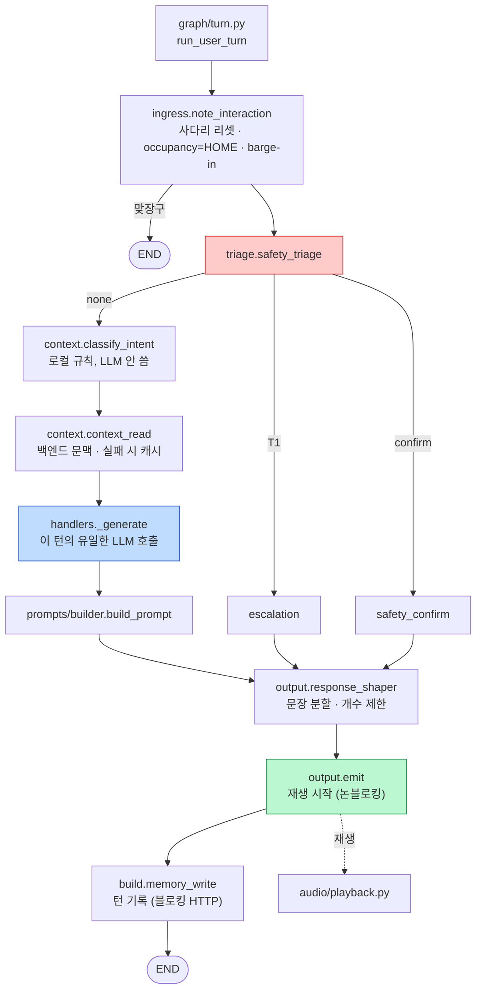

# 코드 읽는 순서

> **이 문서의 목적**: 어디부터 읽을지, 각 파일에서 **무엇을 봐야 하는지** 알려준다.
> 전부 읽을 필요는 없다. 목적별 경로를 §5 에 두었다.

읽기 전에 [CONCEPTS.md](CONCEPTS.md) 의 §1(용어)만 훑으면 훨씬 수월합니다.

> **2026-08-06 이후 저장소 하나에 전부 있습니다.** ai/be/fe/robot 네 라인이 `main` 으로
> 통합되어 워크트리를 옮겨 다닐 필요가 없습니다. 설계 헌법은
> [`임시보류_claude.md`](../../임시보류_claude.md)(구 CLAUDE.md, §1~§30)이고, 루트
> [`CLAUDE.md`](../../CLAUDE.md) 는 지금 진행 중인 **통합 스프린트 계약**입니다 —
> 이름이 비슷해 헷갈리기 쉬우니 절 번호를 인용할 때 어느 쪽인지 확인하십시오.

---

## 1. 30분 코스 — 전체 구조를 잡는다

이 순서로 읽으면 "무엇이 어디에 있는지"가 잡힙니다.

| 순서 | 파일 | 여기서 볼 것 |
|---|---|---|
| 1 | `임시보류_claude.md` §1, §5, §6 | 무엇을 만드는지, 누가 무엇을 소유하는지, 노드 그림 |
| 1b | 루트 `CLAUDE.md` | **지금 진행 중인 통합 스프린트의 계약** — 시나리오 배선, MQTT 계약, 검증 사다리. 위와 다른 문서다 |
| 2 | `robot/ai_chat/src/bomi_ai_chat/state.py` | **한 턴에 흐르는 값 전부.** 이 파일이 곧 목차다 |
| 3 | `.../graph/build.py` | 노드 배선. 로직 없음. 그림(§6)과 대조하며 읽는다 |
| 4 | `.../policy.py` | 로봇의 '성격'. 숫자만 읽어도 행동을 예측할 수 있다 |
| 5 | `docs/carebot/PROGRESS.md` | 지금 무엇이 되고 무엇이 안 되는지 |
| 6 | `docs/natural-conversation/current-state-audit.md` | **2026-08 이후 작업의 출발점.** 무엇이 이미 있고(세션·게이트) 무엇이 없는지(문맥 슬롯·참조 해소·기억 삭제), 파일:라인 근거로. 이어서 같은 폴더의 implementation-plan(Phase 1~7)·target-architecture 를 읽습니다 |

**2번이 핵심입니다.** 노드들은 서로를 import 하지 않고 오직 `ConvState` 의 키 이름에만 합의합니다. 그래서 이 파일을 읽으면 노드 간 계약을 전부 본 셈이 됩니다.

---

## 2. 대화 한 턴을 따라가기

어르신이 "무릎이 아파" 라고 말했을 때 무슨 일이 일어나는지, 실행 순서대로:

| 순서 | 파일 | 하는 일 |
|---|---|---|
| 1 | `graph/turn.py` | STT 텍스트를 받아 그래프를 호출. 지연 측정 시작 |
| 2 | `graph/ingress.py` `note_interaction` | 사다리 리셋, occupancy=HOME, **barge-in 판단** |
| 3 | `graph/triage.py` `safety_triage` | 안전 분류. T1 이면 여기서 파이프라인을 벗어난다 |
| 4 | `graph/context.py` `classify_intent` | 로컬 규칙으로 인텐트 결정. 정보 턴의 문서 요청 여부를 문맥 조회 전에 확정 (LLM 안 씀) |
| 5 | `graph/context.py` `context_read` | 백엔드에서 문맥 조회, 실패 시 캐시. `availability`와 요청별 `retrieval`을 정규화 |
| 6 | `graph/handlers.py` `_generate` | **이 턴의 유일한 LLM 호출** |
| 7 | `prompts/builder.py` `build_prompt` | 프롬프트 조립 (순수 함수) |
| 8 | `graph/output.py` `response_shaper` | 문장 분할, 개수 제한 |
| 9 | `graph/output.py` `emit` | 재생 시작 (**블로킹하지 않음**) |
| 10 | `graph/build.py` `memory_write` | 턴 기록(백엔드 HTTP)·`last_spoke_at`·표현 이력·사실 추출 큐잉. **`emit` 보다 나중이다** — 논블로킹 재생이 먼저, 블로킹 HTTP 가 나중 (255) |
| 11 | `audio/playback.py` | 문장을 하나씩 합성·재생 |

**10번의 위치가 뜻밖입니다.** `memory_write` 는 `output.py` 가 아니라 `build.py` 안에 삽니다 — 이 그래프에서 배선 파일이 로직을 가진 유일한 곳입니다.

같은 흐름을 그림으로도 둡니다. 표는 순서를 주지만 분기를 못 주고, 사람들이 가장 많이 틀리는 세 지점(맞장구 END / T1 우회 / `emit`→`memory_write` 순서)은 그림에서 한눈에 보입니다.

> **T1 은 `classify_intent` 와 `context_read` 를 통째로 건너뜁니다.** 그리고 `emit` 이
> `memory_write` 보다 먼저입니다 — 재생을 먼저 시작하고 기록은 뒤에서 합니다.

각 파일의 모듈 docstring 첫 문단이 "이 파일이 어디에 위치하는가"를 설명합니다.

### 2.1 문이 열렸을 때 (208)

대화 턴과 **완전히 다른 경로**입니다. 어디서 끝나는지를 보십시오.

| 순서 | 파일 | 하는 일 |
|---|---|---|
| 1 | `door/mqtt.py` `handle_payload` | 브로커에서 bytes 하나를 받는다 |
| 2 | `contracts/door.py` `parse_door_event` | 봉투 검증, **시각을 도착 시각으로 정규화** |
| 3 | `door/intake.py` `ingest` | 하트비트, 문 개폐, 보수적 재실, 백엔드 전달 |
| 4 | `door/occupancy.py` `set_occupancy` | **낡은 관측을 버린다.** `away_since` 유지 |
| 5 | `graph/ingress.py` `door_event` | checkpoint 에도 반영하고 **END** |

**5번에서 끝납니다.** 인사 제안이 없습니다 — 판정은 백엔드(226)이고, 그 결과는 `backend_command` 로 다시 들어옵니다.

주기 감시는 별도입니다: `jobs/ticks.py` `door_watch_tick` — 하트비트, 문 방치, 미귀가, 야간 배회.

---

## 3. 서버 쪽 (백엔드)

> **2026-08-06 이후 이 절은 같은 트리에서 열립니다.** 네 개 라인(ai/be/fe/robot)이 `main`
> 으로 통합되어, 예전처럼 `be-develop` 워크트리로 옮겨 갈 필요가 없습니다. 아래 경로는
> `com.ssafy.bomi` 패키지 기준 상대 경로이므로 `backend/src/main/java/com/ssafy/bomi/` 를
> 앞에 붙이십시오.

| 순서 | 파일 | 여기서 볼 것 |
|---|---|---|
| 1 | `docs/database/mvp-erd.md` §9 | 문맥 조립 레시피. **이것이 계약이다.** 같은 폴더의 `column-definition/`·`flyway-guide.md` 는 필요할 때만 |
| 2 | `context/api/ConversationContextResponse.java` | 로봇이 받는 것 전부. 응답 모양이 곧 명세 |
| 3 | `context/application/ConversationContextService.java` | 조립 로직. **§5 선필터가 핵심** |
| 4 | `memory/repository/MemoryRepository.java` | `findRetrievable` — 프라이버시 통제가 이 쿼리다 |
| 5 | `backend/src/main/resources/db/migration/` | 로봇 런타임이 쓰는 컬럼들. V1 부터 최신 V파일까지 — 정확한 기대 목록은 `FlywayMigrationValidationTest.migrationsApplyToEmptyDatabaseAndEntitiesValidate()` 가 갖고 있으니 숫자를 여기 다시 박지 않습니다 |

**4번을 반드시 보십시오.** 이 쿼리 하나가 "누가 어떤 기억을 볼 수 있는가"를 결정합니다. 여기가 틀리면 보호자에게 어르신의 속마음이 새어 나갑니다.

---

## 4. 파일별 한 줄 안내

### 로봇 (`robot/ai_chat/src/bomi_ai_chat/`)

| 파일 | 한 줄 |
|---|---|
| `clock.py` | **벽시계 시각**을 읽는 유일한 곳. 압축 시계로 하루를 10초에. 경과 시간(`time.monotonic`)은 예외다 — `turn_timer.py`·`http.py`·`stt/client.py`·`pipeline.py` 등이 직접 쓴다. 압축 시계에서 경과 시간을 배속하면 타임아웃 측정이 무의미해지기 때문 |
| `policy.py` | 제품 판단 상수. `config.py`(환경변수)와 성격이 다르다 |
| `config.py` | 환경변수. 배포마다 바뀌는 값 |
| `state.py` | 한 턴의 상태 스키마 + `SpeechProposal` |
| `bootstrap.py` | **런타임 배선 (232).** 200~211 에서 만든 그래프·게이트·사다리·현관·트리아지·온보딩·보호자 알림이 실행 경로에 실제로 연결되는 곳. `build_runtime()` 하나가 컴파일된 그래프에 재생기·백엔드 클라이언트를 꽂고 스케줄러와 현관 구독을 띄운다 |
| `turn_timer.py` | 턴 지연 실측. `clock` 이 아니라 `monotonic` 을 쓰는 이유가 적혀 있다 |
| `conversation_control.py` | 대화 시작·응답·종료 판단. 레거시 파이프라인과 그래프 런타임이 함께 쓴다 |
| `graph/build.py` | 배선만 |
| `graph/ingress.py` | 진입 **4경로** + barge-in. `door_event` 가 왜 END 로 끝나는지 여기 |
| `graph/gate.py` | 능동 발화 게이트 (**206**). 실제 캐스케이드는 6단: 유효성 → 저하(잡담 차단) → `not_before` → quiet hours → 쿨다운 → VAD busy. **폐기하는 것은 첫째뿐이고 나머지는 전부 연기다.** `not_before` 는 263 — T3 동의처럼 지연이 필요한 제안을 위한 것 |
| `graph/triage.py` | 안전 분류. **부정을 먼저, 통증은 부위로, 애매하면 부른다** |
| `graph/context.py` | 문맥 조회 + 인텐트 분류 |
| `graph/handlers.py` | 7개 핸들러 (**전부 구현됨**. `handle_emotional` 은 263) |
| `graph/output.py` | 정제 + 재생 시작 |
| `graph/turn.py` | 반응형 한 턴 실행. `turn_timer` 로 단계별 지연을 잰다 |
| `prompts/builder.py` | 프롬프트 조립 (순수 함수) |
| `degradation.py` | 압박이 올 때 무엇을 먼저 버리는가 (**212**). 안전 경로는 여기서 아예 쳐다보지 않는다 |
| `prompts/templates/*.md` | 실제 프롬프트 문구. **여기를 고치면 로봇 말투가 바뀐다** |
| `graph/contract_dialogue.py` | **무엇을 LLM 에게 맡기지 않는가.** 확인 판정의 규칙 |
| `backend_client/contract_client.py` | 온보딩·재질의 API. **실패하면 예외** (문맥 조회와 반대) |
| `contracts/door.py` | 기기 경계를 넘는 메시지 형태. **여기를 고치는 것은 호환성 결정** |
| `door/occupancy.py` | 재실 규칙. **"발화가 센서를 이긴다"가 여기서 시각 비교로 표현된다** |
| `door/intake.py` | 문 이벤트 하나의 처리. 저장소가 두 개인 이유가 여기 적혀 있다 |
| `door/mqtt.py` | 브로커 구독. 판정 로직이 없어서 브로커 없이 테스트된다 |
| `backend_client/` | 어르신의 사실·기억으로 가는 유일한 길 |
| `backend_client/conversation_client.py` | 대화 이벤트 적재(`conversation_message`), 보호자 알림 수신 (211) |
| `backend_client/door_client.py` | 현관 이벤트를 백엔드로 전달. 실패해도 로컬 안전 감시는 계속된다 (208) |
| `localstore/db.py` | **DB 파일이 왜 두 개인지**가 여기 적혀 있다 |
| `localstore/outbox.py` | 보호자 알림 큐. 전송보다 저장이 먼저 |
| `localstore/runtime.py` | 재부팅을 넘는 운영 상태. **틱이 읽는 쪽** |
| `localstore/schema.py` | 표 정의 + 뒤늦게 추가한 컬럼의 멱등 마이그레이션 |
| `localstore/proposals.py` | 게이트가 심판할 대기 목록 |
| `localstore/audio_cache.py` | critical 프로브용 캐시 오디오. 오프라인에서도 생존 확인 발화가 가능해야 한다 (§18). ⚠️ **표와 조회는 있으나 `register()` 를 부르는 프로덕션 코드가 아직 없어, 실기에서는 매번 "캐시 없음" 경고가 뜬다** |
| `localstore/context_cache.py` | 백엔드 문맥 조회 실패 시 읽는 로컬 캐시 (204) |
| `localstore/dump.py` | 로컬 DB 를 USB/서버로 내보내는 백업. **CLI 전용**(`python -m bomi_ai_chat.localstore.dump <경로>`)이고 코드 안에 자동 호출자가 없다 — "일간"은 cron/systemd 가 만든다 (§18) |
| `audio/echo_guard.py` | 자기 목소리를 걸러내는 판정 |
| `audio/vad.py` | Voice Activity Detection — 지금 누가 말하는지 값싸게 판정 (205) |
| `audio/playback.py` | **진행 상황의 권위.** 동기화 버그가 가장 나기 쉬운 곳 |
| `audio_io/wakeword.py` | 웨이크워드 감지. 항상 스트리밍하지 않기 위한 로컬 트리거 |
| `notify/base.py` | 보호자 채널 어댑터 인터페이스 |
| `notify/logging_notifier.py` | 기본 채널. 실제 보호자 채널이 없을 때 로그로만 기록 |
| `notify/backend_notifier.py` | **거절과 실패를 구분하는 곳.** 로봇은 푸시 서버를 모른다 |
| `jobs/ticks.py` | 주기 작업 7종(침묵·현관·outbox·일정·계약·동의·추출). 일간 요약은 백엔드로 옮겼다(211) — 파일에 남아 있는 `daily_summary_job` 은 **스케줄러에 등록되지 않은 스텁**이니 그 이름을 보고 되살리지 마십시오 |
| `jobs/scheduler.py` | `build_scheduler()` — APScheduler 배선. `bootstrap.py` 가 시작한다 (232). 등록되는 틱은 위 7개 |

### 시연 4개 시나리오를 실제로 굴리는 파일 (위 표에 빠져 있던 것)

| 파일 | 한 줄 |
|---|---|
| `ai_commands.py` / `contracts/ai_commands.py` | **백엔드 `START_CONVERSATION` 수신.** paho 콜백 스레드에서 파싱·중복제거·만료 확인·`CONVERSATION_STARTED` 발행까지 끝내고, 실제 대화는 큐로 메인 루프에 넘긴다 — 마이크는 한 스레드만 쥘 수 있어서 |
| `navigation_watch.py` | bridge 의 `robot/{id}/results` 를 엿들어 `ARRIVED` 만 신호로 세운다. "보미야" 뒤 이동 중 침묵이 여기서 나온다 |
| `robot_events.py` | 웨이크워드 감지를 MQTT 로 백엔드에 알린다(349). 이 이벤트가 보미야 호출 시나리오를 깨운다 |
| `search_signal.py` | "보미야"를 들은 방향을 로봇 내부로 알리는 UDP 신호. MQTT 계약이 payload 필드를 못 박아 각도를 실을 수 없어서 UDP 다 |
| `homecoming_gate.py` | 귀가 대본이 도는 동안 웨이크워드를 막는 게이트. 대본 중간에 거실 호출이 새로 시작되면 시연에서는 오작동으로 보인다 |
| `entrance_cheer.py` | 현관으로 출발할 때 내는 환호. 조용히 굴러가면 마중인지 알 수 없다 |
| `display_status.py` | 시연 LCD 가 읽는 대화 상태 공유 |
| `http.py` | 외부 HTTP 공통 timeout/재시도/오류 변환. **재시도는 429·502·503 뿐이고 504 는 안 한다**, 401/403 은 인증 실패로 구분한다 |
| `main.py` / `__main__.py` | 진입점 |

### 그 밖에 §4 표에 없던 모듈

| 파일 | 한 줄 |
|---|---|
| `graph/context_slots.py` | "거기", "그럼"이 무엇을 가리키는지 결정론으로 정하는 대화 문맥 슬롯. 순수 함수만 있다 |
| `graph/phrasing.py` | 표현 다양화 키. 반응형 턴은 `{intent}:reactive` — 2026-08-10 이전엔 반응형에 반복 방지가 없었다 |
| `localstore/emotion.py` | 정서 신호 누적과 T4 봉인. **발화 원문을 저장하지 않는다** |
| `localstore/consent.py` | T3 동의 요청의 생애주기. 제안이 지워진 뒤에도 "무엇에 대한 답인가"를 기억한다 |
| `localstore/extraction.py` | 사실 추출 대기열 I/O. 이 파일에 LLM 은 없다 |
| `localstore/cancellations.py` | "기억하지 마"의 **서버 절반** — 백엔드로 보낼 취소 요청 큐 (348) |
| `localstore/phrasings.py` | 발화 표현 이력. 기록할 때마다 보관 기간·개수 상한으로 스스로 잘라낸다 |
| `backend_client/fact_client.py` / `fact_contract.py` | 사실 후보 제출·취소 |
| `backend_client/session.py` | 공유 시크릿 헤더를 포함한 HTTP 세션 (307) |

⚠️ **패키지 import 로는 위 목록을 찾을 수 없습니다.** `graph/__init__.py` 와 `jobs/__init__.py` 는 완전히 비어 있어 `from bomi_ai_chat.graph import ...` 가 아무것도 주지 않습니다. 항상 하위 모듈을 직접 import 하십시오. `localstore/__init__.py` 는 재수출이 있지만 `__all__` 이 실제 모듈의 절반입니다 — `cancellations`·`consent`·`emotion`·`extraction`·`phrasings` 다섯이 빠져 있으니, 그 목록을 "이 패키지가 제공하는 것"으로 읽으면 절반을 놓칩니다.

### 손대지 않는 것 — 검증된 외부 클라이언트

| 파일 | 역할 |
|---|---|
| `llm/client.py` | Gemini 호출 |
| `llm/router.py` | 의료·날씨 질의 판정 — **키워드 결정 규칙**. 임베딩 라우터는 실측(기동 6.28s·약 732MB) 후 제거됨(d7ce99a); 비교 평가용으로만 `evals/`에 남음 |
| `stt/`, `tts/` | 외부 API 클라이언트 |
| `weather/`, `db/` | 날씨, 의료 참조 조회 |
| `audio_io/` | 장치 입출력. `audio/`(판단)와 다르다 |
| `pipeline.py` | `--legacy` 전용 구경로. **그래프를 거치지 않는다** — 게이트도, 침묵 사다리도, 트리아지도, 현관도 없다. 실기에서 그래프 경로에 문제가 생겼을 때 코드 수정 없이 즉시 되돌리기 위해서만 남아 있다(232) |

---

## 5. 목적별 경로

| 알고 싶은 것 | 읽을 것 |
|---|---|
| 로봇이 언제 말하는가 | `임시보류_claude.md` §7 → `policy.py` 우선순위 표 → `graph/gate.py` → 행동 확인은 `tests/test_proactive_gate.py` |
| 느려질 때 무엇을 버리는가 | `임시보류_claude.md` §18 → `policy.DEGRADATION_ORDER` → `degradation.py` → `graph/context.py`·`graph/gate.py` |
| 자연스러움을 어떻게 재는가 | `임시보류_claude.md` §17 → `tests/scenarios/naturalness_v1.json` → `tests/test_naturalness_replay.py` |
| 속마음을 언제 가족과 나누는가 | `임시보류_claude.md` §9 → `policy.py` `T3_CONSENT_SIGNAL_THRESHOLD`·`T3_CONSENT_DELAY_SEC` → `jobs/ticks.py` `consent_tick`(큐잉) → `graph/gate.py` `is_too_early`(연기) → `graph/handlers.py` `handle_emotional`(답 판정) |
| 로봇이 왜 이렇게 말하는가 | `prompts/templates/system.md` → `prompts/builder.py` |
| 무엇을 기억하는가 | `임시보류_claude.md` §8 → `MemoryRepository.findRetrievable` → `ConversationContextService` |
| 언제 보호자를 부르는가 | `임시보류_claude.md` §9 → `localstore/outbox.py` → `graph/triage.py` |
| 어르신이 끼어들면 | `임시보류_claude.md` §13 → `audio/playback.py` → `graph/ingress.py` |
| 오프라인이면 | `backend_client/context_client.py` → `localstore/context_cache.py` |
| 시연 5개 시나리오는 어떻게 흐르는가 | 루트 `CLAUDE.md` §1·§2 → `ai_commands.py` → `navigation_watch.py` → `bootstrap.py` |
| 왜 이 숫자인가 | `policy.py` — 모든 상수에 "올리면/내리면"이 적혀 있다 |

**T3 경로가 세 곳에 나뉜 것이 우연이 아닙니다.** 큐잉은 틱, 연기는 게이트, 답 판정은 핸들러입니다 — 그 분리를 모르면 "동의 질문이 왜 안 나오는가"를 엉뚱한 파일에서 찾습니다.

### 5.1 동작을 확인하려면

읽어서 이해한 다음, 실제로 그렇게 도는지는 테스트가 답합니다.

| 알고 싶은 것 | 테스트 |
|---|---|
| 능동 발화 게이트 | `tests/test_proactive_gate.py` |
| 반응형 한 턴 | `tests/test_reactive_turn.py`, `tests/test_turn_end_to_end.py` |
| 현관·재실 | `tests/test_door_occupancy.py` |
| T3 동의 | `tests/test_t3_consent.py` |
| 사실 추출 | `tests/test_extraction_flush.py` |
| 기억 프라이버시 | `tests/test_memory_privacy.py` |

⚠️ **PYTHONPATH 함정.** `ai_chat` 테스트와 단독 실행은 `env -u PYTHONPATH` 로 돌립니다 — ROS 가 얹은 lark/numpy 가 pytest 를 죽입니다. 반대로 **로봇을 구동할 때는 유지**해야 합니다. 진입점마다 다릅니다.

---

## 6. 읽을 때 알아두면 좋은 것

**주석이 코드보다 많은 파일이 있습니다.** 의도적입니다. `임시보류_claude.md` §2 가 "팀 대부분이 LangChain·RAG 경험이 없다"고 전제하고, 주석을 산출물로 규정합니다. 특히 `왜 존재하는가` / `주의사항` 절이 설계 판단을 담고 있습니다.

**다만 주석과 배선이 다르면 배선이 기준입니다.** 이 저장소의 주석에도 스테일이 실제로 있습니다 — 예를 들어 `graph/gate.py` 의 docstring 은 `door_event` 도 게이트로 온다고 쓰지만, 실제 배선은 2026-08-01 이후 그렇지 않습니다(`build.py` 에서 `door_event` 는 END 로 끝납니다).

**"이게 없으면 무엇이 깨지는가"가 자주 적혀 있습니다.** 그 문장이 그 코드의 존재 이유입니다. 예:

> 이 컬럼이 없으면 "아무도 움직이지 않았다"와 "라즈베리파이가 죽었다"를 구분할 수 없다.

**한글 주석 / 영문 식별자**가 규칙입니다(`임시보류_claude.md` §21 — 루트 `CLAUDE.md` 가 지금도 유효하다고 명시한 절입니다). 백엔드 Java 는 영문 Javadoc 이 기존 관례라 그쪽을 따릅니다.

⚠️ **`--legacy` / `USE_GRAPH_RUNTIME=false` 는 켜지 마십시오.** §4 의 `pipeline.py` 행이 말하는 "그래프를 거치지 않는다"는 곧 게이트·트리아지·침묵 감시·현관 연동이 **통째로 사라진다**는 뜻입니다. 실기에서 그래프 경로가 무너졌을 때의 마지막 되돌리기 수단이고, 시연 env 에서는 미설정 또는 true 로 고정합니다.
