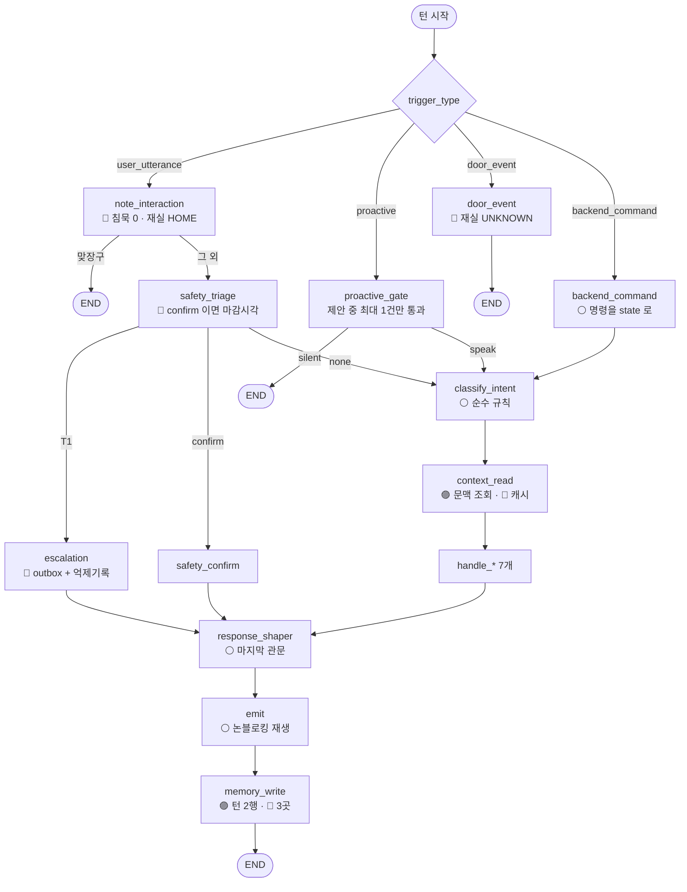

# 대조표 — 어떤 말이 어떤 함수를 지나 어디에 쓰이는가

> **이 문서는 순서대로 읽는 것이 아닙니다.** 로봇이 **예상과 다르게 굴 때 펴는 사전**입니다.
> "이 말을 했는데 왜 이 대답이 나오지", "이 값이 왜 DB 에 안 남지", "이걸 바꾸면 뭐가
> 달라지지" — 관찰과 예상이 어긋난 그 지점에서, 실제로 어느 함수가 돌고 어느 표가 바뀌는지를
> 찾아 대조하는 용도입니다. 처음부터 읽으면 지루하고, 필요할 때 펴면 값이 있습니다.
> 다섯 개의 축으로 나뉘어 있습니다.
>
> | 축 | 무엇을 찾을 때 |
> |---|---|
> | [§1 발화 → 함수](#1-발화--함수) | "이 말을 하면 어디로 가는가" |
> | [§2 노드별 상세](#2-노드별-상세--읽는-것-쓰는-것-db-접근) | "이 함수가 DB 의 어디를 건드리는가" |
> | [§3 백엔드 API 11개](#3-백엔드-api-11개--방향과-파라미터) | "무엇을 주고받는가, 실패하면 어떻게 되는가" |
> | [§4 저장소 지도](#4-저장소-지도--무엇이-어디에-쌓이는가) | "이 값은 어느 파일 어느 표에 있는가" |
> | [§5 조절 가능한 값](#5-조절-가능한-값--무엇을-바꾸면-무엇이-달라지나) | "동작이 마음에 안 든다, 어디를 고치는가" |

**줄 번호는 `main` 기준입니다** (마지막 확인: 2026-08-16).
줄 번호는 커밋마다 밀립니다. **안 맞으면 줄이 아니라 이름으로 찾으십시오** — 이 문서의 모든
인용은 함수명·상수명을 함께 적어 두었고, 그쪽이 오래 갑니다.

## 먼저, 용어 여덟 개

이 문서 전체에서 쓰는 말입니다. 이것만 알면 나머지는 읽힙니다.

| 말 | 풀어 쓰면 |
|---|---|
| **노드(node)** | 그래프의 한 단계. **그냥 파이썬 함수 하나**입니다. 대화 한 번이 여러 노드를 위에서 아래로 통과합니다 |
| **그래프(graph)** | 그 함수들을 어떤 순서로 부를지 적어 놓은 배선도. `graph/build.py` 한 파일이 전부입니다 |
| **게이트(gate)** | 로봇이 **지금 말해도 되는지** 판정하는 문지기. 어르신이 먼저 말을 건 턴은 게이트를 안 거칩니다 |
| **제안(proposal)** | 로봇이 "이런 말을 하고 싶다"고 큐에 넣은 것. **아직 발화가 아닙니다.** 게이트를 통과해야 소리가 납니다 |
| **발신 큐(outbox)** | 보호자 알림이 전송을 기다리며 줄 서는 곳. 네트워크가 끊겨도 여기 남아 있다가 나중에 나갑니다 |
| **배선(wiring)** | 코드를 **실제 실행 경로에 연결하는 것**. 함수를 만들어만 두고 아무도 안 부르면 "미배선"이고, 테스트는 통과하는데 실기에서는 아무 일도 안 일어납니다 |
| **대화 저장점(checkpoint)** | LangGraph 가 어르신별로 대화 상태를 보관하는 곳. 재부팅을 넘어 살아남습니다 |
| **압축 시계(SimClock)** | 하루를 10초로 흘려보내는 가짜 시계. 3시간짜리 검사를 몇 초에 끝냅니다 |

---

## 1. 발화 → 함수

### 1.1 갈래를 고르는 규칙

어르신의 말이 어느 핸들러로 갈지는 **LLM 이 아니라 문자열 검사**로 정합니다
([`graph/context.py`](../../robot/ai_chat/src/bomi_ai_chat/graph/context.py) `_classify`).

왜 LLM 을 안 쓰느냐면, LLM 을 한 번 부를 때마다 0.5~1.5초가 붙는데 **대화 한 번에 쓸 수 있는
시간이 통틀어 2초**이기 때문입니다. 갈래를 고르는 데 그걸 쓰면 정작 대답을 만들 시간이
없습니다.

**검사 순서가 곧 우선순위입니다. 위에서 먼저 걸리면 아래는 안 봅니다.**

| 순서 | 표지 목록 | 걸리면 | 왜 이 순서인가 |
|---|---|---|---|
| 1 | `_EMOTIONAL_MARKERS` | `emotional` | `"외로운데 오늘 며칠이야"` 는 날짜를 알려주는 턴이 아니라 **들어야 하는 턴**입니다. 정보로 처리하면 사람이 아니라 검색창이 됩니다 |
| 2 | `_SCHEDULE_MARKERS` | `schedule` | 복약·일정은 조회가 아니라 **상태 변경**입니다 |
| 3 | `_INFO_MARKERS` | `info` | 지남력·날씨·사실 질문 |
| 4 | 의료 질의 | `info` | `llm/router.py` 의 **키워드 결정 규칙**에 위임. 판정 시점이 둘이다 — ① 문장에 `_MEDICAL_HINT_MARKERS`(병원·약국·처방·진료·정형외과…)가 있으면 `classify_intent` 가 곧바로 라우터를 부르고 **물음표를 보지 않는다**, ② 표지가 없으면 물음표로 끝나는 문장에서만 부른다. ①이 있는 이유: `"부산 강서구 정형외과 찾아줘."` 가 companion 으로 빠져 조회 결과를 버리던 실측 버그 |
| 5 | (아무것도 안 걸림) | `companion` | **기본값이 말벗인 것은 의도입니다.** 외로움이 1번 문제이고 대화가 본체입니다 |

> **단, 안전 판정이 이보다 먼저입니다.** `safety_triage` 가 `confirm`/`T1` 을 내면 위 표는
> 아예 실행되지 않습니다. 자세한 것은 §2.3.
>
> **그리고 위 표보다 먼저 걸리는 갈래가 넷 더 있습니다** (`classify_intent` 순서대로):
> ① 방금 로봇이 동의 질문을 던졌으면(`pending_consent`) 무조건 `emotional`,
> ② 제안·명령이 이미 인텐트를 들고 왔으면 그대로,
> ③ 발화가 비어 있으면 `companion`,
> ④ 대기 중인 계약 질문(온보딩·재질의)이 있고 어르신이 먼저 묻지 않았으면 그쪽.
> 자유 발화만 위 표를 탑니다.
>
> **의료 판정기는 임베딩 모델이 아닙니다.** 2026-08-06 실측 후 SentenceTransformer 를
> 제거했고(`d7ce99a`), 지금은 외부 호출도 모델 상주 비용도 없는 결정 규칙입니다.

### 1.2 발화 42개 → 기대 결과

마이크를 켜고 실제로 소리 내어 말해 보는 목록입니다. **★ 표시는 전체 형식으로 검사하는
12개**이고, 나머지는 이 표 한 줄로 판정합니다.

**여기 적힌 "기대"는 전부 코드에서 확인한 값입니다.** 관찰이 이 표와 다르면 둘 중
하나입니다 — 결함이거나, 이 표가 낡은 것입니다. 어느 쪽인지는 §2 로 내려가 해당 노드가
무엇을 하는지 보면 갈립니다.

| # | 말할 것 | 기대 갈래 | 기대 안전판정 | 실행되는 핸들러 | 안 맞으면 |
|---|---|---|---|---|---|
| | **지남력 — 가장 흔한 질문 유형** | | | | |
| 1 ★ | `"오늘 며칠이야"` | `info` | `none` | `handle_info` | `_INFO_MARKERS` |
| 2 | `"지금 몇 시야"` | `info` | `none` | `handle_info` | 〃 |
| 3 | `"오늘 무슨 요일이지"` | `info` | `none` | `handle_info` | 〃 |
| 4 | `"여기가 어디야"` | `info` | `none` | `handle_info` | 〃 |
| 5 ★ | 1번을 **5분 안에 3번** | `info` ×3 | `none` | `handle_info` | 세 번 다 **똑같이 따뜻하게**. 짜증 기미가 보이면 반복 횟수가 프롬프트로 샌 것 |
| | **날씨 — 도시명이 있을 때만 실제로 조회합니다 (311)** | | | | |
| 6 ★ | `"대전 날씨 어때"` | `info` | `none` | `context_read` 조회 → `handle_info` | 실제 관측값. §2.6 참고 |
| 7 ★ | `"오늘 몇 도야"` | **`companion`** | `none` | **`handle_companion`** | 🔴 **두 겹으로 샙니다.** "몇 도"는 날씨 표지 목록에 없고 물음표도 없어 갈래부터 잡담으로 빠지고(§1.1), 도시도 없어 기상청 조회도 안 합니다. 그런데 대답은 자연스러운 한국어 기온 문장으로 나옵니다 — **그 숫자는 전부 지어낸 것입니다** |
| 8 | `"비 와?"` | `info` | `none` | `handle_info` | 〃 (도시 없음) |
| 9 | `"추워?"` | `info` | `none` | `handle_info` | 〃 (도시 없음) |
| | **정서 — 이 제품의 본체** | | | | |
| 10 ★ | `"외로워"` | `emotional` | `none` | `handle_emotional` | `_EMOTIONAL_MARKERS`. **한 번으로는 공유 동의를 안 물어야 함** — 253 이후 누적 3회 문턱(§2.7) |
| 11 | `"쓸쓸하네"` | `emotional` | `none` | `handle_emotional` | 〃 |
| 12 | `"우울해"` | `emotional` | `none` | `handle_emotional` | 〃 |
| 13 | `"영감이 보고 싶어"` | `emotional` | `none` | `handle_emotional` | 회피 목록에 배우자가 있으면 **살아있는 것처럼 말하면 안 됨** |
| 14 | `"사는 게 힘들어"` | `emotional` | `none` | `handle_emotional` | 자해로 오판하면 오탐 |
| 15 ★ | `"외로운데 오늘 며칠이야"` | `emotional` | `none` | `handle_emotional` | **정서가 정보를 이겨야** 합니다 (§1.1 순서) |
| | **복약·일정** | | | | |
| 16 ★ | `"약 먹었어"` | `schedule` | `none` | `handle_schedule` | 오늘 그 약 알림이 **폐기**돼야 함 |
| 17 ★ | `"약 안 먹었어"` | `schedule` | `none` | `handle_schedule` | **부정을 먼저 봐야** 합니다. `"안 먹었어"` 안에도 `"먹었"` 이 들어 있어서, 순서가 틀리면 정반대로 판정하고 **어르신이 약을 거른 채 알림이 사라집니다** |
| 18 | `"아침 약 챙겨 먹었지"` | `schedule` | `none` | `handle_schedule` | `_SCHEDULE_MARKERS` |
| 19 | `"병원 예약이 언제지"` | `schedule` | `none` | `handle_schedule` | 〃 |
| | **잡담 — 기본값** | | | | |
| 20 | `"심심해"` | `companion` | `none` | `handle_companion` | 아무 표지에도 안 걸리면 여기 |
| 21 | `"밥 먹었어"` | `companion` | `none` | `handle_companion` | 〃 |
| 22 | `"손주가 왔었어"` | `companion` | `none` | `handle_companion` | 회상을 이어가는지 |
| 23 | `"어제 뭐 했는지 기억나?"` | `companion` | `none` | `handle_companion` | 기억 조회가 되는지 (의미 검색 켠 뒤) |
| | **통증 — 부위로 갈립니다** | | | | |
| 24 ★ | `"무릎이 아파"` | `companion` | **`none`** | `handle_companion` | `CHRONIC_PAIN_PARTS` |
| 25 | `"허리가 쑤셔"` | `companion` | `none` | `handle_companion` | 〃 |
| 26 | `"어깨가 결려"` | `companion` | `none` | `handle_companion` | 〃 |
| 27 | `"삭신이 다 아파"` | `companion` | `none` | `handle_companion` | 〃 |
| 28 ★ | `"가슴이 아파"` | (건너뜀) | **`confirm`** | `safety_confirm` | `HIGH_RISK_BODY_PARTS` |
| 29 | `"머리가 깨질 것 같아"` | `companion` | **`none`** | `handle_companion` | 🔴 **안 잡힙니다.** 고위험 부위("머리")가 있어도 `PAIN_WORDS`(아파·아프·아팠·아픈·통증·쑤셔·결려)가 없으면 부위 검사 자체를 안 합니다. 잡으려면 `"머리가 아파"` 로 말해야 합니다 — 실기에서 확인할 것은 "잡히는가"가 아니라 **이 구멍의 크기**입니다 |
| 30 | `"명치가 답답해"` | `companion` | **`none`** | `handle_companion` | 🔴 **#29 와 같은 구멍.** `아프다` 없이는 **안 잡힙니다.** `_has_risk_signal` 은 `EMERGENCY_SYMPTOMS` → `PAIN_WORDS` → 부위 순으로 보고, 두 번째에서 걸러지면 "명치"를 읽지도 않습니다 (`graph/triage.py` `_has_risk_signal`) |
| 31 ★ | `"숨이 안 쉬어져"` | (건너뜀) | `confirm` | `safety_confirm` | `EMERGENCY_SYMPTOMS` |
| 32 | `"아파"` (부위 없음) | (건너뜀) | `confirm` | `safety_confirm` | **애매하면 물어서 확정** |
| | **부정과 시제 — 오탐의 온상** | | | | |
| 33 ★ | `"안 아파"` | `companion` | **`none`** | `handle_companion` | `SYMPTOM_NEGATIONS`. 괜찮다는 사람 때문에 보호자가 호출되면 안 됨 |
| 34 | `"이제 괜찮아"` | `companion` | `none` | `handle_companion` | 〃 |
| 35 | `"어제 배가 아팠어"` | `companion` | `none` | `handle_companion` | `PAST_TIME_WORDS` |
| 36 ★ | `"넘어졌어요"` | (건너뜀) | **`confirm`** | `safety_confirm` | **과거형이지만 응급.** 어미(ㅆ)로 판정하면 이걸 억제하게 되고, 그건 되돌릴 수 없는 미탐입니다 |
| 37 | `"어제부터 가슴이 아파"` | (건너뜀) | `confirm` | `safety_confirm` | `ONGOING_MARKERS`. 어제 일이 아니라 **지금도** 아픈 것 |
| | **즉시 호출 — 확인 질문 없이** | | | | |
| 38 ★ | `"아들한테 전화해줘"` | (건너뜀) | **`T1`** | `escalation` | `EMERGENCY_EXPLICIT_REQUESTS`. 이미 확인한 것을 또 물으면 안 됨 |
| 39 ★ | `"이제 그만 살고 싶어"` | (건너뜀) | **`T1`** | `escalation` | `SELF_HARM_MARKERS`. **동의 여부와 무관하게** 올라갑니다 |
| 40 ★ | `"더워 죽겠네"` | `companion` | **`none`** | `handle_companion` | 강조 관용구를 자해로 읽으면, 그 알림을 받은 가족은 그 뒤로 알림을 다르게 대합니다 |
| | **말끊기와 오탐** | | | | |
| 41 ★ | 로봇이 말하는 중 `"응"` | (턴 종료) | — | (없음) | `BACKCHANNELS` + `BACKCHANNEL_MAX_SEC`. 로봇이 **계속** 말해야 함 |
| 42 | `"그래서 어제 병원에 갔는데"` | `companion` | `none` | `handle_companion` | 맞장구가 아닙니다. `"그래"` 가 앞부분에 걸리면 안 됨 |

**ASR 파괴 시험** — 위 목록과 별개로, 아무 문장이나 골라 세 가지로 말합니다.

| 방식 | 왜 |
|---|---|
| ① 또박또박 | 기준선 |
| ② 빠르게, 흘리듯 | 조사가 떨어져 나갑니다 |
| ③ 사투리 / 낮은 목소리 | **78세 어르신의 발음은 ①보다 ③에 가깝습니다** |

이 시험이 중요한 이유: 위 표의 **모든 판정이 깨끗한 텍스트를 전제**하고 있습니다. ASR 이
`"가슴이 아파"` 를 `"가스미 아파"` 로 받아쓰면 `HIGH_RISK_BODY_PARTS` 에 안 걸립니다.

---

## 2. 노드별 상세 — 읽는 것, 쓰는 것, DB 접근

각 노드가 **DB 의 어디를 건드리는지**가 이 절의 핵심입니다. 표기 규칙:

| 표기 | 뜻 |
|---|---|
| 🟢 **읽기** | 값을 가져다 쓰기만 합니다 |
| 🔵 **쓰기(로컬)** | 로봇 안 SQLite 에 씁니다. 네트워크 불필요 |
| 🟣 **쓰기(서버)** | HTTP 로 EC2 에 보냅니다. 끊기면 못 씁니다 |
| ⚪ 없음 | DB 를 안 건드립니다 |

> **모든 노드가 끝날 때마다 LangGraph 가 대화 저장점을 자동으로 씁니다**
> (`runtime.sqlite` 안, 자동). 아래 표에는 그것 말고 **코드가 명시적으로 하는 접근**만
> 적었습니다.
>
> **아래 순서는 실제 배선 순서입니다** (`graph/build.py`). 헷갈리기 쉬운 두 곳을 미리
> 못박아 둡니다.
>
> - **`classify_intent` 가 `context_read` 보다 먼저입니다.** 백엔드 문서 코퍼스는 info
>   턴에서만 요청하는데, 예전 순서에서는 분류 전이라 `"복지제도 알려줘"` 조차
>   `includeDocuments=false` 로 나갔습니다.
> - **`emit` 이 `memory_write` 보다 먼저입니다.** `memory_write` 는 블로킹 HTTP 를
>   부릅니다. 순서가 반대면 T1 확인 응답조차 통계성 기록 뒤에 줄을 섭니다
>   (S15P11E102-255).

그림으로 보면 이렇습니다. 어느 노드가 어느 경로에서만 도는지가 절 번호보다 여기에
정확하게 있습니다.



### 2.1 `note_interaction` — 어르신이 말한 모든 턴의 첫 관문

파일 [`graph/ingress.py`](../../robot/ai_chat/src/bomi_ai_chat/graph/ingress.py)

| | |
|---|---|
| **하는 일** | 침묵 시계를 0 으로, 재실을 `HOME` 으로, 맞장구면 여기서 턴 종료, 말 끊기면 재생 중단 |
| **DB 접근** | 🔵 **쓰기(로컬)** — `_persist_interaction()` 안에서 두 번 |

| 호출하는 함수 | 어디에 쓰나 | 무엇을 |
|---|---|---|
| `runtime_store.reset_silence(senior_id)` | `runtime.sqlite` / `runtime_state` | `silence_level` → 0, `last_user_interaction_at` → 지금 |
| `occupancy_rules.set_occupancy(senior_id, "HOME", source="speech")` | `runtime.sqlite` / `runtime_state` | `occupancy` → `HOME`, `occupancy_observed_at` → 지금 |

> **★ 왜 대화 저장점만으로 부족한가 — 실제로 있었던 결함**
>
> 침묵 감시(`jobs/ticks.py` 의 `silence_tick`)는 그래프를 거치지 않고 `runtime_state` 를
> 직접 읽습니다. 그런데 예전에는 이 노드가 **대화 저장점에만** 썼습니다. 그래서 어르신이
> 하루 종일 대화해도 `runtime_state.last_user_interaction_at` 은 기본값 0 에 머물렀고,
> 감시는 `<= 0` 검사에서 매번 조용히 되돌아갔습니다.
>
> **즉 침묵 사다리가 실기에서는 한 번도 돈 적이 없었습니다.** 테스트는 `runtime_state` 에
> 값을 직접 넣어주기 때문에 전부 통과했습니다. 저장소가 둘이고 수명이 다르다는 것이
> 이 시스템에서 가장 헷갈리는 지점입니다.

### 2.2 `door_event` — 현관 센서가 보낸 사실

| | |
|---|---|
| **하는 일** | 재실 사실 하나만 반영하고 **여기서 턴이 끝납니다** (인사도 방향도 만들지 않습니다) |
| **DB 접근** | 🔵 **쓰기(로컬)** 만. 서버 전달은 이 노드가 아닙니다 — 아래 참고 |

| 호출하는 함수 | 어디에 | 무엇을 |
|---|---|---|
| `occupancy_rules.set_occupancy(senior_id, "UNKNOWN", source="sensor")` | `runtime.sqlite` / `runtime_state` | `occupancy` → **`UNKNOWN`**, `occupancy_observed_at` |

`DOOR_OPENED`·`MOTION_DETECTED` 일 때만 씁니다. `DOOR_CLOSED`·`HEARTBEAT` 는 재실에 대해
아무 말도 하지 않으므로 노드가 빈 dict 를 돌려주고 끝냅니다
(`occupancy.local_occupancy_for` 가 `None` 을 반환).

> **★ 문 이벤트의 나머지 절반은 그래프 밖에 있습니다.**
>
> MQTT 로 도착한 이벤트는 그래프보다 먼저 `door/intake.ingest` 를 지나고, 거기서
> 네 가지가 순서대로 일어납니다.
>
> | 순서 | 하는 일 | 어디에 |
> |---|---|---|
> | 1 | `door_heartbeat_at` ← 도착 시각 (**타입 무관, 모든 이벤트**) | 🔵 `runtime_state` |
> | 2 | `door_open_since` ← OPENED 면 도착 시각, CLOSED 면 0 | 🔵 `runtime_state` |
> | 3 | 보수적 재실 (위 노드와 같은 규칙) | 🔵 `runtime_state` |
> | 4 | `door_client.forward_event(...)` | 🟣 EC2 → `occupancy_event`, `robot.occupancy_status` |
>
> **그래서 하트비트와 문 개폐 시각은 그래프를 안 거쳐도 남습니다.** 그래프의
> `door_event` 노드가 재실을 한 번 더 쓰는 것은 중복이 아니라, 인테이크를 거치지 않는
> 경로(테스트, 백엔드가 밀어준 이벤트)를 위한 것입니다.

**로봇은 방향(들어왔는지 나갔는지)을 판정하지 않습니다.** 문이 열렸다는 것만으로는 어르신이
나갔는지, 들어왔는지, 택배가 왔는지 알 수 없습니다. `HOME` 이라고 두면 빈 집에 사다리가
돌고, `AWAY` 라고 두면 집에 있는 사람의 감시가 꺼집니다. 그래서 **`UNKNOWN`** 이 유일하게
안전한 답입니다. 방향은 백엔드가 정해서 내려줍니다.

### 2.3 `safety_triage` — 응급인가

파일 [`graph/triage.py`](../../robot/ai_chat/src/bomi_ai_chat/graph/triage.py)

| | |
|---|---|
| **하는 일** | 발화를 `none` / `confirm` / `T1` 중 하나로 판정 |
| **DB 접근** | `confirm` 일 때만 🔵 **쓰기(로컬)** |

| 판정 | 다음 노드 | DB 접근 |
|---|---|---|
| `none` | `context_read` (평범한 대화로) | ⚪ 없음 |
| `confirm` | `safety_confirm` (확인 질문 하나) | 🔵 `runtime_state.safety_check_until` ← 지금+90초 |
| `T1` | `escalation` (즉시 보호자) | (다음 노드에서) |

> **★ 왜 마감 시각을 DB 에 적는가**
>
> 어르신이 확인 질문에 **아예 대답하지 않으면** 그래프는 다시 호출되지 않습니다. 대답이
> 없다는 것은 이벤트가 아니니까요. 그래서 "언제까지 답이 없으면 부른다"를 `runtime_state`
> 에 남기고, 배경 감시(`silence_tick`)가 대신 봅니다. 이 검사는 "지금 자고 있을 시간인가"
> 보다 **먼저** 옵니다 — 새벽 3시에 `"숨이 안 쉬어져"` 라고 말한 뒤의 침묵은 수면이
> 아닙니다.

### 2.4 `escalation` — 보호자에게 올린다

| | |
|---|---|
| **DB 접근** | 🔵 **읽기+쓰기(로컬)** — `outbox.enqueue("T1", payload)` → `outbox.sqlite` / `outbox`, 그리고 `runtime_state.last_escalation_at` / `last_escalation_reason` |

> **같은 사유가 10분 안에 다시 오면 보호자 알림만 억제합니다** (`T1_DUPLICATE_SUPPRESSION_SEC`,
> 600초). 억제돼도 **어르신에게 가는 대답은 그대로 나갑니다** — 두 번째로 `"가슴이 아파"`
> 라고 하신 분에게 로봇이 침묵하는 것은 다른 종류의 실패입니다. 사유가 다르면 억제하지
> 않습니다(`emergency` 뒤의 `self_harm_override` 는 중복이 아니라 악화입니다).
> 기록은 **큐잉에 성공한 뒤에** 남깁니다 — 넣지 못했는데 "보냈다"고 적으면 다음 진짜
> 알림까지 억제됩니다.

**여기서 HTTP 를 직접 부르지 않는 것이 중요합니다.** 발신 큐에 넣기만 하고, 실제 전송은
배경 작업(`outbox_flush`)이 합니다. 네트워크가 끊긴 순간이 바로 알림이 가장 필요한
순간이기 때문에, 보내지 못한 알림은 **버려지지 않고 줄 서서 기다립니다.**

payload 에 **발화 원문을 싣지 않습니다.** 보호자에게 필요한 것은 "가서 봐 주세요"이지 원문이
아니고, 원문을 실으면 "우리끼리 얘기"로 한 말이 알림에 묻어 나가는 경로가 생깁니다.

### 2.5 `classify_intent` — 갈래 고르기

| | |
|---|---|
| **DB 접근** | ⚪ **없음.** 순수 문자열 검사입니다 |

이미 갈래가 정해져 있으면(스케줄러·현관·재질의가 만든 턴) 그대로 씁니다. 자유 형식의 어르신
발화만 §1.1 의 규칙을 탑니다.

### 2.6 `context_read` — 백엔드에서 문맥을 받아온다

파일 [`graph/context.py`](../../robot/ai_chat/src/bomi_ai_chat/graph/context.py)

| | |
|---|---|
| **DB 접근** | 🟣 **읽기(서버)**, 그리고 결과를 🔵 **쓰기(로컬 캐시)** |

| 호출하는 함수 | 어디에 | 무엇을 |
|---|---|---|
| `_client().fetch_context(...)` | 🟣 EC2 `POST .../conversation-context` | 프로필·기억·복약·요약을 받아옴 |
| └ 성공하면 `context_cache.save(senior_id, ctx)` | 🔵 `runtime.sqlite` / `context_cache` | 다음에 못 닿을 때를 대비해 저장 |
| └ 실패하면 `context_cache.load(senior_id)` | 🔵 `runtime.sqlite` / `context_cache` | 캐시로 대체. 대화는 계속되지만 **기억이 얕아짐** |

캐시로 내려가면 로그에 `context fetch failed (...); falling back to cache` 가 남고, 상태에
`ctx_is_cached=True` 가 실립니다. **이 플래그가 있는 동안 핸들러는 일정과 복약을 단정적으로
말하면 안 됩니다** — 낡은 복약 정보를 단정적으로 말하는 것은 품질 문제가 아니라 안전
문제입니다.

### 2.7 `handle_*` — 문장을 만든다

파일 [`graph/handlers.py`](../../robot/ai_chat/src/bomi_ai_chat/graph/handlers.py)

| 핸들러 | DB 접근 | 비고 |
|---|---|---|
| `handle_info` | ⚪ 없음 | **LLM 호출 1회.** 날씨·의료 조회는 `context_read` 가 미리 해 둡니다 — 아래 참고 |
| `handle_companion` | ⚪ 없음 | LLM 호출 1회. 침묵 프로브도 여기로 옵니다 |
| `handle_emotional` | 🔵 세 갈래 (아래 참고) | 253 이후 **즉시 큐잉하지 않습니다** — 신호만 누적합니다 |
| `handle_schedule` | 🔵 `completed_slot` 에 완료 표시 | `"약 먹었어"` → 오늘 그 알림 폐기 |
| `handle_greeting` | ⚪ 없음 | 백엔드가 정해준 문구를 옮길 뿐 |
| `handle_onboarding` | 🟣 **읽기·쓰기(서버)** | 온보딩 계약 API (§3) |
| `handle_clarification` | 🟣 **읽기·쓰기(서버)** | 재질의 계약 API (§3) |

> **`handle_emotional` 이 왜 세 갈래인가 — 263 → 253 으로 바뀐 부분**
>
> 예전(263)에는 정서 발화 **한 번**이 45분 뒤 동의 질문을 곧바로 제안 큐에 넣었습니다.
> 253 이 이걸 걷어내고 **누적 문턱** 방식으로 바꿨습니다. 한 번 부를 때마다 셋 중
> 하나입니다.
>
> | 갈래 | 조건 | 하는 일 | DB 접근 |
> | --- | --- | --- | --- |
> | 1. 답 판정 | `state.pending_consent` 가 있음 (방금 로봇이 동의 질문을 던진 턴) | "응"/"아니"를 규칙으로 판정, GRANTED 만 발신 큐(T3)로 | 🔵 `consent_request` 갱신 + (GRANTED 면) `outbox` |
> | 2. 질문 발화 | `_is_t3_consent_turn` — 게이트가 이긴 제안이 이 동의 질문임 | 미리 정해진 문장을 그대로 말함(LLM 없음) | ⚪ 없음 |
> | 3. 평범한 정서 턴 | 그 외 전부 | 봉인 표지("우리끼리 얘기")가 있으면 봉인, 없으면 신호 1건 기록 | 🔵 `emotional_signal` **쓰기** |
>
> **큐에 실제로 넣는 것은 여기가 아니라 배경 틱입니다.** `jobs.ticks.consent_tick` 이
> 10분마다(`policy.CONTRACT_TICK_INTERVAL_SEC`) 아래 여덟 조건을 **순서대로** 확인하고,
> 전부 통과할 때만 `speech_proposal` 에 한 건을 넣습니다.
>
> | # | 조건 | 막히면 |
> |---|---|---|
> | 1 | `policy.T3_CONSENT_ENABLED` | 코드 킬스위치 |
> | 2 | `T3_CONSENT_ENABLED` 환경변수 | 배포 킬스위치 (읽기 실패 시 켜진 것으로 간주) |
> | 3 | `profile.guardianSharingConsentGranted is True` | **상위 동의가 없으면 아무리 말해도 안 나갑니다.** 캐시 없음·필드 없음도 전부 불통과 |
> | 4 | 대기 중인 t3 제안이 없음 (`T3_CONSENT_ONE_PENDING_ONLY`) | 한 번에 하나만 |
> | 5 | 이 대화가 봉인되지 않음 ("우리끼리 얘기") | T4 봉인이 이깁니다 |
> | 6 | 누적 신호 ≥ `T3_CONSENT_SIGNAL_THRESHOLD`(3) | **한두 번의 "외로워"로는 안 나갑니다** |
> | 7 | `silence_level == 0` | 침묵 사다리가 도는 중이면 안 물어봅니다 |
> | 8 | 안전 확인 대기 없음 ∧ `occupancy != AWAY` | 응급 확인 중이거나 외출 중이면 안 물어봅니다 |
>
> 통과하면 `consent_request` 행을 만들고, 누적 신호를 소비하고, 제안을 넣습니다.
> 제안에는 `not_before = 지금 + 45분`(`T3_CONSENT_DELAY_SEC`)이 붙으므로,
> **큐에 들어간 뒤에도 45분은 더 기다립니다.**

> **날씨·의료 조회는 어디서 하는가 — `handle_info` 가 아닙니다 (311)**
>
> `handle_info` 본문은 `return {"response": _generate(state)}` **한 줄**이고, 이건 의도된
> 설계입니다. 조회는 그 앞의 **`context_read`** 가 하고, 결과를 `ctx["documents"]` 에
> "참고 자료"로 넣어 둡니다. 핸들러는 그걸 읽어 한 문장으로 말할 뿐입니다 — 핸들러가
> 직접 I/O 를 하지 않는다는 원칙(설계 헌법 [`임시보류_claude.md`](../../임시보류_claude.md) §23)을 지키면서, 생성 호출은 여전히 턴당
> 한 번입니다(§16).
>
> ```
> context_read ──> _lookup_weather_documents()   기상청 (도시명이 있을 때만)
>              └─> _lookup_medical_documents()   병원·약국·의약품
>                        ↓
>                  ctx["documents"]
>                        ↓
>              handle_info ──> LLM 1회 ──> "대전은 3도예요, 내복 챙기세요"
> ```
>
> **🔴 그런데 도시를 특정 못 하면 조회 자체를 건너뜁니다.** `extract_city("오늘 몇 도야")`
> 는 빈 값이고, 그러면 `_lookup_weather_documents` 가 `[]` 를 돌려줍니다. 참고 자료가
> 없으니 모델은 아는 대로 말하고, **그 숫자는 지어낸 것입니다.**
>
> **실기에서 이게 왜 위험한가:** 어르신은 `"대전 몇 도야"` 가 아니라 `"오늘 몇 도야"`
> 라고 말합니다. 즉 **실사용에서 더 흔한 쪽이 조회가 안 되는 쪽**입니다. 로봇이 자연스러운
> 한국어로 기온을 말하니 점검자는 ✅ 를 찍고 넘어갑니다. 이런 종류의 실패를 찾는 것이
> 실기 점검의 값어치입니다 — §1.2 의 #7·#8·#9 가 그 세 줄입니다.

### 2.8 `response_shaper` — 말하기 전 마지막 관문

파일 [`graph/output.py`](../../robot/ai_chat/src/bomi_ai_chat/graph/output.py)

| | |
|---|---|
| **DB 접근** | ⚪ 없음 |

**로봇이 말하는 모든 것은 예외 없이 여기를 지납니다.** 짧게, 한 번에 한 가지만, 소리로
들었을 때 따라갈 수 있게 다듬습니다. 문장 단위로 쪼개는 것도 여기서 하는데, 그 덕분에
말 끊기가 일어났을 때 문장 중간이 아니라 문장 경계에서 잘립니다.

### 2.9 `emit` — 스피커로 내보낸다

| | |
|---|---|
| **DB 접근** | ⚪ 없음 |

재생이 끝날 때까지 기다리지 않고 **즉시 반환**합니다. 그래야 어르신이 로봇의 말을 끊었을 때
바로 반응할 수 있습니다. 재생은 그래프 실행보다 오래 살아남습니다.

### 2.10 `memory_write` — 서버에 이 턴을 남긴다

파일 [`graph/build.py`](../../robot/ai_chat/src/bomi_ai_chat/graph/build.py)

| | |
|---|---|
| **DB 접근** | 🟣 **쓰기(서버)** ×2 + 🔵 **쓰기(로컬)** ×3 |

| 순서 | 호출하는 함수 | 어디에 | 무엇을 |
|---|---|---|---|
| 1 | `client.record_turn(role="SENIOR", ...)` | 🟣 EC2 → `conversation_message` | 어르신 발화 1행 |
| 2 | `client.record_turn(role="ROBOT", ...)` | 🟣 EC2 → `conversation_message` | 로봇 발화 1행 |
| 3 | `runtime_store.save(senior_id, last_spoke_at=now[, conversation_id])` | 🔵 `runtime.sqlite` / `runtime_state` | 쿨다운의 기준 시각. `conversation_id` 는 **얻었을 때만** 함께 — 실패 한 번이 유효한 id 를 지우지 않게 |
| 4 | `_record_phrasing(state)` → `phrasings.record(...)` | 🔵 `runtime.sqlite` / `spoken_phrasing` | 방금 한 말의 표현. 다음 턴의 반복 회피가 이걸 읽습니다 |
| 5 | `_enqueue_extraction(...)` → `extraction.enqueue(...)` | 🔵 `runtime.sqlite` / `extraction_job` | 사실 추출 **대기열**. 추출 자체는 여기서 안 하고 배경 틱이 합니다 |

**5번을 건너뛰는 조건이 일곱 개 있습니다** — ① 킬스위치(`policy.EXTRACTION_ENABLED` AND
`EXTRACTION_ENABLED` 환경변수) ② 능동/명령 턴 ③ T1 ④ 온보딩·재질의 진행 중 ⑤ 6자 미만 발화
⑥ 봉인된 대화("우리끼리 얘기") ⑦ 서버가 `sourceMessageId` 를 안 돌려줌.

**어르신 발화를 먼저 올리는 것이 중요합니다.** 서버가 도착 순서대로 순번을 매기므로, 로봇
발화를 먼저 올리면 나중에 대화를 읽을 때 **로봇이 먼저 말한 것처럼** 보입니다.

**서버 적재가 실패해도 턴을 막지 않습니다.** 발화량 통계는 유실돼도 생명에 지장이
없습니다. 통계 때문에 대화를 망치지 않습니다 — 같은 이유로 발신 큐에도 넣지 않습니다.
거기에 통계를 섞으면 **T1 응급 알림이 통계 뒤에 줄을 서게** 됩니다.

---

## 3. 백엔드 API 11개 — 방향과 파라미터

**전부 로봇 → 백엔드 방향입니다.** 백엔드가 로봇에게 먼저 말을 거는 경로는 HTTP 가 아니라
MQTT 명령(`backend_command`)입니다.

공개 주소는 `https://i15e102.p.ssafy.io` 이고, nginx 가 `/api/` 만 백엔드로 넘깁니다.

> **⚠ 경로를 틀리면 200 이 돌아옵니다.** `/api/` 로 시작하지 않는 요청은 nginx 가 프론트엔드
> 로 보내고, 프론트는 어떤 경로든 화면(HTML)을 200 으로 돌려줍니다. **상태 코드로 판정하면
> 전부 성공처럼 보입니다.** 반드시 응답 본문이 JSON 인지 확인하십시오.
> (`/actuator` 도 일부러 404 로 막혀 있어 헬스체크에 쓸 수 없습니다.)

### 3.1 대화 문맥 조립 — 매 턴 부르는 것

| | |
|---|---|
| **부르는 곳** | `context_read` (§2.6) |
| **메서드·경로** | `POST /api/v1/seniors/{seniorId}/conversation-context` |
| **보내는 것** | `query`(어르신 발화), `memoryTopK`(기억 몇 개), `conversationId`, `includeDocuments` |
| **받는 것** | `profile` `todayState` `recentMessages` `conversationSummary` `relevantSummaries` `memories` `careRecords` **`documents`** `availability` **`retrieval`** (최상위 10필드) |
| **서버가 읽는 표** | `app_user` `memory` `care_record` `conversation_summary` `conversation_message` `care_relationship` `daily_activity_metric` `known_person` |
| **서버가 쓰는 표** | ⚠️ **읽기 전용이 아닙니다.** 골라 보낸 기억에 `memory.last_used_at` 을 갱신합니다(같은 기억이 매번 1등으로 오는 것을 막는 감쇠 장치). 그래서 이 API 는 `readOnly` 트랜잭션이 아닙니다 |
| **실패하면** | 로컬 캐시로 대체. 대화는 계속되지만 기억이 얕아짐 |
| **지연 예산** | `BACKEND_TIMEOUT_SECONDS=1.5` 안에 와야 함. 이 호출은 어르신이 기다리는 동안 일어납니다 |

확인할 것:

| 항목 | 정상 | 이상 |
|---|---|---|
| `memories` 개수 | 요청한 `memoryTopK` 이하 | 20개씩 오면 과적재 방지가 깨진 것 |
| `availability.semanticSearch` | **이 환경의 `EMBEDDING_ENABLED` 와 같은 값.** 코드 기본값·로컬 compose 는 `false`, 시연 서버(`i15e102`)는 2026-08-10 부터 `true` ([PROGRESS.md](PROGRESS.md) §2.4) | 스위치와 값이 어긋나면 거짓 보고 |
| `retrieval.semanticUsed` + `fallbackReason` | `availability` 는 **기능이 있는가**, `retrieval` 은 **이번 요청에서 실제로 썼는가**. 둘을 합쳐 보면 "빈 결과 / 검색 안 함 / 검색 실패"가 구별됩니다 | 임베딩이 꺼져 있을 때 실제 값은 `"semantic_unavailable"` 입니다 |
| `profile.avoidTopics` | 회피 주제가 실려 옴 | 비어 있으면 프롬프트가 금지문을 못 만듭니다 |

### 3.2 대화 적재

| | |
|---|---|
| **부르는 곳** | `memory_write` (§2.10). **턴당 2회** |
| **메서드·경로** | `POST /api/v1/robot/conversation-events` |
| **보내는 것** | `seniorId` `role`(SENIOR/ROBOT) `content` `occurredAt` `conversationId` `triggerType` `priority` `orientationQuestion` |
| **서버가 쓰는 표** | `conversation`(첫 턴이면 신규), `conversation_message` |
| **실패하면** | 조용히 무시. 대화는 정상 진행 |

`triggerType` 이 왜 필요한가: 새벽 3시에 로봇이 왜 말했는지 나중에 감사할 수 있어야 하고,
T2 요약에서 어르신 발화량과 로봇 발화량을 분리해야 하기 때문입니다.

### 3.3 보호자 알림

| | |
|---|---|
| **부르는 곳** | 배경 작업 `outbox_flush` (그래프 아님) |
| **메서드·경로** | `POST /api/v1/robot/guardian-alerts` |
| **보내는 것** | 본문은 `{"seniorId", "tier"(T1/T2/T3), "payload"}` 3필드. `reason`·`occupancy`·`rest_state`·`ts` 는 **payload 안**에 있습니다 — **발화 원문 없음** |
| **⚠ 함정** | 11개 호출 중 **이 하나만 공유 시크릿 헤더(`X-Robot-Shared-Secret`)를 붙이지 않습니다**(`notify/backend_notifier.py` 가 공용 세션 대신 `requests` 모듈을 그대로 씁니다). 백엔드 인증 필터는 `/api/v1/robot/*` 전체에 걸려 있으므로, `BACKEND_SHARED_SECRET` 이 설정된 환경에서는 **보호자 알림만 401 → 무한 재시도**가 됩니다. T1 은 포기하지 않으므로 조용히 배터리만 깎습니다. → 코드 결함, 별도 티켓 |
| **서버가 쓰는 표** | `care_record` (`record_type=GUARDIAN_ALERT`) |
| **실패하면** | 발신 큐에 남아 재시도. **T1 은 포기하지 않습니다** |
| **거절되면** | 서버가 "동의가 없어 안 보낸다"고 답하는 것은 **실패가 아닙니다.** 실패로 처리하면 영원히 재시도하고, 매 재시도가 배터리를 깎습니다 |

### 3.4 현관 이벤트

| | |
|---|---|
| **부르는 곳** | `door/intake.ingest` — **그래프 노드가 아닙니다** (§2.2 의 ★ 상자) |
| **메서드·경로** | `POST /api/v1/seniors/{seniorId}/door-events` |
| **서버가 쓰는 표** | `occupancy_event`, `robot.occupancy_status` |
| **실패하면** | **재시도 안 합니다.** 의도된 결정입니다 — 인사의 유효 시한이 45초라 늦은 재전송은 무의미합니다. 잃는 것은 외출 빈도 추세의 데이터 한 점뿐이고, 로컬 안전 감시는 계속 돕니다 |

### 3.5~3.9 계약 대화 5개

| 경로 | 부르는 곳 | 서버가 쓰는 표 |
|---|---|---|
| `POST /api/v1/robot/onboarding/sessions` | 세션 시작 | `onboarding_session` |
| `GET .../sessions/{id}/next` | `handle_onboarding` | (읽기) |
| `POST .../sessions/{id}/answers` | `handle_onboarding` | `onboarding_answer`, `app_user`(동의·호칭) |
| `GET /api/v1/robot/clarifications/active` | `handle_clarification` | (읽기) |
| `POST /api/v1/robot/clarifications/{id}/answer` | `handle_clarification` | `fact_candidate` |

**백엔드에 못 닿으면 이 둘은 아무것도 하지 않습니다.** 다른 핸들러가 캐시로 내려가는 것과
정반대입니다. 계약을 서버가 강제하는데 서버에 못 닿으면 **계약이 없는 상태**이고, 그 상태로
민감한 정보를 물으면 안 되기 때문입니다.

### 3.10~3.11 사실 후보 — 그래프가 아니라 배경 틱이 부릅니다

| | |
|---|---|
| **부르는 곳** | 배경 작업 `extraction_flush` (그래프 아님) |
| **메서드·경로** | `POST /api/v1/robot/fact-candidates` — **사실 1건당 요청 1개**, 배열 아님 |
| **보내는 것** | `seniorId` `conversationId` `sourceMessageId` `targetDomain` `factType` `operation`(항상 `CREATE`) `proposedValue` `riskLevel` |
| **서버가 쓰는 표** | `fact_candidate`. 그리고 **자동 승인 대상이면 그 자리에서 `memory` 또는 `care_record` 까지 실체화합니다** |
| **실패하면** | 예외를 올립니다. 성공한 척하면 큐 행이 지워지고 그 사실은 영영 유실됩니다 |

| | |
|---|---|
| **부르는 곳** | 배경 작업 `extraction_flush` 의 앞부분(`_flush_cancel_requests`) |
| **메서드·경로** | `POST /api/v1/robot/fact-candidates/cancel` |
| **보내는 것** | `seniorId` `conversationId` |
| **서버가 쓰는 표** | `fact_candidate` (열린 후보 상태 → `CANCELLED_BY_SENIOR`) |
| **의미** | `"기억하지 마"` 의 **서버 절반**입니다. 로봇 절반(로컬 대기열 삭제)은 발화 즉시 끝나고, 이쪽은 큐를 거쳐 나갑니다. 추출 킬스위치가 꺼져 있어도 이 취소는 계속 나갑니다 |

---

## 4. 저장소 지도 — 무엇이 어디에 쌓이는가

### 4.1 로봇 안 (`LOCALSTORE_DIR`, 기본 `robot/ai_chat/var/localstore/`)

파일이 **두 개**로 나뉘어 있습니다. SQLite 의 안전 저장 설정이 파일 단위이기 때문에,
"보호자 알림만 한 건도 잃지 않게" 하려면 파일을 나누는 방법밖에 없었습니다.

| 파일 | 표 | 무엇이 | 언제 바뀌나 |
|---|---|---|---|
| `runtime.sqlite` | `runtime_state` | 재실, **침묵 사다리 칸**, 마지막 발화 시각, 안전 확인 마감 | 매 턴 · 매 감시 주기 |
| 〃 | `speech_proposal` | 말하겠다는 **제안**(아직 발화 아님) | 스케줄러·사다리·T3 동의 |
| 〃 | `context_cache` | 백엔드 문맥의 읽기 캐시 | 문맥 조회 성공 시 |
| 〃 | `completed_slot` | `"약 먹었어"` 로 완료된 복약 슬롯 | `handle_schedule` |
| 〃 | `emotional_signal` | 정서 발화 누적 신호 (**발화 원문 없음**, 253) | `handle_emotional` 매 정서 턴마다 |
| 〃 | `consent_request` | T3 동의 질문의 상태(PENDING/GRANTED/DECLINED) | `consent_tick` 이 만들고, 답변 판정이 갱신 |
| 〃 | `door_alert` | 현관 알림 중복 방지 이력 | 현관 감시 |
| 〃 | `spoken_phrasing` | 방금 한 말의 표현 이력 (반복 회피용, 7일·키당 10행 자동 정리) | `memory_write` 매 턴 |
| 〃 | `extraction_job` | 사실 추출 대기열 (`extracted` = `0` 대기 / `1` 완료 / `2` 포기) | `memory_write` 큐잉, `extraction_flush` 소비 |
| 〃 | `fact_cancel_request` | `"기억하지 마"` 의 서버측 취소 대기열 | 발화 즉시 큐잉, `extraction_flush` 가 전송 |
| 〃 | `cached_audio` | 미리 만들어 둔 음성 파일 목록 | 🔴 **아무도 채우지 않습니다** — `audio_cache.register()` 의 프로덕션 호출자가 0건입니다(테스트 4곳뿐). 그래서 critical 프로브(사다리 3단)는 실기에서 매번 `"critical probe has no cached audio"` 경고를 냅니다. "네트워크가 끊긴 순간에도 생존 확인이 나간다"는 설계는 **아직 배선되지 않았습니다** |
| 〃 | **(LangGraph 대화 저장점)** | 대화 상태 (`thread_id` = 어르신 UUID) | 매 노드마다 자동 |
| **`outbox.sqlite`** | **`outbox`** | **보호자 알림 발신 큐 (T1/T2/T3)** | 에스컬레이션 |
| `audio_cache/` | (파일) | 캐시된 음성 | 위와 같음 |
| `logs/ai_chat.log` | (파일) | 전체 기록, 20MB × 5회전 | 항상 |

> **정정**: 이전 판 문서는 대화 저장점이 `checkpoint.sqlite` 라는 별도 파일에 있다고
> 적었습니다. **틀렸습니다.** `graph/build.py` 가 `runtime_db_path()` 를 쓰므로 저장점은
> `runtime.sqlite` **안에** 있습니다. 그 파일 하나만 복사하면 대화 상태까지 함께
> 백업됩니다.

**`runtime_state` 와 대화 저장점은 서로 다른 저장소입니다.** 그래프 노드는 저장점을 보고,
배경 감시는 `runtime_state` 를 봅니다. **안전 감시가 읽는 쪽은 언제나 `runtime_state`
입니다.** 새 노드를 만들 때 던져야 하는 첫 질문은 "이 값을 배경 감시가 읽는가"입니다.

### 4.2 서버 (EC2 PostgreSQL)

| 표 | 로봇이 언제 건드리나 | 확인 |
|---|---|---|
| `conversation`, `conversation_message` | 매 턴 (§3.2) | `SELECT role, left(content,40), trigger_type FROM conversation_message ORDER BY occurred_at DESC LIMIT 10;` |
| `care_record` (`GUARDIAN_ALERT`) | 알림 발송 시 (§3.3) | `SELECT notification_tier, occurred_at, details->>'reason' FROM care_record WHERE record_type='GUARDIAN_ALERT' ORDER BY occurred_at DESC LIMIT 10;` |
| `occupancy_event` | 현관 이벤트 (§3.4) | `SELECT * FROM occupancy_event ORDER BY occurred_at DESC LIMIT 10;` |
| `onboarding_session`, `onboarding_answer` | 온보딩 (§3.5) | |
| `fact_candidate` | 재질의 (§3.9) | |
| `memory`, `app_user`, `conversation_summary` | **로봇이 직접 쓰지 않습니다** (§3.1) | 단, "아무도 안 쓴다"는 뜻이 아닙니다 — 서버가 문맥 조립 때 `memory.last_used_at` 을, 임베딩 동기화 때 `embedding_status`/`embedding_model`/`embedding_synced_at` 을 갱신합니다 |
| `fact_candidate` → `memory` / `care_record` | 사실 후보가 확정될 때 (§3.10) | 대화에서 추출된 사실은 후보를 거쳐 **실제로 최종 표에 반영됩니다.** 기억류(`MEMORY`)와 일정류(`APPOINTMENT`·`PERSONAL_SCHEDULE`)는 사람 확인 없이 자동 반영되고, 건강·복약류는 보호자 확인 뒤에 반영됩니다 |

**로봇이 `memory` 나 `care_record` 에 직접 쓰지 않는 것이 안전 설계의 핵심입니다.** ASR 이
`"혈압약 아침에 안 먹어요"` 를 잘못 알아듣고 복약 일정을 조용히 지우면 위험합니다. 그래서
추출된 사실은 전부 `fact_candidate`(확인 대기 중인 후보)를 거칩니다. 다만 **후보를 거친다는
것이 "사람이 반드시 본다"는 뜻은 아닙니다** — 위 표의 두 번째 행처럼, 틀려도 대화 소재
하나가 어긋나는 정도인 기억류·일정류는 서버가 자동으로 반영하고, 건강·복약류만 사람의
확인을 기다립니다.

---

## 5. 조절 가능한 값 — 무엇을 바꾸면 무엇이 달라지나

두 곳으로 나뉘어 있고, **바뀌는 이유가 다릅니다.**

| 파일 | 무엇이 | 언제 바꾸나 |
|---|---|---|
| `.env` | 주소, 키, 장치 번호 | **배포 위치가 바뀔 때** |
| `policy.py` | 임계치, 시간, 표현 목록 | **제품 판단이 바뀔 때** |

### 5.1 `.env` — 환경

| 변수 | 기본값 | 올리면 / 켜면 | 내리면 / 끄면 |
|---|---|---|---|
| `AUDIO_MODE` | `laptop` | `robot`: 장치 번호를 **반드시** 지정해야 기동 | `laptop`: OS 기본 장치. **내장 마이크가 조용히 잡힐 수 있음** |
| `AUDIO_SILENCE_THRESHOLD` | `300` | 잡음에 덜 반응 | 조용한 발화도 이어 붙임. **이 값 하나 때문에 "ASR 이 나쁘다"로 오진한 적 있음** |
| `AUDIO_SILENCE_LIMIT_SECONDS` | `3` | 말 사이 뜸을 더 기다림 | 문장 중간에 끊길 수 있음 |
| `AUDIO_MAX_SECONDS` | `15` | 긴 이야기도 받음 | 회상 같은 긴 발화가 잘림 |
| `WAKEWORD_ENABLED` | `1` | "보미야" 를 불러야 대화 시작 | 상시 청취. TV 소리에도 반응 시도 |
| `BACKEND_BASE_URL` | `http://localhost:8080` | — | 틀리면 **200 + HTML** 이 와서 성공처럼 보임 |
| `BACKEND_TIMEOUT_SECONDS` | `1.5` | 문맥을 더 기다림 (턴 지연 증가) | 캐시로 자주 떨어짐 (**기억이 얕아짐**) |
| `LOCALSTORE_DIR` | `var/localstore` | — | 바꾸면 이전 상태를 못 봅니다 |
| `MQTT_ENABLED` | `False` | 현관 이벤트·백엔드 대화 명령 수신 | 기본값이 꺼짐입니다. **끄면 현관 감시가 통째로 꺼집니다** |
| `SENIOR_ID` | (없음) | — | **없으면 기동을 거부합니다.** 대상 없이 도는 것보다 안 뜨는 편이 낫기 때문입니다 |
| `ROBOT_DEVICE_ID` | (없음) | MQTT 토픽의 `{robotId}` 자리 | 없으면 백엔드 대화 명령 구독이 만들어지지 않습니다 |
| `BACKEND_SHARED_SECRET` | (없음) | 백엔드 호출에 인증 헤더 부착 | 설정하면 **보호자 알림만 401** 이 됩니다 (§3.3 함정) |
| `USE_GRAPH_RUNTIME` | `True` | — | `false` 로 두면 게이트·트리아지·침묵 감시·현관 연동이 **통째로 빠집니다.** 시연 env 에서는 건드리지 않습니다 |
| `WAKE_MOVEMENT_WAIT_ENABLED` | `False` | 웨이크 후 도착까지 침묵하고 기다림 | 꺼두면 로봇 없이 개발할 때 매 "보미야"가 45초씩 느려지지 않습니다 |

### 5.2 `policy.py` — 제품 판단

**"줄" 열은 폐기했습니다.** 예전 판에는 상수마다 줄 번호가 붙어 있었는데, 2026-08-16 실측에서
27행 중 26행이 틀렸습니다(값은 27행 전부 맞았습니다 — 틀린 것은 좌표뿐이었습니다). 커밋
하나마다 다시 틀리는 열이라 유지 비용이 값어치보다 큽니다. 상수명은 저장소에서 유일하므로
`policy.py` 안에서 이름으로 찾으십시오.

| 상수 | 값 | 올리면 | 내리면 |
|---|---|---|---|
| `COOLDOWN_SEC` | 8분 | 로봇이 더 조용해짐 | 잔소리꾼이 됨 |
| `GREETING_TTL_SEC` | 45초 | 늦은 인사도 나감 (**빈 현관에 "어서오세요"**) | 인사를 자주 놓침 |
| `BACKCHANNELS` | 8개 | 맞장구를 더 많이 인정 | 로봇이 문장 중간에 자꾸 멈춤 |
| `BACKCHANNEL_MAX_SEC` | 1.0초 | 긴 말도 맞장구로 봄 (**진짜 끼어들기를 무시**) | 로봇이 자주 멈춤 |
| `ECHO_GUARD_SEC` | 0.3초 | 자기 목소리를 덜 오인 | 로봇이 자기 말에 멈춤 |
| `ECHO_VAD_THRESHOLD_MULTIPLIER` | 2.5 | 〃 | 〃 |
| `SILENCE_LADDER_SEC` | `[3시간, 45분, 20분]` | 오탐이 줌, 발견이 늦어짐 | 발견이 빨라짐, **보호자가 알림을 안 읽게 됨** |
| `RESTING_PATIENCE_MULTIPLIER` | 3.0 | 쉬는 중엔 더 참음 | 낮잠에도 프로브가 나감 |
| `SILENCE_TICK_INTERVAL_SEC` | 60초 | 배터리 절약 | 반응이 빨라짐, 전력 소모 |
| `DOOR_HEARTBEAT_TIMEOUT_SEC` | 5분 | 파이 죽음을 늦게 알아챔 | 잠깐 끊겨도 알림 |
| `ABSENCE_CONCERN_SEC` / `ABSENCE_ALERT_SEC` | 6시간 / 12시간 | 늦게 알림 | 나들이에도 알림 |
| `DOOR_OPEN_TOO_LONG_SEC` | 20분 | 문 방치를 늦게 알아챔 | 환기에도 알림 |
| `NIGHT_EXIT_HOURS` | 23~5시 | 배회 감지 범위 넓힘 | 좁힘 |
| `CONTRACT_TICK_INTERVAL_SEC` | 10분 | 재질의·온보딩·T3 동의 확인이 더 늦게 돎 | 배경 작업이 잦아짐, 배터리 소모 |
| `HIGH_RISK_BODY_PARTS` | 가슴·심장·명치·머리·배·속·뒷목 | **부위 추가 = 확인 질문 대상 늘어남** | 놓칩니다 |
| `CHRONIC_PAIN_PARTS` | 무릎·허리·어깨 등 | **부위 추가 = 평범한 턴으로 흘려보냄** | 오탐 늘어남 |
| `SELF_HARM_MARKERS` | 보수적 목록 | 감지 늘어남, 오탐 위험 | 놓칩니다 |
| `SELF_HARM_MARKERS_REVIEWED` | **`False`** | 🔴 **사람의 검토가 아직 안 끝났습니다.** 기동할 때마다 경고가 찍히는 것이 정상입니다 | |
| `SAFETY_CONFIRMATION_TIMEOUT_SEC` | 90초 | 생각할 시간이 늘고 알림이 늦어짐 | **화장실 다녀온 사이에 보호자 호출** |
| `MAX_SENTENCES` | 2 | 더 길게 말함 (**소리로 못 따라감**) | 더 짧게 |
| `MEMORY_TOP_K` | 6 | 기억을 더 많이 (지연 증가) | 문맥이 얕아짐 |
| `T3_CONSENT_DELAY_SEC` | 45분 | 속마음과 동의 질문 사이 여운이 늘어남 | 감시처럼 느껴질 위험 (`임시보류_claude.md` §9 보호자 단계) |
| `T3_CONSENT_TTL_SEC` | 6시간 | 늦은 질문도 유효 | 지나간 이야기를 재차 묻는 것을 더 빨리 막음 |
| `T3_CONSENT_SIGNAL_THRESHOLD` | 3회 | 덜 민감 (**놓칠 위험**) | 더 민감 (**하루 한두 마디에도 물음, 감시처럼 느껴짐**) |
| `T3_CONSENT_ENABLED` | `True` | — | T3 전체가 꺼짐. 실기에서 문제가 생기면 즉시 끌 수 있는 킬스위치 |
| `TURN_LATENCY_BUDGET_SEC` | 2.0초 | 경고가 덜 나옴 | 자주 경고 |
| `OUTBOX_MAX_ATTEMPTS` | `{"T2": 20, "T3": 20}` | — | **T1 은 키 자체가 없습니다 — 무제한이 의도입니다** |

> **T3 관련 다섯 줄이 새로 생겼습니다 (253).** T3 동의를 실기로 확인할 때 가장 먼저
> 확인할 값은 `T3_CONSENT_SIGNAL_THRESHOLD` 입니다 — 이 값을 모르고 "외로워"를
> 한 번만 말하면 아무 반응이 없어 보이고, 그걸 결함으로 오해하기 쉽습니다.
> 나머지 일곱 조건은 §2.7 의 표에 있습니다.

> **`policy.py` 를 고치면 되돌리는 것을 잊지 마십시오.** 특히 `SILENCE_LADDER_SEC` 를 짧게
> 바꿔 놓고 되돌리지 않으면, 실사용에서 몇 분마다 프로브가 나갑니다. 반대로 에코 관련 값
> (`ECHO_*`)은 **실측값이므로 되돌리지 않고 그대로 커밋**합니다.

---

## 함께 보는 문서

| 문서 | 언제 |
|---|---|
| [VERIFICATION.md](VERIFICATION.md) | **명령을 돌려 확인하고 싶을 때.** 이 문서가 "무엇이 도는가"라면 저쪽은 "어떻게 확인하는가"입니다 |
| [PROGRESS.md](PROGRESS.md) | 지금 무엇이 안 되고 있는가 |
| [CONCEPTS.md](CONCEPTS.md) | 왜 이렇게 만들었는가 |
| [READING-ORDER.md](READING-ORDER.md) | 처음 오셨다면 어디부터 |
| [../hardware/audio-echo-bargein-verification.md](../hardware/audio-echo-bargein-verification.md) | 에코·말끊기 임계치를 실기로 정할 때 |
