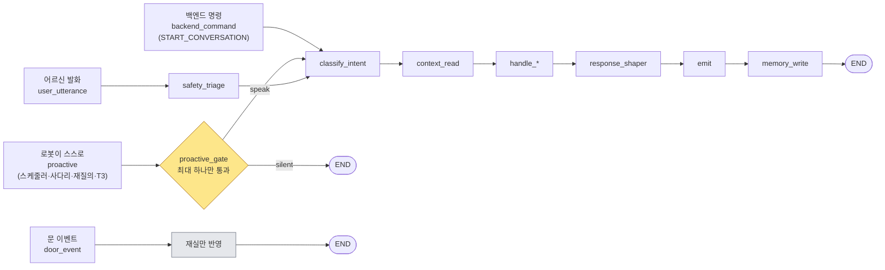
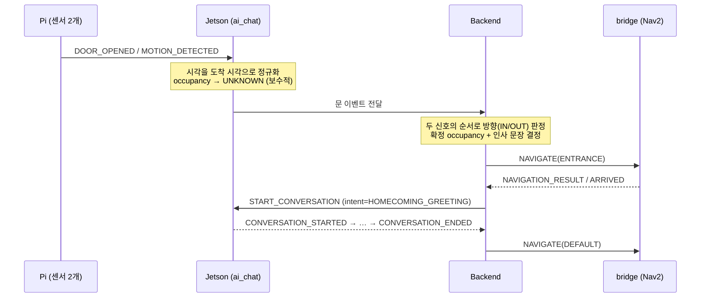

# 개념과 설계 판단 모음

> **이 문서의 목적**: 코드를 열지 않고도 "왜 이렇게 만들었는지"를 이해한다.
> 코드 곳곳의 주석에 흩어져 있는 판단을 한곳에 모았다.
> 원문은 각 파일의 docstring 에 있고, 여기서는 **결론과 근거**만 추린다.

> 코드 대조: 2026-08-15 (branch `main`)

---

## 1. 용어

읽기 전에 이것만 알면 됩니다.

| 용어 | 뜻 |
|---|---|
| **senior / guardian** | 어르신 / 보호자. 코드 전체에서 이 단어만 씁니다 |
| **VAD** | "지금 누가 말하나"를 값싸게 판정. 로컬에서 돎 |
| **임베딩** | 문장의 '의미'를 숫자 목록으로. 비슷한 의미 → 비슷한 숫자 |
| **RAG** | 답하기 전에 관련 글을 먼저 찾아 프롬프트에 붙이는 것. 그게 전부입니다 |
| **LangGraph 노드** | 그냥 함수. state dict 를 받아 갱신할 부분을 돌려줍니다 |
| **checkpointer** | 턴 사이에 state 를 저장하는 장치. 어르신 id 별로 |
| **SpeechProposal** | 로봇이 "이 말 해도 될까요"라고 낸 **신청서**. 발화 자체가 아님 |
| **게이트** | 그 신청서를 심판해 최대 하나만 통과시키는 곳 |
| **침묵 사다리** | 응답이 없을 때 단계적으로 확인하는 절차 |
| **barge-in** | 로봇이 말하는 중에 어르신이 끼어드는 것 |
| **T1~T4** | 보호자에게 어떻게(또는 안) 전달할지의 등급 |
| **outbox** | 보호자 알림 발신 큐. 보내기 전에 먼저 저장 |
| **occupancy** | HOME / AWAY / UNKNOWN. 집에 있는지 |

**절대 헷갈리면 안 되는 것 하나**: `candidate` 는 DB 의 `fact_candidate`(미확정 사실)를 뜻합니다. 로봇이 하려는 말은 `proposal` 이라고 부릅니다. 두 단어를 섞으면 팀이 일주일을 잃습니다.

---

## 2. 이 제품이 무엇인가

**정보 제공 봇이 아닙니다.** 축이 세 개입니다.

| 축 | 왜 |
|---|---|
| **안전** | 활동의 '부재'를 감지하고 사람을 부르는 것. 진짜 핵심 기능 |
| **정서** | 외로움이 1번 문제. 로봇은 **말벗이 본체** |
| **인지** | 지남력 질문, 반복 견디기, 초기 쇠퇴 신호 |

복약·날씨·병원은 이 셋 **위에** 얹힌 것입니다. 검색 기능이 이 축들을 밀어내지 않아야 합니다.

**비목표**: 낙상 감지, 진단, 상담(자해 신호는 사람에게 넘김).

---

## 3. 핵심 설계 판단

코드에 반복해서 나타나는 판단들입니다. (개수는 일부러 제목에 적지 않습니다 — 항목이 늘 때마다 제목이 틀리기 때문입니다.)

### 3.1 말하지 않기로 정하는 것도 기능이다

타이머가 울릴 때마다 말하는 로봇은 잔소리꾼이 됩니다. 새벽 3시에 떠들고, TV 를 끊고, 5분 전 알림을 또 합니다.

그래서 **로봇이 스스로 시작하는 발화는 아무도 직접 말하지 않습니다.** 스케줄러·사다리·재질의·T3 동의가 전부 '제안'만 하고, 게이트가 심판합니다. 게이트가 침묵을 고르면 그래프는 `END` 로 직행하며 **`emit` 에 도달하지 않습니다** — 빈 응답을 나중에 걸러내는 게 아니라, 애초에 만들지 않습니다.

게이트를 **거치지 않는** 경로가 둘 있습니다. 어르신이 말을 건 반응형 턴, 그리고 백엔드가 내려보낸 명령입니다(§6.2). 현관도 2026-08-01 이후 이쪽입니다 — 로봇의 문 이벤트 노드는 재실만 반영하고 끝나고, 인사는 백엔드가 정해 명령으로 내려옵니다.

진입 네 경로를 한 장으로 보면 "누가 게이트를 거치는가"가 분명해집니다.



> 게이트를 통과하는 것은 **`proactive` 하나뿐**입니다. 반응형은 어르신이 이미 말을 걸었으니 심판할 것이 없고, 백엔드 명령은 심판을 이미 한 쪽에서 왔습니다(**→ §6.2**). 문 이벤트는 아무 발화도 만들지 않습니다.

**한계 하나**: 만료된 제안의 정리는 게이트가 개별 행을 심판하다 버릴 때만 일어납니다. 큐 전체를 훑는 `discard_expired()` 는 프로덕션에서 아무도 부르지 않습니다.

### 3.2 판단이 생성보다 위에 있다

*말할지 여부* 와 *어떻게* 를 먼저 정하고, *무엇을* 은 나중입니다. T1(응급)이면 인텐트 라우터와 검색을 통째로 건너뜁니다.

핸들러는 `response` 텍스트만 만듭니다. **말할지 여부를 정하지 않고, I/O 를 직접 하지 않습니다.** 핸들러가 자기 출력을 억제할 수 있게 되는 순간 "로봇이 왜 조용했나"에 대한 답이 하나가 아니게 됩니다.

### 3.3 모르는 것과 0은 다르다

일간 지표의 모든 컬럼이 NULL 을 허용합니다. 측정 못 한 수면을 0으로 저장하면 T2 추세가 보호자에게 **"한숨도 못 잤다"** 고 보고합니다.

그런 오탐이 쌓이면 보호자가 알림을 안 읽게 되고, **그때부터 진짜 응급을 놓칩니다.** 시끄러운 감지기는 짜증이 아니라 안전 실패입니다.

같은 원리가 곳곳에 있습니다:
- `occupancy` 기본값이 `HOME` 이 아니라 `UNKNOWN` — 빈 집에 사다리를 돌리지 않기 위해
- 하트비트가 `NULL` = "한 번도 못 받음" ≠ 오래전
- `ctx_is_cached` = "최신 정보가 아님"을 프롬프트까지 전달

### 3.4 보내기 전에 먼저 저장한다

네트워크는 언젠가 끊기고, 끊긴 연결로 '발사'한 T1 알림은 그냥 사라집니다. **하필 그 순간이 알림이 가장 중요한 순간일 수 있습니다.**

그래서 순서를 뒤집었습니다 — 쓰고, 시도하고, 실패하면 재시도. `enqueue()` 가 반환됐다면 전원이 끊겨도 그 알림은 남습니다.

**T1 은 시도 횟수로 포기하지 않습니다.** T2·T3 는 20번 만에 포기하지만(`OUTBOX_MAX_ATTEMPTS`), T1 은 그 표에 아예 없습니다 — 생명 안전 알림은 큐에 남아 있는 것 자체가 알려야 할 상태입니다.

### 3.5 DB 파일이 두 개인 이유

저장 매체가 microSD 라 쓰기를 줄여야 합니다. 그래서 내구성을 의도적으로 완화했습니다 — 크래시 시 마지막 몇 초의 운영 상태를 잃어도 괜찮습니다.

**그런데 큐에 든 응급 알림은 안 됩니다.** SQLite 의 `synchronous` 는 DB 단위 설정이라 한 파일 안에서 테이블별로 나눌 수 없습니다. 그래서 파일을 나눴습니다.

| 파일 | 내구성 | 내용 |
|---|---|---|
| `runtime.sqlite` | NORMAL | 운영 상태, 제안 큐, checkpointer |
| `outbox.sqlite` | **FULL** | 보호자 알림 |

**아직 정리되지 않는 표가 셋 있습니다** — `door_alert`, `completed_slot`, `consent_request`. 이 셋은 운영자용 초기화 함수 말고는 삭제 경로가 없고, 특히 `completed_slot` 은 날짜 키를 매일 새로 쌓습니다. (기록할 때마다 보관 기간과 개수 상한으로 스스로 잘라내는 표는 발화 표현 이력 `spoken_phrasing` 입니다.) 쓰기를 아끼려고 파일까지 나눈 문서라면 이 누적도 같이 알고 있는 편이 낫습니다.

### 3.6 회피 목록은 '정보'가 아니라 '금지문'이다

돌아가신 배우자를 살아있는 것처럼 언급하는 것은 이 시스템이 낼 수 있는 **최악의 실패** 중 하나입니다.

프롬프트에 "배우자가 작년에 돌아가셨습니다"라고 사실로 주면 모델은 그것을 화제로 활용합니다. 그래서 명령으로 넣습니다:

> ## 말하지 않을 주제
> 다음 주제는 **먼저 꺼내지 않습니다**: 남편 사망

섹션 제목까지 '말하지 않을'로 둔 것도 의도입니다. 모델이 제목만 훑어도 금지임을 알아야 합니다.

### 3.7 열 번째 "오늘 며칠이야"도 처음처럼 답한다

지남력 질문은 가장 빈번한 질문 유형이고 초기 치매에서 더 잦아집니다.

**반복 횟수를 절대 프롬프트에 넣지 않습니다.** 넣으면 어조에 새어나가 열 번째 답변이 짜증스럽게 들립니다. 대신 그 정보는 T2 추세로 보호자에게 갑니다.

저장소를 나눠서 두 가지를 동시에 달성합니다 — 같은 사실이 프롬프트에는 안 가고 T2 추세에는 갑니다. 값을 지우는 대신 **읽는 쪽을 나누는** 이 수법은 §6.1(로봇 안의 두 저장소)에서 다시 나옵니다.

### 3.8 프로필·복약은 절대 의미 검색하지 않는다

"혈압약"과 "혈당약"은 임베딩상 **거의 동일합니다.** 검색으로 가져오면 엉뚱한 약을 말하게 되고, 복약에서 그건 위험한 답입니다.

| 방식 | 대상 |
|---|---|
| **정확 조회** | 이름, 복약, 일정, 회피 목록, 오늘 상태 |
| **의미 검색** | 장기 기억, 대화 요약, 복지제도 문서 |

### 3.9 턴당 LLM 생성 호출은 1회

왕복 하나가 500~1500ms 인데 턴 전체 예산이 약 2초입니다. 트리아지·인텐트 분류·맞장구 판별은 전부 **로컬 규칙**입니다.

핸들러들이 `_generate` 하나를 공유하는 것도 이 때문입니다. 핸들러마다 호출 코드를 복사하면 언젠가 두 번 부르는 핸들러가 생깁니다.

### 3.9.1 동의와 확인은 LLM 에게 맡기지 않는다

지연 때문이 아니라 **설명 책임** 때문입니다.

모델에게 "어르신이 동의했나요?"를 물으면 답은 "동의한 것으로 보인다"이고, 그 판정 근거는 재현되지 않습니다. 나중에 "어르신이 정말 동의했는가"를 물었을 때 답할 수 있어야 합니다. 규칙은 답해줍니다.

| 판정 | 누가 | 왜 |
|---|---|---|
| 계약 질문의 문장 | **계약** (`robotPrompt` 그대로) | 다듬으면 앱 화면의 문장과 달라진다. 동의 문구라면 계약 위반 |
| 예/아니오, 복창 확인 | **규칙** | 위 문단 |
| 필드명 → 사람의 질문 | LLM | `"dose"` 를 소리내어 읽으면 돌봄 로봇이 아니라 서식이다 |
| 발화 → 값 추출 | LLM | 턴당 1회 예산 안에서 |

**얼버무림은 긍정도 부정도 아닙니다.** "글쎄"를 긍정으로 읽으면 동의한 적 없는 동의가 기록되고, 부정으로 읽으면 거절한 적 없는 거절이 기록되어 딸린 질문이 영영 안 나옵니다. 그래서 판정은 세 갈래이고, 판정 불가의 올바른 처리는 다시 묻기입니다.

실제로 잡힌 오탐 둘이 이 규칙이 왜 까다로운지 보여줍니다. `"네"`를 부분 문자열로 찾으면 **"약이 참 많네"** 가 동의가 되고, `"그래"` 는 **"그래서 어제 병원에 갔는데…"** 에 걸립니다.

### 3.10 재생 진행 상황의 권위는 재생 스레드에 있다

`speaking` / `spoken_prefix` 는 주인이 둘입니다 — 재생 스레드와 checkpoint 된 state. 설계 헌법([`임시보류_claude.md`](../../임시보류_claude.md) §13)과 코드 자신(`graph/output.py`)이 함께 **"시스템에서 동기화 버그가 가장 나기 쉬운 지점"** 이라고 못박은 곳입니다.

경계를 이렇게 고정했습니다:

- **재생 핸들 = 권위**
- **`ConvState` = 스냅샷**

barge-in 이 나면 state 가 아니라 **핸들에게** 묻습니다. state 는 그래프 실행 시점 값이라 이미 낡았을 수 있고, 낡은 값을 믿으면 이미 말한 문장을 다시 말합니다.

### 3.11 에코는 막는 게 아니라 임계치를 올리는 것

스피커와 마이크가 한 몸통이라 TTS 출력이 마이크로 되돌아옵니다. 이걸 안 잡고 능동 발화를 테스트하면 **모든 버그 리포트가 실제로는 에코**입니다.

두 겹으로 막되, **완전히 막지 않습니다**:

1. 재생 직후 ~300ms 는 입력을 버린다
2. 재생 중에는 VAD 임계치를 올린다

2번이 핵심입니다. "재생 중에는 듣지 않는다"가 아니라 **"재생 중에는 더 크게 말해야 들린다"** 입니다. 완전히 막으면 barge-in 이 원리적으로 불가능해지고, 청력이 떨어진 어르신은 로봇이 말하는 중인 줄 모르고 말을 시작합니다.

### 3.12 끼어들기는 생존 증거다

생존 확인 프로브 중에 어르신이 끼어들면 **끼어든 것 자체가 답입니다.** 나머지를 일부러 버리고 침묵 사다리만 리셋합니다.

재개하면 방금 대답한 사람에게 "괜찮으세요?"를 다시 묻는 로봇이 됩니다.

---

## 4. 보호자 알림 등급 (T1~T4)

어르신과 보호자는 **이해가 충돌합니다.** 모든 것을 자식에게 보고하는 로봇은 더 이상 속을 털어놓지 않게 되는 로봇이고, 그러면 정서 축이 죽습니다. 이 등급은 알림 설정이 아니라 **제품의 윤리**입니다.

| 등급 | 내용 | 동의 | 전달 |
|---|---|---|---|
| **T1** | 명백한 위험, 도움 요청, 장기 무응답, 자해 | 불필요 | 즉시 |
| **T2** | 복약·식사·수면·활동량·기분 추세 | 통보 | 하루 한 번 |
| **T3** | 우울 신호 누적, 외로움, 사별, 가족 갈등 | **필요** | 나중에 물어보고 |
| **T4** | 일상적 푸념, 회상, "우리끼리 얘기" | — | **절대 안 보냄** |

**이 표는 트리아지가 나누는 것이 아닙니다.** 안전 트리아지 노드는 `T1` / `confirm`(확인 질문) / `none` 셋만 분류합니다. T2 는 일간 배치, T3 는 정서 신호가 누적된 뒤 `consent_tick` 이, T4 는 애초에 로봇을 떠나지 않습니다. 네 등급을 한 노드에서 나누려 하면 '긴급도'와 '사생활'이라는 독립된 두 축이 뒤섞입니다.

**"T1 = 즉시"에도 예외가 있습니다.** 확인 없이 곧바로 T1 인 것은 **자해 신호와 명시적 도움 요청** 둘뿐입니다. 응급으로 들리는 증상 표현("가슴이 아파")은 확인 질문을 한 번 던지고 90초를 기다린 뒤에 판정합니다 — 대답이 없으면 그 침묵이 안심할 이유가 아니라 더 나쁜 신호이므로 올립니다.

**같은 사유의 T1 은 600초 동안 보호자 알림만 억제합니다.** 233 실기에서 로봇의 응급 응답이 마이크로 되돌아와(에코) 그 안의 응급 표현이 다시 감지되는 자기증식 루프가 생겨, **3분 만에 동일한 T1 이 15회** 배달된 적이 있습니다. 억제되는 것은 보호자에게 나가는 알림뿐이고 **어르신에게 돌아가는 응답은 그대로 나갑니다.** 사유가 다르면(emergency 뒤의 자해 신호) 무조건 보냅니다 — 그것은 중복이 아니라 악화입니다.

**T4 는 진짜여야 합니다.** 어르신이 그것을 믿지 않으면 T3 가 애초에 일어나지 않습니다. 그래서 코드에서 T4 를 큐에 넣으려 하면 예외를 던집니다 — "보냈다고 믿는" 코드가 남으면 안 됩니다.

T4 는 알림 등급이 아니라 **기억의 공개범위**로 표현됩니다. `memory.visibility` 는 세 값(`PRIVATE` / `SHARED_WITH_PRIMARY` / `SHARED_WITH_GUARDIANS`)이고 **기본값이 `PRIVATE`** 입니다 — 아무것도 정하지 않으면 아무에게도 안 보이는 쪽이 기본입니다.

**자해는 동의를 무시하고 T1** 입니다. 단 로봇이 상담하지 않습니다 — 따뜻하게 반응하고 사람에게 넘깁니다.

---

## 5. 안전 신호는 셋뿐이다

음성 · 현관 센서 · 재실 상태(vision). 침묵의 의미가 조합으로 갈립니다.

> ⚠️ **셋째 신호는 아직 배선되지 않았습니다.** `rest_state` 는 스키마에 있고
> (`runtime_state.rest_state`) 침묵 사다리가 읽지만, 값을 넣는 프로덕션 코드가
> 없습니다 — vision 이 이 필드로 들어오는 경로가 `ai_chat` 안에 아직 없어서 실기에서는
> 항상 `UNKNOWN` 입니다. 그래서 아래 표에서 지금 실제로 갈리는 것은 `occupancy` 뿐이고,
> `rest_state` 가 붙은 두 행은 코드는 있으나 도달하지 않습니다.

| occupancy | rest_state | 의미 | 사다리 | 지금 |
|---|---|---|---|---|
| HOME | AWAKE | **의심** | 가동·가속 | 도달 불가 (rest_state 미배선) |
| HOME | RESTING | 정상(낮잠) | **정지가 아니라 늦춤** — 각 칸 임계치 ×3 | 도달 불가 |
| AWAY | any | 정상 | 정지 | 동작함 |
| UNKNOWN | any | 애매 | **보수적 가동** | 동작함 (사실상 상시) |

RESTING 행이 '대기'가 아니라 '늦춤'인 것은 코드가 명시적으로 못박은 판단입니다 — 쉬는 중의 침묵은 정상이지만 **쉬다가 쓰러질 수도 있어서**, 사다리를 멈추는 대신 인내심 배수(×3)를 곱합니다.

**침묵을 재지 말고 테스트합니다.** "마지막 발화로부터 N시간"을 위험으로 보면 자는 것·외출·TV 시청·그냥 말하기 싫은 것이 전부 똑같이 보입니다. 대신 프로브를 던집니다 — "점심 드셨어요?"는 말벗이자 생존 확인이고, 감시처럼 들리지 않습니다.

**시각의 권위는 Jetson 입니다.** 라즈베리파이는 배터리 백업 RTC 가 없어 잘못된 시계로 부팅할 수 있고, 틀린 문 타임스탬프는 루틴 베이스라인과 TTL 계산을 동시에 오염시킵니다.

### 5.1 로봇은 방향을 모른다 — 그래서 UNKNOWN 이 정직한 답이다

현관에는 센서가 두 개입니다(SONOFF SNZB-04P 접점, SNZB-03P 모션). **둘 다 단독으로는 방향을 모릅니다.** 방향은 두 신호의 '순서'에서만 나옵니다 — 문 열림 뒤 실내 모션이면 귀가, 실내 모션 뒤 문 열림이면 외출.

그 상관 판정은 **백엔드가 합니다**(§6). 그러면 로봇은 문 이벤트를 받고 무엇을 해야 하는가?

```
문이 열렸다. HOME 으로 둘까?  -> 어르신이 나갔는데 빈 집에 사다리가 돈다
                AWAY 로 둘까?  -> 집에 있는 사람의 안전 감시가 꺼진다
                UNKNOWN        -> 정직하다. §5 표가 '보수적 가동'으로 읽는다
```

**HOME 이었어도 문이 열리면 UNKNOWN 으로 내립니다.** 옛 HOME 을 유지하는 것은 "모른다"를 "집에 있다"로 바꿔 말하는 것입니다.

방향이 필요 없는 판정 세 가지는 로봇에 남습니다.

| 판정 | 방향이 필요 없는 이유 |
|---|---|
| **발화 → HOME** | 집 안에서 목소리가 들리면 센서가 뭐라 했든 집에 있다 |
| **하트비트 끊김 → UNKNOWN** | 죽은 파이가 낡은 AWAY 를 남겨서는 안 된다 |
| **문 방치 → T2** | 접점 센서가 열림/닫힘을 직접 보고한다. 누가 지나갔는지 몰라도 "열린 채로 20분"은 사실이다 |

**"발화가 센서를 이긴다"를 코드에서는 시각 비교로 표현합니다.** 어르신이 t+60 에 말했는데 백엔드가 t+0 의 외출을 t+105 에 판정해 보내면, 도착 순서대로 적용하면 말하고 있는 사람이 AWAY 가 됩니다. 그래서 `observed_at` 이 저장된 값보다 앞서는 관측은 버립니다(`door/occupancy.py`).

### 5.2 알려진 한계 — 이 절이 약속하는 것과 실제가 다른 지점

| 한계 | 무엇이 어긋나는가 |
|---|---|
| **루틴 베이스라인이 없다** | "이 사람이 조용할 리 없는 때에 조용함"이 원하는 트리거인데, 오탐 필터의 넷째 칸(평소 리듬과 대조)은 주석만 있고 코드가 없습니다. 이벤트 로그가 며칠 쌓여야 의미가 생기는데 그 축적이 아직 없습니다. 그만큼 오탐이 많습니다 |
| **quiet hours 를 모르면 막지 않는다** | 창 정보가 없거나 시작=끝이면 "조용한 시간이 아니다"로 판정합니다. 이 문서의 반복 주제(모르면 보수적으로)와 **반대 방향**인 유일한 자리입니다 — 복약 알림이 조용히 사라지는 것이 새벽에 한 번 울리는 것보다 나쁘다고 판단했고, 대신 경고 로그를 남깁니다 |
| **백엔드 문맥을 한 번도 못 받으면 밤에도 프로브를 던진다** | quiet hours 판정은 캐시된 문맥의 프로필에서 옵니다. 캐시가 비어 있으면 위 항목이 그대로 적용되어 시간대를 모르는 채 사다리가 돕니다 |

---

## 6. 소유권 경계

| 계층 | 소유 | 내용 |
|---|---|---|
| **사실** | 백엔드 Postgres | 프로필, 기억, 돌봄 기록, 동의 |
| **운영 상태** | 로봇 로컬 SQLite | 제안 큐, 사다리, occupancy, checkpointer, 발신 큐 |

**복약 스케줄의 진실이 두 곳에 있으면 품질 문제가 아니라 안전 버그입니다.**

checkpointer 를 서버 DB 에 두지 않는 이유: 매 턴 쓰기가 일어나 턴마다 네트워크 왕복이 붙고, 오프라인에서 아예 죽습니다.

**역할 분담**: 백엔드 = 사실과 검색의 권위 / 로봇 = 타이밍과 전달의 권위.

### 6.1 로봇 안에도 저장소가 두 개다 — 가장 걸려 넘어지기 쉬운 곳

같은 값이 두 곳에 있고 **수명이 다릅니다.**

| 저장소 | 누가 읽는가 | 언제 사라지는가 |
|---|---|---|
| LangGraph **checkpoint** | 대화 턴(노드들) | thread 별. 그래프를 안 돌리면 갱신되지 않는다 |
| **`runtime_state`** (SQLite) | **틱들** — 침묵 사다리, 현관 감시 | 재부팅을 넘어 살아남는다 |

**안전 감시가 읽는 쪽은 항상 `runtime_state` 입니다.** 틱은 그래프를 거치지 않습니다.

208 에서 이 때문에 실제 결함이 하나 드러났습니다. `note_interaction` 이 checkpoint 에만 써서, 어르신이 하루 종일 대화해도 `runtime_state.last_user_interaction_at` 은 0 에 머물렀습니다. 그래서 **침묵 사다리가 실기에서 한 번도 돌지 않을 상태였습니다** — 테스트는 그 값을 직접 넣어주기 때문에 전부 통과했습니다. → [진행 상황.md](<진행 상황.md>) §2.7

**새 노드를 만들 때 물어야 할 것**: 이 값을 틱이 읽는가? 읽으면 `runtime_state` 에도 써야 합니다.

### 6.2 인사 판정은 백엔드다 (2026-08-01 결정)

초안에서는 `door_event` 가 인사를 제안하고 로봇의 4게이트가 심판했습니다. 지금은 다릅니다.

```
Pi (센서 2개)  →  Jetson  →  Backend
                  │           ├ 방향(IN/OUT) 판정
                  │           ├ 확정 occupancy
                  │           └ 인사 문장 결정 → 현관으로 이동시킨 뒤 대화 명령
                  └ 시각 정규화, 보수적 UNKNOWN, 전달
```

명령의 이름은 `SPEAK` 가 아니라 **`START_CONVERSATION`** 입니다(토픽 `bomi/v1/ai/{robotId}/commands`). 백엔드는 SPEAK 를 한 번도 발행하지 않습니다 — `RobotCommandType.SPEAK` 는 쓰이지 않는 열거값입니다. 그리고 인사는 도착한 다음에 나갑니다: 백엔드가 문장을 정해 보관하고, `NAVIGATE(ENTRANCE)` 를 보내고, `ARRIVED` 를 받은 뒤에야 `START_CONVERSATION` 을 발행합니다.

위 도식은 "누가 무엇을 아는가"를 보여주지만 순서는 보여주지 못합니다. 현관 시나리오에서 가장 자주 나오는 질문이 "인사가 언제 나가는가"이고, 답은 **"도착한 뒤"** 입니다.



이유는 데이터의 위치입니다. "미복용 약이 있는가", "오늘 일정이 있는가", "동의를 받았는가"는 전부 백엔드만 아는 사실입니다. 로봇이 다시 조회해 다시 고르면 같은 우선순위 규칙이 두 곳에 생기고, "왜 로봇이 우산을 말하지 않았는가"에 답할 곳이 두 곳이 됩니다.

**백엔드 명령은 게이트를 건너뜁니다.** 게이트는 "지금 말해도 되는가"를 판정하고, 이 명령은 그 판정을 이미 한 쪽에서 왔습니다. 다시 판정하면 심판이 둘이 되고, 백엔드가 보낸 인사가 로봇의 쿨다운에 조용히 삼켜지는데 백엔드는 자기가 보낸 인사가 나갔다고 기록합니다.

로봇의 4게이트는 여전히 **'로봇이 스스로 시작하는' 발화 전부**를 심판합니다 — 일정 알림, 침묵 프로브, 재질의. 그 원칙(§3.1)은 그대로입니다.

---

## 7. "자연스러운 대화"의 조작적 정의

분위기가 아니라 검증 항목입니다. 각 줄이 테스트입니다(212 에서 회귀 세트로).

1. **짧은 턴** — 하나만 말하고 되묻는다. 정확한 긴 답변은 실패
2. **이어짐** — 어제 무릎 얘기를 오늘 참조
3. 아는 걸 다시 묻지 않음
4. **반복에도 같은 온기**
5. **회피 목록 준수**
6. 말 안 할 때를 안다
7. 나쁜 ASR 을 견딤 — 자신 있게 틀리는 대신 되묻는다
8. 표현 다양성 — 같은 알림이 3일 연속 똑같지 않음 (반응형 턴은 2026-08-10 에야 붙었습니다. 그 전에는 웨이크워드 대화에서 반복 방지가 통째로 꺼져 있었고 같은 문장이 3연속 나갔습니다)
9. **내부 기제 언급 금지** — "기록에 따르면", "AI로서" 없음
10. 회상이 작동

2번과 10번은 의미 검색에 달려 있습니다. 218 에서 만들었지만 임베딩 API 가 과금되어
**코드 기본값은 지금도 꺼짐**이고(`EMBEDDING_ENABLED`, `EMBEDDING_SYNC_ENABLED`),
2026-08-10 에 시연 서버에서 명시적으로 켰습니다. 켠 뒤 실제 조회로
`semanticUsed=true`, 적중 18건, 201ms 를 확인했고 회상 씨앗도 함께 넣었습니다. 즉
**"없어서"도 "꺼져 있어서"도 아니고, "환경마다 다름"입니다** — 새 환경에서는 두 스위치를
켜지 않으면 2번과 10번이 그대로 죽습니다. → [진행 상황.md](<진행 상황.md>) §2.4

---

## 8. 하드웨어가 강제하는 것

| 사실 | 결과 |
|---|---|
| STT·TTS·LLM·임베딩이 **전부 외부 API** | GPU 는 거의 유휴, **네트워크가 병목** |
| 턴 예산 약 2초 | 분류는 로컬, 첫 문장부터 TTS 투입 |
| 저장 매체가 microSD | 쓰기 줄이기, 일일 백업, 발신 큐만 동기 쓰기 |
| 배터리 구동 | 틱 주기가 곧 전력 (침묵 틱 60초) |
| aarch64 | x86 휠이 없으면 소스 빌드 실패 가능 |

**오프라인은 불편이 아니라 안전 문제입니다.** 네트워크가 없으면 로봇은 말도 못 하고 보호자를 부르지도 못하는데, 하필 그때가 가장 중요한 순간일 수 있습니다. 그래서 필수 2건 — 캐시된 프로브 음성, 알림 재시도 큐.

이 둘의 완성도가 다릅니다. **알림 재시도 큐는 동작합니다**(`localstore/outbox.py`, T1 은 시도 횟수로 포기하지 않음). **캐시된 프로브 음성은 아직 절반입니다** — 표와 조회(`audio_cache.lookup`)는 있지만 캐시를 채우는 `register()` 를 부르는 프로덕션 코드가 없어, critical 프로브는 매번 "미리 만들어둔 오디오가 없다"는 경고를 남기고 네트워크 합성으로 떨어집니다. 정확히 네트워크가 없을 때 필요한 기능이 네트워크에 의존해 있는 상태입니다.

**성능 저하 순서**를 미리 정해뒀습니다: 기억 top-k 축소(6→2) → 문서 RAG 중단 → 잡담 중단 → 프로브 단순화. **안전 경로는 마지막까지 살립니다.**

넷째 칸은 목록에는 있지만 **실제로 조작하는 것이 없습니다.** 프로브는 처음부터 고정 문구라 더 단순해질 여지가 없고, `probes_simplified()` 는 저하 단계와 무관하게 항상 참을 돌려줍니다. 거짓을 돌려줄 수 있게 만들면 "평소엔 프로브도 생성한다"로 오독되어 오프라인 생존 확인이 죽습니다. 즉 실제 저하는 1~3단계이고, 넷째는 "여기서 더 깎을 것은 없다"는 선언입니다.

판단 신호는 **턴 지연 하나뿐**입니다(메모리·CPU 는 재지 않습니다). 예산 2초를 넘긴 턴이 연속 3회면 한 칸 내려가고, 예산 안에 든 턴이 연속 10회면 한 칸 올라옵니다 — 저하는 빠르게, 복구는 천천히. 상태는 메모리에만 있어 재부팅하면 0단계입니다.
