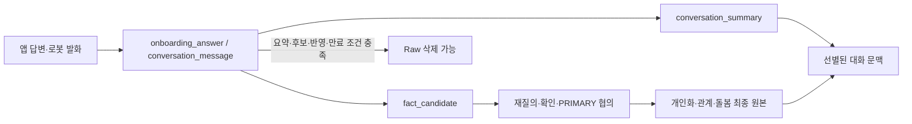

# BOMI 데이터베이스 문서

현재 기준은 PostgreSQL + 외부 벡터 스토어 Qdrant, 물리 테이블 17개, 컬럼 253개다. Raw 발화, 대화·일간 요약, 장기 기억을 분리하고 앱과 로봇의 온보딩을 같은 질문 계약으로 처리한다. 재실 변경은 `occupancy_event`, 하루 활동 집계는 `daily_activity_metric`, 어르신 주변 인물은 `known_person`에 보존한다. 확인 전 사실은 `fact_candidate`에서 재질의·민감정보 확인·PRIMARY 보호자 협의를 거친다. Voice MQTT와 Guardian REST의 산책 요청은 같은 `scenario` 상태 머신과 `walk_request_receipt` 멱등 장부를 사용한다.

```text
app_user
care_relationship
robot
onboarding_session
onboarding_answer
scenario
conversation
conversation_message
conversation_summary
fact_candidate
memory
care_record
occupancy_event
daily_activity_metric
known_person
wake_word_trigger_receipt
walk_request_receipt
```

개인화·관계·돌봄 영역의 최종 조회 원본은 `app_user`, `care_relationship`, `memory`, `care_record`다. 재실·일간 활동·회피 인물은 각각 `occupancy_event`, `daily_activity_metric`, `known_person`을 원본으로 조회한다. 최근 대화와 하루치 대화는 별도 테이블이 아니라 `conversation_message`의 조회 범위다.

## 문서

| 문서 | 목적 |
| --- | --- |
| [`mvp-erd.md`](./mvp-erd.md) | 17개 테이블·253개 컬럼의 관계·제약·정책 |
| [`onboarding-question-set-v1.json`](./onboarding-question-set-v1.json) | 앱·로봇 공용 질문·검증·정규화·최종 매핑 |
| [`onboarding-rest-environment-design.md`](./onboarding-rest-environment-design.md) | 온보딩·후보·대화·휴식·환경 처리 흐름 |
| [`column-definition/BOMI_컬럼정의서.xlsx`](./column-definition/BOMI_컬럼정의서.xlsx) | 사람이 읽는 테이블·컬럼·코드·제약 정의 |
| [`column-definition/snapshots/`](./column-definition/snapshots/) | Excel과 동일한 Git diff용 CSV 9개 |

관련 문서는 [`../architecture/system-overview.md`](../architecture/system-overview.md), [`../scenario/homecoming-welcome.md`](../scenario/homecoming-welcome.md), [`../mqtt/topic-convention.md`](../mqtt/topic-convention.md)다.

## 생명주기



V1~V16의 UUID 관계 컬럼은 물리 FK가 아닌 논리 참조다. Raw 삭제 시 근거 ID를 비우고 최종 업무 데이터를 보존하는 규칙은 서비스·보존 배치가 적용하며, DB의 `ON DELETE SET NULL`에 의존하지 않는다.

## 권한

- `user_type=GUARDIAN`만으로 특정 시니어에게 접근할 수 없다.
- 조회는 활성 관계, 목적별 동의, 데이터 공개 범위를 함께 적용한다.
- 민감정보 대리 확인·변경은 `ACTIVE + PRIMARY + care_management_permission_status=GRANTED` 한 명만 가능하다.
- SECONDARY는 허용 범위에서 조회만 가능하다.
- 충돌 시 양쪽에 알리고 협의를 유도한다. 통화 사실은 증명하지 않고 디지털 입장·연락 시도·최종 결정만 기록한다.
- 시니어 반대·연락 불가를 보존한 채 PRIMARY가 2차 책임 확인을 완료하면 보호자 결정값을 적용할 수 있다.

## 컬럼정의서 운영

Excel은 설명 원본이고 CSV는 리뷰 표면이다. Excel에서 DDL·Flyway SQL을 생성하지 않는다. Jira·승인자·검토자·형식용 검증 시트는 두지 않는다.

```powershell
python docs/database/column-definition/scripts/export-column-definition-csv.py
python docs/database/column-definition/scripts/validate-column-definition.py
```

## TBD

- 요약·기억 embedding 모델·차원과 벡터 인덱스
- 반복 협의가 필요할 때의 `care_coordination_event`
- 긴 대화 중간 압축이 필요할 때의 `TIME_WINDOW`
- 운영 중 무배포 질문 편집이 필요할 때의 `onboarding_question`
- 호출·산책 외 메시지를 포함하는 범용 수신 이벤트 원장, Outbox, 감사 로그

문서의 제약은 구현 계약이며 코드·DDL이 이미 존재한다는 뜻이 아니다.
