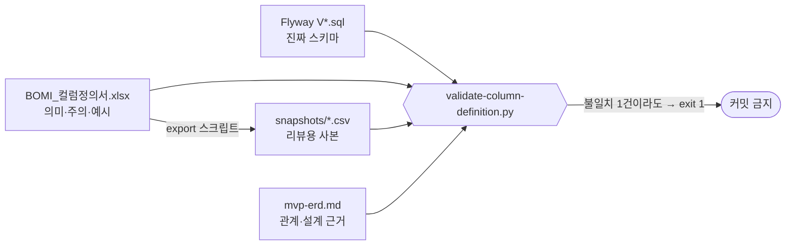

# 컬럼정의서

`BOMI_컬럼정의서.xlsx` 가 원본이고, `snapshots/*.csv` 는 리뷰·diff 를 위해 뽑은 사본입니다.
CSV 를 직접 고치지 마십시오 — 다음 내보내기에서 덮어씁니다.

## 무엇이 정본인가

| 대상 | 정본 |
| --- | --- |
| 물리 스키마 | `backend/src/main/resources/db/migration/V*.sql` |
| 테이블·컬럼의 의미 | `BOMI_컬럼정의서.xlsx` |
| 관계·설계 근거 | [`../mvp-erd.md`](../mvp-erd.md) |

셋이 어긋나면 언제나 Flyway 가 옳습니다.

화살표가 `Flyway → 검증기` 한 방향인 것이 핵심입니다 — 문서가 스키마를 바꾸지 못하고,
스키마만 문서를 틀리게 만들 수 있습니다.

## 지금 상태 — 세 산출물이 서로 다른 시점에 멈춰 있습니다

2026-08-16 기준입니다.

| 무엇 | 멈춘 지점 | 테이블 | 컬럼 |
| --- | --- | ---: | ---: |
| Flyway (진짜 스키마) | V20 | 19 | 276 |
| [`../mvp-erd.md`](../mvp-erd.md) | V20 | 19 | 276 |
| xlsx 원본과 `snapshots/*.csv` | V17 | 17 | 254 |

빠진 것은 `robot_mode_recovery_audit`(V18·10컬럼)와
`operator_scenario_cancellation_audit`(V19·12컬럼) 두 표이고, 그에 딸린 CHECK·UNIQUE
약 11건과 인덱스 2건(`ix_robot_mode_recovery_audit_robot_time`,
`ix_operator_scenario_cancel_robot_time`)도 함께 빠져 있습니다. 그래서
`scripts/validate-column-definition.py` 는 **현재 실패합니다.** 장치가 고장 난 것이
아니라 정확히 제 일을 한 결과입니다 — 아무도 실행하지 않았을 뿐입니다.

`snapshots/vector-fields.csv` 는 `conversation_summary.embedding`·`memory.embedding` 의
차원을 `TBD` 로 적고 있는데, 그 결정은 이미 끝났습니다. pgvector 를 버렸고 두 컬럼은
만들지 않았습니다. 벡터는 Qdrant 컬렉션(4096차원)에 있고 이 DB 에는 V5 의 부기 컬럼
세 개(`embedding_status`·`embedding_synced_at`·`embedding_model`)만 있습니다. 근거는
[`../mvp-erd.md` §12](../mvp-erd.md) 를 보십시오. 두 정본이 반대말을 하는 상태이고
낡은 쪽은 컬럼정의서입니다.

`snapshots/indexes.csv` 32행 중 18행은 **아직 만들지 않은 계획 인덱스**입니다.
"도입 시점" 값이 `V15` 처럼 버전이면 실물이고 `메시지 구현 시` 처럼 서술이면 계획인데,
이 암묵 규칙을 모르면 전부 실물로 읽힙니다. 옆 표인 `constraints.csv` 는 이미
"구현 위치" 열로 `DB CHECK` / `서비스 검증; 물리 FK 아님` / `미구현 규칙; DB CHECK 없음`
을 정확히 나눕니다 — 같은 규율을 인덱스 표에도 적용하면 됩니다.

## 고치는 순서

세 산출물은 검증기가 서로 묶어 두었기 때문에 **하나만 고치면 반드시 실패합니다.**

1. xlsx 편집 (수식 금지 — 검증기가 거부합니다)
2. `pwsh scripts/export-column-definition-csv.ps1` (또는 `python scripts/export-column-definition-csv.py`) 로 CSV 재생성
3. 새 테이블·컬럼이면 `scripts/validate-column-definition.py` 의 `EXPECTED_COLUMNS` 갱신
4. [`../mvp-erd.md`](../mvp-erd.md) 의 Mermaid 갱신
5. `python scripts/validate-column-definition.py` — 초록이어야 커밋

`03_관계_제약조건` 을 채울 때 함께 적어야 하는 두 사실이 있습니다. 감사 두 표의
`operator_id` 는 요청 본문이 아니라 **서버 설정값**이고(V18 의 컬럼 COMMENT),
`physical_safety_confirmed` 는 `CHECK` 로 항상 참이라 false 인 행은 물리적으로 저장할
수 없습니다. 둘 다 "체크만 하면 되는 필드"로 오해되기 쉬운 자리입니다.

## 검증기가 보는 것

xlsx 시트 순서·머리글, 컬럼 목록과 순번, 빈 설명칸, 같은 문장 반복,
Flyway SQL 에 실제로 있는 제약인지, [`../mvp-erd.md`](../mvp-erd.md) 의 Mermaid 와
일치하는지, 온보딩 질문 계약([`../onboarding-question-set-v1.json`](../onboarding-question-set-v1.json))의
필수 속성, CSV 의 BOM·수식 주입 위험 값.

**아직 CI 에 걸려 있지 않습니다.** Jenkinsfile·gradle·훅 어디에도 호출이 없어,
스키마를 바꾸는 MR 에서 손으로 실행해야 합니다. 지금의 실패가 9일 넘게 아무에게도
보이지 않은 직접 원인이 이것입니다.

## 저장소에 있지만 쓰지 마십시오

`BOMI_컬럼정의서.xlsx.inspect.ndjson`(2.25MB·4,806줄)은 xlsx 검사 도구가 남긴 전량
덤프입니다. 산책 시나리오 백엔드 커밋에 딸려 들어왔고 티켓과 무관하며, 저장소 어디에서도
참조되지 않습니다. 이미 `home_address`·`CANCELLED_BY_SENIOR` 가 없어 짝인 xlsx 와도
어긋나 있으니 참고용으로도 쓸 수 없습니다. **삭제 대상입니다.**
