# BOMI MVP 데이터 모델

> PostgreSQL + pgvector / 물리 테이블 12개 / 컬럼 151개
>
> 범위: 앱·로봇 온보딩, Raw 대화, 대화 요약, 장기 기억, 민감정보 확인·PRIMARY 협의
>
> 제외: JPA, Flyway, DDL, API 구현, ERD Cloud 기록, Outbox·감사·이벤트 원장

## 1. 데이터 경계

| 계층 | 테이블 | 한 행의 의미 | 생명주기 |
| --- | --- | --- | --- |
| Raw | `conversation_message` | 실제 발화 한 번 | 최근·오늘·대화 전체는 조회 범위이며 보존기간 뒤 삭제 가능 |
| 요약 | `conversation_summary` | 대화 하나 또는 현지 날짜 하루의 요약 | 문맥 압축용, 재생성 시 새 버전 |
| 미확정 사실 | `fact_candidate` | 재질의·확인·협의 중인 사실 하나 | `confirmed_value` 확정 전 최종 반영 금지 |
| 장기 기억 | `memory` | 대화 없이 이해되는 개인화 사실 하나 | 장기 재사용, 확인·수명·공개 범위 적용 |
| 돌봄 사실 | `care_record` | 확정된 건강·복약·일정·관찰·알림 한 건 | 변경 시 새 행과 `parent_record_id` |

최종 서비스 조회 원본은 `app_user`, `care_relationship`, `memory`, `care_record`다. Raw, 요약, 후보, 온보딩 답변은 근거·처리 데이터다.

## 2. 최종 테이블

`app_user`, `care_relationship`, `robot`, `onboarding_session`, `onboarding_answer`, `scenario`, `conversation`, `conversation_message`, `conversation_summary`, `fact_candidate`, `memory`, `care_record`.

이번 단계에서는 `memory_evidence`, `memory_retrieval_log`, `care_coordination_event`, `onboarding_question`, `outbox_message`, `audit_log`를 만들지 않는다. 최근 Raw·일간 Raw·최근 요약 전용 테이블도 만들지 않는다.

## 3. ERD

```mermaid
erDiagram
    APP_USER {
        UUID id PK
        VARCHAR user_type
        VARCHAR name
        VARCHAR email
        VARCHAR preferred_name
        JSONB conversation_preferences
        VARCHAR onboarding_status
        VARCHAR time_zone
        VARCHAR personalization_consent_status
        VARCHAR health_data_consent_status
        VARCHAR schedule_consent_status
        VARCHAR guardian_sharing_consent_status
        VARCHAR status
        TIMESTAMPTZ created_at
        TIMESTAMPTZ updated_at
    }
    CARE_RELATIONSHIP {
        UUID id PK
        UUID senior_id FK
        UUID guardian_id FK
        VARCHAR priority
        VARCHAR status
        TIMESTAMPTZ connected_at
        VARCHAR care_management_permission_status
        TIMESTAMPTZ care_management_permission_updated_at
        UUID care_management_permission_granted_by_user_id FK
    }
    ROBOT {
        UUID id PK
        UUID senior_id FK
        VARCHAR current_mode
        NUMERIC ambient_temperature_c
        NUMERIC ambient_humidity_percent
        TIMESTAMPTZ ambient_observed_at
        BOOLEAN is_active
    }
    ONBOARDING_SESSION {
        UUID id PK
        UUID senior_id FK
        UUID robot_id FK
        VARCHAR question_set_version
        VARCHAR started_channel
        VARCHAR status
        VARCHAR current_question_code
        TIMESTAMPTZ started_at
        TIMESTAMPTZ completed_at
        TIMESTAMPTZ ended_at
    }
    ONBOARDING_ANSWER {
        UUID id PK
        UUID session_id FK
        VARCHAR question_code
        JSONB answer_value
        VARCHAR answered_channel
        UUID respondent_user_id FK
        UUID source_conversation_id FK
        UUID source_message_id FK
        VARCHAR verification_status
        UUID confirmed_by_user_id FK
        TIMESTAMPTZ answered_at
        TIMESTAMPTZ confirmed_at
        TIMESTAMPTZ updated_at
    }
    SCENARIO {
        UUID id PK
        UUID senior_id FK
        UUID robot_id FK
        VARCHAR external_event_id
        VARCHAR scenario_type
        VARCHAR final_status
    }
    CONVERSATION {
        UUID id PK
        UUID senior_id FK
        UUID scenario_id FK
        VARCHAR status
        TIMESTAMPTZ started_at
        TIMESTAMPTZ ended_at
        TIMESTAMPTZ raw_messages_expires_at
    }
    CONVERSATION_MESSAGE {
        UUID id PK
        UUID conversation_id FK
        INTEGER sequence_no
        VARCHAR role
        TEXT content
        TIMESTAMPTZ occurred_at
        TIMESTAMPTZ created_at
    }
    CONVERSATION_SUMMARY {
        UUID id PK
        UUID senior_id FK
        UUID conversation_id FK
        VARCHAR summary_type
        TIMESTAMPTZ period_started_at
        TIMESTAMPTZ period_ended_at
        TEXT content
        INTEGER source_message_count
        TIMESTAMPTZ generated_at
        UUID superseded_by_id FK
        VECTOR embedding
    }
    FACT_CANDIDATE {
        UUID id PK
        UUID senior_id FK
        VARCHAR source_type
        UUID onboarding_answer_id FK
        UUID conversation_id FK
        UUID source_message_id FK
        VARCHAR target_domain
        VARCHAR fact_type
        VARCHAR operation
        UUID target_entity_id
        JSONB proposed_value
        JSONB confirmed_value
        TEXT_ARRAY missing_fields
        VARCHAR risk_level
        VARCHAR status
        VARCHAR clarification_reason
        INTEGER clarification_count
        UUID initiated_by_user_id FK
        UUID confirmed_by_user_id FK
        BOOLEAN requires_coordination
        VARCHAR coordination_status
        VARCHAR senior_position
        VARCHAR primary_guardian_decision
        UUID primary_guardian_id FK
        INTEGER contact_attempt_count
        TIMESTAMPTZ last_contact_attempted_at
        VARCHAR unreachable_reason
        TIMESTAMPTZ coordination_deadline_at
        TIMESTAMPTZ coordination_completed_at
        TEXT coordination_note
        UUID materialized_target_id
        TIMESTAMPTZ materialized_at
        TIMESTAMPTZ created_at
        TIMESTAMPTZ updated_at
        TIMESTAMPTZ confirmed_at
        TIMESTAMPTZ expires_at
    }
    MEMORY {
        UUID id PK
        UUID senior_id FK
        UUID source_conversation_id FK
        UUID superseded_by_id FK
        VARCHAR memory_type
        TEXT content
        VARCHAR verification_status
        VARCHAR lifecycle_status
        VARCHAR visibility
        VECTOR embedding
        UUID source_summary_id FK
        UUID source_candidate_id FK
        TEXT_ARRAY keywords
        SMALLINT importance
        TIMESTAMPTZ first_observed_at
        TIMESTAMPTZ last_confirmed_at
        TIMESTAMPTZ last_used_at
    }
    CARE_RECORD {
        UUID id PK
        UUID senior_id FK
        UUID parent_record_id FK
        UUID scenario_id FK
        UUID source_conversation_id FK
        UUID source_message_id FK
        UUID recipient_guardian_id FK
        UUID created_by_user_id FK
        VARCHAR record_type
        VARCHAR status
        JSONB details
        JSONB recurrence
        UUID source_candidate_id FK
    }

    APP_USER ||--o{ CARE_RELATIONSHIP : senior
    APP_USER ||--o{ CARE_RELATIONSHIP : guardian
    APP_USER ||--o{ ROBOT : assigned
    APP_USER ||--o{ ONBOARDING_SESSION : participates
    ROBOT o|--o{ ONBOARDING_SESSION : starts
    ONBOARDING_SESSION ||--o{ ONBOARDING_ANSWER : contains
    APP_USER ||--o{ SCENARIO : owns
    ROBOT ||--o{ SCENARIO : executes
    APP_USER ||--o{ CONVERSATION : speaks
    SCENARIO o|--o{ CONVERSATION : opens
    CONVERSATION ||--o{ CONVERSATION_MESSAGE : contains
    CONVERSATION o|--o{ CONVERSATION_SUMMARY : summarized
    APP_USER ||--o{ CONVERSATION_SUMMARY : owns
    APP_USER ||--o{ FACT_CANDIDATE : owns
    ONBOARDING_ANSWER o|--o{ FACT_CANDIDATE : proposes
    CONVERSATION_MESSAGE o|--o{ FACT_CANDIDATE : evidences
    APP_USER ||--o{ MEMORY : owns
    CONVERSATION_SUMMARY o|--o{ MEMORY : supports
    FACT_CANDIDATE o|--o| MEMORY : materializes
    APP_USER ||--o{ CARE_RECORD : owns
    FACT_CANDIDATE o|--o| CARE_RECORD : materializes
```



Mermaid의 `TEXT_ARRAY`는 PostgreSQL `TEXT[]` 표현이다. `fact_candidate.target_entity_id`, `materialized_target_id`는 대상 테이블이 `target_domain`에 따라 달라지는 논리 참조이며 물리 FK가 아니다.

## 4. 대화·요약·기억

`conversation`에는 발화 본문이 없다. `started_at`은 대화 시작, `ended_at`은 정상·실패·취소를 포함한 종료, `raw_messages_expires_at`은 Raw 삭제 가능 예정 시각이다.

`conversation_message`는 한 행이 한 실제 발화다.

```text
UNIQUE(conversation_id, sequence_no)
INDEX(conversation_id, sequence_no)
INDEX(conversation_id, occurred_at)
INDEX(occurred_at)
```

최근 N개는 대화·순번으로, 오늘 메시지는 `app_user.time_zone`으로 계산한 UTC 구간과 `occurred_at`으로 조회한다. 별도 최근·하루 Raw 테이블은 없다.

`conversation_summary`는 `CONVERSATION`, `DAILY`만 사용한다. 대화 종료 또는 무응답 후 대화 요약을 만들고, 사용자 현지 새벽 2~3시 기본 배치에서 전날 일간 요약을 만든다. `(senior_id, summary_type, period_started_at, period_ended_at)` 유일성으로 중복을 막는다. 재생성은 새 행을 만들고 구버전의 `superseded_by_id`를 연결한다. `TIME_WINDOW`는 실제 긴 대화 문제가 확인될 때만 추가한다.

`memory.content`는 대화 없이 읽어도 이해되는 장기 사실 하나다. Raw나 요약 전문을 복사하지 않는다. `keywords` 정확 일치와 `embedding` 의미 검색을 혼합하며 다음을 먼저 필터링한다.

```text
senior_id 일치
AND lifecycle_status = ACTIVE
AND verification_status != REJECTED
AND 요청자에게 visibility 허용
```

의미 유사도, `importance` 1~5, 최근 확인·사용 시각으로 재정렬하고 상위 3~10개만 문맥에 쓴다. 변경은 새 기억과 `superseded_by_id`로 표현한다. `source_candidate_id` 유일성으로 중복 반영을 막는다.

Raw 삭제 전에는 필요한 요약 생성, 활성 후보 해소, 확정 사실의 최종 반영, 보존기간 만료를 모두 확인한다. `onboarding_answer.source_message_id`, `fact_candidate.source_message_id`, `care_record.source_message_id`는 `conversation_message.id` 물리 FK이며 `ON DELETE SET NULL`이다.

## 5. 앱·로봇 공용 온보딩

질문은 [`onboarding-question-set-v1.json`](./onboarding-question-set-v1.json)에서 버전 관리한다. 앱과 로봇은 같은 질문 코드, 필수 필드, 동의 게이트, 정규화 JSON, 최종 매핑을 쓴다.

- `started_channel`은 최초 채널, `answered_channel`은 실제 답변 채널이다.
- 앱 시작은 `robot_id=null` 가능, 로봇 시작은 `robot_id` 필수다.
- 양 채널은 같은 진행 중 세션을 이어갈 수 있다.
- `UNIQUE(senior_id) WHERE status='IN_PROGRESS'`
- `UNIQUE(session_id, question_code)`
- 세션 상태와 `app_user.onboarding_status`는 같은 트랜잭션으로 갱신한다.
- 필수 질문 확인 또는 계약상 허용된 동의 거절·건너뛰기 경로를 통과해야 `COMPLETED`다.

`onboarding_answer.answer_value`는 채널 독립 정규화 답변이다. 로봇은 근거 대화·메시지를 연결하고 앱은 둘이 없을 수 있다. 답변은 최종 조회 원본이 아니며 민감 중간값은 반영 뒤 무기한 중복 보존하지 않는다.

## 6. 후보·재질의·민감정보

`fact_candidate.status`는 후보 처리 단계이고 `coordination_status`는 협의 단계다. 둘을 같은 의미로 쓰지 않는다.

- `source_type=ONBOARDING_ANSWER`: `onboarding_answer_id` 필수
- `source_type=CONVERSATION_MESSAGE`: `conversation_id`, `source_message_id` 필수
- `missing_fields`에는 질문 문구가 아닌 필드명 저장
- 누락·모호·낮은 STT 신뢰도는 한 번에 한 필드만 재질의
- 민감정보는 값이 명확해도 전체 내용을 읽거나 화면에 보여 명시적으로 확인
- 침묵, 주제 변경, “글쎄”, “아마도”, 불명확 STT, 다른 후보 답변은 확인으로 인정하지 않음
- `confirmed_value`만 최종 반영
- 한 대화에서 활성 후보 하나만 질의
- 앱은 여러 후보 편집 가능하지만 제출·확정 순서를 결정적으로 처리
- 후보 행 잠금, `materialized_at`, 최종 테이블 `source_candidate_id` 유일성을 한 트랜잭션에서 확인

건강 상태, 알레르기, 신체 제약, 약 이름·용량·단위, 복약 날짜·시각·반복, 병원·개인 일정, 건강 관찰, 보호자 알림 대상·내용은 모두 민감정보다. 로봇은 복용량 계산이나 의학적 결정을 생성하지 않는다. 확인된 복약·일정은 반영 직후 서비스와 알림에 사용할 수 있다.

## 7. PRIMARY 보호자와 충돌

민감정보 대리 확인·등록·수정은 다음을 모두 만족하는 보호자 한 명만 가능하다.

```text
care_relationship.status = ACTIVE
AND priority = PRIMARY
AND care_management_permission_status = GRANTED
```

SECONDARY는 공유 허용 범위에서 조회만 가능하다. 동의는 시니어에게 묻고 PRIMARY가 없으면 `NOT_ASKED`다. PRIMARY 변경 시 기존 권한을 자동 승계하지 않는다. 한 시니어의 활성 PRIMARY는 하나다.

시니어와 PRIMARY 값이 충돌하면 즉시 덮어쓰지 않는다. 기존값·신규값을 알리고 시니어 입장을 확인하며 전화 또는 직접 협의를 유도한다. 시스템은 실제 통화를 증명하지 않고 양쪽 디지털 입장, 연락 시도, 사유, 최종 결정을 기록한다.

- 합의: 합의값 반영
- 시니어 반대: `DISAGREED` 보존 → PRIMARY 최종값 선택 → 2차 책임 확인 → `GUARDIAN_OVERRIDE_CONFIRMED` → 반영 → 시니어 안내
- 연락 불가: 횟수·마지막 시각·사유·`UNREACHABLE` 기록 → PRIMARY 2차 확인 → 반영 → 이후 시니어 안내

PRIMARY 우선은 협의·책임 확인을 완료한 최종 결정의 우선순위이며 조용한 즉시 덮어쓰기가 아니다.

## 8. 돌봄 기록

`care_record.status`는 `ACTIVE`, `COMPLETED`, `CANCELLED`, `SUPERSEDED`다. 확정값 변경은 기존 행을 갱신하지 않고 새 행과 `parent_record_id`로 연결한다. 이전 행은 `SUPERSEDED`가 된다. `source_candidate_id`는 유일하여 같은 후보의 중복 생성이 없다.

### 발생 시각 (`occurred_at`, V7 / S15P11E102-230)

`care_record.occurred_at`은 그 기록이 시간축 위에 놓이는 지점입니다. 일어난 일이면 일어난 시각, 예정된 일이면 예정 시각입니다. 축이 하나여야 범위 질의가 성립합니다.

| record_type | `occurred_at` |
| --- | --- |
| `MEDICATION_TAKEN` | 매칭된 복약 슬롯 시각. 실제 대답한 순간은 `details.respondedAt`에 그대로 둡니다 |
| `APPOINTMENT`, `PERSONAL_SCHEDULE` | 시작 시각 |
| `GUARDIAN_ALERT` | 알림이 발생한 시각(로봇이 관찰한 시각. 서버 도착 시각이 아닙니다) |
| `*_OBSERVATION` | 관찰한 시각 |
| `MEDICATION` | NULL. 처방 자체는 시점이 아닙니다 |
| `MEDICATION_SCHEDULE` | NULL. 반복 규칙이라 한 점이 아니고, 전개는 `recurrence`가 담당합니다 |

NULL은 두 가지를 뜻합니다 — "모른다", 그리고 "시점이 없다". 그래서 NOT NULL로 두지 않습니다. 모르는 시각을 마이그레이션 시각으로 채우면 오래된 알림이 보호자 화면 맨 위에 뜨고, 보호자는 그것을 새 알림으로 읽습니다. `daily_activity_metric`의 "모르는 것과 0은 다르다"와 같은 원칙입니다.

V7 이전에는 시각이 `details` 안에 네 가지 규약으로 흩어져 있었습니다(`scheduledAt`, `startsAt`, `ts`, `metricDate`). 스키마가 어느 것도 강제하지 않았기 때문에, 같은 뜻의 두 규약이 조용히 어긋나 있던 곳이 실제로 있었습니다. 파생 규칙은 `CareRecordTime` 한 곳에 있고 V7의 `COALESCE`와 같은 순서입니다 — 한쪽만 바꾸면 배포 날짜에 이력의 이음매가 생깁니다.

## 9. 대화 문맥 조립

1. 현재 발화
2. 현재 대화 최근 Raw 6~12개
3. 현재 대화 요약
4. 최근성·관련성이 높은 요약
5. 필터를 통과한 장기 기억 3~10개
6. 질문과 관련되고 동의된 돌봄 기록

모든 일간 요약과 모든 기억을 매번 넣지 않는다.

## 10. 코드 사전

| 대상 | 허용 값 |
| --- | --- |
| `conversation.status` | `OPEN`, `COMPLETED`, `FAILED`, `CANCELLED` |
| `conversation_message.role` | `SENIOR`, `ROBOT` |
| `conversation_summary.summary_type` | `CONVERSATION`, `DAILY` |
| `onboarding_session.started_channel` | `APP`, `ROBOT` |
| `onboarding_session.status` | `IN_PROGRESS`, `COMPLETED`, `DECLINED`, `CANCELLED`, `EXPIRED` |
| `onboarding_answer.answered_channel` | `APP`, `ROBOT` |
| `fact_candidate.source_type` | `ONBOARDING_ANSWER`, `CONVERSATION_MESSAGE` |
| `fact_candidate.target_domain` | `PROFILE`, `CARE_RELATIONSHIP`, `MEMORY`, `CARE_RECORD` |
| `fact_candidate.operation` | `CREATE`, `UPDATE`, `CANCEL` |
| `fact_candidate.risk_level` | `NORMAL`, `SENSITIVE`, `HIGH` |
| `fact_candidate.status` | `CAPTURED`, `NEEDS_CLARIFICATION`, `NEEDS_CONFIRMATION`, `COORDINATION_REQUIRED`, `CONFIRMED`, `MATERIALIZED`, `REJECTED`, `EXPIRED` |
| `fact_candidate.clarification_reason` | `MISSING_REQUIRED_FIELD`, `AMBIGUOUS_VALUE`, `LOW_RECOGNITION_CONFIDENCE`, `CONFLICT_WITH_EXISTING_DATA`, `SENSITIVE_INFORMATION_CONFIRMATION` |
| `fact_candidate.coordination_status` | `NOT_REQUIRED`, `COORDINATION_REQUIRED`, `WAITING_PRIMARY_GUARDIAN`, `WAITING_SENIOR`, `AGREED`, `DISAGREED`, `SENIOR_UNREACHABLE`, `GUARDIAN_OVERRIDE_CONFIRMED`, `COMPLETED` |
| `fact_candidate.senior_position` | `NOT_REQUESTED`, `PENDING`, `AGREED`, `DISAGREED`, `UNREACHABLE` |
| `fact_candidate.primary_guardian_decision` | `PENDING`, `CONFIRMED_EXISTING_VALUE`, `CONFIRMED_PROPOSED_VALUE`, `REVISED_VALUE`, `CANCELLED_CHANGE` |
| `fact_candidate.unreachable_reason` | `NO_RESPONSE`, `PHONE_UNAVAILABLE`, `TEMPORARY_HEALTH_CONDITION`, `COMMUNICATION_DIFFICULTY`, `OTHER` |
| `care_relationship.care_management_permission_status` | `NOT_ASKED`, `GRANTED`, `DENIED`, `REVOKED` |
| `care_record.status` | `ACTIVE`, `COMPLETED`, `CANCELLED`, `SUPERSEDED` |

전체 기존 코드값은 Excel `07_코드정의`가 기준이다.

## 11. 33개 시나리오 검증

| # | 시나리오 | 모델 근거 |
| ---: | --- | --- |
| 1 | 앱 시작·완료 | `started_channel=APP`, 답변 APP, 필수 질문 후 완료 |
| 2 | 로봇 시작·완료 | `started_channel=ROBOT`, 로봇·Raw 근거, 동일 완료 규칙 |
| 3 | 앱→로봇 재개 | 최초 채널 유지, 답변 채널만 ROBOT |
| 4 | 로봇→앱 재개 | 같은 IN_PROGRESS 세션·질문 버전 재사용 |
| 5 | PRIMARY 없음 | 권한 질문은 반영하지 않고 `NOT_ASKED` |
| 6 | 시니어가 PRIMARY 허용 | ACTIVE PRIMARY 관계에 부여자·시각·GRANTED |
| 7 | 무권한 보호자 제출 | 응답자의 PRIMARY·GRANTED 검증에서 거부 |
| 8 | SECONDARY 확인 시도 | 조회와 변경 권한 분리로 거부 |
| 9 | PRIMARY 변경 | 기존 관리 권한 승계 금지, 재동의 |
| 10 | 동의 거절·철회 | 질문 선행 동의와 최종 반영 게이트 차단 |
| 11 | 복약 용량 누락 | `missing_fields=[dose]`, 한 필드 재질의 |
| 12 | “내일부터” | 시간대로 절대 날짜 후보 변환 후 확인 |
| 13 | 낮은 STT 신뢰도 | 관련 clarification reason, 확정 금지 |
| 14 | 필수값 완전 | 민감정보 전체 재확인 |
| 15 | 시니어 확인 비충돌 | 즉시 새 care record 반영·PRIMARY 알림 |
| 16 | PRIMARY 확인 비충돌 | 권한 검증 후 즉시 반영·시니어 안내 |
| 17 | 값 충돌 | 후보·협의 상태를 COORDINATION_REQUIRED |
| 18 | 합의 | 양쪽 입장과 합의값을 기록해 반영 |
| 19 | 시니어 반대 | DISAGREED 보존, PRIMARY 2차 책임 확인 후 반영 |
| 20 | 시니어 연락 불가 | 시도·사유·UNREACHABLE 보존 후 PRIMARY 재확인 |
| 21 | 권한 REVOKED | 변경·확정 게이트 차단 |
| 22 | 요청 중복 | 후보 잠금·materialized_at·source_candidate 유일성 |
| 23 | 최근 N개 | 대화·순번 인덱스 |
| 24 | 현지 하루 | 시간대 UTC 구간과 occurred_at |
| 25 | 대화 종료 요약 | 종료·무응답 후 CONVERSATION |
| 26 | 일간 요약 1회 | 현지 새벽 2~3시와 기간 유일성 |
| 27 | 요약 재생성 | 새 행과 superseded_by_id |
| 28 | 장기 사실 반영 | 후보에서 독립 사실 memory 생성 |
| 29 | 선호 변경 | 새 기억과 superseded_by_id |
| 30 | 비활성 기억 제외 | 수명·확인·공개 선필터 |
| 31 | Raw 삭제 후 최종 보존 | 세 FK SET NULL |
| 32 | 요약·반영 전 삭제 방지 | Raw 삭제 네 선행조건 |
| 33 | 문맥 과적재 방지 | 관련 요약 선별·기억 3~10개 |

## 12. 진짜 TBD와 FUTURE

- `memory.embedding`, `conversation_summary.embedding` 모델·차원과 벡터 인덱스
- 반복 연락·협의가 별도 생명주기를 요구할 때 `care_coordination_event`
- 긴 대화 중간 압축 문제가 확인될 때 `TIME_WINDOW`
- 무배포 질문 편집이 필요할 때 `onboarding_question`
- 재시작을 넘는 통신 멱등이 필요할 때 수신 원장·Outbox
- 감사 요구가 확정될 때 `audit_log`
