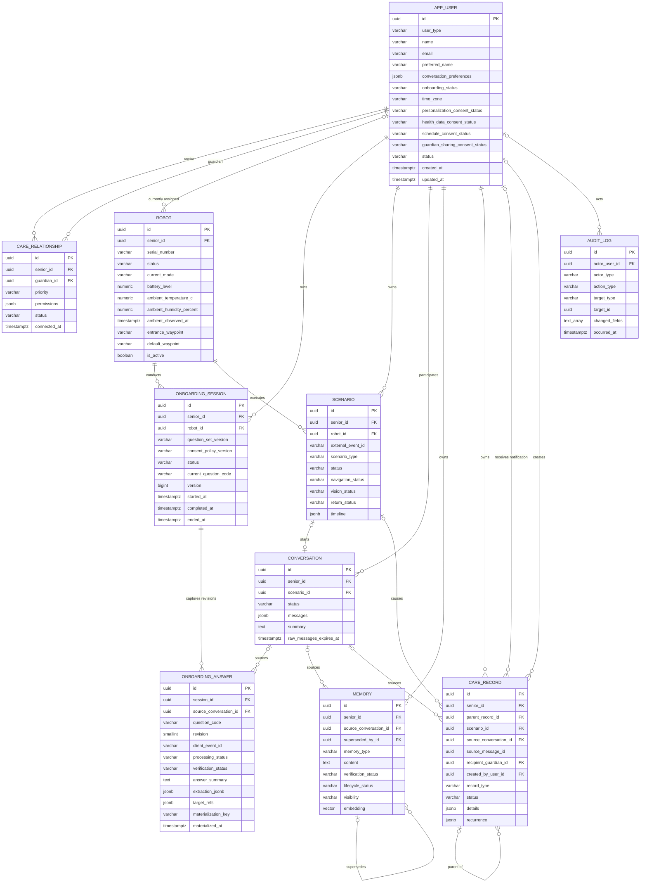
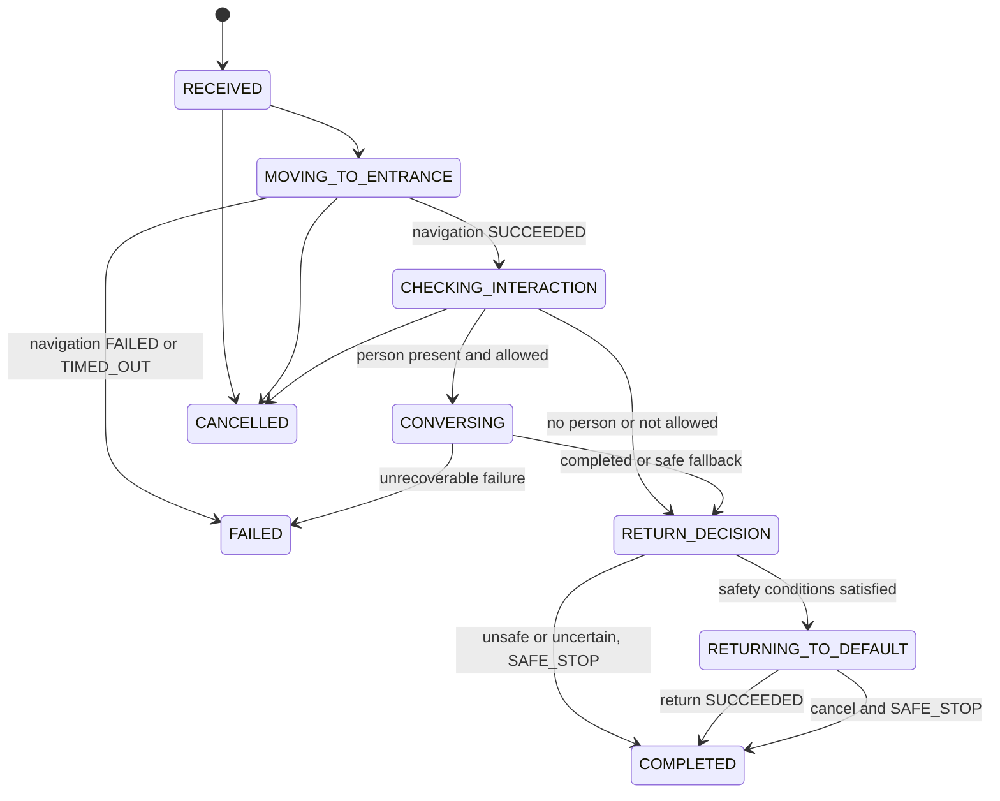

# BOMI 1차 물리 ERD

> 상태: 설계 기준안 · PostgreSQL 17 / pgvector · 2026-07-23
> 범위: 귀가 환영, 맞춤 대화, 초기 온보딩, 휴식 보호, 온습도 인지 MVP를 수용하는 10개 테이블
> 제외: 전체 DDL, JPA Entity, Flyway migration, 로봇 로컬 큐 구현

이 문서는 정규화 모범답안이 아니다. 팀이 빠르게 구현하고 설명할 수 있도록 일부 NULL, 넓은 테이블, 제한된 JSONB와 메타데이터 중복을 의도적으로 허용한 1차 물리 모델이다. PostgreSQL에는 실시간 처리 과정 전체가 아니라 **동작 이유와 최종 업무 결과**를 저장한다.

운영 PostgreSQL에는 Spring Boot Backend만 직접 접근한다. Robot/IoT는 MQTT로 이벤트·명령·결과를 교환하고, Backend와 AI 서비스는 REST 요청·응답을 사용하며, 보호자 대시보드는 REST 조회와 WebSocket 갱신 알림을 사용한다. ROS 2/Nav2의 실시간 주행 원본은 로봇에 남는다. 테이블·컬럼은 영문 `snake_case`, 주요 PK는 `uuid`, 주요 시각은 UTC 기준 `timestamptz`를 사용한다. 관제센터와 의료 진단 시스템은 현재 범위가 아니다.

## A. 핵심 설계 결정

### 저장 경계와 원본 책임

| 데이터 | 중앙 PostgreSQL 저장 | 원본 책임과 저장 방식 |
| --- | --- | --- |
| 사용자, 보호자 관계와 관계별 권한 | 저장 | Spring Backend가 권한 판정의 원본이다. 전역 역할만으로 접근을 허용하지 않는다. |
| 온보딩 진행과 동의 | 세션·문항별 처리/검증 원장과 현재 projection 저장 | `onboarding_session`이 진행 상태의 원본이고 `app_user`는 빠른 게이트 조회용 projection이다. `onboarding_answer`는 처리 원장이며 확인된 최종 사실은 `app_user`, `memory`, `care_record`에 반영한다. |
| 로봇 현재 배정, 마지막 통신, 배터리, waypoint, 최신 온습도 | 최신 상태만 저장 | 배정의 원본은 Backend, 실제 pose·경로·안전 판정과 고빈도 센서 원본은 ROS 2/장치다. |
| 출입·귀가·낙상 시나리오 | 의미 있는 단계와 최종 결과 저장 | 장치가 `external_event_id`와 `occurred_at`을 만들고 Backend가 수신·멱등 처리 결과를 소유한다. |
| Vision 결과 | 사람 수·상호작용 가능 여부와 일정 시간 이상 누움이 확정된 휴식 구간만 저장 | 프레임·track·자세 좌표·초당 분류의 원본은 Vision이며, track ID를 사람 ID로 승격하지 않는다. |
| 대화 | 최근 메시지 JSONB, 요약, 최소 AI 메타데이터 저장 | 원본 음성·중간 STT·전체 프롬프트는 저장하지 않는다. 메시지 본문은 7일 후 제거한다. |
| 개인화 기억 | 자연어 기억, 검증·공개·생명주기, 단일 활성 임베딩 저장 | 기억의 승인·거부·삭제는 어르신과 관계 기반 권한을 가진 보호자가 통제한다. |
| 건강·복약·일정·휴식·환경 관찰·알림 | `care_record`의 유형별 업무 행으로 저장 | 계획과 실행 결과를 다른 행으로 만들고 `parent_record_id`로 연결한다. 휴식·환경은 의미 있는 구간/임계 사건만 남긴다. |
| 민감정보 변경 행위 | 본문 없이 변경 필드명과 행위만 저장 | `audit_log`는 변경 전후 민감값을 복제하지 않는다. |
| LiDAR, 카메라 프레임, 영상 스트림, 원본 음성, 초당 pose·자세·온습도, 모터값 | 저장하지 않음 | 로봇/Vision/센서/음성 시스템에서 실시간 처리 후 폐기하거나 각 시스템의 운영 로그 정책을 따른다. |
| 얼굴 특징·얼굴 임베딩·생체정보 | 저장하지 않음 | 중앙 DB와 개인화 임베딩 모두에서 금지한다. |

### 직접 결정한 가정

1. 내부 PK는 PostgreSQL `uuid`와 `gen_random_uuid()`를 사용한다. MQTT/OpenAPI의 `eventId`, `requestId`, `commandId`는 현재 최대 64자의 불투명 문자열 계약이므로 DB에는 `varchar(64)`로 원문 보존한다. 생산자는 오프라인 생성 가능한 UUIDv4/v7 또는 ULID 계열 중 팀이 확정한 한 형식을 사용한다.
2. DB 세션과 애플리케이션은 UTC를 기준으로 쓰고, 사용자 시간대는 `app_user.time_zone`을 기준으로 해석한다. 한국 전용 MVP 기본값은 `Asia/Seoul`이며 모든 사건 시각은 `timestamptz`다.
3. 초기에는 PostgreSQL enum type 대신 `varchar + CHECK`를 사용한다. 값 변경이 잦은 MVP에서 migration 부담을 줄이고 Spring enum과 동기화하기 쉽기 때문이다.
4. 내부·수동 시나리오도 Backend가 외부 계약과 같은 형식의 `external_event_id`를 생성한다. 따라서 모든 `scenario`가 동일한 멱등 처리 경로를 사용한다.
5. `external_event_id` 충돌 시 `INSERT ... ON CONFLICT`로 기존 `scenario.id`, `status`, 결과를 반환한다. 별도 `is_first_processing` 컬럼은 두지 않는다.
6. 보호자 이메일은 대소문자를 무시해 비교한다. MVP에서는 `lower(email)` 부분 UNIQUE 인덱스를 사용하고, 필요하면 이후 `citext` 도입을 검토한다.
7. `scenario.status`는 전체 업무 흐름의 굵은 상태다. 기존 MQTT/API의 세부 체크포인트는 `navigation_status`, `vision_status`, `return_status`, 요청·명령 ID와 `timeline`에 매핑한다.
8. 임베딩 모델과 차원이 결정되기 전 문서의 벡터 타입은 `vector(<EMBEDDING_DIM>)` 자리표시자다. 실제 migration 작성 전에 반드시 구체값으로 치환한다.
9. 로봇 로컬 큐는 중앙 ERD 범위가 아니다. 중앙의 재처리는 시나리오 행의 명령 ID와 상태를 기준으로 한다.
10. 조회 감사는 MVP 필수가 아니다. 생성·수정·확인·거부·삭제와 관계·권한 변경부터 감사한다.
11. 휴식 판정의 누움 지속시간, 온도·습도 임계값, 질문 재시도 간격은 운영 설정이다. 데이터베이스 CHECK나 문서의 임의 상수로 고정하지 않고 적용한 정책 버전과 실제 관측값을 결과에 남긴다.
12. 휴식 중에는 일반 능동 대화·비긴급 알림·자율 시나리오를 중지한다. 다만 호출 감지, 호출 시 안전 확인 후 접근, 낙상·화재 등 안전 감지와 긴급 대응은 백그라운드에서 계속 동작한다.
13. MQTT의 `eventId`는 BOMI 시스템 전체에서 유일하므로 `onboarding_answer.client_event_id`도 전역 UNIQUE로 둔다. 같은 답변을 재전송하는 로봇은 같은 ID를 재사용한다.
14. 초기 설문은 현재 배정된 한 로봇에서만 진행한다. 따라서 `onboarding_session.robot_id`는 `NOT NULL`이며 앱·다른 로봇에서의 재개는 후속 범위다.

### 초기 설문 적용 판단

초기 설문을 최종 테이블에만 분해 저장하는 원칙은 프로필 원본을 단순하게 유지하지만, 12개 문항의 재개·수정·검증·로봇 재전송과 최종 반영 여부를 추적하지 못한다. 따라서 `onboarding_session`과 `onboarding_answer`를 처리 원장으로 추가하고, 질문 문구·분기는 버전이 있는 제품 정책으로 유지한다. 프로필은 원장을 직접 읽지 않고 확인된 최종 사실만 조회한다.

| 제안 | 판정 | 적용 방식 |
| --- | :---: | --- |
| 전용 설문 처리 원장을 만들지 않음 | 불수용 | 진행 세션과 문항별 처리·검증·수정·멱등 수명주기가 독립적이므로 두 테이블을 추가한다. |
| 최종 사실을 기존 도메인에 분해 | 수용 | 호칭·동의·대화 설정은 `app_user`, 취향·일상·관계는 `memory`, 건강·일정은 `care_record`가 원본이다. |
| 실명·생년월일·성별·연락처·주소는 앱 등록에서 수집 | 수용 | `app_user`에 저장하고 로봇이 반복 질문하지 않는다. 보호자와의 실제 로그인 연결만 `care_relationship`로 만든다. |
| 일반 개인화·건강·일정·보호자 공유 동의를 분리 | 수용 | 네 동의 상태, 정책 버전, 갱신 시각을 `app_user`에 명시한다. 건강 동의가 없으면 건강·복약 질문과 저장을 건너뛴다. |
| 권장 12개 질문을 스키마에 고정 | 불수용 | 질문은 버전이 있는 온보딩 대화 정책으로 관리한다. 세션에는 `question_set_version`, 답변에는 `question_code`만 남긴다. |
| 호칭·대화 방식 | 수용 | 호칭은 `preferred_name`, 대화 방식은 `conversation_preferences` schemaVersion 2에 저장하며 중복 키 `preferredName`은 두지 않는다. |
| 생활·취향·개인 관계를 기억으로 분해 | 수용 | 한 답변에서 원자 사실별 `memory` 행을 만들고 `DAILY_ROUTINE`을 추가한다. 로그인 보호자가 아닌 가족 이름으로 관계 행을 만들지 않는다. |
| 질환·불편·알레르기를 돌봄 기록으로 저장 | 수용 | `care_record`의 유형별 DTO와 검증 상태를 사용하고 임베딩하지 않는다. 사용자의 확인은 의료기관 검증과 구분한다. |
| 약 언급을 바로 현재 복약으로 확정 | 불수용 | 우선 `HEALTH_OBSERVATION/UNVERIFIED`로 남기고 읽어주기·사용자 확인 후 `MEDICATION`, `MEDICATION_SCHEDULE`을 새 행으로 만든다. |
| 일정의 상대 날짜를 즉시 확정 | 불수용 | `time_zone`으로 절대 시각을 계산해 다시 확인하고 확인 전 `DRAFT/UNVERIFIED`, 확인 후 `ACTIVE/USER_CONFIRMED`로 전이한다. |
| “없음” 답변을 모두 기억으로 저장 | 일부 수용 | 미응답은 답변 행 자체가 없다. 알레르기·현재 복약처럼 부재 자체가 안전상 중요한 항목만 확인 후 처리 원장과 최종 도메인에 반영한다. |

질문·후속 질문·출처 추적·동의 게이트의 상세 흐름은 [`onboarding-rest-environment-design.md`](./onboarding-rest-environment-design.md)를 따른다.

### 관계 기반 접근 권한

`app_user.user_type`은 사용자 종류만 나타내며 특정 어르신 데이터에 대한 권한을 부여하지 않는다. 모든 보호자 요청은 대상 `senior_id`와 일치하는 `care_relationship.status='ACTIVE'` 행을 먼저 조회하고, `priority`와 `permissions`를 함께 평가한다.

| 요청자 | 허용 범위 | 금지·조건 |
| --- | --- | --- |
| 어르신 | 자신의 기억 확인·수정·거부·삭제, 공개 범위 변경, AI 추출 정보 확인/거부, 보호자 연결 해제 요청 | MVP에서 웹 로그인 계정은 없어도 된다. 로봇/현장 인터페이스의 본인 확인 방식은 별도 보안 설계 대상이다. |
| 활성 PRIMARY 보호자 | 어르신 프로필, 복약·일정 관리, AI 추출 기억 검증, 긴급 알림 1차 수신, 다른 보호자 연결 관리, 대시보드 조회 | 대화 원문은 기본 금지. 기억은 visibility와 권한을 모두 통과해야 한다. |
| 활성 SECONDARY 보호자 | 대시보드 조회, 명시적으로 허용된 복약·일정 관리, PRIMARY 미응답 후 긴급 알림 수신 | 관계 생성·우선순위 변경·다른 보호자 해제 금지. `manageRelationships`는 항상 false다. |
| 연결되지 않았거나 종료/해제 요청 상태의 보호자 | 없음 | 다른 어르신의 프로필·시나리오·대화·기억·돌봄 기록을 모두 거부한다. 과거 알림 수신 이력은 현재 권한이 아니다. |
| 권한 없는 가족·친구 | 시스템 사용자 권한 없음 | 이름과 관계는 필요한 경우 `memory`의 개인화 정보로만 관리한다. |

MVP UI는 어르신당 보호자 등록을 2명까지 안내하지만 DB에는 그 개수 CHECK를 두지 않는다. 활성 PRIMARY만 한 명으로 제한하고 SECONDARY는 여러 명을 허용하므로, 향후 UI 제한이 바뀌어도 schema 변경이 필요 없다.

어르신의 연결 해제 요청은 관계를 즉시 삭제하지 않고 `care_relationship.status='DISCONNECT_REQUESTED'`로 바꾸어 기록한다. 요청 시점부터 보호자 접근을 중지하고, 승인/정책 처리 후 `ENDED`로 전이한다. 요청·처리·권한 변경은 모두 `audit_log` 대상이다.

### 오프라인 동작과 중앙 저장 경계

| 연결 단절 중 로봇/IoT가 수행 | 중앙 DB의 역할 |
| --- | --- |
| 출입 감지, 로컬 지도 기반 현관 이동 | 재연결 후 동일 `external_event_id`의 최초 결과만 scenario로 반영 |
| 고정 문구 또는 로컬 모델 환영 인사 | `execution_location='LOCAL'`, fallback 여부와 최종 업무 결과만 기록 |
| 미리 동기화한 오늘의 복약 알림, 기본 음성 명령 | 복약 계획 원본은 중앙, 로컬 실행 결과는 external ID로 멱등 반영 |
| 로컬 낙상 감지와 음성 상태 확인 | FALL_RESPONSE 최종 단계와 보호자 알림 결과만 기록 |
| 로컬 Vision의 일정 시간 이상 누움 판정과 `REST_GUARD` 전환 | 프레임별 자세는 저장하지 않고 `REST_OBSERVATION` 시작/종료와 최신 로봇 모드만 멱등 반영 |
| 호출 감지와 안전 확인 후 어르신에게 접근 | 휴식 중에도 허용하며 이동 명령·최종 결과만 기존 명령/결과 계약으로 기록 |
| 온습도 측정과 임계값 판정 | `robot`에는 최신값만, 임계 초과·사용자 확인 사건은 `ENVIRONMENT_OBSERVATION`으로 저장 |
| 안전 조건 충족 시 DEFAULT_POSITION 복귀 | 목적·최종 상태·실패/SAFE_STOP 근거만 기록 |
| 사람·장애물·센서·지도 불확실 시 안전 정지 | 복귀 명령을 생성하지 않고 `return_status='SAFE_STOP'` 기록 |
| 발생 이벤트를 로컬 큐에 저장하고 재연결 후 전송 | 로컬 큐 자체는 중앙 ERD에 모델링하지 않음 |

재전송 payload는 오프라인 생성 가능한 외부 이벤트 ID, 실제 `occurred_at`, 장치 코드, 이벤트 종류를 포함한다. Backend는 ID 원문, 최초 `received_at`과 처리 상태를 저장하고, UNIQUE 충돌이면 새 부수 효과를 만들지 않고 기존 결과를 반환한다.

장치 시계 오차가 있을 수 있으므로 `occurred_at`만으로 중복 여부나 처리 순서를 결정하지 않는다. 중복 여부는 `external_event_id`, 허용 전이는 현재 상태와 낙관적 잠금 `version`, 운영 관측은 `received_at`을 함께 사용한다. 최초 처리 여부는 별도 boolean을 장기 저장하지 않고 UPSERT 결과로 판정한다.

### 중앙 PostgreSQL 저장 금지 상세

LiDAR 원시 데이터, 카메라 프레임·실시간 영상, 원본 음성 장기 보관, 초당 로봇 좌표·자세·온습도, 모터 제어값, 장애물 회피 계산 전 과정, Vision 프레임별 결과, STT 중간 청크, TTS 내부 단계, 전체 HTTP 요청·응답, 전체 프롬프트/응답의 중복 로그, 얼굴 특징·얼굴 임베딩·생체정보는 저장하지 않는다. 디버깅 편의를 이유로 `timeline`, `messages`, `details`, `audit_log`에 우회 저장하는 것도 금지한다.

### 10개로 구성한 이유와 의도적으로 미룬 정규화

- `app_user`: 어르신과 보호자의 공통 개인정보, 온보딩 진행, 동의와 핵심 대화 선호를 한곳에 둔다. 어르신 로그인 컬럼의 NULL을 허용하는 대신 계정·프로필·동의 이력 테이블 분리를 미룬다.
- `care_relationship`: N:M 연결과 우선순위·소수 권한을 한 행으로 관리한다. 역할/권한 기준정보 테이블을 만들지 않는다.
- `robot`: 장치, 현재 배정, 최신 모드·온습도, 지도·waypoint 참조를 합친다. 초당 상태·센서 원본과 배정 이력은 저장하지 않는다.
- `onboarding_session`: 한 번의 설문 진행, 질문·동의 정책 버전, 현재 문항과 종료 상태를 관리한다. 질문 문구나 답변 본문은 넣지 않는다.
- `onboarding_answer`: 문항별 답변 처리·검증·수정·멱등 반영 원장이다. 프로필 원본과 단기 원문 저장소 역할은 맡지 않는다.
- `scenario`: 출입 트리거, 주행, Vision 최종 판정, 귀가/낙상 업무 결과를 합친다. 프레임·단계·명령별 자식 테이블을 미룬다.
- `conversation`: 세션, 최근 메시지, 롤링 요약과 대표 AI 실행 정보를 합친다. 메시지별 FK·통계를 포기한다.
- `memory`: 사람 관계, 취향, 추억, 검증과 단일 임베딩을 합친다. 여러 모델을 동시 운영하지 않는다.
- `care_record`: 건강, 복약, 일정, 휴식, 환경 관찰, 인지 참고 지표와 보호자 알림을 `record_type`으로 구분한다. NULL이 많은 넓은 행을 의도적으로 허용한다.
- `audit_log`: 도메인별 이력 테이블 대신 공통 논리 참조를 사용한다. FK 무결성보다 민감정보 비복제를 우선한다.

허용하는 중복은 각 업무 결과 행에 저장하는 `model_name`, `model_version`, 요청 ID와 시각 메타데이터다. 이는 별도 AI 실행 테이블 없이 결과의 재현 근거를 남기기 위한 제한된 중복이다. `care_record`의 계획 제목과 실행 결과 제목도 대시보드 가독성을 위해 일부 중복될 수 있다. 반대로 PK, 핵심 FK, 주요 상태·시각, 이메일, 외부 이벤트 ID는 JSONB에 숨기지 않는다.

## B. 테이블 수 검증

| 항목 | 결과 |
| --- | --- |
| 실제 현재 테이블 | `app_user`, `care_relationship`, `robot`, `onboarding_session`, `onboarding_answer`, `scenario`, `conversation`, `memory`, `care_record`, `audit_log` |
| 테이블 수 | **10개** |
| 기존 8개 + 온보딩 원장 2개 | 예 |
| 추가 원장의 책임 | 세션 진행과 문항별 처리·검증·멱등 반영 추적 |

현재 제외·통합한 후보는 범용 `survey`/질문 기준정보, `consent_history`, `device`, `device_event`, `sensor_reading`, `rest_session`, `robot_assignment`, `robot_state`, `navigation_mission`, `vision_result`, `scenario_step`, `conversation_message`, `conversation_summary`, `memory_embedding`, `medication`, `schedule`, `notification`, `ai_execution`, 도메인별 감사 테이블이다. 현재 상태 컬럼, 명령·요청 ID, 제한된 JSONB, 자기참조 FK와 유형별 `care_record` 행으로 처리한다.

완전한 범용 Transactional Outbox는 이 10개에 포함하지 않는다. MVP에서는 `scenario`의 명령 ID와 `*_status=REQUESTED`를 커밋한 뒤 해당 행을 재조회하여 동일 명령 ID로 재발행한다. 온보딩 답변 수신은 `client_event_id` UNIQUE, 최종 반영은 `materialization_key` UNIQUE로 각각 중복을 막는다. 여러 채널·다수 메시지·장기 재시도가 필요해 명령 발행 누락 또는 잠금 경합이 측정되면 Outbox를 우선 분리해야 한다.

## C. 통합 검토 결과

| 검토 대상 | 1차 결정 | 근거 / 분리 조건 |
| --- | --- | --- |
| 계정과 어르신·보호자 정보 | `app_user` 통합 | 공통 개인정보가 많고 어르신 로그인은 NULL로 허용한다. 인증 수단이 여러 개가 되면 계정 분리 후보다. |
| 생활공간과 로봇 waypoint | `robot` 통합 | 현관·기본 위치 두 참조 문자열이면 충분하다. 위치 종류와 독립 관리 UI가 늘면 분리한다. |
| 어르신과 로봇 배정 | `robot.senior_id`로 통합 | 현재 배정만 필요하다. 과거 재배정 조회가 실제 요구가 되면 분리한다. |
| 출입 이벤트와 시나리오 | `scenario` 통합 | 트리거당 한 시나리오이고 `external_event_id` UNIQUE로 멱등 처리한다. 범용 장치 이벤트 분석이 생기면 분리한다. |
| 시나리오와 주행 결과 | `scenario` 통합 | 출발·도착·상태·실패 한 세트면 충분하다. 한 시나리오의 반복 주행이 늘면 `scenario_action` 후보가 된다. |
| 시나리오와 Vision 최종 결과 | `scenario` 통합 | MVP는 최종 판정 한 건이다. 여러 판정의 독립 보존이 필요하면 `vision_result`로 분리한다. |
| 로봇과 최신 상태 | `robot` 통합 | 배터리·모드·마지막 통신만 갱신한다. 시계열 관측은 중앙 업무 DB에 넣지 않는다. |
| 대화 세션·메시지·요약 | `conversation` 통합 | 최근 원문은 7일, 요약은 장기 유지한다. 메시지별 검색·통계·삭제가 요구되면 분리한다. |
| 기억과 임베딩 | `memory` 통합 | 기억당 활성 임베딩 한 개다. 복수 모델 동시 운영 시 분리한다. |
| 병원 예약·개인 약속·복약 스케줄 | `care_record` 통합 | 공통 시각·상태·설명이 많고 상세만 JSONB가 다르다. 유형별 집계가 복잡해지면 분리한다. |
| 복약 계획과 실행 결과 | 같은 테이블의 **다른 행** | `parent_record_id`로 계획→알림→복용/미응답을 연결한다. 덮어쓰지 않는다. |
| 건강 관찰과 인지 분석 | `care_record` 통합 | 둘 다 검증 전 참고 결과이며 확정 질환을 자동 변경하지 않는다. 별도 접근/보존 정책이 생기면 분리한다. |
| 기억 수정 이력과 공통 감사 | `audit_log` 통합 | 본문을 복제하지 않고 행위·필드명만 남긴다. 법적 독립 이력이 요구되면 전용 이력을 검토한다. |
| AI 모델·실행 정보 | 결과 행에 최소 메타데이터 중복 | 결과와 모델의 근거를 한 번에 읽는다. 횡단 장애 분석이 실제 요구가 되면 `ai_execution`으로 분리한다. |
| 낙상사고와 대응 타임라인 | `scenario` + `care_record` | 사고의 굵은 단계는 scenario, 보호자별 전달 결과는 care_record다. 대응 행위 독립 조회가 늘면 분리한다. |
| 보호자 알림과 전달 결과 | `care_record` 통합 | 수신자별 한 행과 `attempt_count`로 시작한다. 채널·재시도별 이력이 필요하면 분리한다. |
| 초기 설문 세션·답변 | `onboarding_session` + `onboarding_answer` | 재개·수정·검증·로봇 재전송과 최종 반영 추적은 원장에 두고, 프로필 원본은 app_user/memory/care_record에 둔다. |
| 휴식 상태 구간 | `robot.current_mode` + `care_record` | 로봇은 최신 `REST_GUARD`, 중앙에는 임계시간을 넘긴 시작/종료 사건만 둔다. 프레임별 분석이나 수면 통계가 필요해지면 분리한다. |
| 온습도 센서 | `robot` 최신값 + `care_record` 임계 사건 | 현재 질문에는 최신 스냅샷이면 충분하다. 시계열 분석·장치 보정·다중 센서가 필요해지면 전용 저장소/테이블을 분리한다. |

## D. MVP 물리 ERD



`care_relationship`의 두 FK는 같은 `app_user`를 가리키지만 Spring 서비스가 각각 `SENIOR`, `GUARDIAN`인지 검증한다. `audit_log.target_id`와 `memory.source_message_id`는 의도적인 논리 참조이므로 ERD 관계선이 없다.

검증 기록: 이 ERD와 H절의 상태도, 연계된 귀가 시나리오 sequence diagram은 2026-07-22에 로컬 Mermaid 11.16.0 `parse()`로 검사했으며 3개 블록 모두 구문 오류 없이 통과했다.

## E. MVP 데이터 사전

표의 `NULL`은 `Y`가 허용, `N`이 불허다. `—`는 DB 기본값 없음이며 애플리케이션이 명시해야 한다. 보존 표기는 다음 정책을 뜻한다.

- **사용자**: 사용자 서비스 이용 기간. 삭제 요청 시 법적 보존 대상을 제외하고 물리 삭제 또는 비식별화한다.
- **관계**: 연결 기간과 관계 변경 감사 정책 기간. 종료 행은 재연결 판단을 위해 유지하되 본문형 권한은 최소화한다.
- **로봇**: 장치 운용/배정 기간. 사용자 삭제 시 장치 자체는 유지하고 `senior_id` 및 사용자 유래 waypoint 참조를 제거한다.
- **일반 90일**: 종료된 일반 시나리오·일정·실행 결과의 MVP 기본값이다.
- **원문 7일**: 대화 메시지 본문 보존기간이다. 만료 시 행 삭제가 아니라 본문을 비운다.
- **요약 90일**: 대화 종료 후 요약의 MVP 기본 보존기간이다. 사용자 요청 또는 민감정보 잔존 시 더 일찍 제거하고, 장기 개인화에 필요한 내용은 검증된 `memory`로 승격한다.
- **AI 단기 30일**: 요청 ID, 시작·종료·지연시간 등 단기 추적 메타데이터다. 모델명·버전·최종 생성 상태는 업무 결과와 함께 유지한다.
- **온보딩 원장**: 세션·문항 코드·revision·처리/검증 상태·최종 반영 참조를 감사·업무 정책 기간 유지한다. 답변 본문과 미확정 추출은 포함하지 않는다.
- **온보딩 단기 7일/30일**: `transcript_excerpt`는 기본 7일, 미확정 추출과 STT/AI 신뢰도·단기 모델 메타데이터는 기본 30일 이내 또는 확인 완료 시점까지다.
- **기억**: `expires_at` 또는 명시적 삭제까지. 확인된 안정 기억은 무기한일 수 있다.
- **안전/감사**: 별도 보안·법무 정책에서 기간을 확정한다. 임의로 영구 보존하지 않는다.

### `app_user`

목적: 어르신과 로그인 보호자의 공통 프로필, 인증 연결 정보, 핵심 대화 선호를 관리한다.

| 컬럼 | PostgreSQL 타입 | NULL | 기본값 | 키/제약 | 설명 | 민감정보 | 보존 |
| --- | --- | :---: | --- | --- | --- | :---: | --- |
| `id` | `uuid` | N | `gen_random_uuid()` | PK | 내부 사용자 ID | 간접 | 사용자/참조 존속 |
| `user_type` | `varchar(20)` | N | — | CHECK `SENIOR, GUARDIAN` | 사용자 구분 | N | 사용자 |
| `name` | `varchar(100)` | N | — | 빈 문자열 금지 | 실명 또는 등록명 | Y | 사용자 |
| `birth_date` | `date` | Y | — | 미래 날짜 금지(서비스 검증) | 생년월일 | Y | 사용자 |
| `gender` | `varchar(20)` | Y | — | 허용값은 서비스 정책 | 선택 입력 성별 | Y | 사용자 |
| `phone` | `varchar(30)` | Y | — | 정규화 형식은 서비스 검증 | 연락처 | Y | 사용자 |
| `address` | `text` | Y | — | — | 생활 주소. 임베딩 금지 | Y | 사용자 |
| `email` | `varchar(320)` | Y | — | 활성 보호자 `lower(email)` 부분 UNIQUE | 보호자 로그인 식별자 | Y | 사용자 |
| `password_hash` | `varchar(255)` | Y | — | GUARDIAN이면 필수 CHECK | 단방향 비밀번호 해시. 평문 금지 | 인증 | 사용자, 삭제 시 즉시 제거 |
| `preferred_name` | `varchar(100)` | Y | — | — | 로봇이 부를 호칭 | Y | 사용자 |
| `conversation_preferences` | `jsonb` | N | `{"schemaVersion":2}` | JSON object CHECK | 제한된 대화 선호; `preferred_name` 중복 금지 | Y | 사용자 |
| `onboarding_status` | `varchar(20)` | N | `NOT_STARTED` | CHECK `NOT_STARTED, IN_PROGRESS, COMPLETED, DECLINED, CANCELLED, EXPIRED` | 세션 원본을 같은 트랜잭션에서 반영한 현재 상태 projection | Y | 사용자/감사 정책 |
| `onboarding_version` | `varchar(50)` | Y | — | NOT_STARTED 외 상태면 필수 | 현재/최근 세션의 질문 세트 버전 projection | N | 사용자/감사 정책 |
| `onboarding_completed_at` | `timestamptz` | Y | — | COMPLETED이면 필수 | 온보딩 완료 시각 | Y | 사용자/감사 정책 |
| `time_zone` | `varchar(64)` | N | `Asia/Seoul` | IANA time zone 서비스 검증 | 상대 날짜·지역 시간 해석 기준 | Y | 사용자 |
| `personalization_consent_status` | `varchar(20)` | N | `NOT_ASKED` | 동의 상태 CHECK | 일반 개인화 저장 동의 | Y | 사용자/감사 정책 |
| `health_data_consent_status` | `varchar(20)` | N | `NOT_ASKED` | 동의 상태 CHECK | 건강·복약정보 저장 동의 | Y | 사용자/감사 정책 |
| `schedule_consent_status` | `varchar(20)` | N | `NOT_ASKED` | 동의 상태 CHECK | 일정·알림 생성 동의 | Y | 사용자/감사 정책 |
| `guardian_sharing_consent_status` | `varchar(20)` | N | `NOT_ASKED` | 동의 상태 CHECK | 보호자 공유 동의; 관계 권한과 별도 | Y | 사용자/감사 정책 |
| `consent_policy_version` | `varchar(50)` | Y | — | GRANTED가 하나라도 있으면 필수 | 동의 문구·정책 버전 | N | 감사 정책 |
| `consent_updated_at` | `timestamptz` | Y | — | 동의 상태 변경 시 필수 | 마지막 동의 변경 시각 | Y | 감사 정책 |
| `status` | `varchar(20)` | N | `ACTIVE` | CHECK `ACTIVE, SUSPENDED, WITHDRAWN` | 서비스 상태 | N | 사용자/감사 정책 |
| `created_at` | `timestamptz` | N | `now()` | — | 생성 시각 | N | 행과 동일 |
| `updated_at` | `timestamptz` | N | `now()` | 서비스가 갱신 | 최종 수정 시각 | N | 행과 동일 |

삭제 정책: `WITHDRAWN`은 복구 가능한 비활성 상태다. 개인정보 삭제 요청이 확정되면 연결·법적 보존 여부를 확인한 뒤 개인정보와 인증정보를 물리 삭제/비식별화한다. `password_hash`는 복구용으로 보존하지 않는다. 어르신 삭제가 연관 기억·대화·임베딩 삭제 작업을 시작한다.

DB CHECK 권장식: `user_type='SENIOR' OR status='WITHDRAWN' OR (email IS NOT NULL AND password_hash IS NOT NULL)`. 따라서 서비스 중인 보호자는 인증정보가 필수지만 탈퇴 tombstone은 이메일·해시를 제거할 수 있다. 사용자 유형을 참조하는 FK의 역할 적합성은 교차 행 CHECK로 표현할 수 없으므로 Spring 트랜잭션에서 검증한다.

동의 상태 공통값은 `NOT_ASKED`, `GRANTED`, `DENIED`, `REVOKED`다. 동의 철회는 과거 업무 행을 조용히 덮어쓰지 않고 신규 수집·공유를 즉시 중지한 뒤 보존·삭제 작업을 실행하며, 변경한 필드명과 정책 버전을 `audit_log`에 기록한다. `guardian_sharing_consent_status=GRANTED`만으로 보호자 접근 권한이 생기지 않으며 활성 관계·permissions·memory visibility를 모두 통과해야 한다.

### `care_relationship`

목적: 어르신-보호자 N:M 연결, 우선순위와 관계별 권한을 관리한다.

| 컬럼 | PostgreSQL 타입 | NULL | 기본값 | 키/제약 | 설명 | 민감정보 | 보존 |
| --- | --- | :---: | --- | --- | --- | :---: | --- |
| `id` | `uuid` | N | `gen_random_uuid()` | PK | 관계 ID | 간접 | 관계 |
| `senior_id` | `uuid` | N | — | FK→`app_user.id`, guardian과 다름 | 보호 대상 어르신 | Y | 관계 |
| `guardian_id` | `uuid` | N | — | FK→`app_user.id` | 로그인 보호자 | Y | 관계 |
| `priority` | `varchar(20)` | N | — | CHECK `PRIMARY, SECONDARY` | 알림·관리 우선순위 | Y | 관계 |
| `permissions` | `jsonb` | N | — | JSON object CHECK, 서비스 필수 DTO | 관계별 최종 유효 권한 스냅샷 | Y | 관계 |
| `status` | `varchar(30)` | N | `PENDING` | CHECK `PENDING, ACTIVE, DISCONNECT_REQUESTED, ENDED, REVOKED` | 연결·해제 요청 상태 | Y | 관계/감사 |
| `connected_at` | `timestamptz` | Y | — | ACTIVE이면 필수 | 연결 효력 시작 | Y | 관계 |
| `ended_at` | `timestamptz` | Y | — | 종료 상태면 필수 | 연결 종료 시각 | Y | 관계 |
| `created_at` | `timestamptz` | N | `now()` | — | 요청/행 생성 시각 | N | 행과 동일 |
| `updated_at` | `timestamptz` | N | `now()` | 서비스가 갱신 | 최종 수정 시각 | N | 행과 동일 |

UNIQUE는 `(senior_id, guardian_id)` 전체 조합에 둬 종료 후 재연결 시 같은 행을 승인 흐름으로 되살린다. 활성 PRIMARY는 `UNIQUE (senior_id) WHERE status='ACTIVE' AND priority='PRIMARY'`로 한 명만 허용하고 SECONDARY는 제한하지 않는다.

삭제 정책: 어르신의 연결 해제 요청은 `DISCONNECT_REQUESTED`로 접근을 즉시 중지하고, 처리 후 `ENDED`와 `ended_at`으로 논리 종료한다. 관리상 강제 해제는 `REVOKED`를 사용한다. 개인정보 삭제 요청 시 사용자 FK 처리와 감사 보존 정책을 함께 검토한다. 권한 JSON에 자유 텍스트나 대상자의 건강·대화 내용을 넣지 않는다.

### `robot`

목적: 로봇 식별, 현재 어르신 배정, 최신 운영 상태와 Nav2 waypoint 참조를 한 행에서 관리한다.

| 컬럼 | PostgreSQL 타입 | NULL | 기본값 | 키/제약 | 설명 | 민감정보 | 보존 |
| --- | --- | :---: | --- | --- | --- | :---: | --- |
| `id` | `uuid` | N | `gen_random_uuid()` | PK | 로봇 내부 ID | N | 로봇 |
| `senior_id` | `uuid` | Y | — | FK→`app_user.id`; 활성 배정 부분 UNIQUE | 현재 배정 어르신 | Y | 배정 기간 |
| `serial_number` | `varchar(100)` | N | — | UNIQUE | 제조/등록 시리얼 | 간접 | 로봇 |
| `name` | `varchar(100)` | N | — | — | 화면 표시명 | N | 로봇 |
| `status` | `varchar(20)` | N | `REGISTERED` | CHECK `REGISTERED, ACTIVE, MAINTENANCE, RETIRED` | 장치 수명 상태 | N | 로봇 |
| `current_mode` | `varchar(40)` | N | `IDLE` | CHECK `IDLE, SCENARIO_ACTIVE, REST_GUARD, SAFE_STOP` | 최신 업무 모드 | 간접 | 최신값만 |
| `battery_level` | `numeric(5,2)` | Y | — | CHECK 0~100 | 최신 배터리 백분율 | N | 최신값만 |
| `last_seen_at` | `timestamptz` | Y | — | — | 마지막 정상 통신 수신 | 간접 | 최신값만 |
| `map_version` | `varchar(100)` | Y | — | — | 로봇이 사용하는 지도 버전 참조 | 간접 | 배정 기간 |
| `entrance_waypoint` | `varchar(200)` | Y | — | 활성 배정 시 서비스 검증 | Nav2 현관 waypoint 키 | Y | 배정 기간 |
| `default_waypoint` | `varchar(200)` | Y | — | 활성 배정 시 서비스 검증 | 안전 확인 후 복귀할 기본 위치 키 | Y | 배정 기간 |
| `current_waypoint` | `varchar(200)` | Y | — | — | 최신 의미 있는 위치 키; 실시간 pose 아님 | Y | 최신값만 |
| `ambient_temperature_c` | `numeric(5,2)` | Y | — | CHECK `-40~85` | 최신 실내 온도 스냅샷 | 파생 | 최신값만 |
| `ambient_humidity_percent` | `numeric(5,2)` | Y | — | CHECK `0~100` | 최신 상대습도 스냅샷 | 파생 | 최신값만 |
| `ambient_observed_at` | `timestamptz` | Y | — | 온도·습도 중 하나가 있으면 필수 | 최신 온습도 관측 시각 | 간접 | 최신값만 |
| `ambient_sensor_code` | `varchar(100)` | Y | — | 등록 장치 코드 서비스 검증 | 최신값을 만든 센서 코드; device FK 없음 | 간접 | 최신값만 |
| `assigned_at` | `timestamptz` | Y | — | 활성 배정 시 필수 | 현재 배정 시작 | Y | 배정 기간 |
| `unassigned_at` | `timestamptz` | Y | — | 비활성화 시 사용 | 배정 종료 | Y | 배정/감사 정책 |
| `is_active` | `boolean` | N | `false` | — | 현재 배정 활성 여부 | N | 로봇 |
| `created_at` | `timestamptz` | N | `now()` | — | 등록 시각 | N | 로봇 |
| `updated_at` | `timestamptz` | N | `now()` | 서비스가 갱신 | 최신 상태 갱신 시각 | N | 로봇 |

활성 로봇은 `UNIQUE (senior_id) WHERE is_active AND senior_id IS NOT NULL`로 어르신당 한 대만 허용한다. 한 행의 `senior_id`는 하나뿐이므로 로봇 한 대의 동시 복수 배정도 불가능하다. CHECK는 `NOT is_active OR (senior_id IS NOT NULL AND assigned_at IS NOT NULL AND unassigned_at IS NULL)`를 권장한다.

삭제 정책: 로봇 폐기는 `status=RETIRED`, 배정 해제는 `is_active=false`로 처리한다. 사용자 삭제 시 로봇 행은 유지하되 `senior_id`와 주거공간을 유추할 waypoint를 제거한다. 초당 상태·pose·온습도 이력은 생성하지 않는다.

로봇 교체는 기존 로봇 행의 `is_active=false`, `unassigned_at`을 먼저 기록하고 새 로봇 행을 등록·활성화하는 하나의 트랜잭션으로 처리한다. 기존 행의 serial을 새 장치 값으로 덮어쓰지 않는다. 재배정 이력 조회 요구가 없으므로 동일 물리 로봇의 과거 배정 기간은 1차 모델에서 완전하게 보존하지 않는다.

### `onboarding_session`

목적: 한 번의 초기 설문 전체 진행, 질문 세트·동의 정책 버전과 종료 상태를 관리하는 원본 원장이다.

| 컬럼 | PostgreSQL 타입 | NULL | 기본값 | 키/제약 | 설명 | 민감정보 | 보존 |
| --- | --- | :---: | --- | --- | --- | :---: | --- |
| `id` | `uuid` | N | `gen_random_uuid()` | PK | 온보딩 세션 ID | 간접 | 온보딩 원장 |
| `senior_id` | `uuid` | N | — | FK→`app_user.id`; 진행 중 부분 UNIQUE | 대상 어르신 | Y | 온보딩 원장 |
| `robot_id` | `uuid` | N | — | FK→`robot.id` | 세션을 시작하고 계속 진행하는 현재 배정 로봇 | 간접 | 온보딩 원장 |
| `question_set_version` | `varchar(50)` | N | — | 빈 문자열 금지 | 질문 코드·필수/선택·분기 정책 버전 스냅샷 | N | 온보딩 원장 |
| `consent_policy_version` | `varchar(50)` | N | — | 빈 문자열 금지 | 세션 시작 시 제시한 동의 문구 정책 버전 | N | 온보딩 원장 |
| `status` | `varchar(20)` | N | `IN_PROGRESS` | CHECK `IN_PROGRESS, COMPLETED, DECLINED, CANCELLED, EXPIRED` | 세션 진행 원본 상태 | Y | 온보딩 원장 |
| `current_question_code` | `varchar(50)` | Y | — | 질문 세트 allowlist 서비스 검증 | 재개할 현재/다음 질문 코드 projection | 간접 | 온보딩 원장 |
| `started_at` | `timestamptz` | N | `now()` | — | 세션 시작 시각 | Y | 온보딩 원장 |
| `completed_at` | `timestamptz` | Y | — | COMPLETED이면 필수 | 모든 필수 문항 처리가 끝난 시각 | Y | 온보딩 원장 |
| `ended_at` | `timestamptz` | Y | — | 종료 상태면 필수 | 완료·거절·취소·만료로 세션이 닫힌 시각 | Y | 온보딩 원장 |
| `expires_at` | `timestamptz` | N | 애플리케이션이 정책으로 지정 | `> started_at` | 장기 미진행 세션의 만료 예정 시각 | N | 온보딩 원장 |
| `version` | `bigint` | N | `0` | CHECK `>=0`, JPA `@Version` | 현재 문항과 상태의 동시 갱신 방지 | N | 온보딩 원장 |
| `created_at` | `timestamptz` | N | `now()` | — | 행 생성 시각 | N | 행과 동일 |
| `updated_at` | `timestamptz` | N | `now()` | 서비스가 갱신 | 최종 갱신 시각 | N | 행과 동일 |

`NOT_STARTED` 세션 행은 만들지 않는다. `UNIQUE (senior_id) WHERE status='IN_PROGRESS'`로 어르신당 진행 세션을 하나만 허용한다. 시작 시 `robot.senior_id=senior_id`, `robot.is_active=true`를 Spring 트랜잭션에서 확인하고 이후 로봇을 바꾸지 않는다.

세션과 `app_user` projection은 같은 트랜잭션에서 갱신한다. 시작하면 `IN_PROGRESS`와 질문 세트 버전을, 완료하면 `COMPLETED`, 버전, 완료 시각을 반영한다. 거절·취소·만료도 해당 terminal 상태를 projection에 반영한다. 새로운 재시도는 기존 종료 세션을 되살리지 않고 새 세션을 만든다.

### `onboarding_answer`

목적: 문항별 답변의 캡처, clarification/confirmation, 검증, 수정 revision, 단기 원문 파기와 최종 도메인 반영을 추적하는 처리 원장이다.

| 컬럼 | PostgreSQL 타입 | NULL | 기본값 | 키/제약 | 설명 | 민감정보 | 보존 |
| --- | --- | :---: | --- | --- | --- | :---: | --- |
| `id` | `uuid` | N | `gen_random_uuid()` | PK | 답변 revision ID | 간접 | 온보딩 원장 |
| `session_id` | `uuid` | N | — | FK→`onboarding_session.id` | 소속 온보딩 세션 | Y | 온보딩 원장 |
| `question_code` | `varchar(50)` | N | — | 세션 질문 세트 allowlist | 문항의 안정된 코드 | 간접 | 온보딩 원장 |
| `revision` | `smallint` | N | `1` | CHECK `>0`; 세션·문항과 UNIQUE | 같은 문항의 답변/수정 순번 | N | 온보딩 원장 |
| `client_event_id` | `varchar(64)` | N | — | 전역 UNIQUE, 외부 ID allowlist | 로봇 QoS 1 재전송 멱등 키 원문 | 간접 | 온보딩 원장 |
| `processing_status` | `varchar(30)` | N | `CAPTURED` | CHECK 지정 값 | 캡처·추가질문·확인·처리·건너뜀·거부 단계 | Y | 온보딩 원장 |
| `verification_status` | `varchar(30)` | N | `UNVERIFIED` | CHECK 지정 값 | 사용자·보호자·문서 확인 또는 거부 | Y | 온보딩 원장 |
| `answer_summary` | `text` | Y | — | 최소 확정 요약만 허용 | 프로필 원본이 아닌 제한된 답변 요약 | Y | 동의·업무 목적 기간 |
| `extraction_jsonb` | `jsonb` | Y | — | JSON object CHECK, schemaVersion 필수 | 확인 전 원자 사실 후보와 대상 도메인 | Y | 확인/만료까지 단기 |
| `transcript_excerpt` | `text` | Y | — | 길이 제한, 전체 대화 복제 금지 | 확인에 필요한 최소 STT 발췌 | Y | 원문 7일 |
| `stt_confidence` | `numeric(5,4)` | Y | — | CHECK 0~1 | STT 결과 신뢰도 | 파생 | 온보딩 단기 30일 |
| `stt_model_name` | `varchar(200)` | Y | — | confidence 저장 시 필수 | STT 모델명 | N | 온보딩 단기 30일 |
| `stt_model_version` | `varchar(100)` | Y | — | confidence 저장 시 필수 | STT 모델 버전 | N | 온보딩 단기 30일 |
| `ai_confidence` | `numeric(5,4)` | Y | — | CHECK 0~1 | 구조화 추출 신뢰도 | 파생 | 온보딩 단기 30일 |
| `ai_model_name` | `varchar(200)` | Y | — | confidence 저장 시 필수 | 추출 AI 모델명 | N | 온보딩 단기 30일 |
| `ai_model_version` | `varchar(100)` | Y | — | confidence 저장 시 필수 | 추출 AI 모델 버전 | N | 온보딩 단기 30일 |
| `processing_policy_version` | `varchar(50)` | N | — | 빈 문자열 금지 | 추출·확인·반영 규칙 버전 | N | 온보딩 원장 |
| `source_conversation_id` | `uuid` | Y | — | FK→`conversation.id` | 단기 대화 원문 출처 세션 | 간접 | 온보딩 원장 |
| `source_message_id` | `uuid` | Y | — | 논리 참조 | `conversation.messages.items[].messageId` | 간접 | 온보딩 원장 |
| `answered_at` | `timestamptz` | N | — | — | 어르신 답변 발생 시각 | Y | 온보딩 원장 |
| `confirmed_at` | `timestamptz` | Y | — | 확인 상태면 필수 | 사용자·보호자·문서 확인 시각 | Y | 온보딩 원장 |
| `raw_text_expires_at` | `timestamptz` | Y | — | 발췌가 있으면 필수 | STT 발췌 제거 예정 시각 | N | 행과 동일 |
| `raw_text_purged_at` | `timestamptz` | Y | — | — | STT 발췌가 실제 제거된 시각 | N | 온보딩 원장 |
| `extraction_expires_at` | `timestamptz` | Y | — | 미확정 추출이 있으면 필수 | 후보 JSON 제거 예정 시각 | N | 행과 동일 |
| `extraction_purged_at` | `timestamptz` | Y | — | — | 후보 JSON이 실제 제거된 시각 | N | 온보딩 원장 |
| `summary_expires_at` | `timestamptz` | Y | — | 요약이 있으면 필수 | 동의·업무 목적 종료에 따른 요약 제거 예정 시각 | N | 행과 동일 |
| `summary_purged_at` | `timestamptz` | Y | — | — | 요약이 실제 제거된 시각 | N | 온보딩 원장 |
| `materialization_key` | `varchar(64)` | Y | — | 부분 UNIQUE | 한 revision의 최종 반영 작업 멱등 키 | 간접 | 온보딩 원장 |
| `materialized_at` | `timestamptz` | Y | — | key·target_refs와 동시 설정 | 최종 도메인 반영 판단 완료 시각 | N | 온보딩 원장 |
| `target_refs` | `jsonb` | N | `{"schemaVersion":1,"items":[]}` | 제한 JSON object CHECK | 반영한 APP_USER/MEMORY/CARE_RECORD ID와 필드명 | Y | 온보딩 원장 |
| `created_at` | `timestamptz` | N | `now()` | — | 행 생성 시각 | N | 행과 동일 |
| `updated_at` | `timestamptz` | N | `now()` | 서비스가 갱신 | 최종 갱신 시각 | N | 행과 동일 |

처리 상태는 `CAPTURED`, `NEEDS_CLARIFICATION`, `NEEDS_CONFIRMATION`, `PROCESSED`, `SKIPPED`, `REJECTED`다. 검증 상태는 `UNVERIFIED`, `USER_CONFIRMED`, `GUARDIAN_CONFIRMED`, `DOCUMENT_VERIFIED`, `REJECTED`다. 행이 없으면 미응답이므로 `UNANSWERED`와 `needs_clarification` boolean은 두지 않는다.

최종 반영은 답변 확인, `app_user`/`memory`/`care_record` 변경, `materialization_key`, `materialized_at`, `target_refs` 설정을 한 DB 트랜잭션에서 수행한다. `PROCESSED`인데 생성할 최종 사실이 없는 안전상 “없음” 답변은 빈 items를 유지해 반영 판단이 끝났음을 나타낸다. `SKIPPED`와 `REJECTED`는 반영하지 않는다.

파기 작업은 `transcript_excerpt`, 미확정 `extraction_jsonb`, 신뢰도와 단기 모델 메타데이터, 목적이 끝난 `answer_summary`를 각각 NULL로 만들고 대응 `*_purged_at`을 기록한다. 원본 음성은 처음부터 저장하지 않는다.

### `scenario`

목적: 외부 이벤트 멱등성, 귀가·수동 상호작용·낙상 대응의 굵은 상태, 주행·Vision·복귀 최종 결과를 저장한다.

| 컬럼 | PostgreSQL 타입 | NULL | 기본값 | 키/제약 | 설명 | 민감정보 | 보존 |
| --- | --- | :---: | --- | --- | --- | :---: | --- |
| `id` | `uuid` | N | `gen_random_uuid()` | PK | 시나리오 ID | 간접 | 일반 90일/안전 정책 |
| `senior_id` | `uuid` | N | — | FK→`app_user.id` | 대상 어르신 | Y | 행과 동일 |
| `robot_id` | `uuid` | N | — | FK→`robot.id` | 수행 로봇 | 간접 | 행과 동일 |
| `scenario_type` | `varchar(30)` | N | — | CHECK `HOMECOMING, FALL_RESPONSE, MANUAL_INTERACTION` | 시나리오 종류 | 간접 | 행과 동일 |
| `external_event_id` | `varchar(64)` | N | — | UNIQUE, 형식 allowlist | 오프라인 재전송 멱등 키 원문 | 간접 | 행과 동일 |
| `trigger_type` | `varchar(50)` | N | — | — | 출입·낙상·수동 등 트리거 종류 | 간접 | 행과 동일 |
| `trigger_device_code` | `varchar(100)` | N | — | — | 발생 장치 코드; device FK 없음 | 간접 | 행과 동일 |
| `occurred_at` | `timestamptz` | N | — | — | 장치 기준 실제 발생 시각 | 간접 | 행과 동일 |
| `received_at` | `timestamptz` | N | `now()` | — | Backend 최초 수신 시각 | N | 행과 동일 |
| `status` | `varchar(40)` | N | `RECEIVED` | 유형별 CHECK/서비스 전이 | 전체 업무 상태 | 간접 | 행과 동일 |
| `started_at` | `timestamptz` | Y | — | — | 실제 처리 시작 | N | 행과 동일 |
| `completed_at` | `timestamptz` | Y | — | 종료 상태면 필수 | 최종 종료 시각 | N | 행과 동일 |
| `navigation_status` | `varchar(30)` | Y | — | 서비스 허용값 | 현관 이동 최종/현재 상태 | 간접 | 행과 동일 |
| `navigation_command_id` | `varchar(64)` | Y | — | 부분 UNIQUE 권장 | 현관 이동 재발행 키 원문 | 간접 | 행과 동일 |
| `origin_waypoint` | `varchar(200)` | Y | — | — | 의미 있는 출발 위치 참조 | Y | 행과 동일 |
| `destination_waypoint` | `varchar(200)` | Y | — | — | 이동 목적 waypoint 참조 | Y | 행과 동일 |
| `navigation_started_at` | `timestamptz` | Y | — | — | 현관 이동 시작 | N | 행과 동일 |
| `navigation_completed_at` | `timestamptz` | Y | — | — | 현관 이동 종료 | N | 행과 동일 |
| `navigation_failure_reason` | `varchar(500)` | Y | — | 자유 민감본문 금지 | 표준화하기 전 짧은 실패 설명 | 간접 | 행과 동일 |
| `vision_status` | `varchar(30)` | Y | — | 서비스 허용값 | Vision 최종 상태 | 간접 | 행과 동일 |
| `person_count` | `smallint` | Y | — | CHECK `>=0` | 최종 프레임 묶음의 사람 수 판정 | 간접 | 행과 동일 |
| `interaction_allowed` | `boolean` | Y | — | Backend 정책 결과 | 상호작용 가능 최종 판정 | 간접 | 행과 동일 |
| `vision_confidence` | `numeric(5,4)` | Y | — | CHECK 0~1 | 최종 업무 판정 신뢰도 | 파생 | 행과 동일 |
| `vision_model_name` | `varchar(200)` | Y | — | — | 결과 모델명 | N | 행과 동일 |
| `vision_model_version` | `varchar(100)` | Y | — | — | 결과 모델 버전 | N | 행과 동일 |
| `vision_request_id` | `varchar(64)` | Y | — | 부분 UNIQUE | 동일 Vision 작업 식별자 원문 | 간접 | AI 단기 30일 |
| `vision_started_at` | `timestamptz` | Y | — | — | Vision 요청 시작 | N | AI 단기 30일 |
| `vision_completed_at` | `timestamptz` | Y | — | — | Vision 결과 완료 | N | AI 단기 30일 |
| `vision_latency_ms` | `integer` | Y | — | CHECK `>=0` | 처리 지연 | N | AI 단기 30일 |
| `return_status` | `varchar(30)` | Y | — | 서비스 허용값 | 기본 위치 복귀/안전 정지 결과 | 간접 | 행과 동일 |
| `return_destination` | `varchar(200)` | Y | — | `DEFAULT_POSITION`만 정책 허용 | 복귀 waypoint 참조 | Y | 행과 동일 |
| `return_command_id` | `varchar(64)` | Y | — | 부분 UNIQUE 권장 | 복귀 명령 재발행 키 원문 | 간접 | 행과 동일 |
| `failure_code` | `varchar(100)` | Y | — | 표준 코드 | 전체 시나리오 실패 코드 | N | 행과 동일 |
| `failure_message` | `varchar(500)` | Y | — | 민감본문 금지 | 운영용 짧은 실패 설명 | 간접 | 일반 90일/안전 정책 |
| `timeline` | `jsonb` | N | `{"schemaVersion":1,"events":[]}` | JSON object CHECK | 주요 단계만 담는 작은 타임라인 | Y | 행과 동일 |
| `schema_version` | `smallint` | N | `1` | CHECK `>0` | timeline 구조 버전 | N | 행과 동일 |
| `version` | `bigint` | N | `0` | CHECK `>=0`, JPA `@Version` | 낙관적 잠금 버전 | N | 행과 동일 |
| `created_at` | `timestamptz` | N | `now()` | — | 행 생성 시각 | N | 행과 동일 |
| `updated_at` | `timestamptz` | N | `now()` | 서비스가 갱신 | 최종 갱신 시각 | N | 행과 동일 |

삭제 정책: 일반 귀가·수동 시나리오는 종료 후 기본 90일을 제안하고, 낙상·안전 기록은 확정된 별도 정책을 따른다. 사용자 삭제 시 설명·timeline의 개인정보를 제거하고 참조 보존 필요성을 심사한다. 프레임·얼굴·음성·세밀한 경로는 처음부터 저장하지 않는다. 단기 Vision 요청/지연 메타데이터는 30일 후 NULL 처리할 수 있지만 모델명·버전·최종 상태는 결과와 함께 유지한다.

### `conversation`

목적: 한 대화 세션의 최근 텍스트 메시지, 롤링 요약, 보존 기한과 대표 생성 메타데이터를 관리한다.

| 컬럼 | PostgreSQL 타입 | NULL | 기본값 | 키/제약 | 설명 | 민감정보 | 보존 |
| --- | --- | :---: | --- | --- | --- | :---: | --- |
| `id` | `uuid` | N | `gen_random_uuid()` | PK | 대화 세션 ID | 간접 | 요약 정책 |
| `senior_id` | `uuid` | N | — | FK→`app_user.id` | 대화 당사자 | Y | 행과 동일 |
| `scenario_id` | `uuid` | Y | — | FK→`scenario.id`, 부분 UNIQUE | 시작 시나리오; 능동 대화면 NULL 가능 | 간접 | 행과 동일 |
| `status` | `varchar(30)` | N | `OPEN` | CHECK `OPEN, COMPLETED, FAILED, CANCELLED` | 대화 상태 | 간접 | 행과 동일 |
| `started_at` | `timestamptz` | N | `now()` | — | 대화 시작 | N | 행과 동일 |
| `ended_at` | `timestamptz` | Y | — | 종료 상태면 필수 | 대화 종료 | N | 행과 동일 |
| `messages` | `jsonb` | N | `{"schemaVersion":1,"items":[]}` | JSON object CHECK | 최근 텍스트 메시지와 논리 messageId | Y | **원문 7일** |
| `message_count` | `integer` | N | `0` | CHECK `>=0` | 세션 누적 메시지 수 | N | 행과 동일 |
| `context_turn_count` | `smallint` | N | `0` | CHECK 0~12 | 현재 프롬프트 문맥에 포함된 턴 수 | N | 원문/행과 동일 |
| `summary` | `text` | Y | — | — | 롤링/최종 요약; 최소 정보 원칙 | Y | 요약 정책/삭제 요청 검토 |
| `raw_messages_expires_at` | `timestamptz` | N | 애플리케이션이 시작+7일 | `>= started_at` | 원문 제거 예정 시각 | N | 행과 동일 |
| `raw_messages_purged_at` | `timestamptz` | Y | — | — | 원문이 실제 제거된 시각 | N | 행과 동일 |
| `execution_location` | `varchar(10)` | N | — | CHECK `LOCAL, CLOUD` | 대표 생성 실행 위치 | 간접 | 행과 동일 |
| `model_name` | `varchar(200)` | Y | — | — | 대표/최종 요약 생성 모델명 | N | 행과 동일 |
| `model_version` | `varchar(100)` | Y | — | — | 모델 버전 | N | 행과 동일 |
| `prompt_template_version` | `varchar(100)` | Y | — | — | 템플릿 버전; 프롬프트 본문 아님 | N | 행과 동일 |
| `generation_request_id` | `varchar(64)` | Y | — | 부분 UNIQUE | 대표 생성/요약 요청 추적 ID 원문 | 간접 | AI 단기 30일 |
| `generation_started_at` | `timestamptz` | Y | — | — | 대표 생성 시작 | N | AI 단기 30일 |
| `generation_completed_at` | `timestamptz` | Y | — | — | 대표 생성 완료 | N | AI 단기 30일 |
| `generation_latency_ms` | `integer` | Y | — | CHECK `>=0` | 대표 생성 지연 | N | AI 단기 30일 |
| `fallback_used` | `boolean` | N | `false` | — | 로컬/고정 문구 대체 사용 여부 | N | 행과 동일 |
| `generation_status` | `varchar(30)` | N | `NOT_STARTED` | 서비스 허용값 | 최종 생성 성공·실패 | 간접 | 행과 동일 |
| `failure_code` | `varchar(100)` | Y | — | 표준 코드 | 생성 실패 코드 | N | 일반 90일 |
| `schema_version` | `smallint` | N | `1` | CHECK `>0` | messages 구조 버전 | N | 행과 동일 |
| `version` | `bigint` | N | `0` | JPA `@Version` | 동시 메시지/요약 갱신 방지 | N | 행과 동일 |
| `created_at` | `timestamptz` | N | `now()` | — | 행 생성 | N | 행과 동일 |
| `updated_at` | `timestamptz` | N | `now()` | 서비스가 갱신 | 최종 갱신 | N | 행과 동일 |

삭제 정책: 보존 만료 작업은 `messages='{"schemaVersion":1,"items":[]}'`, `context_turn_count=0`, `raw_messages_purged_at=now()`로 본문만 제거하고 요약과 세션 ID는 유지할 수 있다. 명시적 삭제 요청이면 요약도 민감정보 잔존 여부를 검사하고, 이 대화에서 자동 추출된 미확정 기억과 임베딩을 함께 제거한다. 확인된 독립 기억은 사용자에게 처리 선택을 받아야 한다. 원본 음성은 저장하지 않는다.

### `memory`

목적: 가족·친구 관계, 취향, 추억, 요약 기억과 검증·공개·삭제 상태 및 pgvector 임베딩을 관리한다.

| 컬럼 | PostgreSQL 타입 | NULL | 기본값 | 키/제약 | 설명 | 민감정보 | 보존 |
| --- | --- | :---: | --- | --- | --- | :---: | --- |
| `id` | `uuid` | N | `gen_random_uuid()` | PK | 기억 ID | 간접 | 기억/tombstone |
| `senior_id` | `uuid` | N | — | FK→`app_user.id` | 기억 소유 어르신 | Y | 기억 |
| `source_conversation_id` | `uuid` | Y | — | FK→`conversation.id` | 출처 세션; 원문 제거 후에도 유지 | 간접 | 기억 |
| `source_message_id` | `uuid` | Y | — | 논리 참조 | `messages[].messageId`; 물리 FK 없음 | 간접 | 기억 |
| `memory_type` | `varchar(40)` | N | — | 허용값 CHECK | 관계·선호·취미·사건·요약 등 | Y | 기억 |
| `content` | `text` | Y | — | 비삭제 상태면 필수 CHECK | 자연어 기억 본문 | Y | 기억/삭제 시 제거 |
| `related_person_name` | `varchar(100)` | Y | — | — | 권한 없는 가족·친구 표시명 | Y | 기억/삭제 시 제거 |
| `relationship_label` | `varchar(100)` | Y | — | — | 관계 설명 | Y | 기억/삭제 시 제거 |
| `importance` | `smallint` | N | `3` | CHECK 1~5 | 검색 가중치 | 파생 | 기억 |
| `confidence` | `numeric(5,4)` | Y | — | CHECK 0~1 | 추출 신뢰도 | 파생 | 기억 |
| `verification_status` | `varchar(30)` | N | `UNVERIFIED` | CHECK 지정 값 | 확인 여부; 생명주기와 분리 | Y | 기억/감사 |
| `lifecycle_status` | `varchar(30)` | N | `ACTIVE` | CHECK 지정 값 | ACTIVE/DISPUTED/SUPERSEDED/EXPIRED/DELETED | Y | 기억/tombstone |
| `visibility` | `varchar(40)` | N | `PRIVATE` | CHECK 지정 값 | PRIVATE/PRIMARY/GUARDIANS 공개 | Y | 기억/감사 |
| `is_sensitive` | `boolean` | N | `false` | — | 강화된 표시·검색 정책 플래그 | Y | 기억 |
| `embedding` | `vector(<EMBEDDING_DIM>)` | Y | — | 모델 확정 후 차원 고정 | 본문의 단일 활성 임베딩 | 민감 파생 | 기억/삭제 시 제거 |
| `embedding_model_name` | `varchar(200)` | Y | — | — | 임베딩 모델명 | N | 기억 |
| `embedding_model_version` | `varchar(100)` | Y | — | — | 모델 버전 | N | 기억 |
| `embedding_request_id` | `varchar(64)` | Y | — | 부분 UNIQUE | 생성 추적 ID 원문 | 간접 | AI 단기 30일 |
| `embedding_generation_status` | `varchar(30)` | N | `NOT_REQUESTED` | 서비스 허용값 | 생성/실패/갱신 필요 상태 | 간접 | 기억 |
| `embedding_generated_at` | `timestamptz` | Y | — | — | 현재 벡터 생성 시각 | N | 기억 |
| `observed_at` | `timestamptz` | Y | — | — | 기억 내용이 관찰된 시각 | Y | 기억 |
| `confirmed_at` | `timestamptz` | Y | — | 확인 상태와 일치 | 사용자/보호자 확인 시각 | Y | 기억/감사 |
| `expires_at` | `timestamptz` | Y | — | — | 일시적 기억 만료 | N | 기억 |
| `superseded_by_id` | `uuid` | Y | — | self FK, 자기 자신 금지 | 충돌 시 새 기억으로 대체 | Y | tombstone/감사 |
| `purged_at` | `timestamptz` | Y | — | — | 본문·임베딩 물리 제거 시각 | N | tombstone |
| `created_at` | `timestamptz` | N | `now()` | — | 생성 시각 | N | 기억 |
| `updated_at` | `timestamptz` | N | `now()` | 서비스가 갱신 | 최종 변경 | N | 기억 |


`memory_type` 허용값은 `PERSONAL_RELATIONSHIP`, `PREFERENCE`, `HOBBY`, `DAILY_ROUTINE`, `LIFE_EVENT`, `FAMILY_MEMORY`, `EMOTIONAL_EVENT`, `CONVERSATION_SUMMARY`, `OTHER`다. 검증 상태는 `UNVERIFIED`, `AUTO_ACCEPTED`, `USER_CONFIRMED`, `GUARDIAN_CONFIRMED`, `REJECTED`다.

삭제 정책: 거부는 검증 상태, 분쟁·대체·만료·삭제는 생명주기 상태로 별도 기록한다. 삭제 tombstone은 `content`, `embedding`, 사람 이름·관계 설명을 NULL로 만들고 `lifecycle_status=DELETED`, `purged_at`을 기록한다. 주소, 전화번호, 약 복용량, 인증정보, 로봇 좌표는 애초에 임베딩하지 않는다.

### `care_record`

목적: 건강·복약·일정·휴식·환경 관찰·인지 참고 지표·보호자 알림을 유형별 독립 행으로 저장하고 부모 행으로 계획과 결과를 연결한다.

| 컬럼 | PostgreSQL 타입 | NULL | 기본값 | 키/제약 | 설명 | 민감정보 | 보존 |
| --- | --- | :---: | --- | --- | --- | :---: | --- |
| `id` | `uuid` | N | `gen_random_uuid()` | PK | 돌봄 기록 ID | 간접 | 유형별 정책 |
| `senior_id` | `uuid` | N | — | FK→`app_user.id` | 대상 어르신 | Y | 유형별 정책 |
| `parent_record_id` | `uuid` | Y | — | self FK, 자기 자신 금지 | 계획→알림→실행/알림 전달 연결 | Y | 부모와 연계 |
| `scenario_id` | `uuid` | Y | — | FK→`scenario.id` | 낙상 등 원인 시나리오 | 간접 | 유형별 정책 |
| `source_conversation_id` | `uuid` | Y | — | FK→`conversation.id` | 대화에서 추출한 건강·복약·일정 후보의 출처 세션 | 간접 | 유형별 정책 |
| `source_message_id` | `uuid` | Y | — | 논리 참조 | `conversation.messages.items[].messageId`; 물리 FK 없음 | 간접 | 유형별 정책 |
| `recipient_guardian_id` | `uuid` | Y | — | FK→`app_user.id` | 알림 실제 수신 보호자 | Y | 알림/안전 정책 |
| `external_event_id` | `varchar(64)` | Y | — | 부분 UNIQUE, 형식 allowlist | 오프라인 복약·안전·휴식·환경 결과 멱등 키 원문 | 간접 | 행과 동일 |
| `record_type` | `varchar(40)` | N | — | 허용값 CHECK | 건강·약물·일정·휴식·환경·실행·알림 종류 | Y | 유형별 정책 |
| `title` | `varchar(200)` | N | — | — | 대시보드 표시 제목 | Y | 유형별 정책 |
| `description` | `text` | Y | — | 최소 정보 원칙 | 사용자/보호자 설명 | Y | 유형별 정책/삭제 검토 |
| `details` | `jsonb` | N | — | JSON object CHECK, 서비스 필수 DTO | record_type별 제한 부가정보 | Y | 유형별 정책 |
| `status` | `varchar(30)` | N | `ACTIVE` | 유형별 서비스 허용값 | 계획·실행·전달 상태 | Y | 유형별 정책 |
| `source_type` | `varchar(30)` | N | — | CHECK `USER, GUARDIAN, ROBOT, AI, SYSTEM` | 정보 출처 | Y | 유형별 정책 |
| `confidence` | `numeric(5,4)` | Y | — | CHECK 0~1 | AI/센서 관찰 신뢰도 | 파생 | 유형별 정책 |
| `verification_status` | `varchar(30)` | N | `UNVERIFIED` | CHECK `UNVERIFIED, USER_CONFIRMED, GUARDIAN_CONFIRMED, DOCUMENT_VERIFIED, REJECTED` | 사용자 진술 확인과 문서 검증을 구분한 확정 여부 | Y | 유형별 정책/감사 |
| `scheduled_at` | `timestamptz` | Y | — | 일정 유형에서 사용 | 예정 시각 | Y | 종료 후 일반 90일 |
| `recurrence` | `jsonb` | Y | — | JSON object CHECK | 반복 규칙; 실행 이력 아님 | Y | 계획 존속 |
| `occurred_at` | `timestamptz` | Y | — | 결과 유형에서 사용 | 실제 사건/복용 발생 시각 | Y | 유형별 정책 |
| `delivered_at` | `timestamptz` | Y | — | 알림 유형에서 사용 | 수신 채널 전달 시각 | Y | 알림/안전 정책 |
| `responded_at` | `timestamptz` | Y | — | — | 사용자의 응답 시각 | Y | 알림/안전 정책 |
| `acknowledged_at` | `timestamptz` | Y | — | — | 보호자 확인 시각 | Y | 알림/안전 정책 |
| `expires_at` | `timestamptz` | Y | — | — | 일시 관찰/알림 만료 | N | 유형별 정책 |
| `attempt_count` | `integer` | N | `0` | CHECK `>=0` | 동일 알림 행의 재시도 횟수 | N | 행과 동일 |
| `model_name` | `varchar(200)` | Y | — | — | 인지/관찰 결과 모델명 | N | 장기 결과와 유지 |
| `model_version` | `varchar(100)` | Y | — | — | 모델 버전 | N | 장기 결과와 유지 |
| `ai_request_id` | `varchar(64)` | Y | — | 부분 UNIQUE | AI 요청 추적 ID 원문 | 간접 | AI 단기 30일 |
| `ai_started_at` | `timestamptz` | Y | — | — | AI 처리 시작 | N | AI 단기 30일 |
| `ai_completed_at` | `timestamptz` | Y | — | — | AI 처리 완료 | N | AI 단기 30일 |
| `ai_latency_ms` | `integer` | Y | — | CHECK `>=0` | AI 처리 지연 | N | AI 단기 30일 |
| `created_by_user_id` | `uuid` | Y | — | FK→`app_user.id` | 사람 생성자; 시스템/로봇이면 NULL | Y | 행/감사 정책 |
| `schema_version` | `smallint` | N | `1` | CHECK `>0` | details/recurrence 구조 버전 | N | 행과 동일 |
| `version` | `bigint` | N | `0` | JPA `@Version` | 동시 수정 방지 | N | 행과 동일 |
| `created_at` | `timestamptz` | N | `now()` | — | 생성 시각 | N | 행과 동일 |
| `updated_at` | `timestamptz` | N | `now()` | 서비스가 갱신 | 최종 변경 | N | 행과 동일 |

`record_type`은 `HEALTH_CONDITION`, `ALLERGY`, `PHYSICAL_LIMITATION`, `MEDICATION`, `MEDICATION_SCHEDULE`, `MEDICATION_REMINDER`, `MEDICATION_TAKEN`, `APPOINTMENT`, `PERSONAL_SCHEDULE`, `HEALTH_OBSERVATION`, `REST_OBSERVATION`, `ENVIRONMENT_OBSERVATION`, `COGNITIVE_ASSESSMENT`, `GUARDIAN_NOTIFICATION`으로 시작한다.

삭제·보존 정책: 해소된 `HEALTH_OBSERVATION`은 30일, 미해소 관찰은 90일 후 재확인한다. `REST_OBSERVATION`과 `ENVIRONMENT_OBSERVATION`은 일반 90일을 기본으로 하되 원시 프레임·센서 시계열은 저장하지 않는다. 종료된 일반 일정·실행 결과는 기본 90일이다. 확정 질환·알레르기·복약 기준정보는 유효한 동안 유지하고 변경·삭제를 감사한다. 인지 결과에는 의료 진단이 아니라 참고 지표임을 `details`에 구조화한다. 낙상 알림은 안전 정책을 따른다. 사용자 삭제 시 법적 보존 근거가 없는 건강 본문과 JSONB를 물리 제거한다.

계획과 실행 무결성: `MEDICATION_SCHEDULE` 행을 수정해 `TAKEN`으로 만들지 않는다. 알림·복용·미응답은 별도 행으로 생성하고 `parent_record_id`로 계획을 가리킨다. `GUARDIAN_NOTIFICATION`은 `(parent_record_id, recipient_guardian_id, record_type)` 부분 UNIQUE로 동일 보호자 중복 알림 행을 막고 재시도는 `attempt_count`를 올린다.

대화 출처 무결성: `source_conversation_id`가 있으면 동일 어르신의 대화여야 하고 원문 보존 중에는 `source_message_id`가 해당 messages에 존재해야 한다. 원문 만료 후에도 출처 세션 ID와 검증 상태는 유지하되 대화 본문을 `details`, `description`, `audit_log`로 복제하지 않는다.

### `audit_log`

목적: 민감정보·보호자 관계·검증·삭제 행위의 최소 감사 흔적을 공통 형식으로 남긴다.

| 컬럼 | PostgreSQL 타입 | NULL | 기본값 | 키/제약 | 설명 | 민감정보 | 보존 |
| --- | --- | :---: | --- | --- | --- | :---: | --- |
| `id` | `uuid` | N | `gen_random_uuid()` | PK | 감사 이벤트 ID | 간접 | 안전/감사 |
| `actor_user_id` | `uuid` | Y | — | FK→`app_user.id` | 행위자; SYSTEM/ROBOT이면 NULL | Y | 안전/감사 |
| `actor_type` | `varchar(20)` | N | — | CHECK `SENIOR, GUARDIAN, SYSTEM, ROBOT` | 행위 주체 종류 | 간접 | 안전/감사 |
| `action_type` | `varchar(30)` | N | — | 허용값 CHECK | CREATE/UPDATE/VERIFY/REJECT/DELETE/CHANGE_VISIBILITY/LINK/UNLINK 등 | 간접 | 안전/감사 |
| `target_type` | `varchar(40)` | N | — | 허용 대상명 서비스 검증 | 대상 테이블/도메인 종류 | 간접 | 안전/감사 |
| `target_id` | `uuid` | N | — | 논리 참조 | 삭제 후에도 남는 대상 ID | 간접 | 안전/감사 |
| `changed_fields` | `text[]` | N | `'{}'` | 필드명만 허용 | 변경된 컬럼 이름; 값 저장 금지 | 간접 | 안전/감사 |
| `request_id` | `varchar(64)` | Y | — | 조회 인덱스 | API/작업 상관관계 ID 원문 | 간접 | 안전/감사 |
| `occurred_at` | `timestamptz` | N | `now()` | — | 행위 발생/기록 시각 | N | 안전/감사 |

삭제 정책: append-only를 원칙으로 하되 보존기간은 보안·법무 정책으로 확정한다. 대상 본문, 변경 전후 값, 질환명, 약물명, 주소, 기억 내용, 대화 내용은 절대 복제하지 않는다. 사용자 삭제 후 `actor_user_id`를 유지할 법적 근거가 없으면 NULL/가명화하되 행위 유형과 대상의 비식별 식별자는 정책에 따라 유지한다.

MVP 필수 감사 대상은 민감정보의 생성·수정·확인·거부·삭제, 기억 공개 범위 변경, 보호자 연결 생성·해제, 보호자 priority/permissions 변경, 확정 건강정보 변경, 약물·복약 정보 변경, 개인정보 삭제 요청 처리다. 단순 조회 감사는 1차 필수에서 제외하되 사고 대응이나 법적 요구로 필요성이 확정되면 별도 정책을 설계한다.

### FK 삭제 동작 원칙

MVP에서는 개인정보 삭제가 무심코 안전·감사 데이터를 연쇄 삭제하지 않도록 무조건적인 `ON DELETE CASCADE`를 피한다.

| FK 범주 | 권장 동작 | 이유 |
| --- | --- | --- |
| 소유자 `senior_id` in relationship/onboarding_session/scenario/conversation/memory/care_record | 기본 `RESTRICT` | 삭제 오케스트레이션이 본문·임베딩·법적 보존을 먼저 판정해야 한다. |
| `robot.senior_id` | `ON DELETE SET NULL` | 장치 자산은 사용자와 독립적으로 존속할 수 있다. 삭제 오케스트레이션이 먼저 `is_active=false`, `unassigned_at`과 waypoint 제거를 커밋해야 활성 배정 CHECK와 충돌하지 않는다. |
| `onboarding_session.robot_id`, `onboarding_answer.session_id` | 기본 `RESTRICT` | 진행·검증·멱등 원장을 남긴 상태에서 배정 로봇이나 세션만 단독 삭제하면 출처와 재처리 방지가 깨진다. |
| `conversation.scenario_id`, `care_record.scenario_id` | `ON DELETE SET NULL` | 대화 요약·돌봄 결과가 시나리오보다 오래 남을 수 있다. |
| `onboarding_answer.source_conversation_id`, `memory.source_conversation_id`, `care_record.source_conversation_id` | `ON DELETE SET NULL` | 원문 만료 때는 conversation 행을 유지한다. 대화 세션 자체의 물리 삭제 때만 출처 FK가 사라진다. |

실제 FK action은 개인정보·안전 보존 정책 확정 후 Flyway DDL에 반영한다. 애플리케이션은 사용자 삭제 트랜잭션 전에 영향을 받는 행 수와 제거 대상 본문을 미리 계산해야 한다.

## F. JSONB 구조

모든 JSONB는 Spring에서 DTO로 역직렬화하고 `schemaVersion`별 validator를 통과한 뒤 저장한다. 알 수 없는 최상위 키는 기본 거부하고, 크기 제한을 둔다. JSONB에 PK·FK·주요 상태·주요 시각·인증정보를 숨기지 않는다.

### `onboarding_answer.extraction_jsonb`

미확정 원자 사실 후보만 담는다. 최상위 필수 키는 `schemaVersion`, `candidates`다. 각 후보는 `candidateId`, `targetType`, `factType`, `value`를 가지며 `targetType`은 `APP_USER`, `MEMORY`, `CARE_RECORD` 중 하나다. 실제 대상 행 ID는 확인·반영 전에는 존재하지 않으며 이 JSON을 프로필 API가 직접 읽지 않는다.

```json
{
  "schemaVersion": 1,
  "candidates": [
    {
      "candidateId": "candidate-1",
      "targetType": "MEMORY",
      "factType": "HOBBY",
      "value": "화초 가꾸기"
    }
  ]
}
```

- 허용: 확인에 필요한 최소 후보 값, 대상 도메인, fact type.
- 금지: 전체 대화·프롬프트·모델 응답, 원본 음성/URI, 인증정보, 얼굴·생체정보, 카메라·센서 원시값.
- 확인 완료 또는 `extraction_expires_at` 도달 시 NULL 처리하고 `extraction_purged_at`을 기록한다. 확정 프로필의 원본으로 남기지 않는다.

### `onboarding_answer.target_refs`

최상위 필수 키는 `schemaVersion`, `items`다. 각 item은 `targetType`, `targetId`를 가지며 `fieldNames`는 `APP_USER` 갱신에서만 선택적으로 사용한다.

```json
{
  "schemaVersion": 1,
  "items": [
    {
      "targetType": "APP_USER",
      "targetId": "7d0439e7-f5bf-4e99-95ba-27803dd79d03",
      "fieldNames": ["preferred_name"]
    },
    {
      "targetType": "MEMORY",
      "targetId": "ed56d914-750d-4a1d-b8d4-c71a552462f3"
    }
  ]
}
```

- `targetType`은 `APP_USER`, `MEMORY`, `CARE_RECORD`만 허용한다.
- `targetId`는 논리 참조이며 서비스가 동일 어르신 소유인지 검증한다. 범용 다형 FK를 DB에 만들지 않는다.
- 필드명 allowlist만 허용하고 답변 요약·질환명·약 이름·대화 본문 같은 값을 복제하지 않는다.
- `materialization_key/materialized_at`과 함께 설정하며 반영 트랜잭션의 결과 추적용으로 장기 유지한다.

### `app_user.conversation_preferences`

필수 키는 `schemaVersion: integer`다. schemaVersion 2부터 호칭은 `app_user.preferred_name`만 원본으로 사용하고 JSON의 `preferredName`은 허용하지 않는다. 나머지는 선택 키이며 범위는 애플리케이션에서 검증한다.

```json
{
  "schemaVersion": 2,
  "responseLength": "SHORT",
  "speechRate": "SLOW",
  "speechVolume": "LOUD",
  "proactiveSpeechLevel": 2,
  "reminiscenceEnabled": true,
  "humorLevel": 1,
  "healthSuggestionSensitivity": "CAUTIOUS",
  "needsRepeatedExplanation": false,
  "preferredConversationWindows": ["09:00-11:00", "18:00-20:00"],
  "defaultReminderLeadMinutes": 60,
  "avoidedTopics": []
```

- 허용 타입: enum string, 작은 범위 integer, boolean, 짧은 string 배열.
- 금지: 진단명, 주소·전화번호, 약 복용량, 대화 원문, 얼굴/음성 특징, 인증정보, 고정 인간군상 분류.
- schemaVersion 1 reader는 기존 데이터를 읽기 위해 유지하되 새 쓰기는 v2만 사용한다. v1의 `preferredName`이 있으면 `app_user.preferred_name`과 충돌 여부를 확인한 뒤 제거한다.
- 자주 필터링하는 선호가 생기면 일반 컬럼으로 승격한다.

### `care_relationship.permissions`

필수 키는 `schemaVersion`과 아래 boolean 권한이다. `PRIMARY/SECONDARY` 기본값을 만든 뒤 명시적 예외만 저장해도 되지만, 읽을 때 모호하지 않도록 최종 유효 권한 스냅샷을 권장한다.

```json
{
  "schemaVersion": 1,
  "viewDashboard": true,
  "manageSeniorProfile": false,
  "manageMedication": true,
  "manageSchedule": true,
  "verifyMemory": false,
  "receiveEmergencyAlert": true,
  "manageRelationships": false
}
```

- 금지: 다른 사용자 ID, 건강·기억·대화 본문, 비밀번호, 알림 수신 주소.
- 서비스는 `status=ACTIVE`를 먼저 확인하고, priority 기본 정책과 이 JSON의 유효 권한을 함께 검사한다.
- `manageRelationships=true`는 활성 PRIMARY에만 허용하는 교차 규칙을 Spring에서 검증한다.

### `scenario.timeline`

최상위 필수 키는 `schemaVersion: integer`, `events: array`다. 각 이벤트는 `eventId: opaque string(최대 64자)`, `type: enum string`, `status: enum string`, `occurredAt: ISO-8601 string`을 가진다. `commandId`, `requestId`, `reasonCode`는 해당 단계에서만 선택적으로 둔다.

```json
{
  "schemaVersion": 1,
  "events": [
    {
      "eventId": "61f1d6de-42d8-4f5d-8eb6-285155092322",
      "type": "NAVIGATION",
      "status": "SUCCEEDED",
      "occurredAt": "2026-07-22T09:00:10Z",
      "commandId": "c8ccbc14-4fa9-473a-aeca-389019371d11"
    },
    {
      "eventId": "c80c90f9-15d0-49a0-aee5-2a48a64c8499",
      "type": "RETURN",
      "status": "SAFE_STOP",
      "occurredAt": "2026-07-22T09:06:00Z",
      "reasonCode": "OBSTACLE_STATE_UNCERTAIN"
    }
  ]
}
```

- 주요 상태 변화만 저장하며 event 수와 전체 바이트 상한을 둔다.
- 금지: 카메라 프레임, track별 결과, LiDAR·pose·경로점, 센서 원시값, 전체 HTTP body, 프롬프트, 음성 URI/바이너리, 얼굴·생체 특징.
- 현재 상태와 최종 결과의 원본은 JSON이 아니라 일반 컬럼이다.

### `conversation.messages`

최상위 필수 키는 `schemaVersion`, `items`다. 각 item은 `messageId: uuid string`, `role: SENIOR|ROBOT`, `text: string`, `occurredAt: ISO-8601 string`을 가진다. `generationRequestId`, `fallbackUsed`, `speechCommandId`, `speechStatus`는 로봇 응답에서 선택적이다. 한 턴은 어르신 발화 1개와 로봇 응답 1개이며, 최근 12턴은 최대 24개 메시지다. 더 긴 세션은 롤링 요약 후 오래된 item을 제거한다.

```json
{
  "schemaVersion": 1,
  "items": [
    {
      "messageId": "29a1ee8d-5c82-4a9c-9754-1c38201e17e9",
      "role": "SENIOR",
      "text": "오늘 시장에서 영희를 만났어.",
      "occurredAt": "2026-07-22T09:03:00Z"
    },
    {
      "messageId": "73e69c83-c993-4237-b6a6-03f71f944ab8",
      "role": "ROBOT",
      "text": "반가운 만남이었겠네요. 어떤 이야기를 나누셨어요?",
      "occurredAt": "2026-07-22T09:03:03Z",
      "generationRequestId": "0789fa9c-4412-46a0-85e5-e660d43dbcf9",
      "speechCommandId": "882b17c7-cd2b-46d2-9411-0d0dc78bc452",
      "speechStatus": "REQUESTED",
      "fallbackUsed": false
    }
  ]
}
```

- `messageId`와 `speechCommandId` 중복, SENIOR→ROBOT 턴 구성, 허용된 speech 상태 전이는 Spring에서 검증한다. 별도 message/outbox 테이블이 없는 1차 모델의 의도적 한계다.
- 금지: 원본/인코딩 음성, STT 중간 청크, 전체 system prompt, 모델 추론 과정, 얼굴·생체정보, 전체 HTTP 요청·응답.
- 보호자 API는 이 JSON을 기본 반환하지 않는다. 공유 가능한 요약과 기억만 별도 정책으로 조회한다.

### `care_record.details`

공통 필수 키는 `schemaVersion`, `recordType`이며 `recordType`은 행 컬럼과 일치해야 한다. 다음은 복약 일정 예시다.

```json
{
  "schemaVersion": 1,
  "recordType": "MEDICATION_SCHEDULE",
  "medicationName": "혈압약",
  "dose": {"amount": 1, "unit": "TABLET"},
  "instructions": "식후 복용",
  "confirmationRequired": true
}
```

건강 관찰과 인지 참고 지표는 확정정보와 구분한다.

```json
{
  "schemaVersion": 1,
  "recordType": "COGNITIVE_ASSESSMENT",
  "indicatorName": "RECENT_MEMORY_CHANGE",
  "score": 0.42,
  "interpretation": "REVIEW_RECOMMENDED",
  "medicalDiagnosis": false
}
```

휴식 구간은 프레임별 자세가 아니라 임계시간을 넘긴 시작·종료와 적용 정책만 남긴다.

```json
{
  "schemaVersion": 1,
  "recordType": "REST_OBSERVATION",
  "restState": "RESTING",
  "detectionMethod": "VISION_POSTURE_DURATION",
  "posture": "LYING",
  "detectionDurationSeconds": 600,
  "policyVersion": "rest-policy-v1",
  "endedAt": null,
  "backgroundCapabilities": [
    "CALL_DETECTION",
    "SAFE_APPROACH_ON_CALL",
    "SAFETY_MONITORING",
    "EMERGENCY_RESPONSE"
  ]
}
```

온습도는 현재값 갱신과 별개로 임계 초과 또는 사용자 확인이 있는 사건만 기록한다.

```json
{
  "schemaVersion": 1,
  "recordType": "ENVIRONMENT_OBSERVATION",
  "temperatureC": 29.2,
  "humidityPercent": 72.0,
  "comfortAssessment": "TOO_HOT",
  "thresholdReason": "TEMPERATURE_HIGH",
  "policyVersion": "ambient-policy-v1",
  "userResponse": "조금 더워"
}
```

보호자 알림에는 채널별 비밀값 대신 업무 결과만 둔다.

```json
{
  "schemaVersion": 1,
  "recordType": "GUARDIAN_NOTIFICATION",
  "notificationKind": "FALL_SUSPECTED",
  "channel": "PUSH",
  "deliveryResultCode": "ACCEPTED_BY_PROVIDER",
  "escalationLevel": 1
}
```

- 허용: record type별 소수의 구조화된 부가정보. 약물명·용량은 care_record의 민감 건강정보로 저장할 수 있지만 **임베딩하지 않는다**. 휴식·환경 기록은 적용한 임계 정책 버전과 최종 관측값만 둔다.
- 금지: 비밀번호·토큰, 보호자 전화/이메일 복제, 대화 원문, 얼굴·생체정보, 카메라 프레임·자세 좌표·초당 온습도 배열, 전체 모델 응답·HTTP body, 범용 임의 이벤트 payload.
- `recordType`별 DTO와 필수 키가 달라야 하며 한 JSON에 여러 도메인 구조를 섞지 않는다.

### `care_record.recurrence`

필수 키는 `schemaVersion`, `frequency`, `interval`, `timeZone`이다. `byDay`, `localTimes`, `until`은 선택 키다.

```json
{
  "schemaVersion": 1,
  "frequency": "DAILY",
  "interval": 1,
  "timeZone": "Asia/Seoul",
  "localTimes": ["08:00", "20:00"],
  "until": null
}
```

- 허용 frequency: MVP에서 `DAILY`, `WEEKLY`; `interval`은 양의 정수; `byDay`는 요일 enum 배열.
- 금지: 실행 결과 배열, 복용 응답 이력, 사용자/보호자 ID, 약 이름·용량, 알림 주소. 이 정보는 행의 FK·details 또는 자식 `care_record` 행에 둔다.
- 복잡한 예외일·월별 규칙·시간대 변경이 반복되면 JSON을 확장하기보다 일정 테이블 분리를 검토한다.

## G. 핵심 인덱스

PostgreSQL은 FK 인덱스를 자동 생성하지 않으므로 아래 인덱스는 migration에서 명시한다. 표의 UNIQUE는 제약 또는 부분 UNIQUE 인덱스다. 인덱스 이름은 구현 시 그대로 사용할 수 있는 권장안이다.

| 인덱스 | 키/조건 | 지원 조회 또는 무결성 |
| --- | --- | --- |
| `uq_app_user_active_guardian_email` | UNIQUE `lower(email)` WHERE `user_type='GUARDIAN' AND status='ACTIVE'` | 활성 보호자 로그인 이메일 중복 방지 |
| `uq_care_relationship_pair` | UNIQUE `(senior_id, guardian_id)` | 동일 관계 중복 방지 |
| `uq_care_relationship_active_primary` | UNIQUE `(senior_id)` WHERE `status='ACTIVE' AND priority='PRIMARY'` | 어르신별 활성 PRIMARY 1명 |
| `ix_care_relationship_guardian_active` | `(guardian_id, senior_id)` WHERE `status='ACTIVE'` | 로그인 보호자가 접근 가능한 어르신 목록·권한 확인 |
| `ix_care_relationship_senior_active` | `(senior_id, priority)` WHERE `status='ACTIVE'` | 어르신의 알림 수신 순서·권한 확인 |
| `uq_robot_serial_number` | UNIQUE `(serial_number)` | 장치 중복 등록 방지 |
| `uq_robot_active_senior` | UNIQUE `(senior_id)` WHERE `is_active AND senior_id IS NOT NULL` | 어르신별 활성 로봇 1대 및 활성 로봇 조회 |
| `uq_onboarding_session_senior_in_progress` | UNIQUE `(senior_id)` WHERE `status='IN_PROGRESS'` | 어르신별 동시 진행 온보딩 세션 1개 |
| `ix_onboarding_session_robot_recent` | `(robot_id, started_at DESC)` | 로봇별 현재/최근 온보딩 세션 검증 |
| `ix_onboarding_session_expiry` | `(expires_at)` WHERE `status='IN_PROGRESS'` | 장기 미진행 세션 만료 배치 |
| `uq_onboarding_answer_client_event` | UNIQUE `(client_event_id)` | 같은 로봇 답변 QoS 1 재전송 중복 저장 방지 |
| `uq_onboarding_answer_revision` | UNIQUE `(session_id, question_code, revision)` | 문항별 수정 revision 중복 방지 |
| `uq_onboarding_answer_materialization` | UNIQUE `(materialization_key)` WHERE NOT NULL | 최종 도메인 반영 부수 효과 중복 방지 |
| `ix_onboarding_answer_session_latest` | `(session_id, question_code, revision DESC)` | 세션 재개 시 문항별 최신 답변 조회 |
| `ix_onboarding_answer_raw_expiry` | `(raw_text_expires_at)` WHERE `transcript_excerpt IS NOT NULL AND raw_text_purged_at IS NULL` | STT 발췌 파기 배치 |
| `ix_onboarding_answer_extraction_expiry` | `(extraction_expires_at)` WHERE `extraction_jsonb IS NOT NULL AND extraction_purged_at IS NULL` | 미확정 추출 파기 배치 |
| `ix_onboarding_answer_summary_expiry` | `(summary_expires_at)` WHERE `answer_summary IS NOT NULL AND summary_purged_at IS NULL` | 업무 목적이 끝난 답변 요약 파기 배치 |
| `uq_scenario_external_event` | UNIQUE `(external_event_id)` | 오프라인 이벤트 재전송 멱등 처리 |
| `uq_scenario_navigation_command` | UNIQUE `(navigation_command_id)` WHERE NOT NULL | 같은 현관 이동 명령 결과 중복 적용 방지 |
| `uq_scenario_return_command` | UNIQUE `(return_command_id)` WHERE NOT NULL | 같은 복귀 명령 결과 중복 적용 방지 |
| `uq_scenario_vision_request` | UNIQUE `(vision_request_id)` WHERE NOT NULL | Vision 최종 결과 최초 한 번 적용 |
| `ix_scenario_senior_recent` | `(senior_id, occurred_at DESC)` INCLUDE `(scenario_type, status, robot_id)` | 대시보드 최근 귀가/안전 활동 |
| `ix_scenario_robot_open` | `(robot_id, updated_at)` WHERE `completed_at IS NULL` | 로봇의 진행 중 시나리오 재개·충돌 방지 |
| `uq_conversation_scenario` | UNIQUE `(scenario_id)` WHERE NOT NULL | MVP 시나리오당 대화 세션 한 개 |
| `ix_conversation_senior_recent` | `(senior_id, started_at DESC)` | 최근 대화·요약과 12턴 문맥 조회 |
| `ix_conversation_raw_expiry` | `(raw_messages_expires_at)` WHERE `raw_messages_purged_at IS NULL` | 7일 원문 제거 배치 |
| `ix_memory_senior_searchable` | `(senior_id, lifecycle_status, verification_status, observed_at DESC)` WHERE `purged_at IS NULL` | 활성·확인·최신성 필터 후 기억 검색 |
| `ix_memory_source_conversation` | `(source_conversation_id)` WHERE NOT NULL | 기억의 출처 세션 조회 및 명시적 삭제 전파 |
| `ix_memory_superseded_by` | `(superseded_by_id)` WHERE NOT NULL | 충돌/대체 계보 조회 |
| `uq_memory_embedding_request` | UNIQUE `(embedding_request_id)` WHERE NOT NULL | 임베딩 중복 생성 결과 방지 |
| `ix_care_record_senior_schedule` | `(senior_id, scheduled_at)` WHERE `record_type IN ('MEDICATION_SCHEDULE','MEDICATION_REMINDER','APPOINTMENT','PERSONAL_SCHEDULE')` | 오늘의 복약·일정 범위 조회 |
| `ix_care_record_senior_recent` | `(senior_id, occurred_at DESC)` WHERE `occurred_at IS NOT NULL` | 최근 실행·관찰·인지 결과 |
| `ix_care_record_parent` | `(parent_record_id, created_at)` WHERE NOT NULL | 계획→알림→복용/미응답 타임라인 |
| `ix_care_record_scenario` | `(scenario_id, created_at)` WHERE NOT NULL | 낙상 시나리오의 보호자 알림 타임라인 |
| `ix_care_record_source_conversation` | `(source_conversation_id)` WHERE NOT NULL | 대화에서 추출한 건강·복약·일정 후보의 출처 조회·삭제 전파 |
| `ix_care_record_recipient_pending` | `(recipient_guardian_id, status, created_at DESC)` WHERE `record_type='GUARDIAN_NOTIFICATION'` | 보호자별 전달·응답·확인 및 미확인 알림 |
| `uq_care_record_notification_recipient` | UNIQUE `(parent_record_id, recipient_guardian_id, record_type)` WHERE `record_type='GUARDIAN_NOTIFICATION'` | 같은 사고/알림의 보호자별 중복 행 방지 |
| `uq_care_record_external_event` | UNIQUE `(external_event_id)` WHERE NOT NULL | 오프라인 복약·안전·휴식·환경 결과 중복 방지 |
| `uq_care_record_ai_request` | UNIQUE `(ai_request_id)` WHERE NOT NULL | 인지/관찰 AI 결과 중복 적용 방지 |
| `ix_care_record_created_by` | `(created_by_user_id, created_at DESC)` WHERE NOT NULL | 사용자 생성 기록 추적 |
| `ix_audit_actor_time` | `(actor_user_id, occurred_at DESC)` WHERE NOT NULL | 행위자별 감사 조회 |
| `ix_audit_target_time` | `(target_type, target_id, occurred_at DESC)` | 관계·기억·복약 대상 변경 감사 |
| `ix_audit_request` | `(request_id)` WHERE NOT NULL | 한 API 요청에서 발생한 변경 묶음 조회 |

`onboarding_session.senior_id/robot_id`, `onboarding_answer.session_id`, `care_record.senior_id`, `scenario.senior_id/robot_id`, `conversation.senior_id`, `memory.senior_id`, `audit_log.actor_user_id`는 위 복합 인덱스의 선두 컬럼으로 FK 조회를 지원한다. 선택도가 낮은 상태 컬럼 단독 인덱스는 만들지 않는다.

### pgvector 검색 전략

1. 모델 확정 전에는 `embedding` migration과 벡터 인덱스를 만들지 않고 문서의 `<EMBEDDING_DIM>`을 유지한다.
2. 초기에는 정확 검색을 사용한다. 반드시 `senior_id`, `lifecycle_status='ACTIVE'`, `purged_at IS NULL`, `expires_at`과 요청자의 visibility를 먼저 제한한 뒤 `embedding <=> :query_vector`로 정렬한다.
3. 최종 점수는 벡터 유사도만 쓰지 않는다. 서비스 계층에서 유사도, `importance`, 최신성, `confidence`, 사용자 확인 여부, 공개 범위, 만료, 현재 시나리오 관련성을 조합한다.
4. 후보 집합과 p95 지연을 측정해 정확 검색이 기준을 넘을 때만 HNSW 또는 IVFFlat을 검토한다. HNSW는 읽기 지연과 메모리, IVFFlat은 학습 데이터·재구축·recall을 함께 측정한다.
5. 하나의 활성 모델/차원만 운영한다. 모델 변경은 같은 행을 배치 재임베딩하며 혼합 차원이나 복수 활성 벡터를 허용하지 않는다.

현재 JSONB에 GIN 인덱스는 만들지 않는다. 권한은 관계 FK로 한두 행을 찾은 뒤 읽고, 오늘 일정은 일반 컬럼으로 찾으며, 메시지는 세션 단위로만 읽는다. `details` 특정 키로 반복 필터링하여 전체 스캔이 측정되면 먼저 해당 키를 일반 컬럼으로 승격하고, 비정형 포함 검색이 실제 필요할 때만 표현식/GIN 인덱스를 추가한다.

### 필수 조회 검증

| 조회 | 접근 경로 | JSONB 전체 스캔 여부 |
| --- | --- | :---: |
| 활성 로봇과 현관·기본 위치 | `uq_robot_active_senior` → robot 한 행 | 없음 |
| 온보딩·동의 게이트 | app_user PK → onboarding projection/consent 일반 컬럼 | 없음 |
| 진행 세션과 재개 문항 | `uq_onboarding_session_senior_in_progress` → session, `ix_onboarding_answer_session_latest` → 최신 revision | 없음 |
| 답변 재전송 기존 결과 | `uq_onboarding_answer_client_event` → answer 한 행 | 없음 |
| 최종 사실 반영 여부와 대상 | answer PK → materialization 일반 컬럼 + 제한된 `target_refs` | 한 답변 행만 파싱 |
| 온보딩 프로필 조회 | app_user/memory/care_record의 기존 인덱스 | onboarding_answer 직접 조회 없음 |
| 최신 온습도와 관측 시각 | `uq_robot_active_senior` → robot ambient 일반 컬럼 | 없음 |
| 출입 이벤트의 전체 귀가 결과 | `uq_scenario_external_event` → scenario 한 행, conversation 선택 조인 | 없음 |
| 최근 12턴과 현재 요약 | `ix_conversation_senior_recent` → 한 행의 `messages.items` | 제한된 한 행만 파싱 |
| 현재 주제 관련 활성 기억 top K | `ix_memory_senior_searchable` + exact vector 정렬 + 정책 재점수 | 없음 |
| 거부·만료·삭제 기억 제외 | memory 일반 상태·시각 컬럼 | 없음 |
| 보호자별 기억 공개 제한 | active relationship 확인 후 memory `visibility` 필터 | 없음 |
| 오늘의 복약·일정 | `ix_care_record_senior_schedule`의 UTC 범위 | 결과 행의 details만 파싱 |
| 복약 전달·응답·미응답 | `ix_care_record_parent` | 없음 |
| 대시보드 최근 활동 | `ix_scenario_senior_recent`, care recent, active robot | 없음 |
| 기억 출처와 검증 상태 | memory PK → conversation FK; messageId는 원문 보존 중 논리 탐색 | 한 대화 행만 파싱 |
| 중복 센서 이벤트 기존 결과 | `uq_scenario_external_event` | 없음 |
| 낙상→보호자별 확인 타임라인 | scenario PK → `ix_care_record_scenario` | timeline 한 행만 파싱 |
| 현재 휴식 구간과 로봇 제한 모드 | robot.current_mode + `ix_care_record_senior_recent`의 REST_OBSERVATION | 현재 관찰 details 한 행만 파싱 |
| 관계·복약 변경 감사 | `ix_audit_target_time` | 없음 |
| AI 모델·버전·요청·실패 조회 | 결과 테이블의 일반 컬럼 | 없음 |

### 보호자 대시보드 구성

대시보드 전용 테이블은 만들지 않는다. 필요하면 아래 조회를 캡슐화하는 read-only View를 사용하되 View가 새로운 원본 데이터나 권한을 만들지는 않는다.

| 화면 정보 | 원본 | 필수 접근 필터 |
| --- | --- | --- |
| 어르신 기본정보 | `app_user` | 요청 보호자의 활성 relationship |
| 로봇 온라인/오프라인, 마지막 통신, 배터리·현재 모드 | 활성 `robot` | 대상 senior 일치; online은 `last_seen_at` 기준 애플리케이션 계산 |
| 최근 귀가, 현관 이동, Vision 상호작용, 복귀/SAFE_STOP | `scenario` | 대상 senior + 최근 시간순 |
| 공유 가능한 최근 대화 요약 | `conversation.summary` | 활성 relationship + 요약 공유 정책; `messages` 제외 |
| 공유 가능한 기억과 확인/수정/거부/삭제 작업 | `memory` | lifecycle/expiry + visibility + 관계 permission |
| 오늘의 복약·일정과 실행 결과 | `care_record` | 대상 senior + 사용자 현지 날짜를 UTC 범위로 변환 |
| 보호자별 알림 전달·응답·미응답 | `care_record` | recipient 본인 또는 관리 권한이 있는 PRIMARY |
| 안전 관련 정보 | FALL `scenario` + 관련 `care_record` | 관계별 안전정보 권한과 최소공개 원칙 |

WebSocket은 위 원본이 변경됐다는 식별자와 최소 상태만 전달하고, 화면은 REST 재조회 시 동일한 relationship authorization을 다시 거친다. WebSocket 구독 자체를 권한 우회 경로로 사용하지 않는다.

## H. 상태 흐름

상태 전이는 Spring 서비스의 단일 트랜잭션에서 현재 상태와 `version`을 함께 검사한다. 종료 상태는 늦은 MQTT/HTTP 결과로 되돌리지 않는다. 허용되지 않은 결과는 상태 변경 없이 중복/지연 응답으로 기록한다. 모든 규칙을 DB trigger로 구현하지 않는다.

### 귀가 환영과 주행·복귀



- `scenario.status`: `RECEIVED → MOVING_TO_ENTRANCE → CHECKING_INTERACTION → CONVERSING → RETURNING_TO_DEFAULT → COMPLETED`가 정상 흐름이다. `FAILED`, `CANCELLED`, `TIMED_OUT`, `COMPLETED`는 종료 상태다.
- `navigation_status`: `REQUESTED → IN_PROGRESS → SUCCEEDED`; 분기는 `FAILED`, `CANCELLED`, `TIMED_OUT`이다. `navigation_command_id`를 먼저 저장하고 같은 ID로 재발행한다.
- `vision_status`: `REQUESTED → IN_PROGRESS → SUCCEEDED`; 분기는 `NO_PERSON`, `NOT_ALLOWED`, `FAILED`, `TIMED_OUT`이다. Vision은 사람 존재와 상호작용 가능성의 입력을 제공하지만 실제 어르신 신원을 확정한다고 가정하지 않는다. 최종 `interaction_allowed`는 Backend 정책까지 결합한다.
- `return_status`: `NOT_EVALUATED → READY → REQUESTED → IN_PROGRESS → SUCCEEDED`. 사람·장애물·센서·지도 상태가 불확실하면 명령을 만들지 않고 `SAFE_STOP`; 이동 중 불확실해지면 취소를 시도하고 `SAFE_STOP`한다.
- `SAFE_STOP`은 요구된 안전 결과이므로 귀가 업무 자체는 `COMPLETED`일 수 있다. 대시보드는 `scenario.status`만 보고 성공으로 표시하지 않고 반드시 `return_status`도 함께 표시한다.
- 복귀 목적지는 오직 사전 등록된 `default_waypoint`/`DEFAULT_POSITION`이다. 충전소 복귀 상태나 목적지는 만들지 않는다.

기존 상세 시나리오 계약의 `DETECTED`, `NAVIGATING`, `ARRIVED`, `RECOGNIZING`, `PERSON_FOUND`, `GENERATING_RESPONSE`, `SPEAKING`은 위 굵은 상태와 하위 상태/timeline으로 매핑한다. 구현 전에 API/MQTT 상태명과 이 DB 상태명의 매핑표를 한 번 확정해야 한다.

보호자 관계는 `PENDING → ACTIVE → DISCONNECT_REQUESTED → ENDED`가 어르신 요청 흐름이며, 관리자/정책상 강제 종료는 `ACTIVE → REVOKED`다. `ACTIVE`가 아닌 순간부터 대상 어르신 데이터 접근과 신규 알림 수신을 허용하지 않는다. 같은 어르신-보호자 조합을 다시 연결할 때는 중복 행 대신 기존 행을 새 PENDING 요청으로 갱신하고 모든 전이를 감사한다.

### 대화

- `OPEN → COMPLETED`; 실패 분기는 `FAILED`, 사용 중단은 `CANCELLED`다.
- 생성은 `NOT_STARTED → RUNNING → SUCCEEDED`; 실패 시 허용된 fallback을 쓰면 `fallback_used=true`와 최종 성공 상태를 남기고, fallback도 실패하면 `FAILED`다.
- `raw_messages_expires_at` 도달은 대화 상태 전이가 아니다. 원문 purge 작업이 JSON items를 비우고 `raw_messages_purged_at`만 기록한다.

### 온보딩·동의

- 세션이 없을 때 `app_user.onboarding_status=NOT_STARTED`다. 시작하면 새 `onboarding_session/IN_PROGRESS`를 만들고 app_user projection을 같은 트랜잭션에서 바꾼다.
- 세션: `IN_PROGRESS → COMPLETED | DECLINED | CANCELLED | EXPIRED`. 종료 세션을 재개하지 않으며 다시 시작할 때 새 행을 만든다. 동의가 일부 거부돼도 허용된 필수 질문을 마치면 `COMPLETED`일 수 있다.
- 답변 처리: `CAPTURED → NEEDS_CLARIFICATION | NEEDS_CONFIRMATION | PROCESSED | SKIPPED | REJECTED`. clarification 답변은 새 `revision`으로 캡처하며 이전 행을 덮지 않는다.
- 답변 검증: `UNVERIFIED → USER_CONFIRMED | GUARDIAN_CONFIRMED | DOCUMENT_VERIFIED | REJECTED`. 처리 상태와 독립적으로 관리하되 허용 조합은 서비스 validator가 검사한다.
- 로봇은 동일 답변 재전송에 같은 `client_event_id`를 사용하고 Backend는 기존 answer를 반환한다. 확인된 답변 반영은 `materialization_key`를 기준으로 한 번만 수행한다.
- 각 동의: `NOT_ASKED → GRANTED | DENIED`; 허용 후 철회는 `GRANTED → REVOKED`, 다시 동의하면 최신 정책을 보여준 뒤 `REVOKED | DENIED → GRANTED`로 전이한다.
- 건강·복약 질문 8~11은 `health_data_consent_status=GRANTED`일 때만 수행·저장한다. 일정 생성은 `schedule_consent_status=GRANTED`, 보호자 공유는 별도로 `guardian_sharing_consent_status=GRANTED`이면서 관계 권한을 통과해야 한다.
- 한 답변에서 여러 사실이 나오면 한 반영 트랜잭션에서 여러 `memory`/`care_record` 행으로 분리하고 제한된 대상 참조를 `target_refs`에 남긴다. 프로필은 원장이 아니라 최종 테이블을 읽는다.

### 기억 검증·공개·삭제

- 검증: `UNVERIFIED → AUTO_ACCEPTED | USER_CONFIRMED | GUARDIAN_CONFIRMED | REJECTED`.
- 생명주기: `ACTIVE → DISPUTED → SUPERSEDED`; 또는 `ACTIVE → EXPIRED`; 명시적 삭제는 어느 비삭제 상태에서도 `DELETED`로 갈 수 있다.
- 충돌 기억은 기존 본문을 덮지 않는다. 새 행을 만든 뒤 기존 행의 `superseded_by_id`와 상태를 원자적으로 갱신한다.
- 공개 범위 `PRIVATE → SHARED_WITH_PRIMARY → SHARED_WITH_GUARDIANS` 변경은 독립적인 검증/생명주기 전이가 아니며 모두 감사한다.
- 삭제는 본문·임베딩·관계 설명을 제거한 뒤 `DELETED` tombstone만 남긴다.

### 휴식 보호와 온습도 인지

- Vision이 설정된 지속시간 이상 `LYING`을 판정하면 고유 `eventId`의 `REST_STATE_CHANGED/RESTING`을 발행하고 Backend는 `robot.current_mode=REST_GUARD`와 `REST_OBSERVATION/ACTIVE`를 멱등 반영한다.
- 휴식 중 일반 능동 대화·비긴급 알림·자율 시나리오는 시작하지 않는다. 호출 감지, 안전 감지, 긴급 대응, 호출 시 안전 확인 후 접근은 계속 허용한다.
- 기상 판정 또는 명시적 해제 시 `REST_STATE_CHANGED/AWAKE`로 같은 휴식 행을 `COMPLETED` 처리하고 `details.endedAt`을 기록한다. 프레임별 자세나 초당 분류 결과는 중앙에 쓰지 않는다.
- 온습도 이벤트는 `robot.ambient_*` 최신 스냅샷을 갱신한다. 정책 임계값을 넘었거나 사용자가 “덥다/춥다/습하다/건조하다”라고 확인한 경우에만 `ENVIRONMENT_OBSERVATION`을 새로 만든다.
- 센서 측정만으로 사용자의 건강 상태를 진단하지 않는다. 환경 질문의 사용자 응답은 해당 관찰의 제한된 `details.userResponse`에 두고, 장기 취향으로 확정할 때만 별도 `memory.PREFERENCE`를 만든다.

### 일정·복약 실행

- 계획 행: `DRAFT → ACTIVE → COMPLETED | CANCELLED | EXPIRED`.
- 각 예정 실행에서 새 `MEDICATION_REMINDER` 행을 `PENDING → DELIVERED → RESPONDED`로 만든다. 시간 내 응답이 없으면 `MISSED`, 실패하면 `DELIVERY_FAILED`다.
- 실제 복용은 별도 `MEDICATION_TAKEN` 행이며 사용자 확인 전 관찰값과 확정 결과를 구분한다. 계획 행을 덮어쓰지 않는다.
- 대화에서 나온 약물 언급은 `HEALTH_OBSERVATION/UNVERIFIED`로만 만들고 확정 약물·일정을 자동 변경하지 않는다.

### 낙상 대응과 단계별 보호자 알림

- `FALL_RESPONSE`의 유형별 상태는 `SUSPECTED → VERIFYING → EMERGENCY → RESOLVED`이며 오탐이면 `VERIFYING → FALSE_ALARM`이다. `RESOLVED`, `FALSE_ALARM`, `CANCELLED`, `TIMED_OUT`이 종료 상태다.
- 낙상 이벤트의 `external_event_id`로 scenario를 최초 한 번만 생성한다. 로컬 음성 상태 확인 결과와 최종 대응만 timeline에 넣는다.
- `EMERGENCY` 진입 시 현재 활성 PRIMARY 관계를 다시 확인하고 보호자별 `GUARDIAN_NOTIFICATION` 행을 만든다.
- 알림 행은 `QUEUED → DELIVERED → ACKNOWLEDGED`; 분기는 `DELIVERY_FAILED`, 제한 시간 내 미확인은 `UNACKNOWLEDGED`다.
- PRIMARY가 제한 시간 내 확인하지 않으면 활성 SECONDARY 각각에 별도 행을 만든다. `recipient_guardian_id`가 실제 수신자를 고정하므로 이후 관계가 바뀌어도 당시 전달 결과를 설명할 수 있다.

## I. MVP 구현 순서

각 단계는 이전 단계의 migration과 서비스 검증이 통과된 뒤 진행한다. 전체 DDL/JPA를 한 번에 만들지 않는다.

| 순서 | 테이블/기능 | 구현 내용 | 완료 기준 |
| ---: | --- | --- | --- |
| 0 | 공통 결정 | 상태값 목록, UTC 변환, UUID 생성 규칙, JSON DTO 버전, `<EMBEDDING_DIM>` 결정 절차 확정 | DB 상태와 MQTT/API 상태 매핑표 승인 |
| 1 | `app_user`, `care_relationship`, 최소 `audit_log` | 어르신/보호자 등록, 동의 게이트, 로그인 보호자 이메일 UNIQUE, 활성 관계·PRIMARY 제약, 관계 기반 authorization | 동의 없는 건강 저장·공유가 거부되고 연결되지 않은 보호자의 조회가 403이며 PRIMARY 중복이 DB에서 거부됨 |
| 2 | `robot` | 로봇 등록, 어르신 현재 배정, 현관·기본 waypoint, last_seen·배터리·최신 온습도·현재 모드 | 어르신별 활성 로봇 한 대 조회, 이중 배정 거부, 온습도 최신값의 관측시각 일치 |
| 3 | `onboarding_session`, `onboarding_answer` | 세션 원본/projection 원자 갱신, 문항 revision, `client_event_id` 수신 멱등, 확인과 `materialization_key` 반영 멱등, 단기 필드 purge | 동시 진행 세션이 거부되고 같은 이벤트·반영 키 재처리가 답변/기억/돌봄 중복을 만들지 않으며 프로필이 최종 테이블만 조회함 |
| 4 | `scenario` 이벤트 수신 | `external_event_id` UPSERT, occurred/received 시각, 진행/종료 전이, 낙관적 잠금 | 같은 센서 이벤트를 반복 보내도 scenario ID가 하나 |
| 5 | `scenario` 주행·Vision·복귀 | 명령/request ID 선저장, 현관 이동, 최종 Vision 판정, 안전 조건 후 기본 위치 복귀/SAFE_STOP | Mock E2E에서 실패·timeout·늦은 결과가 종료 상태를 되돌리지 않음 |
| 6 | `conversation` | 최근 12턴, 롤링 요약, LOCAL/CLOUD fallback, 시나리오당 한 세션 | 맞춤 인사→대화→요약이 연결되고 보호자 API가 원문을 반환하지 않음 |
| 7 | `memory` | 추출 후보, 검증/공개/생명주기, 정확 벡터 검색과 재점수 | 거부·만료·삭제·비공개 기억이 검색/보호자 조회에서 제외됨 |
| 8 | 기존 테이블 View/API | 대시보드의 로봇·최근 귀가·공유 요약·공유 기억 | 대시보드 전용 테이블 없이 관계별 결과 조회 |
| 9 | `care_record` 복약·일정·휴식·환경 | 계획/알림/실행 별도 행, 대화 출처 추적, 오늘 범위 조회, 미확정 건강 후보, 휴식 구간과 환경 임계 사건 | 계획을 덮지 않고 복용/미응답을 조회하며 원시 자세·온습도 시계열 없이 휴식/환경 결과를 설명 가능 |
| 10 | 보존·삭제와 전체 `audit_log` | 온보딩·대화 원문 purge, 30일 AI 단기 메타데이터 제거, 기억 tombstone, 민감 변경 감사 | 원문 삭제 후 미확정 추출·기억·임베딩·요약 잔존 검사 통과 |
| 11 | `scenario` + `care_record` 낙상 | 오프라인 낙상 멱등 수신, 음성 확인, PRIMARY→SECONDARY 단계 알림 | 보호자별 전달·확인 결과와 SAFE_STOP을 끝까지 설명 가능 |

pgvector는 6단계에서 모델과 차원이 확정된 뒤 활성화한다. 차원이 늦게 결정되면 임베딩 없이 구조화 필터와 텍스트 fallback으로 먼저 MVP를 연결하고, 임의 차원으로 migration을 고정하지 않는다.

## J. 향후 정규화 로드맵

아래 항목은 **현재 ERD에 포함되지 않는다**. 조건이 실제 로그·쿼리·장애로 확인됐을 때만 별도 설계 결정을 연다.

| 실제 발생 조건 | 현재 한계 지점 | 분리 후보 | 이전 방법과 새 무결성/보존 정책 |
| --- | --- | --- | --- |
| 앱·다른 로봇에서 동일 온보딩 세션 재개가 MVP 이후 승인됨 | `onboarding_session.robot_id NOT NULL`과 시작 로봇 고정 | 세션 소유 lease 또는 `onboarding_session_participant` | 현재 로봇 세션을 그대로 유지하고 새 접속부터 장치별 lease·sequence를 기록한다. 동시 작성 충돌, 장치 인증, 개인정보 전송 경계를 먼저 확정한다. |
| 수면/휴식 구간 통계와 여러 구간의 독립 조회가 핵심 기능이 됨 | `REST_OBSERVATION`의 제한된 details | `rest_session` | care_record의 시작·종료 구간을 backfill하고 senior FK, 시작/종료 CHECK, 감지 정책 버전, 프레임·생체정보 금지와 보존기간을 둔다. |
| 온습도 추세·장치 보정·다중 센서 비교가 운영 요구가 됨 | robot 최신 스냅샷 + 임계 사건만 존재 | 시계열 저장소 또는 `sensor_reading` | 승인된 저주기 데이터만 새 저장소로 수집하고 sensor/robot 식별, 단위, 관측시각, 보존·다운샘플링·파기 정책을 먼저 확정한다. |
| 메시지별 검색·통계·부분 삭제가 반복됨 | `conversation.messages.items` | `conversation_message` | items를 `message_id` 기준으로 펼치고 conversation FK를 건다. 메시지별 7일 물리 삭제와 세션 요약 보존을 분리한다. |
| 세션별 요약 버전·검수 이력이 필요함 | `conversation.summary` 단일 값 | `conversation_summary` | 현재 summary를 v1 행으로 이전하고 conversation FK, 생성 모델·검수자·보존 정책을 둔다. |
| 여러 임베딩 모델을 동시에 서비스함 | `memory.embedding` 단일 벡터/차원 | `memory_embedding` | 현재 벡터를 모델별 행으로 복사하고 memory FK + `(memory_id, model_name, model_version)` UNIQUE를 둔다. 벡터는 기억 삭제에 cascade/purge한다. |
| 로봇 재배정 이력 문의가 실제 발생함 | `robot.senior_id`, 배정 시각 한 세트 | `robot_assignment` | 현재 배정을 열린 기간 행으로 이전하고 robot/senior FK, 겹치지 않는 기간 제약을 둔다. 개인정보 삭제 시 senior FK 처리 정책이 필요하다. |
| 위치 종류·좌표계·관리 UI가 증가함 | robot의 waypoint 문자열 3개 | `home_location` | waypoint를 유형별 행으로 옮기고 senior/robot FK와 `(senior_id, location_type, active)` UNIQUE를 둔다. 주거 위치 보존·삭제를 별도로 확정한다. |
| 시나리오당 Vision 최종 결과가 여러 건이고 각각 조회됨 | scenario의 단일 Vision 컬럼 | `vision_result` | 기존 컬럼을 1개 결과 행으로 이동하고 scenario FK, request ID UNIQUE를 둔다. 프레임/생체정보 금지는 그대로 유지한다. |
| 반복 주행·발화·취소가 늘거나 동일 scenario 행 충돌이 측정됨 | 주행/복귀 단일 컬럼과 timeline | `scenario_action` | timeline 주요 action을 순서 행으로 옮기고 scenario FK + `(scenario_id, sequence)` UNIQUE를 둔다. action별 단기 메타데이터 보존을 정한다. |
| 복약 예외일·복수 시간대·처방 변경이 JSON validator를 과도하게 만듦 | `care_record.details/recurrence` | `medication`, `care_schedule` | 활성 약물/일정 행을 유형별 테이블로 복사하고 senior/medication FK와 유효기간을 둔다. 약물은 민감 건강정보 정책을 따른다. |
| 복약 성공률·지연·미응답 통계가 핵심 KPI가 됨 | 자식 care_record 유형 스캔 | `schedule_execution` | 알림/복용 결과를 schedule FK 기반 실행 행으로 이전한다. 실행별 멱등 키와 기본 90일 보존을 명시한다. |
| 낙상 대응 행위를 독립 검색하고 여러 담당자가 동시에 갱신함 | scenario timeline + 알림 care_record | `safety_incident`, `incident_action` | FALL scenario를 incident로 이전하고 scenario/senior FK, action 순서·행위자 FK를 둔다. 안전 기록 보존과 접근 권한을 별도 승인한다. |
| 알림 채널·재시도별 결과와 공급자 ID가 반복됨 | care_record 한 행의 `attempt_count` | `notification`, `notification_delivery` | 기존 보호자 알림을 notification으로, 현재 최종 전달값을 첫 delivery로 옮긴다. recipient FK와 idempotency UNIQUE, 채널별 단기 보존을 둔다. |
| 질환·알레르기·관찰에 서로 다른 권한/보존/집계가 필요함 | 넓은 care_record와 type별 JSON | 건강 도메인 테이블 | type별 행을 새 테이블로 이동하고 senior FK, 검증자 FK, 유효기간을 둔다. 건강정보 접근·삭제 정책을 먼저 승인한다. |
| 모델 횡단 장애 분석·비용·성공률 통계가 운영 필수가 됨 | 네 결과 테이블의 중복 AI 컬럼 | `ai_execution` | request ID 기준으로 과거 메타데이터를 모으고 결과 대상의 논리/명시 FK 방식을 결정한다. 전체 prompt/body는 이전하지 않고 단기 30일 정책을 유지한다. |
| 정비 내역이 반복되고 담당·부품·일정의 독립 수명주기가 생김 | robot 최신 상태만 존재 | `robot_maintenance` | 장치별 기존 운영 기록에서 필요한 사건만 이관하고 robot FK를 둔다. 개인정보 없이 장치 수명주기만 보존한다. |
| 사고 증거 미디어 저장이 공식 승인되고 별도 접근·보존이 확정됨 | 현재 미디어를 저장하지 않음 | `incident_attachment` | 새 데이터부터 object storage URI와 hash만 저장하고 incident FK를 둔다. 암호화·열람 감사·자동 파기·동의 정책 승인 전에는 생성하지 않는다. |
| JSONB 특정 키의 동시 수정 충돌·복잡 조회가 반복됨 | 해당 JSONB 전체 행 갱신 | 해당 반복 항목 자식 테이블 | `jsonb_array_elements` 등으로 기존 항목을 행으로 이관하고 부모 FK와 업무 UNIQUE를 둔다. 항목별 권한/보존을 명시한다. |
| MQTT 명령 누락, 다수 채널 발행, 장기 재시도, 행 잠금 경합이 관측됨 | scenario 상태를 임시 발행 큐처럼 사용 | `outbox_message` | 미발행 명령을 동일 트랜잭션으로 outbox에 이관하고 aggregate ID/command ID UNIQUE를 둔다. payload 최소화, 성공 후 단기 삭제 정책을 적용한다. |

정규화 migration은 공통적으로 (1) 새 테이블을 추가하고, (2) 과거 데이터를 검증 가능한 배치로 backfill하고, (3) 일정 기간 dual-read/dual-write 또는 검증 쿼리를 운영하고, (4) FK·UNIQUE를 검증한 뒤, (5) 기존 JSON/컬럼을 제거하는 순서로 한다. 원본을 먼저 삭제하지 않는다.

## K. 최종 단순화 감사

### 테이블별 2차 검토

| 테이블 | 합치거나 삭제 가능한가? | 현재 실제 요구와 독립성이 있는가? | 최종 판단 |
| --- | --- | --- | --- |
| `app_user` | 관계와 합치면 보호자 N:M에서 개인정보가 반복된다. | 프로필·로그인·사용자 생명주기가 필요하다. | 유지. 어르신/보호자는 한 테이블로 이미 통합했다. |
| `care_relationship` | app_user JSON에 넣으면 N:M FK, 활성 PRIMARY UNIQUE, 관계별 권한을 잃는다. | 보호자 접근 통제의 핵심이다. | 유지. 권한 기준 테이블은 추가하지 않는다. |
| `robot` | scenario에 합치면 현재 배정·상태가 시나리오마다 중복된다. | 현재 활성 로봇과 waypoint 조회가 MVP 첫 단계다. | 유지. 배정/상태/위치는 한 테이블로 통합했다. |
| `onboarding_session` | app_user에 합치면 과거 시도·재개·종료 원인과 질문/동의 정책 스냅샷을 잃는다. | 한 번의 설문 실행과 낙관적 잠금 수명주기가 독립적이다. | 유지. 질문 기준정보·문구 테이블은 만들지 않는다. |
| `onboarding_answer` | memory/care_record에 바로 쓰면 확인 전 후보·문항 revision·재전송·반영 멱등성을 잃는다. | 답변 처리·검증·단기 파기와 최종 반영 추적이 필요하다. | 유지. 프로필 원본이나 장기 원문 저장소로 사용하지 않는다. |
| `scenario` | conversation에 합치면 대화 없는 실패·낙상·주행을 표현하지 못한다. | 외부 이벤트 멱등성과 E2E 결과의 원장이다. | 유지. 단계·Vision·주행 테이블은 만들지 않는다. |
| `conversation` | scenario JSON에 합치면 7일 원문 삭제와 동시 대화 갱신이 scenario를 오염시킨다. | 대화 원문과 요약의 보존 정책이 독립적이다. | 유지. 메시지/요약/AI 실행은 합쳤다. |
| `memory` | conversation에 합치면 원문 만료 뒤 장기 기억과 검증·공개·벡터 검색이 깨진다. | 독립 생명주기·삭제·검색 요구가 명확하다. | 유지. 사람 관계와 임베딩까지 합쳤다. |
| `care_record` | scenario에 합치면 일상 일정·약물과 반복 실행을 표현할 수 없다. | 계획과 실행의 반복 1:N, 건강정보 보존이 필요하다. | 유지. 여러 돌봄 도메인을 한 넓은 테이블로 통합했다. |
| `audit_log` | 각 도메인에 이력 컬럼을 넣으면 민감값 복제와 스키마 중복이 생긴다. | 관계·기억·복약·삭제 변경 감사가 명시적 요구다. | 유지. 도메인별 이력 테이블은 만들지 않는다. |

10개 모두 현재 요구로 정당화된다. 온보딩 두 원장은 기존 도메인의 최종 사실과 다른 진행·검증·멱등·파기 수명주기를 가져 분리한다. 더 합치면 핵심 FK/UNIQUE, 서로 다른 삭제 정책 또는 반복 1:N을 잃고, 더 나누면 현재 측정되지 않은 미래 요구를 위해 복잡도를 늘린다. JSONB는 제한된 변형 데이터에만 사용되어 핵심 무결성을 숨기지 않는다.

### 핵심 무결성 최종 점검

| 규칙 | 보장 위치 | 결과 |
| --- | --- | --- |
| 어르신별 활성 로봇 최대 1대 | robot 부분 UNIQUE | 충족 |
| 로봇의 동시 복수 어르신 배정 금지 | robot 단일 `senior_id` + 활성 CHECK | 충족 |
| 어르신별 진행 중 온보딩 세션 최대 1개 | onboarding_session 부분 UNIQUE | 충족 |
| 세션 원본과 app_user projection 불일치 방지 | 단일 트랜잭션 + 정합성 검증 작업 | 충족 |
| 동일 로봇 답변 재전송 중복 방지 | onboarding_answer client_event_id 전역 UNIQUE | 충족 |
| 문항별 수정 이력 중복 방지 | `(session_id, question_code, revision)` UNIQUE | 충족 |
| 같은 답변의 최종 사실 중복 생성 방지 | materialization_key 부분 UNIQUE + 단일 트랜잭션 | 충족 |
| 미응답과 “없음” 답변 구분 | 행 없음=미응답, 확인된 부재만 PROCESSED | 충족 |
| 프로필이 미확정 extraction을 직접 읽지 않음 | app_user/memory/care_record 전용 조회 경로 | 충족 |
| 온보딩 단기 원문·후보·신뢰도 파기 추적 | 만료 시각 + 실제 purged_at | 충족 |
| 어르신-보호자 조합 중복 금지 | relationship UNIQUE | 충족 |
| 활성 PRIMARY 최대 1명, SECONDARY 다수 | 부분 UNIQUE 조건 | 충족 |
| 동일 외부 이벤트의 시나리오/오프라인 결과 중복 금지 | scenario/care_record external ID UNIQUE + UPSERT | 충족 |
| 배터리 0~100 | DB CHECK | 충족 |
| 종료 상태 재진입 금지 | 서비스 전이 + `version` 원자 갱신 | 충족 |
| Vision track ID를 사용자 ID로 사용하지 않음 | 스키마에 track ID/생체 필드 없음 + API 검증 | 충족 |
| 대화 본문 제거 후 기억 출처 유지 | conversation 행 유지 + 세션 FK + 논리 messageId | 충족 |
| 기억 검증/생명주기 분리 | 별도 두 컬럼 | 충족 |
| 삭제 기억의 본문·임베딩 제거 | purge 서비스 + tombstone CHECK/검증 작업 | 충족 |
| 대화 약물 언급이 확정 정보를 변경하지 않음 | HEALTH_OBSERVATION/UNVERIFIED 생성 규칙 | 충족 |
| 건강 동의 없는 건강·복약 질문/저장 금지 | app_user 동의 상태 + 서비스 게이트 + 감사 | 충족 |
| 설문 답변이 원자 기억·돌봄 사실로 분해됨 | memory/care_record 출처·검증 규칙 | 충족 |
| 사용자 확인과 문서 검증 구분 | care_record verification_status 코드 | 충족 |
| 복약 계획과 실행 결과 분리 | care_record 별도 행 + parent FK | 충족 |
| 연결되지 않은 보호자 조회 차단 | 모든 senior 조회 전 active relationship authorization | 충족 |
| 기억 공개 범위 반영 | 관계 priority/permission + memory visibility 필터 | 충족 |
| 보호자별 알림 전달·확인 구분 | recipient별 care_record 행 | 충족 |
| 원문 제거 후 요약/확인 기억 정책 유지 | 본문 purge와 행/기억 생명주기 분리 | 충족 |
| AI 단기 메타데이터 제거 뒤 모델명·버전 유지 | 추적 시각/ID만 30일 NULL 처리 | 충족 |
| 실시간 센서 저장 없이 귀가 결과 설명 | trigger/occurred/received + 주행/Vision/복귀 최종 컬럼 | 충족 |
| 프레임별 자세 없이 휴식 구간 설명 | robot REST_GUARD + REST_OBSERVATION 시작/종료 | 충족 |
| 초당 온습도 없이 현재값·임계 사건 설명 | robot ambient 최신값 + ENVIRONMENT_OBSERVATION | 충족 |
| 민감정보가 감사 로그에 복제되지 않음 | `changed_fields text[]`와 서비스 allowlist | 충족 |

### Spring 서비스 계층의 교차행 규칙

PostgreSQL CHECK는 다른 행이나 다른 테이블의 현재 값을 지속적으로 보장하는 용도가 아니므로 다음 규칙은 Spring 트랜잭션에서 FK 조회, 필요한 행 잠금, `version` 조건부 갱신과 함께 검사한다.

1. `care_relationship.senior_id`는 `SENIOR`, `guardian_id`는 `GUARDIAN`이며 두 사용자가 모두 연결 가능한 상태여야 한다.
2. 관계의 `manageRelationships=true`는 활성 PRIMARY에게만 허용한다. 권한 변경 전후를 `audit_log`에 남긴다.
3. `robot.senior_id`는 `SENIOR`여야 하며 배정/해제는 부분 UNIQUE 충돌을 사용자 친화적 오류로 변환한다. 서비스 활성 상태의 어르신은 정확히 한 대를 갖도록 온보딩/교체 트랜잭션에서 검사하되, 등록 전·교체 중 일시적인 0대 상태는 허용한다.
4. onboarding session 시작 시 `senior_id`와 활성 `robot.senior_id`가 같아야 한다. 세션 전이와 app_user onboarding projection은 한 트랜잭션에서 갱신하고 `version` 조건이 맞지 않으면 재조회한다.
5. onboarding answer의 question code는 세션의 question set에 존재해야 하고 revision은 이전 최신값+1이어야 한다. 같은 client event ID면 새 행을 만들지 않는다.
6. 확인된 answer를 반영할 때 동의를 다시 검사하고, 최종 테이블 변경과 materialization 필드를 한 트랜잭션으로 커밋한다. target refs의 대상은 같은 senior 소유여야 한다.
7. scenario 생성 시 `scenario.senior_id`와 `robot.senior_id`가 당시 활성 배정으로 일치해야 한다. 이후 재배정돼도 과거 scenario의 두 FK는 변경하지 않는다.
8. `conversation.scenario_id`가 있으면 conversation과 scenario의 `senior_id`가 같아야 한다.
9. onboarding/memory/care_record의 `source_conversation_id`가 있으면 소유 어르신이 같아야 하며 `source_message_id`가 원문 보존 중에는 해당 items에 존재해야 한다.
10. `care_record.parent_record_id`가 있으면 부모와 자식의 `senior_id`가 같고 허용된 record type 연결이어야 한다.
11. `care_record.scenario_id`가 있으면 두 행의 `senior_id`가 같아야 한다. `recipient_guardian_id`는 `GUARDIAN`이고 생성 시 대상 어르신과 활성 관계여야 한다.
12. `robot.ambient_temperature_c`/`ambient_humidity_percent`가 있으면 `ambient_observed_at`과 센서 코드가 있어야 하며 더 오래된 관측이 최신값을 덮어쓰지 못한다.
13. `REST_OBSERVATION`은 고유 external event ID와 적용한 감지 정책 버전을 가져야 한다. `REST_GUARD`에서 일반 기능은 억제하되 안전·호출 접근은 별도 allowlist로 유지한다.
14. 보호자 조회·수정은 요청마다 활성 관계를 다시 확인한다. 과거 알림의 recipient FK가 현재 접근 권한을 부여하지는 않는다.
15. 종료 시각은 시작/발생 시각보다 빠를 수 없고, 종료 상태와 필수 결과 컬럼 조합은 onboarding/scenario/record type별 validator가 확인한다.

### 최초 요구사항 추적

| 최초 프롬프트 범위 | 현재 근거 | 판정 |
| --- | --- | :---: |
| 1. 초기 8개 테이블 단순화 원칙과 변경 승인 | B의 10개 수 검증, D/E의 온보딩 원장 추가 근거 | 변경 승인 반영 |
| 2. PostgreSQL 17·pgvector·Spring·ROS 2/Nav2·통신·UTC·UUID·차원 미정 | 문서 서두, A의 책임/가정, E/G의 타입·벡터 전략 | 충족 |
| 3. BOMI 기능과 관제센터/의료진단 제외 | A의 저장 원본, H/I의 MVP·낙상·돌봄 흐름 | 충족 |
| 4. 어르신·다중 보호자·우선순위·관계 기반 권한 | A 접근 매트릭스, E relationship, F permissions, K 교차행 규칙 | 충족 |
| 5. 귀가 환영→대화→기억→안전 복귀 | A 오프라인 경계, H 상태도, 연계 시나리오 계약 | 충족 |
| 6. 실시간 데이터 저장/비저장 경계 | A 저장 표와 저장 금지 상세, E/F의 본문 제한 | 충족 |
| 7. 오프라인 로컬 기능·재전송·멱등성 | A 오프라인 표, scenario/care_record external ID, G UNIQUE | 충족 |
| 8. 전체 테이블별 출발 구조·정책 | D 관계와 E의 10개 물리 컬럼 데이터 사전 | 충족 |
| 9. 대화 만료와 명시 삭제의 파생정보 처리 | E conversation/memory 삭제, FK 삭제 원칙, K 삭제 무결성 | 충족 |
| 10. 보존기간 기본 정책 | E의 보존 표기와 유형별 삭제·본문 제거 정책 | 충족 |
| 11. 결과 행의 최소 AI 실행 정보 | scenario/conversation/memory/care_record 데이터 사전과 30일 정책 | 충족 |
| 12. 제한된 JSONB 규칙과 6개 예시 | F의 필수 키·타입·schemaVersion·금지정보 | 충족 |
| 13. 보호자 대시보드 | G의 기존 테이블/View 조합과 WebSocket 재권한 확인 | 충족 |
| 14. 핵심 무결성 20개 | K 핵심 무결성 표와 Spring 교차행 규칙 | 충족 |
| 15. 필수 조회 17개 | G 필수 조회 검증의 17개 접근 경로 | 충족 |
| 16. 실제 문제 기반 향후 정규화 | J의 발생 조건·현재 한계·분리·이전·FK/보존 | 충족 |
| 17. A~K 출력 순서·내용 | 문서의 A~K 11개 최상위 절 | 충족 |
| 18. 금지사항과 최종 단순화 | A 저장 금지, B/D 현재 10개, J 미래 후보 격리, K 2차 검토 | 충족 |
| 19. 초기 설문·동의·대화 출처 | A 적용 판단, E app_user/care_record, H 온보딩 전이 | 충족 |
| 20. 일정 시간 누움 기반 휴식 보호 | A 저장 경계, E robot/care_record, H REST_GUARD 흐름 | 충족 |
| 21. 온습도 인지와 제한 저장 | A 최신값/임계 사건 경계, E ambient 컬럼, F 환경 details | 충족 |

### 구현 전 남은 결정

다음은 임의로 확정하지 않고 팀 결정 후 migration에 반영한다.

- 임베딩 모델, 버전, `<EMBEDDING_DIM>`과 거리 함수
- 외부 `eventId/requestId/commandId` 생산 형식을 UUIDv7 또는 ULID 중 하나로 통일하는 팀 계약(물리 타입은 `varchar(64)` 유지)
- 일반 시나리오·요약·안전·감사 기록의 최종 법적 보존기간
- 비밀번호 해시 알고리즘/파라미터와 계정 복구 정책
- 상태값의 정확한 API/MQTT ↔ DB 매핑과 timeout 설정
- PRIMARY 미응답 후 SECONDARY 알림까지의 시간과 채널 정책
- 개인정보 삭제 시 확인된 독립 기억 및 안전 기록의 처리 동의 절차
- 초기 온보딩 질문 문구·분기 정책의 최초 `onboarding_version`과 동의 문구 `consent_policy_version`
- 휴식 판정의 누움 지속시간·해제 조건·오탐 보정과 `REST_GUARD` 중 허용할 비긴급 기능
- 온도·습도 임계값, 센서 샘플링/전송 주기, 질문 재시도·중복 억제 시간과 센서 보정 정책

이 결정들이 남아 있어도 10개 테이블의 경계, PK/FK, 멱등 키, 접근 경로와 삭제 연쇄는 구현을 시작할 만큼 확정돼 있다.
