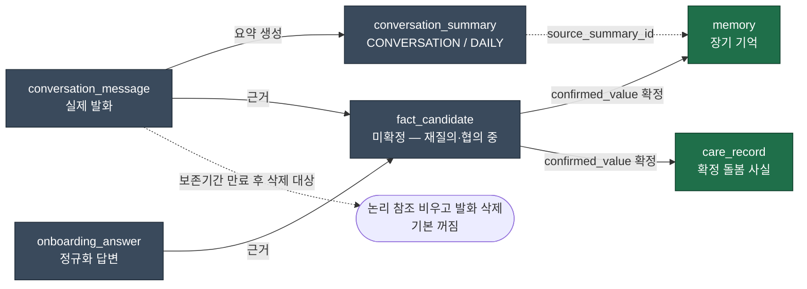
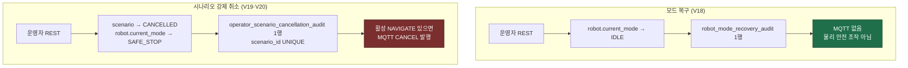

# BOMI MVP 데이터 모델

> PostgreSQL (pgvector 미사용) + 외부 벡터 스토어 Qdrant / 물리 테이블 19개·컬럼 276개 (Flyway V20 기준)
>
> 범위: 앱·로봇 온보딩, Raw 대화, 대화 요약, 장기 기억, 재실·일간 활동·주변 인물, 호출·산책, 민감정보 확인·PRIMARY 협의, 운영자 안전 조작 감사(모드 복구·시나리오 강제 취소)
>
> 제외: ERD Cloud 기록, durable Outbox·범용 audit log·범용 이벤트 원장
>
> 산출물 기준: 이 문서는 **Flyway V20**(19테이블·276컬럼)을 그린다. 컬럼정의서 XLSX·CSV 스냅샷은 아직 **V17**(17테이블·254컬럼)에 멈춰 있어, `robot_mode_recovery_audit`(V18·10컬럼)와 `operator_scenario_cancellation_audit`(V19·12컬럼)가 빠져 있다. 그래서 [`column-definition/scripts/validate-column-definition.py`](./column-definition/scripts/validate-column-definition.py) 는 현재 실패한다 — 아래 표가 그 차이의 전부다.
>
> | 무엇 | 멈춘 지점 | 테이블 | 컬럼 |
> | --- | --- | ---: | ---: |
> | Flyway (진짜 스키마) | V20 | 19 | 276 |
> | 이 문서 | V20 | 19 | 276 |
> | XLSX·CSV 스냅샷 | V17 | 17 | 254 |

## 1. 데이터 경계

| 계층 | 테이블 | 한 행의 의미 | 생명주기 |
| --- | --- | --- | --- |
| Raw | `conversation_message` | 실제 발화 한 번 | 최근·오늘·대화 전체는 조회 범위이며 보존기간 뒤 삭제 가능 |
| 요약 | `conversation_summary` | 대화 하나 또는 현지 날짜 하루의 요약 | 문맥 압축용, 재생성 시 새 버전 |
| 미확정 사실 | `fact_candidate` | 재질의·확인·협의 중인 사실 하나 | `confirmed_value` 확정 전 최종 반영 금지 |
| 장기 기억 | `memory` | 대화 없이 이해되는 개인화 사실 하나 | 장기 재사용, 확인·수명·공개 범위 적용 |
| 돌봄 사실 | `care_record` | 확정된 건강·복약·일정·관찰·알림 한 건 | 변경 시 새 행과 `parent_record_id` |
| 재실 이벤트 | `occupancy_event` | 문 통과·발화·하트비트 유실로 확정한 재실 변경 한 번 | 원인·방향·결과를 이벤트로 보존 |
| 일간 활동 집계 | `daily_activity_metric` | 어르신의 현지 날짜 하루 집계 | `(senior_id, metric_date)`당 하나, NULL은 0과 다름 |
| 주변 인물 | `known_person` | 어르신 주변 인물 한 명 | 이름·관계·생존 여부를 구조화해 대화 회피 정책에 사용 |
| 제어 요청 영수증 | `wake_word_trigger_receipt`, `walk_request_receipt` | 호출·산책 요청 하나의 최초 처리 결정 | QoS 1·HTTP 재시도와 Backend 재시작 뒤에도 최초 결정을 재생 |
| Robot mode 복구 감사 | `robot_mode_recovery_audit` | 인증된 운영자의 mode 복구 또는 멱등 no-op 한 건 | 누가 언제 어떤 Robot을 어느 mode에서 `IDLE`로 복구했는지 보존 |
| 시나리오 강제 취소 감사 | `operator_scenario_cancellation_audit` | 인증된 운영자가 진행 중 시나리오 하나를 강제 종료한 건 | 시나리오당 한 행(UNIQUE). 취소 직전의 시나리오 상태·로봇 mode 와 발행한 `CANCEL` commandId 를 보존 |

개인화·관계·돌봄 영역의 최종 조회 원본은 `app_user`, `care_relationship`, `memory`, `care_record`다. 재실·일간 활동·회피 인물은 각각 `occupancy_event`, `daily_activity_metric`, `known_person`을 원본으로 조회한다. Raw, 요약, 후보, 온보딩 답변은 근거·처리 데이터다.

같은 구분을 그림으로 두면 §4·§6·§8 을 읽기 전에 지도가 생긴다. 초록이 최종 조회 원본, 회색이 근거·처리 데이터다.



## 2. 최종 테이블

| 도입 | 테이블 |
| --- | --- |
| V1 | `app_user`, `care_relationship`, `robot`, `onboarding_session`, `onboarding_answer`, `scenario`, `conversation`, `conversation_message`, `conversation_summary`, `fact_candidate`, `memory`, `care_record` |
| V3 | `occupancy_event` |
| V4 | `daily_activity_metric` |
| V10 | `known_person` |
| V15 | `wake_word_trigger_receipt` |
| V16 | `walk_request_receipt` |
| V18 | `robot_mode_recovery_audit` |
| V19 | `operator_scenario_cancellation_audit` |

도입 버전을 함께 둔 이유는 "내가 아는 스키마가 어디까지인가"를 독자가 한눈에 맞추기 위해서다. 이 문서가 반복해 틀렸던 버전 표기도 이 표 한 곳으로 모인다.

이번 단계에서는 `memory_evidence`, `memory_retrieval_log`, `care_coordination_event`, `onboarding_question`, `outbox_message`, 범용 `audit_log`를 만들지 않는다. 운영자 감사 테이블 둘(`robot_mode_recovery_audit`, `operator_scenario_cancellation_audit`)은 각자 하나의 조작만 기록한다 — 조작이 늘 때마다 표를 하나 더 만드는 쪽을 택했고, 범용 감사 로그로 합치지 않는다. 컬럼이 달라야 불변식을 DB CHECK로 강제할 수 있기 때문이다. 최근 Raw·일간 Raw·최근 요약 전용 테이블도 만들지 않는다.

## 3. ERD

```mermaid
erDiagram
    APP_USER {
        UUID id PK
        VARCHAR user_type
        VARCHAR name
        VARCHAR email
        VARCHAR preferred_name
        JSONB conversation_preferences
        VARCHAR onboarding_status
        VARCHAR time_zone
        VARCHAR personalization_consent_status
        VARCHAR health_data_consent_status
        VARCHAR schedule_consent_status
        VARCHAR guardian_sharing_consent_status
        VARCHAR status
        TIMESTAMPTZ created_at
        TIMESTAMPTZ updated_at
        TIME quiet_hours_start
        TIME quiet_hours_end
        NUMERIC home_latitude
        NUMERIC home_longitude
        DATE birth_date
        TIME wake_time
        TIME sleep_time
        TEXT chronic_pain_area
        TEXT preferred_hospital
        TEXT home_address
    }
    CARE_RELATIONSHIP {
        UUID id PK
        UUID senior_id FK
        UUID guardian_id FK
        VARCHAR priority
        VARCHAR status
        TIMESTAMPTZ connected_at
        VARCHAR care_management_permission_status
        TIMESTAMPTZ care_management_permission_updated_at
        UUID care_management_permission_granted_by_user_id FK
    }
    ROBOT {
        UUID id PK
        UUID senior_id FK
        VARCHAR device_id
        VARCHAR current_mode
        NUMERIC ambient_temperature_c
        NUMERIC ambient_humidity_percent
        TIMESTAMPTZ ambient_observed_at
        BOOLEAN is_active
        VARCHAR occupancy_status
        TIMESTAMPTZ occupancy_observed_at
        TIMESTAMPTZ door_node_heartbeat_at
    }
    ONBOARDING_SESSION {
        UUID id PK
        UUID senior_id FK
        UUID robot_id FK
        VARCHAR question_set_version
        VARCHAR started_channel
        VARCHAR status
        VARCHAR current_question_code
        TIMESTAMPTZ started_at
        TIMESTAMPTZ completed_at
        TIMESTAMPTZ ended_at
    }
    ONBOARDING_ANSWER {
        UUID id PK
        UUID session_id FK
        VARCHAR question_code
        JSONB answer_value
        VARCHAR answered_channel
        UUID respondent_user_id FK
        UUID source_conversation_id FK
        UUID source_message_id FK
        VARCHAR verification_status
        UUID confirmed_by_user_id FK
        TIMESTAMPTZ answered_at
        TIMESTAMPTZ confirmed_at
        TIMESTAMPTZ updated_at
    }
    SCENARIO {
        UUID id PK
        UUID senior_id FK
        UUID robot_id FK
        VARCHAR external_event_id
        VARCHAR scenario_type
        VARCHAR final_status
        JSONB conversation_request
        VARCHAR active_navigation_command_id
        VARCHAR active_navigation_target
        JSONB trigger_context
        VARCHAR completion_result_code
        VARCHAR completion_reason_code
        VARCHAR follow_start_command_id
        VARCHAR follow_stop_command_id
        TIMESTAMPTZ follow_start_requested_at
        TIMESTAMPTZ following_started_at
        TIMESTAMPTZ follow_stop_requested_at
        VARCHAR last_follow_result_event_id
        VARCHAR last_follow_command_id
        VARCHAR last_follow_result_code
        VARCHAR last_follow_reason_code
        TIMESTAMPTZ last_follow_result_at
        TIMESTAMPTZ created_at
        TIMESTAMPTZ updated_at
    }
    CONVERSATION {
        UUID id PK
        UUID senior_id FK
        UUID scenario_id FK
        VARCHAR status
        TIMESTAMPTZ started_at
        TIMESTAMPTZ ended_at
        TIMESTAMPTZ raw_messages_expires_at
        BOOLEAN sealed
        VARCHAR start_command_id
        TIMESTAMPTZ ai_started_at
        VARCHAR end_outcome
        VARCHAR reason_code
    }
    CONVERSATION_MESSAGE {
        UUID id PK
        UUID conversation_id FK
        INTEGER sequence_no
        VARCHAR role
        TEXT content
        TIMESTAMPTZ occurred_at
        TIMESTAMPTZ created_at
        VARCHAR trigger_type
        VARCHAR priority
        BOOLEAN orientation_question
    }
    CONVERSATION_SUMMARY {
        UUID id PK
        UUID senior_id FK
        UUID conversation_id FK
        VARCHAR summary_type
        TIMESTAMPTZ period_started_at
        TIMESTAMPTZ period_ended_at
        TEXT content
        INTEGER source_message_count
        TIMESTAMPTZ generated_at
        UUID superseded_by_id FK
        VARCHAR embedding_status
        TIMESTAMPTZ embedding_synced_at
        VARCHAR embedding_model
    }
    FACT_CANDIDATE {
        UUID id PK
        UUID senior_id FK
        VARCHAR source_type
        UUID onboarding_answer_id FK
        UUID conversation_id FK
        UUID source_message_id FK
        VARCHAR target_domain
        VARCHAR fact_type
        VARCHAR operation
        UUID target_entity_id
        JSONB proposed_value
        JSONB confirmed_value
        VARCHAR_ARRAY missing_fields
        VARCHAR risk_level
        VARCHAR status
        VARCHAR clarification_reason
        INTEGER clarification_count
        UUID initiated_by_user_id FK
        UUID confirmed_by_user_id FK
        BOOLEAN requires_coordination
        VARCHAR coordination_status
        VARCHAR senior_position
        VARCHAR primary_guardian_decision
        UUID primary_guardian_id FK
        INTEGER contact_attempt_count
        TIMESTAMPTZ last_contact_attempted_at
        VARCHAR unreachable_reason
        TIMESTAMPTZ coordination_deadline_at
        TIMESTAMPTZ coordination_completed_at
        TEXT coordination_note
        UUID materialized_target_id
        TIMESTAMPTZ materialized_at
        TIMESTAMPTZ created_at
        TIMESTAMPTZ updated_at
        TIMESTAMPTZ confirmed_at
        TIMESTAMPTZ expires_at
    }
    MEMORY {
        UUID id PK
        UUID senior_id FK
        UUID source_conversation_id FK
        UUID superseded_by_id FK
        VARCHAR memory_type
        TEXT content
        VARCHAR verification_status
        VARCHAR lifecycle_status
        VARCHAR visibility
        VARCHAR embedding_status
        TIMESTAMPTZ embedding_synced_at
        VARCHAR embedding_model
        UUID source_summary_id FK
        UUID source_candidate_id FK
        VARCHAR_ARRAY keywords
        SMALLINT importance
        TIMESTAMPTZ first_observed_at
        TIMESTAMPTZ last_confirmed_at
        TIMESTAMPTZ last_used_at
    }
    CARE_RECORD {
        UUID id PK
        UUID senior_id FK
        UUID parent_record_id FK
        UUID scenario_id FK
        UUID source_conversation_id FK
        UUID source_message_id FK
        UUID recipient_guardian_id FK
        UUID created_by_user_id FK
        VARCHAR record_type
        VARCHAR status
        JSONB details
        JSONB recurrence
        UUID source_candidate_id FK
        VARCHAR notification_tier
        TIMESTAMPTZ occurred_at
    }
    OCCUPANCY_EVENT {
        UUID id PK
        UUID senior_id FK
        UUID robot_id FK
        VARCHAR direction
        VARCHAR source
        VARCHAR resulting_occupancy
        TIMESTAMPTZ occurred_at
        TIMESTAMPTZ reported_at
        TIMESTAMPTZ created_at
    }
    DAILY_ACTIVITY_METRIC {
        UUID id PK
        UUID senior_id FK
        DATE metric_date
        SMALLINT medication_taken_count
        SMALLINT medication_scheduled_count
        SMALLINT meal_count
        SMALLINT water_intake_count
        INTEGER sleep_minutes
        SMALLINT mood_score
        INTEGER senior_utterance_count
        INTEGER robot_utterance_count
        SMALLINT outing_count
        TIMESTAMPTZ created_at
        TIMESTAMPTZ updated_at
        SMALLINT orientation_question_repeat_count
        TIMESTAMPTZ summary_sent_at
    }
    KNOWN_PERSON {
        UUID id PK
        UUID senior_id FK
        UUID guardian_user_id FK
        VARCHAR display_name
        VARCHAR relationship
        BOOLEAN is_deceased
        VARCHAR deceased_note
        BOOLEAN lives_with
        VARCHAR contact_frequency
        TIMESTAMPTZ last_mentioned_at
        TIMESTAMPTZ created_at
        TIMESTAMPTZ updated_at
    }
    WAKE_WORD_TRIGGER_RECEIPT {
        VARCHAR event_id PK
        VARCHAR robot_device_id
        TIMESTAMPTZ occurred_at
        VARCHAR keyword
        DOUBLE confidence
        VARCHAR disposition
        UUID scenario_id
        TIMESTAMPTZ created_at
    }
    WALK_REQUEST_RECEIPT {
        UUID id PK
        VARCHAR ingress
        VARCHAR request_id
        VARCHAR robot_device_id
        VARCHAR action
        VARCHAR source
        UUID conversation_id
        TIMESTAMPTZ occurred_at
        VARCHAR disposition
        UUID scenario_id
        VARCHAR scenario_status
        TIMESTAMPTZ created_at
    }
    ROBOT_MODE_RECOVERY_AUDIT {
        UUID id PK
        UUID robot_id
        VARCHAR robot_device_id
        VARCHAR operator_id
        VARCHAR previous_mode
        VARCHAR target_mode
        VARCHAR disposition
        BOOLEAN physical_safety_confirmed
        VARCHAR reason
        TIMESTAMPTZ recovered_at
    }
    OPERATOR_SCENARIO_CANCELLATION_AUDIT {
        UUID id PK
        UUID robot_id
        VARCHAR robot_device_id
        UUID scenario_id
        VARCHAR operator_id
        VARCHAR previous_scenario_status
        VARCHAR previous_robot_mode
        VARCHAR target_navigation_command_id
        VARCHAR cancel_command_id
        BOOLEAN physical_safety_confirmed
        VARCHAR reason
        TIMESTAMPTZ cancelled_at
    }

    APP_USER ||--o{ CARE_RELATIONSHIP : senior
    APP_USER ||--o{ CARE_RELATIONSHIP : guardian
    APP_USER ||--o{ ROBOT : assigned
    APP_USER ||--o{ ONBOARDING_SESSION : participates
    ROBOT o|--o{ ONBOARDING_SESSION : starts
    ONBOARDING_SESSION ||--o{ ONBOARDING_ANSWER : contains
    APP_USER ||--o{ SCENARIO : owns
    ROBOT ||--o{ SCENARIO : executes
    APP_USER ||--o{ CONVERSATION : speaks
    SCENARIO o|--o{ CONVERSATION : opens
    CONVERSATION ||--o{ CONVERSATION_MESSAGE : contains
    CONVERSATION o|--o{ CONVERSATION_SUMMARY : summarized
    APP_USER ||--o{ CONVERSATION_SUMMARY : owns
    APP_USER ||--o{ FACT_CANDIDATE : owns
    ONBOARDING_ANSWER o|--o{ FACT_CANDIDATE : proposes
    CONVERSATION_MESSAGE o|--o{ FACT_CANDIDATE : evidences
    APP_USER ||--o{ MEMORY : owns
    CONVERSATION_SUMMARY o|--o{ MEMORY : supports
    FACT_CANDIDATE o|--o| MEMORY : materializes
    APP_USER ||--o{ CARE_RECORD : owns
    FACT_CANDIDATE o|--o| CARE_RECORD : materializes
    APP_USER ||--o{ OCCUPANCY_EVENT : owns
    ROBOT o|--o{ OCCUPANCY_EVENT : reports
    APP_USER ||--o{ DAILY_ACTIVITY_METRIC : owns
    APP_USER ||--o{ KNOWN_PERSON : describes
    APP_USER o|--o{ KNOWN_PERSON : guardian_link
    SCENARIO o|--o| WAKE_WORD_TRIGGER_RECEIPT : accepted_trigger
    SCENARIO o|--o{ WALK_REQUEST_RECEIPT : walk_request
    ROBOT ||--o{ ROBOT_MODE_RECOVERY_AUDIT : recovery_history
    ROBOT ||--o{ OPERATOR_SCENARIO_CANCELLATION_AUDIT : cancellation_history
    SCENARIO ||--o| OPERATOR_SCENARIO_CANCELLATION_AUDIT : cancelled_by_operator
```



Mermaid의 `VARCHAR_ARRAY`는 PostgreSQL `varchar(255)[]`, `DOUBLE`은 `double precision` 표현이다. V1~V20 어디에도 물리 FK가 없다. 따라서 도표의 `FK` 표시와 관계선은 raw UUID 컬럼의 논리 참조를 읽기 위한 표기이며, 참조 무결성·삭제 전파를 DB가 강제한다는 뜻이 아니다. `fact_candidate.target_entity_id`, `materialized_target_id`, `wake_word_trigger_receipt.scenario_id`, `walk_request_receipt.scenario_id`, `robot_mode_recovery_audit.robot_id`, `operator_scenario_cancellation_audit.robot_id`·`scenario_id`도 서비스가 검증하는 논리 참조다.

`robot_mode_recovery_audit`는 운영자가 `physicalSafetyConfirmed=true`와 사유를 제출하고 복구 정책을 통과한 요청만 추가형으로 기록한다. `target_mode`는 `IDLE`로 고정하며 `previous_mode`, 서버 설정의 `operator_id`, Robot의 UUID와 device ID, 처리 시각을 보존한다. DB CHECK는 물리 안전 확인, 비어 있지 않은 식별자·사유, `RECOVERED`/`NO_OP_ALREADY_IDLE`와 이전 mode의 조합을 강제하고, `(robot_id, recovered_at DESC)` 인덱스로 Robot별 최근 복구 이력을 조회한다. 이 API와 이력은 실제 E-stop 해제나 모터 정지를 대신하지 않으며 MQTT 명령을 만들지 않는다.

`operator_scenario_cancellation_audit`는 운영자가 진행 중인 시나리오 하나를 강제 종료한 건을 기록한다. 취소 직전 값(`previous_scenario_status`, `previous_robot_mode`)과 그때 발행한 `CANCEL`의 `cancel_command_id`를 남기고, `uq_operator_scenario_cancel_scenario`가 시나리오당 한 행만 허용한다. **복구와 달리 이쪽은 MQTT를 만든다** — 활성 NAVIGATE가 있으면 `CANCEL`을 발행하고 로봇 mode를 `SAFE_STOP`으로 바꾼다. 두 API를 "운영자 감사"로 뭉뚱그려 기억하면 안 되는 이유가 이 차이다.



V20은 이 표에 컬럼을 더하지 않는다. `target_navigation_command_id`와 `cancel_command_id`의 NOT NULL만 풀어, 주행이 아닌 시나리오(대화 중 등)도 취소할 수 있게 했다. 부작용이 하나 있다 — `cancel_command_id`의 UNIQUE는 그대로 남았고 PostgreSQL은 NULL을 서로 다른 값으로 보므로, 명령을 만들지 않은 취소 행은 여럿 존재할 수 있다.

두 API 모두 **실기 검증은 아직 없다.** 마이그레이션과 서비스 코드는 읽어 확인했지만, 운영자 시크릿이 설정된 환경에서 실제로 호출된 기록은 없다. 시크릿이 없으면 인증 필터가 503을 돌려준다.

`WAKE_WORD_CALL`의 `scenario.external_event_id`는 반드시 실제 MQTT `eventId`여야 한다. 이 타입에만 적용되는 CHECK와 부분 UNIQUE 인덱스로 null 및 중복을 막되, 다른 시나리오 타입의 `external_event_id` 전체를 전역 UNIQUE로 만들지는 않는다. 시나리오 시작은 `app_user` 시니어 행을 공용 잠금으로 사용하고, DB의 시니어별 활성 시나리오 부분 UNIQUE 인덱스를 최종 방어선으로 둔다.

`WALK`의 `scenario.external_event_id`는 실제 최초 START의 MQTT `eventId` 또는 Guardian REST `requestId`다. `trigger_context`에는 요청 출처를 재구성할 최소 문맥인 `ingress`(`MQTT`/`GUARDIAN_REST`), `source`(`VOICE`/`APP`), `occurredAt`, 선택 `conversationId`만 보존한다. `conversationId`는 Voice MQTT가 실제로 보낸 경우에만 있으며, Backend가 새 대화를 만들거나 산책 완료 조건으로 쓰지 않는다. 원본 음성·전체 STT·영상·tracking 데이터는 넣지 않는다.

START와 STOP은 같은 `scenario.id`를 유지하지만 `follow_start_command_id`와 `follow_stop_command_id`는 서로 달라야 한다. START 명령 ID는 `FOLLOW_RESULT(STOPPED)`가 Robot 자체 종료를 알릴 때도 쓰이므로 `STARTED` 이후 지우지 않는다. 정상 수신 경로에서는 상관 검증을 통과한 FOLLOW 결과의 event·command·result·reason·occurredAt만 `last_follow_*`에 구조화해 보존한다.

ACK 대기 또는 최대 산책 시간이 끝나 Backend watchdog이 종료하는 경우는 Robot 결과가 아닌 **Backend synthetic timeout**이다. Backend는 기존 STOP commandId를 재사용하거나 없으면 새로 만들어 `FOLLOW_STOP`을 best-effort 발행한 뒤, `last_follow_result_event_id="timeout-{scenarioId}"`, `last_follow_command_id=<stopCommandId>`, `last_follow_result_code="UNCHANGED"`, `last_follow_reason_code="EXECUTION_TIMEOUT"`, `last_follow_result_at=<Backend 판정 시각>`을 남기고 `TIMED_OUT`/`SAFE_STOP`으로 종료한다. `timeout-{scenarioId}`는 MQTT로 수신한 Robot `eventId`가 아니며, `UNCHANGED`도 Robot이 STOP 성공을 확인했다는 증거가 아니다.

`walk_request_receipt`는 `(ingress, request_id)`를 UNIQUE로 둔다. 따라서 동일 ingress의 HTTP/MQTT 재전송은 최초 수락·거절을 재생하지만, 우연히 같은 불투명 문자열을 사용한 `MQTT`와 `GUARDIAN_REST` 요청은 서로 충돌하지 않는다. Voice와 App이 서로 다른 ID로 동시에 START하는 경우에는 receipt만으로 직렬화됐다고 주장하지 않는다. 모든 시나리오가 공유하는 `app_user` 시니어 행 잠금과 시니어별 활성 Scenario 부분 UNIQUE 인덱스가 Scenario와 `FOLLOW_START` 하나만 허용한다.

## 4. 대화·요약·기억

`conversation`에는 발화 본문이 없다. `started_at`은 대화 시작, `ended_at`은 정상·실패·취소를 포함한 종료, `raw_messages_expires_at`은 Raw 삭제 가능 예정 시각이다.

`conversation_message`는 한 행이 한 실제 발화다. DB가 강제하는 것은 유일성 하나뿐이다.

```text
UNIQUE(conversation_id, sequence_no)   -- uq_conversation_message_seq (V1)
```

나머지 세 조회 패턴 — `(conversation_id, sequence_no)` 최근 N개, `(conversation_id, occurred_at)` 대화 내 시간 범위, `(occurred_at)` 현지 하루 — 은 **인덱스가 아직 없다.** 앞의 둘은 UNIQUE 제약이 만든 인덱스가 선두 컬럼을 공유해 어느 정도 덮지만, `occurred_at` 단독 조회는 전면 스캔이다. 컬럼정의서 `04_인덱스정의`가 이 셋을 "메시지 구현 시"·"일간 요약 구현 시"로 적어 둔 것은 계획이지 현재 상태가 아니다.

최근 N개는 대화·순번으로, 오늘 메시지는 `app_user.time_zone`으로 계산한 UTC 구간과 `occurred_at`으로 조회한다. 별도 최근·하루 Raw 테이블은 없다.

`conversation_summary`는 `CONVERSATION`, `DAILY`만 사용한다. 대화 종료 또는 무응답 후 대화 요약을 만들고, 사용자 현지 `[02:00, 06:00)` 창에 걸린 tick에서 전날 일간 요약을 만든다(매시 :20 cron이 돌며 창 안일 때만 실행). `(senior_id, summary_type, period_started_at, period_ended_at)` 유일성으로 중복을 막는다. `TIME_WINDOW`는 실제 긴 대화 문제가 확인될 때만 추가한다.

두 가지를 분명히 해 둔다. 첫째, **요약 스케줄러는 기본 배포에 존재하지 않는다** — `bomi.llm.enabled=true`일 때만 빈이 만들어지고 기본값은 `false`다. 둘째, **재생성 시 `superseded_by_id`를 잇는 운영 코드는 아직 없다.** 컬럼과 조회 필터(`supersededById IS NULL`)는 준비돼 있고 값을 쓰는 곳만 비어 있다 — 설계이지 동작이 아니다.

`memory.content`는 대화 없이 읽어도 이해되는 장기 사실 하나다. Raw나 요약 전문을 복사하지 않는다. `keywords` 정확 일치와 의미 검색을 혼합하며 다음을 먼저 필터링한다. 의미 검색 벡터는 이 DB에 없다(아래 §12). 선필터가 먼저이고 벡터 점수는 순위만 바꾼다 — 순서가 반대면 색인 당시의 낡은 공개범위로 답하게 된다.

```text
senior_id 일치
AND lifecycle_status = ACTIVE
AND verification_status != REJECTED
AND 요청자에게 visibility 허용
```

의미 유사도, `importance` 1~5, 최근 확인·사용 시각으로 재정렬하고 상위 3~10개만 문맥에 쓴다. 변경은 새 기억과 `superseded_by_id`로 표현하기로 했다 — 조회는 이미 이 규칙을 따르지만(`supersededById IS NULL` 필터) 값을 채우는 쓰기 경로는 아직 없다. `source_candidate_id` 유일성으로 중복 반영을 막는다.

Raw 삭제 전에는 필요한 요약 생성, 활성 후보 해소, 확정 사실의 최종 반영, 보존기간 만료를 모두 확인한다. `onboarding_answer.source_message_id`, `fact_candidate.source_message_id`, `care_record.source_message_id`는 `conversation_message.id`의 논리 참조다. V1~V20 어디에도 물리 FK와 `ON DELETE SET NULL`이 없으므로, Raw 삭제 시 근거 ID를 비우는 보존 규칙은 서비스·배치가 보장한다 — 발화 id를 먼저 모으고, 세 표의 참조를 UPDATE로 비우고, 그다음 발화를 지운다. 이 순서가 뒤집히면 근거를 잃은 행이 남는다.

이 삭제 잡도 기본 배포에는 없다(`purge-enabled` 기본 `false`). 즉 지금 운영 DB에서 보존기간이 지난 발화는 **삭제되지 않고 쌓인다.**

## 5. 앱·로봇 공용 온보딩

질문은 [`onboarding-question-set-v1.json`](./onboarding-question-set-v1.json)에서 버전 관리한다. 앱과 로봇은 같은 질문 코드, 필수 필드, 동의 게이트, 정규화 JSON, 최종 매핑을 쓴다.

- `started_channel`은 최초 채널, `answered_channel`은 실제 답변 채널이다.
- 앱 시작은 `robot_id=null` 가능, 로봇 시작은 `robot_id` 필수다.
- 양 채널은 같은 진행 중 세션을 이어갈 수 있다.
- `UNIQUE(senior_id) WHERE status='IN_PROGRESS'`
- `UNIQUE(session_id, question_code)`
- 세션 상태와 `app_user.onboarding_status`는 같은 트랜잭션으로 갱신한다.
- 필수 질문 확인 또는 계약상 허용된 동의 거절·건너뛰기 경로를 통과해야 `COMPLETED`다.

`onboarding_answer.answer_value`는 채널 독립 정규화 답변이다. 로봇은 근거 대화·메시지를 연결하고 앱은 둘이 없을 수 있다. 답변은 최종 조회 원본이 아니며 민감 중간값은 반영 뒤 무기한 중복 보존하지 않는다.

## 6. 후보·재질의·민감정보

`fact_candidate.status`는 후보 처리 단계이고 `coordination_status`는 협의 단계다. 둘을 같은 의미로 쓰지 않는다.

- `source_type=ONBOARDING_ANSWER`: `onboarding_answer_id` 필수
- `source_type=CONVERSATION_MESSAGE`: `conversation_id`, `source_message_id` 필수
- `missing_fields`에는 질문 문구가 아닌 필드명 저장
- 누락·모호·낮은 STT 신뢰도는 한 번에 한 필드만 재질의
- 민감정보는 값이 명확해도 전체 내용을 읽거나 화면에 보여 명시적으로 확인
- 침묵, 주제 변경, “글쎄”, “아마도”, 불명확 STT, 다른 후보 답변은 확인으로 인정하지 않음
- `confirmed_value`만 최종 반영
- 한 대화에서 활성 후보 하나만 질의
- 앱은 여러 후보 편집 가능하지만 제출·확정 순서를 결정적으로 처리
- 후보 행 잠금, `materialized_at`, 최종 테이블 `source_candidate_id` 유일성을 한 트랜잭션에서 확인

건강 상태, 알레르기, 신체 제약, 약 이름·용량·단위, 복약 날짜·시각·반복, 병원·개인 일정, 건강 관찰, 보호자 알림 대상·내용은 모두 민감정보다. 로봇은 복용량 계산이나 의학적 결정을 생성하지 않는다. 확인된 복약·일정은 반영 직후 서비스와 알림에 사용할 수 있다.

## 7. PRIMARY 보호자와 충돌

민감정보 대리 확인·등록·수정은 다음을 모두 만족하는 보호자 한 명만 가능하다.

```text
care_relationship.status = ACTIVE
AND priority = PRIMARY
AND care_management_permission_status = GRANTED
```

SECONDARY는 공유 허용 범위에서 조회만 가능하다. 동의는 시니어에게 묻고 PRIMARY가 없으면 `NOT_ASKED`다. PRIMARY 변경 시 기존 권한을 자동 승계하지 않는다. 한 시니어의 활성 PRIMARY는 하나다.

시니어와 PRIMARY 값이 충돌하면 즉시 덮어쓰지 않는다. 기존값·신규값을 알리고 시니어 입장을 확인하며 전화 또는 직접 협의를 유도한다. 시스템은 실제 통화를 증명하지 않고 양쪽 디지털 입장, 연락 시도, 사유, 최종 결정을 기록한다.

- 합의: 합의값 반영
- 시니어 반대: `DISAGREED` 보존 → PRIMARY 최종값 선택 → 2차 책임 확인 → `GUARDIAN_OVERRIDE_CONFIRMED` → 반영 → 시니어 안내
- 연락 불가: 횟수·마지막 시각·사유·`UNREACHABLE` 기록 → PRIMARY 2차 확인 → 반영 → 이후 시니어 안내

PRIMARY 우선은 협의·책임 확인을 완료한 최종 결정의 우선순위이며 조용한 즉시 덮어쓰기가 아니다.

## 8. 돌봄 기록

`care_record.status`는 `ACTIVE`, `COMPLETED`, `CANCELLED`, `SUPERSEDED`다. 확정값 변경은 기존 행을 갱신하지 않고 새 행과 `parent_record_id`로 연결한다. 이전 행은 `SUPERSEDED`가 된다. `source_candidate_id`는 유일하여 같은 후보의 중복 생성이 없다.

### 발생 시각 (`occurred_at`, V7 / S15P11E102-230)

`care_record.occurred_at`은 그 기록이 시간축 위에 놓이는 지점입니다. 일어난 일이면 일어난 시각, 예정된 일이면 예정 시각입니다. 축이 하나여야 범위 질의가 성립합니다.

| record_type | `occurred_at` |
| --- | --- |
| `MEDICATION_TAKEN` | 매칭된 복약 슬롯 시각. 실제 대답한 순간은 `details.respondedAt`에 그대로 둡니다 |
| `APPOINTMENT`, `PERSONAL_SCHEDULE` | 시작 시각 |
| `GUARDIAN_ALERT` | 알림이 발생한 시각(로봇이 관찰한 시각. 서버 도착 시각이 아닙니다) |
| `*_OBSERVATION` | 관찰한 시각 |
| `MEDICATION` | NULL. 처방 자체는 시점이 아닙니다 |
| `MEDICATION_SCHEDULE` | NULL. 반복 규칙이라 한 점이 아니고, 전개는 `recurrence`가 담당합니다 |

NULL은 두 가지를 뜻합니다 — "모른다", 그리고 "시점이 없다". 그래서 NOT NULL로 두지 않습니다. 모르는 시각을 마이그레이션 시각으로 채우면 오래된 알림이 보호자 화면 맨 위에 뜨고, 보호자는 그것을 새 알림으로 읽습니다. `daily_activity_metric`의 "모르는 것과 0은 다르다"와 같은 원칙입니다.

V7 이전에는 시각이 `details` 안에 네 가지 규약으로 흩어져 있었습니다(`scheduledAt`, `startsAt`, `ts`, `metricDate`). 스키마가 어느 것도 강제하지 않았기 때문에, 같은 뜻의 두 규약이 조용히 어긋나 있던 곳이 실제로 있었습니다. 파생 규칙은 `CareRecordTime` 한 곳에 있고 V7의 `COALESCE`와 같은 순서입니다 — 한쪽만 바꾸면 배포 날짜에 이음매가 생깁니다.

### 재실 이벤트와 일간 활동 (`occupancy_event` V3, `daily_activity_metric` V4·V6)

`occupancy_event`는 재실 변경 한 번을 추가형 이력으로 보존한다. `direction`은 `IN`/`OUT` 또는 NULL, `source`는 `DOOR_SENSOR`/`SPEECH`/`HEARTBEAT_TIMEOUT`, `resulting_occupancy`는 `HOME`/`AWAY`/`UNKNOWN`이다. PK는 `id`, 명시 인덱스는 `(senior_id, occurred_at)`의 `idx_occupancy_event_senior_occurred`다. `senior_id`와 선택 `robot_id`는 논리 참조이고, V1~V20 어디에도 FK·UNIQUE·CHECK·DB default는 없다. 코드 enum은 문자열로 저장하지만 DB CHECK로 사전을 강제하지는 않는다.

`daily_activity_metric`은 `(senior_id, metric_date)` 하루의 복약·식사·물·수면·기분·대화·외출·지남력 반복 횟수와 요약 발송 시각을 집계한다. PK는 `id`, `uq_daily_activity_metric_day(senior_id, metric_date)`로 하루 한 행을 보장하며 별도 명시 인덱스는 없다. 지표 컬럼의 NULL은 0이 아니라 “측정하지 못함”이다. enum·물리 FK·CHECK·DB default는 없다.

### 회피 대상 (`known_person`, V10 / S15P11E102-260)

`known_person`은 어르신 주변 인물(가족·지인) 한 명을 구조화해 담는 표입니다. 예전에는 `app_user.conversation_preferences`의 `avoid_topics`라는 자유 문자열 목록 하나가 회피 대상을 표현하는 유일한 방법이었는데, 이 목록을 채우는 코드가 저장소 어디에도 없어 한 번도 작동한 적이 없었습니다. 이름·관계·생존 여부를 컬럼으로 분리하면 로봇은 살아 있는 사람 이야기는 자연스럽게 잇고, 돌아가신 분은 결정론적으로 피할 수 있습니다.

PK는 `id`, 명시 인덱스는 `idx_known_person_senior(senior_id)`다. `senior_id`와 선택 `guardian_user_id`는 논리 참조이며 물리 FK·UNIQUE·CHECK·DB default는 없다. `relationship`과 `contact_frequency`는 enum이 아닌 자유 문자열이다.

`is_deceased`는 세 값을 구분합니다.

| 값 | 뜻 | 대화 문맥 API의 처리 |
| --- | --- | --- |
| `TRUE` | 돌아가셨다 | 회피 대상. `avoidTopics`에 금지문으로 실림 |
| `FALSE` | 생존이 확인됨 | 회피 대상 아님. 자연스러운 이어짐에 쓸 수 있음 |
| `NULL` | 모른다 | `TRUE`와 동일하게 회피 대상 — "모르니까 언급해도 된다"는 이 제품에서 가장 위험한 판단이다 |

`ConversationContextService`가 `avoidTopics`를 만들 때는 이름을 그대로 노출하되("OO 이야기는 로봇이 먼저 꺼내지 않습니다"), `deceased_note`(보호자용 내부 메모, 예: "1년 전 지병으로 별세")는 절대 프롬프트에 실리지 않습니다. 회피 문구는 정보가 아니라 금지문으로만 전달됩니다. 이 표는 `memory`로 옮기지 않습니다 — 벡터 검색 대상이 되는 순간 확률적 필터가 되어 결정론적 강제 원칙을 어깁니다.

`conversation_preferences.avoid_topics` jsonb 경로는 호환용으로만 남습니다: 어떤 시니어에게 `known_person` 행이 하나도 없을 때만 폴백으로 읽히고, 있으면 무시됩니다.

## 9. 대화 문맥 조립

1. 현재 발화
2. 현재 대화 최근 Raw 6~12개
3. 현재 대화 요약
4. 최근성·관련성이 높은 요약
5. 필터를 통과한 장기 기억 3~10개
6. 질문과 관련되고 동의된 돌봄 기록

모든 일간 요약과 모든 기억을 매번 넣지 않는다.

## 10. 코드 사전

| 대상 | 허용 값 |
| --- | --- |
| `scenario.scenario_type` | `HOMECOMING`, `WELLNESS_CHECK`, `MEDICATION_REMINDER`, `WAKE_WORD_CALL`, `WALK`, `FALL_RESPONSE`, `MANUAL_INTERACTION` |
| `scenario.final_status` | `RECEIVED`, `NAVIGATING`, `STARTING_FOLLOW`, `FOLLOWING`, `STOPPING_FOLLOW`, `MOVING_TO_ENTRANCE`, `CHECKING_INTERACTION`, `CONVERSING`, `RETURN_DECISION`, `RETURNING_TO_DEFAULT`, `COMPLETED`, `FAILED`, `CANCELLED`, `TIMED_OUT` |
| `robot.occupancy_status`, `occupancy_event.resulting_occupancy` | `HOME`, `AWAY`, `UNKNOWN` |
| `occupancy_event.direction` | `IN`, `OUT` (문 통과가 아닌 이벤트는 NULL) |
| `occupancy_event.source` | `DOOR_SENSOR`, `SPEECH`, `HEARTBEAT_TIMEOUT` |
| `wake_word_trigger_receipt.disposition` | `RECEIVED`, `ACCEPTED`, `REJECTED_UNKNOWN_ROBOT`, `REJECTED_INACTIVE_ROBOT`, `REJECTED_UNASSIGNED_ROBOT`, `REJECTED_SAFE_STOP`, `REJECTED_ACTIVE_SCENARIO`, `REJECTED_BUSY_MODE` |
| `walk_request_receipt.ingress` | `MQTT`, `GUARDIAN_REST` |
| `walk_request_receipt.action` | `START`, `STOP` |
| `walk_request_receipt.source` | `VOICE`, `APP` |
| `walk_request_receipt.disposition` | `RECEIVED`, `ACCEPTED`, `NO_OP_ALREADY_STOPPING`, `REJECTED_NO_ACTIVE_WALK`, `REJECTED_UNKNOWN_ROBOT`, `REJECTED_INACTIVE_ROBOT`, `REJECTED_UNASSIGNED_ROBOT`, `REJECTED_SAFE_STOP`, `REJECTED_REST_GUARD`, `REJECTED_ACTIVE_SCENARIO`, `REJECTED_BUSY_MODE`, `REJECTED_REQUEST_ID_REUSED`, `REJECTED_MQTT_UNAVAILABLE` |
| `robot.current_mode` | `IDLE`, `SCENARIO_ACTIVE`, `REST_GUARD`, `SAFE_STOP` |
| `scenario.active_navigation_target` | `LIVING_ROOM`, `ENTRANCE`, `DEFAULT` (V14 CHECK) |
| `scenario.last_follow_result_code` | `STARTED`, `STOPPED`, `UNCHANGED` |
| `scenario.last_follow_reason_code` | `PERSON_LOST`, `COMMAND_EXPIRED`, `EXECUTION_TIMEOUT`, `SAFETY_STOP`, `INTERNAL_ERROR` |
| `robot_mode_recovery_audit.disposition` | `RECOVERED`, `NO_OP_ALREADY_IDLE` (DB에 저장되는 값. 앱 enum에는 거절 사유 7개가 더 있고 그 경우 행을 만들지 않는다) |
| `robot_mode_recovery_audit.target_mode` | `IDLE` |
| `operator_scenario_cancellation_audit` | disposition 컬럼 **없음**. 실제로 취소가 일어난 건만 행이 되고(no-op·거절은 행을 만들지 않는다) 결과값을 따로 적지 않는다 |
| `conversation.status` | `OPEN`, `COMPLETED`, `FAILED`, `CANCELLED` |
| `conversation_message.role` | `SENIOR`, `ROBOT` |
| `conversation_summary.summary_type` | `CONVERSATION`, `DAILY` |
| `onboarding_session.started_channel` | `APP`, `ROBOT` |
| `onboarding_session.status` | `IN_PROGRESS`, `COMPLETED`, `DECLINED`, `CANCELLED`, `EXPIRED` |
| `onboarding_answer.answered_channel` | `APP`, `ROBOT` |
| `fact_candidate.source_type` | `ONBOARDING_ANSWER`, `CONVERSATION_MESSAGE` |
| `fact_candidate.target_domain` | `PROFILE`, `CARE_RELATIONSHIP`, `MEMORY`, `CARE_RECORD` |
| `fact_candidate.operation` | `CREATE`, `UPDATE`, `CANCEL` |
| `fact_candidate.risk_level` | `NORMAL`, `SENSITIVE`, `HIGH` |
| `fact_candidate.status` | `CAPTURED`, `NEEDS_CLARIFICATION`, `NEEDS_CONFIRMATION`, `COORDINATION_REQUIRED`, `CONFIRMED`, `MATERIALIZED`, `REJECTED`, `EXPIRED`, `CANCELLED_BY_SENIOR` |
| `fact_candidate.clarification_reason` | `MISSING_REQUIRED_FIELD`, `AMBIGUOUS_VALUE`, `LOW_RECOGNITION_CONFIDENCE`, `CONFLICT_WITH_EXISTING_DATA`, `SENSITIVE_INFORMATION_CONFIRMATION` |
| `fact_candidate.coordination_status` | `NOT_REQUIRED`, `COORDINATION_REQUIRED`, `WAITING_PRIMARY_GUARDIAN`, `WAITING_SENIOR`, `AGREED`, `DISAGREED`, `SENIOR_UNREACHABLE`, `GUARDIAN_OVERRIDE_CONFIRMED`, `COMPLETED` |
| `fact_candidate.senior_position` | `NOT_REQUESTED`, `PENDING`, `AGREED`, `DISAGREED`, `UNREACHABLE` |
| `fact_candidate.primary_guardian_decision` | `PENDING`, `CONFIRMED_EXISTING_VALUE`, `CONFIRMED_PROPOSED_VALUE`, `REVISED_VALUE`, `CANCELLED_CHANGE` |
| `fact_candidate.unreachable_reason` | `NO_RESPONSE`, `PHONE_UNAVAILABLE`, `TEMPORARY_HEALTH_CONDITION`, `COMMUNICATION_DIFFICULTY`, `OTHER` |
| `care_relationship.care_management_permission_status` | `NOT_ASKED`, `GRANTED`, `DENIED`, `REVOKED` |
| `care_record.status` | `ACTIVE`, `COMPLETED`, `CANCELLED`, `SUPERSEDED` |

Excel `07_코드정의`는 V17까지의 코드값을 담고 있다. 그 뒤에 생긴 값 — `robot_mode_recovery_audit`의 `disposition`·`target_mode`(V18) — 은 이 표와 해당 migration의 CHECK가 유일한 기준이다. 컬럼정의서 동기화는 아직 밀려 있고, 미룰수록 두 문서 중 어느 쪽이 최신인지 판단하는 비용이 커진다. 동기화 상태는 [`column-definition/scripts/validate-column-definition.py`](./column-definition/scripts/validate-column-definition.py) 실행으로 즉시 확인할 수 있다(현재 실패).

## 11. 33개 시나리오 검증

이 표는 2026-07 모델 확정 시점의 검증 기록이며, 그 뒤 추가된 V15~V20 시나리오(호출·산책·운영자 조작)는 포함하지 않는다.

| # | 시나리오 | 모델 근거 |
| ---: | --- | --- |
| 1 | 앱 시작·완료 | `started_channel=APP`, 답변 APP, 필수 질문 후 완료 |
| 2 | 로봇 시작·완료 | `started_channel=ROBOT`, 로봇·Raw 근거, 동일 완료 규칙 |
| 3 | 앱→로봇 재개 | 최초 채널 유지, 답변 채널만 ROBOT |
| 4 | 로봇→앱 재개 | 같은 IN_PROGRESS 세션·질문 버전 재사용 |
| 5 | PRIMARY 없음 | 권한 질문은 반영하지 않고 `NOT_ASKED` |
| 6 | 시니어가 PRIMARY 허용 | ACTIVE PRIMARY 관계에 부여자·시각·GRANTED |
| 7 | 무권한 보호자 제출 | 응답자의 PRIMARY·GRANTED 검증에서 거부 |
| 8 | SECONDARY 확인 시도 | 조회와 변경 권한 분리로 거부 |
| 9 | PRIMARY 변경 | 기존 관리 권한 승계 금지, 재동의 |
| 10 | 동의 거절·철회 | 질문 선행 동의와 최종 반영 게이트 차단 |
| 11 | 복약 용량 누락 | `missing_fields=[dose]`, 한 필드 재질의 |
| 12 | “내일부터” | 시간대로 절대 날짜 후보 변환 후 확인 |
| 13 | 낮은 STT 신뢰도 | 관련 clarification reason, 확정 금지 |
| 14 | 필수값 완전 | 민감정보 전체 재확인 |
| 15 | 시니어 확인 비충돌 | 즉시 새 care record 반영·PRIMARY 알림 |
| 16 | PRIMARY 확인 비충돌 | 권한 검증 후 즉시 반영·시니어 안내 |
| 17 | 값 충돌 | 후보·협의 상태를 COORDINATION_REQUIRED |
| 18 | 합의 | 양쪽 입장과 합의값을 기록해 반영 |
| 19 | 시니어 반대 | DISAGREED 보존, PRIMARY 2차 책임 확인 후 반영 |
| 20 | 시니어 연락 불가 | 시도·사유·UNREACHABLE 보존 후 PRIMARY 재확인 |
| 21 | 권한 REVOKED | 변경·확정 게이트 차단 |
| 22 | 요청 중복 | 후보 잠금·materialized_at·source_candidate 유일성 |
| 23 | 최근 N개 | 대화·순번 인덱스 |
| 24 | 현지 하루 | 시간대 UTC 구간과 occurred_at |
| 25 | 대화 종료 요약 | 종료·무응답 후 CONVERSATION |
| 26 | 일간 요약 1회 | 현지 새벽 2~3시와 기간 유일성 |
| 27 | 요약 재생성 | 새 행과 superseded_by_id |
| 28 | 장기 사실 반영 | 후보에서 독립 사실 memory 생성 |
| 29 | 선호 변경 | 새 기억과 superseded_by_id |
| 30 | 비활성 기억 제외 | 수명·확인·공개 선필터 |
| 31 | Raw 삭제 후 최종 보존 | 삭제 트랜잭션이 세 논리 참조를 비운 뒤 발화 삭제 (물리 FK·SET NULL 없음) |
| 32 | 요약·반영 전 삭제 방지 | Raw 삭제 네 선행조건 |
| 33 | 문맥 과적재 방지 | 관련 요약 선별·기억 3~10개 |

## 12. 의미 검색 벡터는 이 DB에 없습니다 (S15P11E102-218)

`memory.embedding`과 `conversation_summary.embedding` **컬럼은 만들지 않았습니다.** ERD 초안에 `VECTOR embedding`으로 있던 자리는 V5의 부기 컬럼 세 개로 대체되었습니다.

**왜 (실측)** — Upstage `solar-embedding-1-large`의 출력은 4096차원입니다. pgvector 0.8.5가 인덱싱할 수 있는 상한은 `vector` 2,000 / `halfvec` 4,000차원입니다. 즉 4096차원은 `halfvec`으로도 인덱스를 만들 수 없고, 남는 선택지는 인덱스 없는 순차 스캔뿐입니다. 한국어 품질 때문에 Upstage를 포기할 수 없다는 판단이라 저장소를 바꿨습니다.

**어디로 갔는가** — Qdrant(`qdrant/qdrant:v1.18.3`) 컬렉션 두 개, 각 4096차원 코사인 HNSW입니다.

| | PostgreSQL | Qdrant |
| --- | --- | --- |
| 역할 | **권위** | 파생 인덱스 |
| 담는 것 | 내용, 공개범위, 수명, 확인 상태 | 벡터 + `seniorId` payload |
| 잃으면 | 복구 불가 | 부기 컬럼으로 전량 재색인 |
| 백업 | 필요 | **하지 않습니다** |

Qdrant 볼륨을 백업하지 않는 것은 게으름이 아닙니다. 낡은 payload가 되살아나면 어르신이 거두어들인 기억이 다시 검색 대상이 됩니다.

**부기 컬럼 세 개** (`memory`, `conversation_summary` 공통, V5)

| 컬럼 | 의미 |
| --- | --- |
| `embedding_status` | `PENDING` / `SYNCED` / `STALE` / `FAILED` |
| `embedding_synced_at` | 마지막으로 반영된 시각 |
| `embedding_model` | 그 벡터를 만든 모델. 모델이 바뀌면 기존 벡터는 전부 무효입니다 — 벡터 공간이 달라서 유사도 숫자가 평범해 보이지만 아무것도 뜻하지 않습니다 |

**검색 순서 (이 순서가 프라이버시 방어선입니다)**

```text
Qdrant (senior_id 필터 + 유사도) -> 후보 id
  -> PostgreSQL 권위 재검증
     (lifecycle_status=ACTIVE, verification_status!=REJECTED, visibility 허용)
  -> 유사도 x importance x 최근성 재정렬 -> 상위 3~10
```

벡터 스토어의 hit는 **행을 추가하지 못합니다.** 순위만 바꿉니다. Qdrant payload는 색인 시점의 사본이라 임의로 낡을 수 있고, 공개범위가 바뀐 기억이 그 사본을 근거로 보호자에게 새어나가면 안 됩니다. 재검증은 성능 낭비가 아니라 방어 계층입니다.

## 13. 진짜 TBD와 FUTURE

- 반복 연락·협의가 별도 생명주기를 요구할 때 `care_coordination_event`
- 긴 대화 중간 압축 문제가 확인될 때 `TIME_WINDOW`
- 무배포 질문 편집이 필요할 때 `onboarding_question`
- 호출·산책 외 메시지의 재시작 안전 멱등이 필요할 때 범용 수신 원장
- DB 커밋과 MQTT 발행을 하나의 전달 생명주기로 묶는 durable Outbox
- 다른 운영 변경까지 감사해야 할 때 범용 `audit_log`
