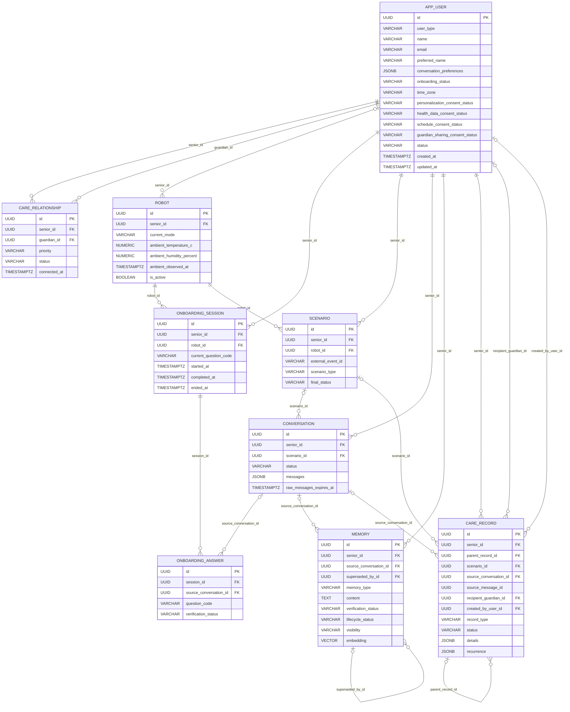

# BOMI 최소 ERD

## 1. 이 문서의 역할

이 문서는 로봇 연동을 시작하기 위해 당장 필요한 데이터 경계를 정의한다.

- 물리 테이블은 9개, 컬럼은 74개만 둔다.
- ERD의 ENUM 박스는 테이블이 아니라 `VARCHAR` 컬럼에 들어갈 코드 사전이다.
- 센서 원시 스트림, 음성·영상 원본, MQTT 송수신 로그는 이 데이터베이스에 쌓지 않는다.
- 아직 확정하지 않은 규칙은 임의로 채우지 않고 `TBD`로 남긴다.
- 컬럼별 상세한 사용 맥락과 예시는 `column-definition/BOMI_컬럼정의서.xlsx`를 기준으로 한다.

이 모델의 우선순위는 완전한 장기 모델보다 다음 한 사이클을 실제로 연결하는 것이다.

```text
로봇 이벤트
  → 시나리오 시작
  → 대화
  → 필요한 기억·돌봄 기록 추출
  → 다음 상호작용에 사용
```

## 2. 왜 9개만 남겼는가

| 테이블 | 한 행이 의미하는 것 | 지금 필요한 이유 |
|---|---|---|
| `app_user` | 한 명의 시니어 또는 보호자 | 사람과 동의 상태를 식별해야 한다. |
| `care_relationship` | 시니어와 보호자의 한 연결 | 보호자 공유 범위와 우선순위는 전역 역할만으로 판단할 수 없다. |
| `robot` | 한 로봇의 현재 배정·모드·최신 환경값 | 로봇 통신의 주체와 지금 사용할 환경 스냅샷이 필요하다. |
| `onboarding_session` | 한 번의 온보딩 진행 | 중단 후 이어 묻기와 완료 여부를 알아야 한다. |
| `onboarding_answer` | 한 세션에서 확인한 질문 한 건 | 어떤 질문이 확인되었는지 최소한의 진행 근거가 필요하다. |
| `scenario` | 로봇 행동 흐름 한 번 | 외부 이벤트와 최종 진행 상태를 연결해야 한다. |
| `conversation` | 한 대화 묶음 | 온보딩·시나리오 중 오간 발화를 보존해야 한다. |
| `memory` | 다음 대화에 재사용할 사실 한 건 | 개인화 정보는 검증·수명·공개 범위를 따로 관리해야 한다. |
| `care_record` | 건강·일정·관찰·알림 기록 한 건 | 돌봄에 필요한 구조화 결과와 반복 정보를 보존해야 한다. |

다음 항목은 중요하지 않아서 뺀 것이 아니다. 첫 로봇 연동 전에 별도 테이블까지 만들 근거가 부족해 이번 물리 모델에서 제외했다.

- MQTT 수신 이력과 중복 제거 원장
- 명령 Outbox와 전달 재시도
- 감사 로그
- 원문 파일·미디어 저장소
- 모델 실행·프롬프트·추출 결과 추적
- 세분화된 동의 이력

이 항목들은 장애 복구, 감사, 운영 규모가 요구하는 시점에 FUTURE 확장으로 추가한다.

## 3. 관계도



`care_record.source_message_id`는 `conversation.messages` 배열 안의 메시지 ID를 가리키는 논리 참조다. 별도 메시지 테이블이 없으므로 물리 FK를 만들 수 없다.

## 4. 컬럼 정의

### 4.1 `app_user`

사람의 최종 프로필과 목적별 동의의 현재 상태를 보관한다.

| 컬럼 | 타입 | 의미 |
|---|---|---|
| `id` | `UUID` | 내부에서 사용하는 사용자 식별자 |
| `user_type` | `VARCHAR(30)` | 시니어 또는 보호자 구분 |
| `name` | `VARCHAR(100)` | 등록 이름 |
| `email` | `VARCHAR(255)` | 로그인·연락에 사용하는 이메일 |
| `preferred_name` | `VARCHAR(100)` | 로봇이 부를 때 우선 사용하는 이름 |
| `conversation_preferences` | `JSONB` | 말하기 속도, 음량 등 대화 방식 선호 |
| `onboarding_status` | `VARCHAR(30)` | 현재 온보딩 진행 요약 |
| `time_zone` | `VARCHAR(50)` | 일정 날짜를 해석할 IANA 시간대 |
| `personalization_consent_status` | `VARCHAR(30)` | 개인화 정보 사용 동의 |
| `health_data_consent_status` | `VARCHAR(30)` | 건강 정보 처리 동의 |
| `schedule_consent_status` | `VARCHAR(30)` | 일정 정보 처리 동의 |
| `guardian_sharing_consent_status` | `VARCHAR(30)` | 보호자 공유 동의 |
| `status` | `VARCHAR(30)` | 계정 사용 상태 |
| `created_at` | `TIMESTAMPTZ` | 생성 시각 |
| `updated_at` | `TIMESTAMPTZ` | 마지막 변경 시각 |

`onboarding_status`는 세션 전체 이력을 대체하지 않는다. 앱 화면과 서비스 분기를 위한 현재 상태 요약이다.

### 4.2 `care_relationship`

한 시니어에게 어떤 보호자가 연결되어 있고 현재 공유 대상이 될 수 있는지 표현한다.

| 컬럼 | 타입 | 의미 |
|---|---|---|
| `id` | `UUID` | 관계 식별자 |
| `senior_id` | `UUID` | 시니어 사용자 |
| `guardian_id` | `UUID` | 보호자 사용자 |
| `priority` | `VARCHAR(30)` | 주 보호자·보조 보호자 우선순위 |
| `status` | `VARCHAR(30)` | 초대·활성·종료 상태 |
| `connected_at` | `TIMESTAMPTZ` | 실제 연결이 성립한 시각 |

`user_type=GUARDIAN`만으로 특정 시니어의 정보를 볼 수 없다. 공유 판단에는 활성 관계, 관계 우선순위, 사용자 동의, `memory.visibility`를 함께 사용한다.

### 4.3 `robot`

로봇 한 대의 현재 배정과 제어 모드, 마지막으로 관측한 환경 스냅샷을 보관한다.

| 컬럼 | 타입 | 의미 |
|---|---|---|
| `id` | `UUID` | 로봇 식별자이자 통신 `robotId`의 기준값 |
| `senior_id` | `UUID` | 현재 배정된 시니어 |
| `current_mode` | `VARCHAR(30)` | 현재 제어 모드 |
| `ambient_temperature_c` | `NUMERIC(5,2)` | 마지막 실내 온도(℃) |
| `ambient_humidity_percent` | `NUMERIC(5,2)` | 마지막 실내 습도(%) |
| `ambient_observed_at` | `TIMESTAMPTZ` | 두 환경값을 관측한 시각 |
| `is_active` | `BOOLEAN` | 등록상 사용 가능한 로봇인지 여부 |

환경 컬럼은 시계열 센서 저장소가 아니라 최신값 캐시다. `is_active`도 네트워크 접속 여부와 같지 않다.

### 4.4 `onboarding_session`

한 번 시작한 온보딩의 진행 위치와 종료 시각을 보관한다.

| 컬럼 | 타입 | 의미 |
|---|---|---|
| `id` | `UUID` | 온보딩 세션 식별자 |
| `senior_id` | `UUID` | 온보딩 대상 시니어 |
| `robot_id` | `UUID` | 질문을 진행한 로봇 |
| `current_question_code` | `VARCHAR(100)` | 다음 재개 지점을 찾기 위한 현재 질문 코드 |
| `started_at` | `TIMESTAMPTZ` | 시작 시각 |
| `completed_at` | `TIMESTAMPTZ` | 필수 질문을 정상 완료한 시각 |
| `ended_at` | `TIMESTAMPTZ` | 완료·거절·중단을 포함해 세션이 끝난 시각 |

`completed_at`과 `ended_at`을 구분하면 정상 완료와 중도 종료를 같은 값으로 오해하지 않는다.

### 4.5 `onboarding_answer`

질문 한 건이 어느 대화에서 수집되었고 어느 수준으로 확인되었는지 기록한다.

| 컬럼 | 타입 | 의미 |
|---|---|---|
| `id` | `UUID` | 답변 확인 기록 식별자 |
| `session_id` | `UUID` | 소속 온보딩 세션 |
| `source_conversation_id` | `UUID` | 실제 답변 발화가 있는 대화 |
| `question_code` | `VARCHAR(100)` | 질문 사전의 안정적인 코드 |
| `verification_status` | `VARCHAR(30)` | 답변 확인 상태 |

이 테이블에는 답변 원문과 최종 프로필 값을 중복 저장하지 않는다. 원문은 `conversation.messages`, 최종 사용값은 `app_user`, `memory`, `care_record`에 둔다.

### 4.6 `scenario`

로봇이 하나의 외부 사건을 받아 시작한 행동 흐름을 나타낸다.

| 컬럼 | 타입 | 의미 |
|---|---|---|
| `id` | `UUID` | 내부 시나리오 식별자 |
| `senior_id` | `UUID` | 대상 시니어 |
| `robot_id` | `UUID` | 수행 로봇 |
| `external_event_id` | `VARCHAR(255)` | 시나리오를 시작시킨 외부 이벤트 ID |
| `scenario_type` | `VARCHAR(50)` | 귀가·낙상 대응·수동 상호작용 구분 |
| `final_status` | `VARCHAR(255)` | 시나리오의 현재 진행 상태 또는 최종 결과 |

컬럼명은 `final_status`지만 코드 목록에는 진행 중 상태도 포함된다. 이번 ERD에서는 이름을 그대로 유지하고, 구현에서 “종료 상태만 저장한다”고 오해하지 않도록 한다.

### 4.7 `conversation`

시니어와 로봇 사이의 한 대화 묶음과 발화 배열을 보관한다.

| 컬럼 | 타입 | 의미 |
|---|---|---|
| `id` | `UUID` | 대화 식별자 |
| `senior_id` | `UUID` | 대화 상대인 시니어 |
| `scenario_id` | `UUID` | 대화를 발생시킨 시나리오. 온보딩·수동 대화는 없을 수 있다. |
| `status` | `VARCHAR(30)` | 대화 진행 결과 |
| `messages` | `JSONB` | 순서가 있는 메시지 배열 |
| `raw_messages_expires_at` | `TIMESTAMPTZ` | 원문 발화 삭제 예정 시각 |

메시지에는 최소 `id`, `role`, `content`, `occurredAt`을 둔다. 음성·영상 바이너리나 센서 원문은 넣지 않는다.

### 4.8 `memory`

다음 대화에서 다시 사용할 개인화 사실을 한 건씩 보관한다.

| 컬럼 | 타입 | 의미 |
|---|---|---|
| `id` | `UUID` | 기억 식별자 |
| `senior_id` | `UUID` | 기억의 대상 시니어 |
| `source_conversation_id` | `UUID` | 기억을 추출한 대화 |
| `superseded_by_id` | `UUID` | 이 기억을 대체한 새 기억 |
| `memory_type` | `VARCHAR(50)` | 관계·선호·취미 등 기억 종류 |
| `content` | `TEXT` | 대화에 재사용할 짧고 독립적인 사실 |
| `verification_status` | `VARCHAR(30)` | 사실 확인 수준 |
| `lifecycle_status` | `VARCHAR(30)` | 활성·이의 제기·대체·만료·삭제 상태 |
| `visibility` | `VARCHAR(30)` | 시니어 전용 또는 보호자 공유 범위 |
| `embedding` | `VECTOR` | 의미 검색용 벡터 |

검증 상태, 생명주기, 공개 범위는 서로 다른 축이다. 예를 들어 사용자가 확인한 기억도 삭제되었거나 비공개라면 검색·공유에서 제외해야 한다.

### 4.9 `care_record`

건강, 복약, 일정, 휴식, 환경, 인지 평가, 보호자 알림처럼 구조화가 필요한 돌봄 결과를 보관한다.

| 컬럼 | 타입 | 의미 |
|---|---|---|
| `id` | `UUID` | 돌봄 기록 식별자 |
| `senior_id` | `UUID` | 기록 대상 시니어 |
| `parent_record_id` | `UUID` | 원본 기록을 갱신·취소·완료한 후속 기록이 가리키는 부모 |
| `scenario_id` | `UUID` | 기록을 발생시킨 시나리오 |
| `source_conversation_id` | `UUID` | 근거 대화 |
| `source_message_id` | `UUID` | `conversation.messages` 안의 근거 메시지 ID |
| `recipient_guardian_id` | `UUID` | 보호자 알림의 수신자 |
| `created_by_user_id` | `UUID` | 앱에서 직접 기록을 만든 사용자 |
| `record_type` | `VARCHAR(50)` | 건강·일정·관찰·알림 종류 |
| `status` | `VARCHAR(30)` | 기록 종류별 처리 상태 |
| `details` | `JSONB` | 종류별 구조화 내용과 출처·검증 정보 |
| `recurrence` | `JSONB` | 반복 일정 규칙 |

`status`의 허용 코드는 제공된 ERD에 정의되어 있지 않다. 구현 전에 `record_type`별 상태가 필요한지 확인하고 코드 목록을 확정한다. 현재 문서에서는 임의의 공통 상태를 만들지 않는다.

## 5. 코드 사전

모든 코드는 물리 ENUM 테이블이 아니라 컬럼에 들어가는 값이다. 초기 구현은 `VARCHAR`와 애플리케이션 enum을 사용하고, 값이 안정된 뒤 필요하면 `CHECK` 제약조건을 추가한다.

### 5.1 사용자와 관계

| 대상 | 허용 값 |
|---|---|
| `app_user.user_type` | `SENIOR`, `GUARDIAN` |
| `app_user.status` | `ACTIVE`, `SUSPENDED`, `WITHDRAWN` |
| `app_user.onboarding_status` | `NOT_STARTED`, `IN_PROGRESS`, `COMPLETED`, `DECLINED` |
| 네 개의 `*_consent_status` | `NOT_ASKED`, `GRANTED`, `DENIED`, `REVOKED` |
| `care_relationship.priority` | `PRIMARY`, `SECONDARY` |
| `care_relationship.status` | `PENDING`, `ACTIVE`, `DISCONNECT_REQUESTED`, `ENDED`, `REVOKED` |

### 5.2 로봇·대화·시나리오

| 대상 | 허용 값 |
|---|---|
| `robot.current_mode` | `IDLE`, `SCENARIO_ACTIVE`, `REST_GUARD`, `SAFE_STOP` |
| `conversation.status` | `OPEN`, `COMPLETED`, `FAILED`, `CANCELLED` |
| `conversation.messages[].role` | `SENIOR`, `ROBOT` |
| `scenario.scenario_type` | `HOMECOMING`, `FALL_RESPONSE`, `MANUAL_INTERACTION` |
| `scenario.final_status` | `RECEIVED`, `MOVING_TO_ENTRANCE`, `CHECKING_INTERACTION`, `CONVERSING`, `RETURN_DECISION`, `RETURNING_TO_DEFAULT`, `COMPLETED`, `FAILED`, `CANCELLED`, `TIMED_OUT` |

### 5.3 기억

| 대상 | 허용 값 |
|---|---|
| `memory.memory_type` | `PERSONAL_RELATIONSHIP`, `PREFERENCE`, `HOBBY`, `DAILY_ROUTINE`, `LIFE_EVENT`, `FAMILY_MEMORY`, `EMOTIONAL_EVENT`, `CONVERSATION_SUMMARY`, `OTHER` |
| `memory.verification_status` | `UNVERIFIED`, `AUTO_ACCEPTED`, `USER_CONFIRMED`, `GUARDIAN_CONFIRMED`, `REJECTED` |
| `memory.lifecycle_status` | `ACTIVE`, `DISPUTED`, `SUPERSEDED`, `EXPIRED`, `DELETED` |
| `memory.visibility` | `PRIVATE`, `SHARED_WITH_PRIMARY`, `SHARED_WITH_GUARDIANS` |

### 5.4 돌봄 기록

| 대상 | 허용 값 |
|---|---|
| `care_record.record_type` | `HEALTH_CONDITION`, `ALLERGY`, `PHYSICAL_LIMITATION`, `MEDICATION`, `MEDICATION_SCHEDULE`, `MEDICATION_REMINDER`, `MEDICATION_TAKEN`, `APPOINTMENT`, `PERSONAL_SCHEDULE`, `HEALTH_OBSERVATION`, `REST_OBSERVATION`, `ENVIRONMENT_OBSERVATION`, `COGNITIVE_ASSESSMENT`, `GUARDIAN_NOTIFICATION` |
| `details.sourceType` | `USER`, `GUARDIAN`, `ROBOT`, `AI`, `SYSTEM` |
| `details.verificationStatus` | `UNVERIFIED`, `USER_CONFIRMED`, `GUARDIAN_CONFIRMED`, `DOCUMENT_VERIFIED`, `REJECTED` |
| `details.restState` | `RESTING`, `AWAKE` |
| `details.comfortAssessment` | `TOO_HOT`, `TOO_COLD`, `TOO_HUMID`, `TOO_DRY`, `COMFORTABLE` |
| `recurrence.frequency` | `DAILY`, `WEEKLY` |
| `care_record.status` | `TBD` |

## 6. JSONB 경계

JSONB는 스키마 결정을 미루는 쓰레기통이 아니다. 각 컬럼은 다음 목적만 가진다.

### `app_user.conversation_preferences`

```json
{
  "speechRate": "SLOW",
  "volume": "LOUD",
  "repeatWhenUnclear": true
}
```

건강 상태나 가족 관계 같은 독립적인 사실은 넣지 않는다.

### `conversation.messages`

```json
[
  {
    "id": "ce34f145-8d64-4f47-9ad9-dce3ea84ce10",
    "role": "SENIOR",
    "content": "오늘은 조금 피곤해.",
    "occurredAt": "2026-07-27T10:15:30+09:00"
  }
]
```

배열 순서를 대화 순서로 사용하되 각 항목에도 안정적인 `id`를 둔다. 이 ID는 `care_record.source_message_id`가 근거 발화를 가리킬 때 사용한다.

### `care_record.details`

```json
{
  "summary": "거실이 덥다고 말함",
  "sourceType": "USER",
  "verificationStatus": "USER_CONFIRMED",
  "observedAt": "2026-07-27T10:15:30+09:00",
  "comfortAssessment": "TOO_HOT"
}
```

공통 출처·검증 키와 `record_type`별 키만 허용한다. API 응답 전체나 모델 원본 출력은 넣지 않는다.

### `care_record.recurrence`

```json
{
  "frequency": "WEEKLY",
  "daysOfWeek": ["MON", "THU"],
  "time": "09:00"
}
```

반복이 없는 기록은 `null`을 사용한다. 자유 문장으로 반복 규칙을 저장하지 않는다.

## 7. 반드시 지킬 불변조건

1. `care_relationship.senior_id`는 `SENIOR`, `guardian_id`는 `GUARDIAN` 사용자만 가리킨다.
2. 보호자 조회는 활성 관계와 해당 동의·공개 범위를 모두 통과해야 한다.
3. 환경 온도·습도·관측 시각은 한 스냅샷으로 함께 갱신한다.
4. `onboarding_session.completed_at`은 정상 완료일 때만 기록하고, 모든 종료에는 `ended_at`을 기록한다.
5. 온보딩 답변 원문을 `onboarding_answer`에 다시 복사하지 않는다.
6. 시나리오 시작 이벤트만 `scenario.external_event_id`에 연결한다. 모든 MQTT 메시지 ID를 한 컬럼에 섞지 않는다.
7. `memory` 검색은 `lifecycle_status=ACTIVE`이면서 `verification_status != REJECTED`인 행만 대상으로 한다.
8. 보호자에게 기억을 보여 줄 때 `memory.visibility`와 관계 우선순위를 함께 검사한다.
9. `care_record.source_message_id`는 물리 FK가 아니므로 저장 전에 해당 대화의 메시지 ID 존재 여부를 서비스에서 검사한다.
10. JSONB에는 바이너리, 원시 센서 스트림, 전체 외부 응답을 넣지 않는다.

## 8. 로봇 통신과의 매핑

| 통신 필드 | DB 기준 | 처리 |
|---|---|---|
| `robotId` | `robot.id` | UUID 문자열로 송수신한다. |
| `scenarioId` | `scenario.id` | 시나리오 전체 상관관계 ID로 저장한다. |
| 시나리오 시작 `eventId` | `scenario.external_event_id` | 해당 시나리오를 만든 이벤트만 저장한다. |
| 기타 `eventId` | 없음 | 현재 최소 모델에는 보존하지 않는다. |
| `commandId` | 없음 | 전달 재시도·중복 제거가 필요해지면 Outbox/명령 원장을 추가한다. |
| `requestId` | 없음 | 외부 AI 호출 추적 테이블은 이번 범위 밖이다. |
| 온보딩 `sessionId` | `onboarding_session.id` | 온보딩 진행 상관관계 ID로 저장한다. |
| `questionCode` | `onboarding_answer.question_code` | 질문 문구가 바뀌어도 안정적인 코드를 쓴다. |
| 환경 온도·습도 | `robot.ambient_*` | 최신값만 갱신한다. |

현재 모델에는 통신 중복 제거 원장과 Outbox가 없다. 따라서 QoS 1 중복 수신과 재시작 후 명령 재전송을 데이터베이스만으로 보장하지 못한다. 첫 연동 단계의 의도적인 제한이며, 운영 신뢰성 요구가 생기는 즉시 가장 먼저 확장할 영역이다.

## 9. 구현 순서

1. `app_user`, `care_relationship`, `robot`으로 사람·보호자·로봇 식별을 먼저 확정한다.
2. `scenario`, `conversation`으로 로봇 이벤트부터 대화 종료까지 연결한다.
3. `onboarding_session`, `onboarding_answer`로 질문 진행과 확인 상태를 붙인다.
4. `memory`, `care_record`로 대화에서 최종 사용값을 추출한다.
5. 실제 장애·중복 사례를 관찰한 뒤 Outbox, idempotency, audit 확장을 결정한다.

## 10. 아직 결정해야 하는 것

| 항목 | 현재 상태 | 결정이 필요한 시점 |
|---|---|---|
| `care_record.status` 코드 | ERD에 값이 없음 | 첫 record type 구현 전 |
| `memory.embedding` 차원과 모델 | `VECTOR`만 확정 | 검색 기능 구현 전 |
| 이메일 유일성·대소문자 처리 | ERD에 제약 미표기 | 회원가입 구현 전 |
| 한 시니어의 활성 로봇 수 | 관계는 있으나 유일성 미표기 | 로봇 등록 구현 전 |
| FK 삭제 정책 | ERD에 미표기 | 마이그레이션 작성 전 |
| MQTT `commandId`·`eventId` 원장 | 이번 모델에서 제외 | 중복·재시도 보장 전 |
| 감사·동의 이력 | 현재 상태만 저장 | 운영·규제 요구 확정 전 |

미결정 항목을 숨기지 않는 이유는 최소 ERD를 완성된 운영 모델로 오해하지 않기 위해서다.
