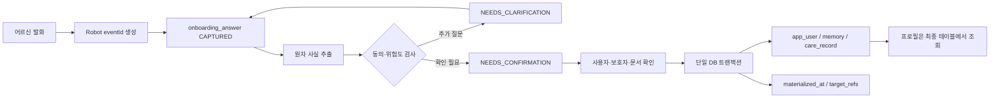
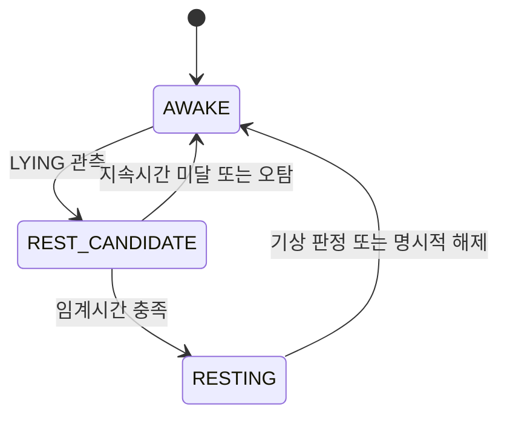

# 온보딩·휴식·온습도 확장 설계

> 상태: 설계 기준안
> 기준일: 2026-07-23
> 기준 ERD: [`mvp-erd.md`](./mvp-erd.md)
> 원칙: 온보딩 처리 원장은 분리하되 프로필 원본은 기존 도메인 테이블에 두고, 원시 비전·음성·센서 스트림은 중앙에 저장하지 않는다.

## 1. 적용 범위 평가

초기 설문을 기존 8개 테이블에만 분해 저장하는 방향은 최종 프로필을 단순하게 유지한다는 점에서는 타당하다. 그러나 현재 요구에는 12개 문항의 진행·재개, 질문 세트와 동의 정책 버전, 문항별 확인 상태, 답변 수정 이력, 로봇 QoS 1 재전송 멱등성, 최종 테이블 반영 추적이 포함된다. 이 정보는 `app_user`, `memory`, `care_record`만으로는 서로 다른 생명주기와 제약을 안전하게 표현할 수 없다.

따라서 **두 테이블 추가를 수용**한다. `onboarding_session`은 한 번의 설문 실행을, `onboarding_answer`는 답변 처리·검증·반영 원장을 맡는다. 다만 설문 원장을 프로필 조회 원본으로 사용하지 않는다. 확인된 최종 사실은 계속 `app_user`, `memory`, `care_record`에 멱등 반영한다.

| 항목 | 판단 | 이유와 적용 경계 |
| --- | :---: | --- |
| 설문을 기존 테이블에만 분해 저장 | 일부 수용 | 최종 사실의 원본 위치로는 타당하지만 진행·재개·수정·멱등 이력을 잃으므로 처리 원장까지 대체할 수 없다. |
| `onboarding_session` 추가 | 수용 | 질문 세트·동의 정책·현재 문항·종료 상태·낙관적 잠금의 생명주기가 독립적이다. |
| `onboarding_answer` 추가 | 수용 | 문항별 처리·검증·수정 이력과 로봇 재전송 멱등성, 최종 반영 추적이 필요하다. |
| 12개 답변 행 사전 생성 | 불수용 | 답변이 들어올 때 행을 만든다. 행이 없으면 미응답이며 `UNANSWERED` 상태를 만들지 않는다. |
| 질문 문구를 DB 스키마에 고정 | 불수용 | 질문·분기는 버전이 있는 제품 정책이며 DB에는 `question_code`와 `question_set_version`만 남긴다. |
| 전체 STT·AI 결과 장기 저장 | 불수용 | 원문·미확정 추출·신뢰도는 단기이며 만료와 실제 파기 시각을 기록한다. 원본 음성은 저장하지 않는다. |
| 확정 사실을 프로필 테이블에 분해 | 수용 | 호칭·동의·대화 설정은 `app_user`, 취향·일상·관계는 `memory`, 건강·복약·일정은 `care_record`가 원본이다. |
| 휴식 중 모든 기능 완전 정지 | 조정 수용 | 일반 기능은 중지하지만 호출·안전 감지·긴급 대응과 호출 시 안전한 접근은 유지한다. |
| 모든 온습도 측정값 중앙 저장 | 불수용 | 최신값과 의미 있는 임계 사건만 저장하며 고빈도 시계열은 현재 업무 DB 범위를 넘는다. |

## 2. 온보딩 원장과 책임

### `onboarding_session`

한 행은 한 어르신이 현재 배정된 로봇으로 시작한 한 번의 초기 설문 전체다.

- `senior_id`는 기존 ERD 용어와 통일한다.
- `robot_id`는 `NOT NULL`이다. 앱이나 다른 로봇에서의 재개는 현재 구현 범위 밖이다.
- 세션 상태는 `IN_PROGRESS`, `COMPLETED`, `DECLINED`, `CANCELLED`, `EXPIRED`다.
- `NOT_STARTED` 세션 행은 만들지 않는다. 세션이 한 번도 없다는 상태는 `app_user.onboarding_status='NOT_STARTED'`로만 표현한다.
- `UNIQUE (senior_id) WHERE status='IN_PROGRESS'`로 어르신당 진행 세션을 하나만 허용한다.
- `version`을 JPA `@Version`으로 사용해 로봇 재전송·동시 응답이 현재 문항을 되돌리지 못하게 한다.
- `question_set_version`과 `consent_policy_version`을 시작 시점 스냅샷으로 저장한다.

`onboarding_session.status`가 원본이다. `app_user.onboarding_status`, `onboarding_version`, `onboarding_completed_at`은 빠른 게이트 조회를 위한 projection이며 세션 전이와 **같은 Spring 트랜잭션**에서만 갱신한다. 둘을 독립적으로 수정하는 API는 만들지 않는다.

### `onboarding_answer`

한 행은 특정 세션·문항의 한 번의 답변 또는 수정본이다. 현재 답변을 덮어쓰지 않고 `revision`을 증가시켜 이력을 남긴다.

- 처리 상태: `CAPTURED`, `NEEDS_CLARIFICATION`, `NEEDS_CONFIRMATION`, `PROCESSED`, `SKIPPED`, `REJECTED`
- 검증 상태: `UNVERIFIED`, `USER_CONFIRMED`, `GUARDIAN_CONFIRMED`, `DOCUMENT_VERIFIED`, `REJECTED`
- `needs_clarification` boolean과 `UNANSWERED` 상태는 두지 않는다.
- `UNIQUE (client_event_id)`를 사용한다. BOMI의 `eventId`가 시스템 전체에서 유일하다는 MQTT 계약을 그대로 적용하며 같은 답변 재전송은 로봇이 반드시 같은 ID를 재사용한다.
- `UNIQUE (session_id, question_code, revision)`으로 문항별 수정 순서를 보장한다.
- `materialization_key`는 확인된 한 답변의 최종 반영 작업을 식별하는 전역 UNIQUE 키다.
- `materialized_at`과 제한된 `target_refs`로 `app_user`, `memory`, `care_record` 반영 여부와 대상 ID만 추적한다. 대상의 민감한 값은 복제하지 않는다.

`processing_status='PROCESSED'`는 사용자 확인과 정규 테이블 반영 판단이 끝났음을 뜻한다. 생성할 최종 사실이 없는 안전상 “없음” 답변도 빈 `target_refs.items`와 반영 시각을 기록해 같은 답변이 다시 처리되지 않게 한다. `SKIPPED`와 `REJECTED`는 반영하지 않는다.

## 3. 등록과 사전 동의

앱 또는 관리자 등록에서 실명, 생년월일, 성별, 연락처, 상세 주소, 로그인 보호자 관계, 사용자 시간대를 받는다. 로봇은 실명 대신 `preferred_name`을 묻는다. 대화에 나온 가족 이름만으로 로그인 `care_relationship`을 만들지 않는다.

온보딩 질문 전에 다음 네 동의를 독립적으로 확인한다.

1. 일반 개인화 저장
2. 건강·복약정보 저장
3. 일정·알림 생성
4. 보호자 공유

각 상태는 `NOT_ASKED`, `GRANTED`, `DENIED`, `REVOKED` 중 하나다. 건강 동의가 없으면 건강·복약 질문을 건너뛰고 해당 답변 원장도 만들지 않는다. 일정 동의가 없으면 일정 후보를 확정 행으로 만들지 않는다. 보호자 공유 동의가 있어도 활성 관계·permissions·memory visibility를 다시 검사한다.

## 4. 권장 질문과 저장 위치

질문은 한 번에 하나씩 하고 답변에 따라 후속 질문을 붙인다. 아래 12개는 `question_set_version`으로 관리하는 최초 정책안이며 컬럼 목록이 아니다.

| 번호 | 질문 목적 | 확인 후 최종 원본 |
| ---: | --- | --- |
| 1 | 편한 호칭 | `app_user.preferred_name` |
| 2 | 말하기 속도·음량·응답 길이 | `app_user.conversation_preferences` |
| 3 | 먼저 말을 걸어도 되는 시간 | `conversation_preferences.preferredConversationWindows` |
| 4 | 기상·식사·취침 등 일상 | `memory.DAILY_ROUTINE` |
| 5 | 즐거운 활동·취미 | `memory.HOBBY` |
| 6 | 좋아하거나 피하고 싶은 음식·음악·주제 | `memory.PREFERENCE`, 일부 `conversation_preferences` |
| 7 | 자주 만나는 가족·친구 | `memory.PERSONAL_RELATIONSHIP` |
| 8 | 대화·일정에 알아야 할 기존 질환 | `care_record.HEALTH_CONDITION` |
| 9 | 현재 통증·움직임 불편 | `HEALTH_OBSERVATION` 또는 `PHYSICAL_LIMITATION` |
| 10 | 약·음식 알레르기 | `care_record.ALLERGY` |
| 11 | 현재 복용약과 시간 | 확인 후 `MEDICATION`/`MEDICATION_SCHEDULE` |
| 12 | 병원 방문·개인 약속 | `APPOINTMENT` 또는 `PERSONAL_SCHEDULE` |

한 답변에 일상·취향·사람 관계가 함께 있으면 하나의 `onboarding_answer`에서 여러 `memory`를 만든다. 일정은 사용자 시간대에서 절대 날짜로 바꿔 다시 읽어준 뒤 확정한다. 약 이름·용량·시간이 불명확하면 최종 `MEDICATION`을 만들지 않고 `NEEDS_CLARIFICATION` 또는 `NEEDS_CONFIRMATION`에 둔다.

## 5. 답변 처리와 프로필 조회

저장·반영 규칙:

- 미응답은 행을 만들지 않는다.
- 알레르기 없음, 현재 복약 없음처럼 부재가 안전상 중요한 경우만 확인 후 명시적으로 처리한다.
- `onboarding_answer.extraction_jsonb`는 후보 사실이며 프로필 API가 직접 읽지 않는다.
- 호칭·동의·대화 설정은 `app_user`, 취향·일상·관계는 `memory`, 질환·알레르기·복약·일정은 `care_record`에서 조회한다.
- 정규 테이블 반영과 `materialization_key`, `materialized_at`, `target_refs` 기록은 하나의 트랜잭션이다.
- `target_refs`에는 `targetType`, `targetId`, 변경한 필드명만 허용하고 답변·질환명·약물명 등 본문을 넣지 않는다.
- `source_conversation_id/source_message_id`는 단기 대화 원문과의 출처 연결이며 원문이 파기된 뒤에도 논리 출처 ID는 남길 수 있다.
- `audit_log`에는 상태 전이·확인·반영·파기 행위와 변경 필드명만 기록하고 민감 본문은 복사하지 않는다.

## 6. 보존·파기 정책

| 데이터 | 보존 정책 |
| --- | --- |
| 세션 상태·질문 세트 버전·동의 정책 버전·완료 시각 | 감사·업무 정책에 따른 장기 보존 |
| 질문 코드·revision·처리/검증 상태·반영 참조 | 감사·업무 정책에 따른 장기 보존 |
| 확정된 최소 `answer_summary` | 동의와 업무 목적이 유지되는 기간까지만 보존 |
| 확정 프로필·건강·일정 | `app_user`, `memory`, `care_record`가 원본 |
| 미확정 `extraction_jsonb` | 확인 완료 또는 만료까지 단기 보존 |
| `transcript_excerpt`·전체 대화 메시지 | 기본 7일 단기 보존 |
| STT/AI 신뢰도와 요청 분석 메타데이터 | 기본 30일 단기 보존 |
| 원본 음성 | 저장하지 않음 |

단기 필드에는 예정 만료와 실제 파기를 구분한다. `transcript_excerpt`는 `raw_text_expires_at/raw_text_purged_at`, 미확정 추출은 `extraction_expires_at/extraction_purged_at`, 최소 요약은 `summary_expires_at/summary_purged_at`을 사용한다. 파기 작업은 본문·JSON·신뢰도를 NULL로 만든 뒤 실제 파기 시각을 기록한다.

`stt_confidence`와 `ai_confidence`를 저장할 때는 각각 모델명·버전과 `processing_policy_version`을 함께 저장한다. 신뢰도만 무기한 남기지 않으며 30일 후 모델 분석 목적이 끝나면 신뢰도와 단기 모델 메타데이터를 제거한다.

## 7. 휴식 상태 인지

Vision은 프레임별 자세 좌표를 중앙에 보내지 않는다. 설정된 누움 지속시간을 넘겼을 때만 `REST_STATE_CHANGED`를 발행한다.

`RESTING` 진입 시 `robot.current_mode=REST_GUARD`와 고유 `external_event_id`의 `REST_OBSERVATION/ACTIVE`를 기록한다. 일반 능동 대화·비긴급 알림·자율 시나리오는 중지하고, 호출 감지·안전 감지·긴급 대응과 호출 시 안전 확인 후 접근은 유지한다. 기상 시 같은 휴식 관찰을 `COMPLETED`로 바꾸고 `details.endedAt`을 기록한다.

카메라 프레임·영상, 관절 좌표·bounding box·track별 자세, 초당 분류 배열, 얼굴 특징·생체 임베딩은 중앙에 저장하지 않는다.

## 8. 온습도 인지

센서 이벤트는 두 층으로 처리한다.

1. `robot.ambient_temperature_c`, `ambient_humidity_percent`, `ambient_observed_at`, `ambient_sensor_code`에 최신값 갱신
2. 정책 임계값 초과, 의미 있는 변화 또는 사용자 확인이 있을 때 `ENVIRONMENT_OBSERVATION` 생성

로봇은 정책 구간에 따라 “지금 조금 더우신가요?”, “조금 춥게 느껴지시나요?”, “공기가 습하거나 건조하게 느껴지세요?”처럼 확인한다. 센서값만으로 건강 상태를 진단하지 않는다. 장기 환경 취향을 사용자가 명시적으로 확인한 경우에만 별도 `memory.PREFERENCE`로 만들고, 한 번의 덥고 춥다는 응답은 환경 관찰에만 둔다.

중앙 DB는 초당 온습도 스트림을 저장하지 않는다. 추세 분석·센서 보정·다중 센서 비교가 실제 기능이 되면 보존·다운샘플링 정책이 있는 시계열 저장소를 별도 결정한다.

## 9. 구현 완료 기준

- 세션이 없을 때만 `app_user.onboarding_status='NOT_STARTED'`이며 같은 어르신의 `IN_PROGRESS` 세션은 최대 하나다.
- 세션 상태와 `app_user` projection이 같은 트랜잭션에서 바뀌고 불일치 검증 작업이 0건을 유지한다.
- 같은 `client_event_id` 재전송은 동일 답변을 반환하며 정규 테이블 부수 효과를 다시 만들지 않는다.
- 문항 수정은 revision을 증가시키고 `(session_id, question_code, revision)`이 중복되지 않는다.
- `NEEDS_CLARIFICATION`과 검증 상태가 독립적으로 조회되며 `needs_clarification` boolean은 없다.
- 확인 전 extraction은 프로필에 노출되지 않고, 확인 후 최종 사실만 정규 테이블에서 조회된다.
- `materialization_key` 재처리가 `memory`나 `care_record`를 중복 생성하지 않는다.
- 만료 배치가 원문·미확정 추출·신뢰도·요약을 정책대로 제거하고 각 `*_purged_at`을 기록한다.
- 동의가 없는 건강·복약 답변과 원본 음성이 저장되지 않는다.
- 휴식 임계시간 미달 후보는 중앙 DB에 저장되지 않고 `REST_GUARD`에서도 호출·안전·긴급 기능은 유지된다.
- 동일 휴식/환경 `eventId` 재전송이 중복 `care_record`를 만들지 않고 오래된 온습도 이벤트가 최신값을 덮어쓰지 않는다.

## 10. 구현 전 팀 결정

- 최초 `question_set_version`, 질문 코드 목록·필수/선택 규칙, 동의 문구의 `consent_policy_version`
- 세션 만료 시간과 CANCELLED/EXPIRED 후 재시작 정책
- 답변 요약의 동의·업무 목적별 보존기간과 파기 배치 주기
- STT/AI 단기 메타데이터의 정확한 보존기간과 모델명·버전 표준
- `target_refs` 허용 스키마와 `materialization_key` 생성 규칙
- 누움 지속시간, 기상 판정, 오탐 해제, 야간/주간 정책
- `REST_GUARD`에서 비긴급 복약 알림을 억제할지 예약 후 재확인할지
- 온도·습도 임계값, 히스테리시스, 중복 질문 억제 시간과 센서 보정 기준
- 휴식·환경 관찰의 최종 보존기간과 보호자 대시보드 노출 범위
