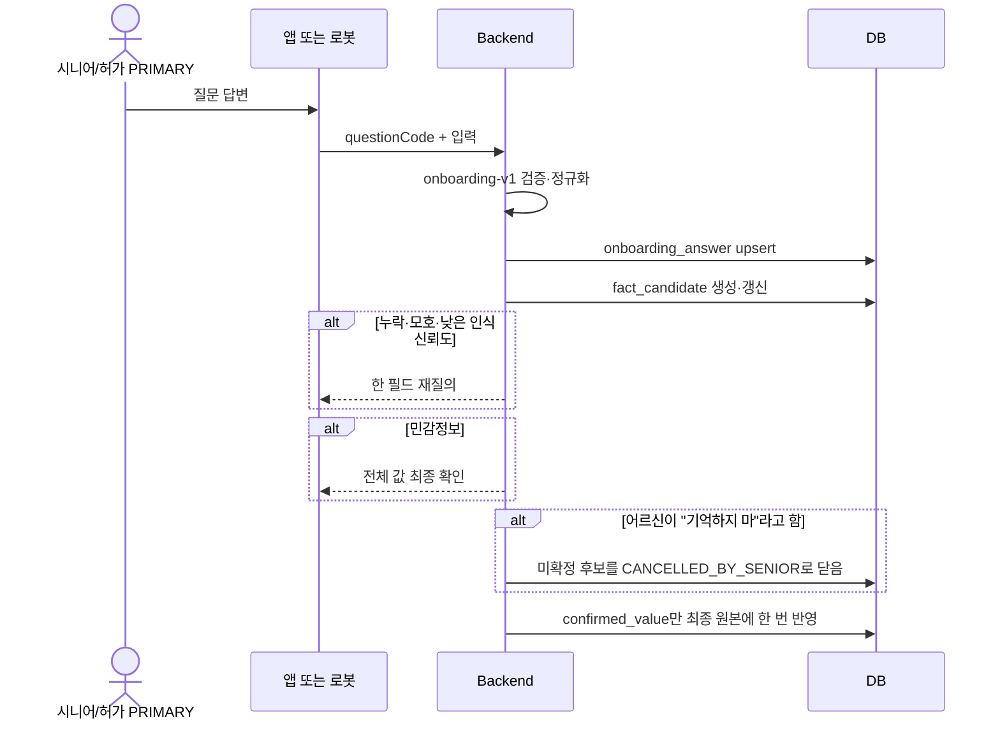
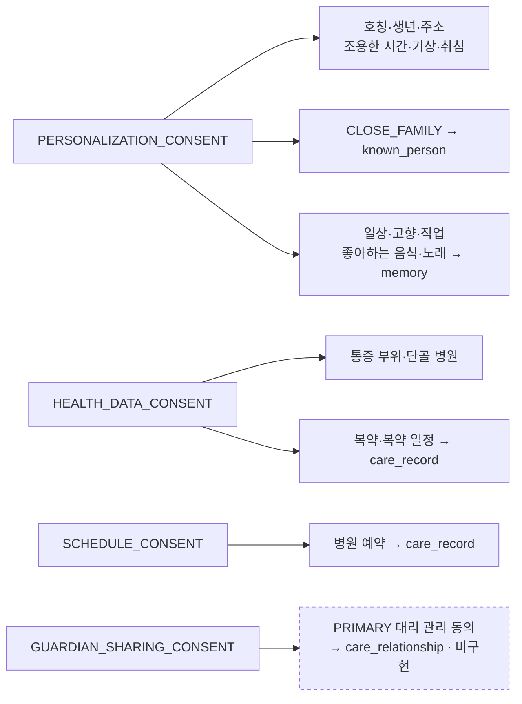
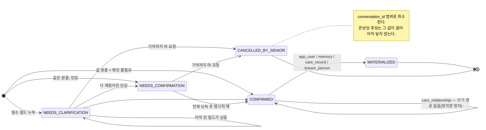

# 온보딩·대화·휴식·환경 데이터 설계

**이 문서가 백엔드 javadoc이 말하는 "design note / 설계 노트"다.**
`OnboardingMaterializer`·`RobotOnboardingService`·`QuestionDefinition`·
`OnboardingAnswerRepository`·`OnboardingSessionRepository`·`RobotClarificationService` 등
9곳이 이 문서를 **절 번호로** 인용한다(예: "design note §2"). 따라서 §1~§6의 번호와 순서는
바꾸지 않는다. 절을 늘릴 때는 뒤에 붙이고, 내용을 옮길 때는 인용하는 javadoc을 함께 고친다.

테이블 정의와 관계의 정본은 [`mvp-erd.md`](mvp-erd.md)다. 이 문서는 그 위에서 "왜 이 순서로,
무엇을 확인하고 쓰는가"를 정한다. 파일명은 `onboarding-rest-environment-design`인데 제목은
한 칸 넓다 — §4(대화·요약·기억)가 나중에 들어온 흔적이다. 파일명은 링크가 깨지므로 바꾸지
않고, 범위는 이 문단으로 밝힌다.

구현 상태는 절마다 흩어 두지 않고 [§7 구현 현황](#7-구현-현황-2026-08-16-기준)에 한 장으로
모았다. "구현됨"과 "실기 검증됨"은 그 표에서 갈라 읽는다.

## 1. 온보딩의 세 층

| 층 | 저장 위치 | 책임 |
| --- | --- | --- |
| 질문 계약 | `onboarding-question-set-v1.json` | 질문 코드, 필수 필드, 동의 게이트, 채널 표현, 최종 매핑. 빌드가 백엔드 클래스패스로 복사한다 |
| 진행·답변 | `onboarding_session`, `onboarding_answer` | 채널을 넘나드는 진행 위치와 현재 정규화 답변 |
| 확인·반영 | `fact_candidate` → 최종 원본 | 재질의, 민감정보 확인, PRIMARY 협의, 멱등 반영 |

최종 조회 원본은 `app_user`, `memory`, `care_record`, `known_person`이다. `care_relationship`
(PRIMARY 보호자 돌봄관리 권한)은 계약에 질문이 있지만 **쓰기 경로가 아직 없다** — 그 후보는
`MATERIALIZED`가 아니라 `CONFIRMED`에 머무는 것이 정직한 상태다
(`OnboardingMaterializer.java:105-109`).

### 질문 세트는 문서 트리에 있고 빌드가 백엔드로 옮긴다

사본을 만들지 않는다. 사본이 있으면 문구가 갈라지고, 갈라진 것이 동의 문구라면 그것은
오타가 아니라 계약 위반이다(`OnboardingQuestionSet` 클래스 주석).

| 단계 | 위치 | 근거 |
| --- | --- | --- |
| 원본 | `docs/database/onboarding-question-set-v1.json` | — |
| 빌드 복사 | `processResources` → 클래스패스 `onboarding/` | `backend/build.gradle:121-125` |
| 컨테이너 빌드 | `COPY docs /docs` (빌드 컨텍스트는 레포 루트) | `backend/Dockerfile:13` |
| 런타임 읽기 | 클래스패스에서 `@PostConstruct` 1회 | `OnboardingQuestionSet.load` |

로봇은 이 파일을 읽지 않는다. `robotPrompt`를 API 응답으로 받으므로 문구 변경은 서버 배포와
함께 나간다. **문서 트리의 JSON만 고치고 백엔드를 다시 빌드하지 않으면 아무것도 바뀌지
않는다.**

**세 가지는 기동을 실패시킨다** — 파일을 못 읽을 때, 질문 코드가 중복될 때, 선행 동의가
자기보다 뒤에 오는 질문일 때(`OnboardingQuestionSet.load`·`validatePrerequisites`,
`:83-101`). 조용히 뜬 서버는 모든 로봇에게 "더 물을 것 없음"을 답하고 어르신 전원이
온보딩되지 않은 채 남는다 — 안 뜨는 편이 낫다.

**계약 파일만 고쳐서 끝나지 않는 자리가 둘 있다.** 새 동의 코드를 추가하면
`consentValue`에 분기를 함께 만들어야 하고(`RobotOnboardingService.java:233-244`), `app_user`
필드를 추가하면 `applyField`에 분기를 함께 만들어야 한다
(`OnboardingMaterializer.java:142-144`). 둘 다 분기가 없으면 `IllegalStateException`으로
요란하게 깨진다 — 조용히 넘어가 "동의했는데 반영이 안 되는" 상태가 되는 것보다 낫다는
판단이다.

계약 파일이 담고 있으나 **코드가 읽지 않는 필드**도 있다. `answerSchema`는 서버 검증에
쓰이지 않고(검증은 `requiredFields`의 공백 여부뿐, `RobotOnboardingService.java:410-419`)
로봇도 읽지 않는다. `appControl`·`clarification`은 파싱만 되고 참조가 없으며,
`whenMissing`·`defaults`는 파서의 레코드에 자리가 없어 버려진다. `required` 플래그도 읽히지
않는다 — 동의 4종이 사실상 필수인 것은 이 플래그 때문이 아니라, 답변이 verified 될 때까지
같은 질문이 계속 돌아와 세션이 완료되지 않기 때문이다(§2 "답했다"의 정의). `defaults` 블록이
적어 둔 의도 중 실제로 코드가 지키는 것은 `askOneFieldAtATime`과
`materializeOnlyConfirmedValue` 둘뿐이다. 나머지는 사람이 읽는 주석으로 남겨 둔 것이지,
고치면 동작이 바뀌는 값이 아니다.

계약은 앱과 로봇 두 채널을 전제로 쓰였다. 앱은 입력 UI, 로봇은 자연어 질문을 쓰되 같은 질문
코드·필수값·동의 게이트·최종 매핑을 공유한다. 로봇 답변은 근거 대화·메시지를 연결하고 앱
답변은 없을 수 있다.

**오늘 구현된 채널은 로봇 하나다** — 엔드포인트는 `/api/v1/robot/onboarding` 뿐이고
(`RobotOnboardingController.java`), `OnboardingSession.startFromApp`은 프로덕션 호출자가
없으며 가디언웹에는 온보딩 화면이 없다. 세션·답변 스키마가 채널을 구분해 두는 이유는 앱
채널이 붙을 때 이 문서를 다시 쓰지 않기 위해서다.

## 2. 세션·후보

### 세션 — 채널을 넘나드는 진행 위치

- 최초 채널은 유지하고 실제 답변 채널은 답변별 기록한다.
- 로봇 시작은 `robot_id`가 필수다(`RobotOnboardingService.java:121-123`). 앱 시작은
  `robot_id` 없이도 되도록 스키마와 도메인 팩토리가 열려 있으나, 그 진입점은 아직 없다.
- 한 시니어의 진행 중 세션은 하나다. **이 규칙을 지키는 것은 애플리케이션 조회 하나뿐이고
  DB 제약이 아니다** — `onboarding_session`에는 PK 외 제약이 없어(`V1__init.sql:60-71`)
  동시 `startOrResume` 두 건이 세션 두 개를 만들 수 있다. 부분 유니크 인덱스
  `UNIQUE(senior_id) WHERE status='IN_PROGRESS'`는 아직 마이그레이션에 없다.
- 세션 상태와 사용자 projection은 같은 트랜잭션으로 바꾼다.
- 세션은 자기가 진행한 계약 버전을 `onboarding_session.question_set_version`에 남긴다.
  "질문 코드는 절대 바꾸지 않는다"는 계약 파일의 규칙과 짝을 이루는 장치다 — 코드가 유지되고
  버전이 기록돼야 중단된 세션을 나중에 이어서 진행할 수 있다.
- 다음 질문은 선행 동의 게이트를 통과한 것 중 첫 번째다. 게이트는 세 갈래다 — `GRANTED`면
  진행, `DENIED`·`REVOKED`면 그 질문을 **영구 생략**, `NOT_REQUESTED`면 순서를 재배치해
  동의 질문을 먼저 묻는다(`RobotOnboardingService.java:219-231`). **거절은 실패가 아니라
  건너뛰기다** — 이것이 설계 판단이고, 그래서 동의를 거절한 어르신도 세션을 끝낼 수 있다.
- 게이트는 답변 행이 아니라 `app_user`의 동의 컬럼을 읽는다. "답했지만 아직 반영되지 않은
  동의는 동의가 아니다"(`RobotOnboardingService.java:211-218`).
- 필수 질문 또는 허용된 동의 거절·건너뛰기 경로 뒤만 완료한다. **"답했다"의 정의는 답변 행의
  `verification_status`가 `AUTO_ACCEPTED`·`USER_CONFIRMED`·`GUARDIAN_CONFIRMED` 중
  하나인 것이다**(`RobotOnboardingService.java:247-255`). `UNVERIFIED`·`REJECTED`면 같은
  질문이 계속 다시 나온다 — 루프가 끝나는 유일한 이유다.

→ 앱에서 세 문항을 답한 어르신에게 로봇이 그것을 다시 묻지 않게 하는 것이 이 층의 목적이다.

선행 동의 사슬은 계약 파일을 위아래로 훑어야 보이므로 여기 한 장으로 옮겨 둔다.

동의를 거절하면 그 아래 가지는 **영구 생략**된다 — 다시 묻지 않는다. 위 게이트 3분기 설명과
같은 이야기다.

### 재질의 — 저장은 전부, 질문은 하나

- 재질의는 언제나 `missing_fields`에서 **한 필드씩**이다. 저장은 받은 값 전부, 질문은 하나
  (`RobotOnboardingService.java:315-327`). 온보딩이 실제로 만드는 사유는
  `MISSING_REQUIRED_FIELD` 하나이고, `AMBIGUOUS_VALUE`는 가디언웹의 재질의 요청에서만,
  `LOW_RECOGNITION_CONFIDENCE`는 아직 어느 경로에서도 만들어지지 않는다.
- 답변은 upsert이고 **빈 값·공백은 기존 값을 덮지 않는다**(`OnboardingAnswer.java:164-177`).
  한 필드씩 채워 나가는 흐름이 성립하는 이유다.
- **온보딩 후보는 온보딩 엔드포인트로만 답한다.** 로봇의 능동 재질의 API는 `source_type`
  필터 없이 미확정 후보를 모두 가져오므로(`RobotClarificationService.java:68-70`) 온보딩
  후보도 잡힌다. 그런데 그 경로의 실체화는 `PROFILE`·`CARE_RELATIONSHIP` 도메인에서
  `Optional.empty()`로 끝나고(`FactMaterializer.java:174-176`) `onboarding_answer`를 건드리지
  않아 답변은 `UNVERIFIED`로 남는다 — 후보는 `CONFIRMED`가 되는데 `app_user`에는 아무것도
  안 쓰이고 같은 질문이 계속 다시 나온다. **코드 사실이며 실기에서 이 조합이 실제로 발생하는지는
  미확인이다**(로봇 틱과 온보딩 세션이 동시에 도는 조건을 재현해 봐야 한다).

→ 한꺼번에 물으면 음성으로는 아무것도 기억되지 않고, 하나만 저장하면 나머지가 빈 채로 복약
정보가 확정된다.

### 확인·반영 — 확정값만 최종 원본으로

- 건강·복약·일정·보호자 알림은 명확해도 최종 확인한다.
- 로봇은 복용량이나 의학적 결정을 만들지 않는다.
- 한 대화는 활성 후보 하나만 질의한다 — 어르신에게 확인 질문이 연달아 쏟아지지 않게 하는
  것이 이 규칙의 목적이다.
- 같은 후보가 두 번 반영되지 않게 하는 것은 세 겹이다 — ① `materialize()`가 `CONFIRMED`가
  아닌 후보를 거부하고 `materialized_at`을 찍는다(`FactCandidate.java:337-343`),
  ② 최종 테이블의 `UNIQUE(source_candidate_id)`가 DB 층에서 막는다
  (`V1__init.sql:205,224`), ③ 이 둘이 한 트랜잭션 안에 있다. **행 잠금은 쓰지 않는다** —
  fact 패키지에 비관적 잠금이 없다.
- 어르신이 "기억하지 마"라고 하면 그 대화의 미확정 후보
  (`CAPTURED`·`NEEDS_CLARIFICATION`·`NEEDS_CONFIRMATION`·`COORDINATION_REQUIRED`)를
  `CANCELLED_BY_SENIOR`로 닫는다(`FactCandidateCancellationService.java:38-42,64-82`).
  멱등하고, 취소된 후보는 같은 발화가 다시 들어와도 되살아나지 않는다.
  **한계 — 이 취소는 `conversation_id`로 범위를 잡는데 온보딩 후보에는 그 값이 없다**
  (`FactCandidate.fromOnboardingAnswer`는 `onboarding_answer_id`만 채운다,
  `FactCandidate.java:192-199`). 온보딩 도중의 "기억하지 마"는 아직 온보딩 후보에 닿지
  않는다.

→ 잘못 들은 용량 하나가 최종 테이블에 들어가는 것이 이 전체 흐름이 막으려는 실패다.

### 후보 상태 전이

## 3. PRIMARY

> **구현 상태 — 이 절은 목표 설계이며 현재 배선돼 있지 않다.**
> `care_relationship.care_management_permission_status`를 **읽는 코드가 한 줄도 없고**,
> 협의 전이 메서드 7개(`requireCoordination`·`recordSeniorPosition`·
> `recordPrimaryDecision` 등, `FactCandidate.java:297-334`)는 프로덕션 호출자가 0건이다.
> 따라서 `COORDINATION_REQUIRED` 상태와 `CoordinationStatus` 값들은 런타임에 도달하지
> 않는다. 가디언웹의 확인 API는 행위자를 식별조차 하지 않는다
> (`ConfirmationRequestService.java:133`, `confirm(value, null)`).

목표 규칙은 다음과 같다. 대리 관리는 `ACTIVE + PRIMARY + GRANTED` 관계 하나에만 허용한다.
동의는 시니어에게 묻고 PRIMARY가 없으면 `NOT_ASKED`다. PRIMARY 변경 시 재동의한다.
SECONDARY는 조회할 수 있어도 민감정보를 확인·변경할 수 없다.

충돌 시 양쪽에 알리고 전화 또는 직접 협의를 유도하지만 통화 사실을 증명하지 않는다.
반대·연락 불가를 보존하고 PRIMARY가 2차 책임 확인을 완료하면 보호자 결정값을 적용할 수 있다.

`AnswerVerificationStatus.GUARDIAN_CONFIRMED`는 이 절의 대리 확인을 답변 행에 표현하려고
만든 값인데, 현재 그 값을 쓰는 프로덕션 경로가 없다 — 위 배선이 붙을 때 함께 살아난다.

## 4. 대화·요약·기억

- 발화는 `conversation_message` 한 행씩 저장한다.
- 최근·오늘 대화는 `sequence_no`, `occurred_at` 조회 범위다.
- 종료 후 `CONVERSATION` 요약을, 어르신 현지 **`[02:00, 06:00)`** 창 안의 매시 :20 틱에서
  전날 `DAILY` 요약을 만든다(`LlmProperties.java:103,118,126`). 창이 1시간이 아니라 4시간인
  것은 스케줄러 스레드가 하나여서 02:00 틱이 다른 배치나 재배포에 밀릴 수 있고, 밀린 cron
  틱은 스프링이 큐에 쌓지 않고 **버리기** 때문이다 — 창이 한 시간이면 그날 요약은 다음 날이
  아니라 영영 생기지 않는다. 넓은 창은 그 위험을 줄일 뿐 없애지는 못한다.
- **두 요약 모두 `bomi.llm.enabled`가 켜져 있을 때만 만들어지고 기본값은 꺼짐이다**
  (`LlmProperties.java:28`, `application.yml:257`) — 기본 배포에서 요약은 한 건도 생기지
  않는다. 요약이 비어 있는 DB를 보고 버그를 찾기 전에 이 스위치를 먼저 본다.
- `memory`에는 대화 없이 이해되는 장기 사실 하나만 둔다.
- 문맥에는 최근 Raw, 관련 요약, 상위 기억, 동의된 관련 돌봄 기록만 선별한다.
- Raw 삭제 전 요약 생성·활성 후보 해소·확정값의 최종 반영·보존기간 만료를 모두 확인한다.
- **근거 참조에 물리 FK는 없다.** 마이그레이션 전체에 `REFERENCES`가 한 건도 없으므로
  `ON DELETE SET NULL`도 없다. `onboarding_answer`·`fact_candidate`·`care_record`의
  `source_message_id`를 비우는 것은 삭제 트랜잭션 안의 애플리케이션 코드다
  (`ConversationRawPurgeService.java:286-301`). **SQL로 발화를 직접 지우면 끊어진 UUID가
  영구히 남는다.**
- 이 삭제 잡은 기본 꺼짐이다(`purge-enabled` 기본 `false`, `application.yml:324`).
  켜면 되돌릴 수 없다 — 백업도 소프트 삭제도 감사 테이블도 없다.

## 5. 최종 매핑

| 입력 | 최종 위치 | 질문 수 | 주의 |
| --- | --- | --- | --- |
| 동의 4종·호칭·생년·주소·조용한 시간·기상/취침·통증 부위·단골 병원 | `app_user` | 12 | 동의 목적을 서로 대체하지 않음 |
| 일상·고향·직업·좋아하는 음식·좋아하는 노래 | `memory` | 5 | 개인화 동의 필요. ⚠️ visibility는 지금 선택되지 않는다 — 2026-08-10 시연 임시조치로 모두 `SHARED_WITH_PRIMARY`로 굳는다(`FactMaterializer.java:109-127`, 되돌릴 것) |
| 복약·복약 일정·병원 예약 | `care_record` | 3 | 명시적 확인과 동의 필요 |
| 가까운 가족 1명(`CLOSE_FAMILY`) | `known_person` | 1 | 회피 명부용. `guardianUserId`는 항상 null — 보호자 계정 관계로 자동 승격 금지 |
| PRIMARY 대리 관리 동의 | `care_relationship` | 1 | 활성 PRIMARY 한 명만. **쓰기 경로 없음** — 후보는 `CONFIRMED`에 머문다 |
| 합계 | | **22** | 계약 파일의 질문 수와 같아야 한다 |

대화 중 언급된 가족은 이 표와 다르다 — 온보딩 질문이 아니라 대화 추출 경로로 들어오고
기본 `memory`다.

## 6. 휴식·환경

### 휴식 — 수신부만 있다

Vision은 프레임마다의 판정이 아니라 지속시간 조건을 만족한 `RESTING`/`AWAKE` **전이만**
보내야 한다. 영상·관절 좌표·track ID·얼굴 특징은 저장하지 않는다.

수신부는 완성돼 있다 — 백엔드는 `REST_STATE_CHANGED`를 받아 `REST_OBSERVATION`
`care_record`를 남기고 로봇 모드를 `IDLE ↔ REST_GUARD`로 토글한다
(`RobotObservationService.java:53-78,127-135`). **발행부는 아직 없다.** `ai_vision`에
`RESTING`/`AWAKE` 판정 코드가 없고(문서에만 있다), bridge의 `publish_rest_state`는 테스트만
호출한다(`mqtt_bridge.py:177`). 즉 이 경로는 오늘 한 번도 실행되지 않는다.

### 온습도 — 지금은 전량 저장이다

온습도는 `robot`의 최신 스냅샷 컬럼(`ambient_temperature_c`·`ambient_humidity_percent`·
`ambient_observed_at`)에 쓰고, 같은 관측을 `ENVIRONMENT_OBSERVATION` `care_record`로도
남긴다(`RobotObservationService.java:83-124`).

**목표와 현재가 다르다.**

| 규칙(목표) | 현재 구현 |
| --- | --- |
| 더 오래된 관측이 최신 스냅샷을 덮지 않는다 | 시각 비교 없음 — UPDATE의 WHERE는 `r.id`뿐(`RobotRepository.java:63-76`) |
| 의미 있는 변화·임계 초과일 때만 이벤트를 남긴다 | 게이팅 없음 — 도착한 관측을 전부 저장 |
| 주기 측정 전체는 저장하지 않는다 | IoT가 30초마다 발행(`dht11_main.py:33`). 거르는 것은 센서 유효범위(0~50°C, 20~90%RH) 밖 측정값뿐이라 어르신 1명당 하루 약 2,880행 |

임계(30°C / 80%) 판정은 저장과 무관한 별도 단계이고 백엔드 몫이다
(`WellnessCheckOrchestrator.java:151-157`, `>=` 비교·OR 조건).

### 민감값 보존

민감한 정규화 답변(`onboarding_answer.answer_value`)과 후보 제안값
(`fact_candidate.proposed_value`)은 최종 반영 뒤 무기한 중복 보존해서는 안 된다.
**아직 그 정책도 잡도 없다** — `FactCandidate.expire()`는 호출자가 0건이라 `EXPIRED`
상태가 발생하지 않고, 두 컬럼을 지우거나 가리는 경로가 없다. Raw 퍼지가 비우는 것은
`source_message_id` 하나뿐이다.

## 7. 구현 현황 (2026-08-16 기준)

이 절은 §1~§6이 정한 규칙 중 **무엇이 오늘 실제로 도는가**만 적는다. "구현"은 코드와 단위
테스트가 있다는 뜻이고, "실기 검증"은 젯슨·실브로커에서 확인했다는 뜻이다 — 둘은 다르다.

| 이 문서의 규칙 | 상태 | 근거 |
| --- | --- | --- |
| 로봇 채널 온보딩 상태기계 | 구현 · 단위테스트 있음 | `RobotOnboardingServiceTest.java` |
| `app_user`·`memory`·`care_record`·`known_person` 실체화 | 구현 · **실기 미검증** | `OnboardingMaterializer.java:70-110` |
| `care_relationship` 실체화 | 미구현(로그만 남김) | `OnboardingMaterializer.java:105-109` |
| 앱 채널 | 미구현(진입점 없음) | 컨트롤러·화면 부재 |
| `answerSchema` 검증 | 미구현(서버·로봇 모두 읽지 않음) | `RobotOnboardingService.java:410-419` |
| PRIMARY 협의(§3) | 미배선(스키마·타입만) | `FactCandidate.java:297-334` 호출자 0 |
| 어르신 요청 취소(`CANCELLED_BY_SENIOR`) | 구현 · 온보딩 후보에는 미도달 | `FactCandidateCancellationService.java:64-82` |
| 대화·일간 요약 | 구현 · **기본 꺼짐** | `LlmProperties.java:28` |
| Raw 보존기간 삭제 | 구현 · **기본 꺼짐** | `application.yml:324` |
| 휴식 상태 수신 | 구현 · **발행자 없음** | `RobotObservationService.java:53-78` / `ai_vision` 판정 코드 부재 |
| 온습도 스냅샷·이벤트 | 구현(전량 저장, 역행 방어 없음) | `RobotRepository.java:63-76` |
| 민감값 보존·비식별 | 미구현 | `FactCandidate.expire()` 호출자 0 |
