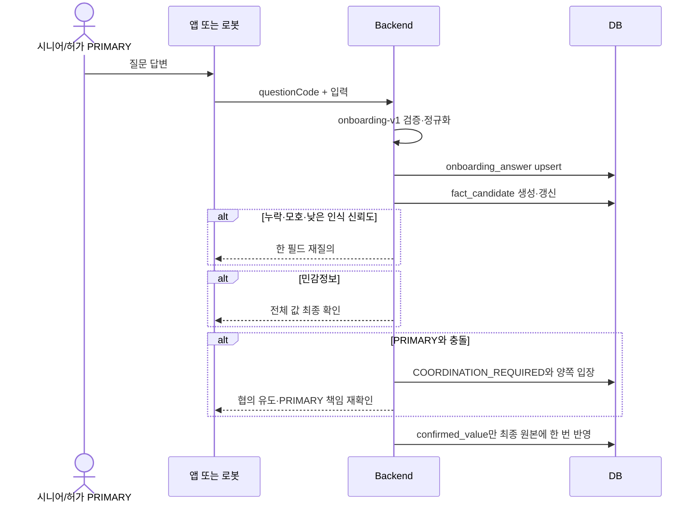

# 온보딩·대화·휴식·환경 데이터 설계

## 1. 온보딩의 세 층

| 층 | 저장 위치 | 책임 |
| --- | --- | --- |
| 질문 계약 | `onboarding-question-set-v1.json` | 질문 코드, 필수 필드, 동의, 채널 표현, JSON Schema, 최종 매핑 |
| 진행·답변 | `onboarding_session`, `onboarding_answer` | 채널을 넘나드는 진행 위치와 현재 정규화 답변 |
| 확인·반영 | `fact_candidate` → 최종 원본 | 재질의, 민감정보 확인, PRIMARY 협의, 멱등 반영 |

최종 조회 원본은 `app_user`, `care_relationship`, `memory`, `care_record`다.

앱은 입력 UI, 로봇은 자연어 질문을 사용하지만 같은 질문 코드·필수값·동의·JSON·최종 매핑을 쓴다. 로봇 답변은 근거 대화·메시지를 연결하고 앱 답변은 없을 수 있다.

## 2. 세션·후보

- 최초 채널은 유지하고 실제 답변 채널은 답변별 기록한다.
- 앱 시작은 로봇 ID가 없어도 되며 로봇 시작은 필요하다.
- 한 시니어의 진행 중 세션은 하나다.
- 세션 상태와 사용자 projection은 같은 트랜잭션으로 바꾼다.
- 필수 질문 또는 허용된 동의 거절·건너뛰기 경로 뒤만 완료한다.
- 누락·모호·낮은 인식 신뢰도는 `missing_fields` 한 필드씩 묻는다.
- 건강·복약·일정·보호자 알림은 명확해도 최종 확인한다.
- 로봇은 복용량이나 의학적 결정을 만들지 않는다.
- 한 대화는 활성 후보 하나만 질의한다.
- 후보 잠금·`materialized_at`·최종 `source_candidate_id` 유일성을 한 트랜잭션에서 확인한다.

## 3. PRIMARY

대리 관리는 `ACTIVE + PRIMARY + GRANTED` 관계 하나에만 허용한다. 동의는 시니어에게 묻고 PRIMARY가 없으면 `NOT_ASKED`다. PRIMARY 변경 시 재동의한다. SECONDARY는 조회할 수 있어도 민감정보를 확인·변경할 수 없다.

충돌 시 양쪽에 알리고 전화 또는 직접 협의를 유도하지만 통화 사실을 증명하지 않는다. 반대·연락 불가를 보존하고 PRIMARY가 2차 책임 확인을 완료하면 보호자 결정값을 적용할 수 있다.

## 4. 대화·요약·기억

- 발화는 `conversation_message` 한 행씩 저장한다.
- 최근·오늘 대화는 `sequence_no`, `occurred_at` 조회 범위다.
- 종료 후 `CONVERSATION`, 현지 새벽 2~3시 전날 `DAILY` 요약을 만든다.
- `memory`에는 대화 없이 이해되는 장기 사실 하나만 둔다.
- 문맥에는 최근 Raw, 관련 요약, 상위 기억, 동의된 관련 돌봄 기록만 선별한다.
- Raw 삭제 전 요약·활성 후보·최종 반영·만료를 확인하고 메시지 근거 FK는 `SET NULL`이다.

## 5. 최종 매핑

| 입력 | 최종 위치 | 주의 |
| --- | --- | --- |
| 호칭·대화 설정·목적별 동의 | `app_user` | 동의 목적을 서로 대체하지 않음 |
| PRIMARY 대리 관리 동의 | `care_relationship` | 활성 PRIMARY 한 명만 |
| 취향·일상·관계 | `memory` | 개인화 동의와 visibility 적용 |
| 건강·알레르기·복약·일정 | `care_record` | 명시적 확인과 동의 필요 |
| 가족 언급 | 기본 `memory` | 보호자 계정 관계로 자동 승격 금지 |

## 6. 휴식·환경

Vision은 프레임 후보가 아니라 지속시간을 만족한 `RESTING`/`AWAKE` 전이만 보낸다. Backend는 로봇 모드와 `REST_OBSERVATION`을 반영한다. 영상·관절 좌표·track ID·얼굴 특징은 저장하지 않는다.

온습도는 `robot` 최신 스냅샷에 저장하고 더 오래된 관측은 역덮어쓰지 않는다. 의미 있는 경우에만 `ENVIRONMENT_OBSERVATION`을 만든다. 주기 측정 전체는 저장하지 않는다.

민감한 정규화 답변과 후보 제안값은 최종 반영 뒤 무기한 중복 보존하지 않고 보존·비식별 정책을 적용한다.
