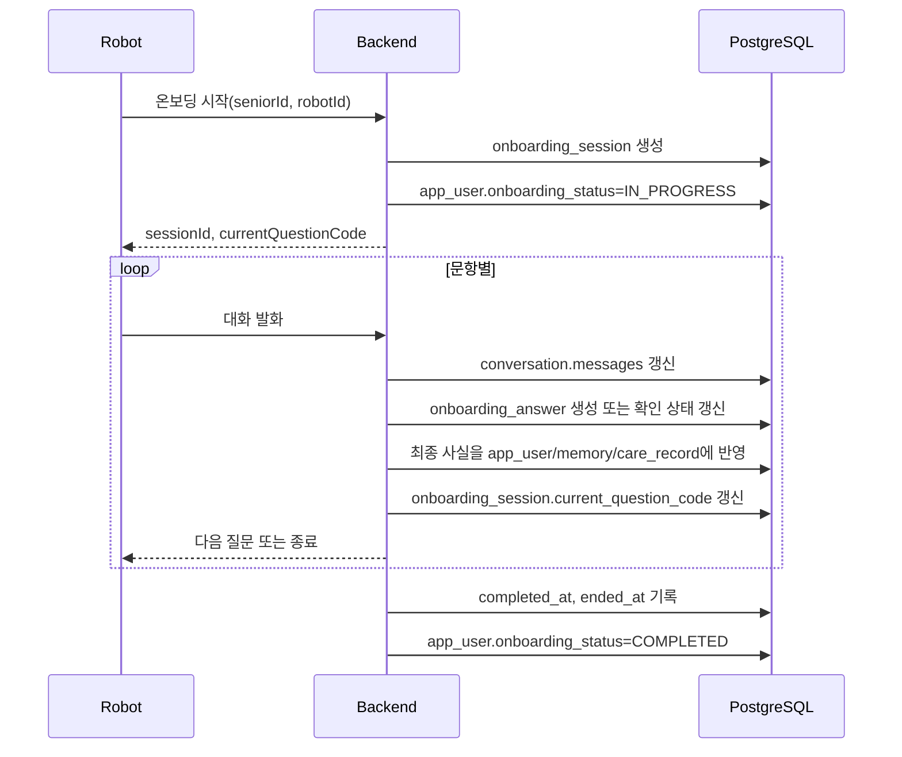

# 온보딩·휴식·온습도 설계

> 기준 ERD: [`mvp-erd.md`](./mvp-erd.md)
>
> 범위: 9개 테이블로 첫 로봇 연동을 구현할 때의 데이터 흐름
>
> 원칙: 진행 근거와 최종 사용값을 구분하고 원시 음성·영상·센서 스트림은 저장하지 않는다.

## 1. 이번 모델의 의도

온보딩은 “질문 답변을 영구 설문지로 보관하는 기능”이 아니다. 로봇이 시니어를 알아가기 위해 질문하고, 확인된 내용을 다음 대화와 돌봄에 쓰는 과정이다.

그래서 역할을 세 층으로 나눈다.

| 층 | 저장 위치 | 역할 |
|---|---|---|
| 진행 | `onboarding_session`, `onboarding_answer` | 어디까지 물었고 어떤 질문을 확인했는지 안다. |
| 근거 대화 | `conversation.messages` | 실제로 어떤 말이 오갔는지 제한된 기간 동안 보관한다. |
| 최종 사용값 | `app_user`, `memory`, `care_record` | 앱 조회, 개인화 대화, 돌봄 기능에 바로 사용한다. |

`onboarding_answer`에는 답변 원문을 다시 복사하지 않는다. 문항 처리 원장도 아니다. 이번 최소 모델에서 보장하는 것은 “이 세션의 이 질문이 어느 대화에서 수집되었고 어느 수준으로 확인되었는가”까지다.

## 2. 시작 전 게이트

### 사용자와 로봇

온보딩을 시작하기 전에 다음이 존재해야 한다.

- `app_user.id`: 대상 시니어
- `robot.id`: 질문을 진행할 로봇
- `robot.senior_id`: 해당 시니어에게 배정된 상태
- `robot.is_active=true`: 등록상 사용 가능한 상태

`is_active`는 MQTT 접속 중이라는 뜻이 아니다. 실제 온라인 여부는 통신 계층에서 별도로 판단한다.

### 목적별 동의

다음 네 동의를 독립적으로 확인한다.

1. `personalization_consent_status`: 취향·일상·관계 등 개인화 기억
2. `health_data_consent_status`: 건강·복약 정보
3. `schedule_consent_status`: 일정·알림
4. `guardian_sharing_consent_status`: 보호자 공유

각 값은 `NOT_ASKED`, `GRANTED`, `DENIED`, `REVOKED` 중 하나다.

- 건강 동의가 없으면 건강·복약 질문을 건너뛴다.
- 일정 동의가 없으면 일정·반복 알림 기록을 만들지 않는다.
- 보호자 공유 동의가 있어도 활성 `care_relationship`과 `memory.visibility`를 다시 검사한다.
- 동의가 철회되면 이후 신규 처리부터 차단하고, 기존 데이터 삭제·비공개 처리 정책은 별도로 수행한다.

## 3. 온보딩 정상 흐름



### 세션 생성

`onboarding_session` 한 행은 한 번 시작한 온보딩을 뜻한다.

- `started_at`: 첫 질문을 시작한 시각
- `current_question_code`: 중단 후 다시 시작할 위치
- `completed_at`: 필수 질문을 정상 완료했을 때만 기록
- `ended_at`: 완료, 거절, 중단을 포함해 세션을 닫은 시각

세션 자체에는 `status` 컬럼이 없다. 진행 여부는 시각 조합과 `app_user.onboarding_status`로 판단한다.

| 상황 | `completed_at` | `ended_at` | 사용자 상태 |
|---|---:|---:|---|
| 진행 중 | `null` | `null` | `IN_PROGRESS` |
| 정상 완료 | 값 있음 | 값 있음 | `COMPLETED` |
| 사용자가 거절 | `null` | 값 있음 | `DECLINED` |
| 기술 오류로 일시 중단 | `null` | 정책에 따라 `null` 또는 값 있음 | 재개 가능하면 `IN_PROGRESS` |

한 시니어의 진행 중 세션을 하나로 제한할지는 ERD에 제약이 표시되어 있지 않다. 구현 전에 결정하되, 정한다면 부분 유니크 인덱스보다 서비스 트랜잭션과 함께 검증한다.

### 답변 확인

`onboarding_answer` 한 행은 `session_id + question_code`의 현재 확인 상태다.

- `source_conversation_id`로 실제 발화가 담긴 대화를 찾는다.
- `verification_status`는 `memory.verification_status`와 같은 확인 어휘를 사용한다.
- 같은 질문을 다시 답했을 때 기존 행을 갱신할지 새 행을 만들지는 첫 API 구현에서 확정한다.

현재 ERD에는 `revision`, `client_event_id`, `processing_status`, `materialization_key`가 없다. 따라서 문항 수정 이력, QoS 1 중복 제거, 최종 테이블 반영 재시도를 DB만으로 완전히 보장하지 않는다. 첫 연동에서는 서비스 트랜잭션과 요청 범위 중복 방지로 시작하고, 실제 재전송 문제가 확인되면 원장 컬럼 또는 별도 테이블을 추가한다.

## 4. 질문 결과의 최종 저장 위치

| 질문 목적 | 최종 저장 위치 | 저장 판단 |
|---|---|---|
| 편한 호칭 | `app_user.preferred_name` | 사용자가 직접 확인한 값 |
| 말하기 속도·음량 | `app_user.conversation_preferences` | 대화 방식에만 한정 |
| 일상·취미·선호 | `memory` | 다음 대화에서 독립적으로 재사용할 사실 |
| 가족·중요한 사람 | `memory` | 로그인 보호자 관계로 자동 승격하지 않음 |
| 건강 상태·알레르기 | `care_record` | 건강 동의와 확인 상태 필요 |
| 복약 정보 | `care_record` | 약 자체와 복약 일정·알림을 record type으로 구분 |
| 병원·개인 일정 | `care_record` | 일정 동의 필요 |
| 보호자 알림 요청 | `care_record` | 활성 관계와 수신 보호자 확인 필요 |

한 답변에서 여러 최종 행이 생길 수 있다. 예를 들어 “월요일과 목요일 아침 9시에 약을 먹는다”는 다음처럼 나뉠 수 있다.

- 약 정보: `record_type=MEDICATION`
- 복약 일정: `record_type=MEDICATION_SCHEDULE`
- 반복 규칙: `recurrence.frequency=WEEKLY`, `daysOfWeek=["MON","THU"]`

모델이 추출한 값은 바로 확정하지 않는다. 사용자 확인 전에는 `verificationStatus=UNVERIFIED`로 두거나 최종 행 생성을 미룬다.

## 5. 대화 원문과 보존

온보딩 발화는 `conversation.messages`에 저장한다.

```json
[
  {
    "id": "ce34f145-8d64-4f47-9ad9-dce3ea84ce10",
    "role": "ROBOT",
    "content": "제가 어떻게 불러 드리면 좋을까요?",
    "occurredAt": "2026-07-27T10:15:00+09:00"
  },
  {
    "id": "1c725692-0b37-4477-9388-edc5d146ca87",
    "role": "SENIOR",
    "content": "순희라고 불러 줘.",
    "occurredAt": "2026-07-27T10:15:08+09:00"
  }
]
```

- `raw_messages_expires_at`은 삭제 예정 시각이다.
- 만료 배치는 확인된 최종 사실이 `app_user`, `memory`, `care_record`에 반영된 뒤 원문을 삭제한다.
- 현재 ERD에는 실제 삭제 시각이나 삭제 실패 상태가 없다. 운영상 증빙이 필요해지면 보존 원장을 확장한다.
- 음성 파일, STT 중간 결과, Vision 원본 이미지는 넣지 않는다.

## 6. 휴식 상태

휴식 관련 최종 판단은 `care_record`로 저장한다.

```json
{
  "summary": "거실 소파에서 휴식 중",
  "sourceType": "ROBOT",
  "verificationStatus": "UNVERIFIED",
  "restState": "RESTING",
  "observedAt": "2026-07-27T14:20:00+09:00"
}
```

- `record_type=REST_OBSERVATION`
- `details.restState=RESTING | AWAKE`
- 로봇이 휴식 보호 동작을 수행하는 동안 `robot.current_mode=REST_GUARD`

휴식 중에는 일반적인 선제 대화와 불필요한 이동을 줄인다. 다만 직접 호출, 낙상·화재 같은 안전 이벤트, 긴급 보호자 알림은 막지 않는다. `REST_GUARD`가 모든 기능 정지를 뜻하지 않는 이유다.

오래된 관찰 하나만으로 계속 “휴식 중”이라고 판단하지 않는다. `details.observedAt`과 로봇의 최신 관측을 함께 사용하고, 유효 시간은 서비스 정책으로 둔다.

## 7. 온습도

### 최신값

로봇이 보고한 가장 최근 환경값은 `robot`에 갱신한다.

```text
ambient_temperature_c
ambient_humidity_percent
ambient_observed_at
```

세 값은 하나의 스냅샷이므로 같은 트랜잭션에서 함께 바꾼다. 측정 시각이 현재 값보다 오래된 이벤트는 최신값을 덮어쓰지 않는다.

### 의미 있는 사건

사용자가 불편을 말했거나 임계 상태가 돌봄 판단에 필요할 때만 `care_record`를 추가한다.

```json
{
  "summary": "실내가 덥다고 말함",
  "sourceType": "USER",
  "verificationStatus": "USER_CONFIRMED",
  "temperatureC": 29.4,
  "humidityPercent": 68.0,
  "comfortAssessment": "TOO_HOT",
  "observedAt": "2026-07-27T15:02:00+09:00"
}
```

- `record_type=ENVIRONMENT_OBSERVATION`
- `details.comfortAssessment`: `TOO_HOT`, `TOO_COLD`, `TOO_HUMID`, `TOO_DRY`, `COMFORTABLE`

주기 측정값 전체를 `care_record`에 쌓지 않는다. 시계열 분석이 실제 요구가 되면 전용 저장소나 별도 측정 테이블을 도입한다.

## 8. 보호자 공유

보호자가 시니어 정보를 조회하는 조건은 다음과 같다.

```text
care_relationship.status = ACTIVE
AND app_user.guardian_sharing_consent_status = GRANTED
AND 데이터별 공개 규칙 통과
```

- 기억은 `memory.visibility`까지 확인한다.
- `SHARED_WITH_PRIMARY`는 `priority=PRIMARY`인 활성 보호자만 허용한다.
- `SHARED_WITH_GUARDIANS`는 모든 활성 보호자를 허용한다.
- `PRIVATE`는 공유하지 않는다.
- `care_record.recipient_guardian_id`가 있는 알림은 해당 보호자에게만 전달한다.

보호자 사용자의 전역 `user_type`만 보고 시니어 데이터를 허용하면 안 된다.

## 9. 실패와 재개

| 실패 | 현재 처리 | 현재 모델의 한계 |
|---|---|---|
| 대화 중 로봇 연결 끊김 | `current_question_code`부터 재개 | 개별 메시지 전송 ACK 원장은 없음 |
| 같은 답변 재전송 | `session_id + question_code`와 현재 상태를 서비스에서 검사 | 전역 `eventId` UNIQUE 보장 없음 |
| 최종 사실 저장 중 오류 | 답변 확인과 최종 저장을 가능한 한 한 트랜잭션으로 처리 | 별도 materialization 재시도 원장 없음 |
| 오래된 온습도 도착 | `ambient_observed_at` 비교 후 무시 | 수신 이벤트 감사 이력 없음 |
| 원문 만료 배치 실패 | 다음 배치에서 재시도 | 실제 파기 완료 시각 없음 |
| 보호자 관계 종료 | 이후 조회·알림 차단 | 과거 공유 감사 로그 없음 |

이 한계를 숨기고 “멱등·감사·재시도 보장”이라고 쓰지 않는다. 첫 로봇 연동에서 반복되는 실패가 관찰되면 그 실패를 책임질 테이블을 추가한다.

## 10. 구현 체크리스트

- [ ] `robot.id`를 MQTT `robotId`로 사용할지 로봇·백엔드가 같은 UUID 형식을 합의한다.
- [ ] 질문 코드 목록과 질문 순서를 애플리케이션 정책으로 관리한다.
- [ ] 온보딩 시작·완료 시 `app_user.onboarding_status`와 세션 시각을 같은 트랜잭션에서 변경한다.
- [ ] 원문 답변을 `onboarding_answer`에 복제하지 않는다.
- [ ] 동의별로 최종 저장 위치를 차단하는 테스트를 만든다.
- [ ] 환경 최신값은 관측 시각 비교 후 세 컬럼을 함께 갱신한다.
- [ ] 휴식 보호가 긴급 이벤트까지 막지 않는지 확인한다.
- [ ] 보호자 조회에 관계 상태, 동의, 공개 범위를 모두 적용한다.
- [ ] 원문 만료 배치를 구현하고 삭제 후 개인화 기능이 유지되는지 확인한다.
- [ ] QoS 1 중복과 명령 재시도가 실제 문제로 나타나면 Outbox·중복 제거 원장을 다음 확장으로 올린다.
