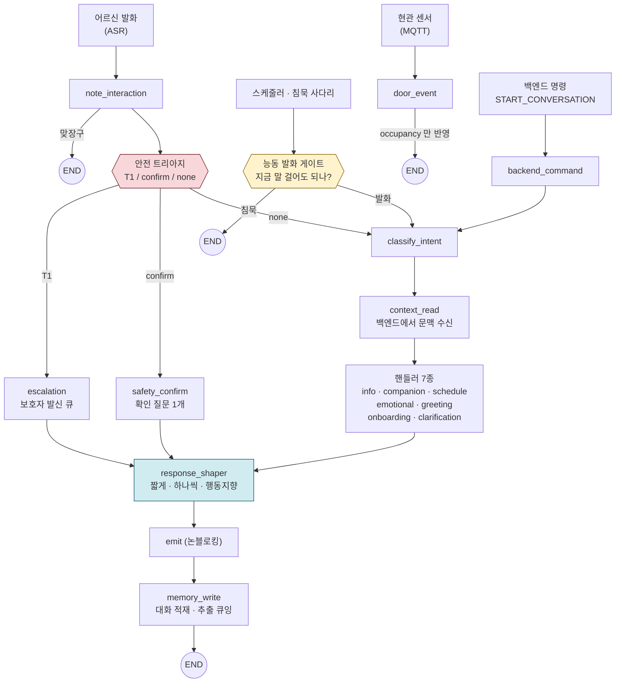
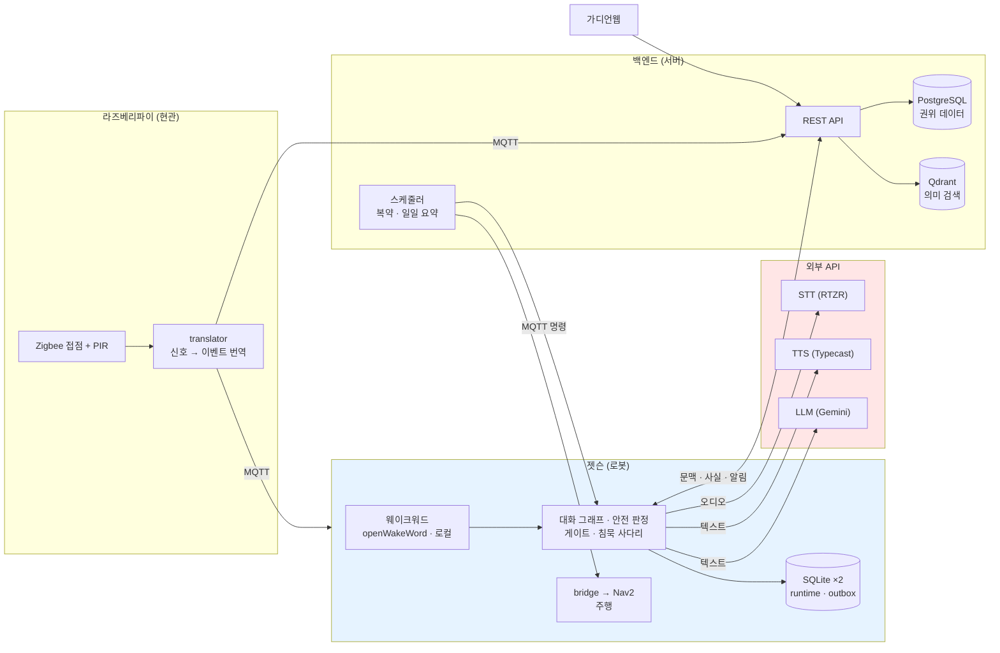

# 독거노인 능동형 돌봄 챗봇 — 설계 문서

> langgraph 기반 대화 로봇 / TTS 로봇 발화 / 보호자 연동
>
> **이 문서는 2026-07-31 착수 시점의 설계 근거 아카이브다.** 결론뿐 아니라 그에 이른
> 사고과정을 남기는 것이 목적이며, **현재 구현 상태의 기준 문서가 아니다.**
>
> | 무엇을 알고 싶은가 | 어디를 보나 |
> |---|---|
> | 왜 이렇게 설계했나 | **이 문서** |
> | 지금 무엇이 되고 무엇이 안 되나 | [`docs/carebot/진행 상황.md`](<../carebot/진행 상황.md>) |
> | 지금 상수 값이 얼마인가 | `robot/ai_chat/src/bomi_ai_chat/policy.py` |
> | 지금 계약(MQTT·HTTP)이 무엇인가 | `CLAUDE.md`, [`docs/mqtt/시나리오 계약 v1.md`](<../mqtt/시나리오 계약 v1.md>) |
>
> 본문에 `> **구현 현황(2026-08-15)**` 로 시작하는 인용 블록이 있으면, 그 위 문단은 **당시의
> 판단**이고 인용 블록이 **현행 사실**이다. 두 층을 섞어 읽지 않는다.

---

## 0. 프로젝트 정의

**목표**: 독거노인을 대상으로, 자연스러운 대화가 가능하고 사용자의 주요 정보를 기억·갱신하며, 복약 스케줄링·일정 알림·근처 병원/약국·날씨 등 생활 정보를 제공하는 챗봇.

**출력 형태**: TTS를 통해 로봇이 음성으로 말한다. (화면 UI가 주 채널이 아니다)

**프로젝트 성격**: 졸업작품·포트폴리오·학습용. 법적 책임은 상식 범위를 넘어 고려하지 않는다. 단, 자해 관련 안전선 하나는 상식 범위로 포함한다(§3.3).

**핵심 재정의**: 초기 요구사항은 "생활정보 제공 봇"에 무게중심이 있었으나, 대상이 독거노인이면 정보 제공은 부차적이다. 본체는 **안전 / 정서 / 인지** 세 축이고, 복약·날씨·병원은 그 위에 얹히는 기능이다. 최종적으로 이 프로젝트는 **정보봇이 아니라 능동형 돌봄봇**으로 정의한다.

---

## 1. 대화에 필요한 정보 — 요구사항 도출

### 1.1 안전 (초기 리스트의 최대 공백)

독거노인 서비스의 실질적 킬러 기능은 정보 응답이 아니라 **무응답 감지 + 응급 에스컬레이션**이다.

- **고독사 방지**: 일정 시간 이상 상호작용이 없으면 보호자에게 알림. 핵심은 봇이 무엇을 *말하는지*가 아니라 사용자가 아무것도 *안 하는 것*을 감지하는 것.
- **응급 트리아지**: "가슴이 아파", "어지러워" 같은 입력에서 봇이 진단하려 들면 안 된다. 심각도 판단 → 119/보호자 연결로 넘긴다. 이 경계를 안 잡으면 오히려 위험한 제품이 된다.
- **현관 재실 감지**: 현관에 문 접점 센서와 실내 PIR 을 두고, **두 신호의 순서로** 들어온 것인지 나간 것인지를 가른다. 음성 외의 독립 신호이며, 무응답 판정의 오탐을 결정적으로 줄인다 → §12.

> **§7 전체의 전제 — 안전 신호는 음성과 현관 센서 둘뿐이다.** 영상 기반 감지는 착수 시점에
> 범위 밖으로 두었고, "약한 신호 둘로 버틴다"는 §7 의 모든 설계가 이 제약에서 나왔다.
>
> **구현 현황(2026-08-15)**: 이 전제는 절반만 유효하다. 영상은 프로젝트 안으로 들어왔고
> (`robot/ai_vision/` 사람 검출·추적, 도착 후 접근 제어), 코드는 **세 번째 안전 신호를
> 스키마로 이미 받아들였다** — `rest_state`(RESTING/AWAKE/UNKNOWN)와, RESTING 이면 침묵
> 임계치에 3배를 곱하는 `RESTING_PATIENCE_MULTIPLIER`. 다만 **`rest_state` 를 채우는
> 프로덕션 코드는 아직 0건**이라(테스트에서만 세팅) 이 완화는 실제로 발동한 적이 없다.
>
> 즉 오늘의 안전 판정은 여전히 음성 + 현관 둘로 돌아가고, §7 의 논거는 그대로 유효하다.
> 비전을 안전 신호로 승격시키려면 "낮잠과 쓰러짐을 어떻게 가를 것인가"를 먼저 정해야 한다 —
> 그 판단 없이 생산자만 붙이면 §7.1 이 경고한 오탐 폭발이 새 축에서 반복된다.

### 1.2 정서 (이 로봇이 존재하는 진짜 이유)

독거노인의 1번 문제는 외로움이다. "정보봇"이 아니라 **말벗**이 본체다.

- 안부·수다 ("점심 드셨어요?")
- **회상 대화(reminiscence)**: 옛날 얘기를 묻는 것은 노인 정서·인지에 실제 치료 효과가 있다.
- 우울 신호 감지 (말수 감소, 부정 표현 증가)
- 사별·상실 대응: 배우자·친구 사별이 흔하다. 기억을 잘못 꺼내면("남편분께 전화 드리세요") 크게 상처를 준다. → 선호 저장소에 **피할 주제**를 결정적으로 강제해야 하는 이유(§4).

### 1.3 인지 지원 (놓치기 쉬운 축)

- **지남력(orientation)**: "오늘 며칠이야? 무슨 요일이야?"는 노인 대화에서 압도적으로 자주 나온다. 치매 초기에는 같은 질문을 반복한다.
  → **10번째 물어도 1번째처럼 따뜻하게 답하는 것**이 기능이 아니라 설계 원칙이다.
- 인지 자극 (간단한 퀴즈/게임)
- 대화 패턴 변화를 통한 치매 조기 신호 감지

### 1.4 건강 (복약만으로는 부족)

노인은 배고픔·갈증을 잘 느끼지 못해 **결식·탈수**가 복약보다 중요할 때가 많다. → "물 한 잔 드세요" 같은 선제적 알림. 그 외 혈압·혈당 기록, 수면.

### 1.5 생활 정보

- **날씨**: "3도"가 아니라 **"추워요, 내복 입으세요"** — 행동 지향으로. 음성 출력이라 더 중요하다.
- 근처 병원·약국
- **복지제도**: 노인맞춤돌봄서비스, 응급안전안심서비스, 기초연금 등. 보유 예정인 raw 데이터의 유력 후보.

### 1.6 TTS + 로봇이라서 생기는 제약 (놓치면 RAG가 전부 무용지물)

- **음성 출력이라 답변은 짧게, 한 번에 하나만.** RAG가 3문단을 뱉으면 귀로는 따라갈 수 없다. "짧게 말하고 되묻기" 구조가 필요하다. → 응답 정제 노드의 존재 이유.
- **청력 저하**: 짧은 문장, 천천히, 필요시 반복.
- **ASR 오류**: 사투리·발음 뭉개짐이 심하다. RAG와 분류기가 지저분한 입력에 강해야 한다.
- **개인정보/녹음 동의**: 상시 청취 로봇은 사생활 이슈가 크다. 특히 **안전 알림을 누가 받느냐**가 설계이자 윤리의 핵심이다.

---

## 2. 확정된 두 가지 방향 결정

방향을 좁히기 위해 두 질문을 먼저 확정했다.

| 질문 | 결정 |
|---|---|
| 상시 청취 + 선제 발화인가, 호출 시 반응인가? | **상시 듣고 있다가 먼저 말 거는 형태** |
| 보호자/기관 연결 구조인가, 독립 디바이스인가? | **보호자 연결됨** |

둘 다 "무거운 쪽"이라 설계 난이도가 크게 올라가는 대신, 실제 가치가 있는 물건이 된다.

### 2.1 "상시 듣고 먼저 말 건다"가 강제하는 것

대부분의 챗봇은 사용자 입력에 응답하는 reactive 구조지만, 이제 **봇이 언제 입을 열지를 스스로 판단**해야 한다. 이것은 RAG 문제가 아니라 스케줄러/상태머신 문제다. 세 종류의 발화가 섞인다.

1. **예약 발화**: 복약·식사·물 — 시간 기반이라 쉽다.
2. **감지 기반 발화**: "하루 종일 조용하네 → 안부 확인" — 무응답이 트리거.
3. **대화 응답**: 사용자가 말 걸 때 — 기존 RAG.
4. **이벤트 발화**: 현관 통과 시 배웅·환영 인사 — **즉시성이 생명**이라 다른 종류와 성격이 다르다(§12).

가장 어려운 것은 **먼저 말 거는 타이밍의 눈치**다. 새벽 3시에 "약 드세요"는 안 되고, TV 소리 나는데 끊고 들어가도 안 되고, 5분 전에 이미 말했는데 또 걸면 안 된다.
→ **"지금 말 걸어도 되는가?"를 판단하는 레이어가 대화 생성보다 위에 있어야 한다.**
→ **말 안 하는 것도 기능**이라는 것이 이 구조의 핵심 원칙이다.

상시 청취는 프라이버시 폭탄이므로, "항상 녹음"이 아니라 wake word 이후 또는 로컬 처리 후 폐기 방식을 초기에 정해야 나중에 갈아엎지 않는다.

### 2.2 "보호자 연결"이 강제하는 것

사용자가 한 명이 아니다. **노인(주 사용자)** 과 **보호자(수신자)** 가 있고, 둘의 이해관계가 충돌한다.

- 응급 상황은 당연히 올린다. 그런데 "어젯밤 외로워하셨어요", "우울 신호 보임"은?
- 이는 노인 입장에서 **감시이자 사생활 침해**다. 자식에게 다 보고되는 로봇에게는 속마음을 털어놓지 않는다. **그러면 정서 기능이 죽는다.**
- → 이 문제를 인정하고, **에스컬레이션 티어**를 명시적으로 나누는 것으로 해결한다.

이 티어를 어떻게 긋느냐가 사실상 이 제품의 윤리이자 신뢰의 핵심이다. 여기서 신뢰가 깨지면 노인이 로봇을 꺼버린다.

---

## 3. 에스컬레이션 티어 (확정)

**분류 기준 두 축**: 얼마나 급한가(시간) × 얼마나 사생활인가(동의).

### 3.1 티어 정의

| 티어 | 이름 | 내용 | 동의 | 전달 방식 |
|---|---|---|---|---|
| **T1** | 즉시 알림 | 명시적 위험 신호("가슴이 아파", "숨이 안 쉬어져"), 명시적 요청("아들한테 전화해줘", "119"), **장시간 무응답** | 불필요 | 실시간 |
| **T2** | 일일 요약 | 복약 여부, 식사·물·수면, 활동량(발화량·외출), 기분, 지남력 질문 반복의 가벼운 추세 | 불필요(통보) | 배치 1회/일 |
| **T3** | 동의 필요 | 우울 신호 누적, 외로움·사별·가족 갈등 등 속마음 | **필요** | 지연 + 동의 후 |
| **T4** | 비공유 | 일상 푸념, 회상, "우리끼리 얘기" 표시된 것 | — | 절대 미전송 |

### 3.2 각 티어의 설계 근거

- **T1**: 장시간 무응답도 여기 포함된다. 응급은 오탐보다 **미탐이 훨씬 무섭다** → 애매하면 올리는 쪽. 단 "정말 위독"이 아니면 올리기 전에 사용자에게 한 번 확인("괜찮으세요? 아드님께 연락할까요?")하는 완충을 두어 오탐 스트레스를 줄인다.
- **T2**: 개별 사건이 아니라 "오늘 하루 이랬어요" 묶음. 사생활보다 케어 데이터에 가까워 통보로 충분하다.
  > **구현 현황(2026-08-15)**: 이 배치는 **백엔드**가 돈다(`DailySummaryScheduler`, 어르신 로컬
  > 08:00 창, 항상 '전날' 분). 로봇 쪽 `daily_summary_job` 은 본문이 비어 있는 스텁이고
  > 스케줄 등록도 없다. 그리고 위 항목 중 실제로 채워지는 것은 **발화량·외출 수·지남력 반복
  > 수** 셋뿐이다 — 식사·물·수면은 기록 함수의 호출자가 0건이고, 기분 점수와 복약 예정 수는
  > 코드가 의도적으로 null 을 넣는다. 즉 오늘의 T2 는 설계가 그린 그림의 절반이다.
- **T3**: 자동 보고하면 정서 기능이 죽는 바로 그 지점. 봇이 **그 순간에는 그냥 들어주고**, 나중에 자연스러운 타이밍에 "이거 아드님께 알려드릴까요?"를 묻는다. 감정을 꺼내는 순간에 "보고할까요?"로 끊으면 최악이므로 **타이밍 분리가 필수**다.
- **T4**: 이 티어가 존재한다는 것을 사용자가 믿어야 T3가 작동한다.

### 3.3 T3의 예외 — 자해/자살 암시

**자해·자살 암시는 동의를 무시하고 T1로 올린다.** "아무한테도 말하지 마"라고 해도 예외다. 단, 봇이 상담자 흉내를 내며 붙잡고 있으려 해서는 안 된다(위험). 따뜻하게 반응하되 **사람에게 넘기는 것**이 봇의 역할이다. 학부 프로젝트라 법적 책임은 고려하지 않지만, 이 override 하나는 상식 범위의 안전선으로 포함한다.

### 3.4 동의 운용 방식

매번 묻는 것은 피곤하고 신뢰를 깎는다. 2층 구조로 간다.
1. 초기에 큰 원칙만 세팅 — "건강은 알려도 돼, 감정은 물어봐줘"
2. 민감 사건마다 개별 확인

### 3.5 런타임에서의 위치

티어 시스템은 프롬프트가 아니라 **그래프 구조**로 박힌다. 판단이 생성보다 위에 있고, langgraph의 conditional edge로 흐름이 갈라진다.

단 한 노드가 T1~T4 를 모두 분류하지는 않는다 — 티어마다 **판정하는 곳도 시점도 다르다.**

| 티어 | 누가 판정하나 | 언제 |
|---|---|---|
| **T1** | `safety_triage` 노드 (키워드·규칙, LLM 없음) | 턴 안에서 즉시 |
| **T2** | 백엔드 일일 요약 배치 | 하루 1회 |
| **T3** | 정서 핸들러가 신호를 쌓고, `consent_tick` 이 임계 돌파 뒤 동의 질문을 큐잉 | 신호 3회 + 45분 뒤 |
| **T4** | 봉인 표지("우리끼리")를 만난 자리에서 로컬 봉인 | 턴 안에서, 로봇을 떠나지 않음 |

그리고 **응급 증상이 곧바로 T1 이 되지는 않는다.** 트리아지가 내는 값은 `T1` / `confirm` /
`none` 셋이고, 증상 표현은 대개 `confirm`(확인 질문 1개)으로 간다 — §7.5 의 확인 완충이
여기 구현체다. 확인 없이 즉시 T1 인 것은 **자해 암시(§3.3)와 명시적 요청("119") 둘뿐**이다.

---

## 4. 전체 아키텍처

### 4.1 런타임 그래프 구조

아래 그림은 **현행 배선(2026-08-15)** 이다. 착수 시점의 그림은 진입 2개·노드 11개였고, 그 뒤
문 이벤트·백엔드 명령·계약 주도형 대화가 더해지면서 진입이 넷으로 늘었다.



이 그림에서 가장 중요한 것은 **END 로 가는 경로가 셋**이라는 사실이다(맞장구·침묵·문 이벤트).
"말 안 하는 것도 기능"(§2.1)이 그림 한 장에서 세 번 나타나는 셈이다.

### 4.2 이 구조에서 반드시 짚어야 할 3가지

**① 진입 경로마다 다르게 흐른다.**
사용자 발화는 곧바로 안전 트리아지로 내려간다(사용자가 먼저 입을 열었으니 "말 걸어도 되나"를 물을 필요가 없다). 반면 스케줄러·무응답 감지는 반드시 능동 발화 게이트를 통과해야 한다. 여기서 "침묵 → 턴 종료"로 빠지는 경로가 이 제품의 핵심 철학이다. 대부분의 노드가 "무슨 말을 할까"를 만드는데, 이 게이트만은 **말을 안 하기로 결정**할 수 있다. langgraph로는 게이트 노드의 conditional edge 하나가 `END`로 직행하는 것이다. (착수 때 진입은 이 둘뿐이었다. 지금은 넷이며, 어느 경로가 게이트를 거치는지는 §8.2① 의 표에 있다.)

**② 판단 노드가 생성 노드보다 위에 있다.**
안전 트리아지 → 인텐트 라우터 순서가 중요하다. 응급/자해 판별이 제일 먼저 걸러지고(T1이면 라우터를 아예 안 거치고 보호자로 감), 그다음에야 "정보냐 수다냐 일정이냐 정서냐"를 나눈다. 처리 노드들은 "어떻게 답할지"만 담당하고, "이걸 올려야 하나"는 이미 위에서 결정돼 있다.

**③ 응답 정제가 병목이자 필수 관문이다.**
4개 처리 노드가 무엇을 생성하든 전부 여기로 수렴해 TTS로 나간다. RAG가 3문단을 뱉어도 여기서 "짧게·하나씩"으로 깎인다. 음성 출력이라 이 노드가 없으면 나머지가 전부 무용지물이다.

### 4.3 이 그림에서 의도적으로 뺀 것

둘 다 "노드(흐름)"가 아니라 "저장소/상태"라서 flow 다이어그램에 넣으면 지저분해진다.

- **메모리 4종**: 특정 위치의 노드가 아니라, 처리 노드 전부가 읽고 응답 뒤에 쓰는 **공유 저장소**. 트리아지·라우터도 상태 로그를 참조하고(무응답 판별), T2 요약도 이 로그를 먹고 돈다. → §5에서 별도로 다룬다.
- **T2 요약과 T3 동의 큐의 실제 발송**: T1(즉시)만 실시간 그래프 안에서 발사된다. T2는 배치(1회/일), T3는 "정서 노드가 큐에 쌓아두고 나중에 자연스러운 타이밍에 동의를 묻는" 지연 처리이므로 사실상 **메인 그래프 밖의 비동기 잡**이다.

---

## 5. 능동 발화 게이트

### 5.1 핵심 사고 전환

**스케줄러도 무응답 감지기도 직접 말하지 않는다.** 대신 "이런 말 하고 싶은데요"라고 **후보(candidate)를 제안**만 하고, 게이트가 그것을 통과시킬지 죽일지 결정한다. 즉 게이트는 생성기가 아니라 **거름망 + 심판**이다.

후보는 `{의도, 우선순위, 예정시각, 만료시각}` 꼬리표를 달고 큐에 쌓인다.

### 5.2 결정 캐스케이드

```
      [후보 발화 도착]  의도 + 우선순위 꼬리표
              │
              ▼
   ① 아직 유효한가?  ───────막힘──▶ 폐기(드롭)
   이미 처리됨·만료 확인
              │ 통과
              ▼
   ② 지금 시간대 OK?  ──────막힘──▶ 연기(재스케줄)
   수면·조용 시간대
              │ 통과
              ▼
   ③ 쿨다운 지났나?  ───────막힘──▶ 연기(재스케줄)
   최근 발화 간격
              │ 통과
              ▼
   ④ 끼어들어도 되나?  ─────막힘──▶ 대기 후 재시도
   오디오: 대화 중?
              │ 통과
              ▼
      우선순위 중재  (후보 여럿 → 1개 선택)
              │
              ▼
          발화 → 응답 정제로
```

### 5.3 각 게이트의 설계 의도

- **① 유효성**: 후보가 큐에서 기다리는 동안 상황이 바뀔 수 있다. 9시 복약 알림이 대기 중인데 8시 55분에 사용자가 "약 먹었어"라고 말하면, 스케줄 노드가 완료 처리하며 이 후보를 무효화해야 한다. 여기서 폐기되면 재스케줄 없이 드롭. → **제안된 발화는 fire-and-forget이 아니라 취소 가능하다.**
- **② 시간대**: 수면·조용 시간대. 함정 — 새벽에 조용한 것은 위험이 아니라 자는 것이다. 그래서 시간대 정보는 게이트뿐 아니라 **무응답 시계에도 먹여야** 한다(자는 시간은 침묵 카운트에서 빼거나 임계치를 크게 높인다).
- **③ 쿨다운**: 방금 말했는데 또 말 걸면 잔소리 로봇이 된다. 마지막 발화 이후 최소 간격.
- **④ 끼어들기**: 오디오만으로 버텨야 해서 가장 불완전하다. ASR이 연속 발화를 잡고 있으면 "누군가와 대화 중 or TV" → 저우선 후보는 대기. TV와 실제 대화를 오디오만으로 구분하는 것은 사실상 불가능하므로, **완벽히 맞추려 하지 말고 "애매하면 저우선은 미룬다"로 보수적으로** 잡는다.

### 5.4 우선순위 정책 행렬 (게이트의 진짜 두뇌)

위 캐스케이드는 "저우선 후보" 기준이고, 실제로는 **우선순위별로 어느 게이트를 무시할지가 정책 행렬로 박힌다.**

| 우선순위 | 예시 | ②시간대 | ③쿨다운 | ④끼어들기 |
|---|---|---|---|---|
| **Critical** | "오래 조용하신데 괜찮으세요?" (생존 확인) | 무시 | 무시 | 무시 |
| **High** | 인슐린 등 시간 엄수 복약 | 무시 | 무시 | 존중(대기) |
| **Event** | 배웅·환영 인사 (§12) | 존중(심야엔 축약) | 무시 | 존중 |
| **Clarification** | 사실 재질의·온보딩 질문 | 존중 | 무시 | 존중 |
| **Medium** | 일반 복약·식사 | 존중 | 존중 | 존중 |
| **Low** | 물 마시기 | 존중 | 존중 | 존중 |
| **Ambient** | "날씨 좋네요" 같은 수다 | 존중 | 존중+길게 | 존중 |

"무시"는 그 게이트를 통과로 치고 지나간다는 뜻. Critical은 밤이든 대화 중이든 뚫고 나가고, Ambient는 모든 게이트를 지킨다. **이 행렬 한 장이 "언제 말하고 언제 입 다무나"의 90%를 결정한다.**

> **코드 대조(2026-08-15)**: 이 표는 `policy.PRIORITY_POLICY`·`PRIORITY_RANK`·`QUIET_TERSE`·
> `AMBIENT_COOLDOWN_MULTIPLIER=4.0` 와 **정확히 일치한다** — 이 문서에서 코드와 가장 잘 맞는
> 부분이다. 착수 이후 추가된 것은 `Clarification` 행 하나뿐이다.
> 단 `Event` 행은 §12.3 의 재정의 이후 오늘 아무도 쓰지 않는다.

### 5.5 무응답 감지의 게이트 연결

침묵 시계가 임계치를 넘을 때마다 점점 센 후보를 제안한다.
1단계 = **Low**로 가벼운 안부("점심 드셨어요?" — 생존 확인 프로브를 겸함)
→ 무응답 지속 시 2단계 = **High**로 직접 확인
→ 그래도 무응답이면 3단계 = **Critical**로 올라가 게이트를 다 뚫고 **T1 보호자 에스컬레이션으로 넘어간다.**

즉 침묵 사다리의 마지막 칸은 게이트를 떠나 에스컬레이션으로 빠진다.

### 5.6 구현 형태

> 코드: `robot/ai_chat/src/bomi_ai_chat/graph/gate.py` (튜닝 상수는 `policy.py`)

게이트는 **단일 노드**(`proactive_gate`)다. 서브그래프가 아니라 한 함수 안에서 캐스케이드를
돌린다 — 게이트 사이에 다른 노드가 끼어들 일이 없어 서브그래프로 나눌 이득이 없었다.
외부 스케줄러(APScheduler)가 그래프를 `trigger_type="proactive"` 로 깨우고, 진입 라우터가
이 노드로 보낸다. 노드 끝에서 conditional edge 가 `classify_intent` 또는 `END`(침묵)로 갈라진다.

캐스케이드에는 문서에 없는 두 게이트가 추가됐다.

- **게이트 1.2 (성능 저하)**: 지연이 누적되면 `ambient` 우선순위를 통째로 연기한다(§9 성능 저하 순서 3단계).
- **게이트 1.5 (아직 이른가)**: 제안의 `meta.not_before` 가 미래면 연기한다. T3 동의 질문의 45분 지연이 이 게이트로 지켜진다 — 없으면 지연 상수가 장식이 된다.

> **미배선 (2026-08-15, `CLAUDE.md §7` P1-a)**: 게이트는 `state["proposals"]` 만 읽고,
> **로컬 큐(`speech_proposal` 표)의 대기 제안을 state 로 싣는 코드가 없다.** 그래프를 능동
> 경로로 깨우는 유일한 호출자는 `silence_tick` 이고, 그 호출은 자기 프로브 제안을 입력에
> 직접 실어 보낸다. 결과적으로 **오늘 실제로 게이트를 통과해 발화되는 능동 발화는 침묵
> 사다리의 프로브뿐**이고, 식사·수분 권유(§1.4)·재질의·온보딩·T3 동의 질문은 큐에 쌓이기만
> 한다. 이 절의 나머지 설계는 그대로 유효하며, 빠진 것은 "큐 → state" 한 조각이다.

**게이트가 읽는 state**: `last_spoke_at`, `last_user_interaction_at`, `quiet_hours`(프로필), `pending_queue`(후보들), `audio_ctx`(대화 중 여부, best-effort), `silence_level`(침묵 사다리 단계).

---

## 6. 메모리 4종과 RAG 경계

### 6.1 핵심 통찰

"RAG 챗봇"이라는 말에 속으면 안 된다. **기억의 대부분은 매 턴 프롬프트에 그냥 밀어넣고(push), 벡터 검색으로 꺼내는(pull) 것은 딱 두 종류뿐이다.**

```
┌─ 직접 주입 · 구조화(SQL) ────┐   ┌─ 검색 주입 · 벡터 ──────────┐
│  ① 고정 프로필              │   │  ③ 에피소드 기억            │
│     약·질환·보호자·좌표      │   │     "무릎 아프다 했음"       │
│  ② 선호·성격                │   │  ⑤ 생활정보 문서            │
│     좋아함 · 피할 주제       │   │     복지제도 · FAQ          │
│  ④ 상태·이벤트 로그          │   └──────────┬─────────────────┘
│     복약·기분·활동 추이      │              ▼
└──────────┬──────────────────┘        ┌───────────┐
           │  항상                     │ 리트리버   │
           │                           │ 의미+최신성│
           │                           └─────┬─────┘
           │                    관련만       │
           ▼                                ▼
      ┌──────────────────────────────────────────┐
      │        프롬프트 컨텍스트 조립             │
      │  구조화는 항상 · 검색은 관련만            │
      └────────────────┬─────────────────────────┘
                       ▼
                     [LLM]
```

### 6.2 왜 3종은 벡터에 넣으면 안 되는가

- "내 약이 뭐야?"에 정확히 답해야 하는데, 프로필을 벡터화하면 "혈압약"과 "혈당약"의 코사인 유사도가 높아 엉뚱한 것을 꺼내온다. 이것은 fuzzy match가 아니라 **정확한 조회(exact lookup)** 문제다.
- "피할 주제(사별한 배우자)"는 확률적으로 회상되면 안 되고 **결정적으로 강제**돼야 한다.
- 복약 로그는 "오늘 약 먹었나?"에 SQL `WHERE date=today`로 딱 떨어져야 한다.

→ 이 셋은 (작으므로) 매 턴 프롬프트에 통째로 밀어넣는 것이 맞다.
→ 벡터 검색은 딱 두 곳: **에피소드 기억**(자유서술 사건)과 **긴 생활정보 문서**. 이 둘은 양이 많고, "무릎은 좀 어떠세요?"가 나오려면 의미 기반으로 관련된 것만 꺼내와야 한다.

### 6.3 각 저장소 스키마

**① 고정 프로필** (SQL, 거의 안 변함)
이름/나이 · 질환 · 복약 목록(약명·용량·복용시각) · 알레르기 · 보호자 연락처(우선순위 여럿) · 거주 좌표(병원/약국 검색용) · 수면 스케줄(게이트의 quiet hours가 여기서 옴) · 호칭

**② 선호·성격** (SQL, 태그/키-값)
좋아하는 화제(손자·화투·트로트) · **피할 주제** · 말투 선호(존댓말 수준·속도·사투리) · 말수 성향

**③ 에피소드 기억** (Vector)
`{내용, 타임스탬프, 주제태그, 감정가}`로 임베딩.
**함정**: 순수 코사인 유사도만 쓰면 6개월 전 무릎 얘기가 어제 무릎 얘기를 이긴다. → 검색 점수에 **최신성 감쇠(time-decay)를 곱해야** 한다.

**④ 상태·이벤트 로그** (SQL, 시계열)
복약 여부 · 식사·물·수면 · 일일 기분 · 활동량(하루 발화량) · 마지막 상호작용 시각. 안전 감지와 T2 요약이 이것을 먹고 돈다.

### 6.4 쓰기 경로 (요구사항의 "업데이트되는" 부분)

매 세션/턴 끝에 추출 노드가 대화에서 새 사실을 뽑아 각 저장소에 반영한다.

- **안전상 필수**: **프로필, 특히 복약 정보는 자동 커밋하면 안 된다.** 사용자가 "이제 혈압약 아침에 안 먹어"라고 웅얼거린 것을 ASR이 잡아 봇이 조용히 복약 스케줄을 지워버리면 위험하다. 건강·복약 변경은 **플래그만 세우고 사용자 확인 또는 보호자 노출**로 처리한다.
- **에피소드 기억**은 대체로 append-only. 대신 무한히 부풀지 않도록 **정리(consolidation)** 가 필요하다 — 오래되고 사소한 것은 감쇠/삭제하고, 중요한 것(손자 이름 등)은 프로필·선호로 **승격**시킨다.

### 6.5 지남력 반복 문제의 해결

"10번째 물어도 1번째처럼"이 저장소 분리로 깔끔하게 풀린다.

- 응답 생성은 **매번 새로 따뜻하게** — 반복 사실을 프롬프트에 넣지 않는다("이미 9번 말함" 같은 것이 톤에 새면 최악).
- 반복 자체는 **상태 로그(④)에 기록** — 지남력 질문 반복 증가는 인지 저하 신호이므로 T2로 보호자에게 추세로 올라간다.

→ **기록은 하되 톤에는 절대 안 새게, 저장소를 나눠서 강제한다.**

### 6.6 "생활정보"도 전부 RAG가 아니다

| 정보 | 처리 방식 |
|---|---|
| 병원·약국 | 좌표 기반 지오 쿼리 또는 Places API |
| 날씨 | API 호출 |
| 복지제도·FAQ 등 긴 설명 문서 | **벡터 RAG** |

다이어그램의 ⑤ "생활정보 문서"는 마지막 것만 가리킨다. (①~④ 는 이 사람에 대한 기억이고,
⑤ 만 사람과 무관한 공용 자료다 — 그래서 유일하게 어르신별로 나뉘지 않는다.)

### 6.7 구현 형태

> 코드: `graph/context.py`(문맥 수신·분류) + `graph/build.py` 의 `memory_write`

두 개의 노드로 박힌다.
- 응답 생성 **앞**: `memory_read`(현행 이름 `context_read`) — 구조화는 통째 로드 + 리트리버로 관련 에피소드/문서 pull → 컨텍스트 조립
- 생성 **뒤**: `memory_write` — 추출 → 구조화 업데이트(민감건 플래그) + 에피소드 임베딩 append + 로그 기록

처리 노드 전부가 이 두 노드를 공유한다.

---

## 7. 안전 트리아지 (약한 신호로 버티기)

### 7.1 가장 위험한 착각

재실 여부는 현관 센서(§12)가 알려주지만, **집 안에서 무사한지를 알려주는 신호는 사실상 음성뿐**이다. 여기서 가장 위험한 착각은 **"무응답 시간 = 위험"** 이라고 단순 카운트하는 것이다. 자는 것, 외출한 것, 그냥 말 안 하는 것, TV 보는 것이 전부 "무응답"으로 잡히면 오탐이 폭발하고, 오탐이 쌓이면 보호자가 알림을 무시하기 시작해 **정작 진짜 응급을 놓친다.**

→ 핵심 설계: **침묵을 재는 것이 아니라 침묵을 능동적으로 테스트한다.**

### 7.2 능동 프로브 에스컬레이션 사다리

```
   [무응답 시간 증가]  마지막 상호작용 기준
            │
            ▼
   예상된 부재인가?  ──── 예 ────▶ 대기(정상)
   수면 · 외출 · 루틴 기준
            │ 무응답
            ▼
   프로브 ① 가벼운 안부  ── 응답 ──▶ 리셋 · 안심
   "점심 드셨어요?"
            │ 무응답
            ▼
   프로브 ② 직접 확인    ─ 응답·소리 ▶ 안심
   + 주변 소리 체크
            │ 무응답
            ▼
   프로브 ③ 반복 · 강하게 ── 응답 ──▶ 리셋 · 안심
   응답 마지막 기회
            │ 무응답
            ▼
   보호자 에스컬레이션 (T1 즉시 알림)
```

### 7.2a 구현된 사다리 (2026-08-15)

| 칸 | 우선순위 | 문구 | 누적 침묵 |
|---|---|---|---|
| 1 | low | "점심 드셨어요?" | 3시간 |
| 2 | high | "어르신, 괜찮으세요?" | +45분 |
| 3 | critical | "어르신, 대답 좀 해주세요." | +20분 |
| — | — | T1 보호자 에스컬레이션 | 그 뒤에도 무응답 |

문서에 없는 제약 둘.

- **한 틱에 한 칸만** 올라간다. 경과가 3칸에 해당해도 점프하지 않는다 — 부팅 직후나 시계
  점프로 어르신이 갑자기 critical 프로브를 듣는 일을 막는다.
- critical 프로브는 **미리 만들어 둔 로컬 오디오**를 쓰기로 설계했다. 네트워크 없이 동작해야
  하고, 그게 바로 이 프로브가 가장 중요한 상황이기 때문이다. **그런데 캐시를 채우는
  프로덕션 코드가 없어서**(등록 함수의 호출자가 테스트뿐) 실기에서는 "캐시 없음" 경고가
  항상 뜨고 매번 합성한다 — 즉 **가장 중요한 순간에 네트워크가 필요한 상태**다.

### 7.3 각 단계의 설계 의도

**루틴 판단이 오탐을 죽이는 1차 방어선.**
무응답의 트리거는 "몇 시간 조용함"이 아니라 **"조용할 리 없는 시간에 조용함"** 이어야 한다. 상태 로그(④)에서 이 사람의 리듬을 학습해두면(보통 몇 시에 깨고, 화요일엔 경로당 가서 오후 내내 조용하고) 그 패턴과 **일치하는 부재는 알람이 아니다.** 여기에 **재실 상태(occupancy)** 를 더하면 "밖에 나간 것"과 "쓰러진 것"을 가를 수 있다. 초기 설계에서는 "나 마트 다녀올게" 같은 발화에 의존하는 best-effort였으나(말 없이 나가면 무용), 현관 센서(§12)가 그것을 하드웨어 근거로 바꾼다.

> **구현 현황(2026-08-15)**: 부재 판정 필터 넷 중 **루틴 베이스라인은 아직 코드가 없다**
> (`jobs/ticks.py` 에 "★ 아직 구현되지 않았다" 주석만). 오늘 실제로 도는 필터는
> ① `occupancy == AWAY` ② quiet hours ③ `rest_state == RESTING` 이면 임계치 ×3(정지가 아니라
> 지연) 셋이다. `UNKNOWN` 은 **의도적으로 통과**시켜 보수적으로 사다리를 돌린다 — 라즈베리파이
> 하나가 죽었다고 안전 감시가 통째로 꺼지면 안 되기 때문이다.
>
> 그리고 위 문단의 "승격"은 아직 절반이다 — **로봇은 `AWAY` 를 스스로 만들지 못한다.**
> 방향 판정이 백엔드에 있으므로(§12), 네트워크가 끊긴 동안의 외출은 감지되지 않고
> `occupancy` 는 `UNKNOWN` 에 머문다.

**프로브가 모호한 침묵을 응답 있는 테스트로 전환.**
수동적으로 재기만 하면 영원히 애매하지만, 봇이 먼저 물으면 "응답 or 무응답"이라는 명확한 신호가 생긴다. 이 프로브는 §5.5의 게이트 후보와 **같은 것**이다(Low → High → Critical). 게다가 "점심 드셨어요?"는 안부이자 말벗이라 **감시처럼 느껴지지 않는 것**이 중요하다.

**주변 소리는 약한 보조 신호.**
ASR로 단어를 못 잡아도 마이크는 TV·발소리·설거지 같은 비언어 소리로 "사람이 활동 중"이라는 약한 증거를 얻는다. 프로브에 응답은 없는데 생활 소음이 계속되면 완전한 정적보다는 덜 위험하다. 단 매우 약한 신호이므로(TV 켜놓고 나갔을 수도, 켜놓고 쓰러졌을 수도) **단독 판단 금지**, 점수를 조금 올리고 내리는 용도. 프라이버시상 **로컬에서 소리 유무만 판정하고 녹음·저장하지 않는다.**

### 7.4 에스컬레이션 결정 방식과 정직한 프레이밍

에스컬레이션 결정은 하나의 임계치가 아니라 **여러 약한 신호를 합친 신뢰도 점수**다.
> 예상 대비 편차 + 프로브 실패 횟수 + 주변 소리 유무 + 시간대

음성 신호만으로는 완벽히 풀 수 없다. 그래서 학부 프로젝트다운 정직한 접근은 —
**"완벽히 맞히려 하지 말고, 오탐을 값싸게 만든다."**

마지막 에스컬레이션도 119 직통이 아니라 보호자에게 "괜찮으신지 확인 좀"으로 보내 보호자가 1초 만에 dismiss할 수 있게 한다. 그러면 임계치를 공격적으로 낮춰도(미탐↓) 비용이 감당된다. 이 임계치는 **튜너블 다이얼**로 빼둔다.

### 7.5 명시적 신호 경로 (반응형 가지)

사용자가 말을 *했을 때* 트리아지가 내용을 먼저 분류하는 가지. 함정 두 개:

1. **부정·시제가 생명**: "안 아파", "어제 아팠어"를 "아파"로 오분류하면 안 되는데, ASR 노이즈에 노인 발음까지 겹치면 키워드 매칭이 쉽게 틀린다. → 단일 히트로 바로 T1 올리지 말고 **확인 완충**("괜찮으세요? 아드님께 연락할까요?")을 한 번 거치되, 위험 쪽으로 recall을 높게 잡는다.
2. **자해·자살 암시는 동의 무시 T1**(§3.3) — 봇이 상담자 흉내로 붙잡지 말고 사람에게 넘긴다.

### 7.6 구현 형태

> 코드: `graph/triage.py`(트리아지·확인 질문·에스컬레이션) + `jobs/ticks.py` 의 `silence_tick`

- 트리아지는 반응형 진입의 첫 노드(내용 분류 → T1이면 라우터 건너뜀)
- 침묵 사다리는 게이트와 상태를 공유하는 **백그라운드 스테이트머신** — `silence_level`을 올리며 프로브 후보를 게이트에 넣다가, 사다리 끝에서 에스컬레이션 판정으로 넘어간다.

---

## 8. langgraph 구현 뼈대

> 실제 코드: `robot/ai_chat/src/bomi_ai_chat/graph/` 패키지.
> `build.py`(배선) · `ingress.py`(진입 네 갈래) · `gate.py`(능동 발화 게이트) ·
> `triage.py`(안전) · `context.py`(문맥·분류) · `handlers.py`(7개 핸들러) · `output.py`(정제·발화).
> 튜닝 상수는 전부 `policy.py` 에 있다.

### 8.1 State 스키마

한 번의 그래프 실행(=한 턴) 동안 흐르는 값들.

> **아래 코드 블록은 2026-07-31 착수 시점의 스케치다. 정본은
> `robot/ai_chat/src/bomi_ai_chat/state.py` 의 `ConvState` 이며 지금은 40개 이상의 키를 갖는다.**
> 이 블록은 "무엇을 state 에 두고 무엇을 저장소에 둘 것인가"라는 **판단 기준**을 보여주기 위해
> 남긴다. 실제 키 이름으로 코드를 찾으면 안 된다.
>
> 착수 이후 바뀐 것 중 의미가 큰 것만:
>
> | 스케치 | 현행 | 왜 |
> |---|---|---|
> | `trigger_type` 2종 | **4종** — `user_utterance` / `proactive` / `door_event` / `backend_command` | 문 이벤트(§12)와 백엔드 명령이 독립 진입이 됐다 |
> | `candidates` | `proposals: list[SpeechProposal]` | 타입을 붙였다 |
> | `away: bool` | `occupancy` 3값 + `occupancy_observed_at` + `rest_state` | 이진 플래그로는 "모른다"를 표현할 수 없다(§12.1) |
> | `retrieved: list` | `retrieval_status` + `ctx_is_cached` + `memory_top_k` | 로봇이 직접 검색하지 않게 되면서, "무엇을 받았나"보다 "왜 못 받았나"가 중요해졌다 |
> | `safety_level` 5값 | `"confirm"` 추가 | 키워드 한 번에 보호자를 부르지 않기 위한 중간 상태(§7.5) |
> | `intent` 4종 | **7종** — + `greeting` / `onboarding` / `clarification` | 백엔드 주도 인사와 계약 주도형 대화가 생겼다 |

```python
class ConvState(TypedDict, total=False):
    # 진입
    trigger_type: Literal["user_utterance", "proactive"]
    user_input: str
    messages: Annotated[list, add_messages]

    # 능동 발화
    candidates: list[dict]
    gate_decision: Literal["speak", "silent"]

    # 분류 결과
    safety_level: Literal["T1", "T2", "T3", "T4", "none"]
    intent: Literal["info", "companion", "schedule", "emotional"]

    # 메모리
    ctx: dict          # profile+prefs+recent : 항상 push
    retrieved: list    # episodic+docs        : 관련만 pull

    # 출력
    response: str
    final_utterance: Optional[str]   # None = 침묵
    escalation: Optional[dict]

    # barge-in (§10)
    speaking: bool                          # TTS 재생 중
    spoken_prefix: str                      # 어디까지 말했는가
    interrupted_remainder: Optional[dict]   # 중단된 잔여분 (재큐 대상)

    # 런타임 지속값 (checkpointer가 thread_id별로 보존)
    last_spoke_at: float
    last_user_interaction_at: float
    silence_level: int
    away: bool
    occupancy: Literal["home", "away", "unknown"]   # 현관 센서 기반 (§12)
    last_door_event: Optional[dict]                 # {direction, ts}
    audio_ctx: dict
```

### 8.2 배선에서 반드시 이해할 포인트

**① 진입이 conditional edge로 갈라진다.**
`add_conditional_edges(START, route_ingress, ...)` 한 줄이 입구 전부다. 착수 때는 두 개(능동/반응)였고 지금은 **네 개**다.

| `trigger_type` | 첫 노드 | 게이트 | 비고 |
|---|---|---|---|
| `user_utterance` | `note_interaction` → `safety_triage` | **안 거침** | 말을 건 사람에게 대답할 허락은 필요 없다 |
| `proactive` | `proactive_gate` | **필수** | 스케줄러·침묵 사다리 |
| `door_event` | `door_event` → END | — | 사실만 반영하고 끝 (§12.2) |
| `backend_command` | `backend_command` | **안 거침** | 이미 판정한 쪽에서 왔다. 다시 심사하면 심판이 둘이 된다 |

세 경로(문 이벤트 제외)는 `classify_intent`에서 합쳐져 처리·정제·쓰기 로직을 한 번만 작성한다.

**② "침묵도 기능"은 코드에서 `END`로 가는 엣지 하나다.**
`route_gate`가 `"silent"`일 때 `END`를 리턴한다. 게이트가 후보를 다 떨궈 `survivors`가 비면 조용히 턴이 끝난다. langgraph에서 "말 안 하기"는 응답을 안 만드는 것이 아니라 **그래프가 발화 노드에 도달하지 못하게 하는 것**이다.

**③ 우선순위 정책이 데이터로 빠져 있다.**
`PRIORITY_POLICY` 딕셔너리가 §5.4의 행렬이다. 게이트 로직은 건드리지 않고 이 표만 고쳐 "인슐린은 밤에도 뚫고 나가되 대화 중엔 기다린다"를 바꿀 수 있다. 트리아지 임계치도 상수로 빼두면 오탐 튜닝 시 로직을 안 건드린다.

**④ 메모리의 push/pull 구분이 `memory_read` 안에 그대로 있다.**
`ctx`(profile·prefs·recent)는 무조건 로드, `retrieved`는 현재 발화 기반으로만 pull.

**⑤ 침묵 사다리는 그래프 밖이다.**
`silence_tick`은 노드가 아니라 **그래프를 깨우는 스케줄러**다. 주기적으로 돌며 무응답이 예상 밖이면 후보를 만들어 `app.invoke(..., trigger_type="proactive")`로 그래프를 부르고, 사다리가 소진되면 트리아지를 건너뛰고 바로 T1을 세팅해 부른다. langgraph 자체는 요청-응답이므로 **"먼저 말 거는" 능동성은 이 외부 틱이 만들어낸다.**

**⑥ checkpointer가 런타임 상태의 절반을 담당한다.**
`thread_id`(=사용자 id)별로 `last_spoke_at`·`silence_level`·`away` 등이 실행 사이에 보존된다. 이는 §6의 장기 메모리(SQL/벡터)와 별개다 — **짧은 런타임 상태는 checkpointer, 장기 사실은 MemoryStore.**

### 8.3 노드 목록

| 노드 | 역할 |
|---|---|
| `note_interaction` | 반응형 첫 노드. 시계·사다리 리셋, occupancy 정정, 맞장구 판정 |
| `door_event` | occupancy 만 반영하고 END (인사 제안 없음 — §12.2) |
| `backend_command` | 백엔드 발화 명령을 턴 입력으로 편다. 게이트를 거치지 않는다 |
| `proactive_gate` | 제안을 게이트에 통과 + 우선순위 중재 → speak/silent |
| `safety_triage` | 자해·응급 판별 → T1이면 라우터 건너뜀 |
| `safety_confirm` | 확인 질문 1개("많이 불편하세요? 가족분께 연락드릴까요?"). LLM·문맥 조회 안 함 |
| `escalation` | T1 을 발신 큐에 적재 + 어르신에게 차분한 응답 |
| `classify_intent` | 인텐트 분류 (능동·명령 턴은 이미 정해져 있어 통과) |
| `context_read` | 백엔드에서 조립된 문맥 수신 + 표현 이력 조회 (구 `memory_read`) |
| `handle_info` | 참고 자료로 사실 응답 |
| `handle_companion` | 안부·잡담·회상. 침묵 프로브도 여기로 |
| `handle_schedule` | 복약·일정 발화 + "먹었어" 완료 처리 |
| `handle_emotional` | T3: 듣기 + 신호 누적 / 동의 질문·답 처리 |
| `handle_greeting` | 백엔드가 내려준 문구를 그대로 발화 |
| `handle_onboarding` | 공용 질문 세트 음성 진행 (계약 주도형) |
| `handle_clarification` | 사실 후보의 빠진 필드 한 개 재질의 (계약 주도형) |
| `response_shaper` | TTS용 정제 — 짧게·하나씩·행동지향 |
| `emit` | TTS 발화 (논블로킹) |
| `memory_write` | 대화 적재 + 사실 추출 큐잉 + 표현 이력 기록 |

**배선에서 스케치와 달라진 순서 두 가지.**

- `classify_intent` 가 `context_read` **앞**이다. 뒤에 두었더니 반응형 발화의 intent 가 아직
  비어 있어서 "복지제도 알려줘"조차 문서 조회 없이 나갔다.
- `emit` 이 `memory_write` **앞**이다. `memory_write` 는 블로킹 HTTP 를 부르므로, 순서가
  뒤집히면 T1 확인 응답조차 통계성 기록 뒤에 줄을 선다.

---

## 9. 기술 스택

### 9.0 무엇이 어디서 도는가 (2026-08-15)

아래 표를 읽기 전에 배치부터 본다. §9.1 의 "위치" 열이 착수 계획과 크게 달라진 이유가 이 그림에 있다.



**빨간 상자로 나가는 화살표가 프라이버시 경계다. 오디오 화살표가 하나 있다는 사실이 §9.1 의
프라이버시 서술을 정한다.**

### 9.1 결정 사항

| 레이어 | 선택 | 위치 | 비고 |
|---|---|---|---|
| STT (ASR) | RTZR(VITO) `sommers` | **외부 API** | 마이크 → `user_input` 구간. 오디오 파일을 업로드한다 |
| TTS | Typecast `ssfm-v30` | **외부 API** | `emit` 노드가 호출. 합성 오디오를 내려받아 재생 |
| 현관 센서 | 라즈베리파이 + Zigbee (문 접점 SNZB-04P, PIR SNZB-03P) | 현관 · 별도 노드 | 센서 신호를 MQTT 이벤트로 번역만 한다. 방향 판정은 백엔드(§12) |
| VAD | Silero VAD | 로컬 | §5.3④ 끼어들기 게이트, §7.3 주변 소리 판정의 실제 구현체 |
| Wake word | openWakeWord | 로컬 | 상시 청취의 프라이버시 경계(§2.1). **로컬 추론은 이것뿐이다** |
| 벡터 스토어 | **Qdrant** (pgvector 탈락 — §9.2) | **서버** | 로봇은 직접 조회하지 않는다 |
| 구조화 저장소 | Postgres | **서버** | 메모리 push 3종(§6.3)은 백엔드가 조립해 HTTP 로 내려준다 |
| 로봇 로컬 저장소 | SQLite 2개 (`runtime.sqlite` / `outbox.sqlite`) | 로컬 | 운영 상태·발화 제안 큐·보호자 발신 큐·추출 큐 |
| langgraph checkpointer | SQLite (`runtime.sqlite` 공유) | 로컬 | 런타임 지속값(§8.2⑥). 서버 DB 면 매 턴 네트워크 왕복이 붙는다 |
| 임베딩 | Upstage solar-embedding 계열 | **외부 API** | §9.3 |
| LLM | Gemini 2.5 Flash Lite (SSAFY GMS 프록시 경유) | **외부 API** | 지연 예산 2초. 턴당 생성 호출 1회 |
| 스케줄러 | APScheduler | 로컬 | §9.4 |
| 보호자 알림 채널 | 백엔드 REST + 가디언웹 폴링 | 서버 | §9.5 — 인터페이스 고정 전략이 통했다 |

**연산 위치 원칙** *(2026-08-15 정정 — 착수 당시의 계획과 다르게 굳었다)*: 로봇에 남은 것은
**웨이크워드 감지·대화 그래프·안전 판정·발신 큐**다. 나머지는 밖으로 나갔다 — STT·TTS·LLM 은
외부 API 이고, 장기 기억과 의미 검색은 백엔드(서버 Postgres + Qdrant)가 맡는다.

> **이 자리에는 원래 "음성은 로봇을 떠나지 않고, 텍스트만 외부로 나간다"가 적혀 있었다.
> 그 문장은 현재 구현에서 사실이 아니므로 발표·문서에 쓰면 안 된다.** STT 가 오디오 자체를
> 외부(RTZR)로 업로드하기 때문이다.
>
> 지금 말할 수 있는 프라이버시 경계는 이것이다 — **웨이크워드('보미야')를 로컬에서 감지하기
> 전까지는 아무것도 밖으로 나가지 않는다.** 상시 녹음도, 상시 업로드도 없다. 웨이크워드 이후
> 한 발화 구간의 오디오만 인식을 위해 나간다. 주변 소리 판정(§7.3)과 맞장구 판정(§10.2②)은
> 로컬에서만 하고 저장하지 않는다.
>
> 원래 문장을 되살리고 싶다면 온디바이스 STT 로 바꾸는 별도 결정이 필요하다.

### 9.2 벡터 스토어: pgvector 를 골랐다가 차원 때문에 놓아준 기록

> **결론(2026-08 갱신)**: 아래 논거로 pgvector 를 골랐지만, 임베딩 모델의 차원(4096)이
> pgvector 의 인덱싱 상한(vector 2,000 / halfvec 4,000)을 넘어 **Qdrant 로 옮겼다**
> (S15P11E102-218, `V5__add_embedding_sync_columns.sql`). 아래 두 논거 중 "규모가
> 안 맞는다"는 지금도 맞고, "아키텍처가 안 맞는다"는 그 차원 제약 하나에 무너졌다.
> §9.3 의 확인사항 1번이 실제로 이 결론을 만들었다 — **미결이 미결로 남지 않고 결정을
> 뒤집은 드문 사례라 기록으로 남긴다.**

후보였던 Pinecone을 채택하지 않은 이유는 두 가지다.

**규모가 안 맞는다.** 사용자 1명의 에피소드 기억은 하루 수십 개씩 쌓여도 연 단위로 만 단위이고, 복지제도 문서도 수천 청크 수준이다. Pinecone이 해결하는 문제(수백만~수억 벡터의 분산 검색)가 이 프로젝트에서는 발생하지 않는다.

**아키텍처가 안 맞는다.** 이 설계는 push 저장소 3종이 이미 SQL이고(§6.3), checkpointer도 Postgres를 쓸 수 있다. pgvector로 통합하면:

- §6.3의 **최신성 감쇠(time-decay)를 벡터 유사도와 같은 SQL 쿼리 한 번**으로 계산 가능 (`WHERE user_id = ...` 필터 포함)
- 프로필·로그와 조인 가능. 별도 서비스면 앱 코드에서 두 번 왕복하며 수동으로 합쳐야 한다
- ~~로컬 오프라인 동작 → 시연 시 네트워크 사고 없음~~
  **이 이점은 실현되지 않았다.** 벡터·구조화 저장소가 서버로 갔으므로 의미 검색은
  네트워크에 의존한다. 대신 로봇은 마지막 성공 문맥을 `context_cache`(SQLite)에 1행 보관하고,
  끊기면 그것으로 답하되 `ctx_is_cached=True` 를 세워 단정적으로 말하지 않는다.

> 가벼운 대안(Chroma, LanceDB)도 가능하지만 어차피 SQL이 필요하므로 하나로 통합하는 편이 낫다.

### 9.3 임베딩: 확인 필요 사항 2개

한국어 성능 근거로 Upstage를 채택. 단 착수 전 실측·확인할 것:

1. **벡터 차원 수 vs pgvector 인덱스 제한.** pgvector의 HNSW 인덱스에는 차원 상한이 있어, 고차원 모델은 인덱스를 걸지 못하고 full scan이 된다. 본 프로젝트 규모(수천~수만 벡터)에서는 full scan도 견딜 가능성이 높지만, **모델 차원과 사용 버전의 pgvector 제한을 직접 확인**한다.
   → **확인 결과(S15P11E102-218)**: solar-embedding-1-large 는 **4096차원**이고 pgvector 0.8.5 의
   인덱싱 상한은 vector 2,000 / halfvec 4,000 이다. halfvec 으로도 인덱스를 만들 수 없어
   **Qdrant 로 옮겼다**(§9.2). 한국어 품질 때문에 Upstage 를 포기할 수 없다는 판단이 먼저였다.
2. **외부 API라는 점.** "로봇에 다 넣는다"의 예외. 저장 임베딩은 턴 경로 밖이라 대화 지연에 영향이 없다.
   → **정정**: **질의 임베딩은 턴 경로 안**이다. 그래서 백엔드 응답이 로봇에 돌려주는
   상태에 `embeddingLatencyMs` 와 `vectorSearchLatencyMs` 가 따로 들어 있다 — 재는 이유가
   턴 지연 예산(2초) 안에 있기 때문이다. 지연이 누적되면 성능 저하 1단계가 검색 개수를
   6 → 2 로 낮춘다.

### 9.4 APScheduler

파이썬 프로세스 내부에서 도는 스케줄러(cron을 코드 안에서 쓰는 것에 가깝다). 별도 서버가 필요 없어 이 규모에 충분하다. 등록된 작업은 **7개**이며 전부 `coalesce=True, max_instances=1` 이다(밀린 실행이 한꺼번에 몰리면 로봇이 연달아 말하게 된다).

| 틱 | 주기 | 하는 일 |
|---|---|---|
| `silence_tick` | 60초 | §8.2⑤ 침묵 사다리. 그래프를 능동 경로로 깨우는 **유일한** 곳 |
| `door_watch_tick` | 60초 | 현관 하트비트 끊김·문 방치·미귀가 감시 |
| `schedule_tick` | 60초 | 식사·수분 시각에 제안을 큐에 투입 |
| `contract_tick` | 10분 | 재질의·온보딩 질문 큐잉 (계약 주도형 대화) |
| `consent_tick` | 10분 | T3 동의 질문 큐잉 (신호 3회 누적 + 45분 지연 뒤) |
| `outbox_flush` | 30초 | 보호자 알림 발신 큐 배출 |
| `extraction_flush` | 60초 | 사실 추출 큐 배출 + "기억하지 마" 서버 취소 |

**복약은 이 스케줄러가 다루지 않는다.** 로봇에 `care_record` 를 읽는 경로가 없어서, 복약
알림은 백엔드 스케줄러가 창(예정−lead ~ 예정+15분)을 판정하고 `START_CONVERSATION` 으로
내려보낸다.

**주의 — 가짜 시계와 충돌한다.** APScheduler는 실제 시간으로 동작하므로, §11의 압축 시계를 쓸 때는 스케줄러를 우회하고 틱을 수동으로 밀어넣는 테스트 경로가 별도로 있어야 한다. 이 두 경로는 처음부터 함께 설계한다.

### 9.5 보호자 알림 채널 (결정됨 — 인터페이스 고정 전략이 통했다)

착수 때는 공백으로 두고 **인터페이스만 고정**했다. 아키텍처상 이 채널은 `escalation` 노드 끝의 **어댑터 한 개**에 불과하므로, 인터페이스만 있으면 웹앱·푸시(FCM)·문자 중 무엇으로든 교체 가능하다고 판단했다.

**결과(2026-08-15)**: 그 판단은 맞았고, 아래 시그니처는 **한 글자도 바뀌지 않은 채**
`notify/base.py` 의 `GuardianNotifier` 프로토콜이 됐다. 구현은 두 개다 —
`LoggingGuardianNotifier`(자리표시자, 로그만) 와 `BackendGuardianNotifier`(실채널).

현재 경로: `escalation` → 로컬 발신 큐(`outbox.sqlite`) → `outbox_flush` 틱 →
`POST /api/v1/robot/guardian-alerts` → 백엔드가 `care_record` 한 행 기록 → **가디언웹이 폴링**.

두 가지를 분명히 해 둔다.

- **큐가 어댑터보다 먼저다.** 에스컬레이션은 저장(동기)이 전송보다 앞이고, 실제 전송은 틱이
  한다. 네트워크가 끊긴 순간에 알림이 사라지면 안 되는데, 하필 그 순간이 알림이 가장 중요한
  순간이기 때문이다. T1 은 시도 횟수로 포기하지 않는다 — `OUTBOX_MAX_ATTEMPTS` 에 T1 항목이
  아예 없고, 백오프 상한(600초) 안에서 재시도를 이어간다.
- **아직 "푸시"는 없다.** 백엔드에 FCM/APNs/SMTP/WebPush 코드가 0건이다. 보호자는 가디언웹을
  열어야 본다. 즉 **어르신이 쓰러진 밤에 보호자 휴대폰이 울리지는 않는다** — 이것이 이
  프로젝트에 남은 가장 큰 안전 공백이며, 이 절의 어댑터 자리에 실제 푸시 구현을 끼우는 것이
  그 해소 방법이다.

```python
def notify_guardian(tier: str, payload: dict) -> None: ...
```

- **T1**: 이 함수를 그래프 안에서 즉시 호출
- **T2 / T3**: 그래프 밖 비동기 잡이 같은 함수를 호출 (§4.3)

> 착수 시점의 잠정 방향은 "웹앱, 필요 시 앱 제작"이었다. 웹앱까지는 그대로 갔고, 앱(푸시)은
> 아직 만들지 않았다.

---

## 10. barge-in 정책

로봇이 말하는 중에 사용자가 끼어들 때의 처리. 노인 대상이라 일반 음성 비서와 다르게 간다.

> **구현 현황(2026-08-15) — 설계는 살아 있고, 라이브에서는 꺼져 있다.**
> 필요한 기계는 전부 있다: 에코 가드(`audio/echo_guard.py`), 비블로킹 재생과 진행 위치 추적
> (`audio/playback.py`), 잔여분을 원래 우선순위로 되돌리는 재큐(`graph/gate.py`).
> 그런데 **웨이크워드 대화 루프는 barge-in 을 의도적으로 빼고 반이중으로 돈다** — 응답 재생이
> 끝날 때까지 기다린 뒤 마이크를 연다(`bootstrap.py` 의 `_wait_for_playback`). 재생 중 마이크를
> 열면 로봇이 자기 목소리를 어르신 발화로 수음하는 문제(§10.2①)를 아직 실기에서 잡지 못했기
> 때문이다. 되살리는 지점은 코드에 남아 있다: 이 대기를 없애고 에코 가드를 '캡처'에 연결한다.

### 10.1 기본 정책: 겹치면 로봇이 양보 (yield-first)

청력 저하 때문에 사용자는 로봇이 말하는 중인 것을 모르고 말할 수 있다. 그때 로봇이 계속 떠들면 대화가 무너진다. **사용자 발화가 항상 더 가치 있는 신호**이므로 로봇이 멈춘다.

단, "소리 나면 멈춤"이라는 단순 구현은 세 군데서 깨진다.

### 10.2 깨지는 지점 3개와 대응

**① 로봇이 자기 목소리를 듣는 문제 (echo)**
스피커와 마이크가 같은 몸통에 있어 TTS 출력이 마이크로 되돌아오고, 로봇이 자기 말에 자기가 멈춘다. → AEC(음향 에코 제거)를 적용하거나, 최소한 **TTS 재생 중 VAD 임계치를 높이고 재생 시작 후 약 300ms는 무시**하는 완충을 둔다. 이것을 먼저 잡지 않으면 barge-in이 오작동으로만 관찰된다.

**② 맞장구를 끼어들기로 오해하는 문제**
노인 대화에서 "응", "어", "그래", "그래서?" 같은 짧은 맞장구가 매우 잦다. 여기서 멈추면 로봇이 한 문장도 끝내지 못한다. → **1초 미만이고 맞장구 목록에 걸리면 계속 말한다.** 그 외에는 양보. 목록은 상수로 분리해 튜닝 가능하게 한다.

**③ 반쯤 말한 내용이 사라지는 문제 (가장 중요)**
"혈압약 두 알 드시고, 인슐린은—" 에서 끊기면 위험하다. → 발화를 **문장 단위로 쪼개어 TTS에 순차 투입**하고 `spoken_prefix`로 진행 위치를 추적한다. 중단되면 잔여분을 **원래 우선순위로 후보 큐에 되돌린다.** 그러면 §5.3①의 유효성 게이트가 중복을 걸러주고, 사용자 응답 처리가 끝난 뒤 자연스럽게 이어서 말할 수 있다.

> 이것이 `response_shaper`(§4.2③)와 맞물린다. 이미 "짧게·하나씩"으로 깎고 있으므로 **문장 경계가 곧 안전한 중단 지점**이다. TTS 원칙이 barge-in 복구를 사실상 공짜로 해결한다.

### 10.3 예외: Critical

생존 확인 프로브나 T1 확인 질문("아드님께 연락할까요?")은 양보하되 재개해야 한다. 단 이 경우 **사용자가 끼어든 것 자체가 살아있다는 증거**이므로, 프로브의 목적은 이미 달성됐다. → 재개하지 않고 **침묵 사다리를 리셋**한다.

**barge-in = liveness 증거**라는 이 부수 효과는 §7의 안전 설계에서 유용하게 재사용된다.

### 10.4 구현상의 영향

- state 추가 필드: `speaking`, `spoken_prefix`, `interrupted_remainder` (§8.1 반영)
- `emit` 노드는 "재생 완료까지 블로킹"이 아니라 **취소 가능한 핸들을 반환**하는 형태가 된다. TTS 재생이 그래프 실행보다 오래 살기 때문이다.

---

## 11. 가짜 시계 (time injection) — 필수 요구사항

**벽시계 시각(`time.time()`·`datetime.now()`)을 직접 호출하지 않는다.** 주입 가능한 클럭으로 감싼다.

> **의도된 예외(구현 후 확정)**: `time.monotonic` 은 예외다. 지연 **측정**(턴 타이머, HTTP
> 백오프, STT 폴링)에 쓰이며, 압축 시계 아래에서 clock 기준 경과를 재면 측정이 시계 배속만큼
> 부풀어 무의미해지기 때문이다. 즉 규칙의 대상은 "지금이 몇 시인가"이지 "얼마나 걸렸나"가 아니다.

**이유**: 침묵 사다리(§7.2)와 일일 요약(§3.1 T2)을 실시간으로 검증하려면 하루를 기다려야 한다. 그러면 개발이 불가능하고 심사 시연도 못 한다. 압축 시계가 있으면 **10초 만에 하루가 흐르는** 시연이 가능하다.

**적용 범위**: `last_spoke_at`, `last_user_interaction_at`, 쿨다운(§5.3③), quiet hours(§5.3②), 루틴 판단(§7.3), 에피소드 최신성 감쇠(§6.3), 프로브 간격 — 즉 시간을 읽는 모든 지점.

> **이것은 나중에 넣기가 훨씬 어렵다.** 착수 시점에 함께 넣는다. §9.4의 스케줄러 우회 테스트 경로와 한 쌍으로 설계한다.

---

## 12. 현관 센서 · 재실 감지

현관에 별도 라즈베리파이를 두고, 문 접점 센서와 실내 PIR 두 개의 신호를 MQTT 로 올린다.
**방향(IN/OUT)은 어느 센서도 혼자서는 모른다** — 두 신호의 '순서'로만 나온다.
`문 열림 → 실내 움직임` 은 귀가(IN), `실내 움직임 → 문 열림` 은 외출(OUT)이다.

그 순서 판정을 **백엔드가** 한다(`EntranceDirectionResolver`). 로봇도, 라즈베리파이도
방향을 만들지 않는다. 상관 판정의 시간 창이 실측 튜닝 대상이라, 로봇에 두면 값을 조정할
때마다 로봇을 다시 배포해야 하기 때문이다.

> **실기 현황(2026-08-15)**: 현재 실제로 올라오는 이벤트는 `DOOR_OPENED` 하나뿐이다.
> `MOTION_DETECTED` 와 `HEARTBEAT` 는 이 설계가 요구하는 것이고 펌웨어 쪽 합의가 남아 있다
> (`contracts/door.py`). 짝 신호가 없으면 **방향은 만들어지지 않고**, 하트비트가 없으면
> §12.10 의 통신 단절 감시도 돌지 않는다. 최신 상태는 [`docs/carebot/진행 상황.md`](<../carebot/진행 상황.md>) 를 본다.

### 12.1 이 센서의 아키텍처적 의미

단순 기능 추가가 아니다. **§7의 최대 약점 — 음성 하나에 의존하는 무응답 판정 — 을 직접 해소하는 두 번째 독립 신호**다.

침묵의 의미가 재실 상태에 따라 갈린다.

| 재실 상태 | 침묵의 의미 | 침묵 사다리 |
|---|---|---|
| `home` (재실) | **의심스러움** — 집에 있는데 반응이 없다 | 가동 |
| `away` (부재) | **정상** — 나가 있으니 당연하다 | 정지 |
| `unknown` (불명) | 애매 — 센서 불일치·부팅 직후 등 | 보수적 가동 |

`unknown`은 발화가 감지되면 즉시 `home`으로 확정된다(말했다 = 집에 있다 = 살아있다).

### 12.2 하나의 이벤트, 두 갈래 효과

문 이벤트는 두 가지를 동시에 만들어내고, **이 둘은 반드시 분리 처리한다.**

| 효과 | 어디서 처리하나 | 이유 |
|---|---|---|
| **재실 상태 전환** | 로봇, 게이트 **안 거침 (즉시 반영)** | 상태는 사실이다. 게이트가 심사할 대상이 아니다 |
| **인사 발화** | **백엔드** | 방향 판정·문구 선택·이동 명령이 한 곳에 있어야 한다 |

> **2026-08-01 재정의.** 원래 설계는 아래 다이어그램처럼 로봇이 인사 후보를 만들어
> §5 게이트에 태우는 것이었다. 지금은 로봇의 `door_event` 노드가 `occupancy` 만 반영하고
> **그 자리에서 끝난다**(`graph/build.py`, `graph/ingress.py`). 인사할지 여부와
> 문구는 백엔드가 정하고(`GreetingDecider`), `START_CONVERSATION` 명령으로 내려보내며,
> 로봇의 `handle_greeting` 은 받은 문구를 **다시 고르지 않고 그대로** 말한다.
>
> **왜 옮겼나**: 인사 내용은 백엔드만 아는 사실(오늘 일정, 미복용 약, 공유 동의 상태)에
> 달려 있다. 로봇에서 다시 고르면 같은 우선순위 규칙이 두 곳에 생긴다.
>
> 아래 원래 그림은 **당시 설계 기록**으로 남긴다.

```
       [현관 센서 이벤트]  입·출입 구분
                │
     ┌──────────┴──────────┐
     ▼                     ▼
 [외출 감지]            [귀가 감지]
   ┌──┴──┐               ┌──┴──┐
   ▼     ▼               ▼     ▼
부재 전환  배웅 후보     환영 후보  재실 전환
사다리정지 우산·약        안부·수분  사다리 재가동
          └────┐   ┌────┘
               ▼   ▼
        [능동 발화 게이트]
         짧은 TTL · 즉시성
```

### 12.3 인사의 즉시성 — 짧은 TTL

인사는 **즉시성이 생명**이다. 10분 뒤의 "어서오세요"는 무의미하거나 우스꽝스럽다. 그래서 인사에는 수십 초 단위의 짧은 만료시각(TTL)이 붙는다. 늦으면 재스케줄이 아니라 **폐기**다.

- §5.3①의 유효성 게이트가 처음으로 실전에서 쓰이는 사례로 설계했다.
- 우선순위는 §5.4의 **Event** 행: 쿨다운은 무시(방금 말했어도 인사는 해야 한다), 시간대는 존중하되 **심야엔 축약**(짧고 조용하게), 끼어들기는 존중.

> **현행(2026-08-01 이후)**: 이 TTL 은 로봇 큐가 아니라 **백엔드 명령의 `expiresAt`** 이
> 지킨다. 로봇 쪽 `GREETING_TTL_SEC = 45`(`policy.py`)는 이 재정의 이후 **소비자가 없는
> 상수**로 남아 있다 — 값의 근거(45초)만 참고 자료로 유효하다.
>
> 같은 이유로 §5.4 의 **Event** 우선순위 행도 오늘은 아무도 쓰지 않는다. 인사가
> `backend_command` 경로로 들어와 게이트를 아예 거치지 않기 때문이다. 행은 남겨 둔다 —
> 로봇이 다시 스스로 인사를 제안하게 되면 그때 필요한 정책이 이미 정의돼 있는 것이 낫다.

### 12.4 이동 시간 문제

"현관 앞으로 와서 인사"는 물리 이동을 포함하므로, 문 열림 → 로봇 도착까지 지연이 발생한다. 사용자는 이미 안으로 들어와 있을 수 있다.

- **인사를 이동 완료의 함수로 만들지 않는다.** 도착 전에라도 발화는 가능해야 한다(음성은 방을 건너 들린다).
- **이동과 발화를 분리**한다: 이동 명령과 발화 명령이 서로를 기다리지 않는다.
- TTL이 만료된 뒤 도착했다면 인사를 폐기한다(§12.3). 뒤늦게 현관에서 혼자 "어서오세요"를 외치는 상황을 막는다.

> **현행 배선**: 이 분리는 지켰지만 방식이 다르다. 백엔드가 `NAVIGATE(ENTRANCE)` 를 먼저
> 보내고, 로봇 bridge 가 `ARRIVED` 를 회신하면 **그때** `START_CONVERSATION` 을 보낸다.
> 즉 "도착 전 발화"는 현재 하지 않는다 — 위 첫 번째 원칙은 **의도로만 남아 있고 배선은
> 순차**다. 되살리려면 백엔드 시나리오 순서를 바꿔야 한다.

### 12.5 귀가 예상 vs 귀가 감지

두 가지를 구분해야 한다.

- **귀가 감지 (구현 대상)**: 센서 이벤트 기반. 확실하다. 환영 인사의 트리거.
- **귀가 예상 (선택 사항)**: §7.3의 루틴 베이스라인으로 "이 시간대에 보통 돌아온다"를 예측해 미리 현관으로 이동. 오예측 시 로봇이 헛되게 현관에서 대기하는 비용이 있고, 이득은 "인사 지연 수 초 단축"뿐이다.
  → **우선순위 낮음. 감지 기반을 먼저 완성하고 여유가 있을 때 얹는다.**

### 12.6 방향 판정의 한계 — "누가" 통과했는지는 모른다

센서는 방향만 알고 신원을 모른다. 독거 가구라 대부분 사용자 본인이지만, 오판 케이스가 존재한다.

| 상황 | 오판 | 대응 | 구현 |
|---|---|---|---|
| 방문자 입장 | `away` 상태에서 IN → 사용자 귀가로 오판 | 발화 신원 확인 또는 재실 확정 유예 | 미구현 |
| 사용자 재실 중 방문자 입·출 | 카운트 혼란 | **이진 플래그보다 재실 인원 카운트**가 안전 | 미채택 — 3값 enum 으로 갔다(§14) |
| 문만 열고 통과 없음 | 불필요한 상태 전환 | 통과 확정 후에만 전환 | 미구현 (짝 신호 `MOTION_DETECTED` 미배포) |
| 배달·택배 | 불필요한 인사 | 짧은 IN-OUT 쌍은 무시 | 미구현 |

> 즉 이 표에서 실제로 동작하는 방어는 아래 **설계 원칙**의 `unknown` 강등 하나뿐이다.
> 나머지 셋은 방향 판정의 짝 신호가 현장에 배포된 뒤에야 의미가 생긴다(§12 머리말).

**설계 원칙**: 센서를 단독 진리로 쓰지 않는다. §7.4처럼 **발화·주변 소리와 합산**하고, 모순되면 `unknown`으로 떨어뜨려 보수적으로 동작한다. (예: `away` 상태인데 집 안에서 발화가 감지되면 → 즉시 `home`으로 정정)

### 12.7 새로 생기는 안전 신호 (중요)

센서 덕분에 이전에는 감지 불가능했던 위험 패턴이 생긴다. **§7의 안전 설계가 실질적으로 확장되는 부분이다.**

| 패턴 | 티어 | 근거 |
|---|---|---|
| **외출 후 장시간 미귀가** | T2 → 지속 시 T1 | 이전엔 감지 자체가 불가능. 밤새 미귀가는 명백한 이상 |
| **심야·새벽 외출** | T2, 반복되면 T1 | **배회(wandering)** 는 치매의 대표 증상. 인지 축(§1.3)과 직결 |
| **문 열린 채 방치** | T2 | 안전·보안. 인지 저하 신호도 됨 |
| **재실 + 완전 침묵** | 사다리 가속 | 이전엔 애매했던 신호가 **가장 강한 위험 증거**로 승격 — *미구현: 오늘 occupancy 는 AWAY 일 때 사다리를 '멈추기만' 하고, HOME 이라고 임계치를 낮추지 않는다* |
| **외출 빈도 급감** | T2 (추세) | 우울·건강 악화 신호. 활동량 지표가 발화량 하나에서 둘로 늘어남 — *로봇에서 백엔드 집계로 이관됨. 급감 판정 자체는 아직 없다* |

> 마지막 항목이 특히 유용하다. §3.1 T2의 "활동량" 지표가 지금까지 **발화량 하나**에 의존했는데, **외출 빈도·체류 시간**이라는 독립적이고 객관적인 축이 추가된다.

### 12.8 배웅 순간 = 행동지향 정보의 최적 타이밍

§1.5에서 "날씨는 3도가 아니라 '추워요, 내복 입으세요'"로 정했는데, **그 정보가 가장 값어치 있는 시점이 바로 문을 나서는 순간**이다.

배웅 발화에 묶을 것:
- 날씨 기반 행동 지시 — "비 와요, 우산 챙기세요" / "추워요, 내복 입으세요"
- 미복용 약 확인 — "약 챙기셨어요?" (§6.3④ 로그 조회)
- 일정 리마인드 — 오늘 병원 예약 등

귀가 발화에 묶을 것:
- 수분 보충 권유(§1.4), 안부, 오래 나갔다 왔으면 휴식 권유

> 단 **TTS 원칙(§1.6)을 위반하지 않도록** 주의한다. 문 앞에서 세 가지를 한꺼번에 쏟아내면 안 된다. **가장 중요한 하나만** 말하고, `response_shaper`가 이를 강제한다.

### 12.9 프라이버시 (§3 티어 재확인)

현관 로그는 **이동 감시 데이터**다. 티어를 명확히 한다.

- **T2**: 외출 빈도·체류 시간 등 **추세** → 케어 데이터로 통보 가능
- **T1**: 미귀가·심야 배회 등 위험 패턴
- **주의**: "몇 시에 어디 갔다"는 **상세 이력의 상시 노출은 지양**한다. 보호자에게는 집계·이상치만 올린다. §2.2의 "감시 vs 신뢰" 문제가 여기서도 그대로 적용된다.

### 12.10 구현 형태

- 현관 라즈베리파이는 **별도 노드**다. 메인 로봇과 통신 필요(MQTT / HTTP / 로컬 소켓 중 택일 — 착수 시 미정, **이후 MQTT 로 확정**. 토픽 `bomi/v1/iot/+/events`, §14).
- 문 이벤트는 §4.1의 **세 번째 이벤트 소스**로 진입한다. 착수 설계에서는 스케줄러·무응답 감지와 같은 proactive 경로를 타는 것이었으나, 현행 배선에서는 `door_event` 라는 **독립 진입**이고 상태 전환분만 반영한 뒤 그 자리에서 끝난다(§8.2①·§12.2).
- 모든 문 이벤트는 §6.3④ 상태·이벤트 로그에 기록 → 루틴 베이스라인(§7.3) 학습과 T2 요약의 입력이 된다.
- 이벤트 유실 대비: 통신 단절 시 `occupancy`를 `unknown`으로 강등한다. 마지막 이벤트를 영구히 신뢰하면 안 된다.

---

## 13. 개발 순서 (착수 시 권장 — 지금은 이력)

> 0~6 은 모두 지나갔다. 이 목록은 "무엇을 먼저 뚫어야 나중이 편한가"라는 **판단 기준**으로
> 읽는다. 실제로 그 판단이 맞았는지는 해당 항목 아래 적었다.

0. **가짜 시계(§11) + `notify_guardian` 인터페이스(§9.5)를 먼저 뚫는다.** 둘 다 나중에 넣기 어렵고, 뚫어두면 이후 전 단계의 테스트가 가능해진다.
1. **`MemoryStore`부터 진짜로 채운다** (Postgres + pgvector). 나머지가 전부 이것을 읽는다.
2. **반응형 한 경로만 먼저 살린다** — `handle_info` / `handle_companion`으로 `user_utterance` 왕복을 완성. 기결정된 STT/TTS를 여기서 연결한다.
3. **barge-in의 echo 문제(§10.2①)를 잡는다.** 이것을 먼저 처리하지 않으면 이후 능동 발화 테스트가 전부 오염된다.
4. **능동성을 얹는다** — `proactive_gate` + `silence_tick`. 압축 시계로 검증한다.
5. **현관 센서를 통합한다(§12)** — 통신 → `occupancy` 상태 반영 → 인사. 이동 로직은 인사와 분리해 나중에 붙여도 된다.
   → *실제로는 인사가 백엔드로 옮겨가(§12.2) 게이트 의존이 사라졌다. "게이트가 먼저"라는 순서 근거는 그래서 무효가 됐지만, 결과적으로 순서 자체는 문제가 없었다.*
6. **트리아지·에스컬레이션은 맨 마지막** — 신호 튜닝에 시간이 오래 걸린다. 이 시점엔 `occupancy`가 있으므로 사다리 오탐이 크게 줄어든 상태에서 튜닝할 수 있다.

> **주의**: 능동·안전을 먼저 붙이려다 반응형 기본기가 안 끝나는 것이 학부 프로젝트에서 가장 흔한 함정이다.

---

## 14. 미결/보류 항목

> 아래는 **2026-07-31 착수 시점의 미결 목록**이며, 그 뒤 결론이 난 것을 함께 적었다.
> 현행 진척의 권위는 [`docs/carebot/진행 상황.md`](<../carebot/진행 상황.md>) 다.

**결론이 난 것**

| 항목 | 결론 (근거) |
|---|---|
| 현관 노드 ↔ 로봇 통신 방식 | **MQTT 확정.** 토픽 `bomi/v1/iot/+/events`. 단 구독 QoS 가 0이다 — 계약 문서의 QoS 1 규정은 발행 쪽이라 위반은 아니지만, 구독 QoS 를 아무 문서도 다루지 않는다 |
| 재실 판정: 이진 플래그 vs 인원 카운트 | **3값 enum(HOME/AWAY/UNKNOWN)** 으로 결정. 인원 카운트는 채택하지 않았다 — "모른다"를 표현할 수 있으면 방문자 오판은 `UNKNOWN` 강등으로 충분했다 |
| 로봇 이동(현관 접근) | **구현됨.** 백엔드 `NAVIGATE(ENTRANCE)` → bridge → Nav2. 인사와 분리하지 못하고 순차가 됐다(§12.4) |
| 보호자 앱/알림 채널 | **결정됨** — 백엔드 REST + 가디언웹 폴링. 푸시는 여전히 없다(§9.5) |
| 임베딩 차원 vs pgvector 인덱스 제한 | **실측 끝. 그리고 그 결과가 pgvector 를 탈락시켰다** — 4096차원 > 인덱싱 상한 → Qdrant 이관(§9.2) |
| 침묵 사다리 세부 임계치 | 값 확정 `[3시간, 45분, 20분]`(누적). 여전히 튜너블 |
| 맞장구 목록 / barge-in 임계치 | **상수 분리 완료** — 맞장구 목록, `BACKCHANNEL_MAX_SEC=1.0`, `ECHO_GUARD_SEC=0.3`. 단 `ECHO_VAD_THRESHOLD_MULTIPLIER=2.5` 는 아직 **추정치**이고 실측이 남았다 |
| T2 일일 요약 배치 / T3 동의 큐 | 둘 다 구현됨. **T2 는 백엔드**(발송 08:00 창), **T3 는 로봇**(신호 3회 → 45분 지연 → TTL 6시간) |

**아직 미결**

| 항목 | 상태 |
|---|---|
| 귀가 예상(선행 이동) | **선택 사항** — 손대지 않았다(§12.5) |
| 오디오 맥락 감지(TV vs 실제 대화) | 원리적 한계 인정, 보수적 정책으로 우회 |
| AEC 적용 여부 (또는 완충만으로 대체) | 하드웨어 실측 후 결정(§10.2①). 현재는 반이중으로 회피 중(§10) |
| 원거리 마이크 성능 | 하드웨어 확인 필요 — 모델보다 이것이 병목일 수 있음 |
| 인지 자극(퀴즈·게임) 세부 | 미설계 |
| 능동 발화 큐 → 그래프 배출 경로 | **미배선**(§5.6). 게이트는 있으나 큐가 도달하지 않는다 |
| 루틴 베이스라인 학습 | **미구현**(§7.3). 오탐 억제의 1차 방어선이 비어 있다 |
| 보호자 푸시 알림 | **없음**(§9.5). 남은 가장 큰 안전 공백 |
| `rest_state`(비전 기반 휴식 판정) 생산자 | 스키마·정책 상수만 있고 채우는 코드가 0건(§1.1) |
| critical 프로브의 캐시 오디오 생산자 | 등록 함수의 호출자가 테스트뿐(§7.2a). 오프라인 생존 확인이 실제로는 네트워크에 의존한다 |
