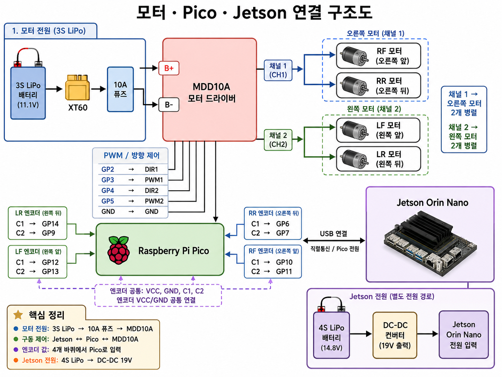
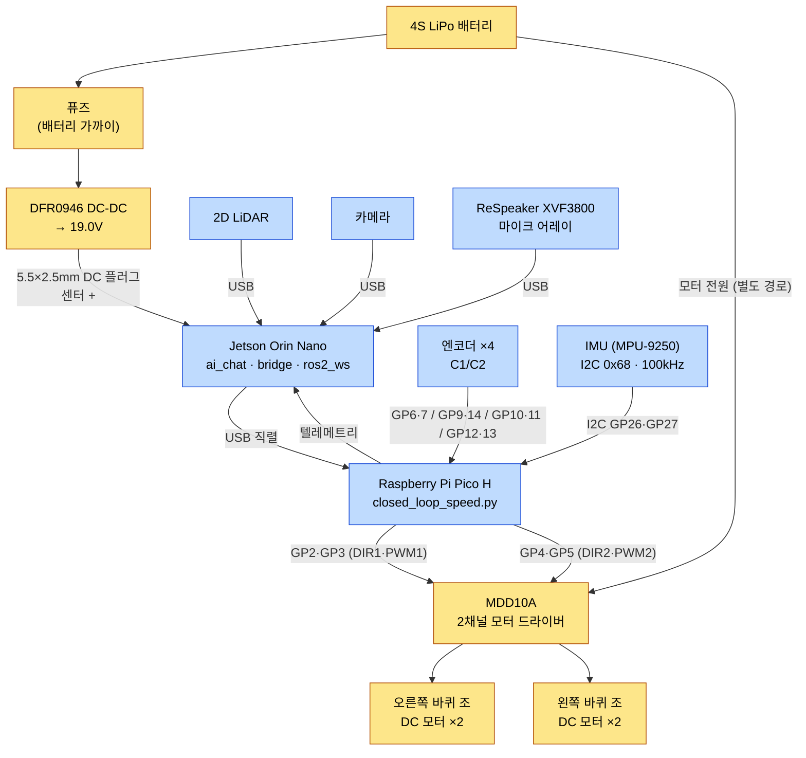
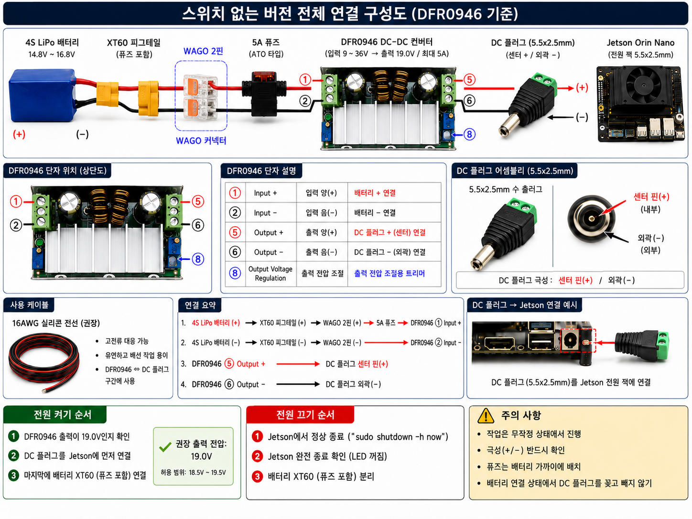
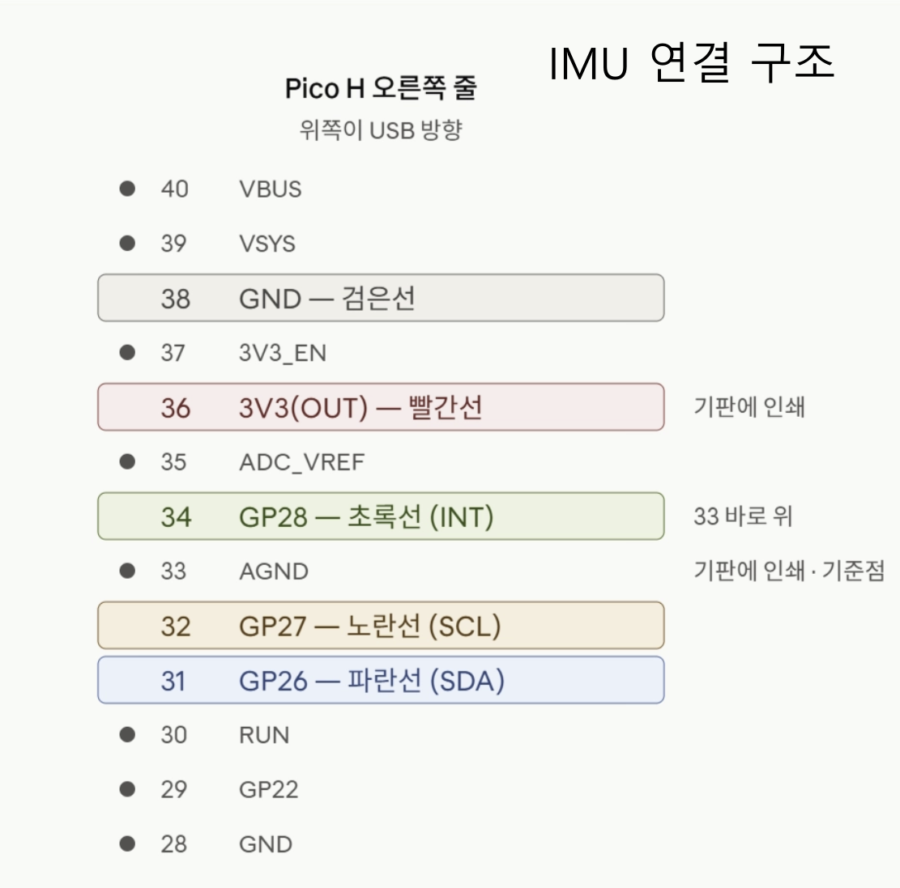
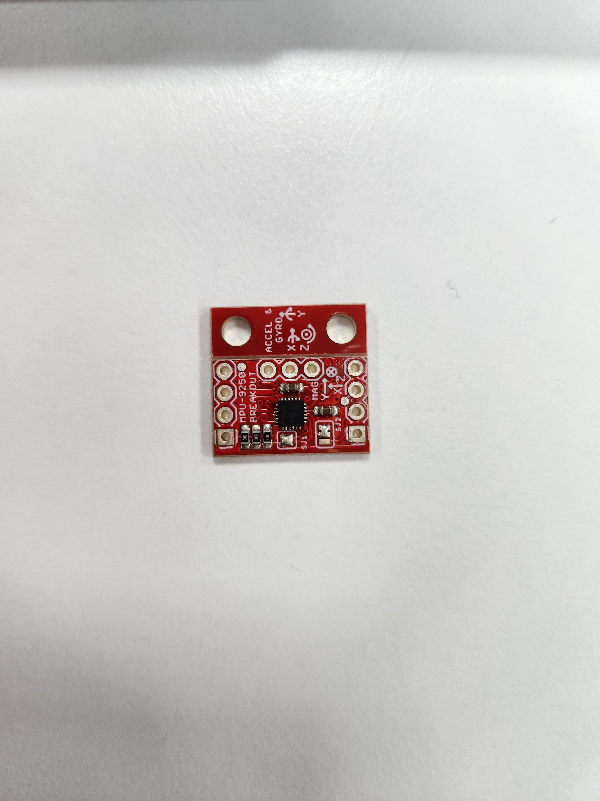

# BOMI Hardware

BOMI의 현재 프로토타입은 Jetson Orin Nano, Raspberry Pi Pico, MDD10A 모터 드라이버, 4개의 DC 모터와 엔코더, IMU, 2D LiDAR, 카메라, ReSpeaker XVF3800 마이크 어레이, 그리고 스마트홈 센서로 구성됩니다. MDD10A는 2채널이므로 모터 4개를 좌/우 2조로 묶어 구동하고, 엔코더는 4개를 각각 읽습니다(바퀴마다 CPR을 따로 실측했습니다 — 979/984/979/970).

> 아래 자료는 현재 프로토타입의 연결 기준입니다. 부품이나 배선이 변경되면 구조도와 실제 장비를 함께 갱신해야 합니다.

## 전체 연결 구조

모터 구동 전원과 Jetson 전원은 서로 다른 경로를 사용합니다. Jetson은 USB 직렬 통신으로 Pico에 명령을 전달하고, Pico는 MDD10A를 제어하며 각 바퀴의 엔코더 값을 수집합니다.

  

위 사진과 아래 그림은 같은 구성을 다르게 보여줍니다. 사진은 실제 배선 모습이고, 아래 그림은 전원 계통(노란색)과 데이터 계통(파란색)이 어디서 갈라지는지를 정리한 것입니다.

### 제어 핀 요약

| 용도 | Pico 핀 |
| --- | --- |
| MDD10A DIR1 — **오른쪽** 바퀴 조 | `GP2` |
| MDD10A PWM1 — **오른쪽** 바퀴 조 | `GP3` |
| MDD10A DIR2 — **왼쪽** 바퀴 조 | `GP4` |
| MDD10A PWM2 — **왼쪽** 바퀴 조 | `GP5` |
| 오른쪽 뒤 엔코더 C1 / C2 | `GP6` / `GP7` |
| 왼쪽 뒤 엔코더 C1 / C2 | `GP14` / `GP9` |
| 오른쪽 앞 엔코더 C1 / C2 | `GP10` / `GP11` |
| 왼쪽 앞 엔코더 C1 / C2 | `GP12` / `GP13` |

채널과 좌우의 대응은 펌웨어가 고정하고 있습니다. 엔코더 부호 배열(`ENCODER_DIRECTION = [-1, -1, 1, 1]`)도 이 배치를 전제하므로, 좌우를 바꿔 꽂으면 조향이 반대로 돕니다. 정본은 `robot/pico/closed_loop_speed.py`(핀 정의 236-246·260-264행)입니다.

### 펌웨어가 거는 안전 한계

| 항목 | 값 | 의미 |
| --- | --- | --- |
| `WATCHDOG_MS` | `300` ms | 속도 명령이 이 시간 안에 다시 오지 않으면 Pico가 스스로 멈춥니다. 상위 노드는 20ms 주기로 보내므로 프레임 15개 유실까지 견딥니다 |
| `MAX_TARGET_REV_S` | `0.8` rev/s | 명령으로 지정할 수 있는 목표 회전 속도의 상한 |
| `MAX_PERCENT` | `70` % | PWM 출력 상한. 0.8 rev/s에 약 54%가 필요하므로 PI 보정에 16% 여유가 남습니다 |

받침대 위 검증에서 "명령 발행을 끊고 0.5초 안에 정지하지 않으면 실험을 중단한다"는 규칙은 이 워치독 300ms에 근거합니다. 300ms 안에 멈추지 않으면 워치독 자체가 동작하지 않는 것입니다.

## Jetson 전원 연결

Jetson 전원은 4S LiPo 배터리 출력을 DFR0946 DC-DC 컨버터로 19V에 맞춘 뒤 5.5×2.5mm DC 플러그로 공급합니다.

  

### 전원 작업 주의사항

- 배선 작업은 반드시 배터리를 분리한 상태에서 진행합니다.
- DC 플러그는 **센터 핀 양극(+), 외곽 음극(-)** 극성을 사용합니다.
- Jetson 연결 전에 멀티미터로 컨버터 출력이 `19.0V`인지 확인합니다.
- 퓨즈는 배터리와 가까운 위치에 두고, 배터리가 연결된 상태에서 DC 플러그를 조립하거나 분해하지 않습니다.
- 전원을 끌 때는 Jetson을 정상 종료한 뒤 LED가 꺼진 것을 확인하고 배터리를 분리합니다.

## LiDAR 장착 좌표

LiDAR 장착 위치는 지도 작성과 자율주행이 같은 값을 써야 합니다. 어긋나면 지도와 실제 장애물 위치가 밀립니다.

| 축 | 값(m) | 비고 |
| --- | --- | --- |
| `laser_x` | `0.135` | 2026-08-07 실측 |
| `laser_y` | `0.0` | 2026-08-07 실측 |
| `laser_z` | `0.466` | 2026-08-10 마운트 변경 반영(0.240 → 0.466) |

이 값은 `robot/scripts/bomi_map.sh`(매핑)와 `robot/ros2_ws/src/core/launch/bomi_navigation_real.launch.py`(주행) 두 곳에 있고, 축마다 일치하는지를 `robot/ros2_ws/src/core/test/test_lidar_mount_consistency.py`가 강제합니다. 마운트를 바꾸면 두 곳을 함께 고치고 지도를 다시 그립니다.

> `laser_z`는 2026-08-10 마운트 변경을 반영했지만 **`laser_x`·`laser_y`는 아직 2026-08-07 값 그대로입니다.** 마운트가 바뀌었으므로 줄자로 다시 재야 합니다. 특히 `laser_x`는 지도 품질에 직결됩니다(`robot/scripts/bomi_map.sh` 주석).

## IMU 연결

IMU는 I2C로 Pico에 연결합니다. 아래 핀맵은 Pico H의 USB 포트가 위쪽을 향한 상태를 기준으로 합니다.

  

| IMU 신호 | Pico H 연결 |
| --- | --- |
| GND | 38번 `GND` |
| 3.3V | 36번 `3V3(OUT)` |
| INT | 34번 `GP28` (배선만 해둠 — 펌웨어 미사용) |
| SCL | 32번 `GP27` |
| SDA | 31번 `GP26` |

펌웨어는 IMU를 I2C 폴링으로만 읽습니다(주소 `0x68`, 100kHz). 400kHz에서는 모터 구동 중 `ETIMEDOUT`이 발생해 100kHz로 고정했습니다. `INT` 선은 향후 확장을 위해 배선만 해둔 상태이고, 펌웨어에는 인터럽트 핸들러도 `GP28` 참조도 없습니다. 정본은 `robot/pico/closed_loop_speed.py`(127-133행)입니다.

사용 중인 IMU 모듈의 실물 모습입니다.

  

## 센서 및 돌봄 기능 기준

- 카메라는 로컬 Vision(`robot/ai_vision`)에서 사람을 찾고 추적하는 데 사용합니다. 결과는 화면 안 위치와 추종 명령뿐이며, UDP `127.0.0.1:5005` 로 로봇 안에서만 오갑니다. 프레임·관절 좌표·얼굴 특징은 중앙 DB로 보내지 않습니다.
- 누움 자세 판정은 아직 구현돼 있지 않습니다. 요구사항으로만 남아 있습니다(`robot/ai_vision/docs/vision-requirements.md`).
- 온습도 센서는 단위가 명확한 `°C`, `%RH` 값을 제공하고 장치 ID와 함께 MQTT 이벤트를 만듭니다. 다만 payload에는 센서가 잰 관측시각(`observedAt`)이 들어가지 않아, DB에 남는 관측시각은 백엔드가 채우는 **수신 서버 시각**입니다.
- 온습도는 `READ_INTERVAL_SECONDS`(기본 30초) 주기로 발행합니다. 초당 원시 측정값은 만들지도 보내지도 않습니다. 데이터시트 범위(0~50°C, 20~90%RH)를 벗어난 값은 발행 전에 버립니다.
- 변화량 기반 솎아내기는 아직 없습니다. 백엔드는 도착한 관측을 모두 기록하고, 임계값(30°C·80%RH) 판정은 저장 여부가 아니라 안부 확인 시나리오를 시작할지에만 씁니다.
- 온습도 수집기의 `SENSOR_ID`(기본 `ambient-sensor-01`)는 백엔드 `application.yml` 의 `bomi.observation.ambient-sensor-to-senior` 에 등록된 값과 **정확히 같아야 합니다.** 다르면 이벤트가 도착해도 어르신에게 매핑되지 않고 경고 로그만 남긴 채 폐기됩니다. 센서를 새로 설치할 때 가장 먼저 밟는 함정입니다.
- 센서 고장, 오래된 관측 또는 안전 조건이 불확실한 경우 로봇은 접근을 강행하지 않고 안전한 기본 동작을 유지합니다. 사람 추종의 실제 값은 `robot/ros2_ws/src/core/config/person_following.yaml` 에 있습니다 — LiDAR 없이는 출발하지 않고(`require_lidar_before_motion`), 스캔이 `0.5`초 끊기면 즉시 정지하며, 사람까지 `0.6m`에서 멈추고 `0.9m`로 벌어져야 다시 갑니다(비상 정지 `0.3m`).

## 관련 문서

- [Robot 실행 및 하드웨어 제어](../../robot/README.md)
- [IoT 장치 구성](../../iot/README.md)
- [오디오 에코·Barge-in 검증](audio-echo-bargein-verification.md)
