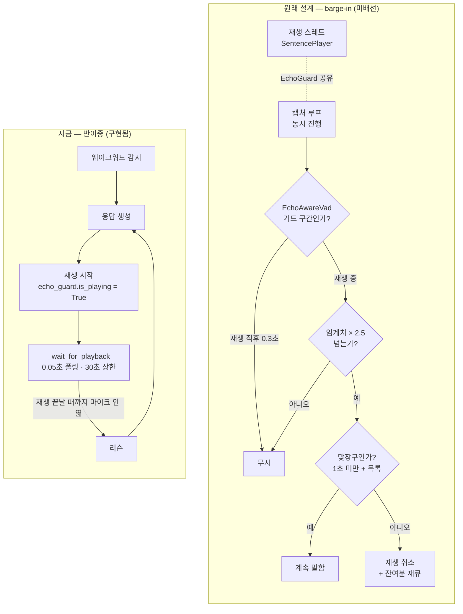

# 에코 억제·barge-in 실기 검증 항목

> 상태: **열려 있음.** `ECHO_GUARD_SEC`·`ECHO_VAD_THRESHOLD_MULTIPLIER` 는 2026-08-16 현재도 추정값이며 실측되지 않았습니다. 진행 상황의 정본은 [`docs/carebot/진행 상황.md`](<../carebot/진행 상황.md>) 입니다.
> 대상: S15P11E102-205 를 실기에서 마무리하는 사람
> 관련 코드: `robot/ai_chat/src/bomi_ai_chat/audio/`, `audio_io/`, `graph/ingress.py`, `graph/output.py`, `bootstrap.py`
> 근거: `임시보류_claude.md` §13 Barge-in policy, §22 Build order 3단계(Echo suppression), §24 Open decisions — 통합 스프린트 동안 구 CLAUDE.md 가 이 파일로 옮겨졌습니다. 루트 `CLAUDE.md` 에는 이 절 번호가 없습니다.
> 최종 갱신: 2026-08-16 (2026-08-05 젯슨 실기 결과 반영)

## 왜 이 문서가 있나

205 의 판단 로직(에코 가드, 맞장구 판별, 재생 취소, 잔여분 재큐)은 **하드웨어 없이 구현하고 검증했습니다.** `tests/test_echo_and_bargein.py` 17건이 그 동작을 고정하고 있습니다.

하지만 **"무엇을 에코로 볼 것인가"의 임계치와, 실제로 스피커 소리가 마이크로 되돌아오는 현상 자체는 측정해야만 정해집니다.** 그 부분이 아직 비어 있고, 이 문서가 그 목록입니다.

### 이 경고는 이미 실증됐습니다 (2026-08-05 젯슨 실기)

원래 이 자리에는 "이 문서의 항목이 끝나기 전에는 능동 발화(206)를 실기에서 테스트하지 마십시오"라는 금지문이 있었습니다. 그 순서는 지켜지지 않았고, 예고한 일이 그대로 일어났습니다.

로봇이 `"제가 아드님께 연락드릴게요"` 라고 말하면 → 그 문장이 마이크로 되돌아오고 → 트리아지가 그 안의 응급 표현을 **다시** 감지해 → T1 을 또 올렸습니다. **20:58~21:04 사이 동일한 T1 이 15회 이상 보호자에게 배달됐습니다.** 대응은 두 가지였습니다 — 리슨 전 재생 대기(`_wait_for_playback`)를 빠진 분기에 추가했고, 이와 별개인 두 번째 결함(트리아지에 중복 억제가 아예 없었음)을 `policy.T1_DUPLICATE_SUPPRESSION_SEC`(기본 10분)로 막았습니다.

**여전히 유효한 결론:** 에코를 안 잡은 상태에서 대화 기능을 실기 테스트하면 모든 버그 리포트가 실제로는 에코이고, 다른 버그로 오진하면 디버깅이 지옥이 됩니다(`임시보류_claude.md` §22 Build order 가 3단계를 4단계보다 앞에 둔 이유). 아래 1번(임계치 실측)이 끝나기 전의 실기 결과는 전부 에코 오염을 의심하십시오.

상세: [`docs/carebot/진행 상황.md`](<../carebot/진행 상황.md>) "T1 폭주" 절.

## 지금 코드에 들어 있는 것 — 그리고 무엇이 실제로 도는가

★ **자동 테스트 통과와 운영 배선은 다릅니다.** 아래 동작들은 전부 구현·테스트돼 있지만, 그중 절반은 현재 실행 경로에서 호출되지 않습니다. 이 구분을 모르면 임계치를 조정해도 아무 변화가 관찰되지 않습니다.

| 동작 | 어디 | 자동 테스트 | 운영 경로에서 도는가 |
|---|---|---|---|
| 재생 직후 `ECHO_GUARD_SEC` 동안 입력 무시 | `audio/echo_guard.py:85` | O | **아니오** — 유일한 소비자 `EchoAwareVad` 가 미배선 |
| 재생 중 VAD 임계치 상향(차단 아님) | `audio/echo_guard.py:101` | O | **아니오** — 위와 같은 이유 |
| 재생 중 표시(`is_playing`) + LCD 상태 발행 | `audio/echo_guard.py:64,73` | O | 예 |
| 문장 단위 투입·취소·`spoken_prefix` 추적 | `audio/playback.py` | O | 예 (취소는 아래 참고) |
| 맞장구 판별(길이 + 목록) → 계속 말함 | `graph/ingress.py:103,121` | O | 조건부 — 재생 중일 때만 의미가 있는데 지금 루프는 재생이 끝난 뒤 듣는다 |
| 진짜 끼어들기 → 취소 + 잔여분 재큐 | `graph/ingress.py:124,270,420` | O | **아니오** — 아래 "지금 실제 구조" 참고 |
| critical 프로브는 재개하지 않음 | `graph/ingress.py` | O | 위 항목에 종속(도달하지 않음) |

### 지금 실제 구조 — 반이중(half-duplex)

웨이크워드 대화에서 barge-in 은 **의도적으로 빠져 있습니다.** 대화 루프는 응답 재생이 끝날 때까지(`echo_guard.is_playing` 이 내려갈 때까지) 리슨을 열지 않습니다 — `bootstrap._wait_for_playback`(0.05초 폴링, 30초 상한), 호출 5곳(`bootstrap.py:640, 832, 1006, 1076, 1087`).

그래서 어르신이 말을 시작하는 시점에는 재생 핸들이 이미 끝나 있고, `note_interaction` 은 "끼어들기가 아니라 평범한 턴"으로 상태를 바로잡고 지나갑니다(`graph/ingress.py:124`). 잘린 나머지를 재큐하는 경로도, 그것을 소비하는 능동 게이트를 구동하는 진입점이 아직 없어 닫혀 있습니다(`graph/turn.py` 의 `run_user_turn` 이 유일한 그래프 구동자).

**즉 현재의 에코 방어선은 `ECHO_GUARD_SEC`·`ECHO_VAD_THRESHOLD_MULTIPLIER` 가 아니라 "재생이 끝날 때까지 안 듣는다" 하나입니다.** 아래 1번을 측정하기 전에 이 사실을 먼저 아십시오 — 측정만으로는 동작이 바뀌지 않고, `EchoAwareVad` 를 캡처 루프에 붙이는 작업이 함께 필요합니다(`bootstrap.py` 의 `_wait_for_playback` docstring 이 그 확장 지점을 명시합니다).

아래 그림은 지금 도는 구조와 원래 설계한 구조를 나란히 둔 것입니다. 오른쪽은 **미배선**입니다.

## 실기에서 해야 하는 것

### 1. 임계치 실측 — 가장 중요

세 값이 **추정치**입니다. 앞의 둘은 코드가 스스로 그렇게 적고 있고, 셋째는 지금 실제로 발화/무음을 가르는 값인데 이 문서에 빠져 있었습니다.

| 상수 | 현재값 | 어디 | 지금 도는가 |
|---|---|---|---|
| `ECHO_GUARD_SEC` | `0.3` 초 | `policy.py:387` | 아니오(캡처 미배선) |
| `ECHO_VAD_THRESHOLD_MULTIPLIER` | `2.5` 배 | `policy.py:401` | 아니오(캡처 미배선) |
| `AUDIO_SILENCE_THRESHOLD` | `300.0` | `config.py:416-419` | **예** — 캡처가 채널 0 진폭 평균과 비교하는 실제 문턱 |

**순서가 중요합니다.** 앞의 두 값은 `EchoAwareVad` 를 캡처 루프에 붙이기 전까지 조정해도 아무 변화가 없습니다. 지금 상태에서 "로봇이 자기 말에 멈춘다"를 실제로 움직이는 다이얼은 `AUDIO_SILENCE_THRESHOLD` 하나뿐입니다.

측정 방법:

1. 로봇을 평소 사용 위치에 두고 스피커 음량을 실제 운용값으로 맞춘다
2. 로봇이 길게 말하는 동안 **아무도 말하지 않는다.** VAD 가 발화로 판정하는지 로그로 확인
   - 판정한다 → 배수를 올린다
3. 로봇이 말하는 동안 **평소 목소리로** 끼어든다. 즉시 멈추는지 확인
   - 안 멈춘다 → 배수를 내린다
4. 2와 3이 동시에 만족하는 값을 찾는다. 못 찾으면 → AEC 로 간다(아래)

### 2. 하드웨어 AEC 로 충분한지 결정 (`임시보류_claude.md` §24 Open decisions 미결)

`policy.py` 의 두 상수는 **값싼 완화책**이지 음향 반향 제거가 아닙니다. 위 3번에서 "에코를 막으면 끼어들기도 못 잡는" 구간이 나오면 완화책의 한계입니다.

**미결의 형태가 바뀌었습니다 — "AEC 를 쓸 것인가"가 아니라 "이미 쓰고 있는 것으로 충분한가"입니다.** 캡처는 이미 ReSpeaker 채널 0(하드웨어 빔포밍·AEC 처리 신호)만 읽습니다(`audio_io/sounddevice_backend.py:195-198`). 웨이크워드 경로도 같은 채널을 씁니다(`audio_io/wakeword.py`).

따라서 실기에서 확인할 것은 이렇게 바뀝니다.

1. 채널 0 만으로 자기 음성 되먹임이 어느 정도 남는가 (녹음해서 듣는다)
2. 남는다면 빔 고정(`BEAM_FIX_ENABLED=1`, 기본은 꺼짐)이 그 잔여를 줄이는가
   — 단, 빔 정면 고정과 소리 방향 기반 회전 탐색은 **상호 배타**입니다
   (`audio_io/beam_control.py:173`, `search_signal.py:240-244, 266-268`)
3. 그래도 남으면 소프트웨어 AEC 도입 여부를 결정한다

### 3. 원거리 마이크 성능 (`임시보류_claude.md` §24 Open decisions)

**소프트웨어로 못 고칩니다.** 거실 반대편에서 한 말이 STT 에 도달하는지 일찍 확인해야 합니다. 여기서 막히면 205 가 아니라 하드웨어 배치 문제입니다.

### 4. Silero VAD 연결 (웨이크워드는 끝났습니다)

**끝난 것 — openWakeWord.** `audio_io/wakeword.py` 에 실물로 붙었고 모델 `robot/ai_chat/models/bomiya.onnx` 가 저장소에 있습니다. 감지 규칙도 실기 튜닝을 거쳤습니다 — 임계 `0.4`(`WAKEWORD_THRESHOLD`), "최근 4프레임 중 2개 이상"(연속 아님, `WAKEWORD_WINDOW=4` · `WAKEWORD_MIN_HITS=2`), 진입 시 `model.reset()` 으로 종료 직후 자동 재감지 방지, 추론 프레임워크를 확장자에서 명시 결정(젯슨의 tflite 기본값이 `.onnx` 를 거부한 사고 대응). 젯슨에서 실제로 돌았습니다(2026-08-05).

**남은 것 — Silero VAD.** `audio/vad.py` 에 경계(`VoiceActivityDetector`)만 있고 구현이 없습니다. 그동안 캡처의 발화/무음 판정은 채널 0 진폭 평균 대 고정 문턱(`AUDIO_SILENCE_THRESHOLD`, 기본 300.0)입니다.

- Silero VAD 연결 → `EchoAwareVad` 에 주입
- **그리고 `EchoAwareVad` 를 캡처 루프에 실제로 붙일 것** — 지금은 만들어만 두고 아무도 쓰지 않습니다. 이것을 안 하면 1번의 임계치 실측이 무의미합니다
- Jetson(aarch64)에서 VAD 모델 로딩·추론 지연 측정 — 프레임마다 도는 경로입니다. 참고로 임베딩 모델은 첫 호출 로딩이 **36.1초 / 21.5초**로 실측돼 워밍업을 넣었습니다([`docs/carebot/진행 상황.md`](<../carebot/진행 상황.md>)). VAD 도 같은 함정을 확인하십시오

### 5. 문장 경계 중단의 체감 지연

지금은 **현재 문장을 끝으로** 멈춥니다(프레임 단위로 자르지 않음). 이유는 `audio/playback.py` 주석에 있습니다.

실기에서 "끼어들었는데 로봇이 한참 더 말한다"고 느껴지면 프레임 단위 중단을 검토하십시오. `response_shaper` 가 문장을 짧게 유지하므로 괜찮을 것으로 예상하지만, **예상이지 측정이 아닙니다.**

### 6. 맞장구 목록 보강

`policy.BACKCHANNELS` 는 지금 8개뿐이고 **상상으로 만든 목록입니다.**

`임시보류_claude.md` §13 Barge-in policy 가 못박은 대로 실제 녹취록에서 채워야 합니다. 사투리와 개인 습관이 지배적인 영역이고, 여기서의 오탐은 **어르신이 실제로 한 말을 로봇이 무시하는 것**입니다.

### 7. barge-in 을 되살릴 것인가 — 결정이 이미 한 번 내려졌습니다

이 항목은 원래 "`pipeline.py` 를 그래프에 연결할 때 재생 완료를 기다리는 구조가 되지 않도록 하라"였습니다. **그 사이 두 가지가 바뀌었습니다.**

- 그래프는 `pipeline.py` 가 아니라 `bootstrap.py` 로 배선됐습니다. `pipeline.py` 는 `--legacy` / `USE_GRAPH_RUNTIME=false` 전용 옛 경로입니다(시연 env 에서는 쓰지 않습니다).
- 그리고 **기다리는 쪽으로 결정됐습니다.** `bootstrap._wait_for_playback` 이 재생이 끝난 뒤에 리슨을 엽니다. 즉 웨이크워드 대화에 barge-in 은 없습니다. 이 선택은 2026-08-05 실기의 에코 되먹임 사고 대응이기도 합니다.

그래서 남은 질문은 "어떻게 연결할까"가 아니라 **"반이중으로 갈 것인가, barge-in 을 되살릴 것인가"** 입니다. 되살리기로 하면 필요한 작업은 이렇습니다(`bootstrap.py` 의 `_wait_for_playback` docstring 이 확장 지점을 명시합니다).

- `_wait_for_playback` 호출 5곳을 제거
- `EchoAwareVad` 를 캡처 루프에 배선하고, 그 전에 1번의 임계치를 실측
- `EchoGuard` 인스턴스를 캡처 루프와 `SentencePlayer` 가 **공유**할 것. 따로 만들면 가드가 동작하지 않습니다
- 잘린 나머지를 다시 말하려면 능동 경로 구동자(현재 없음)가 함께 필요합니다

## 완료 조건 대조

205 티켓의 완료 조건 3건에 대한 현재 상태입니다.

| 완료 조건 | 로직 | 운영 배선 | 실기 |
|---|---|---|---|
| TTS 재생 중 로봇이 자기 말에 멈추지 않음 | O | 대체 수단으로 충족 — 재생 중에는 아예 안 듣는다(`_wait_for_playback`) | **미확인** (임계치 실측 필요) |
| "응/그래" 발화 시 문장을 끝까지 말함 | O | 도달하지 않음(재생 중 입력이 없다) | **미확인** (목록 보강 필요) |
| 실제 끼어들기 시 중단 + 잔여분 재큐 | O | **미배선** — 취소 경로 도달 불가, 재큐 소비자 없음 | **미확인** |

로직은 자동 테스트로 고정돼 있습니다. 다만 세 조건 중 둘은 현재 구조(반이중)에서 성립할 수 없고, 나머지 하나는 다른 방법으로 충족되고 있습니다. 실기 열을 채우려면 7번의 결정이 먼저입니다. 티켓 상태는 [`docs/carebot/진행 상황.md`](<../carebot/진행 상황.md>) 표를 정본으로 봅니다.
