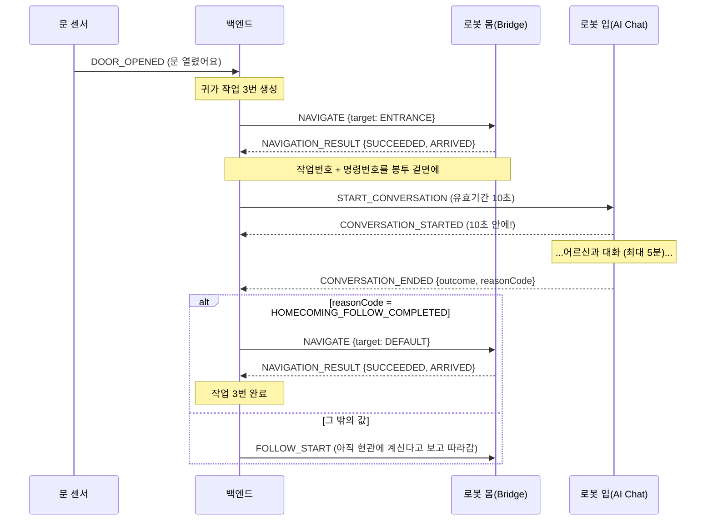

# MQTT 계약 쉽게 이해하기

> 이 문서는 [`시나리오 계약 v1.md`](<./시나리오 계약 v1.md>)(시나리오별 메시지)와 [`토픽 규약.md`](<./토픽 규약.md>)(공통 토픽·봉투 규칙)를 **처음 보는 사람도 이해하도록** 우편/택배 비유로 풀어 쓴 설명판입니다.
> **권위는 계약서 쪽에 있습니다** — 이 문서와 값이 다르면 계약서가 옳습니다. 여기서는 값을 외우는 대신 "왜 이렇게 나눴는가"를 이해하는 것이 목적입니다.
> 최종 코드 대조: **2026-08-16** (`main` `e1c09a97`)

## 한 줄 그림

로봇·센서와 백엔드는 **MQTT라는 우체국**을 통해 편지(메시지)를 주고받습니다. 이 문서는 "편지를 어느 주소로, 어떤 봉투에, 무슨 내용으로 보낼지"를 미리 맞춰두는 약속입니다. 약속을 안 맞추면 서로 다른 규격으로 편지를 보내는데, **잘못된 편지에는 반송도 오지 않습니다** — 그냥 사라집니다.

## 한 장 요약

시연 전 브리핑용으로 각 장의 핵심만 모았습니다.

1. 어떤 편지는 어느 주소함에 넣는다는 목록. **명령함이 둘**이다 — 몸(로봇)과 입(AI).
2. 봉투 겉면 규격을 통일한다. 상관관계 번호도 **겉면**에 쓴다.
3. 명령은 다섯 종류. 말하는 명령은 `SPEAK`가 아니라 `START_CONVERSATION`이다.
4. 답장에는 **작업번호와 명령번호를, 봉투 겉면에** 그대로 echo 한다.
5. 센서는 무슨 일이 났는지만 알려주고, 판단은 백엔드가 한다.
6. MQTT에 실리는 로봇 식별자는 **언제나 이름표**다. UUID가 아니다.
7. 하나의 시나리오가 편지 여러 통을 꿰어 하나의 이야기를 만든다.
8. 편지가 사라지는 이유는 다섯 가지뿐이고, 순서대로 확인하면 대부분 첫 둘이다.
9. 실패한 시나리오 하나가 로봇을 잠근다. 자동으로 안 풀린다.

---

## 1. 토픽 = 편지 주소

MQTT는 "주소"로 편지를 주고받습니다. 주소 형식은:

```text
bomi/v1/{누구}/{어느 기기}/{무슨 용도}
예) bomi/v1/robot/robot-001/commands  →  "robot-001 로봇에게 보내는 명령함"
```

누가 어느 함에 넣는지만 정해두면 됩니다.

| 주소함 | 넣는 쪽 → 꺼내는 쪽 | 무엇이 들어가나 |
| --- | --- | --- |
| `bomi/v1/iot/{센서id}/events` | 센서 → 백엔드 | 문 열림, 온습도 |
| `bomi/v1/robot/{로봇id}/commands` | 백엔드 → 로봇 **몸** | 이동·따라가기·취소 |
| `bomi/v1/ai/{로봇id}/commands` | 백엔드 → 로봇 **입** | 대화 시작 |
| `bomi/v1/robot/{로봇id}/events` | 로봇·AI → 백엔드 | 웨이크워드, 대화 시작·종료 |
| `bomi/v1/robot/{로봇id}/status` | 로봇 → 백엔드 | 진행 상황 |
| `bomi/v1/robot/{로봇id}/results` | 로봇 → 백엔드 | 명령 최종 결과 |

**명령함이 두 개인 것이 이 구조의 핵심**입니다. 몸을 움직이는 명령과 말하는 명령이 서로 다른 프로세스로 가기 때문입니다. 반대로 **답장 주소는 하나**입니다 — AI가 보내는 대화 이벤트도 `ai/…`가 아니라 `robot/…/events`로 보내야 합니다. 백엔드는 AI 주소함을 아예 열어보지 않습니다(쓰기만 합니다).

> 핵심: **어떤 편지는 어느 주소함에 넣는다**는 목록. 명령함은 둘, 답장함은 하나.

## 2. 봉투 = 모든 편지에 공통으로 붙는 라벨

내용물이 뭐든, 편지 봉투 겉면엔 항상 같은 라벨을 붙입니다.

| 라벨 | 쉬운 뜻 |
| --- | --- |
| `eventId` | 편지 고유번호(송장번호). 같은 편지가 두 번 와도 이 번호로 "아까 그거"임을 알아 중복 처리 안 함 |
| `type` | 편지 종류 (예: "도착 알림") |
| `occurredAt` | 언제 일어난 일인지 — **시간대까지 붙은** 시각 (`2026-08-16T15:30:00+09:00`) |
| `sourceId`/`robotId` | 보낸 기기 이름표. 주소에 적힌 기기와 **글자까지 같아야** 함 |
| `payload` | 실제 내용물(3~5장에서 종류별로 다름) |
| `scenarioId`·`commandId`·`conversationId` | 상관관계 번호. **있으면 겉면에 쓴다** — 내용물 안이 아니다(4장) |

배송 규칙 세 가지:

- **QoS 1**: "최소 한 번은 반드시 도착". 대신 가끔 **같은 편지가 두 번** 올 수 있음 → 그래서 `eventId`로 중복을 걸러냄. QoS 0으로 보내면 봉투를 열어보기도 전에 버려집니다.
- **retain=false**: 브로커(우체국)에 편지를 쌓아두지 않음. 항상 그때그때 새 편지. 쌓아둔 편지가 나중에 배달되면 이미 끝난 명령이 다시 실행되기 때문입니다.
- 형식이 틀린 편지는 **조용히 버림**. 잘못된 편지가 무한 재전송되는 사고를 막기 위함.

`eventId` 중복 걸러내기에는 한계가 있습니다. 백엔드가 기억하는 것은 **최근 10분치뿐**이고, 그 기억은 메모리에 있어 **재시작하면 사라집니다.** 그러니 "번호만 같으면 영원히 한 번만 처리된다"고 믿으면 안 됩니다. 실무에서 문제가 되지 않는 이유는 QoS 1 재전송이 몇 초 안에 일어나기 때문입니다.

> 핵심: **봉투 겉면 규격을 통일**한다. 상관관계 번호도 겉면에 쓴다.

## 3. 백엔드 → 로봇 : "이거 해라" (명령)

백엔드가 시키는 편지는 다섯 종류이고, 그중 하나만 **다른 명령함**으로 갑니다.

| 명령 | 어느 주소로 | 내용물 | 뜻 |
| --- | --- | --- | --- |
| `NAVIGATE` | 로봇 명령함 | `target`: `ENTRANCE`(현관) / `LIVING_ROOM`(거실 소파) / `DEFAULT`(충전소) | 거기로 이동해 |
| `FOLLOW_START` | 로봇 명령함 | 없음(빈 객체) | 사람을 찾아 따라가기 시작해 |
| `FOLLOW_STOP` | 로봇 명령함 | 없음(빈 객체) | 따라가기 그만해 |
| `CANCEL` | 로봇 명령함 | `targetCommandId`(멈출 명령번호) + `reasonCode`(왜) | 저 명령 멈춰 |
| `START_CONVERSATION` | **AI 대화함** | `seniorId` + `intent` + `text` + `triggerContext` | 이 취지로 대화를 시작해 |

**`SPEAK`라는 명령이 계약에는 남아 있지만 백엔드는 한 번도 쓰지 않습니다.** 로봇이 말하는 모든 문장은 `START_CONVERSATION`으로 옵니다 — 백엔드는 "이 문장을 재생해"가 아니라 "이런 취지로 대화를 시작해"라고 말하고, 실제 문장과 이어지는 대화는 AI가 만듭니다. 대화는 상대의 대답에 따라 갈라지는데, 그 갈래를 백엔드가 미리 알 수 없기 때문입니다.

### 왜 "보미야" 하면 정해진 자리로 오지 않는가

호출 시나리오만 `NAVIGATE`가 아니라 **`FOLLOW_START`** 를 씁니다. 거실 좌표로 주행하는 대신, 로봇이 소리 난 방향으로 제자리에서 돌아 카메라로 사람을 찾고 마지막 몇 걸음을 스스로 다가갑니다. 어르신이 늘 같은 자리에 계시지는 않기 때문입니다.

방향 각도는 이 계약을 타고 가지 못합니다 — 웨이크워드 편지는 내용물에 `keyword`와 `confidence`만 허용되기 때문에, 로봇은 각도를 자기 내부 채널로 스스로에게 보냅니다.

### 유효기간이 둘인 이유

모든 명령에는 유효기간(`expiresAt`)이 붙습니다. 로봇 명령은 **2분**, `START_CONVERSATION`만 **10초**입니다.

이동은 2분 늦게 시작해도 여전히 의미가 있지만, 대화는 그렇지 않습니다. AI가 10초 안에 "대화 시작했어요"(`CONVERSATION_STARTED`)를 회신하지 못하면 백엔드는 대화를 접습니다. 대화 자체의 상한은 5분입니다.

> 핵심: 명령은 다섯 종류. **말하는 명령은 `START_CONVERSATION`** 이고, 그것만 유효기간이 10초다.

## 4. 로봇 → 백엔드 : "다 했어요" (결과)

로봇이 백엔드로 보내는 답장입니다.

**가장 중요한 약속**: 로봇은 결과 답장에 백엔드가 보냈던 번호 **두 개**를 그대로 되돌려줘야 합니다 — 작업번호(`scenarioId`)와 **명령번호(`commandId`)** 입니다. 하나는 "몇 번 작업이냐", 다른 하나는 "그 작업의 몇 번째 명령이냐"를 답합니다. 백엔드는 둘이 모두 맞을 때만 다음 단계로 넘어갑니다 — 작업번호만 맞고 명령번호가 다르면, 이미 취소된 옛 이동의 뒤늦은 도착 보고를 새 이동의 성공으로 착각하기 때문입니다.

**그리고 두 번호는 봉투 겉면에 씁니다 — 내용물 안이 아닙니다.** 예전 계약은 `payload` 안에 `scenarioId`를 넣었는데, 지금 그 형식으로 보내면 명령번호 대조가 통째로 생략되고, 겉면과 안쪽에 번호를 **둘 다** 쓰면 편지가 아예 거부됩니다.

> 핵심: **작업번호와 명령번호를, 봉투 겉면에** 그대로 echo(반사) 한다.

### 내용물은 세 칸짜리 서식입니다

결과 편지의 내용물은 종류를 가리지 않고 같은 세 칸입니다.

| 칸 | 묻는 것 | 값의 예 |
| --- | --- | --- |
| `outcome` | **끝났나?** | `SUCCEEDED` / `FAILED` / `CANCELLED` / `TIMED_OUT` |
| `resultCode` | **어떻게 끝났나?** | 이동이면 `ARRIVED`/`NOT_ARRIVED`, 따라가기면 `STARTED`/`STOPPED`/`UNCHANGED` |
| `reasonCode` | **왜 그랬나?** | `PATH_BLOCKED`, `PERSON_LOST` … 잘 끝났으면 `null` |

세 칸을 하나로 합치지 않은 이유는, **첫 칸만 모든 명령에 공통**이기 때문입니다. 백엔드는 `outcome` 하나만 보고 "이 시나리오를 계속할지 접을지"를 정할 수 있고, 무엇을 하다 그렇게 됐는지는 둘째 칸이, 사람이 읽을 원인은 셋째 칸이 답합니다. 한 칸으로 합쳤다면 명령이 늘어날 때마다 공통 어휘가 오염됐을 것입니다.

**"왜 그랬나" 칸은 비워 두더라도 칸 자체는 반드시 만들어 둡니다.** `reasonCode` 키가 아예 없으면 편지가 거부되고, 값만 `null`이면 통과합니다. 초심자가 가장 자주 틀리는 규칙입니다.

셋째 칸에 아무 말이나 쓸 수는 없습니다. 이동 결과는 7개, 따라가기 결과는 5개의 정해진 낱말만 받습니다. 두 목록은 겹치기는 해도 서로 포함 관계가 아니므로 **한쪽 낱말을 다른 쪽에 쓰면 편지가 통째로 버려집니다.** 정확한 목록은 [`토픽 규약.md`](<./토픽 규약.md>) §9에 있습니다.

## 5. IoT 센서 → 백엔드 : "무슨 일 생겼어요" (이벤트)

| 편지 | 내용물 | 뜻 |
| --- | --- | --- |
| `DOOR_OPENED` | `location`(백엔드는 안 읽음) | 현관문 열림 → 현관 인사 시나리오 시작 |
| `DOOR_CLOSED` | 없음 | 문 닫힘. 백엔드는 로그만 남김 |
| `MOTION_DETECTED` | 없음 | 현관 움직임. 방향 판정에만 쓰임 |
| `AMBIENT_ENVIRONMENT_OBSERVED` | `temperatureC`, `humidityPercent` | 방 온·습도 관찰 |
| `PRESENCE_DETECTED` | — | 옛 계약의 유물. 보내도 **아무 일도 안 일어남** |

`DOOR_CLOSED`처럼 **받아도 아무것도 하지 않는 종류도 목록에는 있어야 합니다.** 목록에 없는 종류는 계약 위반으로 버려지는데, 버려지는 것과 "받았지만 할 일이 없는 것"은 다른 상태이기 때문입니다. 전자는 사고이고 후자는 정상입니다.

문이 열렸다는 사실만으로 시나리오가 시작됩니다. 사람이 들어온 것인지 나간 것인지는 문 신호와 움직임 신호의 **순서**로만 알 수 있는데, 그 판정은 지금 꺼져 있습니다 — 센서가 어디를 보느냐에 따라 순서가 뒤집혀 귀가하신 어르신께 "다녀오세요"라고 할 수 있어서, 현장에서 확인한 뒤 켜기로 했습니다.

**센서가 아무리 정확해도 백엔드에 이름이 등록돼 있지 않으면 버려집니다.** "이 센서가 누구 집이냐"는 백엔드 설정표에서 연결하므로, IoT 팀은 이름만 고정해 주면 됩니다. 다만 그 이름이 설정표에 실제로 있어야 합니다 — 온습도 시나리오가 조용한 가장 흔한 원인이 이것입니다.

> 핵심: 센서는 **무슨 일이 났는지**만 알려주면, 그다음 판단은 백엔드가 함. 단 **이름이 등록돼 있어야** 함.

## 6. 기기 이름 규약 = "이름표"

- **로봇**: 자기 이름표(`robot-001`, 실기의 `bomi-AA001` 같은 `deviceId`)를 **절대 안 바뀌게** 정해 쓰기. 백엔드가 이 이름으로 로봇을 찾음. (재부팅·재설치해도 같은 이름)
- **센서**: `door-sensor-01`, `ambient-sensor-01`처럼 **일관된 이름**만 주면 됨.

로봇에는 이름표 말고 백엔드 내부 UUID도 있습니다. 이름표는 사람이 부르기 쉬운 별명, UUID는 절대 안 바뀌는 주민번호라고 생각하면 됩니다.

> **MQTT에 실리는 것은 언제나 이름표입니다.** 토픽의 `{로봇id}` 자리도, 봉투의 `robotId` 필드도 이름표(`deviceId`)이지 UUID가 아닙니다. UUID는 REST 온보딩에서만 씁니다. 이 둘을 섞으면 백엔드가 로봇을 못 찾아 편지가 조용히 사라집니다 — 실제로 났던 사고입니다.

> 핵심: 이름표는 **불변**이고, **MQTT에는 언제나 이름표**가 실린다.

## 7. 현관 인사 이야기 전체 흐름 (한눈에)



작업번호 3번이 편지마다 계속 따라다니는 게 보이죠? 이게 4장에서 강조한 echo의 이유입니다. 그리고 **명령함이 둘로 갈리는 지점**(로봇 몸 vs 로봇 입)과 **대화가 끝난 뒤 길이 둘로 갈리는 지점**도 함께 보입니다.

> 핵심: 하나의 **작업번호**가 편지 여러 통을 꿰어 하나의 이야기를 만든다.

## 8. 편지가 조용히 사라지는 5가지 이유

이 계약에서 가장 자주 겪는 사고는 "보냈는데 아무 일도 안 일어난다"입니다. 백엔드는 잘못된 편지에 **오류 답장을 보내지 않고** 조용히 버리기 때문에, 보낸 쪽에서는 아직 처리 중인 것과 구별되지 않습니다. 순서대로 확인하세요.

1. **QoS가 1이 아니다.** 0으로 보내면 내용을 보기도 전에 버려집니다. `retain=true`도 같습니다.
2. **봉투와 주소의 기기 이름이 다르다.** 주소의 `{robotId}`와 본문의 `robotId`는 글자까지 같아야 합니다. 그리고 이 값은 **이름표(`bomi-AA001`)이지 UUID가 아닙니다.**
3. **모르는 필드가 하나 섞였다.** 네 종류(`WAKE_WORD_DETECTED`, `WALK_REQUESTED`, `NAVIGATION_RESULT`, `FOLLOW_RESULT`)는 허용 목록 밖 필드가 하나라도 있으면 편지 전체가 거부됩니다. **나머지 종류는 그렇지 않습니다** — 이 비대칭을 "전부 엄격하다"로도 "전부 느슨하다"로도 외우면 틀립니다.
4. **센서 이름이 백엔드에 등록돼 있지 않다.** 봉투가 완벽해도 "어느 어르신의 센서인지" 모르면 경고 한 줄과 함께 버려집니다.
5. **그 종류를 받는 담당자가 아예 없다.** `PRESENCE_DETECTED`, `ONBOARDING_ANSWER_CAPTURED`, `SPEAK_RESULT`, `CANCEL_RESULT` 네 종류는 편지 검사는 통과하지만 처리할 사람이 없어 그대로 폐기됩니다.

> 핵심: 사라진 편지의 원인은 대개 **첫 둘**이다. QoS와 이름표부터 본다.

## 9. 로봇이 잠기는 사고 (`SAFE_STOP`)

편지가 사라지는 것보다 더 자주 리허설을 멈추는 것이 이쪽입니다.

**끝까지 성공하지 못한 시나리오 하나가 로봇을 잠급니다.** 실패·취소·시간초과로 끝나면 로봇이 `SAFE_STOP` 모드가 되고, 그 뒤로는 모든 이동 시나리오가 거절됩니다. **자동으로 풀리지 않습니다** — 재시작해도 그대로이고 MQTT로도 못 풉니다. 개발·리허설에서는 `scripts/dev/reset-demo.sql`이 유일한 해제 수단이므로, 리허설 사이마다 실행합니다.

같은 이유로 **어르신 한 분에게 진행 중인 시나리오는 하나뿐**입니다. 앞의 시나리오가 중간 상태에 갇혀 있으면 새 트리거는 전부 거절됩니다. "문을 열었는데 아무 반응이 없다"의 가장 흔한 답이 이것이며, 갇힌 시나리오는 워치독이 정리할 때까지(기본 10분) 자리를 비켜 주지 않습니다.

> 핵심: 실패 하나가 로봇을 잠근다. **리허설 사이마다 리셋**한다.

## 10. 이 약속이 바뀌면?

이 문서는 설명판입니다. 숫자와 낱말 목록은 계약서 쪽에서 바뀌므로, **여기서 값을 외우지 마세요.**

- 시나리오별 메시지 의미가 바뀌면 → [`시나리오 계약 v1.md`](<./시나리오 계약 v1.md>)를 먼저 고칩니다.
- 공통 토픽·봉투 규칙이 바뀌면 → [`토픽 규약.md`](<./토픽 규약.md>)를 함께 고칩니다.
- 이 문서는 **개념이 바뀔 때만** 고칩니다. 예를 들어 "명령함이 둘"이 하나로 합쳐지거나, "답장 번호를 겉면에 쓴다"가 뒤집히는 종류의 변화입니다.

> 핵심: **권위는 계약서, 이 문서는 이해용.** 값이 다르면 계약서가 옳다.
