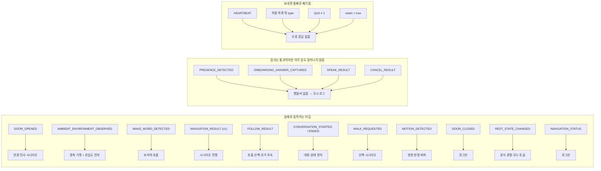

# MQTT 토픽 및 메시지 계약

> **이 문서의 자리:** 공통 토픽 구조·봉투 규칙·식별자 규약, 그리고 "보냈는데 아무 일도 안 일어나는" 사고의 원인 목록입니다.
> **타입별 payload 의 최종 기준은 [`scenario-contract-v1.md`](./scenario-contract-v1.md)** 이며, 두 문서가 충돌하면 시나리오 계약 v1을 따릅니다.
> 처음 오신 분은 [`backend-robot-contract-explained.md`](./backend-robot-contract-explained.md)(비유로 푼 설명판)를 먼저 읽으면 빠릅니다.
> 최종 코드 대조: **2026-08-16** (`main` `e1c09a97`)

## 1. 목적과 범위

이 문서는 BOMI 외부 장치(IoT 센서·Robot Bridge·AI Chat)와 Spring Boot 백엔드 사이의 MQTT 통신에서 **모든 메시지가 공통으로 지켜야 하는 것**을 정의합니다. 어떤 메시지가 어떤 시나리오를 움직이는지, 각 타입의 payload 에 무엇이 들어가는지는 시나리오 계약 v1의 소관입니다.

현재 계약이 다루는 시나리오는 다섯입니다 — 온습도 안부, 복약 알림, "보미야" 호출, 산책, 현관 인사.

Robot 내부의 MQTT Bridge가 MQTT 메시지와 ROS 2 명령·결과를 변환합니다. MQTT Broker가 ROS 2 노드나 토픽과 직접 연결되는 구조가 아닙니다. 로봇이 말하는 문장은 Bridge가 아니라 같은 젯슨의 별도 프로세스인 AI Chat이 담당합니다.

시나리오 상태와 전체 흐름은 [`../scenario/homecoming-welcome.md`](../scenario/homecoming-welcome.md)를 참고합니다.

## 2. 기본 규칙

- 토픽 버전은 `v1`입니다.
- payload는 UTF-8 JSON 객체입니다.
- 필드 이름은 `lowerCamelCase`, enum 값은 `UPPER_SNAKE_CASE`를 사용합니다.
- 시각은 타임존 오프셋을 포함한 ISO 8601 문자열을 사용합니다. 오프셋이 없으면 봉투 검증에서 거부됩니다.
- 토픽에는 사용자 이름, 토큰, 비밀번호 같은 개인정보나 비밀값을 넣지 않습니다.
- MQTT에는 명령과 작은 상태·결과만 전송하고 영상·음성 바이너리는 전송하지 않습니다.
- 모든 토픽은 `retain=false`를 사용합니다. 과거 명령이 재연결한 Robot에서 실행되면 안 됩니다. **retained 메시지는 파서가 통째로 거부합니다.**
- **QoS는 1 고정입니다.** 백엔드는 수신 QoS가 설정값(`bomi.mqtt.qos`)과 정확히 같지 않으면 **파서에 닿기도 전에** 메시지를 버립니다. 이 설정은 `@Min(1) @Max(1)`로 1에 묶여 있어 운영에서 바꿀 수도 없습니다. 즉 **QoS 0으로 보낸 메시지는 이유도 없이 사라집니다.**
- QoS 1에서는 같은 메시지가 두 번 도착할 수 있습니다. 수신자는 `eventId`로 중복을 걸러야 합니다(중복 제거의 실제 유효 범위는 §4 참고).
- `eventId`는 생산자와 관계없이 BOMI 시스템 전체에서 충돌하지 않는 불투명 문자열을 사용합니다.

> **위반의 대가는 "무응답"입니다.** 계약을 어긴 메시지에 백엔드는 오류를 되돌려 주지 않습니다. 경고 로그 한 줄을 남기고 ack 한 뒤 버립니다. 보낸 쪽에서는 "아직 처리 중"과 구별되지 않습니다. 그래서 이 문서의 규칙은 대부분 "지키면 좋은 것"이 아니라 "어기면 메시지가 없던 일이 되는 것"입니다.

## 3. 토픽 구조

기본 형식은 다음과 같습니다.

```text
bomi/v1/{domain}/{sourceId}/{channel}
```

| 용도 | 토픽 | 발행자 | 구독자 | QoS |
| --- | --- | --- | --- | ---: |
| IoT 이벤트 | `bomi/v1/iot/{sourceId}/events` | IoT 센서 | Backend | 1 |
| Robot 명령 | `bomi/v1/robot/{robotId}/commands` | Backend | Robot MQTT Bridge | 1 |
| AI 대화 명령 | `bomi/v1/ai/{robotId}/commands` | Backend | 해당 Robot의 AI Chat | 1 |
| Robot 업무 이벤트 | `bomi/v1/robot/{robotId}/events` | Robot MQTT Bridge · AI Chat | Backend | 1 |
| Robot 진행 상태 | `bomi/v1/robot/{robotId}/status` | Robot MQTT Bridge | Backend | 1 |
| Robot 최종 결과 | `bomi/v1/robot/{robotId}/results` | Robot MQTT Bridge | Backend | 1 |

Backend 구독 패턴은 다음 넷이 전부입니다.

```text
bomi/v1/iot/+/events
bomi/v1/robot/+/events
bomi/v1/robot/+/status
bomi/v1/robot/+/results
```

**백엔드는 `bomi/v1/ai/+/…` 를 구독하지 않습니다.** AI Chat이 발행하는 `CONVERSATION_STARTED`·`CONVERSATION_ENDED`도 AI 토픽이 아니라 **`bomi/v1/robot/{robotId}/events`** 로 보내야 백엔드에 닿습니다. AI 토픽은 백엔드가 쓰기만 하는 단방향 명령함입니다.

토픽의 `{sourceId}`·`{robotId}` 자리에는 `[A-Za-z0-9._-]` 1~64자만 쓸 수 있습니다.

### 3.1 무엇이 실제로 동작하는가

허용 목록에 있다는 것과 무슨 일이 일어난다는 것은 다릅니다. 백엔드가 수용하는 타입은 16개지만, 그중 넷은 파서를 통과한 뒤 **처리할 핸들러가 없어** 무시 로그만 남깁니다. 이 그림을 먼저 보면 "규격은 다 맞췄는데 왜 아무 일도 안 일어나지"라는 가장 흔한 사고를 피할 수 있습니다.



`REST_STATE_CHANGED`와 `NAVIGATION_STATUS`는 백엔드 쪽 수신은 살아 있지만 **로봇 쪽 발행자가 없습니다**(§7). 그래서 위 그림의 왼쪽에 있어도 실제 트래픽은 0입니다.

## 4. 식별자와 상관관계

| 필드 | 적용 메시지 | 설명 |
| --- | --- | --- |
| `eventId` | 이벤트·상태·결과 | 논리 이벤트 식별자. 같은 사건을 재전송할 때 같은 값 유지. 최대 64자 |
| `scenarioId` | Robot 명령·결과, 대화 이벤트 | Backend가 생성한 E2E 시나리오 식별자(UUID) |
| `commandId` | Robot 명령·결과 | 명령과 결과를 연결하는 식별자. 최대 64자 |
| `conversationId` | 대화 명령·이벤트 | 대화 하나를 가리키는 식별자(UUID) |
| `robotId` | Robot 메시지 | 토픽의 `{robotId}`와 반드시 동일해야 함 |
| `sourceId` | IoT 메시지 | 토픽의 `{sourceId}`와 반드시 동일해야 함 |
| `occurredAt` | 모든 메시지 | 이벤트 발생 시각. 전송 시각이 아님 |

**상관관계 ID는 언제나 최상위 필드입니다.** `payload` 안에 `scenarioId`를 넣는 형식은 구계약(legacy)이며, 새로 쓰지 않습니다. 특히 최상위 `scenarioId`/`commandId`와 `payload.scenarioId`를 **한 메시지에 함께 담으면 v1/legacy 혼용으로 보고 통째로 거부**됩니다(§9).

`scenarioId`·`conversationId`는 PostgreSQL의 해당 UUID 컬럼 값이며 **canonical 36자 형식만 통과**합니다. `1-1-1-1-1` 같은 축약형은 Java의 `UUID.fromString`이 받아 주더라도 파서가 다시 걸러냅니다.

**`robotId`는 UUID가 아닙니다 — `robot.device_id` 입니다.** 예시의 `robot-001`, 실기의 `bomi-AA001`이 그 공간이며 `[A-Za-z0-9._-]` 1~64자를 씁니다. REST 온보딩에서 쓰는 `robot.id` UUID와 섞으면 Backend가 로봇 레코드를 찾지 못해 메시지가 조용히 버려집니다. Backend가 명령에 싣는 값도 항상 `robot.getDeviceId()`입니다.

`eventId`와 `commandId`는 생산자가 만든 최대 64자의 불투명 식별자로, 팀이 확정한 UUIDv4/v7 또는 ULID 형식을 사용하고 재전송 시 원문을 유지합니다. 서로 다른 종류의 ID를 같은 값으로 재사용하지 않습니다.

최초 IoT 이벤트와 `WAKE_WORD_DETECTED`에는 아직 `scenarioId`·`commandId`가 없습니다. Backend가 시나리오와 명령을 생성한 이후의 메시지부터 해당 식별자를 사용합니다. 다만 "쓰지 않는다"와 "넣으면 거부된다"는 다릅니다 — **`WAKE_WORD_DETECTED`는 상관관계 ID를 넣으면 거부**되고, 나머지 배경 이벤트는 있어도 통과합니다.

### 4.1 그렇다면 무엇이 중복을 막고 있는가

현재 12테이블 ERD에는 모든 `eventId`·`commandId`를 저장할 통신 원장이 없습니다. 시나리오 시작 이벤트만 `scenario.external_event_id`에 보관합니다.

중복을 실제로 막는 것은 백엔드 프로세스 **메모리 안의 10분짜리 기억**입니다.

| 성질 | 실제 |
| --- | --- |
| 보관 위치 | 애플리케이션 메모리(`ConcurrentHashMap`) |
| 유효 시간 | **10분** (최대 10만 건) |
| 재시작 | **소실** — 같은 `eventId`가 새 메시지로 처리됨 |
| 다중 인스턴스 | **비공유** — 인스턴스마다 따로 기억함 |

따라서 이 문서의 식별자 규칙은 통신 계약이며, Backend 재시작을 넘어선 모든 메시지 중복 제거를 DB가 보장한다는 뜻이 아닙니다. `fact_candidate`의 물리 반영 멱등성은 후보 잠금, `materialized_at`, 최종 테이블 `source_candidate_id` 유일성으로 보장하지만 MQTT 수신 원장을 대신하지 않습니다.

### 4.2 필드 화이트리스트는 네 타입에만 있습니다

아래 네 타입은 봉투와 payload 모두 화이트리스트로 검사합니다. **목록에 없는 필드가 하나라도 있으면 메시지 전체가 거부됩니다.**

| 타입 | 봉투 허용 필드 | payload 허용 필드 |
| --- | --- | --- |
| `WAKE_WORD_DETECTED` | `eventId`, `robotId`, `type`, `occurredAt`, `payload` | `keyword`(필수 ≤20자), `confidence`(선택 0~1) |
| `WALK_REQUESTED` | 위 + `conversationId` | `action`, `source` |
| `NAVIGATION_RESULT`(v1 경로만) | 위 + `scenarioId`, `commandId` | `outcome`, `resultCode`, `reasonCode`, `location`, `message` |
| `FOLLOW_RESULT` | 위 + `scenarioId`, `commandId` | `outcome`, `resultCode`, `reasonCode`, `message` |

**나머지 타입에는 화이트리스트가 없습니다.** IoT 이벤트 전부, `REST_STATE_CHANGED`, `NAVIGATION_STATUS`, `CONVERSATION_STARTED`/`ENDED`, `SPEAK_RESULT`, `CANCEL_RESULT`는 모르는 필드가 있어도 통과합니다. 이 비대칭을 모르면 두 방향으로 틀립니다 — "전부 엄격하다"고 외우면 불필요하게 겁을 먹고, "전부 느슨하다"고 외우면 메시지가 사라집니다. 다만 느슨한 쪽에 기대어 만든 여분 필드는 다음 개정에서 화이트리스트가 붙는 순간 조용히 죽으므로, 계약대로만 보내는 편이 낫습니다.

## 5. IoT 센서 이벤트

Backend가 받는 IoT 이벤트 타입은 다섯입니다. 타입별 payload 규정은 [`scenario-contract-v1.md`](./scenario-contract-v1.md) §4.1을 따릅니다.

| `type` | 센서 | 뜻 | Backend 처리 |
| --- | --- | --- | --- |
| `DOOR_OPENED` | SONOFF SNZB-04P | 문 접점이 열렸다 | 현관 인사 시나리오 시작(스위치 off) 또는 방향 판정 투입(스위치 on) |
| `DOOR_CLOSED` | SONOFF SNZB-04P | 문 접점이 닫혔다 | 수신 후 디버그 로그만. 방향 정보가 없어 상태를 바꾸지 않는다 |
| `MOTION_DETECTED` | SONOFF SNZB-03P | 현관에서 움직임이 있었다 | 방향 판정기에 투입만 한다. 단독으로 시나리오를 시작하지 않는다 |
| `AMBIENT_ENVIRONMENT_OBSERVED` | DHT11 수집기 | 온습도 스냅샷 | 관측 기록(항상) + 임계 판정 후 온습도 안부 시나리오 |
| `PRESENCE_DETECTED` | (없음) | 방향 판정 완료 | **아무 일도 하지 않는다** — 아래 참고 |

`DOOR_CLOSED`처럼 Backend가 아무것도 하지 않는 타입도 허용 목록에는 있어야 합니다. 목록 밖 타입은 계약 위반으로 폐기되기 때문입니다.

`HEARTBEAT`는 **이 계약의 타입이 아닙니다.** Backend의 IoT 허용 목록에 없어 보내면 계약 위반으로 폐기되고, IoT 번역기도 발행하지 않습니다. 로봇 `ai_chat`의 현관 모듈만 이 이름을 알고 있으며, 라즈베리파이 생존 확인은 아직 합의되지 않은 미결 항목입니다.

### 5.1 센서 `sourceId` 등록 요건 — "시나리오가 안 뜬다"의 첫 확인 지점

봉투가 완벽해도 **`sourceId`가 백엔드 설정에 등록돼 있지 않으면** 어느 어르신의 센서인지 알 수 없어 경고 로그 한 줄과 함께 버려집니다. 예외를 던지지 않는 이유는 브로커가 무한 재전송하는 것을 막기 위해서입니다.

| 설정 키 | 현재 등록값 | 미등록 시 |
| --- | --- | --- |
| `bomi.homecoming.sensor-to-senior` | `door-sensor-01`, `pir`, `door_sensor`(임시 워크어라운드) | 현관 이벤트 폐기 |
| `bomi.observation.ambient-sensor-to-senior` | **`ambient-sensor-01`** 하나뿐 | 온습도 관측이 저장조차 되지 않음 |

온습도 안부가 조용한 첫 번째 원인이 이것입니다. `sourceId` 한 글자 차이가 시나리오 전체를 침묵시킵니다.

### 5.2 현관 — 트리거는 `DOOR_OPENED` 하나입니다

현재 현관 인사 시나리오의 트리거는 **`DOOR_OPENED` 하나**입니다. 스위치 `bomi.entrance.direction-resolution-enabled`가 이 동작을 가릅니다.

| 스위치 | `DOOR_OPENED` 도착 시 | `MOTION_DETECTED` 도착 시 |
| --- | --- | --- |
| `false` (**현재 기본값**) | 방향을 묻지 않고 즉시 현관 인사 시작 | 방향 판정기에 들어가지만 아무 효과 없음 |
| `true` | 시나리오를 시작하지 않고 방향 판정 버퍼에 투입 | 같은 버퍼에 투입. 두 신호의 **순서**로 IN/OUT이 확정될 때만 시나리오 시작 |

**어느 하나도 단독으로는 방향을 모릅니다.** 방향은 두 신호의 **순서**에서만 나옵니다.

```text
문 열림 → 실내 모션   = IN  (귀가)
실내 모션 → 문 열림   = OUT (외출)
둘 중 하나만          = 판정 불가. 재실 상태를 건드리지 않는다
```

기본값이 `false`인 이유는 그 순서가 센서 배치에 좌우되기 때문입니다. 문 근처 PIR이 바깥에서 다가오는 사람을 접점보다 먼저 볼 수 있고, 그러면 `MOTION → DOOR_OPENED`(=OUT)로 읽혀 귀가하신 어르신께 "다녀오세요"라고 합니다. 센서가 어디를 보는지는 현장 실측이 답할 문제라 꺼둔 채 배포하고 리허설 뒤에 켭니다. **끈 상태에서는 재실 전이도 `occupancy_event`도 기록되지 않아 외출 횟수가 0으로 남습니다** — 의도적으로 수용한 손실입니다.

상관 판정 시간 창은 `bomi.entrance.correlation-window`(기본 15초)로 조정합니다. **이 판정을 서버에 둔 이유가 그것입니다** — 튜닝에 펌웨어나 로봇 배포가 필요해서는 안 됩니다.

`MOTION_DETECTED`를 만드는 것은 펌웨어가 아니라 **라즈베리파이 번역기**입니다. Zigbee2MQTT의 `occupancy` 전이를 계약 이벤트로 옮기는 경로(`kind: pir`)가 구현돼 있고 Backend에도 `pir` 센서가 등록돼 있습니다. 실제 배포에 PIR이 물려 있는지는 현장 확인 사항이며, 그 토픽이 조용한 동안에는 통과가 판정되지 않을 뿐 아무것도 깨지지 않습니다.

`payload.location`은 IoT 번역기가 실제로 실어 보내지만(`{"location": "ENTRANCE"}`), **Backend는 문 이벤트의 payload를 읽지 않습니다** — 어느 어르신의 문인지는 `sourceId`로만 판단합니다.

#### 시각

`occurredAt`은 규약대로 타임존을 포함한 ISO 8601이지만, **백엔드는 순서 판정에 도착 시각을 씁니다.** 배터리 백업 RTC가 없는 라즈베리파이는 시계가 몇 년 어긋난 채로 부팅할 수 있고, 그 값으로 순서를 매기면 귀가가 외출로 뒤집힙니다. 원본 시각은 기록만 하며, 어긋남이 크면 로봇이 경고를 남깁니다.

#### `PRESENCE_DETECTED`는 더 이상 쓰지 않습니다

파서 허용 목록에는 아직 남아 있지만 **수신 핸들러가 없어 도착해도 아무 일이 일어나지 않고**, IoT도 발행하지 않습니다. 방향 판정은 IoT가 아니라 Backend가 두 원시 신호로 수행합니다. 목록에 남겨 둔 이유는 이 타입을 보내는 배포가 아직 남아 있을 가능성 때문이며, IoT 전환이 끝나면 제거합니다.

### 5.3 온습도 — 기록이 먼저, 판정이 나중

payload 키는 **`temperatureC`·`humidityPercent`** 입니다. 백엔드는 이 두 키를 예외 없는 방식으로 읽기 때문에, 키 이름이 어긋나면 값이 `null`로 읽혀 **로그도 없이** 임계 판정에서 제외됩니다.

| 필드 | 필수 | 설명 |
| --- | --- | --- |
| `payload.temperatureC` | 예 | 섭씨 온도 |
| `payload.humidityPercent` | 예 | 상대습도 `%RH`, 0~100 |
| `payload.location` | 아니오 | IoT가 실어 보내는 논리 위치(`LIVING_ROOM`). Backend는 읽지 않음 |
| `payload.comfortAssessment` | 아니오 | Backend가 돌봄 기록에 그대로 옮김. 현재 IoT는 보내지 않음 |
| `payload.observedAt` | 아니오 | 있으면 돌봄 기록의 `occurred_at`으로 쓰임. 현재 IoT는 보내지 않음 |

Backend는 도착한 관측을 **항상** 기록합니다 — `robot`의 온습도 스냅샷 3컬럼을 갱신하고 `ENVIRONMENT_OBSERVATION` 돌봄 기록을 남깁니다. 임계 판정은 그 다음의 **별개 단계**이며, 온도 30.0℃ **이상** 또는 습도 80.0% **이상**(둘 중 하나만 넘어도)일 때 온습도 안부 시나리오를 시작합니다(쿨다운 30분). 임계 미만이어도, 시나리오 스위치가 꺼져 있어도 관측은 남습니다.

발행 주기는 장치가 정합니다. 현재 DHT11 수집기는 `READ_INTERVAL_SECONDS`(기본 30초)마다 **무조건** 발행하며, IoT 쪽에 변화량·임계 게이팅은 없습니다. 초당 원시 스트림을 중앙으로 보내지 않는다는 원칙만 지킵니다.

> **알려진 갭**: 스냅샷 갱신에 시각 비교가 없습니다. 늦게 도착한 오래된 관측이 최신 값을 덮어씁니다.

## 6. Backend → 장치 명령

명령의 공통 형태는 다음과 같습니다.

```json
{
  "commandId": "01K0M4Y8B7F5M2N1Q9R6S3T8VX",
  "scenarioId": "6fd94c8c-3903-4a01-a82d-819e0c8edb12",
  "robotId": "robot-001",
  "type": "NAVIGATE",
  "occurredAt": "2026-08-16T10:30:01+09:00",
  "expiresAt": "2026-08-16T10:32:01+09:00",
  "payload": {
    "target": "ENTRANCE"
  }
}
```

| 필드 | 필수 | 설명 |
| --- | --- | --- |
| `commandId` | 예 | 명령 멱등 키 (≤64자) |
| `scenarioId` | 예 | 이 명령이 속한 시나리오 ID |
| `robotId` | 예 | 대상 Robot의 `device_id`. 토픽과 일치해야 함 |
| `type` | 예 | 명령 타입 |
| `occurredAt` | 예 | Backend가 명령을 생성한 시각 |
| `expiresAt` | 예 | Robot이 명령 실행을 시작할 수 있는 마지막 시각 |
| `payload` | 예 | 명령 타입별 데이터 |

Robot은 `expiresAt`이 지난 명령을 실행하지 않고 `COMMAND_EXPIRED` 실패 결과를 발행합니다. **이미 처리한 `commandId`를 다시 받으면 실행도 회신도 하지 않고 조용히 버립니다** — 결과를 다시 발행하지 않습니다. 중복 판정이 만료 검사보다 먼저입니다.

### 6.1 명령함이 둘이라는 것

몸을 움직이는 명령과 말하는 명령이 서로 다른 토픽으로 갑니다.

| 명령 | 토픽 | payload | 뜻 |
| --- | --- | --- | --- |
| `NAVIGATE` | `robot/…/commands` | `target` **정확히 1개** — `LIVING_ROOM｜ENTRANCE｜DEFAULT` | 그 위치로 이동 |
| `FOLLOW_START` | `robot/…/commands` | 빈 객체 `{}` | 사람을 찾아 따라가기 시작 |
| `FOLLOW_STOP` | `robot/…/commands` | 빈 객체 `{}` | 따라가기 중단 |
| `CANCEL` | `robot/…/commands` | `targetCommandId` + `reasonCode` **정확히 2개** | 진행 중 명령 취소 |
| `START_CONVERSATION` | **`ai/…/commands`** | `seniorId` + `intent` + `text` + `triggerContext` **4개 필수** | 이 취지로 대화를 시작 |

payload 키가 규정과 다르면 Backend의 명령 객체 생성 단계에서 거부되므로 발행 자체가 되지 않습니다. `waypointId`·`DEFAULT_POSITION`은 과거 표현이며 이 계약에서 쓰지 않습니다.

Robot은 논리 위치 이름을 자기 좌표 파일(`core/config/room_waypoints.yaml`)의 웨이포인트로 옮깁니다 — `ENTRANCE`→`entrance`, `LIVING_ROOM`→`sofa`, `DEFAULT`→`charging`(충전소). 좌표나 Nav2 세부 파라미터는 MQTT 계약에 노출하지 않습니다.

`CANCEL`의 `reasonCode`에 Backend가 실제로 넣는 값은 현재 `OPERATOR_CANCELLED` 하나입니다. Bridge는 이 payload를 읽지 않고 진행 중인 목표를 무조건 취소합니다. 취소 요청을 받았다는 이유만으로 대상 작업을 성공 처리하지는 않습니다.

### 6.2 `START_CONVERSATION`의 10초

로봇 명령의 `expiresAt`은 기본 2분이지만, **`START_CONVERSATION`만 10초**입니다. AI는 10초 안에 `CONVERSATION_STARTED`를 회신해야 하고, 늦으면 Backend가 대화를 접습니다. 대화 자체의 상한은 5분입니다.

`intent`는 `WELLNESS_CHECK｜MEDICATION_REMINDER｜HOMECOMING_GREETING` 셋뿐입니다. `triggerContext`는 계약 예시보다 필드가 많을 수 있으므로 엄격 파싱하지 마십시오. 자세한 형식은 [`scenario-contract-v1.md`](./scenario-contract-v1.md) §6.1을 따릅니다.

### `SPEAK`

> **현재 Backend는 `SPEAK`를 어디서도 발행하지 않습니다.** 명령 타입은 계약에 남아 있지만 발행 경로가 없고, `SPEAK_RESULT` 수신 핸들러도 없습니다. 로봇이 말하는 모든 문장은 `START_CONVERSATION`을 통해 AI가 스스로 말합니다.
>
> 과거 계약이 정의했던 `utteranceId`·`audioUri`·`contentType` 기반의 "Backend가 만든 음성 파일을 Robot이 내려받아 재생" 경로는 저장소에 구현이 없습니다. 이 절을 근거로 로봇 쪽 오디오 다운로드를 구현하지 마십시오.

## 7. Robot 진행 상태

### `REST_STATE_CHANGED`

> **미배선(2026-08-16).** Robot 쪽 발행자가 없고(Bridge의 `publish_rest_state` 호출자 0개), Backend는 payload의 **`restState` 하나만** 읽습니다. `posture`·`detectionMethod`·`detectionDurationSeconds`·`confidence`·`policyVersion`·`robotMode`는 과거 계약의 규정이며 파싱되지 않습니다.

```json
{
  "eventId": "01K0REST8B7F5M2N1Q9R6S3T8V",
  "robotId": "robot-001",
  "type": "REST_STATE_CHANGED",
  "occurredAt": "2026-08-16T13:10:00+09:00",
  "payload": {
    "restState": "RESTING"
  }
}
```

`restState`는 `RESTING` 또는 `AWAKE`입니다. Backend는 `RESTING`에서 `robot.current_mode=REST_GUARD`와 `REST_OBSERVATION` 돌봄 기록을 멱등 반영하고, `AWAKE`에서 관찰을 종료 처리합니다. Robot은 `REST_GUARD` 중 일반 능동 대화·비긴급 알림·자율 시나리오를 중지하지만 호출 감지, 안전 감지, 긴급 대응은 계속 허용합니다.

금지 payload: 이미지·영상·관절 좌표·bounding box·track ID·얼굴 특징·프레임별 자세 배열. 누움 지속시간 미달 후보는 발행하지 않고 최종 전이만 발행합니다.

### `NAVIGATION_STATUS`

> **미배선(2026-08-16).** 발행자가 없고, Backend 핸들러는 로그 한 줄뿐입니다. 특히 **`sequence`는 Backend 어디서도 읽지 않습니다** — 단조 증가·역전 무시·`(commandId, sequence)` 기준 적용 같은 과거 규정은 구현된 적이 없습니다. "이동 중" 표시는 MQTT가 아니라 로봇 내부 ROS 2 토픽으로 나갑니다.

진행 상태는 화면 표시와 관찰 가능성을 위한 정보이며 최종 성공·실패 판정은 `results` 토픽으로 전달합니다. Backend는 진행 상태만으로 시나리오를 도착 또는 실패로 전환하지 않습니다.

## 8. Robot 업무 이벤트

`WAKE_WORD_DETECTED`·`WALK_REQUESTED`·`CONVERSATION_STARTED`·`CONVERSATION_ENDED`의 payload 규정은 [`scenario-contract-v1.md`](./scenario-contract-v1.md) §4.1·§6.2·§6.3을 따릅니다. 아래에는 이 문서가 책임지는 상관관계 배치만 적습니다.

| 타입 | 최상위 필수 상관관계 ID | payload |
| --- | --- | --- |
| `WAKE_WORD_DETECTED` | **없음**(넣으면 거부) | `keyword`, `confidence?` |
| `WALK_REQUESTED` | `conversationId`(선택) | `action`, `source` |
| `CONVERSATION_STARTED` | `scenarioId` + `conversationId` + `commandId` **셋 다** | `intent` |
| `CONVERSATION_ENDED` | `scenarioId` + `conversationId` (`commandId` 없음) | `outcome`, `reasonCode` |

### `CONVERSATION_ENDED`

대화가 끝났을 때 **AI Chat 프로세스가 직접** 발행합니다(Robot MQTT Bridge를 거치지 않습니다). `outcome`은 `COMPLETED｜NO_RESPONSE｜CANCELLED｜FAILED`이며, `reasonCode`는 **키 자체가 항상 있어야 하고**(값 null 허용) `FAILED`이면 null이 아니어야 합니다.

```json
{
  "eventId": "01K0CONVEND7F5M2N1Q9R6S3T8V",
  "type": "CONVERSATION_ENDED",
  "occurredAt": "2026-08-16T10:31:40+09:00",
  "robotId": "robot-001",
  "scenarioId": "6fd94c8c-3903-4a01-a82d-819e0c8edb12",
  "conversationId": "b721bf2a-cb0c-4df2-9c5a-2df7ad80fc69",
  "payload": {
    "outcome": "COMPLETED",
    "reasonCode": null
  }
}
```

종료 후 분기는 시나리오마다 다릅니다 — 현관 인사는 `reasonCode`에 따라 `NAVIGATE(DEFAULT)` 복귀와 `FOLLOW_START` 추종으로 갈립니다([`scenario-contract-v1.md`](./scenario-contract-v1.md) §8.5).

**이 이벤트가 오지 않으면 시나리오는 대화 상태에 머물다 워치독(`bomi.scenario-timeout.active-timeout`, 기본 10분)에 걸려 `TIMED_OUT`이 되고, 로봇은 `SAFE_STOP`으로 잠깁니다**(§10). 산책의 `FOLLOWING`만 정상적으로 이 시간을 넘길 수 있어 공용 워치독에서 제외됩니다.

### `ONBOARDING_ANSWER_CAPTURED`

> **미배선(2026-08-16).** 파서 허용 목록에는 있지만 **수신 핸들러가 없어** 도착해도 무시 로그만 남습니다. 로봇도 이 타입을 발행하지 않습니다. 아래 서술은 설계이며 현재 코드가 아닙니다.

로봇이 초기 온보딩 한 문항의 답변을 캡처했을 때 `events` 토픽으로 발행하도록 설계됐습니다. payload는 `sessionId`·`questionCode`·`verificationStatus`가 필수이고 `sourceConversationId`·`sourceMessageId`가 선택입니다. 재전송 시 같은 `eventId`·`sessionId`·`questionCode`를 유지합니다.

구현될 때 Backend는 토픽/메시지 `robotId`가 세션의 로봇과 일치하고 세션이 진행 중인지 먼저 검사하고, 질문 코드를 해당 버전의 질문 계약에서 검증한 뒤 `onboarding_answer.answer_value`에 반영합니다. `UNIQUE(session_id, question_code)`로 질문별 현재 답변 하나를 유지합니다.

전체 STT, 원본·인코딩 음성, 토큰, 전체 프롬프트·모델 응답은 MQTT에 포함하지 않습니다. 실제 답변 텍스트는 `sourceConversationId`·`sourceMessageId`로 대화 기록에서 찾습니다.

## 9. Robot 최종 결과

결과 3종의 봉투는 같은 모양입니다 — **봉투에 상관관계 ID 둘(`scenarioId`·`commandId`), payload에 결과 3키(`outcome`·`resultCode`·`reasonCode`)**. 타입별로 달라지는 것은 `resultCode`와 `reasonCode`의 허용 집합뿐입니다.

| 결과 타입 | `resultCode` | Backend 수신 |
| --- | --- | --- |
| `NAVIGATION_RESULT` | `ARRIVED｜NOT_ARRIVED` | 있음 — 시나리오를 움직인다 |
| `FOLLOW_RESULT` | `STARTED｜STOPPED｜UNCHANGED` | 있음 |
| `SPEAK_RESULT` | `SPOKEN｜NOT_SPOKEN` | **없음**(아래 배너) |
| `CANCEL_RESULT` | `TARGET_CANCELLED｜TARGET_UNCHANGED` | **없음**(아래 배너) |

`outcome`은 넷 공통으로 `SUCCEEDED｜FAILED｜CANCELLED｜TIMED_OUT`입니다.

### `NAVIGATION_RESULT`

성공 예시:

```json
{
  "eventId": "01K0M50D4S8V2X6Z1B3N7Q9RTP",
  "commandId": "01K0M4Y8B7F5M2N1Q9R6S3T8VX",
  "scenarioId": "6fd94c8c-3903-4a01-a82d-819e0c8edb12",
  "robotId": "robot-001",
  "type": "NAVIGATION_RESULT",
  "occurredAt": "2026-08-16T10:30:15+09:00",
  "payload": {
    "outcome": "SUCCEEDED",
    "resultCode": "ARRIVED",
    "reasonCode": null
  }
}
```

실패 예시:

```json
{
  "eventId": "01K0M50D4S8V2X6Z1B3N7Q9RTQ",
  "commandId": "01K0M4Y8B7F5M2N1Q9R6S3T8VX",
  "scenarioId": "6fd94c8c-3903-4a01-a82d-819e0c8edb12",
  "robotId": "robot-001",
  "type": "NAVIGATION_RESULT",
  "occurredAt": "2026-08-16T10:30:15+09:00",
  "payload": {
    "outcome": "FAILED",
    "resultCode": "NOT_ARRIVED",
    "reasonCode": "PATH_BLOCKED"
  }
}
```

결과 판정 키는 **`payload.outcome` + `payload.resultCode`** 입니다.

| 필드 | 필수 | 값 |
| --- | --- | --- |
| `payload.outcome` | 예 | `SUCCEEDED`, `FAILED`, `CANCELLED`, `TIMED_OUT` |
| `payload.resultCode` | 예 | `ARRIVED`, `NOT_ARRIVED` |
| `payload.reasonCode` | **키는 항상 필요**(값 null 허용) | 아래 7개 중 하나 또는 `null` |
| `payload.location` | 아니오 | `LIVING_ROOM｜ENTRANCE｜DEFAULT`. **`resultCode=ARRIVED`일 때만 허용** |
| `payload.message` | 아니오 | 진단 문자열 |

교차 제약: `SUCCEEDED` → `ARRIVED` + `reasonCode: null`. 그 밖의 outcome → `NOT_ARRIVED` + `reasonCode` 필수.

현재 Bridge는 `location`·`message`를 발행하지 않고 위 세 키만 채웁니다.

Backend는 `SUCCEEDED`일 때만 시나리오를 진행하고, 그 밖의 종결은 시나리오를 종료하며 로봇을 `SAFE_STOP`으로 전환합니다(§10).

> **legacy 형식 경고.** `payload.status`(`ARRIVED｜FAILED｜CANCELLED`)를 쓰던 구형식은 파서가 아직 통과시키지만 `commandId` 대조를 건너뛰고 경고 로그를 남깁니다. 새로 쓰지 마십시오. 그리고 **최상위 `scenarioId`/`commandId`와 `payload.status`(또는 `payload.scenarioId`)를 한 메시지에 섞으면 v1/legacy 혼용으로 보고 통째로 거부**됩니다.

### `reasonCode` 허용 집합

`reasonCode`는 결과 타입마다 허용 집합이 다르며, **집합 밖의 값을 보내면 Backend가 메시지를 통째로 폐기합니다.** 두 목록은 포함 관계가 아닙니다.

| 결과 타입 | 허용 `reasonCode` |
| --- | --- |
| `NAVIGATION_RESULT` | `COMMAND_EXPIRED`, `UNKNOWN_TARGET`, `PATH_BLOCKED`, `LOCALIZATION_LOST`, `EXECUTION_TIMEOUT`, `SAFETY_STOP`, `INTERNAL_ERROR` (7개) |
| `FOLLOW_RESULT` | `PERSON_LOST`, `COMMAND_EXPIRED`, `EXECUTION_TIMEOUT`, `SAFETY_STOP`, `INTERNAL_ERROR` (5개) |

값은 최대 100자입니다. 새 코드가 필요하면 이 표와 백엔드 파서의 집합을 함께 바꿉니다. 과거 초안에 있던 `INVALID_COMMAND`·`NAVIGATION_ABORTED`·`AUDIO_DOWNLOAD_FAILED`·`AUDIO_PLAYBACK_FAILED`·`TARGET_COMMAND_NOT_FOUND`·`CANCEL_UNSUPPORTED`는 코드에 없습니다 — 지금 보내면 조용히 버려집니다.

### `SPEAK_RESULT` / `CANCEL_RESULT`

> **미배선(2026-08-16).** Backend에 수신 핸들러가 없어 보내도 무시 로그만 남습니다. 형식은 위 v1 3키 구조를 따르며, `payload.status`(`DONE`/`ALREADY_COMPLETED` 등)를 쓰던 과거 형식은 폐기됐습니다.

## 10. 유효성 및 보안

- 토픽의 `{sourceId}` 또는 `{robotId}`와 payload의 식별자가 다르면 메시지를 거부합니다.
- 알 수 없는 `type`이나 결과 코드는 임의로 성공 처리하지 않습니다.
- `occurredAt`이 파싱되지 않거나 필수 필드가 없으면 경고 로그를 남기고 폐기합니다.
- **위반 시 송신자에게는 아무 응답도 가지 않습니다.** 계약 위반은 `log.warn` 후 ack 되므로 재전송도 일어나지 않습니다. 반면 핸들러 내부 오류(DB 실패 등)는 ack 없이 재던져 브로커가 QoS 1 재전송을 하게 합니다 — 두 실패의 겉모습이 다릅니다.
- 생산자는 같은 논리 사건을 재전송할 때 같은 `eventId`를 유지합니다. 중복 제거의 실제 유효 범위는 §4.1을 참고합니다.
- Backend는 시나리오 시작 이벤트의 `eventId`를 `scenario.external_event_id`에 저장합니다. 다른 통신 이벤트는 현재 12테이블 ERD에 수신 원장으로 보존하지 않습니다.
- 로그에 인증 토큰이나 개인정보를 기록하지 않습니다.
- 운영 MQTT는 인증과 TLS를 적용합니다. 실제 인증정보는 저장소에 커밋하지 않습니다.
- Robot은 이미 처리한 `commandId`를 재실행하지 않습니다.
- `REST_STATE_CHANGED`에는 프레임·관절 좌표·track ID·얼굴 특징을 포함하지 않으며 휴식 후보가 아닌 최종 전이만 발행합니다.

### `SAFE_STOP` — 실패 하나가 로봇을 잠급니다

`COMPLETED`가 아닌 모든 시나리오 종료(`FAILED`·`CANCELLED`·`TIMED_OUT`)는 로봇 모드를 `SAFE_STOP`으로 만들고, 이후 모든 이동 시나리오가 차단됩니다.

**자동 복구 경로는 없습니다.** 재시작으로 풀리지 않고 MQTT로도 풀 수 없습니다. 개발·리허설에서는 `scripts/dev/reset-demo.sql`이 유일한 해제 수단이며, 리허설 사이마다 실행합니다.

같은 이유로 **어르신 한 명에게 활성 시나리오는 하나뿐**입니다. 진행 중인 시나리오가 있으면 새 트리거는 전부 거절되므로, "문을 열었는데 아무 반응이 없다"의 첫 번째 확인 지점이 여기입니다.

## 11. 담당자 구현 체크리스트

### IoT

- [ ] 문 이벤트는 `DOOR_OPENED`/`DOOR_CLOSED`, 현관 움직임은 `MOTION_DETECTED`로 보냄 (`PRESENCE_DETECTED`는 쓰지 않음)
- [ ] `sourceId`가 토픽의 장치 ID와 일치하고, **백엔드 매핑 설정에 등록된 값**임 (§5.1)
- [ ] 온습도 payload 키를 `temperatureC`/`humidityPercent`로 보냄
- [ ] 초당 원시 온습도 스트림을 중앙 MQTT/DB로 보내지 않음
- [ ] 재전송 시 같은 `eventId`를 유지함
- [ ] `HEARTBEAT` 등 허용 목록 밖 타입을 보내지 않음

### Backend

- [ ] 네 구독 패턴과 두 발행 토픽(robot/ai commands)을 설정함
- [ ] `robotId`가 `robot.device_id`와 일치하는지 검증함(UUID인 `robot.id`가 아님)
- [ ] 시나리오 시작 `eventId`를 `scenario.external_event_id`에 연결함
- [ ] 현재 12테이블 모델에서도 저장하지 않는 `commandId`·기타 `eventId`를 영속화했다고 가정하지 않음
- [ ] 만료·실패·순서 역전 결과를 처리함
- [ ] 최신 온습도 스냅샷과 임계 사건 저장을 분리함
- [ ] 미등록 `sourceId`를 예외가 아니라 경고 후 폐기로 처리함(브로커 재전송 폭주 방지)

### Robot

- [ ] MQTT Bridge가 `NAVIGATE`·`CANCEL`·`FOLLOW_START`·`FOLLOW_STOP`을 ROS 2 작업으로 변환함
- [ ] 결과 봉투의 `scenarioId`·`commandId`를 **최상위**에 그대로 echo 함
- [ ] `reasonCode` 키를 값이 `null`이어도 항상 넣음
- [ ] `FOLLOW_START`/`FOLLOW_STOP` ACK을 10초 안에 회신함(산책 보류 중이어도 스텁 회신은 보냄)
- [ ] 만료되거나 중복된 명령을 재실행하지 않음
- [ ] 음성 바이너리를 MQTT로 요청하거나 발행하지 않음
- [ ] `REST_GUARD`에서 일반 능동 기능을 억제하고 호출·안전·긴급 기능 allowlist는 유지함
- [ ] 프레임·관절 좌표·track ID·얼굴 특징을 휴식 이벤트에 포함하지 않음

### AI Chat

- [ ] `bomi/v1/ai/{robotId}/commands`를 구독하고 `START_CONVERSATION`을 **10초 안에** `CONVERSATION_STARTED`로 회신함
- [ ] 대화 이벤트를 AI 토픽이 아니라 **`bomi/v1/robot/{robotId}/events`** 로 발행함
- [ ] `CONVERSATION_STARTED`에 `scenarioId`·`conversationId`·`commandId` 셋을 최상위로 실음
- [ ] `CONVERSATION_ENDED`에 `scenarioId`·`conversationId`를 실고 payload에 `outcome`·`reasonCode`를 넣음
- [ ] `triggerContext`를 엄격 파싱하지 않음(계약 예시보다 필드가 많을 수 있음)
