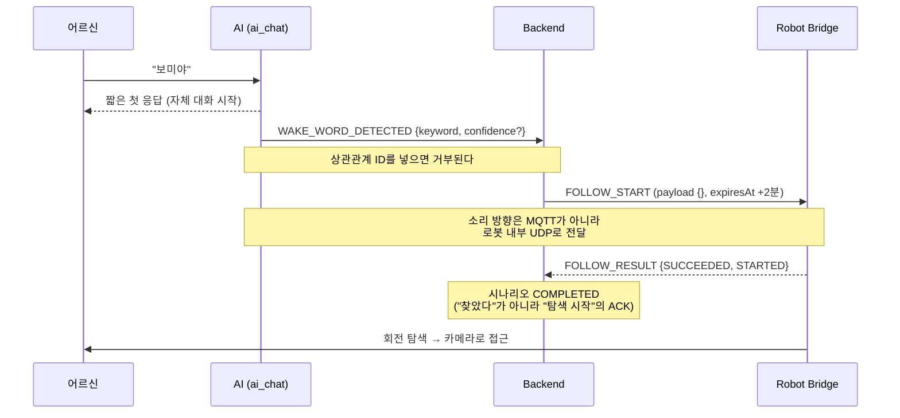
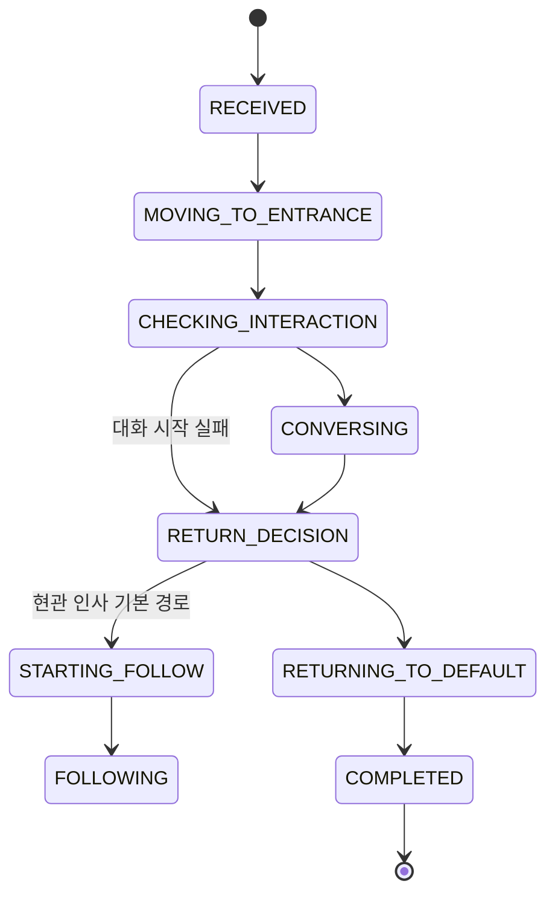

# BOMI 5대 시나리오 MQTT 계약 v1

## 1. 문서 정보와 우선순위

| 항목 | 값 |
|---|---|
| 상태 | **FINAL** |
| 계약 버전 | `1.1.0` |
| 확정일 | `2026-08-04` |
| 최종 개정일 | `2026-08-16` |
| 적용 범위 | 온습도 안부, 복약 알림, 호출, 산책, 현관 인사 |

이 문서는 위 5개 시나리오에서 Backend, Robot, AI가 주고받는 MQTT 메시지의 최종 기준이다.

[`MQTT 계약 쉽게 이해하기.md`](<./MQTT 계약 쉽게 이해하기.md>), [`토픽 규약.md`](<./토픽 규약.md>), AsyncAPI 문서 또는 현재 구현이 이 문서와 충돌하면 **이 문서를 우선한다**. 충돌하지 않는 기존 공통 규칙은 계속 사용할 수 있다.

> 이 문서가 대체했던 `backend-robot-contract.md`(백엔드 가정값 초안)는 2026-08-16 문서
> 최신화에서 삭제됐습니다. 그 문서에만 있던 유효한 내용(`DOOR_OPENED` 트리거, deviceId
> 규약)은 이 문서 §3·§4.1 과 `토픽 규약.md` 로 이관했습니다.

계약을 바꿔야 한다면 구현을 먼저 암묵적으로 바꾸지 않는다. 이 문서의 버전과 변경 내용을 먼저 합의한 뒤 각 컴포넌트를 함께 변경한다.

### 1.1 개정 이력

| 버전 | 무엇이 바뀌었나 | 왜 바뀌었나 | 누가 영향을 받나 |
|---|---|---|---|
| `1.0.0` (2026-08-04) | 최초 확정 | 5개 시나리오의 메시지 의미를 한 곳에 못 박기 위해 | 전 파트 |
| `1.1.0` (2026-08-16) | 호출 시나리오의 명령을 `NAVIGATE(LIVING_ROOM)`에서 `FOLLOW_START`로 정정, `reasonCode` 목록을 결과 타입별로 분리, 현관 인사 종료 경로의 두 갈래 명시, 상태 전이도를 실제 상태머신으로 교체, `START_CONVERSATION` 만료를 10초로 정정, 필드 화이트리스트·`robotId` ID 공간·IoT 이벤트 5종·센서 등록 요건 신설 | 위 §1 의 "구현을 먼저 바꾸지 않는다" 원칙이 이미 깨져 있었다. 08-04 확정 이후 구현이 앞서 나갔고 문서가 따라가지 않아, 이 문서를 읽고 구현한 외부 파트가 **말없이 폐기되는 메시지**를 만들고 있었다 | Robot Bridge, AI, 대시보드 구현자 |

이 개정은 계약의 *의미*를 새로 정하지 않았다. 이미 코드에 있던 사실을 문서가 따라잡은 것이다. 그래서 minor 버전만 올린다.

---

## 2. 한눈에 보는 최종 결정

### 2.1 전송 규칙

- 모든 메시지는 UTF-8 JSON이다.
- 필드 이름은 `lowerCamelCase`, 타입과 코드 값은 `UPPER_SNAKE_CASE`를 사용한다.
- MQTT 전송은 **QoS 1**, **retain=false**를 사용한다. Backend는 수신 QoS가 설정값(`bomi.mqtt.qos`, 기본 1)과 정확히 같지 않으면 파서에 닿기도 전에 메시지를 버린다. QoS 0으로 보내면 조용히 사라진다는 뜻이다. retained 메시지도 같다.
- QoS 1에서는 중복 전달이 정상적으로 발생할 수 있다. 수신자는 식별자로 중복을 제거해야 한다.
- 시간은 ISO 8601 offset datetime 문자열을 사용한다. 예: `2026-08-04T10:30:00+09:00`.

### 2.2 대화와 음성의 소유권

- `SPEAK`는 Robot에게 문장 하나를 재생하라고 지시하는 **단방향 발화 명령**이다. 사용자의 응답을 듣거나 대화를 이어 가지는 않지만, Robot은 명령 수행 결과인 `SPEAK_RESULT`를 보낸다. **다만 현재 Backend는 `SPEAK`를 어디서도 발행하지 않는다** — 명령 타입은 계약에 남아 있으나 발행 경로가 없고, `SPEAK_RESULT` 수신 핸들러도 없다. 로봇이 말하는 모든 문장은 `START_CONVERSATION`을 통해 AI가 말한다.
- 사용자의 응답을 들어야 하는 기능은 AI에게 `START_CONVERSATION`을 보낸다.
- `START_CONVERSATION`을 받은 AI가 첫 문장을 말하고, 음성을 듣고, 후속 턴을 진행하고, 종료 이벤트를 보낸다.
- 따라서 5대 시나리오 중 대화가 필요한 안부, 복약 확인, 현관 인사는 `START_CONVERSATION`을 사용한다. 고정 안내만 필요하면 `SPEAK`를 사용한다.
- 호출은 예외다. AI가 웨이크 워드를 감지하는 즉시 자체적으로 말하고 듣기 시작한다. Backend는 호출 대화를 다시 시작하지 않고 Robot에게 `FOLLOW_START`를 한 번 보내 탐색을 시작시키는 일만 한다. 로봇은 소리가 난 방향으로 제자리에서 돌아 사람을 찾고 스스로 다가간다 — 거실의 고정 좌표로 주행하지 않는다.

### 2.3 식별자 생성 책임

- Backend는 시나리오를 수락할 때 `scenarioId`를 UUID로 생성한다.
- Backend가 `START_CONVERSATION`으로 시작하는 대화는 명령을 보내기 전에 `conversationId`를 UUID로 생성한다. AI가 자체 시작하는 호출 대화는 예외이다.
- 각 메시지 생산자는 자신의 `eventId` 또는 `commandId`를 생성한다.
- `eventId`와 `commandId`는 내부 구조를 해석하지 않는 opaque 문자열이다.
- 같은 논리 메시지를 재전송할 때는 같은 ID를 유지한다. 새 메시지를 만들 때만 새 ID를 만든다.

---

## 3. 토픽

| 방향 | 용도 | 토픽 |
|---|---|---|
| IoT → Backend | 센서 이벤트 | `bomi/v1/iot/{sourceId}/events` |
| Robot/AI → Backend | 로봇 입력 및 대화 이벤트 | `bomi/v1/robot/{robotId}/events` |
| Robot → Backend | 로봇 명령 결과 | `bomi/v1/robot/{robotId}/results` |
| Robot → Backend | 로봇 상태 스냅샷 | `bomi/v1/robot/{robotId}/status` |
| Backend → Robot | 이동, 발화, 취소, 따라가기 명령 | `bomi/v1/robot/{robotId}/commands` |
| Backend → AI | 대화 시작 명령 | `bomi/v1/ai/{robotId}/commands` |

토픽의 `{sourceId}` 또는 `{robotId}`와 본문의 같은 필드는 반드시 일치해야 한다. 일치하지 않으면 수신자는 메시지를 거부한다. 두 값 모두 `[A-Za-z0-9._-]` 1~64자만 쓴다.

**`robotId`는 로봇의 `deviceId`다** — `robot.device_id` 컬럼의 값이며 예시의 `robot-001`, 실기의 `bomi-AA001`이 그 공간이다. REST 온보딩에서 쓰는 `robot.id` UUID와는 **다른 값**이고, 둘을 섞으면 Backend가 로봇을 찾지 못해 메시지가 버려진다. `scenarioId`·`conversationId`만 UUID이며 canonical 36자 형식만 통과한다(`1-1-1-1-1` 같은 축약형은 거부).

`CONVERSATION_STARTED`와 `CONVERSATION_ENDED`는 AI가 발행하더라도 별도 AI 이벤트 토픽을 만들지 않고 `bomi/v1/robot/{robotId}/events`로 보낸다. 이 토픽은 해당 로봇에서 관찰된 사용자 상호작용 이벤트를 모으는 경계로 본다.

---

## 4. 공통 메시지 형식

### 4.1 이벤트

IoT, Robot, AI가 Backend로 보내는 이벤트의 공통 형태는 다음과 같다.

```json
{
  "eventId": "evt-01K1WRYVYZEZQNSJ1T8V4A9K4T",
  "type": "CONVERSATION_STARTED",
  "occurredAt": "2026-08-04T10:30:06+09:00",
  "robotId": "robot-001",
  "scenarioId": "fc768674-3266-47bb-8348-1a7d222c84bd",
  "conversationId": "b721bf2a-cb0c-4df2-9c5a-2df7ad80fc69",
  "commandId": "cmd-01K1WRZBT79G96D54JG26N1YS7",
  "payload": {
    "intent": "WELLNESS_CHECK"
  }
}
```

필수 공통 필드는 `eventId`, `type`, `occurredAt`, `payload`이다.

- IoT 이벤트는 `sourceId`를 사용하고 `robotId`는 사용하지 않는다.
- Robot/AI 이벤트는 `robotId`를 사용하고 `sourceId`는 사용하지 않는다.
- 연관 ID인 `scenarioId`, `conversationId`, `commandId`는 값이 존재하는 경우 모두 **최상위 필드**에 둔다. `payload` 안에 중복해서 넣지 않는다.
- 아래 네 타입은 봉투와 `payload` 모두 **필드 화이트리스트**로 검사한다. 목록에 없는 필드가 하나라도 있으면 메시지 전체가 거부된다. 나머지 타입에는 화이트리스트가 없어 모르는 필드가 있어도 통과한다.

  | 타입 | 봉투 허용 필드 | `payload` 허용 필드 |
  |---|---|---|
  | `WAKE_WORD_DETECTED` | `eventId`, `robotId`, `type`, `occurredAt`, `payload` | `keyword`(필수, ≤20자), `confidence`(선택, 0~1) |
  | `WALK_REQUESTED` | 위 + `conversationId` | `action`, `source` |
  | `NAVIGATION_RESULT`(v1) | 위 + `scenarioId`, `commandId` | `outcome`, `resultCode`, `reasonCode`, `location`, `message` |
  | `FOLLOW_RESULT` | 위 + `scenarioId`, `commandId` | `outcome`, `resultCode`, `reasonCode`, `message` |

- `WAKE_WORD_DETECTED`에 `scenarioId`·`conversationId`·`commandId`를 넣으면 **거부**된다. 이 이벤트는 시나리오가 만들어지기 전의 최초 트리거이기 때문이다. 감지 방향 같은 부가 정보도 payload 화이트리스트 때문에 실을 수 없다 — 그런 값은 로봇 내부 채널로 보낸다.
- 반대로 `CONVERSATION_STARTED`와 `CONVERSATION_ENDED`에는 화이트리스트가 없다. 아래에 적은 형식은 *최소* 형식이며, 여분 필드가 있어도 파서를 통과한다. 그래도 계약대로만 보내는 편이 낫다 — 여유분에 기대어 만든 필드는 다음 개정에서 화이트리스트가 붙는 순간 조용히 죽는다.
- 아직 Backend가 시나리오를 만들기 전의 최초 트리거에는 `scenarioId`와 `commandId`가 없다. 이미 진행 중인 대화에서 나온 요청이라면 기존 `conversationId`는 포함할 수 있다.
- `CONVERSATION_STARTED`에는 `scenarioId`, `conversationId`, `commandId`가 모두 필요하다. 여기서 `commandId`는 대화를 시작한 `START_CONVERSATION` 명령의 ID이다.
- `CONVERSATION_ENDED`에는 `scenarioId`, `conversationId`가 필요하다. 최소 형식에서는 `commandId`를 넣지 않는다.

IoT 이벤트 예시는 다음과 같다.

```json
{
  "eventId": "evt-door-20260804-001",
  "type": "DOOR_OPENED",
  "occurredAt": "2026-08-04T18:10:00+09:00",
  "sourceId": "door-sensor-001",
  "payload": {
    "location": "ENTRANCE"
  }
}
```

IoT 이벤트로 Backend가 받는 `type`은 다섯 개다.

| `type` | 발행 주체 | Backend 처리 |
|---|---|---|
| `DOOR_OPENED` | 도어 센서(SNZB-04P) | 현관 인사 시나리오 시작 |
| `DOOR_CLOSED` | 도어 센서 | 수신 후 디버그 로그만. 방향 정보가 없어 상태를 바꾸지 않는다 |
| `MOTION_DETECTED` | 현관 PIR(SNZB-03P) | 방향 판정기에 투입만 한다. 이 타입 단독으로는 시나리오를 시작하지 않으며, 방향 판정 자체가 `bomi.entrance.direction-resolution-enabled` 기본 `false`라 현재 배포에서는 돌지 않는다 |
| `AMBIENT_ENVIRONMENT_OBSERVED` | DHT11 수집기 | 관측 기록 + 임계 판정 후 온습도 안부 시나리오 |
| `PRESENCE_DETECTED` | (없음) | 초기 계약의 방향 판정 이벤트. 허용 목록에만 남아 있고 **수신 핸들러가 없어 아무 일도 하지 않는다**. IoT 전환이 끝나면 제거한다 |

허용 목록 밖의 `type`은 계약 위반으로 폐기된다. 그래서 `DOOR_CLOSED`처럼 Backend가 아무것도 하지 않는 타입도 목록에는 있어야 한다.

### 4.2 명령

Backend가 Robot 또는 AI로 보내는 명령의 공통 형태는 다음과 같다.

```json
{
  "commandId": "cmd-01K1WRZBT79G96D54JG26N1YS7",
  "scenarioId": "fc768674-3266-47bb-8348-1a7d222c84bd",
  "conversationId": "b721bf2a-cb0c-4df2-9c5a-2df7ad80fc69",
  "robotId": "robot-001",
  "type": "START_CONVERSATION",
  "occurredAt": "2026-08-04T10:30:05+09:00",
  "expiresAt": "2026-08-04T10:30:15+09:00",
  "payload": {
    "seniorId": "34fb4e45-65aa-4c64-8474-92931f825e86",
    "intent": "WELLNESS_CHECK",
    "text": "오늘은 날이 많이 더워요. 물은 드셨어요?",
    "triggerContext": {
      "temperatureC": 30.8,
      "humidityPercent": 71.0
    }
  }
}
```

| 필드 | 필수 여부 | 설명 |
|---|---|---|
| `commandId` | 필수 | 명령 생산자인 Backend가 만든 opaque 문자열 |
| `scenarioId` | 필수 | Backend가 만든 시나리오 UUID |
| `conversationId` | 대화 명령 필수 | Backend가 만든 대화 UUID. 일반 Robot 명령에서는 생략 가능 |
| `robotId` | 필수 | 대상 로봇 ID이며 토픽의 `{robotId}`와 같아야 함 |
| `type` | 필수 | 명령 타입 |
| `occurredAt` | 필수 | Backend가 명령을 만든 시각 |
| `expiresAt` | 필수 | 이 시각 이후 새로 실행해서는 안 되는 시각 |
| `payload` | 필수 | 타입별 데이터. 값이 없어도 빈 객체 `{}` 사용 |

수신자는 같은 `commandId`를 다시 받으면 명령을 처음부터 중복 실행하지 않는다. 이미 실행 중이면 현재 실행을 유지하고, 이미 완료했다면 저장해 둔 최종 상태를 유지한다.

---

## 5. Backend → Robot 명령

Robot 명령 토픽은 `bomi/v1/robot/{robotId}/commands`이다.

| 명령 타입 | `payload` | 의미 |
|---|---|---|
| `NAVIGATE` | `{ "target": "..." }` | 사전에 합의한 위치로 이동 |
| `SPEAK` | `{ "text": "..." }` | 문장 하나를 재생하고 `SPEAK_RESULT`로 수행 결과 보고 |
| `CANCEL` | `{ "targetCommandId": "...", "reasonCode": "..." }` | 실행 중인 Robot 명령 취소. Backend는 두 필드를 반드시 채워 보내지만, 현재 Robot Bridge는 payload를 읽지 않고 **진행 중인 목표를 무조건** 취소한다 |
| `FOLLOW_START` | `{}` | 사람 따라가기 시작 |
| `FOLLOW_STOP` | `{}` | 사람 따라가기 중지 |

### 5.1 이동 위치

`NAVIGATE.payload.target`은 아래 세 값만 허용한다.

| 값 | 의미 |
|---|---|
| `LIVING_ROOM` | 거실의 합의된 기본 위치 |
| `ENTRANCE` | 현관의 합의된 기본 위치 |
| `DEFAULT` | 로봇의 기본 대기 위치 |

`waypointId`, `DEFAULT_POSITION` 등 과거 표현은 이 계약에서 사용하지 않는다. 알 수 없는 `target`을 받으면 임의의 위치로 이동하지 않고 `NAVIGATION_RESULT`의 실패 결과를 보낸다.

### 5.2 명령 예시

`NAVIGATE`:

```json
{
  "commandId": "cmd-nav-001",
  "scenarioId": "fc768674-3266-47bb-8348-1a7d222c84bd",
  "robotId": "robot-001",
  "type": "NAVIGATE",
  "occurredAt": "2026-08-04T10:30:01+09:00",
  "expiresAt": "2026-08-04T10:31:01+09:00",
  "payload": {
    "target": "LIVING_ROOM"
  }
}
```

`SPEAK`:

```json
{
  "commandId": "cmd-speak-001",
  "scenarioId": "fc768674-3266-47bb-8348-1a7d222c84bd",
  "robotId": "robot-001",
  "type": "SPEAK",
  "occurredAt": "2026-08-04T10:30:10+09:00",
  "expiresAt": "2026-08-04T10:31:10+09:00",
  "payload": {
    "text": "잠시 후 가족과 영상 통화를 연결할게요."
  }
}
```

`SPEAK`이 one-way이라는 말은 사용자의 대답을 듣지 않는다는 뜻이다. Robot은 발화 수행 여부를 `SPEAK_RESULT`로 반드시 보고한다.

---

## 6. Backend → AI 대화 계약

### 6.1 `START_CONVERSATION`

AI 명령 토픽은 `bomi/v1/ai/{robotId}/commands`이며, v1의 AI 명령은 `START_CONVERSATION` 하나이다.

```json
{
  "commandId": "cmd-conversation-001",
  "scenarioId": "fc768674-3266-47bb-8348-1a7d222c84bd",
  "conversationId": "b721bf2a-cb0c-4df2-9c5a-2df7ad80fc69",
  "robotId": "robot-001",
  "type": "START_CONVERSATION",
  "occurredAt": "2026-08-04T10:30:05+09:00",
  "expiresAt": "2026-08-04T10:30:15+09:00",
  "payload": {
    "seniorId": "34fb4e45-65aa-4c64-8474-92931f825e86",
    "intent": "WELLNESS_CHECK",
    "text": "오늘은 날이 많이 더워요. 물은 드셨어요?",
    "triggerContext": {
      "temperatureC": 30.8,
      "humidityPercent": 71.0
    }
  }
}
```

`payload`의 네 필드는 모두 필수이다. `expiresAt`은 **`occurredAt + 10초`**다 — 예시의 넉넉해 보이는 간격에 속으면 안 된다. AI는 10초 안에 `CONVERSATION_STARTED`를 돌려보내야 하며, 늦으면 Backend가 `AI_START_TIMEOUT`으로 대화를 접고 로봇을 기본 위치로 돌린다. 대화 자체의 상한은 5분이다.

| 값 | 기본 | 설정 키 |
|---|---|---|
| `START_CONVERSATION`의 `expiresAt` | 10초 | `bomi.ai-conversation.start-timeout` |
| 대화 최대 지속 | 5분 | `bomi.ai-conversation.max-duration` |
| `NAVIGATE`·`FOLLOW_START`의 `expiresAt`(대화형·호출) | 2분 | 코드 상수 |
| `FOLLOW_START`/`FOLLOW_STOP`의 `expiresAt`(산책) | 10초 | `bomi.walk.follow-start-ack-timeout`·`follow-stop-ack-timeout` |
| 산책 최대 지속 | 2시간 | `bomi.walk.max-duration` |
| 시나리오 전체 워치독(산책 제외) | 10분 | `bomi.scenario-timeout.active-timeout` |

| 필드 | 설명 |
|---|---|
| `seniorId` | 대화 개인화 대상인 어르신 UUID |
| `intent` | 대화 목적. 아래의 고정 값 사용 |
| `text` | AI가 실제로 먼저 말할 첫 문장 |
| `triggerContext` | 대화를 시작하게 한 센서값, 일정, 요청 출처 등 구조화된 문맥 |

허용하는 `intent`는 다음과 같다.

- `WELLNESS_CHECK`
- `MEDICATION_REMINDER`
- `HOMECOMING_GREETING`

산책은 v1에서 Robot의 따라가기 계약만 확정한다. 산책용 AI 대화 intent는 구현 범위에 포함하지 않는다.

`triggerContext`에는 대화에 실제로 필요한 최소 데이터만 넣는다. 원본 음성, 인증 토큰, 비밀값, 전체 사용자 레코드는 넣지 않는다. 일정 기반 대화라면 일정 ID, 예정 시각, 제목처럼 필요한 값만 보낸다.

AI는 명령을 수신하면 다음 순서를 책임진다.

1. 같은 `commandId` 또는 `conversationId`가 이미 처리 중인지 확인한다.
2. `CONVERSATION_STARTED`를 보낸다.
3. `text`를 첫 문장으로 말한다.
4. 사용자의 음성을 듣고 필요한 후속 대화를 진행한다.
5. 하나의 `CONVERSATION_ENDED`를 최종 이벤트로 보낸다.

### 6.2 대화 시작 이벤트

토픽: `bomi/v1/robot/{robotId}/events`

```json
{
  "eventId": "evt-conversation-started-001",
  "type": "CONVERSATION_STARTED",
  "occurredAt": "2026-08-04T10:30:06+09:00",
  "robotId": "robot-001",
  "scenarioId": "fc768674-3266-47bb-8348-1a7d222c84bd",
  "conversationId": "b721bf2a-cb0c-4df2-9c5a-2df7ad80fc69",
  "commandId": "cmd-conversation-001",
  "payload": {
    "intent": "WELLNESS_CHECK"
  }
}
```

### 6.3 대화 종료 이벤트

토픽: `bomi/v1/robot/{robotId}/events`

```json
{
  "eventId": "evt-conversation-ended-001",
  "type": "CONVERSATION_ENDED",
  "occurredAt": "2026-08-04T10:31:20+09:00",
  "robotId": "robot-001",
  "scenarioId": "fc768674-3266-47bb-8348-1a7d222c84bd",
  "conversationId": "b721bf2a-cb0c-4df2-9c5a-2df7ad80fc69",
  "payload": {
    "outcome": "COMPLETED",
    "reasonCode": null
  }
}
```

`CONVERSATION_ENDED`는 `scenarioId`와 `conversationId`로 종료할 대화를 식별한다. 이 최소 종료 형식에는 원 명령의 `commandId`가 필요하지 않다.

`CONVERSATION_ENDED.payload.outcome`은 아래 네 값만 허용한다.

| 값 | 의미 |
|---|---|
| `COMPLETED` | 정상적으로 대화를 마침 |
| `NO_RESPONSE` | 정해진 대기 시간 동안 사용자의 응답이 없음 |
| `CANCELLED` | 사용자 요청 또는 Backend의 취소 정책으로 중단 |
| `FAILED` | AI, STT, TTS 또는 런타임 오류로 종료 |

`FAILED`일 때 `reasonCode`는 필수이다. 그 외에는 원인이 있을 때만 안정적인 코드 값을 넣고, 없으면 `null`을 사용한다. 사람에게 보여 줄 자유 문장 대신 집계 가능한 코드 값을 사용한다. 예: `STT_UNAVAILABLE`, `TTS_UNAVAILABLE`, `AI_PROVIDER_ERROR`, `INTERNAL_ERROR`.

---

## 7. Robot → Backend 결과 계약

Robot은 모든 Robot 명령의 타입별 결과 이벤트를 `bomi/v1/robot/{robotId}/results`로 보낸다.

> **legacy 형식은 새로 쓰지 않는다.** `payload`에 `scenarioId`와 `status`를 담던 v1 이전 형식을 Backend 파서가 아직 통과시키지만, 수신 핸들러가 경고 로그를 남기고 `commandId` 대조를 건너뛴다. v1 필드와 legacy 필드를 한 메시지에 섞으면 거부된다. Robot Bridge는 이미 v1만 발행한다.

```json
{
  "eventId": "evt-nav-result-001",
  "type": "NAVIGATION_RESULT",
  "occurredAt": "2026-08-04T10:30:09+09:00",
  "robotId": "robot-001",
  "scenarioId": "fc768674-3266-47bb-8348-1a7d222c84bd",
  "commandId": "cmd-nav-001",
  "payload": {
    "outcome": "SUCCEEDED",
    "resultCode": "ARRIVED",
    "reasonCode": null
  }
}
```

모든 결과에는 다음 값이 필요하다.

- `scenarioId`: 원래 명령의 시나리오 ID
- `commandId`: 결과가 답하는 원래 명령 ID
- `payload.outcome`: 공통 최종 결과
- `payload.resultCode`: 명령 타입별 결과 코드
- `payload.reasonCode`: 실패, 취소, 시간 초과의 원인 코드. 성공이고 별도 원인이 없으면 `null`

`payload.outcome`은 아래 네 값만 허용한다.

- `SUCCEEDED`
- `FAILED`
- `CANCELLED`
- `TIMED_OUT`

`SUCCEEDED`이면 `reasonCode`는 `null`을 사용한다. `FAILED`, `CANCELLED`, `TIMED_OUT`이면 `reasonCode`에 원인을 나타내는 안정적인 코드가 반드시 있어야 한다.

### 7.1 타입별 결과

| 원래 명령 | 결과 이벤트 `type` | 허용 `resultCode` |
|---|---|---|
| `NAVIGATE` | `NAVIGATION_RESULT` | `ARRIVED`, `NOT_ARRIVED` |
| `SPEAK` | `SPEAK_RESULT` | `SPOKEN`, `NOT_SPOKEN` — **Backend에 수신 핸들러가 없어 현재는 로그만 남고 버려진다** |
| `CANCEL` | `CANCEL_RESULT` | `TARGET_CANCELLED`, `TARGET_UNCHANGED` — **Backend에 수신 핸들러가 없어 현재는 로그만 남고 버려진다** |
| `FOLLOW_START`, `FOLLOW_STOP` | `FOLLOW_RESULT` | `STARTED`, `STOPPED`, `UNCHANGED` |

`reasonCode`는 결과 타입마다 허용 집합이 다르다. **집합 밖의 값을 보내면 Backend는 메시지를 통째로 폐기하며 오류를 되돌려주지 않는다.** 아래가 Backend 파서가 실제로 받는 전부다.

| 결과 타입 | 허용 `reasonCode` |
|---|---|
| `NAVIGATION_RESULT` | `COMMAND_EXPIRED`, `UNKNOWN_TARGET`, `PATH_BLOCKED`, `LOCALIZATION_LOST`, `EXECUTION_TIMEOUT`, `SAFETY_STOP`, `INTERNAL_ERROR` (7개) |
| `FOLLOW_RESULT` | `PERSON_LOST`, `COMMAND_EXPIRED`, `EXECUTION_TIMEOUT`, `SAFETY_STOP`, `INTERNAL_ERROR` (5개) |
| `SPEAK_RESULT`, `CANCEL_RESULT` | 전용 검증이 없다(위 표의 핸들러 부재 참고) |

두 집합은 서로 포함 관계가 아니다. `PATH_BLOCKED`·`UNKNOWN_TARGET`·`LOCALIZATION_LOST`는 `FOLLOW_RESULT`에서 거부되고, `PERSON_LOST`는 `NAVIGATION_RESULT`에서 거부된다. 새 코드가 필요하면 이 문서와 `MqttInboundMessageParser`의 집합을 함께 바꾼다.

이 문서의 1.0.0 판이 한 목록으로 묶어 두었던 `TARGET_NOT_FOUND`·`NOT_CANCELLABLE`·`TTS_UNAVAILABLE`은 위 두 집합에 **없다**. `NAVIGATION_RESULT`나 `FOLLOW_RESULT`에 실어 보내면 메시지가 통째로 거부된다. AsyncAPI 스펙은 이 셋을 `CANCEL_RESULT`·`SPEAK_RESULT`용으로 남겨 두고 있으나, 그 두 타입은 위 표대로 Backend가 소비하지 않는다.

`outcome`과 `resultCode`를 굳이 둘로 나눈 이유도 여기에 있다. `outcome`은 타입과 무관하게 "이 명령이 어떻게 끝났는가"를 말하는 **공통 종결 어휘**여서 시나리오 상태 기계와 대시보드가 타입을 몰라도 읽을 수 있고, `resultCode`는 그 종결이 **그 명령에게 무슨 뜻인지**(도착했는가 / 탐색을 시작했는가)를 말한다. 하나로 합치면 새 명령 타입이 생길 때마다 공통 어휘가 오염되고, 대시보드가 타입별 분기를 떠안게 된다.

실패한 이동의 예시는 다음과 같다.

```json
{
  "eventId": "evt-nav-result-002",
  "type": "NAVIGATION_RESULT",
  "occurredAt": "2026-08-04T10:30:03+09:00",
  "robotId": "robot-001",
  "scenarioId": "fc768674-3266-47bb-8348-1a7d222c84bd",
  "commandId": "cmd-nav-002",
  "payload": {
    "outcome": "FAILED",
    "resultCode": "NOT_ARRIVED",
    "reasonCode": "UNKNOWN_TARGET"
  }
}
```

따라가기 시작 성공의 예시는 다음과 같다.

```json
{
  "eventId": "evt-follow-result-001",
  "type": "FOLLOW_RESULT",
  "occurredAt": "2026-08-04T16:00:03+09:00",
  "robotId": "robot-001",
  "scenarioId": "9724acfb-2f59-475b-bb03-f4f533486065",
  "commandId": "cmd-follow-start-001",
  "payload": {
    "outcome": "SUCCEEDED",
    "resultCode": "STARTED",
    "reasonCode": null
  }
}
```

명령 하나에는 최종 결과가 하나만 있어야 한다. 최종 결과를 재전송할 때는 같은 `eventId`를 유지한다.

다만 Backend의 `eventId` 중복 제거는 **프로세스 메모리 안에서 10분 동안만** 유효하다. 재시작하면 사라지고 인스턴스끼리 공유되지 않으므로, 10분 뒤 도착한 같은 `eventId`는 새 메시지로 처리된다. 영구 멱등이 필요한 곳(호출 트리거, 산책 요청, 복약 슬롯)은 별도의 DB 영수증 테이블로 따로 보장한다.

Robot이 사람 놓침 등으로 따라가기를 자체 종료하더라도, `FOLLOW_RESULT.commandId`에는 활성 `FOLLOW_START`의 `commandId`를 사용한다.

---

## 8. 5대 시나리오 최종 흐름

| 우선순위 | 시나리오 | 시작 조건 | Backend의 핵심 동작 | 종료 기준 |
|---:|---|---|---|---|
| 1 | 현관 인사 | `DOOR_OPENED` | `NAVIGATE(ENTRANCE)` 후 `START_CONVERSATION` | `CONVERSATION_ENDED.reasonCode=HOMECOMING_FOLLOW_COMPLETED`면 `NAVIGATE(DEFAULT)` 후 완료, 그 밖에는 `FOLLOW_START`(§8.5 참고) |
| 2 | 온습도 안부 | `AMBIENT_ENVIRONMENT_OBSERVED`와 정책 조건 충족 | `NAVIGATE(LIVING_ROOM)` 후 `START_CONVERSATION` | 대화 종료 후 기본 위치 복귀 |
| 3 | 복약 알림 | Backend 스케줄러가 복약 예정 시각 감지 | `NAVIGATE(LIVING_ROOM)` 후 `START_CONVERSATION` | 대화 종료 또는 알림 처리 종료 |
| 4 | 호출 | AI가 감지한 `WAKE_WORD_DETECTED` | `FOLLOW_START`만 수행 | `FOLLOW_RESULT(SUCCEEDED, STARTED)` 수신 시 완료 |
| 5 | 산책 | `WALK_REQUESTED` | `FOLLOW_START`, 종료 요청 시 `FOLLOW_STOP` | `FOLLOW_RESULT(STOPPED)` |

위 표의 번호는 최초 도입 우선순위이다. 산책 MQTT 계약과 Backend 기능은 현재 v1 기준으로 구현되어 있다. 다만 로봇 쪽에서 `FOLLOW_START`가 연결된 대상은 사람 추종이 아니라 **회전 탐색 노드**(`/wake_search/start`)이며, 그것도 브릿지 파라미터 `search_enabled`(기본 꺼짐)를 켠 실행에서만 `SUCCEEDED/STARTED`로 ACK 한다. 꺼진 채로 명령을 받으면 `FAILED/UNCHANGED/INTERNAL_ERROR`로 회신한다 — 조용히 성공을 흉내 내지는 않는다.

공통 원칙은 다음과 같다.

1. 최초 이벤트 또는 스케줄러가 트리거를 만든다.
2. Backend가 중복과 동시 실행 정책을 검사한다.
3. 수락하면 Backend가 새 `scenarioId`를 만든다.
4. 이동이 필요한 경우 `NAVIGATE`를 보내고 `NAVIGATION_RESULT`를 기다린다.
5. 대화가 필요하면 Backend가 새 `conversationId`를 만든 뒤 `START_CONVERSATION`을 보낸다.
6. Backend는 대화 시작과 종료 이벤트를 대시보드용 상태와 이력에 반영한다.
7. 필요하면 `NAVIGATE(DEFAULT)`로 복귀한다.

호출은 위 공통 흐름의 4~7번을 적용하지 않는다. `NAVIGATE`도 `START_CONVERSATION`도 보내지 않는다. AI가 이미 자체 대화를 진행하고 있으므로 Backend 시나리오는 `FOLLOW_START`의 ACK 하나까지만 관리한다.

빠지는 단계는 시나리오마다 다르므로 한 표로 모아 둔다.

| 시나리오 | 1 트리거 | 2 정책 | 3 scenarioId | 4 NAVIGATE | 5 대화 | 6 이벤트 저장 | 7 복귀 |
|---|:-:|:-:|:-:|:-:|:-:|:-:|:-:|
| 현관 인사 | O | O | O | O | O | O | 조건부 |
| 온습도 안부 | O | O | O | O | O | O | O |
| 복약 알림 | 스케줄러 | O | O | O | O | O | O |
| 호출 | O | O | O | **FOLLOW_START** | X | X | X |
| 산책 | O | O | O | **FOLLOW_START** | X | O | X |

그리고 다섯 시나리오 전부에 걸리는 함정이 둘 있다. 계약을 정확히 지켰는데도 아무 일이 일어나지 않는다면 대개 이 둘 중 하나다.

**센서 `sourceId`는 Backend 설정에 등록돼 있어야 한다.** 봉투가 아무리 정확해도 등록되지 않은 `sourceId`는 파서를 통과한 뒤 "어느 어르신의 센서인지" 몰라 경고 로그와 함께 버려진다. 시나리오가 시작되지 않을 때 가장 먼저 볼 곳이다.

| 설정 키 | 대상 | 현재 등록값 |
|---|---|---|
| `bomi.homecoming.sensor-to-senior` | 현관 도어·PIR | `door-sensor-01`, `pir`, `door_sensor`(임시 — IoT가 `door-sensor-01`로 돌아오면 제거) |
| `bomi.observation.ambient-sensor-to-senior` | 온습도 | `ambient-sensor-01` |

**활성 시나리오는 어르신당 하나뿐이고, 막히면 전부 막힌다.** Backend는 타입과 무관하게 활성 시나리오가 하나라도 있으면 그 어르신의 새 시나리오를 거절한다(로봇이 한 대이므로). 그래서 어떤 시나리오가 중간 상태에 갇히면 이후 모든 트리거가 조용히 거절된다.

최후 안전망은 `bomi.scenario-timeout.active-timeout`(기본 10분)이다. `updatedAt`이 이 시간을 넘긴 활성 시나리오는 자동으로 `TIMED_OUT` 처리된다. 산책만 예외로, 전용 워치독(ACK 10초 / 최대 2시간)이 따로 본다 — `FOLLOWING`은 정상적으로 10분을 넘길 수 있기 때문이다.

`TIMED_OUT`을 포함해 `COMPLETED`가 아닌 모든 종료는 로봇을 `SAFE_STOP`으로 만들고, 그 상태에서는 이동 시나리오가 전부 차단된다. **자동 복구 경로는 없다** — 재시작으로도, MQTT로도 풀리지 않는다.

### 8.1 온습도 안부

트리거 예시:

```json
{
  "eventId": "evt-ambient-001",
  "type": "AMBIENT_ENVIRONMENT_OBSERVED",
  "occurredAt": "2026-08-04T14:00:00+09:00",
  "sourceId": "living-room-sensor-001",
  "payload": {
    "temperatureC": 30.8,
    "humidityPercent": 71.0
  }
}
```

처리 예시:

1. Backend가 해당 센서의 가정, 어르신, 로봇을 찾고 정책 조건과 쿨다운을 확인한다.
2. `scenarioId`를 만들고 Robot에 `NAVIGATE`의 `target=LIVING_ROOM`을 보낸다.
3. 도착하면 `conversationId`를 만들고 AI에 아래 대화를 시작시킨다.

```json
{
  "commandId": "cmd-ai-ambient-001",
  "scenarioId": "3595e9a0-ea24-48cc-9bb2-f3752131df69",
  "conversationId": "fdcd90b4-93de-4c99-90e5-b23eb95cf959",
  "robotId": "robot-001",
  "type": "START_CONVERSATION",
  "occurredAt": "2026-08-04T14:00:10+09:00",
  "expiresAt": "2026-08-04T14:00:20+09:00",
  "payload": {
    "seniorId": "34fb4e45-65aa-4c64-8474-92931f825e86",
    "intent": "WELLNESS_CHECK",
    "text": "오늘은 덥고 습해요. 몸은 괜찮으세요?",
    "triggerContext": {
      "sourceId": "living-room-sensor-001",
      "temperatureC": 30.8,
      "humidityPercent": 71.0
    }
  }
}
```

임계 판정은 Backend가 한다 — 센서는 측정값만 보낸다. 규칙은 **온도 30.0℃ 이상 또는 습도 80.0% 이상**이며, **등호를 포함**하고 둘 중 하나만 넘어도 발동한다. 완료 후 같은 어르신에게는 30분의 쿨다운이 걸린다(`bomi.wellness.temperature-threshold-c`·`humidity-threshold-percent`·`cooldown-minutes`). 값이 없는 필드(`null`)는 비교에 참여하지 않으므로, `temperatureC`·`humidityPercent`라는 정확한 키 이름으로 보내지 않으면 이벤트는 도착해도 임계 판정에서 조용히 빠진다.

### 8.2 복약 알림

복약 알림에는 외부 MQTT 트리거가 없다. Backend 스케줄러가 DB에 저장된 복약 일정의 예정 시각을 검사해 시나리오를 시작한다.

처리 예시:

1. 스케줄러가 현재 시각까지 도래했고 아직 처리하지 않은 복약 일정을 원자적으로 선점한다.
2. Backend가 `scenarioId`를 만들고 `NAVIGATE(LIVING_ROOM)`을 보낸다.
3. 도착하면 `conversationId`를 만들고 AI에 아래 명령을 보낸다.

```json
{
  "commandId": "cmd-ai-medication-001",
  "scenarioId": "5fd0e7a2-ddb3-48a4-ad2a-df3a27150b9c",
  "conversationId": "2a23db80-592e-4cc3-9594-fde95d4c9078",
  "robotId": "robot-001",
  "type": "START_CONVERSATION",
  "occurredAt": "2026-08-04T09:00:08+09:00",
  "expiresAt": "2026-08-04T09:00:18+09:00",
  "payload": {
    "seniorId": "34fb4e45-65aa-4c64-8474-92931f825e86",
    "intent": "MEDICATION_REMINDER",
    "text": "아침 혈압약 드실 시간이에요. 지금 드실 수 있으세요?",
    "triggerContext": {
      "medicationScheduleId": "b78e8410-fb69-45e6-b3ec-cccf5a50c232",
      "medicationName": "아침 혈압약",
      "scheduledAt": "2026-08-04T09:00:00+09:00"
    }
  }
}
```

1분 주기 검사는 허용하지만, 정확히 한 번만 실행된다고 가정하면 안 된다. 동일 일정과 예정 시각을 유일 키로 삼아 중복 시나리오 생성을 막아야 한다.

### 8.3 “보미야” 호출

AI는 웨이크 워드를 감지하면 즉시 자체 대화를 시작하고, 동시에 다음 이벤트를 Backend에 보낸다.

```json
{
  "eventId": "evt-wake-word-001",
  "type": "WAKE_WORD_DETECTED",
  "occurredAt": "2026-08-04T10:30:00+09:00",
  "robotId": "robot-001",
  "payload": {
    "keyword": "보미야"
  }
}
```

`payload.keyword`는 필수이며 20자 이하다. `confidence`는 선택이고 0~1 사이 숫자여야 한다. 이 두 필드 말고는 아무것도 실을 수 없다 — 감지 방향처럼 payload에 담고 싶은 값이 생겨도 계약을 늘리지 말고 로봇 내부 채널을 쓴다.

Backend는 `scenarioId`를 만들고 Robot에 다음 `FOLLOW_START`만 보낸다. payload는 빈 객체다 — 소리가 난 방향은 이 계약을 타지 않고 로봇 내부(UDP)로 전달된다.

```json
{
  "commandId": "cmd-follow-wake-001",
  "scenarioId": "d4d60e42-09ea-4f23-b3be-09021ba24b7d",
  "robotId": "robot-001",
  "type": "FOLLOW_START",
  "occurredAt": "2026-08-04T10:30:01+09:00",
  "expiresAt": "2026-08-04T10:32:01+09:00",
  "payload": {}
}
```

Backend는 호출용 `START_CONVERSATION`을 보내거나 `conversationId`를 만들지 않는다. `FOLLOW_RESULT`의 `outcome=SUCCEEDED`, `resultCode=STARTED`를 받으면 호출 시나리오를 완료한다. 이 ACK는 "탐색을 시작했다"는 뜻이지 "사람을 찾았다"는 뜻이 아니다 — 사람을 찾는 일은 로봇 내부에서 끝나고 Backend는 관여하지 않는다. 실패, 취소, 시간 초과는 해당 결과로 시나리오를 종료하며 이때 로봇은 `SAFE_STOP`으로 잠긴다. AI의 자체 대화 종료는 이 Backend 시나리오의 완료 조건이 아니다.

이 시나리오는 "왜 이동 명령이 아닌가"가 핵심이라 흐름을 그림으로 둔다.



원본 음성이나 전체 STT 문장을 트리거에 실을 필요는 없다. AI가 웨이크 워드 감지를 확정한 이벤트만 보낸다.

### 8.4 산책

산책 시작 요청 예시:

```json
{
  "eventId": "evt-walk-start-001",
  "type": "WALK_REQUESTED",
  "occurredAt": "2026-08-04T16:00:00+09:00",
  "robotId": "robot-001",
  "payload": {
    "action": "START",
    "source": "VOICE"
  }
}
```

Backend는 `scenarioId`를 만든 뒤 다음 명령을 보낸다.

```json
{
  "commandId": "cmd-follow-start-001",
  "scenarioId": "9724acfb-2f59-475b-bb03-f4f533486065",
  "robotId": "robot-001",
  "type": "FOLLOW_START",
  "occurredAt": "2026-08-04T16:00:01+09:00",
  "expiresAt": "2026-08-04T16:01:01+09:00",
  "payload": {}
}
```

Robot은 `FOLLOW_RESULT`의 `resultCode=STARTED`를 보낸다. 종료 요청은 `WALK_REQUESTED`의 `payload.action=STOP`으로 보내며, Backend는 같은 활성 산책 시나리오의 `scenarioId`로 `FOLLOW_STOP`을 보낸다. Robot이 `FOLLOW_RESULT`의 `resultCode=STOPPED`를 보내면 종료한다.

`payload.source`는 `VOICE` 또는 `APP`을 사용한다. Voice MQTT와 Guardian REST 입력은 Backend의 같은 산책 상태 머신과 영속 멱등 정책을 사용한다.

### 8.5 현관 인사

트리거 예시:

```json
{
  "eventId": "evt-door-20260804-001",
  "type": "DOOR_OPENED",
  "occurredAt": "2026-08-04T18:10:00+09:00",
  "sourceId": "door-sensor-001",
  "payload": {
    "location": "ENTRANCE"
  }
}
```

Backend는 `scenarioId`를 만들고 `NAVIGATE(ENTRANCE)`를 보낸다. 도착한 뒤 대화를 시작한다.

```json
{
  "commandId": "cmd-ai-homecoming-001",
  "scenarioId": "369c86b1-a8d0-44f6-b022-af5cc0336e17",
  "conversationId": "04376778-cd30-46fd-858d-dfe0642b776b",
  "robotId": "robot-001",
  "type": "START_CONVERSATION",
  "occurredAt": "2026-08-04T18:10:08+09:00",
  "expiresAt": "2026-08-04T18:10:18+09:00",
  "payload": {
    "seniorId": "34fb4e45-65aa-4c64-8474-92931f825e86",
    "intent": "HOMECOMING_GREETING",
    "text": "다녀오셨어요? 오늘 외출은 어떠셨어요?",
    "triggerContext": {
      "sourceId": "door-sensor-001",
      "location": "ENTRANCE"
    }
  }
}
```

`CONVERSATION_ENDED`를 받은 뒤의 경로는 `payload.reasonCode` 하나로 갈린다.

- `HOMECOMING_FOLLOW_COMPLETED` — 인사와 배웅이 모두 끝났다는 뜻이다. Backend는 `NAVIGATE(DEFAULT)`를 보내고, 도착하면 시나리오를 `COMPLETED`로 끝낸다.
- 그 밖의 모든 값(`null` 포함) — 어르신이 아직 현관에 있다고 보고 Backend는 `FOLLOW_START`를 보낸다. 시나리오는 `FOLLOWING`으로 들어간다.

**`FOLLOWING`에서 `COMPLETED`로 가는 전이는 현관 인사 상태표에 없다.** 즉 AI가 `HOMECOMING_FOLLOW_COMPLETED`를 끝내 보내지 않으면 시나리오는 `FOLLOWING`에 머물다 `bomi.scenario-timeout.active-timeout`(기본 10분)에 걸려 `TIMED_OUT`이 되고 로봇은 `SAFE_STOP`으로 잠긴다. 다음 시나리오가 전부 막히므로, 현관 인사를 구현하는 AI는 이 reasonCode를 반드시 보내야 한다.

이 시나리오만 종료 경로가 두 갈래다. 온습도 안부와 복약 알림은 `reasonCode`와 무관하게 항상 `NAVIGATE(DEFAULT)`로 복귀한다.

---

## 9. 개인화 일정과 대시보드 연동

복약 일정과 개인 일정은 트리거의 데이터 원천만 다르고, 실행 파이프라인은 같게 유지한다.

```text
care_record 일정 도래
  → 중복 선점
  → scenarioId 생성
  → Robot 이동
  → conversationId 생성
  → AI 대화 시작
  → 대화 이벤트 저장
  → 대시보드 상태/이력 갱신
```

스케줄러는 `fact_candidate`를 **절대 직접 읽지 않는다**. `fact_candidate`는 AI가 추출한 후보를 검토하는 단계일 뿐이다. 후보가 `CONFIRMED`된 뒤 `care_record`로 `MATERIALIZED`된 기록만 실행 데이터가 된다. 스케줄러는 실행 가능한 `care_record`만 조회한다.

`care_record`의 실행 대상 일정에는 최소한 다음 구조화 값이 있어야 한다.

- 대상 어르신 ID
- 일정 식별자
- 일정 종류
- 실행 예정 시각과 시간대
- 대화에 사용할 제목 또는 요약
- 활성/취소/처리 여부
- 마지막 실행 키 또는 처리 시각

대시보드는 MQTT를 직접 해석해 업무 상태를 만들기보다 Backend가 저장한 상태를 조회하는 것을 기준으로 한다. Backend는 적어도 다음 상태 전이를 기록할 수 있어야 한다.

Backend의 시나리오 상태는 14개이고, **시나리오 타입에 따라 서로 다른 전이표 세 개**를 쓴다. 대시보드는 아래 상태 이름을 그대로 쓴다.

**(A) 대화형** — 현관 인사·온습도 안부·복약 알림



**(B) 호출** — `RECEIVED → NAVIGATING → COMPLETED`

**(C) 산책** — `RECEIVED → STARTING_FOLLOW → FOLLOWING → STOPPING_FOLLOW → COMPLETED`
(`STARTING_FOLLOW`와 `FOLLOWING`에서 바로 `COMPLETED`로 갈 수도 있다)

세 표 모두, 활성 상태라면 어디서든 `FAILED`·`CANCELLED`·`TIMED_OUT`으로 빠질 수 있다.
`COMPLETED`로 들어가는 문은 표마다 하나뿐이다 — (A)는 `RETURNING_TO_DEFAULT`,
(B)는 `NAVIGATING`, (C)는 `STOPPING_FOLLOW`·`FOLLOWING`·`STARTING_FOLLOW`.

`TRIGGERED`라는 상태는 없다. 그리고 대화형 시나리오는 `NAVIGATING`에 진입조차 하지 않는다 — 현관·거실로 가는 이동은 `MOVING_TO_ENTRANCE`가 맡는다. 대시보드가 없는 상태를 기다리는 사고가 여기서 났다.

이력 레코드에는 `scenarioId`, `conversationId`, 시나리오 종류, 어르신, 로봇, 트리거 시각, 현재 상태, 종료 결과, 원인 코드를 연결한다. 이렇게 해야 대시보드와 MQTT 로그가 같은 사건을 가리킬 수 있다.

---

## 10. 구현 정렬 현황과 남은 통합 과제

아래 표는 **2026-08-16 기준 스냅샷**이다. 계약의 일부가 아니라 통합 진행 상황을 적어 둔 것이므로, 계약 의미를 판단할 때는 §2~§8만 본다. 표의 "남은 통합 과제"는 시나리오 의미를 바꾸는 작업이 아니라 외부 Robot Bridge·AI 구현이 이 계약을 실제로 생산·소비하는지 확인하는 일이다.

| 영역 | Backend 현재 상태 | 남은 통합 과제 |
|---|---|---|
| 계약 문서 | 이 문서와 AsyncAPI를 최종 v1 기준으로 사용한다. 이전 draft 문서는 이 문서에 흡수돼 삭제됐다. legacy envelope는 새로 쓰지 않지만 파서에는 아직 남아 있다(§7). | Robot·AI 보조 문서와 배포 설정도 v1을 가리키는지 지속 확인. legacy `NAVIGATION_RESULT` 분기 제거 시점 판단 |
| 수신 이벤트 타입 | `WAKE_WORD_DETECTED`, `WALK_REQUESTED`, `FOLLOW_RESULT`, `CONVERSATION_STARTED`를 포함한 v1 파서·타입별 검증이 구현됐다. | 외부 생산자가 최상위 상관관계 ID와 타입별 payload를 그대로 발행하는지 E2E 확인 |
| Robot 명령 타입 | `NAVIGATE`, `SPEAK`, `CANCEL`, `FOLLOW_START`, `FOLLOW_STOP` 발행과 QoS 1, retain=false가 구현됐다. | 최종 Robot Bridge의 명령 역직렬화, `commandId` 멱등성, `expiresAt` 거절을 실물 없이 계약 테스트로 교차검증 |
| AI 명령·대화 연결 | `bomi/v1/ai/{robotId}/commands`, `START_CONVERSATION`, conversation 저장과 command 상관관계가 구현됐다. | 실제 AI가 같은 `scenarioId`, `conversationId`, `commandId`를 보존해 시작·종료 이벤트를 반환하는지 확인 |
| 대화 시작·종료 | `CONVERSATION_STARTED`와 `CONVERSATION_ENDED`의 최상위 연관 ID 및 outcome 처리가 구현됐다. | 외부 AI의 legacy payload 의존 제거와 네 가지 종료 outcome E2E 확인 |
| 이동·추종 Robot 결과 | `NAVIGATION_RESULT`와 `FOLLOW_RESULT`의 v1 `outcome`, 타입별 `resultCode`, `reasonCode`와 최상위 `scenarioId`·`commandId` 검증·routing이 구현됐다. | 최종 Robot Bridge가 legacy `status`나 payload 내부 ID가 아닌 v1 결과만 발행하도록 정렬 |
| 호출 | `WAKE_WORD_CALL` 전용 입력·orchestrator·결과 routing과 영속 receipt가 구현됐다. Backend는 `FOLLOW_START`만 발행하고 `FOLLOW_RESULT(SUCCEEDED, STARTED)`에서 즉시 완료한다. | 로봇의 회전 탐색·접근이 실제로 사람 앞에서 멈추는지는 **실기 확인 항목**이다(코드는 있으나 아직 실기 미검증). 호출에는 `START_CONVERSATION`, `conversationId`, `NAVIGATE`를 추가하지 않음 |
| 산책 | Voice MQTT와 Guardian REST가 같은 `WalkOrchestrator`를 사용하며 START·STOP command 상관관계, timeout, 영속 요청 receipt가 구현됐다. | 최종 Robot Bridge의 `FOLLOW_START`·`FOLLOW_STOP` 및 `FOLLOW_RESULT` v1 상호운용 확인 |
| 복약 스케줄러 | 복약 슬롯 조회, 시나리오 시작, 이동과 대화 명령 연결이 구현됐다. | 다중 Backend 인스턴스에서 같은 슬롯을 원자적으로 선점하는 DB 불변식은 별도 과제 |
| 개인 일정 | `fact_candidate` 후보와 `care_record` 물질화 흐름은 스케줄러 입력과 아직 완전히 연결되지 않았다. | `CONFIRMED` 후 `care_record`로 `MATERIALIZED`된 기록만 scheduler 입력으로 연결 |
| 중복 제거·전송 신뢰성 | 호출과 산책 요청은 영속 receipt로 재처리를 차단하고, 그 밖의 공통 dispatcher는 프로세스 메모리 기반이다. | 범용 영속 inbox와 명령 발행의 영속 outbox는 별도 신뢰성 과제 |
| 대시보드 | 시나리오·대화 상태는 Backend에 저장된다. | 운영 조회 API와 단일 이력 모델의 노출 범위 정렬 |

---

## 11. 수신자가 지켜야 할 최소 검증

모든 수신자는 아래를 확인한다.

1. JSON 파싱 가능 여부
2. 공통 필수 필드 존재 여부
3. 토픽 ID와 본문 `sourceId` 또는 `robotId` 일치 여부
4. 허용된 `type`, enum, `target`, `intent`, `outcome`, `resultCode` 여부
5. 시간 형식과 `expiresAt` 만료 여부
6. 같은 `eventId` 또는 `commandId`의 중복 여부
7. 연관 이벤트의 `scenarioId`, `conversationId`, `commandId` 일치 여부

유효하지 않은 메시지는 부분적으로 추측해 실행하지 않는다. 원인을 구조화 로그와 운영 지표에 남기고, 이미 처리한 ID라면 부작용 없이 무시한다.

**계약을 어긴 메시지에 대해 송신자에게는 아무 응답도 가지 않는다.** Backend는 경고 로그를 남긴 뒤 브로커에 ack 하고 끝낸다 — 오류 이벤트를 되돌려 보내지 않는다. 그래서 "응답이 없으니 아직 처리 중이겠지"라는 추측은 항상 틀린다. 보낸 메시지에 아무 반응이 없다면 브로커 로그가 아니라 **Backend의 `Discarding invalid MQTT message` 경고**를 먼저 찾는다.

이 문서에 없는 새 타입이나 새 enum 값은 v1 수신자가 임의로 해석하지 않는다.

---

## 12. 실기에서 확인된 것 (append-only)

계약 본문을 고치기 전에 **사실을 먼저 쌓는 자리**다. 실기에서 무언가 깨지면 여기에 날짜와 함께 적고, 계약 의미가 바뀌어야 한다면 그 다음에 §2~§8을 고치면서 §1.1 개정 이력에 옮긴다. 이 절이 없던 시절에는 이런 기록이 SUPERSEDED 딱지가 붙은 초안 문서에 고여 정본보다 최신인 사실이 아무도 안 읽는 곳에 남는 사고가 났다. 항목은 지우지 않고 계속 덧붙인다.

**2026-08-04 — 문/PIR 실센서 합동 테스트.** 봉투는 정확한데 시나리오가 시작되지 않는 경우가 세 갈래로 갈렸다. ① IoT가 실제로 보내는 `MOTION_DETECTED`·`DOOR_CLOSED`가 허용 목록에 없어 계약 위반으로 폐기되고 있었다. ② `sourceId`가 Backend 설정에 등록되지 않아 파서를 통과한 뒤 버려지고 있었다. ③ 시나리오가 중간 상태에 갇히면 그 어르신의 이후 모든 트리거가 조용히 거절됐다. 세 건 모두 §4.1과 §8에 계약으로 편입했고, ③의 안전망으로 활성 시나리오 워치독이 들어왔다.

**2026-08-16 — 문서와 구현의 표류 점검.** 08-04 확정 이후 구현이 문서를 앞질러 간 지점을 코드 대조로 찾아 §1.1 개정 이력의 v1.1.0 항목으로 반영했다. 가장 큰 것은 호출 시나리오가 `NAVIGATE(LIVING_ROOM)`에서 `FOLLOW_START`로 바뀐 사실이다. 이 절이 있었다면 그 사실이 여기 먼저 쌓였을 것이다.
