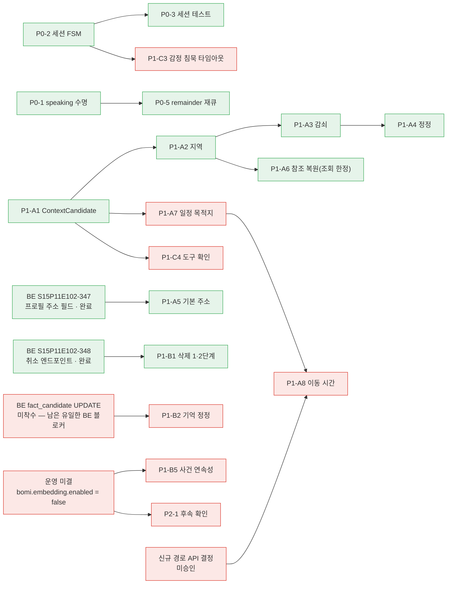
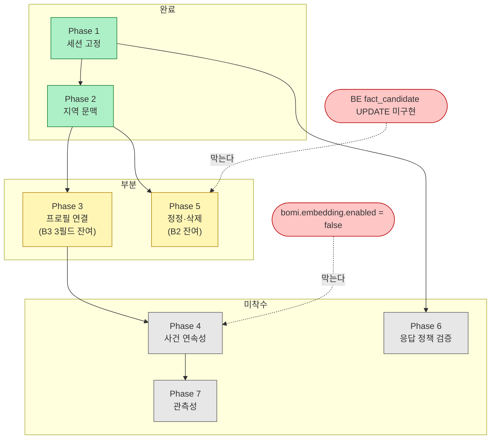

# 자연스러운 대화 — 구현 계획

작성일: 2026-08-06 · 전제: [현재 구조 감사.md](<현재 구조 감사.md>)

> **진행 현황 (2026-08-06 작성 · 2026-08-15 갱신)** — 당시 작업 브랜치
> `ai/natural-conversation-wip` 는 스쿼시되어 `main` 에 들어갔고 더는 존재하지 않는다.
>
> | 항목 | 상태 |
> | --- | --- |
> | P0-1(speaking 수명)·P0-2(세션 FSM)·P0-3(세션 테스트)·P0-5(remainder 재큐) | **구현·검증 완료(로직)** |
> | P0-4(종료 응답) | **계획 정정으로 종결** — 작별 발화에 대한 그래프 응답이 곧 종료 응답임을 확인(감사 §0). 별도 인사 미추가 |
> | P1-A1~A4, A6(날씨 한정) | **구현·검증 완료(로직)** (`context_slots` + 시나리오 B·D·E·H 테스트) |
> | P1-A5(주소 기본값) | **구현·검증 완료(로직) (2026-08-15)** — BE 계약이 확장됐다(S15P11E102-347: `SeniorProfile.address` ← `app_user.home_address`, V17). 로봇 폴백과 테스트(`test_memory_privacy.py:237`)가 이어져 **시나리오 C 가 동작한다.** 남은 것은 코드가 아니라 운영 — 어르신 주소가 실제로 등록돼 있어야 하고, 도시명은 `weather.client.CITY_GRID` 의 9개만 인식한다 |
> | P1-A7(일정 목적지)·P1-A8(이동 시간) | 미착수 (A7: careRecords 구조 협의, A8: 신규 API 결정 필요) |
> | P1-B1(삭제) | **1·2단계 모두 완료(로직) (2026-08-15)** — 1단계 봉인+로컬 대기행 삭제, 2단계 서버 취소(`POST /api/v1/robot/fact-candidates/cancel`, S15P11E102-348). 로봇은 취소 요청을 로컬 큐에 넣고 배경 틱이 보내며, 실패해도 큐에 남는다. 서버는 멱등 |
> | P1-B3(프로필 필드) | **일부 완료** — 2/5 필드. B2·B4·B5 미착수 |
> | P1-C, P2, P3 | 미착수 (C1 은 기왕 구현돼 있었음 — 리플레이 확장만 잔여) |
> | 검증 | **1035 passed + ruff clean (2026-08-15 실측)** — `cd robot/ai_chat && venv/Scripts/python.exe -m pytest -q -m "not integration and not manual"`. 이 문서가 인용하던 712 는 2026-08-06 값이다. **실기(젯슨) 검증은 여전히 전부 미실시** — 아래 계획의 "구현·검증 완료"는 전부 *로직* 검증이며 하드웨어 검증이 아니다 |
>
> **남은 블로커 (2026-08-15 기준)**
>
> | 막힌 것 | 무엇에 막혔나 |
> | --- | --- |
> | P1-B2 기억 정정 | 백엔드 `fact_candidate` 의 `UPDATE`/`supersedes` 경로 — **이 계획에 남은 유일한 BE 블로커**다. 로봇은 `operation: "CREATE"` 고정(`fact_contract.py:398`) |
> | P1-B5 사건 연속성 / P2-1 후속 확인 | 의미 검색 운영 미결 — `bomi.embedding.enabled` 기본 `false` |
> | P1-A8 이동 시간 | 신규 외부 API(경로·소요시간) 도입 승인 — 팀 결정 필요 |
> | P1-A7 일정 목적지 | `careRecords.details` 자유형 구조 협의 |
> | Phase 6(감정 침묵 타임아웃·리플레이 확장) | 미착수. `policy.EMOTIONAL_IDLE_TIMEOUT_SEC` 다이얼 자체가 아직 없다 |
> | 실기(젯슨) 전 항목 | 하드웨어 일정 |

우선순위 산식: **사용자 경험 영향도 × 선행조건 여부 × 안전·개인정보 중요도 × 기존 구조 결합도 ÷ (구현 비용 × 회귀 위험)**

## 0. 기본안에서 바꾼 것과 이유

요청서의 기본 우선순위(P0 = 웨이크워드 차단·세션 시작·재요구 방지·종료)를 **그대로 쓰지 않는다.** 감사 결과 그 항목들은 이미 구현되어 동작하기 때문이다 (작성 당시 `bootstrap.py:342-510`, 2026-08-15 현재 세션 루프는 `bootstrap.py:754-848`). 같은 이름의 P0를 다시 계획하면 이 저장소가 두 번 겪은 사고("이미 머지된 것을 다시 계획", `임시보류_claude.md` §25)를 반복하게 된다.

따라서 P0의 실체를 다음으로 교체한다:

1. **세션 계층을 테스트로 고정한다** (현재 0건 — 회귀하면 아무도 모른다)
2. **세션 주변의 확인된 버그를 고친다** (`speaking` 미복원 B1, `interrupted_remainder` 미소비 B2)
3. **상태 머신을 명시화한다** — 신규 기능이 아니라, 암묵 루프를 이름 있는 상태로 리팩터링 (테스트 가능성과 관측성의 선행조건)

또한 요청서가 P1로 둔 "app_user 기본 주소" 는 **백엔드 계약 변경이 선행**이라 이 라인 단독으로 완결할 수 없다. AI 쪽은 "프로필에 주소가 오면 쓴다"로 준비하고, BE 티켓(주소 필드 추가)을 즉시 발행하는 2트랙으로 간다.

---

## 1. 우선순위 표

표기: 현재 상태의 근거는 감사 문서의 문제 번호(A1~K4)를 재사용한다.

### P0 — 대화가 성립하기 위한 기반 (버그 수정 + 고정)

| 우선순위 | 기능 | 현재 상태 | 선행조건 | 구현 범위 | 위험 | 검증 방법 |
| --- | --- | --- | --- | --- | --- | --- |
| P0-1 | `speaking` 플래그 수명 정상화 | B1 — 재생 종료 시 미복원, 2턴째부터 바지인 오분류 | 없음 | `emit`/`note_interaction`에서 재생 종료 시 복원 (재생 스레드는 state를 못 쓰므로 `note_interaction` 진입 시 핸들 생사 확인으로 판정) | 낮음 — 판정 지점 1곳 | 단위: 정상 재생 완료 후 다음 턴이 바지인으로 안 잡힘. 기존 `test_echo_and_bargein.py` 회귀 유지 |
| P0-2 | 세션 상태 머신 명시화 | §1.2 — 암묵 루프 4상태 | 없음 | `conversation_control.py`에 `SessionState` enum + 전이 함수(순수)를 추출, `bootstrap._run_graph_conversation`이 소비. 동작 불변 리팩터링 | 중 — 라이브 루프 손대는 유일한 P0. 동작 변경 금지로 통제 | 전이 함수 단위 테스트 + 아래 P0-3 시나리오 테스트가 이중 안전망 |
| P0-3 | 세션 수명주기 회귀 테스트 | J — 0건 | P0-2 (전이 함수가 있어야 오디오 없이 테스트 가능) | 시나리오 A(웨이크 전 무반응)·B(세션 중 웨이크워드 생략)·L(종료 후 IDLE, 재웨이크 시 새 세션) + 15초 무응답·작별 문구. 가짜 audio/STT 주입 | 낮음 — 테스트만 | `pytest tests/test_conversation_session.py` 신설, CI 게이트 편입 |
| P0-4 | 종료 응답 추가 | A7 — 작별·무응답 모두 무언 종료 | 없음 | 작별 문구 종료 시 1문장 인사(캐시 오디오 후보). 무응답 종료는 현행 무언 유지(§14 — 침묵이 자연스러움) | 낮음 | P0-3에 케이스 추가 |
| P0-5 | `interrupted_remainder` 처리 결정 | B2 — 쓰기만 있고 소비 없음 | P0-1 | 소비 배선(다음 능동 게이트에서 proposals로 재큐) **또는** 제거. 바지인이 반이중으로 비활성인 현재는 재큐 배선 후 게이트 테스트로 고정 권장 | 낮음 | 단위: 바지인 후 나머지가 proposals로 들어가 게이트 1(dedupe) 통과 |

**P0에서 하지 않는 것**: 에코 가드 입력 배선(B3)·Silero VAD(B8)는 실기 하드웨어에서만 검증 가능하므로 P0에 넣지 않는다(§26 "논리 검증됨, 하드웨어 미검증"을 정직하게 유지). 별도 실기 티켓으로 유지.

### P1-A — 현재 문맥 (이 계획의 본체)

| 우선순위 | 기능 | 현재 상태 | 선행조건 | 구현 범위 | 위험 | 검증 방법 |
| --- | --- | --- | --- | --- | --- | --- |
| P1-A1 | `context_candidates` 슬롯 + ContextCandidate 스키마 | A1 — 전무 | P0-2 | `ConvState`에 `context_candidates: list[ContextCandidate]` 추가(`state.py`), 매 턴 감쇠·만료를 `note_interaction`에서 결정론적으로 처리. **LastValue 누수 방지를 위해 만료(expires_at)·명시 리셋 필수** (감사 F) | 중 — E1 전례(상태 누수 사고 3건) | 만료·감쇠·정정 단위 테스트. 시나리오 D/E 재현 테스트 |
| P1-A2 | 지역 문맥 추출·유지 | A1/D1 | P1-A1 | 발화에서 `extract_city` 히트 시 LOCATION 후보 등록(source=USER_EXPLICIT, confidence=1.0). 이후 날씨·의료 조회가 "현재 발화 → 활성 후보" 순으로 지역 결정 (`context.py:368-421` 수정) | 중 | 시나리오 D("제주도 가" → "날씨는?" → "거기 음식은?") 통합 테스트 |
| P1-A3 | 주제 전환 시 지역 감쇠 | F | P1-A2 | 인텐트·화제 전환 감지 시(우선 규칙: 조회 무관 발화 N턴 or 화제 표지) LOCATION 후보 confidence 감쇠, 임계 미만이면 기본값 복귀. 다이얼은 `policy.py` | 중 — 과잉 유지 ↔ 과잉 폐기 균형 | 시나리오 E(분리수거 질문 → 기본 주소) 테스트 |
| P1-A4 | 지역 정정 | I | P1-A2 | "대전 말고 대구" 패턴 → 기존 LOCATION 후보 교체 + 이전 값 비활성. 규칙 우선, 애매하면 확인 질문 | 낮음 | 시나리오 H 테스트 |
| P1-A5 | `app_user` 주소 기본값 | A4/G | ~~BE 계약에 주소 필드 추가~~ **해소(S15P11E102-347)** | 프로필 `address` 문자열에서 도시명을 추출해 최후 폴백으로 사용. 없으면 현행(되묻기) 유지 — **지어내기 금지 유지.** 구현은 `context_slots` 의 후보가 아니라 `_lookup_weather_documents` 안의 직접 폴백이다(주의: `new_candidate(source=PROFILE_DEFAULT)` 호출부는 아직 없고, 상수는 로그 라벨로만 쓰인다. 그 자리의 코드 주석도 아직 "계약에 address 가 없다"는 옛 상태를 말한다) | 낮음 | **완료(로직)** — 되묻기 경로 `test_context_slots.py:305`, 주소 폴백 `test_memory_privacy.py:237` |
| P1-A6 | 참조 복원 1단계 (조회 파라미터 한정) | A2/D1 | P1-A2 | "거기/근처"가 조회 표지와 함께 오면 활성 LOCATION 후보로 해석(현재는 명시적 폐기 — `medical_flow.py:199-206`). 문장 수준 복원은 계속 LLM+`recentMessages`에 맡김(전면 코레퍼런스 구현 금지) | 중 | 시나리오 D 마지막 턴, G 일부 |
| P1-A7 | 일정 목적지 우선 | A5 | P1-A1, careRecords 구조 파악(BE 협의) | `ctx.careRecords`에서 목적지 있는 일정을 EVENT/LOCATION 후보로 등록(scope=SCHEDULED_EVENT) | 중 — careRecords details 형식이 자유형 | 시나리오 F. details에 목적지가 없으면 "미지원" 명시 |
| P1-A8 | 이동 시간 조회 (시나리오 G 후반) | A5b — 도구 자체가 없음 | P1-A7 + **신규 외부 API 결정(미결 — §24 방식으로 팀 결정 필요)** | "거기까지 얼마나 걸려?"는 EVENT 후보(정형외과+예약시각)까지는 P1-A6·A7로 해석 가능하나, 소요시간 답변은 경로 API(예: 카카오모빌리티/TMAP) 신규 도입이 선행. **API 미결 동안 G 후반("몇 시에 나가야 해?")은 미지원으로 명시하고, "거기" 해석까지만 구현** | 높음 — 신규 서비스 도입은 §28 위반 소지, 반드시 승인 후 | G 전반(참조 해석) 테스트 + 후반은 API 결정 후 |

### P1-B — 기억과 관계 연속성

| 우선순위 | 기능 | 현재 상태 | 선행조건 | 구현 범위 | 위험 | 검증 방법 |
| --- | --- | --- | --- | --- | --- | --- |
| P1-B1 | 기억 삭제·봉인 발화 처리 | A3 — 전무 | 없음 | 1단계: "기억하지 마" 표지 → 해당 대화 T4 봉인(전 인텐트, 인텐트 분류 **전**) + 추출 대기행 삭제. 2단계: 제출분 취소를 로컬 큐(`fact_cancel_request`)에 넣고 배경 틱이 `POST /api/v1/robot/fact-candidates/cancel` 로 전송 | 중 | **완료(로직)** — 시나리오 K. 봉인 후 추출 큐 미유입 + 취소 큐잉·전송·실패 보존을 `test_memory_privacy.py` 가 고정 |
| P1-B2 | 기억 정정 | A3 | BE의 fact_candidate UPDATE 경로 협의 | 로봇은 `operation: "CREATE"` 고정을 유지하되(사유: `fact_contract.py:76-77`), 모순 발화 감지 시 새 후보에 `supersedes` 힌트 첨부는 BE 계약 확장 후 | 중 | 시나리오 K 전반 — BE 반영 전은 "새 후보 생성"까지만 검증 |
| P1-B3 | 미사용 프로필 5필드 활용 | C1 | 없음 | `conversationPreferences` 프롬프트 반영, `wakeTime`/`sleepTime` → quiet hours 보조, `preferredHospital` → 의료 조회 기본값 | 낮음 | 프롬프트 빌더 단위 테스트 |
| P1-B4 | `availability` 소비 | **완료 — 계약 고정(666ae0d, BE `0436b71` 머지됨)** | (해소) | 기능 가용성(`availability`)과 요청별 실행 결과(`retrieval`, 문서 실행 필드 포함)를 분리 소비. 구버전 백엔드·캐시가 필드를 안 주면 `false`로 지어내지 않고 '모름' 유지. 문서 출처·버전·청크·인용도 프롬프트까지 보존 | 낮음 | 그래프 E2E + 빌더 테스트 + BE 브랜치 교차 E2E(`cross_module_rag_driver.py`) |
| P1-B5 | 사건 연속성(단기 사건 기억) | 부분 — conversation_summary 존재 | 의미 검색 켜기(운영 미결: `EMBEDDING_ENABLED`·EC2 API 키) | 걱정·검진 등 후속 확인 대상 사건을 fact_candidate(factType 확장) 또는 care_record 관찰로 적재하고, 능동 제안(silence_tick 계열)으로 후속 확인 | 높음 — 운영 의존 | 시나리오 J. 의미 검색 미개통 동안 UNVERIFIED 명시 |

### P1-C — 응답 정책

| 우선순위 | 기능 | 현재 상태 | 선행조건 | 구현 범위 | 위험 | 검증 방법 |
| --- | --- | --- | --- | --- | --- | --- |
| P1-C1 | 정보/감정 구분·해결책 서두르지 않기 | 구현됨 (`_EMOTIONAL_MARKERS` 우선, `emotional_stance.md`) | — | **신규 구현 없음.** 시나리오 I 리플레이 케이스만 추가(전화 제안 억제→의사 확인 후 제안) | 낮음 | `naturalness_v1.json` 확장 |
| P1-C2 | 응답 길이·호칭·질문 종결 정책의 검증 가능화 | D3 — 프롬프트만 | 없음 | 프롬프트 정책은 유지하되, 리플레이 판정 기준에 "호칭 반복률·질문 종결률" 추가. shaper에 코드 강제는 넣지 않음(과잉 절단 위험) | 낮음 | `test_naturalness_replay.py` 판정 확장 |
| P1-C3 | 감정 대화의 침묵 허용 (시나리오 M) | 미구현 — 무응답 15초 일괄 | P0-2 | 직전 인텐트가 emotional이면 세션 idle 타임아웃 연장(`policy.py` 다이얼) + 재촉 발화 금지 | 낮음 | 세션 테스트에 케이스 추가 |
| P1-C4 | 도구 실행 의사 확인 일반화 | 부분 — 의료 한정 확인 게이트 | P1-A1(pending_tool_action 슬롯) | 전화 걸기 등 행동형 도구가 생기면 확인 후 실행. 현재 도구(날씨·의료 조회)는 읽기 전용이라 즉시 실행 유지 | 낮음 | 시나리오 I 후반 |

### P2 — 관계 축적 / P3 — 고도화 (방향만)

| 우선순위 | 기능 | 비고 |
| --- | --- | --- |
| P2-1 | 며칠 뒤 후속 확인 | P1-B5 위에서. proposal(priority=low) 생성으로 기존 게이트 재사용 |
| P2-2 | 반복 질문 로깅 활용 | `orientation_question` 플래그는 이미 서버로 감 — T2 요약(A8 `daily_summary_job` 구현)과 함께 |
| P2-3 | 선제 발화 고도화·친밀도 조절 | 기존 silence ladder·gate 재사용. 신규 인프라 금지 |
| P3-1 | 문맥 신뢰도·유효범위 자동판정, 기억 충돌 해결 | ContextCandidate의 confidence/scope 필드가 자리를 만들어 둠 |
| P3-2 | 구조화 관측 이벤트(A6) + 개인정보 로깅 정리(K1·K2) | K1(발화 전문 로그)·K2(stdout 원문)는 **P1과 병행 권장** — 비용이 작고 개인정보 사안이므로 앞당겨도 됨 |

---

## 2. 의존 관계

초록은 뚫린 길, 빨강은 아직 막힌 길이다 (2026-08-15 기준).



**라인 경계 (`임시보류_claude.md` §25):** 백엔드 계약 변경은 be-develop 소유다. 이 라인에서 구현하지 않고 티켓으로 발행한다. AI 쪽은 "필드가 오면 쓰고, 없으면 현행 유지"로 하위호환을 지킨다 — 이 규율이 실제로 값을 했다. 주소 필드(347)와 취소 엔드포인트(348)가 나중에 도착했을 때 **AI 쪽은 한 줄도 고치지 않았고 기능이 곧바로 켜졌다.** 남은 백엔드 항목은 `fact_candidate` UPDATE/`supersedes` 와 `careRecords` 목적지 구조화 둘이다.

---

## 3. Phase 구획 (요청서 7단계를 실상에 맞게 재배치)

| Phase | 내용 | 상태 (2026-08-15) | 대응 |
| --- | --- | --- | --- |
| **Phase 1** | 세션 고정 — P0-1~P0-5 | **완료**(로직) — `SessionState` 5상태 + `test_conversation_session.py` | 요청서 Phase 1과 동일 취지, 단 신규 구현이 아니라 수정+고정 |
| Phase 2 | ContextCandidate + 지역 문맥 — P1-A1~A4, A6 | **완료**(지역 한정) — `graph/context_slots.py`. 후보 type 은 `LOCATION` 하나뿐 | 요청서 Phase 2 |
| Phase 3 | 프로필 연결 — P1-A5, P1-B3, P1-B4 | **부분** — A5 완료, B4 완료, B3 는 2/5 필드 | 요청서 Phase 3 |
| Phase 4 | 단기 사건·후속 확인 — P1-B5, P2-1 | 미착수 — 의미 검색 운영 미결에 막힘 | 요청서 Phase 4 |
| Phase 5 | 정정·삭제 — P1-B1, P1-B2 | **부분** — B1 완료(1·2단계), B2 는 BE UPDATE 대기 | 요청서 Phase 5 |
| Phase 6 | 응답 정책 검증 확장 — P1-C1~C4 | 미착수 | 요청서 Phase 6 |
| Phase 7 | 관계 고도화 + 관측성 — P2·P3 | 미착수 — 단 이벤트 5종(`SESSION_STARTED`·`SESSION_ENDED`·`CONTEXT_RESOLVED`·`T4_SEALED`·`MEMORY_FORGOTTEN`)이 평문 로그로 선반영됨. `extra=` 구조화는 0건 | 요청서 Phase 7 |

여기서 "완료"는 **전부 로직 검증 완료**를 뜻한다. 실기(젯슨) 검증은 어느 Phase도 받지
않았다. 무엇이 무엇을 막고 있는지는 아래 그림이 표보다 빠르다.



각 Phase는 요청서의 9단계 절차(변경 파일 설명 → 최소 설계 → 구현 → 단위 테스트 → 시나리오 테스트 → 실행 → 수정 → 보고 → 다음 Phase 영향 기록)를 따르고, 완료 시 `docs/carebot/진행 상황.md`를 같은 푸시에서 갱신한다(§22a).

---

## 4. Phase 1 상세 계획 (다음 작업)

### 변경 대상과 책임

| 파일 | 변경 | 이유 |
| --- | --- | --- |
| `robot/ai_chat/src/bomi_ai_chat/conversation_control.py` | `SessionState` enum(IDLE/LISTENING/PROCESSING/RESPONDING/ENDING)과 순수 전이 함수 `next_state(state, event) -> SessionState` 추가. 기존 `is_farewell`/`WAKE_ACK_MESSAGE` 유지 | 오디오 장치 없이 세션 논리를 테스트 가능하게 하는 유일한 방법. 이미 이 모듈이 "wake/end-of-turn 규칙 공유" 책임(§20) |
| `robot/ai_chat/src/bomi_ai_chat/bootstrap.py` | `_run_graph_conversation`이 전이 함수를 소비하도록 치환(동작 불변). 종료 응답 1문장 추가(P0-4). 스테일 주석("저를 부르셨나요?") 정정 | 루프 구조는 유지 — 재작성 금지 |
| `robot/ai_chat/src/bomi_ai_chat/graph/ingress.py` | `note_interaction` 진입 시 TTS 핸들 생사 확인으로 `speaking` 실효값 판정(P0-1). `interrupted_remainder`가 있으면 proposals로 재큐(P0-5) | B1·B2 배선 결함 해소 |
| `robot/ai_chat/src/bomi_ai_chat/graph/output.py` | 스테일 주석(`spoken_prefix` 갱신 주장) 정정 | 주석-코드 불일치 해소 (§21 "낡은 주석은 없느니만 못하다") |
| `robot/ai_chat/src/bomi_ai_chat/policy.py` | `WAKEWORD_THRESHOLD` 주석 정정(0.45→0.4). P1-C3 대비 자리만 확인, 값 추가는 Phase 6 | 스테일 주석 |
| `robot/ai_chat/tests/test_conversation_session.py` (신설) | 시나리오 A·B·L + 15초 무응답 + 작별 문구 + 정상 재생 후 비-바지인 + remainder 재큐 | J 공백 해소 |

### 테스트 계획

```bash
cd robot/ai_chat
venv/Scripts/ruff.exe check src tests
venv/Scripts/pytest.exe -q -m "not integration and not manual"
```

- 기존 테스트 전부 통과 유지 + 신규 테스트. **숫자 감소 금지**([`docs/carebot/검증 절차.md`](<../carebot/검증 절차.md>)). 기준선은 문서에 박지 말고 매번 실측한다 — 이 문서가 인용한 633·655·712 가 전부 차례로 낡았고, 2026-08-15 실측은 1035다.
- 하드웨어 의존 검증(웨이크워드 실감지, 반이중 체감, 에코)은 **UNVERIFIED로 명시**하고 `tests/manual/` + `docs/hardware/오디오 에코 바지인 검증.md` 절차에 위임.

### 회귀 위험과 대응

| 위험 | 대응 |
| --- | --- |
| P0-1이 바지인 경로 판정을 바꿔 기존 `test_echo_and_bargein.py` 깨짐 | 기존 테스트를 먼저 실행해 의미 변화를 명시적으로 확인, 판정 기준 변경은 테스트와 같은 커밋 |
| P0-2 리팩터링이 라이브 루프 동작을 바꿈 | 전이 함수 도입 커밋과 소비 커밋 분리, 동작 불변 단언 테스트 선행 |
| checkpointer 상태와 새 코드의 비호환(구 빌드 체크포인트) | 341 전례(`expires_at` 없으면 보수적 처리) 방식 답습 — 새 키는 전부 `.get()` + 기본값 |

---

## 5. 완료 기준 대조 (요청서 기준 → 본 계획의 담보)

| 요청서 완료 기준 | 담보 위치 |
| --- | --- |
| 감사 문서(파일 근거) | 현재 구조 감사.md ✅ |
| 우선순위·의존관계 | 본 문서 §1–2 ✅ |
| 목표 아키텍처 | 목표 구조.md |
| 작은 변경 단위 | §3 Phase 구획, Phase당 파일 수 제한 |
| LLM 프롬프트 비의존 | 세션·문맥·삭제·도구 확인은 전부 결정론 코드 (§4, target-architecture §3) |
| 필수 시나리오 테스트 | A·B·L(Phase 1), D·E·H·G전반(Phase 2), C·F(Phase 3), J(Phase 4), K(Phase 5), I·M(Phase 6). **G 후반(이동 시간)은 신규 API 결정 전까지 미지원 명시(P1-A8)** |
| 미검증 영역 명시 | 실기 의존(에코·웨이크워드 실감지·341 재검증)은 UNVERIFIED 유지 |
| DB 마이그레이션 호환 | 로봇 로컬 SQLite는 additive만. 서버 스키마는 BE 티켓(Flyway, §19 규칙) |
| 개인정보·기억 삭제 | P1-B1(삭제), K1·K2(로그 정리 — P3-2이나 조기 실행 권장) |
| 남은 위험 문서화 | 각 Phase 보고 + 진행 상황.md 갱신(§22a) |
