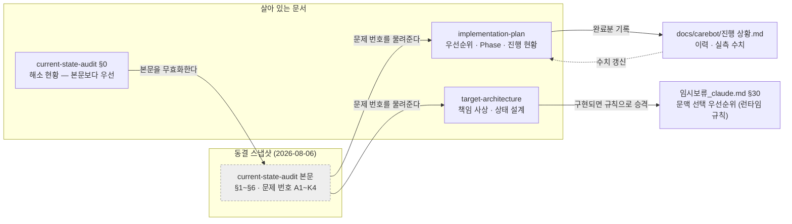

# 자연스러운 대화 — 현재 구조 감사 〔2026-08-06 동결 스냅샷〕

작성일: 2026-08-06 · 기준: `ai-develop` @ `eadc3bf` (S15P11E102-341 머지 직후)

> **이 문서의 지위 — 읽는 법.** 본문(아래 "읽기 전에" 결론과 §1 이하 전부)은
> **2026-08-06 의 동결된 스냅샷**이며
> 갱신하지 않는다. 그날 무엇이 있었고 무엇이 없었는지, 그리고 **왜 그렇게 판단했는지**를
> 남기는 것이 이 문서의 일이다. 현재 상태는 §0 이 말한다 — 본문과 §0 이 어긋나면
> **언제나 §0 이 맞다.** 본문의 file:line 은 감사 시점 기준이라 지금은 대부분
> 이동해 있다. 좌표가 아니라 **문제 번호(A1·B1·C1…)** 를 인용하라 — 뒤의 두 문서와
> `진행 상황.md` 가 그 번호를 좌표계로 쓴다.

조사 방법: 코드 전수 추적 (병렬 조사 4갈래 — 오디오·세션 / 그래프 파이프라인 / 기억·프로필·백엔드 / 테스트·관측성·문서). 모든 판정에 파일:라인 근거를 붙였고, 근거를 찾지 못한 것은 **미구현·발견못함**으로 표기했다.

> **읽기 전에 — 이 감사의 가장 중요한 결론 두 가지.**
>
> 1. **웨이크워드 게이트와 세션(후속 발화 웨이크워드 생략, 무응답·작별 종료)은 이미 구현되어 동작한다.** "Wakeword 이전 차단 → 세션 시작 → 호출 응답 1회 → 재요구 방지 → 종료"의 P0 요구는 신규 구현 대상이 아니라 **버그 수정 + 회귀 테스트 대상**이다. 이 계층의 자동 테스트가 0건이라는 것이 진짜 공백이다.
> 2. **"현재 문맥"(주제·지역·인물·참조 대상)은 코드에 존재하지 않는다.** `current_topic` / `current_location` / `current_people` / `pending_tool_action` 류의 슬롯은 전수 검색에서 0히트이고, 대명사·지시어 해소 코드도 없다. 문맥 유지는 전적으로 (a) 백엔드가 조립해 주는 `recentMessages` 프롬프트 블록과 (b) LLM의 재량에 맡겨져 있으며, **조회 파라미터(날씨 도시, 의료 지역)는 절대 이어지지 않는다.**

---

## 0. 해소 현황 — 이 감사 이후 무엇이 바뀌었나 (2026-08-06 작성 · 2026-08-15 갱신)

이 문서의 본문은 `eadc3bf`(감사 시점) 기준 스냅샷이다. 이후의 작업이 아래를 해소했다 —
**본문에서 아래 항목을 만나면 이 표가 우선한다.** 당시 작업 브랜치
`ai/natural-conversation-wip` 는 스쿼시되어 `main` 에 들어갔고 더는 존재하지 않는다.

| 감사 항목 | 상태 | 근거 |
| --- | --- | --- |
| B1 `speaking` 미복원 (2턴째부터 바지인 오분류) | **해소** | `ingress.note_interaction` 핸들 생사 확인, `test_conversation_session.py` |
| B2 `interrupted_remainder` 소비처 부재 | **해소** | `proactive_gate` 합류·소비, 동 테스트 |
| §1.2 세션 FSM 부재 | **해소** — `SessionState` 5상태 + 순수 전이 함수, 라이브 루프 구동 | `conversation_control.py`, 세션 테스트 18건 |
| A1 문맥 슬롯 부재 (지역) | **해소(지역 한정)** — `context_candidates` + 수명 규칙(만료·감쇠·정정·경계 리셋) | `graph/context_slots.py`, `test_context_slots.py` 16건, `임시보류_claude.md` §30 |
| A2/D1 "거기" 참조가 조회에 안 닿음 | **해소(날씨 한정)** — 발화→활성 문맥 순 해석. 의료 지역 주입은 후속 | `context.py` 날씨 조회 |
| A3 기억 삭제 부재 | **해소(2026-08-15 갱신)** — "기억하지 마" 는 ① T4 봉인 ② 로컬 추출 대기행 삭제 ③ **서버 취소 요청 큐잉** 세 가지를 한다. 배경 틱이 `POST /api/v1/robot/fact-candidates/cancel` 로 보내고, 실패해도 큐에 남는다. 서버는 멱등이다 | 로봇 `ingress._honor_privacy_requests`, `extraction.forget_conversation`, `localstore/cancellations.py`, `jobs/ticks._flush_cancel_requests`, `fact_client.cancel_conversation` / 서버 `RobotFactIntakeController.cancel`, `FactCandidateCancellationService` / 테스트 `test_memory_privacy.py:150-185`, `FactCandidateCancellationServiceTest` |
| T4 봉인이 정서 턴 한정 | **해소** — 전 반응형 턴, 인텐트 분류 전 | 상동 |
| C1 프로필 5필드 미사용 | **부분 해소** — `conversationPreferences`·`chronicPainArea` 프롬프트 반영. 나머지 3필드는 미착수 | `prompts/builder.py` |
| A4 주소 부재 | **해소(2026-08-15 갱신)** — 백엔드 계약이 확장됐다(S15P11E102-347). `SeniorProfile.address` 가 `app_user.home_address`(V17)에서 채워지고, 로봇은 발화·세션 문맥이 모두 없을 때 이 값에서 도시명을 뽑아 조회한다. 어르신에게 주소가 입력돼 있어야 동작한다는 운영 조건만 남는다 | 서버 `ConversationContextResponse.SeniorProfile.address`, `ConversationContextService` / 로봇 `context.py` 주소 폴백 / 테스트 `test_memory_privacy.py:237` |
| A7 종료 응답 부재 | **정정** — 감사가 절반 틀렸다. 작별 발화는 그래프로 처리된 뒤 종료되므로 그 응답이 곧 종료 응답이다(재생 완료 후 세션 닫음). 무응답 종료가 무언인 것은 설계(§14) | `bootstrap._run_graph_conversation` docstring |
| J 세션 수명주기 테스트 0건 | **해소** — 시나리오 A·B·L·무응답 + FSM | `test_conversation_session.py` |
| 시나리오 커버리지 (8종 중 1종) | A·B·C(로봇측)·D·E·H·K(로컬)·L 커버로 확대. F·G·I·J·M 은 잔여 | 신규 테스트 3파일 43건 |
| (감사 이후) 그래프 순서 | `classify_intent → context_read` 로 교체됨. §1.1 흐름도는 `1e04d04` 에서 이미 신순서로 갱신되어 있음 | 커밋 `26e9635` |
| (감사 이후) 의도 라우터 | **본문 §1.1·§2 의 "로컬 임베딩 라우터" 서술은 구버전** — 실측(기동 6.28s·약 732MB, 정확도 이득 없음) 근거로 SentenceTransformer 를 제거하고 키워드 결정 규칙으로 교체. 비교 평가는 `evals/router-evaluation.md` | 커밋 `d7ce99a` |
| (감사 이후) BE 계약 | `retrieval`(요청별 실행 결과) 필드가 실제 계약으로 고정되어 로봇이 소비. BE 쪽은 `0436b71` 로 be-develop 머지 | 커밋 `666ae0d` |

여전히 유효한 것: B3(에코 입력 미배선), B4(`audio_ctx` writer 부재), B5(`proposal_meta`
writer 부재), B8(Silero VAD), K1·K2(원문 로깅 — 행 번호는 감사 시점 기준, 결함 자체는
유효), K4(T2 동의 확인), A5b(이동 시간 도구), A6(구조화 이벤트 — 부분:
CONTEXT_RESOLVED/T4_SEALED/MEMORY_FORGOTTEN/SESSION_* 로그 라인은 생김), A8(T2 요약).
B7 `availability` 미소비는 `26e9635` 로 해소됐다(본문 B7 행 참고).

**B6 는 축소(2026-08-15 갱신)** — `memory_top_k` 는 `context_read` 가, `rest_state` 는
침묵 사다리·트리아지가 읽는다. 소비처가 정말 없는 것은 `messages`(add_messages 채널)
하나뿐이다.

신규 통합 지점 (원격 be-develop 머지로 생김, 2026-08-06 / **2026-08-15 갱신**):
BE `S15P11E102-335`(보미야 호출 시나리오)가 기다리던 로봇의 **웨이크워드 감지 MQTT
발행은 구현됐다**(S15P11E102-349 — `bootstrap.py` 가 웨이크 직후 `publish_wake_word()`).
`S15P11E102-337`(산책)은 RobotCommand 타입을 확장했으나 산책 시나리오 자체는 보류다.
반대 방향(BE→AI `START_CONVERSATION`)도 이후 배선됐다 — 백엔드 명령은 능동 게이트가
아니라 큐를 거쳐 메인 루프로 들어와 `trigger_type="backend_command"` 로 그래프를 탄다.

## 1. 현재 처리 흐름 (실제 코드 기준)

### 1.1 반응형 턴 전체 경로

```text
마이크 (상시 열림, 처리는 안 함)
→ 웨이크워드 감지        audio_io/wakeword.py:198-230  openWakeWord(bomiya.onnx), 4프레임 중 2히트
→ 호출 응답 1회          bootstrap.py:347,413-426     "네, 말씀하세요." 블로킹 재생
→ [대화 내부 루프 시작]   bootstrap.py:445-477         ← 여기부터 웨이크워드 불필요
→ 발화 캡처              audio_io/sounddevice_backend.py:122-235
                          RMS 임계(AUDIO_SILENCE_THRESHOLD=300) onset/침묵 판정
                          onset 대기 15초(CONVERSATION_IDLE_TIMEOUT_SEC) 초과 → 세션 종료
→ STT                    stt/client.py:137-206        RTZR 배치 API(파일 업로드+폴링, 스트리밍 아님)
→ 그래프 1턴             graph/turn.py:103            thread_id=senior_id, checkpointer=runtime.sqlite
   note_interaction      ingress.py:124-              시계 리셋, intent/safety 리셋(341), 바지인 분기, 맞장구→END
   safety_triage         triage.py                    로컬 키워드 (부정·시제 검사), T1→escalation 직행
   classify_intent       context.py                   규칙 우선 + 로컬 임베딩 라우터(의료만), LLM 없음
                                                       + info 여부를 문맥 조회 전에 확정
   context_read          context.py                   백엔드 문맥조립 POST + 실패 시 로컬 캐시
                                                       + 날씨/의료 조회 + availability/retrieval 정규화
   handle_*              handlers.py                  7종 전부 실구현, 생성 LLM 호출은 _generate 1곳
   response_shaper       output.py:160-219            뼈대 제거 → 문장 분할 → 2문장(terse=1) 절단
   emit                  output.py:222-299            논블로킹, 문장 단위 투입, TTS_HANDLES 전역 보관
   memory_write          build.py:63-125              대화 적재(어르신→로봇 순) + 표현이력 + 추출 큐잉
→ 재생 완료 대기          bootstrap.py:472,482-510     반이중(half-duplex) — 재생 중 마이크 안 엶
→ 작별 문구 판정          bootstrap.py:474-477         conversation_control.is_farewell (22개 큐)
→ [내부 루프 반복 또는 종료] → 종료 시 외부 루프로 복귀 → 다시 wait_for_wake()
```

### 1.2 세션(대화) 수명주기 — 구현되어 있으나 암묵적

명시적 상태 머신은 없다. 상태는 **호출 스택의 중첩 while 루프**로 표현된다:

| 암묵 상태 | 실제 표현 | 근거 |
| --- | --- | --- |
| IDLE | `wake.wait_for_wake()` 블로킹 | `bootstrap.py:346` |
| LISTENING | `_listen()` → `capture()` 내부 | `bootstrap.py:447` |
| PROCESSING | `run_user_turn()` → `app.invoke()` | `bootstrap.py:467` |
| RESPONDING | `_wait_for_playback()` 폴링 | `bootstrap.py:472,482-510` |

세션 종료 3경로 (확인됨):
1. 무응답 15초 (`policy.CONVERSATION_IDLE_TIMEOUT_SEC=15`, `policy.py:154`) → 조용히 종료, 종료 멘트 없음
2. 작별 문구 (`CONVERSATION_FAREWELL_CUES` 22개, `policy.py:190-194`) — 부분일치 규칙, LLM 미사용
3. KeyboardInterrupt

"대화 중"이라는 사실 자체는 어디에도 저장되지 않는다(순수 지역 변수). 프로세스가 죽으면 세션은 사라진다. 별개로 서버 `conversation_id` 경계는 30분 유휴(`CONVERSATION_BOUNDARY_IDLE_SEC`, `policy.py:181`, 판정 `ingress.py:260-318`)로, 15초 리슨 세션과 **의도적으로 다른 값**이다(`policy.py:156-172`가 명시).

### 1.3 문맥·기억의 실제 흐름

- **단기 문맥** = 백엔드가 내려주는 `ctx["recentMessages"]`(개수는 백엔드 결정 — 이 브랜치에 서버 소스 없음, be-develop에 있음)를 `## 최근 대화` 블록으로 렌더(`prompts/builder.py:171-177`). 로봇 자체 보관 없음.
- **장기 기억** = 백엔드 문맥조립 응답의 `memories`(top-k=6, 저하 시 2). 단, **의미 검색이 꺼져 있어**(`EMBEDDING_ENABLED` 기본 off, EC2에 API 키 없음 — `진행 상황.md:316-324`) §17.2 "이어짐"은 현재 거의 작동하지 않는다.
- **기억 쓰기** = 추출 큐(`extraction_job`) → 배경 틱에서 LLM 추출 → `fact_candidate`로 제출(`operation: "CREATE"` 고정, `fact_contract.py:87`). 실동작 확인됨.
- **기억 정정·삭제** = 경로 없음 (아래 §3).

---

## 2. 구성요소 표

| 영역 | 현재 구현 | 파일·클래스 | 문제점 | 개선 필요도 |
| --- | --- | --- | --- | --- |
| Wakeword 게이트 | **있음** — openWakeWord 블로킹 대기, 감지 전 STT/LLM 경로 없음. 재감지 방지(`model.reset()`) 포함 | `audio_io/wakeword.py:103-230`, `bootstrap.py:344-346`, 다이얼 `policy.py:123-139` | 단위 테스트 0건. `WAKEWORD_THRESHOLD` 주석(0.45)과 값(0.4) 불일치 | 중 (테스트만) |
| 세션 상태 | **있음(암묵)** — 중첩 루프. 호출 응답 1회, 후속 발화 웨이크워드 불필요, 무응답 15초/작별 문구 종료 | `bootstrap.py:342-510`, `conversation_control.py:25-41`, `policy.py:154,190-194` | 명시적 FSM·저장 없음. **세션 수명주기 테스트 0건** (`is_farewell` 호출 테스트 0건). 종료 멘트 없음(시나리오 L의 "종료 응답" 미충족) | **상** |
| 사용자 프로필 | **부분** — 백엔드 문맥조립 실호출 + 로컬 캐시 폴백. 스텁 아님 | `backend_client/context_client.py:72-147`, `prompts/builder.py:70-80` | 계약 15개 필드 중 프롬프트 도달 4개(호칭·이름·나이·질환). `conversationPreferences`/`wakeTime`/`sleepTime`/`chronicPainArea`/`preferredHospital`는 로봇이 안 읽음. **주소 필드는 계약에 아예 없음** | **상** |
| 현재 문맥 | **없음** — topic/location/people/event 슬롯 전무(전수 grep 0히트). 예외: **현재 날짜·시각은 구현됨** — 매 요청 `[현재 정보]` 블록으로 주입(`llm/client.py:85`), 지남력 표지 판정(`context.py:577-596`) + `orientation_question` 서버 전달 | (해당 없음) | 조회 파라미터가 턴을 넘지 못함. "거기/근처"는 명시적으로 폐기됨(`weather/client.py:107-109`, `llm/medical_flow.py:199-206`) | **최상** |
| 단기 기억 | **부분** — 서버 `recentMessages`(30분 경계) + `conversation_summary` | `ingress.py:260-318`, `builder.py:152-177` | 로봇 로컬에는 대화 이력 없음(오프라인 시 최근 대화 공백). 사건(event) 단위 기억 없음 | 중 |
| 장기 기억 | **부분** — 읽기: 문맥조립 `memories`. 쓰기: 추출 큐→fact_candidate 실동작 | `build.py`, `context.py`, `ticks.py`, `fact_contract.py` | 로봇은 `availability`와 요청별 `retrieval`을 상태·로그·프롬프트에서 소비하도록 구현됨(26e9635). 다만 백엔드 요청별 필드와 의미 검색 운영은 아직 미구현/비활성 | 중 |
| 감정 처리 | **부분** — `_EMOTIONAL_MARKERS` 8개 키워드 → `handle_emotional`(3갈래), T3 동의 지연·T4 봉인 구현(253/263) | `context.py:605-607`, `handlers.py:321-494`, `ticks.py:915-1010` | 감정 분류기 없음(종류·강도 판정 없음). T4 봉인 표지가 **정서 턴에서만** 검사됨 — companion 잡담 중 "우리끼리 얘긴데"는 봉인 안 되고 추출 큐로 들어감(`handlers.py:368`) | 중 |
| 도구 실행 | **부분** — 날씨(기상청 REST)·의료(PostgreSQL+Gemini function calling) 실구현, 311이 그래프에 배선 | `weather/client.py`, `db/medical_repository.py`, `context.py:273-421` | 날씨 지역 = 발화 문자열 9개 도시 부분일치가 전부. 도시 없으면 조회 포기 → 실기에서 LLM이 기온을 지어냄(`진행 상황.md:259`). 범용 실행 확인(confirm-before-execute) 정책 없음(의료 한정 확인 게이트만) | **최상** |
| 기억 삭제 | **없음** — "기억하지 마" 처리 경로 전무. `operation: "CREATE"` 고정, 백엔드에도 삭제 엔드포인트 없음 | `fact_contract.py:76-87` (사유 주석 포함) | 시나리오 K 전면 미충족. 가장 가까운 것은 T4 봉인(사전 차단)뿐 | **상** |
| 테스트 | **두꺼움+공백** — 감사 시점 45파일 566함수(현재 71파일 885함수·수집 1035건, §0 참고). 그래프 내부(트리아지·게이트·사다리·정서·계약)는 촘촘 | `tests/`, `pyproject.toml:60-71` | **세션 수명주기(웨이크→ack→지속→종료) 0건** — §0 에서 해소(현재 `test_conversation_session.py` 41건). 요청 시나리오 유형 8종 중 7종 무커버 — 현재 A·B·D·E·H·I·L 커버, F·G·J 잔여 | **상 → 해소** |
| 관측성 | **부분** — turn_timer(단계별 지연 실측, 저하 연동)만 1급. 로그는 자유형 문장 | `turn_timer.py`, `main.py:42-98` | 구조화 이벤트(SESSION_STARTED 등) 없음. **로봇 최종 발화 전문이 `ai_chat.log`에 남음**(`output.py:262`), 어르신 발화 원문이 stdout으로 출력(`bootstrap.py:546`) — 원문 미기재 보증은 보호자 알림 payload에만 걸려 있음 | 중 |
| 바지인 | **구현 후 의도적 비활성** — 취소·맞장구 판별·나머지 추출은 구현+테스트, 라이브 경로는 반이중 대기 | `ingress.py:99-121,321-373`, `audio/playback.py`, `bootstrap.py:470-510` | `speaking` 플래그 미복원 버그(아래 §3-B1), `interrupted_remainder` 소비처 부재, 에코 가드 입력 미배선 | **상** |

---

## 3. 현재 문제점 (분류별)

### A. 기능 자체가 없음

| # | 문제 | 근거 |
| --- | --- | --- |
| A1 | **대화 문맥 슬롯 부재** — 주제/지역/인물/사건/참조 후보. `current_*` 계열 전수 grep 0히트 | `state.py:96-317` (41개 필드 중 해당 없음) |
| A2 | **대명사·지시어 해소 부재** — `대명사\|coref\|resolver\|anaphora` 등 0히트. 유일한 대체물은 프롬프트 `## 최근 대화` 블록 | `builder.py:283` |
| A3 | **기억 정정·삭제 부재** — "기억하지 마" 발화에 런타임은 아무 동작도 하지 않음 | `fact_contract.py:76-87`, be-develop `MemoryController`에 삭제 엔드포인트 없음 |
| A4 | **app_user 주소 부재** — 프로필 계약(15필드)에 주소가 없어 날씨 기본 지역이 구조적으로 불가능 | be-develop `ConversationContextResponse.SeniorProfile`, `builder.py:70-80` |
| A5 | 일정 목적지·현재 체류지 개념 부재 | `builder.py:83-96` (careRecords 평면 나열), `state.py:60,305` |
| A5b | **이동 시간 조회 도구 부재** — "거기까지 얼마나 걸려?"(시나리오 G)에 답할 경로·소요시간 API가 코드에 전혀 없음. 도구 목록은 날씨·의료 조회 2종이 전부 | `graph/context.py:273-421` (조회 경로 전수) |
| A6 | 구조화 관측 이벤트 부재 (`extra=` 사용 0건, JSON 포맷터 없음) | `main.py:42-98` |
| A7 | 세션 종료 멘트 부재 — 무응답·작별 모두 조용히 종료 (시나리오 L "종료 응답 후 IDLE" 미충족) | `bootstrap.py:455-477` |
| A8 | T2 일간 요약 미구현 — `daily_summary_job` 본문이 `...`, 스케줄러 미등록 | `ticks.py:1263-1264` |

### B. 기능은 있으나 서로 연결되지 않음 (배선 결함)

| # | 문제 | 근거 |
| --- | --- | --- |
| B1 | **`speaking` 플래그가 재생 정상 종료 시 안 내려감** — True로 쓰는 곳(`output.py:299`)만 있고 False 복원은 바지인 경로(`ingress.py:221`)뿐. → 2번째 턴부터 모든 발화가 바지인으로 오분류(실피해는 작으나 로그·의도 왜곡, `clear_speech_state()` 매 턴 호출) | `output.py:270,278,299`, `ingress.py:208` |
| B2 | **`interrupted_remainder` 소비처 부재** — 쓰기(`ingress.py:222`)만 있고 읽는 코드 전무. 끊긴 발화 나머지는 영원히 재발화되지 않음 | 전수 grep: 쓰기 1곳, 읽기 0곳 |
| B3 | **에코 가드 입력 미배선** — `EchoGuard`는 완성돼 있으나 `capture()`가 모름. 현재 보호막은 반이중 대기 하나뿐. 비대화 경로(스케줄·현관) 능동 발화 중 리슨이 열리면 무방비 — 233 실기 T1 폭주의 절반 원인 | `sounddevice_backend.py:122-235`, `bootstrap.py:323-325`(자인 주석) |
| B4 | **`audio_ctx` writer 부재** — 게이트 4(`is_busy`)가 항상 False. "끼어들기 방지" 게이트 사실상 비활성 | `gate.py:264-290`, `state.py:317` |
| B5 | **`proposal_meta` writer 부재** — `handlers.py:306`이 읽지만 선언도 쓰기도 없음. 능동 복약 알림 직후 완료 보고가 슬롯을 못 찾을 수 있음 | `handlers.py:306`, `gate.py:414-426` |
| B6 | `rest_state` / `messages`(add_messages 채널) / `memory_top_k` — 선언만 있고 writer 없는 죽은 필드 | `state.py:157,241,307` |
| B7 | **해소(26e9635).** `availability`와 향후 요청별 `retrieval`을 `retrieval_status`로 정규화하고 프롬프트 경고·로그에 연결. 백엔드 요청별 필드 구현은 BE 작업으로 남음 | `state.py`, `context.py`, `prompts/builder.py`, `test_turn_end_to_end.py` |
| B8 | Silero VAD 미구현·`EchoAwareVad` 미호출 — end-of-turn은 100% RMS 임계 판정. 233 실기에서 임계 오설정으로 문장 잘림 사고 | `audio/vad.py:7-16,29-76`, `진행 상황.md:171` |

### C. 데이터 모델은 있으나 서비스가 활용하지 않음

| # | 문제 | 근거 |
| --- | --- | --- |
| C1 | 프로필 5개 필드(`conversationPreferences`, `wakeTime`, `sleepTime`, `chronicPainArea`, `preferredHospital`)를 로봇이 전혀 안 읽음 | 로봇 코드 전수 grep 0히트 |
| C2 | `SpeechPlayback.spoken_prefix`(권위) 소비처 0곳, `ConvState["spoken_prefix"]`는 `""`로만 쓰임 — `output.py:245-247` 주석("문장마다 갱신")과 코드 불일치 | `playback.py:121-124`, `output.py:270,278,299` |

### D. LLM 프롬프트에만 의존함

| # | 문제 | 근거 |
| --- | --- | --- |
| D1 | 참조 복원("거기", "그 사람", "그럼") 전체 — 프롬프트의 `## 최근 대화`에만 의존. **조회 파라미터는 프롬프트를 못 읽으므로 구조적으로 끊김** | `builder.py:283` vs `weather/client.py:92-110` |
| D2 | "한 가지만 말하기" — 코드는 문장 수만 강제(`MAX_SENTENCES=2`), 내용 단위는 프롬프트 유도뿐 | `output.py:191-207` |
| D3 | 응답 길이-질문 길이 비례, 호칭 반복 금지, 질문으로 끝내지 않기 — 전부 프롬프트 문구(`system.md`, `output_constraints.md`)로만 존재, 검증 코드 없음 | `prompts/templates/` |

### E. 세션 범위와 장기 기억 범위가 섞여 있음 / 상태 누수

| # | 문제 | 근거 |
| --- | --- | --- |
| E1 | ConvState 대부분 키가 reducer 없는 LastValue — 노드가 반환하지 않으면 지난 턴 값이 살아남는 구조 자체가 사고 다발 지점. 실제 사고 3건: conversation_id 덮어쓰기(306 수정), `speech_origin`/`is_medical_query` 누수(311 방어), **T1 고착(341 수정, 실기 미검증)** | `state.py:105-108`, `turn.py:88-104`, `ingress.py:180-196` |
| E2 | 의미 단위 세션 스토어 없음 — 대화 id 단위 상태(runtime_state/emotional_signal/consent_request)만 존재 | `schema.py:58,276-287,309-318` |

### F. 이전 문맥이 과도하게 유지됨

현재는 반대 문제가 지배적이다(문맥이 아예 이어지지 않음). 단 E1의 LastValue 구조는 **문맥 슬롯을 추가하는 순간 "과잉 유지" 사고로 전환될 위험**이 있다 — 지역 슬롯을 넣으면 명시적 만료·주제전환 감쇠 없이는 시나리오 E(주제 전환 시 이전 지역 폐기)가 자동으로 깨진다. 설계 단계에서 반드시 만료(expires_at)·명시 리셋을 함께 넣어야 한다.

### G. 사용자 기본정보를 사용하지 않음

A4(주소 부재)와 C1(5개 필드 미사용)이 해당. 시나리오 C(기본 주소 날씨)는 **백엔드 계약 변경 없이는 불가능**하다. 백엔드는 be-develop 라인 소유이므로 이 라인에서 고칠 수 없다 (§25) — BE 티켓 필요.

### H. 모든 발화를 장기 저장함 → 해당 없음 (반대로 잘 되어 있음)

추출 스킵 조건 7가지(T1·계약 턴·6자 미만·T4 봉인 등, `build.py:171-201`), 최대 2건/발화, 제출 성공 시에만 mark. **이 영역은 현재 설계가 요구사항보다 낫다. 건드리지 말 것.**

### I. 정정·삭제가 기억에 반영되지 않음

A3와 동일. 추가로 **지역 정정(시나리오 H)** 도 불가 — 정정할 지역 슬롯 자체가 없다.

### J. 테스트가 없어 회귀 가능성이 큰 영역

| 영역 | 상태 |
| --- | --- |
| 웨이크워드 감지·게이팅 | 0건 (`test_main.py:88`은 스텁 치환뿐) |
| 세션 지속·종료 (`_run_graph_conversation`, `is_farewell`) | 0건 |
| 반이중 대기(`_wait_for_playback`) | 0건 |
| `capture()` onset/침묵 판정 | 0건 (`test_audio_lifecycle.py`는 개폐만) |
| 날씨 기본 지역 | 감사 시점: 역방향 고정 우려. **현재는 정정** — 그 테스트는 `extract_city` 순수 함수의 단위 테스트였다. 조회 정책은 `test_context_slots.py:305` 가 "발화에도 문맥에도 도시가 없으면 조회하지 않고 되묻는다"로 의도된 동작으로 고정하며, 그 위에 프로필 주소 폴백이 얹혔다 |
| 시나리오 A~M 유형 | 8종 중 정서 우선(I) 1종만 커버 |

### K. 개인정보 로깅

| # | 문제 | 근거 |
| --- | --- | --- |
| K1 | 로봇 최종 발화 전문이 INFO 로그로 `ai_chat.log`(20MB×5 회전)에 기록 | `output.py:262-264` |
| K2 | 어르신 발화 원문이 stdout `print()`로 출력 — 로그 파일에는 안 남지만 콘솔 캡처(journald·tmux)에 남음 | `bootstrap.py:546`, `pipeline.py:149` |
| K3 | 원문 미기재 보증은 보호자 알림 payload에만 테스트로 고정 | `test_safety_triage.py:372`, `test_t3_consent.py:199,234` |
| K4 | T2 적재 5곳 어디에도 `guardian_sharing_consent` 확인 없음 — 서버 최종 방어선에만 의존 (`outbox.py:64-67`이 요구하는 규칙이 코드에 없음) | `ticks.py:474,526,573,592` |

---

## 4. 확인됨 / 부분 / 미구현 요약

```text
확인됨 (실코드 근거):
- 웨이크워드 게이트, 세션 루프(웨이크워드 생략·15초·작별 종료), 호출 응답 1회
- 그래프 파이프라인 전체(스텁 0), 턴당 생성 LLM 1회(의료만 2회), 프롬프트 9단계 조립(순수 함수)
- 백엔드 문맥조립·대화 적재·fact_candidate 추출 큐(실 API, 서버 구현은 be-develop에 존재)
- 안전 트리아지(부정·시제), T1 outbox(synchronous=FULL, T1 무한재시도), T3 동의 지연, T4 봉인
- 현재 날짜·시각 문맥 — 매 요청 `[현재 정보]` 주입(`llm/client.py:85`), 지남력 질문 판정·로깅(`context.py:577-596`, `build.py:338-340`)
- 바지인 취소·맞장구 판별 메커니즘(단, 라이브 경로에서 의도적 비활성)

부분적으로 확인됨:
- recentMessages 개수: 백엔드가 결정하며 서버 소스가 이 라인에 없음 (be-develop 7768520에서 확인 필요)
- 감정 처리: 키워드 8개 + 신호 카운터 — "분류기"라 부를 수준 아님
- 에코·바지인: 로직은 테스트됨, 실기(젯슨) 검증은 A(기본 왕복)만 통과, B~G 미실시
- 341의 T1 고착 수정: 로직 검증 완료, 실기 미검증

미구현 또는 발견하지 못함 (검색 경로·키워드 명기):
- 문맥 슬롯: src 전체, `current_topic|current_location|current_people|recent_turns|pending_tool_action` → 0히트
- 참조 해소: src 전체, `대명사|coref|pronoun|resolver|anaphora|지시어` → 유의미 0히트
- 기억 삭제: src 전체, `forget|삭제|잊|기억하지|deactivate|비활성` → 운영용 로컬 정리만
- 주소/체류지/목적지: 프로필 계약·state·builder 전체 → 0히트 (의료 DB의 병원 주소만 존재)
- 세션 FSM/구조화 이벤트: `IDLE|LISTENING|RESPONDING|SESSION_STARTED|extra=` → 0히트
```

---

## 5. 실기(233)와 최근 티켓이 남긴 맥락

이 감사가 발견한 공백은 실기 로그의 사고와 정확히 겹친다 (`docs/carebot/진행 상황.md`):

1. **T1 폭주**(에코 되먹임 + 상태 고착) → 341이 로직으로 해소, 실기 미검증. 근본 원인 중 하나(에코 입력 미배선 B3)는 남아 있음.
2. **"오늘 몇 도야"가 조회 안 됨 → LLM이 기온을 지어냄** (`진행 상황.md:259`) — A4(주소 부재)+도구 위치 결정 문제. 기본 도시 사용 여부는 **미결 사항으로 문서화**되어 있음.
3. **프롬프트 뼈대 음성 누출** → shaper+테스트 9건으로 방어 완료.
4. **STT 문장 잘림**(RMS 임계 오설정) → 실측 도구는 생겼으나(B8) 판정 로직 자체는 그대로.
5. 지연 2.0~2.6초로 예산(2초) 경계 초과 잦음 — 문맥 기능 추가 시 지연 예산을 잠식하면 안 됨.

관련 티켓 이력: 306(conversation_id 배선), 311(날씨·의료 그래프 연결), 333(describe_forecast), 341(안전 상태 리셋·응답 자연화), 253/263(T3 동의·정서 핸들러), 255(추출 큐), 256(표현 다양화).

---

## 6. 이 감사가 후속 문서에 넘기는 것

- 우선순위와 의존관계 → [구현 계획.md](<구현 계획.md>)
- 책임 분리와 목표 설계 → [목표 구조.md](<목표 구조.md>)

핵심 방향만 미리 적으면: **P0는 "세션 만들기"가 아니라 "이미 있는 세션을 고치고(B1·B2) 테스트로 고정하기"이고, 최우선 신규 구현은 문맥 슬롯(ContextCandidate)과 조회 파라미터 연결이다.** 주소 기본값(시나리오 C)은 백엔드 계약 변경이 선행조건이었고, 그 티켓은 S15P11E102-347 로 **완료됐다**(§0 A4). 시나리오 F(일정 목적지)는 `careRecords` 구조 협의가 남아 여전히 미착수다.

### 이 세 문서와 주변 문서의 관계

어느 문서가 현재를 말하고 어느 문서가 계획을 말하는지가 자주 헷갈린다. 화살표 방향이
곧 "무엇이 무엇을 물려받는가"다.


