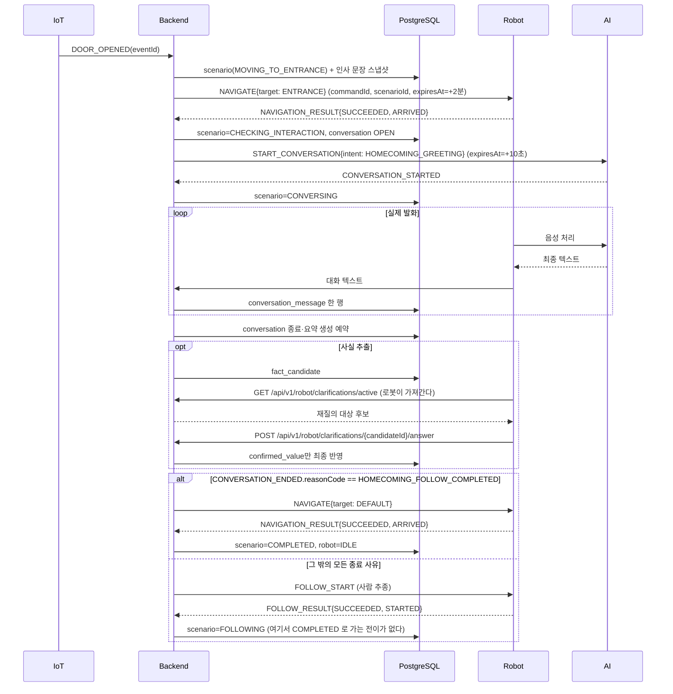
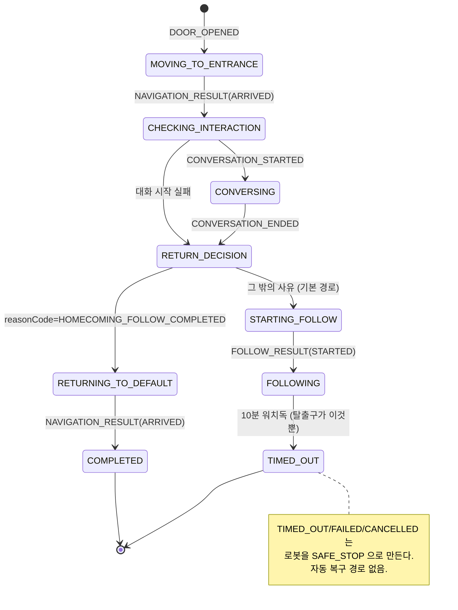

# 귀가 환영 시나리오

> **메시지 형식의 정본은 [`../mqtt/scenario-contract-v1.md`](../mqtt/scenario-contract-v1.md)** 이고,
> 그보다도 백엔드 파서(`MqttInboundMessageParser.java`)가 좁다 — 충돌하면 파서를 따른다.
> 이 문서는 메시지 형식이 아니라 **한 시나리오의 흐름과 저장 규칙**을 다룬다.

현관 문이 열리면 로봇이 현관으로 이동하고, 도착하는 즉시 귀가 인사 대화를 열고, 대화가 끝나면
기본 위치로 돌아온다.

시작 조건은 배포 설정에 따라 두 갈래다.

| `bomi.entrance.direction-resolution-enabled` | 시작 신호 | 인사 문장 |
| --- | --- | --- |
| `false` (기본값) | `DOOR_OPENED` 하나 | 코드 상수 `DEFAULT_GREETING` |
| `true` | `DOOR_OPENED` + `MOTION_DETECTED` 의 순서로 방향이 IN 으로 확정될 때만 | `GreetingDecider` 가 고른 문장 |

현재 배포는 기본값(꺼짐)이므로 **문이 열리면 방향과 무관하게 귀가 시나리오가 시작된다.**
기본 인사 문장은 `"할머니 기다리고 있었어요! 오늘 밖에서 뭐하고 오셨어요?"`
(`HomecomingOrchestrator.DEFAULT_GREETING`)이다.

## 참여 시스템

| 구간 | 수단 | 실제 이름 |
| --- | --- | --- |
| IoT → BE | MQTT `bomi/v1/iot/{sourceId}/events` | `DOOR_OPENED` |
| BE → 로봇 | MQTT `bomi/v1/robot/{robotId}/commands` | `NAVIGATE` / `FOLLOW_START` |
| 로봇 → BE | MQTT `bomi/v1/robot/{robotId}/results` | `NAVIGATION_RESULT` / `FOLLOW_RESULT` |
| BE → AI | MQTT `bomi/v1/ai/{robotId}/commands` | `START_CONVERSATION` |
| AI → BE | MQTT `bomi/v1/robot/{robotId}/events` | `CONVERSATION_STARTED` / `CONVERSATION_ENDED` |
| 로봇 → BE | REST | `POST /api/v1/robot/conversation-events` (발화 1건 = `conversation_message` 1행) |
| 로봇 ↔ BE | REST | `POST /api/v1/robot/fact-candidates`, `GET /api/v1/robot/clarifications` |

저장은 Backend → PostgreSQL 한 방향이다 — `scenario`, `conversation`, `conversation_message`,
필요 시 `conversation_summary`, `fact_candidate`, `memory`, `care_record`.

`PRESENCE_DETECTED` 는 이 시나리오의 트리거가 아니다. 초기 계약의 방향 판정 이벤트로 백엔드
파서 허용 목록에는 남아 있지만 **핸들러가 0건**이라, 도착해도 "No MQTT handler; ignoring"
로그만 남고 아무 일도 일어나지 않는다. IoT 코드에는 상수조차 없다.

### 마감시각

| 대상 | 값 | 어기면 |
| --- | --- | --- |
| `NAVIGATE` 의 `expiresAt` | +2분 (`ROBOT_COMMAND_TTL`) | 만료 명령은 실행 금지, `COMMAND_EXPIRED` 로 회신 |
| `START_CONVERSATION` → `CONVERSATION_STARTED` | **+10초** (`bomi.ai-conversation.start-timeout`) | `AI_START_TIMEOUT` 으로 대화를 끊고 DEFAULT 복귀 |
| 대화 최대 | 5분 (`max-duration`) | `CONVERSATION_TIMEOUT` |
| 시나리오 전체 | 10분 (`bomi.scenario-timeout.active-timeout`) | `TIMED_OUT` + 로봇 `SAFE_STOP` |

10초가 이 시나리오에서 가장 빡빡한 마감시각이다.

### 시작 자체가 막히는 경우

입장 심사는 `admitBySenior(HOMECOMING, 쿨다운 0, IDLE_ONLY)` 다. **로봇 모드가 `IDLE` 이 아니면
시나리오가 아예 만들어지지 않고 억제 로그만 남는다.** 앞선 시나리오가 `SAFE_STOP` 을 남겼다면
문을 아무리 열어도 아무 일도 일어나지 않으므로, 먼저
[`operator-navigation-cancellation.md`](./operator-navigation-cancellation.md) 절차로 `IDLE` 을
회복해야 한다.

센서 → 어르신 매핑(`bomi.homecoming.sensor-to-senior`)에 없는 `sourceId` 도 WARN 로그만 남기고
조용히 폐기된다(QoS 1 무한 재전송 방지). 현재 등록값은 `door-sensor-01` · `pir` ·
`door_sensor`(임시 워크어라운드) 셋이다.

> ⚠️ **대화 종료 후 경로는 HOMECOMING 만 다르다.** `CONVERSATION_ENDED` 의 최상위 `reasonCode`
> 가 `HOMECOMING_FOLLOW_COMPLETED` 이면 `NAVIGATE(DEFAULT)` 로 복귀해 `COMPLETED` 로 끝나고,
> **그 밖의 모든 사유(작별·무응답·턴 소진)는 `FOLLOW_START` 를 발행해 `FOLLOWING` 으로 간다**
> (`HomecomingOrchestrator.java:275-284`). 대화형 시나리오 전이표에는 `FOLLOWING → COMPLETED`
> 가 없으므로(`Scenario.java:484-485`) 그 가지는 `ScenarioTimeoutWatchdog`(기본 10분)이
> `TIMED_OUT` 으로 끊고 로봇을 `SAFE_STOP` 으로 만든다. 자동 복구 경로는 없다.
>
> ai_chat 쪽에서 그 reasonCode 를 만드는 조건은 `HOMECOMING_FOLLOW_AMBIENT_PHASE` 환경변수이며
> **기본값이 `false`** 다(`robot/ai_chat/src/bomi_ai_chat/bootstrap.py:1029-1035`). 즉 아무것도
> 설정하지 않은 상태에서 현관 인사를 돌리면 시나리오는 `FOLLOWING` 에서 멈춘다. WELLNESS_CHECK ·
> MEDICATION_REMINDER 는 이 분기가 없고 항상 DEFAULT 로 복귀한다.

## 저장·실패 규칙

### 대화 저장

1. 시작 `eventId`만 `scenario.external_event_id`에 연결한다.
2. 실제 텍스트 발화마다 `conversation_message.sequence_no`를 증가시킨다. 발화가 DB 로 들어가는
   길은 MQTT 가 아니라 **REST** 다 — `POST /api/v1/robot/conversation-events` 가
   `conversation_message` 를 만들고 `{conversationId, messageId, sequenceNo}` 를 돌려준다.
3. 음성 바이너리·전체 프롬프트·모델 원응답은 저장하지 않는다.
4. **[구현됨 · 기본 꺼짐]** 종료 또는 무응답 뒤 `CONVERSATION` 요약을 만든다. 단 요약 생성은
   `bomi.llm.enabled=true` 일 때만 동작하고 기본값은 꺼짐이며, 대상 상태는 `COMPLETED`·`FAILED`
   뿐이다 — `CANCELLED` 대화는 요약되지 않는다.

### 사실 확정

5. 추출 사실은 먼저 `fact_candidate`로 보내고 민감정보는 명시적으로 확인한다.
6. 확인된 변경은 새 `care_record`와 `parent_record_id`로 버전 연결한다.
7. 재질의 중 종료된 미확정 값은 최종 원본에 반영하지 않는다.
8. 시니어·PRIMARY 충돌은 협의 상태로 보내고 책임 재확인 전 반영하지 않는다.

### 상태와 계약

9. DB 에 남는 진행 상태는 `scenario.final_status` 하나뿐이다(컬럼명은 "final" 이지만 실제로는
   현재 상태를 담는다 — 호환 때문에 이름만 유지). 귀가 시나리오가 지나는 값은
   `MOVING_TO_ENTRANCE → CHECKING_INTERACTION → CONVERSING → RETURN_DECISION →
   RETURNING_TO_DEFAULT → COMPLETED` 이고, 추종 분기로 빠지면 `STARTING_FOLLOW → FOLLOWING`
   에서 멈춘다. `ARRIVED` 는 상태가 아니라 `NAVIGATION_RESULT.resultCode` 값이다.
10. DB `scenario.scenario_type=HOMECOMING` 은 AI 로 나갈 때 `START_CONVERSATION` payload 의
    `intent=HOMECOMING_GREETING` 으로 바뀐다(intent 는 `WELLNESS_CHECK` ·
    `MEDICATION_REMINDER` · `HOMECOMING_GREETING` 셋뿐). `scenarioType=HOMECOMING_WELCOME` 은
    `static/openapi/voice-ai.openapi.yaml` 의 값인데, 그 스펙은 제목부터 "(계약·미구현)" 이고
    백엔드에는 Voice AI 를 호출하는 코드가 없다.

같은 payload 의 `triggerContext` 에 HOMECOMING 이 싣는 키는 `sourceId`(있을 때만)와
`location=ENTRANCE` 둘뿐이다. 다른 시나리오는 더 많은 키를 싣으므로 **AI 쪽은 엄격 파싱하면
안 된다.**

### 상태 전이

## 문맥과 보존

문맥은 최근 Raw 6~12개, 관련 요약, 상위 장기 기억, 동의된 돌봄 기록만 사용한다. 별도 최근·하루 Raw 테이블은 없다.

**[구현됨 · 기본 꺼짐]** Raw 는 요약 생성, 활성 후보 해소, 확정 반영, 보존기간 만료를 모두
통과한 뒤에 삭제한다 — 삭제 잡은 `CONVERSATION_RAW_PURGE_ENABLED` 가 명시적으로 true 일 때만
빈이 만들어지고 기본값은 꺼짐이다.

`onboarding_answer` · `fact_candidate` · `care_record` 의 `source_message_id` 는 **물리 FK 가
아니라 논리 참조**다 — 이 스키마에는 외래키 제약이 하나도 없다. 발화를 지울 때 삭제 잡이
세 테이블의 그 컬럼을 직접 null 로 비우므로, 답변·후보 결과·최종 돌봄 사실은 그대로 남는다.
