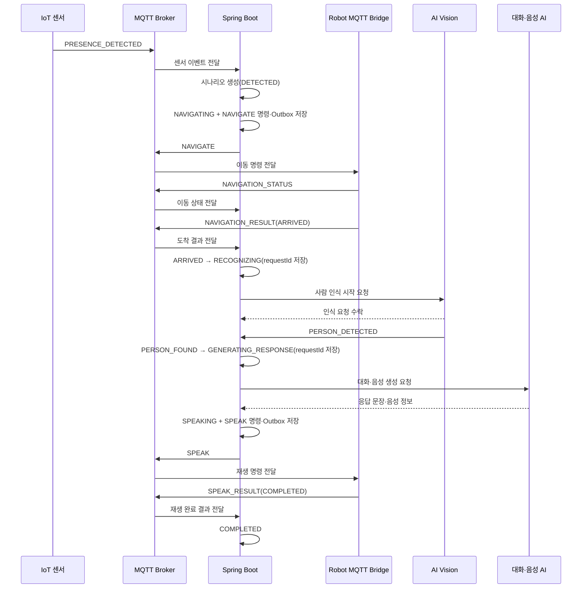

# 귀가 환영 시나리오 계약

## 1. 문서 목적

이 문서는 귀가 환영 시나리오의 E2E 흐름, 참여 시스템의 책임, 상태 전이와 실패 정책을 정의합니다.
IoT, Backend, Robot, AI Vision, 대화·음성 AI 담당자는 이 문서를 공통 기준으로 사용합니다.

관련 상세 계약은 다음 문서를 참고합니다.

- MQTT 토픽과 메시지: [`../mqtt/topic-convention.md`](../mqtt/topic-convention.md)
- AI Vision 인식 요청 API: [`../../backend/src/main/resources/static/openapi/vision-ai.openapi.yaml`](../../backend/src/main/resources/static/openapi/vision-ai.openapi.yaml)
- AI Vision Callback API: [`../../backend/src/main/resources/static/openapi/vision-callback.openapi.yaml`](../../backend/src/main/resources/static/openapi/vision-callback.openapi.yaml)
- 대화·음성 AI API: [`../../backend/src/main/resources/static/openapi/voice-ai.openapi.yaml`](../../backend/src/main/resources/static/openapi/voice-ai.openapi.yaml)
- OpenAPI 확인 방법: [`../api/README.md`](../api/README.md)

## 2. 이번 이슈의 범위

### 포함

- 현관 센서 감지에서 로봇 음성 재생 완료까지의 Happy Path
- Backend가 관리하는 시나리오 상태와 전이 조건
- MQTT와 REST 사이의 상관관계 식별자
- 중복 메시지, 실패, 타임아웃 처리 기준
- 실제 장비가 없어도 Mock으로 검증할 수 있는 입출력 계약

### 제외

- ROS 2 내부의 주행, 장애물 회피 및 모터 제어
- 카메라 스트림의 전송 프로토콜과 영상 프레임 형식
- AI 모델, STT, LLM, TTS의 내부 구현
- 미디어 장기 보관과 S3 연동
- 사용자 인증 및 보호자 화면 구현

## 3. 참여 시스템과 책임

| 시스템 | 책임 | 하지 않는 일 |
| --- | --- | --- |
| IoT 센서 | 현관 센서 신호를 수집하고 사람의 이동 방향을 판정해 이벤트를 발행 | 로봇 목적지나 시나리오 상태 결정 |
| Spring Boot | 시나리오 생성, 명령 발행, 상태 전이, 실패 처리 및 기록 | 실시간 센서·카메라 데이터 처리 |
| MQTT Broker | IoT·Backend·Robot 간 비동기 JSON 메시지 전달 | ROS 2 토픽이나 카메라 스트림 중계 |
| Robot MQTT Bridge | MQTT 명령을 ROS 2 동작으로 변환하고 결과를 MQTT로 보고 | 비즈니스 시나리오 결정 |
| ROS 2 Robot | Nav2 기반 이동과 스피커 재생 | 전체 시나리오 상태 관리 |
| AI Vision | 카메라 프레임에서 사람을 인식하고 결과를 Backend에 전달 | 로봇 이동과 대화 시작 결정 |
| 대화·음성 AI | 상황에 맞는 응답 문장과 TTS 음성을 생성 | Robot에 직접 명령 발행 |

## 4. E2E Happy Path

### 단계별 처리

1. IoT 센서가 `PRESENCE_DETECTED`를 발행합니다.
2. Backend는 `eventId` 중복 여부를 확인하고 시나리오를 `DETECTED`로 생성합니다.
3. Backend는 Robot `commandId`를 생성하고 시나리오의 `NAVIGATING` 상태, `NAVIGATE` 명령, MQTT Outbox 메시지를 하나의 DB 트랜잭션으로 저장합니다.
4. 트랜잭션이 커밋되면 Outbox Publisher가 저장된 `NAVIGATE` 명령을 MQTT로 발행합니다. 발행이 실패하면 새 명령을 만들지 않고 같은 `commandId`로 재발행합니다.
5. Robot은 명령 수신과 진행 상태를 보고하고, 도착하면 `NAVIGATION_RESULT`를 발행합니다.
6. Backend는 도착 결과를 확인해 `ARRIVED`를 기록한 뒤 `requestId`를 생성하고 `RECOGNIZING` 상태를 먼저 저장합니다.
7. Backend는 `scenarioId`와 저장된 `requestId`로 AI Vision에 인식 시작을 요청하고, AI Vision은 처리 결과를 Callback API로 보냅니다.
8. Backend는 사람 감지 결과를 저장하고 대화·음성 AI용 `requestId`와 `GENERATING_RESPONSE` 상태를 먼저 저장합니다.
9. Backend는 저장된 `requestId`로 대화·음성 생성을 요청합니다.
10. Backend는 AI 응답을 저장한 뒤 Robot용 새 `commandId`, `SPEAKING` 상태, `SPEAK` 명령과 MQTT Outbox 메시지를 하나의 DB 트랜잭션으로 저장합니다.
11. Outbox Publisher는 저장된 `SPEAK` 명령을 발행하며, 실패하면 같은 `commandId`로 재발행합니다.
12. Robot은 음성을 재생한 뒤 `SPEAK_RESULT`를 발행합니다.
13. Backend는 시나리오를 `COMPLETED`로 종료합니다.

## 5. 공통 식별자

공통 식별자는 같은 값을 복사해 쓰는 범용 필드가 아니라 각 메시지와 요청을 연결하기 위한 공통 용어입니다.
메시지별 필수 여부는 MQTT 및 OpenAPI 계약에서 별도로 정의합니다.

| 필드 | 생성 주체 | 의미 | 유일성 및 재시도 규칙 |
| --- | --- | --- | --- |
| `eventId` | 이벤트 생산자 | 한 번 발생한 논리 이벤트 또는 결과 메시지의 식별자 | BOMI 시스템 전체에서 유일해야 하며 동일 이벤트 재전송 시 같은 값 유지 |
| `scenarioId` | Backend | 하나의 귀가 환영 실행 전체를 연결하는 식별자 | 최초 센서 이벤트에는 없으며 Backend가 생성 후 전달 |
| `requestId` | Backend | Vision 또는 대화·음성 AI에 보낸 하나의 HTTP 작업 요청 식별자 | 같은 작업 재시도 시 같은 값을 사용하고 서로 다른 작업에는 새 값을 사용 |
| `commandId` | Backend | Robot에 보낸 하나의 MQTT 명령 식별자 | 같은 명령 재발행 시 같은 값을 사용하고 서로 다른 명령에는 새 값을 사용 |
| `robotId` | 장치 등록 시스템 | 대상 또는 결과 생산 Robot 식별자 | MQTT 토픽의 Robot ID와 본문 값이 일치해야 함 |
| `occurredAt` | 이벤트 생산자 | 실제 사건이 발생한 시각 | 타임존을 포함한 ISO 8601 문자열 |

식별자는 외부 시스템이 내부 구조를 해석하지 않는 불투명 문자열로 취급합니다. 예시는 ULID 형태를 사용하지만 구현을 특정 ID 라이브러리에 고정하지 않습니다. 특히 `eventId`는 생산자 내부가 아니라 BOMI 시스템 전체에서 충돌하지 않아야 합니다.

하나의 이벤트를 네트워크 오류로 재전송할 때는 같은 `eventId`를 사용합니다. 같은 작업에서 `ACCEPTED`, `MOVING`, `NAVIGATION_RESULT`처럼 서로 다른 사건이 발생하면 각각 새로운 `eventId`를 생성합니다.

대화·음성 AI HTTP 요청은 `requestId`를 사용하고 Robot `SPEAK` MQTT 명령은 별도의 `commandId`를 사용합니다. 두 작업은 같은 `scenarioId`와 AI가 반환한 `utteranceId`로 연결합니다.

Backend는 생산자가 보낸 `occurredAt`과 별도로 실제 수신 시각인 `receivedAt`을 기록합니다. 장치 시계 오차가 있을 수 있으므로 `occurredAt`만으로 중복 여부나 메시지 처리 순서를 판단하지 않습니다.

## 6. 시나리오 상태

### 정상 상태

| 상태 | 의미 | 진입 조건 |
| --- | --- | --- |
| `DETECTED` | 유효한 센서 이벤트로 시나리오가 생성됨 | 중복이 아닌 `PRESENCE_DETECTED` 수신 |
| `NAVIGATING` | 이동 명령이 저장됐고 발행 대기 또는 Robot 실행 중 | `NAVIGATE` 명령과 Outbox 저장 완료 |
| `ARRIVED` | Robot이 목적지에 도착함 | 성공한 `NAVIGATION_RESULT` 수신 |
| `RECOGNIZING` | AI Vision 인식 요청을 시작했거나 결과를 기다리는 중 | `requestId` 생성과 상태 저장 완료 |
| `PERSON_FOUND` | AI Vision이 사람을 감지함 | 유효한 `PERSON_DETECTED` 수신 |
| `GENERATING_RESPONSE` | 대화·음성 AI 요청이 저장됐고 응답을 기다리는 중 | Voice `requestId`와 상태 저장 완료 |
| `SPEAKING` | 음성 재생 명령이 저장됐고 발행 대기 또는 Robot 실행 중 | `SPEAK` 명령과 Outbox 저장 완료 |
| `COMPLETED` | 귀가 환영 시나리오가 정상 종료됨 | 성공한 `SPEAK_RESULT` 수신 |

`ARRIVED`와 `PERSON_FOUND`는 감사와 장애 분석을 위해 기록하는 체크포인트 상태입니다. Backend는 해당 상태를 저장한 뒤 다음 작업을 시작하면서 후속 상태로 전환합니다.

### 실패 및 종료 상태

| 상태 | 진입 조건 | Backend 처리 |
| --- | --- | --- |
| `NAVIGATION_FAILED` | Robot 이동 실패 결과 수신 | 실패 사유 저장, 시나리오 종료 |
| `PERSON_NOT_FOUND` | Vision이 제한 시간 안에 사람을 찾지 못함 | 미감지 사유 저장, 시나리오 종료 |
| `VISION_FAILED` | Vision 요청 거부·서버 오류 또는 `INFERENCE_FAILED` 수신 | 오류 코드 저장, 시나리오 종료 |
| `AI_REQUEST_FAILED` | 대화·음성 AI 호출 실패 또는 유효하지 않은 응답 | 오류 코드 저장, 시나리오 종료 |
| `SPEAK_FAILED` | Robot 음성 다운로드 또는 재생 실패 | 실패 사유 저장, 시나리오 종료 |
| `TIMED_OUT` | 현재 단계의 제한 시간 초과 | 실행 중 Robot 명령 취소 시도, 타임아웃 단계 저장 |
| `CANCELLED` | 사용자 또는 운영 정책에 의해 취소됨 | 실행 중 Robot 명령 취소 시도, 취소 사유 저장 |

종료 상태에서는 늦게 도착한 결과로 상태를 다시 변경하지 않습니다. 늦은 결과는 상관관계 식별자와 함께 로그만 남깁니다.

## 7. 상태 전이표

| 현재 상태 | 입력 또는 작업 결과 | 다음 상태 | 주요 부수 효과 |
| --- | --- | --- | --- |
| 없음 | `PRESENCE_DETECTED` | `DETECTED` | 이벤트·시나리오 생성 |
| `DETECTED` | `NAVIGATE` 명령·Outbox 저장 | `NAVIGATING` | 커밋 후 MQTT 발행 |
| `NAVIGATING` | `NAVIGATION_RESULT: ARRIVED` | `ARRIVED` | 명령 성공 처리 |
| `ARRIVED` | Vision `requestId` 생성 및 저장 | `RECOGNIZING` | 인식 타이머 시작 후 Vision API 호출 |
| `RECOGNIZING` | `PERSON_DETECTED` | `PERSON_FOUND` | 인식 결과 저장 |
| `PERSON_FOUND` | Voice `requestId` 생성 및 저장 | `GENERATING_RESPONSE` | 커밋 후 Voice API 호출 |
| `GENERATING_RESPONSE` | AI 응답 및 `SPEAK` 명령·Outbox 저장 | `SPEAKING` | 커밋 후 MQTT 발행 |
| `SPEAKING` | `SPEAK_RESULT: COMPLETED` | `COMPLETED` | 완료 시각 저장 |
| `NAVIGATING` | 이동 실패 | `NAVIGATION_FAILED` | 실패 사유 저장 |
| `RECOGNIZING` | 명시적 미감지 결과 | `PERSON_NOT_FOUND` | 미감지 사유 저장 |
| `RECOGNIZING` | Vision 요청 실패 또는 `INFERENCE_FAILED` | `VISION_FAILED` | 오류 코드 저장 |
| `GENERATING_RESPONSE` | AI 호출 실패 | `AI_REQUEST_FAILED` | 오류 코드 저장 |
| `SPEAKING` | 재생 실패 | `SPEAK_FAILED` | 오류 코드 저장 |
| 진행 상태 | 해당 단계 시간 초과 | `TIMED_OUT` | 타임아웃 단계 저장 |
| 종료 전 상태 | 취소 요청 | `CANCELLED` | 취소 사유 저장 |

## 8. 초기 타임아웃 정책

아래 값은 E2E 통합을 위한 초기 기본값입니다. 코드에 하드코딩하지 않고 환경별 설정으로 관리하며 실제 장비 테스트 결과에 따라 조정합니다.

| 단계 | 기본값 | 시작 시점 | 만료 처리 |
| --- | ---: | --- | --- |
| Robot 이동 | 60초 | `NAVIGATE` 명령과 Outbox 저장 | `TIMED_OUT` (`timeoutStage=NAVIGATING`) |
| 사람 인식 | 15초 | `requestId`와 `RECOGNIZING` 상태 저장 | `PERSON_NOT_FOUND` |
| 대화·음성 생성 | 10초 | Voice `requestId`와 `GENERATING_RESPONSE` 상태 저장 | 1회 제한 재시도 후 `AI_REQUEST_FAILED` |
| 음성 재생 | 30초 | `SPEAK` 명령과 Outbox 저장 | `TIMED_OUT` (`timeoutStage=SPEAKING`) |

Backend의 HTTP 타임아웃은 이 시나리오 타임아웃보다 짧아야 합니다. 재시도로 전체 시나리오 제한 시간을 넘기지 않습니다.

## 9. 중복·순서 역전·재시도 정책

### 이벤트 전달 중복

- IoT, Robot, Vision이 동일한 논리 이벤트를 재전송할 때는 같은 `eventId`를 사용합니다.
- Backend는 이미 처리한 `eventId`의 부수 효과를 다시 실행하지 않습니다.
- 같은 `eventId`의 Vision Callback이 다시 도착하면 현재 시나리오 상태와 관계없이 기존 처리 결과를 조회해 `202 duplicate=true`를 반환합니다.
- `eventId` 중복 검사는 시나리오 상태 검사보다 먼저 수행합니다.

### Vision 작업 중복

- `eventId`는 Callback 전달 중복을 식별하고 `requestId`는 Vision 작업 자체를 식별합니다.
- 하나의 Vision `requestId`에는 하나의 최종 결과만 적용합니다.
- Backend는 Vision 최종 결과 저장 시 `requestId`에 unique constraint를 적용하거나 원자적인 상태 전이를 수행합니다.
- 서로 다른 `eventId`가 같은 `requestId`의 최종 결과로 도착하면 최초 결과만 적용합니다. 후속 결과가 저장된 결과와 같으면 `202 duplicate=true`, 충돌하면 `409 VISION_REQUEST_ALREADY_COMPLETED`를 반환하고 상태를 변경하지 않습니다.

### Robot 명령 중복

- Robot 상태와 결과의 동일 메시지 재전송은 `eventId`로 제거합니다.
- 하나의 `commandId`에는 하나의 최종 결과만 적용합니다.
- 완료된 `commandId`에 다른 최종 결과가 도착하면 기존 결과를 유지하고 경고 로그를 남깁니다.

- 사람 존재 여부와 `detectionConfidence` 판정, 사용자 식별 결과와 `identificationConfidence` 산출은 AI Vision이 책임집니다.
- Backend는 사용자 설정, 시나리오 상태와 대화 허용 정책을 확인해 능동 대화 시작 여부를 결정합니다. AI Vision은 `interactionAllowed` 같은 비즈니스 정책 결과를 결정하지 않습니다.
- Vision 및 대화·음성 AI HTTP 요청은 `requestId`를 멱등 키로 사용합니다. 제한적 재시도에서도 같은 논리 요청에는 같은 값을 사용합니다.
- AI 서비스는 이미 처리한 `requestId`를 다시 받으면 새 작업을 만들지 않고 기존 접수 또는 생성 결과를 반환합니다.
- 현재 상태에서 허용되지 않은 이전 단계 결과는 상태를 바꾸지 않고 경고 로그를 남깁니다.
- MQTT QoS 1의 중복 전달을 정상 상황으로 간주합니다.
- Backend 재시작 후에도 DB에 저장된 `eventId`, `requestId`, `commandId`로 처리를 이어갑니다.
- Backend는 Vision API 호출 전에 `requestId`와 `RECOGNIZING` 상태를 저장합니다. 따라서 AI Vision이 `202` 응답보다 Callback을 먼저 보내도 정상적으로 연결할 수 있습니다.

## 10. 취소 정책

- `NAVIGATING` 또는 `SPEAKING` 중 타임아웃·사용자 취소가 발생하면 Backend는 Robot에 `CANCEL` 명령을 발행합니다.
- `CANCEL`은 대상 작업의 `commandId`를 payload의 `targetCommandId`로 지정합니다.
- Robot MQTT Bridge는 ROS 2/Nav2 또는 음성 재생 노드에 취소를 요청하고 `CANCEL_RESULT`를 반환합니다.
- 시나리오의 최종 상태는 원래 원인인 `TIMED_OUT` 또는 `CANCELLED`로 유지하며 취소 결과를 별도로 기록합니다.
- 취소 명령 자체가 실패하거나 제한 시간 안에 결과가 없으면 운영 경고를 남깁니다. 실패했다고 원래 작업을 성공으로 간주하지 않습니다.

## 11. 데이터 전송 원칙

- MQTT에는 JSON 명령, 상태, 결과만 전송합니다.
- LiDAR, IMU, 모터 제어값과 ROS 2 내부 토픽은 Backend로 보내지 않습니다.
- 카메라 스트림은 Robot과 AI Vision 사이에서 직접 전달합니다.
- 음성 바이너리를 MQTT payload에 Base64로 넣지 않습니다.
- `SPEAK`에는 문장과 AI 서버에서 제공한 내부 음성 URI·메타데이터만 포함합니다.
- 평상시 카메라 프레임은 추론 후 폐기하며 이번 시나리오에서는 장기 저장하지 않습니다.

실패 상태를 저장할 때는 최종 상태만 기록하지 않고 `failureStage`, 표준화된 `failureCode`, 선택적인 `failureMessage`를 함께 기록합니다.

## 12. E2E 완료 조건

실제 장비 또는 Mock으로 다음 항목을 모두 확인해야 합니다.

- IoT가 문서의 JSON으로 센서 이벤트를 발행할 수 있습니다.
- Backend가 중복 없이 시나리오를 생성하고 이동 명령을 발행합니다.
- Robot MQTT Bridge가 `NAVIGATE`와 `SPEAK`를 해석하고 결과를 반환합니다.
- AI Vision이 OpenAPI 계약에 맞는 사람 인식 결과를 보냅니다.
- 대화·음성 AI가 OpenAPI 계약에 맞는 문장과 음성 정보를 반환합니다.
- Backend가 각 결과를 같은 `scenarioId`로 연결합니다.
- 최종 상태와 완료 시각이 `COMPLETED`로 기록됩니다.
- 타임아웃과 중복 메시지가 시나리오를 이중 실행시키지 않습니다.

## 13. 담당자 합의 체크리스트

- [ ] IoT: `PRESENCE_DETECTED` 방향 판정에 사용하는 센서 조합과 발생 조건 확인
- [ ] Robot: 명령·상태·결과 토픽과 MQTT Bridge 변환 규칙 확인
- [ ] AI Vision: Callback API 필드와 `detectionConfidence`, `identificationConfidence` 의미 확인
- [ ] 대화·음성 AI: 생성 API와 음성 URI의 접근 방식 확인
- [ ] Backend: 상태 전이, 멱등성, 타임아웃 및 오류 코드 확인
- [ ] 전체: 샘플 식별자와 시간 형식으로 Mock E2E 수행
