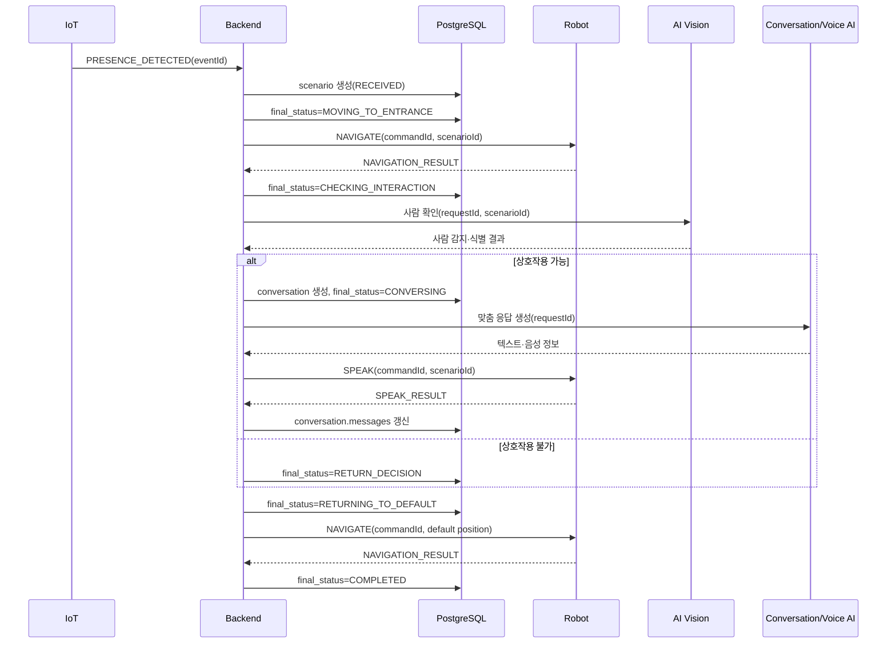

# 귀가 환영 시나리오

## 1. 목적과 범위

귀가 환영은 현관의 사람 감지를 계기로 로봇이 시니어에게 이동하고, 상호작용 가능 여부를 확인한 뒤 짧은 맞춤 대화를 수행하고 기본 위치로 돌아가는 흐름이다.

이 문서는 다음 경계를 함께 정의한다.

- IoT → Backend: 사람 감지
- Backend ↔ Robot: 이동·말하기 명령과 결과
- Backend ↔ AI Vision: 사람 존재·식별
- Backend ↔ 대화·음성 AI: 응답 생성
- Backend → PostgreSQL: `scenario`, `conversation`, 필요 시 `memory`, `care_record`

MQTT payload와 토픽의 상세 형식은 [`../mqtt/topic-convention.md`](../mqtt/topic-convention.md), HTTP 형식은 `docs/api`의 OpenAPI 계약을 따른다.

## 2. 시작 조건

Backend는 다음 조건을 모두 만족할 때 시나리오를 시작한다.

- 유효한 `PRESENCE_DETECTED` 이벤트를 받았다.
- 대상 `robot.id`를 결정할 수 있다.
- `robot.is_active=true`다.
- 로봇에 배정된 `senior_id`가 존재하고 사용자 상태가 `ACTIVE`다.
- 같은 시작 이벤트로 이미 만든 시나리오가 없다.
- 안전 정지나 더 높은 우선순위의 긴급 시나리오가 실행 중이지 않다.

최초 IoT 센서가 로봇 ID를 모른다면 Backend가 센서 설치 위치와 로봇 배정 정보로 대상 로봇을 결정한다.

## 3. 정상 흐름



### 처리 순서

1. IoT의 `eventId`를 `scenario.external_event_id`에 보관하고 `final_status=RECEIVED`로 시나리오를 생성한다.
2. 대상 로봇과 시니어를 연결하고 현관 이동 전에 `MOVING_TO_ENTRANCE`로 바꾼다.
3. Robot에 `NAVIGATE`를 발행하고 도착 결과를 기다린다.
4. 도착하면 `CHECKING_INTERACTION`으로 바꾸고 Vision에 사람 확인을 요청한다.
5. 사람이 없거나 상호작용이 부적절하면 대화를 만들지 않고 복귀 판단으로 이동한다.
6. 상호작용 가능하면 `conversation`을 만들고 `CONVERSING`으로 바꾼다.
7. 접근 가능한 기억과 최근 대화만 사용해 인사말을 만들고 Robot에 `SPEAK`를 보낸다.
8. 최종 텍스트 메시지를 `conversation.messages`에 저장한다. 음성 바이너리는 저장하지 않는다.
9. 대화가 끝나면 `RETURN_DECISION`, `RETURNING_TO_DEFAULT`를 거쳐 기본 위치로 복귀한다.
10. 정상 복귀는 `COMPLETED`, 실패는 원인에 따라 `FAILED`, `CANCELLED`, `TIMED_OUT`으로 끝낸다.

## 4. DB 상태

`scenario.final_status`는 이름과 달리 현재 진행 상태와 최종 결과를 함께 담는다.

| 상태 | 의미 | 다음 상태 |
|---|---|---|
| `RECEIVED` | 시작 이벤트를 받아 시나리오를 만들었다. | `MOVING_TO_ENTRANCE`, `FAILED`, `CANCELLED` |
| `MOVING_TO_ENTRANCE` | 로봇이 현관으로 이동 중이다. | `CHECKING_INTERACTION`, `FAILED`, `TIMED_OUT`, `CANCELLED` |
| `CHECKING_INTERACTION` | 사람 존재·식별과 상호작용 가능 여부를 확인한다. | `CONVERSING`, `RETURN_DECISION`, `FAILED`, `TIMED_OUT` |
| `CONVERSING` | 인사 또는 후속 대화 중이다. | `RETURN_DECISION`, `FAILED`, `TIMED_OUT`, `CANCELLED` |
| `RETURN_DECISION` | 복귀 전에 사람·장애물·안전 상태를 판단한다. | `RETURNING_TO_DEFAULT`, `FAILED`, `CANCELLED` |
| `RETURNING_TO_DEFAULT` | 기본 위치로 돌아가는 중이다. | `COMPLETED`, `FAILED`, `TIMED_OUT`, `CANCELLED` |
| `COMPLETED` | 정상 종료했다. | 없음 |
| `FAILED` | 복구 불가능한 오류로 종료했다. | 없음 |
| `CANCELLED` | 사용자 또는 안전 정책으로 취소했다. | 없음 |
| `TIMED_OUT` | 제한 시간 안에 단계가 끝나지 않았다. | 없음 |

세부 체크포인트 `DETECTED`, `ARRIVED`, `RECOGNIZING`, `PERSON_FOUND`, `SPEAKING`은 통신·애플리케이션 내부 단계다. 현재 9테이블 ERD에는 별도 컬럼이 없으므로 다음처럼 굵은 상태로 묶는다.

| 세부 체크포인트 | `scenario.final_status` |
|---|---|
| `DETECTED` | `RECEIVED` |
| `NAVIGATING`, `ARRIVED` | `MOVING_TO_ENTRANCE` |
| `RECOGNIZING`, `PERSON_FOUND` | `CHECKING_INTERACTION` |
| `GENERATING_RESPONSE`, `SPEAKING` | `CONVERSING` |
| `CHECKING_RETURN_SAFETY` | `RETURN_DECISION` |
| 복귀 이동 | `RETURNING_TO_DEFAULT` |

세부 단계별 시작·완료 시각, 실패 코드, 외부 요청 ID가 운영에 필요해지면 `scenario` 확장 또는 별도 실행 원장을 추가한다. 현재 JSONB에 임의로 숨겨 넣지 않는다.

## 5. 식별자

| ID | 생산자 | 의미 | 현재 DB 저장 |
|---|---|---|---|
| `eventId` | 이벤트 생산자 | 한 논리 이벤트·상태·결과 메시지 | 시나리오 시작 이벤트만 `scenario.external_event_id` |
| `scenarioId` | Backend | 전체 귀가 환영 흐름 | `scenario.id` |
| `robotId` | 로봇 등록 | 대상 로봇 | `robot.id` |
| `requestId` | Backend | Vision 또는 대화·음성 AI 작업 | 없음 |
| `commandId` | Backend | Robot에 보낸 한 명령 | 없음 |

- `scenarioId`와 `robotId`는 DB UUID의 표준 문자열 표현을 사용한다.
- `eventId`, `requestId`, `commandId`는 최대 64자의 불투명 문자열이며 같은 논리 작업 재전송에서는 같은 값을 쓴다.
- 서로 다른 종류의 ID를 같은 값으로 재사용하지 않는다.
- 토픽의 `{robotId}`와 payload의 `robotId`는 일치해야 한다.

## 6. 현재 영속성 경계

이번 최소 ERD가 저장하는 것은 다음과 같다.

| 데이터 | 저장 위치 |
|---|---|
| 시나리오 상관관계·대상·현재 상태 | `scenario` |
| 시작 이벤트 ID | `scenario.external_event_id` |
| 최종 대화 텍스트 | `conversation.messages` |
| 원문 만료 예정 시각 | `conversation.raw_messages_expires_at` |
| 확인된 개인화 사실 | `memory` |
| 건강·환경·보호자 알림 등 구조화 결과 | `care_record` |

다음은 현재 저장하지 않는다.

- `commandId`와 명령 발행 대기 상태
- `requestId`와 AI 작업 결과 원장
- 모든 MQTT `eventId`
- 진행 메시지의 `sequence`
- 통신 수신·재시도 로그

따라서 Backend 재시작 후 동일 명령 재발행, 모든 QoS 1 메시지의 전역 중복 제거, AI Callback 선도착 연결을 DB만으로 보장하지 못한다. 통신 규약의 ID는 유지하되 첫 연동에서는 프로세스 내 단기 캐시와 각 서비스의 중복 방지에 의존한다.

이 제한 때문에 데이터베이스 문서가 통신 신뢰성을 보장한다고 표현해서는 안 된다. 재시작·재전송 시험에서 문제가 확인되면 다음 확장 우선순위는 명령 Outbox, 수신 이벤트 원장, 외부 요청 원장이다.

## 7. 대화와 개인화

### 대화 생성

- 한 귀가 시나리오에서 대화가 실제로 시작될 때 `conversation`을 만든다.
- `conversation.scenario_id`로 귀가 시나리오를 연결한다.
- 대화 시작 시 `status=OPEN`, 정상 종료 시 `COMPLETED`로 바꾼다.
- 오류는 `FAILED`, 사용자 취소는 `CANCELLED`다.

### 메시지

```json
[
  {
    "id": "9d526a46-d998-4b80-8898-eed474376d5d",
    "role": "ROBOT",
    "content": "순희님, 다녀오셨어요?",
    "occurredAt": "2026-07-27T18:03:20+09:00"
  },
  {
    "id": "67004f65-5567-48e9-a79c-2f4a43c2e934",
    "role": "SENIOR",
    "content": "응, 오늘은 조금 더웠어.",
    "occurredAt": "2026-07-27T18:03:28+09:00"
  }
]
```

`messages`에는 최종 텍스트와 발화 시각만 보존한다. 오디오 URI, 인증 토큰, Vision 특징값은 넣지 않는다.

### 기억 사용

인사말 생성에는 다음 기억만 사용한다.

```text
senior_id 일치
AND lifecycle_status = ACTIVE
AND verification_status != REJECTED
AND 현재 사용자에게 허용된 visibility
```

보호자 공유 동의와 대화 개인화 동의를 혼동하지 않는다. 로봇이 시니어에게 직접 말할 수 있는 기억과 보호자 앱이 볼 수 있는 기억은 별도 정책이다.

대화 중 새 사실이 나와도 건강·복약 기록을 자동 확정하지 않는다. 필요한 경우 `UNVERIFIED` 후보로 만들고 사용자 확인 후 갱신한다.

## 8. 실패·시간 제한

| 단계 | 기본 제한 | 실패 처리 |
|---|---:|---|
| 현관 이동 | 60초 | 안전 정지 후 `TIMED_OUT` 또는 `FAILED` |
| 사람 확인 | 15초 | 대화 없이 복귀 판단, 기술 오류면 `FAILED` |
| 대화·음성 생성 | 10초 | 짧은 기본 인사 1회 또는 대화 생략 |
| 음성 재생 | 30초 | 취소 명령 후 복귀 판단 |
| 기본 위치 복귀 | 60초 | 안전 정지 후 `TIMED_OUT` 또는 `FAILED` |

- 타임아웃 값은 환경 설정으로 관리한다.
- Robot이 움직이는 중 연결이 끊기면 안전 정지를 우선한다.
- Vision 결과가 불확실하면 이름을 단정하지 않고 일반 인사를 사용한다.
- 대화 AI가 실패해도 이동 안전 로직은 계속 동작해야 한다.
- 복귀 경로에 사람이 있거나 장애물이 있으면 `RETURN_DECISION`에서 기다리거나 안전 위치로 이동한다.

현재 `scenario`에는 실패 단계·오류 코드 컬럼이 없다. 운영 분석이 필요하면 로그로만 버티지 말고 명시적인 컬럼이나 실행 이력 테이블을 추가한다.

## 9. 취소

- `MOVING_TO_ENTRANCE`, `CONVERSING`, `RETURNING_TO_DEFAULT` 중 사용자 취소나 안전 불확실이 생기면 Robot에 `CANCEL`을 보낸다.
- 취소 명령은 새 `commandId`를 쓰고 `targetCommandId`로 중단 대상을 가리킨다.
- Robot은 ROS 2/Nav2 또는 음성 재생 작업을 취소하고 `CANCEL_RESULT`를 반환한다.
- 사용자 취소가 원인이면 시나리오는 `CANCELLED`로 끝낸다.
- 안전하지 않아 중단한 경우 안전 정지를 유지하고 원인에 따라 `FAILED` 또는 `TIMED_OUT`으로 끝낸다.

취소 명령 자체의 결과는 현재 DB에 별도 저장하지 않는다.

## 10. 팀별 책임

### IoT

- 실제 감지 시각을 `occurredAt`으로 보낸다.
- 같은 감지 사건 재전송에는 같은 `eventId`를 쓴다.
- 위치·센서 식별 정보로 Backend가 대상 로봇을 결정할 수 있어야 한다.

### Backend

- 시작 이벤트로 `scenario`를 만들고 허용된 상태 전이만 적용한다.
- UUID `robotId`와 배정 시니어를 검증한다.
- 대화 텍스트와 최종 업무 데이터만 저장한다.
- 현재 ERD가 보장하지 못하는 중복·재시작 한계를 운영 로그와 테스트에서 드러낸다.

### Robot

- 토픽과 payload의 `robotId`를 검증한다.
- 만료된 명령과 이미 처리한 `commandId`를 재실행하지 않는다.
- 진행 상태와 최종 결과를 구분해 발행한다.
- 이동·재생 취소와 안전 정지를 지원한다.

### AI Vision

- 사람 존재와 식별 신뢰도를 판단한다.
- 같은 `requestId` 재시도에 새 작업을 중복 생성하지 않는다.
- 원본 프레임이나 생체 특징을 Backend DB에 보내지 않는다.

### 대화·음성 AI

- 접근 허용된 기억만 사용한다.
- 텍스트 응답과 로봇이 재생할 음성 참조를 반환한다.
- 같은 `requestId`의 중복 요청을 식별한다.
- 민감한 사실을 확인 없이 확정 기록으로 만들지 않는다.

## 11. 완료 기준

- [ ] `PRESENCE_DETECTED` 하나로 `scenario.external_event_id`가 연결된다.
- [ ] 상태가 정의된 순서로 전이하고 종료 상태에서 다시 움직이지 않는다.
- [ ] MQTT `robotId`가 `robot.id` UUID와 일치한다.
- [ ] 대화가 시작된 경우에만 `conversation`이 생성된다.
- [ ] 음성·영상 원본 없이 최종 텍스트만 저장된다.
- [ ] 삭제·거절·비공개 기억이 인사말에 사용되지 않는다.
- [ ] 타임아웃·취소·안전 정지 뒤 로봇이 위험 동작을 계속하지 않는다.
- [ ] 재시작과 QoS 1 중복 시험 결과를 기록하고, 현재 최소 모델의 한계를 넘으면 Outbox·원장을 확장한다.
