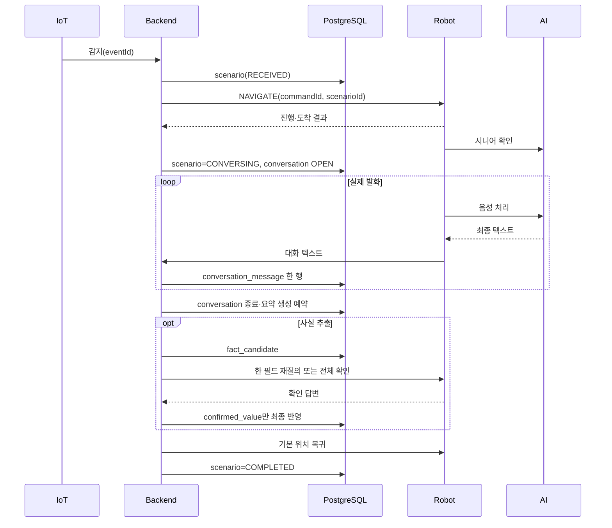

# 귀가 환영 시나리오

> **이전 설계 참고:** 5개 시나리오의 MQTT 메시지와 최종 흐름은 [`../mqtt/scenario-contract-v1.md`](../mqtt/scenario-contract-v1.md)를 기준으로 합니다. 아래 내용과 충돌하면 시나리오 계약 v1을 따릅니다.

문 열림 또는 방향이 확인된 사람 감지로 로봇이 현관으로 이동하고, 시니어를 확인한 뒤 대화하고 안전하게 기본 위치로 복귀한다.

## 참여 시스템

- IoT → Backend: `DOOR_OPENED` 또는 `PRESENCE_DETECTED`
- Backend ↔ Robot: MQTT 명령·상태·결과
- Robot ↔ Vision/Voice/대화 AI: 인식·음성·대화
- Backend → PostgreSQL: `scenario`, `conversation`, `conversation_message`, 필요 시 `conversation_summary`, `fact_candidate`, `memory`, `care_record`

## 저장·실패 규칙

1. 시작 `eventId`만 `scenario.external_event_id`에 연결한다.
2. 실제 텍스트 발화마다 `conversation_message.sequence_no`를 증가시킨다.
3. 음성 바이너리·전체 프롬프트·모델 원응답은 저장하지 않는다.
4. 종료 또는 무응답 뒤 `CONVERSATION` 요약을 만든다.
5. 추출 사실은 먼저 `fact_candidate`로 보내고 민감정보는 명시적으로 확인한다.
6. 확인된 변경은 새 `care_record`와 `parent_record_id`로 버전 연결한다.
7. 재질의 중 종료된 미확정 값은 최종 원본에 반영하지 않는다.
8. 시니어·PRIMARY 충돌은 협의 상태로 보내고 책임 재확인 전 반영하지 않는다.
9. `DETECTED`, `ARRIVED`, `RECOGNIZING`, `PERSON_FOUND`, `SPEAKING`은 통신·애플리케이션 체크포인트이며 DB에는 굵은 `scenario.final_status`만 둔다.
10. DB `scenario.scenario_type=HOMECOMING`은 Voice AI 요청을 만들 때 기존 계약값 `scenarioType=HOMECOMING_WELCOME`으로 변환한다.

문맥은 최근 Raw 6~12개, 관련 요약, 상위 장기 기억, 동의된 돌봄 기록만 사용한다. 별도 최근·하루 Raw 테이블은 없다.

Raw는 요약 생성, 활성 후보 해소, 확정 반영, 보존기간 만료 후 삭제한다. 세 `source_message_id` FK는 `ON DELETE SET NULL`이므로 답변·후보 결과·최종 돌봄 사실은 남는다.
