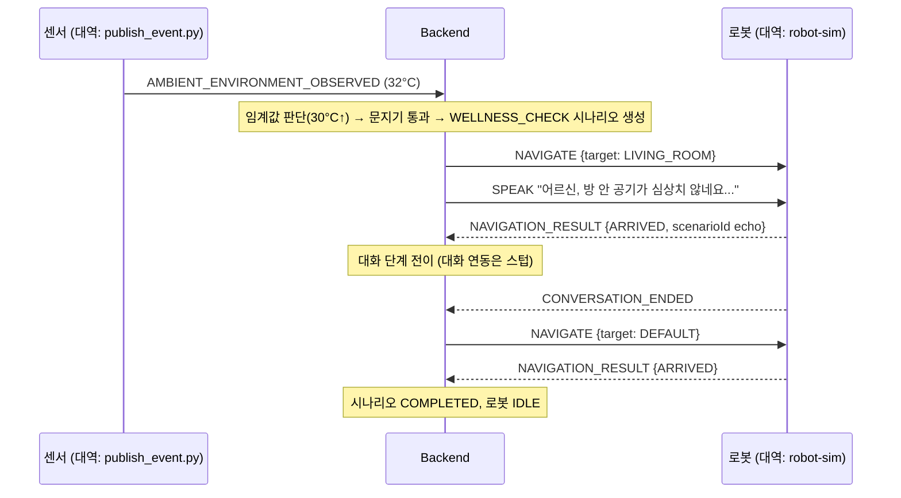

# 시나리오 ①⑤ 로컬 E2E 검증 보고 (2026-08-03)

> 한 줄 요약: **온습도 안부(①)와 현관 인사(⑤)가 센서 이벤트 수신부터 로봇 명령·복귀·완료까지
> 로컬에서 끝까지 돌아간다.** 실제 센서·실제 로봇 자리는 계약과 동일하게 동작하는 대역
> 스크립트로 대체했다 — 각 파트는 자기 대역을 실물로 갈아끼우기만 하면 된다.

## 1. 무엇이 어떻게 흐르나



⑤(현관)도 같은 흐름이며 트리거가 `DOOR_OPENED`, 목적지가 `ENTRANCE`, 발화가 귀가 인사라는 점만 다르다.

## 2. 실제 로그 (발췌)

백엔드:

```
WellnessCheckOrchestrator : Wellness check started: scenarioId=a1f56aad-..., temp=32.0
LoggingConversationGateway: Conversation hand-off (stub): scenarioId=a1f56aad-...
WellnessCheckOrchestrator : Wellness check suppressed (ACTIVE_SCENARIO_EXISTS): ...
```

로봇 대역(robot-sim):

```
[robot-sim] 명령 수신: NAVIGATE payload={'target': 'LIVING_ROOM'} scenarioId=a1f56aad-...
[robot-sim] 회신: NAVIGATION_RESULT ARRIVED
[robot-sim] 명령 수신: SPEAK payload={'text': '어르신, 방 안 공기가 심상치 않네요. 좀 어떠세요?'}
```

세 번째 줄 `suppressed`가 중요하다: 온습도는 연속 신호라 이상이 지속되면 이벤트가 계속
오는데, **진행 중 시나리오가 있으면 새로 만들지 않는 교통정리(ScenarioStartGuard)가 실전으로
동작**했다. 같은 장치가 완료 후 30분 쿨다운도 막는다.

## 3. 누구나 5분 재현

```bash
docker compose up -d                                   # 로컬 브로커+DB
docker compose exec -T postgres psql -U bomi -d bomi < scripts/dev/seed-kim-sunja.sql
# 백엔드 실행 (환경변수 MQTT_ENABLED=true 필수 — IntelliJ Run Configuration)
pip install paho-mqtt
python scripts/dev/publish_event.py robot-sim          # 터미널1: 가짜 로봇
python scripts/dev/publish_event.py ambient --temp 32  # 터미널2: 시나리오 ①
python scripts/dev/publish_event.py door               # 터미널2: 시나리오 ⑤
python scripts/dev/publish_event.py conv-end --scenario <로그의 scenarioId>  # 복귀→완료
```

발사기(`scripts/dev/publish_event.py`)는 계약 형식의 정답지이기도 하다.
`--dry-run`을 붙이면 발행 없이 JSON만 출력한다. → IoT 파트는 자기 발행 코드의 출력과 비교하면 됨.

## 4. 검증된 것 / 대역인 것 / 남은 것

| 구간 | 상태 |
|---|---|
| 센서 이벤트 수신·검증·중복제거 (MQTT) | ✅ 검증 |
| 임계값 판단 → 시나리오 생성 (①) | ✅ 검증 (30°C/80%, 설정으로 변경 가능) |
| 문 열림 → 시나리오 생성 (⑤) | ✅ 검증 (기존 구현) |
| 중복·쿨다운 방지 (ScenarioStartGuard) | ✅ 검증 |
| 로봇 명령 발행 + 결과 수신 + 상태 전이 → 완료 | ✅ 검증 |
| 실제 센서 발행 코드 | 🔲 IoT 파트 (대역: publish_event.py) |
| 실제 주행 (Nav2RobotDriver + 좌표) | 🔲 로봇 파트 (대역: robot-sim) — **전 시나리오 공통 병목** |
| 대화 연동 | 🔲 AI 파트 (현재 스텁, conv-end 로 수동 대체 가능) |
| EC2 통합 검증 | 🔲 ② 머지 후 한 번에 |

## 5. 이번 MR에 포함된 변경

- **버그 수정**: 미등록 센서/로봇 미배정 시 무한 재전송 루프 3곳 제거 (예외 대신 경고 후 폐기)
- **D-1**: scenario 테이블에 시각 컬럼 추가(V8), 활성 시나리오 조회, ScenarioStartGuard(중복·쿨다운 방지)
- **D-2**: WELLNESS_CHECK 시나리오 — 온습도 임계값 초과 시 거실 이동+안부 발화 (시나리오 ①)
- **도구**: 이벤트 발사기 + 로봇 대역(robot-sim), 시드 V8 대응 수정
- 온습도 센서 매핑 설정 추가 (`ambient-sensor-01` → 김순자)
