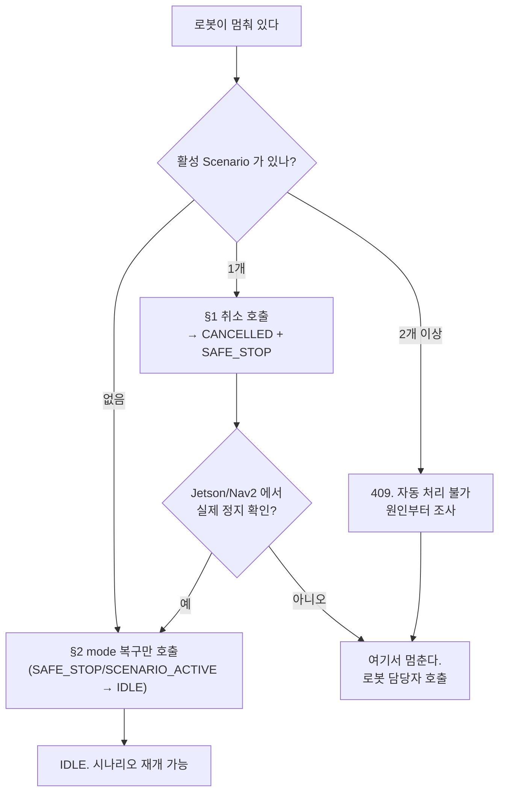

# 운영자 내비게이션 시나리오 취소

Robot이 내비게이션 결과를 보내지 못해 Scenario와 Robot mode가 계속 활성 상태로
남았을 때 사용한다.

두 API 모두 `/api/v1/operator/**` 채널이며 공유 시크릿 헤더
`X-Operator-Shared-Secret` 로 인증한다. 서버의 `OPERATOR_SHARED_SECRET` 또는 `OPERATOR_ID`
중 하나라도 비어 있으면 **요청 자체가 503 으로 fail-closed 차단**된다. 감사에 남는 운영자
식별자는 요청이 아니라 **서버 설정(`OPERATOR_ID`)에서 온다** — 요청 본문으로 바꿀 수 없다.

## 내 상황이 이 문서 대상인가



급하지 않다면 아무것도 하지 않는 선택지도 있다. `ScenarioTimeoutWatchdog` 이 기본 10분
(`SCENARIO_ACTIVE_TIMEOUT`)에 시나리오를 `TIMED_OUT` 으로 끊고 로봇을 `SAFE_STOP` 으로
만든다. 이 API 는 **그 10분을 기다리지 않기 위한** 도구다. (산책 시나리오는 이 워치독에서
제외되고 전용 워치독이 본다.)

## 1. 활성 내비게이션 취소 — **Scenario → `CANCELLED`, mode → `SAFE_STOP`**

로봇 주변과 이동 경로의 물리적 안전을 먼저 확인한다. 경로의 `bomi-AA001` 자리에는
**로봇 `deviceId`**(MQTT 토픽에 쓰는 그 값)를 넣는다 — REST 온보딩에서 쓰는 로봇 UUID 가
아니다. 두 값을 섞으면 404 가 돌아온다.

```bash
curl -X POST \
  "https://<backend-host>/api/v1/operator/robots/bomi-AA001/active-scenario-cancellations" \
  -H "X-Operator-Shared-Secret: $OPERATOR_SHARED_SECRET" \
  -H 'Content-Type: application/json' \
  -d '{
    "physicalSafetyConfirmed": true,
    "reason": "Jetson/Nav2 상태 확인 후 멈춘 현관 이동 시나리오 취소"
  }'
```

성공하면 Backend는 다음 작업을 하나의 트랜잭션으로 처리한다.

- Scenario를 `CANCELLED`(reasonCode `OPERATOR_CANCELLED`)로 종료
- Robot mode를 `SAFE_STOP`으로 변경
- 운영자·사유·이전 상태·이전 모드를 감사 테이블에 기록
  (대상 명령 id 와 취소 명령 id 는 활성 `NAVIGATE` 가 있을 때만 채워진다)
- **활성 `NAVIGATE` 가 있을 때만** 그 command ID를 `targetCommandId` 로 하는 MQTT `CANCEL` 을
  발행한다. 발행은 트랜잭션 커밋 **이후**에 일어나며 `expiresAt` 은 +2분이다

같은 요청을 다시 보내 활성 Scenario가 없으면 `200` 과 함께
`NO_OP_NO_ACTIVE_SCENARIO`를 반환한다. 이 no-op 은 **감사 행을 남기지 않는다**
(`auditId`·`cancelledAt` 이 null 로 돌아온다) — §2 의 `NO_OP_ALREADY_IDLE` 이 감사 행을
남기는 것과 다르다.

**이동 중이 아닌 Scenario도 취소된다.** 활성 `NAVIGATE` 명령이 없으면 MQTT `CANCEL` 만
생략하고(감사 행의 대상·취소 command id 는 비어 있다) Scenario 종료와 `SAFE_STOP` 전환은
그대로 수행한다. 이것이 가능해진 것은 Flyway `V20`이 감사 테이블의
`target_navigation_command_id`·`cancel_command_id` 의 `NOT NULL` 을 풀면서부터다 — 그전에는
내비게이션 명령이 없는 Scenario(대화 중 고착 등)를 이 API 로 끝낼 수 없었다.

로봇·어르신 전제 검사(미등록·비활성·미배정·배정 변경)를 통과해 **활성 Scenario를 찾은
뒤에** 취소가 되돌아가는 경우는 둘뿐이고, 둘 다 아무 상태도 바꾸지 않는다.

| 거절 | 응답 | 조건 |
| --- | --- | --- |
| `REJECTED_MULTIPLE_ACTIVE_SCENARIOS` | `409` | 활성 Scenario가 두 개 이상 — 어느 것을 끝낼지 서버가 고를 수 없다 |
| `REJECTED_MQTT_UNAVAILABLE` | `503` | 활성 `NAVIGATE` 가 **있는데** MQTT 명령 발행기가 정확히 1개가 아님. 활성 `NAVIGATE` 가 없으면 애초에 발행할 것이 없으므로 이 검사를 건너뛴다 |

응답 코드 전체

| 코드 | 상황 |
| --- | --- |
| 200 | `CANCELLED`(취소됨) 또는 `NO_OP_NO_ACTIVE_SCENARIO`(멱등 no-op) |
| 400 | `physicalSafetyConfirmed` 가 true 가 아니거나 `reason` 이 비었거나 500자 초과 |
| 401 | `X-Operator-Shared-Secret` 헤더 누락 또는 불일치 |
| 404 | 등록되지 않은 `deviceId` |
| 409 | 활성 Scenario 다수 · 비활성 로봇 · 어르신 미배정 · 배정 변경 |
| 503 | 서버에 운영자 시크릿 미설정, 또는 MQTT 명령 발행기가 정확히 1개가 아님 |

12필드 응답 중 운영자가 실제로 보는 것은 넷이다.

| 필드 | 의미 |
| --- | --- |
| `disposition` | 위 표의 처분값. `CANCELLED`/`NO_OP_*`/`REJECTED_*` |
| `currentMode` | 처리 후 로봇 모드. 취소가 성공했으면 `SAFE_STOP` |
| `cancelCommandId` | 발행한 `CANCEL` 의 commandId. 활성 `NAVIGATE` 가 없었으면 null |
| `auditId` | 감사 행 id. 거절·no-op 이면 null |

## 이 사이에 사람이 하는 일

여기서 **육안 확인**을 한다. 이 절차의 핵심이 두 API 사이의 이 단계다. Jetson/Nav2 에서
로봇이 실제로 정지했는지 직접 본다. 백엔드는 이것을 대신 확인해 줄 수 없다(§2 마지막 문단).

## 2. 정지 확인 후 IDLE 복구 — **mode → `IDLE`**

Jetson/Nav2에서 로봇이 실제로 정지한 것을 확인한 뒤 기존 복구 API를 호출한다.
복구 대상 모드는 `SAFE_STOP` 과 비정상 `SCENARIO_ACTIVE` 뿐이며 **`REST_GUARD` 는 409 로
거절**된다. §1 을 거쳐 왔다면 항상 `SAFE_STOP` 이라 문제가 없지만, §2 만 단독으로 쓸 때는
알아야 하는 제한이다.

```bash
curl -X POST \
  "https://<backend-host>/api/v1/operator/robots/bomi-AA001/mode-recoveries" \
  -H "X-Operator-Shared-Secret: $OPERATOR_SHARED_SECRET" \
  -H 'Content-Type: application/json' \
  -d '{
    "physicalSafetyConfirmed": true,
    "reason": "CANCEL 처리 및 Robot 정지 확인"
  }'
```

이 호출이 성공하면 Robot mode가 `SAFE_STOP`에서 `IDLE`로 바뀐다.

취소 API와 복구 API를 한 번에 합치지 않은 이유는 두 가지다.

1. MQTT 취소 명령 발행과 실제 모터 정지 확인 사이에 시간 차이가 있을 수 있다.
2. **백엔드는 취소 성공을 MQTT 로 확인할 수 없다.** 브릿지가 보내는 `CANCEL_RESULT` 에는
   백엔드 핸들러가 없어 로그만 남고, 뒤이어 오는 `NAVIGATION_RESULT(CANCELLED)` 는
   시나리오가 이미 터미널이라 라우터가 무시한다. 정지 확인은 사람이 Jetson/Nav2 에서
   해야 하고, 그 확인을 강제하는 것이 2단계로 나눈 이 절차 자체다.

`SAFE_STOP` 은 이후 모든 이동 시나리오를 차단하고 **자동 복구 경로가 없다** — 재시작해도
풀리지 않고 MQTT 로도 못 푼다. 2단계를 건너뛰면 로봇은 잠긴 채로 남는다.

## 취소 명령이 로봇에서 실제로 어떻게 처리되나

"명령이 도착했다"와 "바퀴가 멈췄다"는 다르다. 브릿지는 `CANCEL` 의 payload 를 읽지 않고
(`targetCommandId` 대조 없음) 진행 중인 목표를 무조건 취소하며, 워커 큐를 거치지 않고
**수신 스레드에서 즉시 실행**한다. Nav2 드라이버의 `cancel` 은 취소 요청만 던지고 결과를
기다리지 않는다. 위 §2 의 육안 확인이 필요한 이유가 이것이다.

## 취소 뒤에 다시 막힌다면

`SAFE_STOP` 을 풀어도 시나리오가 `NAVIGATING`/`FOLLOWING` 으로 남아 있으면 다음 시나리오가
`ACTIVE_SCENARIO_EXISTS` 로 막힌다. 리허설 중이라면 `scripts/dev/reset-demo.sql` 이 둘을
함께 푼다.

두 API 모두 "senior 행 → Robot 행" 순으로 락을 잡으며 이는 시나리오 입장 경로와 같은
순서다. 새 시나리오가 동시에 시작되는 상황에서도 원자적이므로 "지금 눌러도 되나"를 따로
고민할 필요는 없다.
