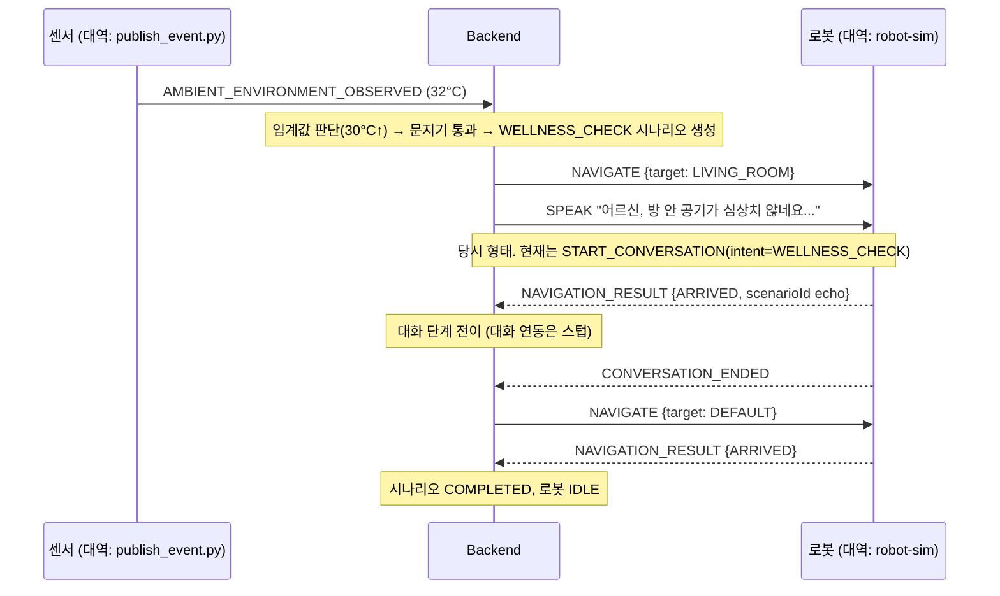

# 시나리오 ①⑤ 로컬 E2E 검증 보고 (2026-08-03) — 보존 기록

> **이 문서는 2026-08-03 시점의 검증 기록이며 현행 계약의 정답지가 아니다.**
> 그때 무엇을 확인했는지 남기기 위해 보존한다. 현행 실물 연동은
> [`실기 통합 가이드.md`](<./실기 통합 가이드.md>)와
> [`시나리오 계약 v1.md`](<../mqtt/시나리오 계약 v1.md>)를 따른다.
> 실물 Robot Bridge 와 `robot-sim` 을 같은 `robotId` 로 동시에 실행하지 않는다.

### 이 기록 이후 바뀐 것 (읽기 전에)

| 이 문서의 서술 | 2026-08-16 현재 |
| --- | --- |
| 백엔드가 `SPEAK` 를 발행한다 | 발행하지 않는다. 대화는 `bomi/v1/ai/{id}/commands` 의 `START_CONVERSATION` 으로 나간다 |
| 대화 연동은 스텁(`LoggingConversationGateway`) | `MqttConversationGateway` 로 실구현. 그 클래스명은 더 이상 존재하지 않는다 |
| 실제 주행은 미구현(대역 `robot-sim`) | `Nav2RobotDriver` 구현 완료 + 좌표 실측 반영. **실주행 검증은 아직 진행 전** |
| ⑤(현관)는 ①과 같은 흐름 | 대화 종료 후 경로가 갈렸다 — HOMECOMING 만 기본적으로 사람 추종(`FOLLOW_START`)으로 빠진다 |

§3(5분 재현)의 절차와 스크립트는 지금도 그대로 동작한다.

> 한 줄 요약: **온습도 안부(①)와 현관 인사(⑤)가 센서 이벤트 수신부터 로봇 명령·복귀·완료까지
> 로컬에서 끝까지 돌아간다.** 실제 센서·실제 로봇 자리는 계약과 동일하게 동작하는 대역
> 스크립트로 대체했다 — 각 파트는 자기 대역을 실물로 갈아끼우기만 하면 된다.

## 1. 무엇이 어떻게 흐르나



⑤(현관)도 같은 흐름이며 트리거가 `DOOR_OPENED`, 목적지가 `ENTRANCE`, 발화가 귀가 인사라는 점만 다르다.
(2026-08-03 시점 기준. 지금은 대화 종료 후 경로가 갈렸다 —
[`귀가 환영 시나리오.md`](<./귀가 환영 시나리오.md>) 의 복귀 분기 경고를 참고한다.)

## 2. 실제 로그 (발췌)

백엔드:

```
WellnessCheckOrchestrator : Wellness check started: scenarioId=a1f56aad-..., temp=32.0
LoggingConversationGateway: Conversation hand-off (stub): scenarioId=a1f56aad-...
WellnessCheckOrchestrator : Wellness check suppressed (ACTIVE_SCENARIO_EXISTS): ...
```

로봇 대역(robot-sim):

```
[robot-sim] 명령 수신: NAVIGATE payload={'target': 'LIVING_ROOM'} scenarioId=a1f56aad-...
[robot-sim] 회신: NAVIGATION_RESULT ARRIVED
[robot-sim] 명령 수신: SPEAK payload={'text': '어르신, 방 안 공기가 심상치 않네요. 좀 어떠세요?'}
```

세 번째 줄 `suppressed`가 중요하다: 온습도는 연속 신호라 이상이 지속되면 이벤트가 계속
오는데, **진행 중 시나리오가 있으면 새로 만들지 않는 교통정리(ScenarioStartGuard)가 실전으로
동작**했다. 온습도 안부는 여기에 더해 30분 쿨다운이 걸려 있다 — 단 쿨다운은 **같은 어르신에게
같은 타입이 `COMPLETED` 로 끝난 경우만** 보고, 다른 네 시나리오는 쿨다운이 0 이다.

`ScenarioStartGuard` 억제와 `ScenarioRobotStartPolicy` 거절은 서로 다른 층이라는 점도
재현 중에 알아 두면 좋다. 전자는 활성 시나리오·쿨다운을 보고, 후자는 로봇 모드(`IDLE_ONLY` 등)와
등록·배정을 본다. 로그의 `BlockReason` 으로 어느 쪽에 막혔는지 구분할 수 있다.

## 3. 누구나 5분 재현

```bash
docker compose up -d                                   # 로컬 브로커+DB
docker compose exec -T postgres psql -U bomi -d bomi < scripts/dev/seed-kim-sunja.sql
# 백엔드 실행 (환경변수 MQTT_ENABLED=true 필수 — IntelliJ Run Configuration)
pip install paho-mqtt
python scripts/dev/publish_event.py robot-sim          # 터미널1: 가짜 로봇
python scripts/dev/publish_event.py ambient --temp 32  # 터미널2: 시나리오 ①
python scripts/dev/publish_event.py door               # 터미널2: 시나리오 ⑤
python scripts/dev/publish_event.py conv-end --scenario <로그의 scenarioId>  # 복귀→완료
```

발사기(`scripts/dev/publish_event.py`)는 계약 형식의 정답지이기도 하다.
`--dry-run`을 붙이면 발행 없이 JSON만 출력한다. → IoT 파트는 자기 발행 코드의 출력과 비교하면 됨.

**이 절차는 지금도 동작한다.** `publish_event.py` 의 `robot-sim`·`ambient`·`door`·`conv-end`
서브커맨드와 `scripts/dev/seed-kim-sunja.sql` 이 모두 현존한다. 세 가지만 덧붙인다.

- `MQTT_ENABLED=true` 가 필수인 이유는 **`application.yml` 의 기본값이 `false`** 이기 때문이다.
- **두 번째 시도가 막히면 초기화가 필요하다.** 실패로 남은 `SAFE_STOP` 과 `NAVIGATING`/`FOLLOWING`
  으로 남은 시나리오(`ACTIVE_SCENARIO_EXISTS` 차단)를 `scripts/dev/reset-demo.sql` 이 함께 푼다.
  §2 로그의 `suppressed` 가 바로 그 현상이다.
- 온습도 임계는 30.0℃ **이상** 또는 80.0% **이상**(`>=`)이며 `WELLNESS_TEMP_THRESHOLD` ·
  `WELLNESS_HUMIDITY_THRESHOLD` 로 바꿀 수 있다. `WELLNESS_SCENARIO_ENABLED=false` 면 관측은
  저장하되 시나리오는 시작하지 않는다.

## 4. 검증된 것 / 대역인 것 / 남은 것

| 구간 | 2026-08-03 상태 | 2026-08-16 |
|---|---|---|
| 센서 이벤트 수신·검증·중복제거 (MQTT) | ✅ 검증 | 유지 |
| 임계값 판단 → 시나리오 생성 (①) | ✅ 검증 (30°C/80%, 설정으로 변경 가능) | 유지 |
| 문 열림 → 시나리오 생성 (⑤) | ✅ 검증 (기존 구현) | 유지 |
| 중복·쿨다운 방지 (ScenarioStartGuard) | ✅ 검증 | 유지 |
| 로봇 명령 발행 + 결과 수신 + 상태 전이 → 완료 | ✅ 검증 | 유지 (로컬 대역 기준) |
| 실제 센서 발행 코드 | 🔲 IoT 파트 (대역: publish_event.py) | 구현 완료·실기 미검증 |
| 실제 주행 (Nav2RobotDriver + 좌표) | 🔲 로봇 파트 (대역: robot-sim) — **전 시나리오 공통 병목** | 구현 완료·실주행 미검증 |
| 대화 연동 | 🔲 AI 파트 (현재 스텁, conv-end 로 수동 대체 가능) | 구현 완료 (MQTT START_CONVERSATION) |
| EC2 통합 검증 | 🔲 보미야 호출 시나리오 머지 후 한 번에 | 미검증 |

## 5. 이 검증과 함께 들어간 변경 (2026-08-03, MR 기준)

- **버그 수정**: 미등록 센서/로봇 미배정 시 무한 재전송 루프 3곳 제거 (예외 대신 경고 후 폐기)
- **D-1**: scenario 테이블에 시각 컬럼 추가(V8), 활성 시나리오 조회, ScenarioStartGuard(중복·쿨다운 방지)
- **D-2**: WELLNESS_CHECK 시나리오 — 온습도 임계값 초과 시 거실 이동+안부 발화 (시나리오 ①)
- **도구**: 이벤트 발사기 + 로봇 대역(robot-sim), 시드 V8 대응 수정
- 온습도 센서 매핑 설정 추가 (`ambient-sensor-01` → 김순자)
