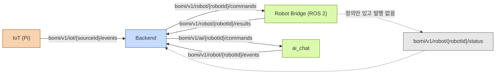

# 로봇·IoT 실기 통합 가이드

> 최종 메시지 기준은 [`시나리오 계약 v1.md`](<../mqtt/시나리오 계약 v1.md>)와
> [`bomi-mqtt.asyncapi.yaml`](../../backend/src/main/resources/static/openapi/bomi-mqtt.asyncapi.yaml)이다.
> 과거 draft, legacy envelope, 오래된 simulator 출력은 구현 기준으로 사용하지 않는다.

## 당신이 어느 파트인가

| 당신이 만드는 것 | 읽을 절 | 정본 코드 |
| --- | --- | --- |
| ROS 2 브릿지 | Robot Bridge 계약 | `robot/ros2_ws/src/bridge/bridge/contract.py` |
| `ai_chat` 대화 | AI 대화 채널 계약 | `robot/ai_chat/src/bomi_ai_chat/contracts/ai_commands.py` |
| Zigbee/DHT 센서 | IoT 이벤트 계약 | `iot/raspberry-pi/translator/contract.py` |
| 운영 대응 | 운영자 절 2개 | `backend/.../OperatorScenarioCancellationService.java` |

토픽 전체 지도. 실선은 운영 중 실제로 메시지가 오가는 경로다.



점선이 중요하다 — status 토픽은 백엔드에 핸들러가 있고 브릿지에도 발행 메서드
(`publish_rest_state`·`publish_navigation_status`)가 있지만 **그 메서드를 부르는 곳이 테스트뿐**
이라 운영 중 이 토픽으로 나가는 메시지가 없다. 브릿지가 구독하는 토픽도 commands 하나뿐이므로,
IoT 이벤트나 AI 명령을 브릿지가 받을 것으로 기대하면 안 된다.

### 공통 봉투 규칙

세 채널이 모두 지키는 규칙이다. 어기면 **에러 응답 없이 조용히 폐기**된다.

- QoS 1 · `retain=false`. QoS 0 과 retained 메시지는 폐기된다.
- `eventId` ≤ 64자, 새 사건마다 새로 만들고 같은 사건의 재전송에서만 재사용한다.
- `occurredAt`·`expiresAt` 은 **타임존 오프셋을 포함한 ISO 8601**. 오프셋이 없으면 브릿지는
  명령 자체를 거절한다.
- UUID 는 canonical 36자만 받는다(`1-1-1-1-1` 축약형 거부).
- 상관관계 ID(`scenarioId`·`commandId`·`conversationId`)는 **최상위** 필드다. payload 안에 넣으면 거부.
- 토픽의 `{robotId}`/`{sourceId}` 와 본문 값이 일치해야 한다.

### 라인별 paho-mqtt 버전이 다르다

같은 저장소인데 세 라인의 요구 버전이 갈린다. 하나로 통일하려다 첫날 반나절을 잃는 자리다.

| 라인 | 요구 버전 | 근거 |
| --- | --- | --- |
| Robot Bridge | **2.x 필수** | `mqtt_client.py` 가 `CallbackAPIVersion.VERSION2` 를 쓴다 (`robot/requirements.txt` = `paho-mqtt>=2.1,<3`) |
| IoT 번역기 | **2.x** | `iot/raspberry-pi/translator/requirements.txt` = `paho-mqtt>=2.1,<3` |
| `ai_chat` | **1.x 계열** | `robot/ai_chat/pyproject.toml` = `paho-mqtt>=1.6,<2` (1.x 콜백 스타일) |

## 실물 연동 전 안전 수칙

- **실물 Robot Bridge와 `robot-sim`을 같은 `robotId`로 동시에 실행하지 않는다.** 둘 다 같은 명령을 구독하면 실물 로봇이 의도하지 않게 움직일 수 있다.
- 실물 Broker에서 `scripts/dev/publish_event.py`, 수동 MQTT publish 또는 Swagger `Try it out`으로 이동 시나리오를 시작하지 않는다.
- 실제 E-stop과 모터 정지는 Robot의 물리 안전 계층이 담당한다. Backend의 mode 또는 복구 API는 이를 대신하지 않는다.
- 실물 시험 전 사람과 장애물을 이동 범위에서 치우고, Robot 담당자가 물리 E-stop을 즉시 조작할 수 있는 상태인지 확인한다.

## Robot Bridge 계약

### Backend 명령 구독

토픽:

```text
bomi/v1/robot/{robotId}/commands
```

Backend 명령의 `commandId`, `scenarioId`, `robotId`는 최상위 필드다. Bridge는 다음 명령을 최종 v1 형식으로 처리한다.

| 명령 | payload | 의미 | Backend 가 실제로 발행하는가 |
| --- | --- | --- | --- |
| `NAVIGATE` | `{"target":"ENTRANCE|LIVING_ROOM|DEFAULT"}` | 지정 waypoint로 이동 | 예 (귀가·복약·온습도) |
| `FOLLOW_START` | `{}` (빈 객체 강제) | 사람 따라가기 시작 | 예 (보미야 호출·귀가 대화 후·산책) |
| `FOLLOW_STOP` | `{}` (빈 객체 강제) | 사람 따라가기 중지 | 예 (산책 종료) |
| `CANCEL` | `{"targetCommandId":"…","reasonCode":"…"}` | 진행 중 명령 취소 | 예 (운영자 강제 취소 전용) |
| `SPEAK` | — | 발화 | **아니오** — enum 에만 있고 발행 코드 0건 |

`NAVIGATE` 의 목적지 검증은 드라이버가 아니라 브릿지 코어에서 한다. 계약 밖 target 은
드라이버를 부르지 않고 즉시 `FAILED`/`NOT_ARRIVED`/`UNKNOWN_TARGET` 으로 회신한다.

`CANCEL` 은 현재 브릿지가 **payload 를 읽지 않는다** — `targetCommandId` 를 대조하지 않고
진행 중인 목표를 무조건 취소한다. 그리고 `CANCEL_RESULT` 를 발행하지만 **백엔드에는 그 타입의
핸들러가 없어** "No MQTT handler; ignoring" 로그만 남는다. 즉 취소 성공 여부는 MQTT 로 확인할 수
없고, Jetson/Nav2 쪽에서 직접 봐야 한다.

`expiresAt` 값은 명령마다 다르다. `NAVIGATE` 는 2분, HOMECOMING·보미야 호출의 `FOLLOW_START`
도 2분이지만 **산책(WALK)의 `FOLLOW_START`/`FOLLOW_STOP` 은 10초**다. 같은 명령 타입이라도
소비자 입장의 마감시각이 다르므로 로봇 쪽 워커 설계에 영향을 준다.

QoS 1에서는 같은 명령이 다시 도착할 수 있다. Bridge 는 `commandId` 기준 LRU(256개)로 중복
실행을 막으며, **중복은 회신 없이 버린다.** 중복 판정이 만료 검사보다 먼저 일어나므로 만료된
명령의 재전송분도 회신이 없다. 만료된 `expiresAt` 의 첫 수신분은 실행하지 않고
`COMMAND_EXPIRED` 로 회신한다. `expiresAt` 에 **타임존 오프셋이 없으면 명령 자체를 거절**한다.

### 계약 위반은 무엇이 회신되고 무엇이 침묵하는가

"응답이 없다 = 계약 위반"이 이 시스템의 규칙이다.

- 브릿지는 `scenarioId`·`commandId`·`type`·`robotId` 를 건질 수 있으면
  `FAILED`/`INTERNAL_ERROR` 로 회신한다. JSON 이 깨졌거나 ID 를 못 건지면 **회신하지 않는다.**
- 백엔드는 계약 위반 메시지를 warn 로그 + ack 로 폐기하며 **송신자에게 에러를 돌려주지 않는다.**

### Robot 결과 발행

토픽:

```text
bomi/v1/robot/{robotId}/results
```

`scenarioId`와 `commandId`는 원 명령의 값을 그대로 **최상위 필드에** 반환한다. `payload`에 넣거나 legacy `status` 필드로 대체하지 않는다.

정상 도착 예시:

```json
{
  "eventId": "evt-nav-result-001",
  "robotId": "bomi-AA001",
  "type": "NAVIGATION_RESULT",
  "occurredAt": "2026-08-05T10:30:10+09:00",
  "scenarioId": "fc768674-3266-47bb-8348-1a7d222c84bd",
  "commandId": "cmd-nav-001",
  "payload": {
    "outcome": "SUCCEEDED",
    "resultCode": "ARRIVED",
    "reasonCode": null
  }
}
```

산책 추종 시작·중지 결과도 같은 상관관계 규칙을 사용한다.

```json
{
  "eventId": "evt-follow-result-001",
  "robotId": "bomi-AA001",
  "type": "FOLLOW_RESULT",
  "occurredAt": "2026-08-05T10:31:00+09:00",
  "scenarioId": "9724acfb-2f59-475b-bb03-f4f533486065",
  "commandId": "cmd-follow-start-001",
  "payload": {
    "outcome": "SUCCEEDED",
    "resultCode": "STARTED",
    "reasonCode": null
  }
}
```

- `outcome`: `SUCCEEDED`, `FAILED`, `CANCELLED`, `TIMED_OUT` (브릿지는 `TIMED_OUT` 을 발행하지 않는다)
- `NAVIGATION_RESULT.resultCode`: `ARRIVED`, `NOT_ARRIVED`
- `FOLLOW_RESULT.resultCode`: `STARTED`, `STOPPED`, `UNCHANGED`
- `reasonCode` 키는 **값이 null 이어도 반드시 존재해야 한다.**
- 성공이면 `reasonCode=null`, 성공이 아니면 아래 집합에서 고른다 — **두 타입의 집합이 다르다.**

  | 결과 타입 | 허용 `reasonCode` |
  | --- | --- |
  | `NAVIGATION_RESULT` | `COMMAND_EXPIRED` `UNKNOWN_TARGET` `PATH_BLOCKED` `LOCALIZATION_LOST` `EXECUTION_TIMEOUT` `SAFETY_STOP` `INTERNAL_ERROR` |
  | `FOLLOW_RESULT` | `PERSON_LOST` `COMMAND_EXPIRED` `EXECUTION_TIMEOUT` `SAFETY_STOP` `INTERNAL_ERROR` |

  `FOLLOW_RESULT` 에 `PATH_BLOCKED`·`UNKNOWN_TARGET`·`LOCALIZATION_LOST` 를 실으면 거부된다.

- payload 의 선택 필드는 `location` 과 `message` 뿐이고, `location` 은 `resultCode=ARRIVED`
  일 때만 허용된다. 현재 브릿지는 **둘 다 발행하지 않는다.**
- 토픽의 `{robotId}`와 본문의 `robotId`가 다르면 **파서**가 거부한다(폐기).
  상관관계 ID 불일치는 그보다 뒤인 오케스트레이터 단계이고 결과가 갈린다 — 시나리오를 못 찾으면
  WARN 후 무시, 이미 터미널이면 INFO 후 무시, `commandId` 가 기대값과 다르면 계약 위반 처리다.
  디버깅할 때 어느 로그 레벨을 볼지가 여기서 갈린다.
- QoS 1, retain=false를 사용한다.
- 위 예시의 `evt-nav-result-001`·`+09:00` 은 읽기 쉬우라고 쓴 값이다. 브릿지가 실제로 만드는
  `eventId` 는 `uuid4().hex`(하이픈 없는 32자)이고 `occurredAt` 은 UTC `+00:00` 표기다.
  둘 다 계약을 만족하므로 형식을 예시에 맞출 필요는 없다.

### 무엇을 켜야 실제로 움직이는가

- **`core` 패키지를 함께 빌드해야 한다.** 브릿지가 좌표를 `core` 패키지의 ament share 경로에서
  읽으므로 `colcon build --packages-select core bridge` 없이는 Nav2 드라이버가 전부 FAILED 다.
- 좌표 파일의 단일 출처는 `robot/ros2_ws/src/core/config/room_waypoints.yaml` 이다. 여러 문서가
  언급하는 `bridge/config/named_waypoints.yaml` 은 **저장소에 존재하지 않는다.** 목적지 매핑은
  `ENTRANCE→entrance`, `LIVING_ROOM→sofa`, `DEFAULT→charging` 이다.
- `driver_type` ∈ `mock`(기본) · `nav2` · `timed` · `forward_test`. 잘못된 값은 노드 시작이
  실패한다. 실제로 주행하려면 `driver_type:=nav2` 다.
- 킬 스위치 `approach_enabled` · `search_enabled` · `zigzag_enabled` 는 **전부 기본 꺼짐**이다.
- ⚠️ `ros2 launch bridge mqtt_bridge.launch.py` 로는 **`search_enabled` 를 켤 수 없다** —
  launch 파일이 `search_enabled`·`search_start_topic` 두 파라미터를 노출하지 않는다. 동봉된
  회귀 테스트 `test/test_launch_exposes_node_parameters.py` 가 현재 그 이유로 실패한다.
  실물 연동 중 "왜 FOLLOW 가 안 먹지"의 첫 번째 원인이다.

## IoT 이벤트 계약

IoT 생산자는 `bomi/v1/iot/{sourceId}/events`로 최종 v1 envelope를 발행한다. `eventId`는 새 사건마다 새로 만들고 같은 사건의 재전송에서만 재사용한다. `sourceId`는 토픽과 본문이 같아야 하며 `occurredAt`은 타임존 오프셋을 포함한 ISO 8601 값이어야 한다.

문 열림 예시:

```json
{
  "eventId": "evt-door-001",
  "sourceId": "door-sensor-01",
  "type": "DOOR_OPENED",
  "occurredAt": "2026-08-05T10:30:00+09:00",
  "payload": {"location":"ENTRANCE"}
}
```

`sourceId` 는 백엔드 `bomi.homecoming.sensor-to-senior` 에 등록된 값이어야 하며, 등록되지 않은
값은 WARN 로그만 남기고 조용히 폐기된다(QoS 1 무한 재전송 방지). 정식 등록값은
`door-sensor-01` 과 `pir` 이다. `door_sensor` 도 현재는 매칭되지만 그것은 "IoT 가
`door-sensor-01` 로 되돌리면 지운다"고 명시된 임시 워크어라운드 줄이므로 새로 쓰지 않는다.

온습도 예시 — **실제 Pi(DHT11)가 보내는 형태**:

```json
{
  "eventId": "evt-ambient-001",
  "sourceId": "ambient-sensor-01",
  "type": "AMBIENT_ENVIRONMENT_OBSERVED",
  "occurredAt": "2026-08-05T10:30:00+09:00",
  "payload": {
    "location": "LIVING_ROOM",
    "temperatureC": 32.0,
    "humidityPercent": 50.0
  }
}
```

`comfortAssessment`(`COMFORTABLE|UNCOMFORTABLE`)와 `observedAt` 은 백엔드가 **있으면 읽는**
선택 필드이며 IoT 코드는 보내지 않는다. 이 두 키까지 실어 보내는 것은 개발용 발사기
`scripts/dev/publish_event.py ambient` 뿐이다. 두 형태 모두 백엔드가 받아들인다.

임계 판정(기본 30.0℃ 이상 **또는** 80.0% 이상, `>=` 비교)은 전적으로 백엔드 몫이다. IoT 는
`READ_INTERVAL_SECONDS`(기본 30초)마다 **임계와 무관하게 매번** 발행한다.

## AI 대화 채널 계약

로봇 위에서 도는 `ai_chat` 프로세스는 브릿지와 **다른 토픽 쌍**을 쓴다. 브릿지는 이동만,
`ai_chat` 은 대화만 담당하며 서로의 토픽을 구독하지 않는다.

| 방향 | 토픽 | 메시지 |
| --- | --- | --- |
| BE → AI | `bomi/v1/ai/{robotId}/commands` | `START_CONVERSATION` |
| AI → BE | `bomi/v1/robot/{robotId}/events` | `CONVERSATION_STARTED`, `CONVERSATION_ENDED`, `WAKE_WORD_DETECTED`, `WALK_REQUESTED` |

`START_CONVERSATION` payload 는 **정확히 4필드**다: `seniorId`(UUID) · `intent` ·
`text`(1~500자) · `triggerContext`(Map). `intent` 는 `WELLNESS_CHECK` ·
`MEDICATION_REMINDER` · `HOMECOMING_GREETING` 셋뿐이다.

⚠️ **`expiresAt` 은 10초다.** AI 는 10초 안에 `CONVERSATION_STARTED` 를 발행해야 하며,
못 하면 백엔드가 `AI_START_TIMEOUT` 으로 대화를 끊고 DEFAULT 복귀를 시작한다. 대화 자체의
상한은 5분(`CONVERSATION_TIMEOUT`)이다.

- `CONVERSATION_STARTED` — 최상위 `scenarioId`·`conversationId`·`commandId` **셋 다 필수**,
  payload 는 `{intent}`.
- `CONVERSATION_ENDED` — 최상위 `scenarioId`·`conversationId` 필수(**`commandId` 는 읽지 않는다**),
  payload 는 `{outcome, reasonCode}`. `outcome` ∈
  `COMPLETED|NO_RESPONSE|CANCELLED|FAILED`, `reasonCode` 키는 값이 null 이어도 존재해야 하고
  `FAILED` 면 값이 있어야 한다.
- `triggerContext` 는 계약 예시보다 필드가 많을 수 있다(`slotKey`·`location`·`temperatureC` 등).
  **엄격 파싱하지 말 것.**

발화 원문은 MQTT 가 아니라 REST 로 올린다 — `POST /api/v1/robot/conversation-events`.

## 운영자 Robot mode 복구

Robot 담당자가 물리적으로 안전함을 확인했고 활성 시나리오가 없는데 mode만 `SAFE_STOP` 또는 `SCENARIO_ACTIVE`에 남았을 때에만 다음 API를 사용한다.

```http
POST /api/v1/operator/robots/{deviceId}/mode-recoveries
X-Operator-Shared-Secret: <운영 환경의 별도 secret>
Content-Type: application/json

{
  "physicalSafetyConfirmed": true,
  "reason": "현장 점검 후 이동 경로와 모터 상태 확인"
}
```

복구 조건:

- 등록되고 활성화됐으며 어르신이 배정된 Robot
- 활성 Scenario 0건 — 활성 시나리오가 있으면 409 이며, 먼저
  [`운영자 시나리오 취소.md`](<./운영자 시나리오 취소.md>) 절차로 취소해야 한다
- 현재 mode가 `SAFE_STOP`, 또는 활성 Scenario가 없는데 남아 있는 비정상 `SCENARIO_ACTIVE`
  — **`REST_GUARD` 는 복구 대상이 아니라 409 로 거절된다**
- `physicalSafetyConfirmed=true`와 비어 있지 않은 `reason`(≤500자)
- 복구 목표는 `IDLE`만 허용하며 이미 `IDLE`이면 멱등 no-op(200, 감사 행은 남는다)

응답 코드: 200 복구/no-op · 400 `physicalSafetyConfirmed=false` 또는 `reason` 공백 ·
401 헤더 누락·불일치 · 404 미등록 로봇 · 409 그 밖의 거절 · 503 시크릿 미설정.
**거절 건은 감사 테이블에 남지 않는다.**

이 API는 MQTT 이동·취소 명령을 발행하지 않고 mode만 복구하며 감사 이력을 남긴다. 서버의 `OPERATOR_SHARED_SECRET` 또는 `OPERATOR_ID`가 비어 있으면 요청은 fail-closed로 거절된다. 활성 Scenario가 있거나 현장 안전 확인을 할 수 없다면 SQL이나 API로 강제 복구하지 말고 Robot 담당자와 먼저 원인을 해결한다.
