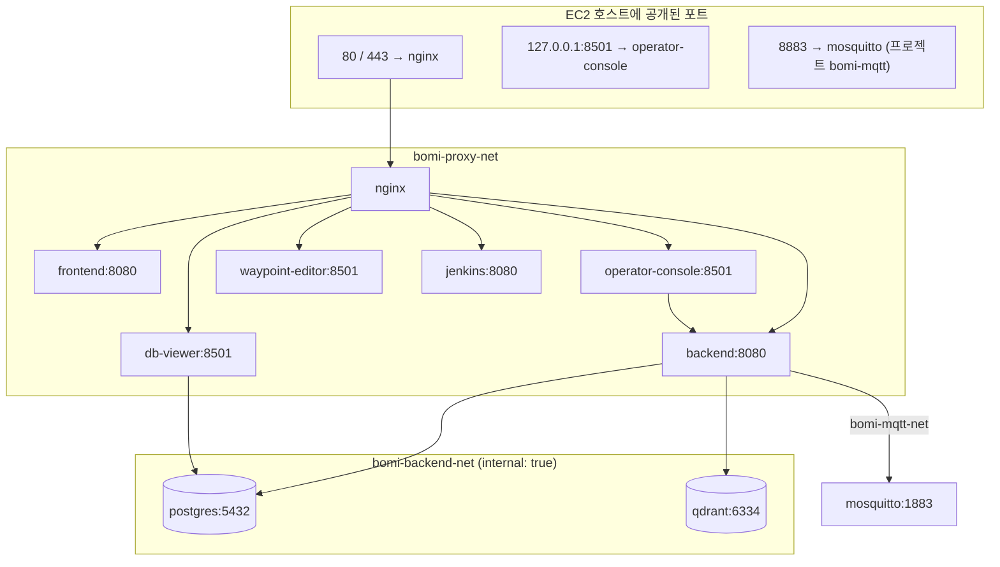

# 인프라 설정과 운영 런북

BOMI의 Docker Compose, PostgreSQL, Qdrant, Mosquitto, Nginx, Jenkins, 그리고 운영 도구
3종(운영자 콘솔·DB 뷰어·웨이포인트 편집기) 설정을 관리합니다. 공개 가능한 설정만 Git으로
관리하고 실제 비밀번호와 API 키는 EC2의 `/home/ubuntu/bomi/secrets`에만 저장합니다.

이 문서는 **PostgreSQL·Backend·Nginx/HTTPS 런북**입니다. 다른 주제는 별도 문서가 있습니다.

| 주제 | 문서 |
| --- | --- |
| Frontend 컨테이너 | [`FRONTEND.md`](FRONTEND.md) |
| RAG·임베딩·Qdrant | [`RAG_OPERATIONS.md`](RAG_OPERATIONS.md) |
| Jenkins | [`jenkins/README.md`](jenkins/README.md) |
| MQTT 브로커 | [`../scripts/deploy/MQTT_DEPLOYMENT.md`](../scripts/deploy/MQTT_DEPLOYMENT.md) |
| 자동 배포 파이프라인 | [`../ci/README.md`](../ci/README.md) |

## 서비스와 네트워크 지도



**nginx는 backend·operator-console·waypoint-editor·db-viewer·frontend 다섯 개 모두의
healthy를 `depends_on`으로 요구합니다.** 도구 컨테이너 하나가 불건강하면 리버스 프록시
전체가 뜨지 않습니다. 장애 시 가장 먼저 확인할 사실입니다.

Qdrant는 이미지 `qdrant/qdrant:v1.18.3`, 저장소는 named volume `bomi-qdrant-storage`이며
호스트 포트를 공개하지 않습니다. `../scripts/deploy/deploy-backend.sh`가 배포 중에 별도로
health를 확인합니다.

## 환경 구분

- `../docker-compose.yml`: 로컬 개발용 구성 (PostgreSQL + Mosquitto만)
- `compose.prod.yml`: EC2 운영용 구성 — Compose 프로젝트 `bomi`, 서비스 10개
  (postgres, qdrant, backend, operator-console, db-viewer, waypoint-editor, frontend,
  jenkins, nginx, 그리고 `--profile tools`의 nginx-bootstrap·certbot)
- `compose.mqtt.prod.yml`: **별도 Compose 프로젝트 `bomi-mqtt`** — Mosquitto 전용
- `production.env.example`: `compose.prod.yml`용 환경변수 예제
- `mqtt.env.example`: `compose.mqtt.prod.yml`용 환경변수 예제 (**production.env와 다른 파일**)
- `docker/postgres/init/`: PostgreSQL 최초 초기화 SQL (`CREATE EXTENSION vector`)
- `docker/mosquitto/config/`: 로컬 개발용 브로커 설정 (익명 허용)
- `docker/mosquitto/production/`: 운영 브로커 설정 + ACL (인증·TLS)
- `nginx/conf.d/bomi.conf`: 운영 리버스 프록시. **이미지에 굽지 않고 마운트**하므로
  파일을 고쳐도 `nginx -s reload` 전에는 반영되지 않습니다

`nginx -s reload`가 빠지면 조용히 깨집니다. 허용 경로를 추가해도 반영되지 않고, 그 경로
요청이 프론트엔드 fallback으로 넘어가 200 + SPA HTML을 돌려주기 때문에 상태 코드만 보면
정상처럼 보입니다. 배포 스크립트의 `reload_nginx_config`가 존재하는 이유입니다
(`../scripts/deploy/deploy-common.sh` 주석에 사고 기록이 있습니다).

운영 명령은 별도 안내가 없는 한 Git 저장소 루트에서 실행합니다. 아래 예제에서 반복되는
compose 호출은 다음 축약으로 줄여 쓸 수 있습니다.

```bash
# 이 문서의 모든 예제에서 쓰는 축약입니다. 세션마다 한 번 정의합니다.
bomi_compose() {
  docker compose --env-file /home/ubuntu/bomi/secrets/production.env \
    -f infra/compose.prod.yml "$@"
}
```

## PostgreSQL 운영 원칙

- 이미지: `pgvector/pgvector:0.8.5-pg17`
- PostgreSQL의 5432 포트는 EC2 호스트와 인터넷에 공개하지 않습니다.
- Backend는 `bomi-backend-net` 내부에서 서비스 이름 `postgres:5432`로 접속합니다.
- 데이터는 `/home/ubuntu/bomi/data/postgres`에 영속화합니다.
- 실제 환경변수는 `/home/ubuntu/bomi/secrets/production.env`에서 읽습니다.
- `docker compose down -v` 또는 데이터 디렉터리 삭제는 운영 환경에서 금지합니다.

## 1. EC2 최초 준비

운영 디렉터리를 만들고 접근 권한을 제한합니다.

```bash
sudo install -d -o ubuntu -g ubuntu -m 750 /home/ubuntu/bomi/data/postgres
sudo install -d -o ubuntu -g ubuntu -m 700 /home/ubuntu/bomi/secrets
sudo install -d -o ubuntu -g ubuntu -m 700 /home/ubuntu/bomi/backup
```

예제 파일을 실제 운영 환경변수 파일로 복사합니다.

```bash
cp infra/production.env.example /home/ubuntu/bomi/secrets/production.env
chmod 600 /home/ubuntu/bomi/secrets/production.env
openssl rand -hex 32
```

마지막 명령이 출력한 값을 `POSTGRES_PASSWORD`에 입력합니다. 비밀번호를 셸
명령 기록에 직접 작성하지 말고 편집기로 파일을 수정합니다.

```bash
nano /home/ubuntu/bomi/secrets/production.env
```

`compose.prod.yml`은 아래 값들을 `:?`로 선언합니다 — **하나라도 비면 `docker compose`가
렌더링 단계에서 실패**하므로, PostgreSQL만 띄울 때도 전부 있어야 합니다.

| 그룹 | 변수 |
| --- | --- |
| PostgreSQL | `POSTGRES_DB` `POSTGRES_USER` `POSTGRES_PASSWORD` `POSTGRES_DATA_DIR` |
| MQTT 접속(Backend용) | `MQTT_USERNAME` `MQTT_PASSWORD` |
| 운영자 채널 | `OPERATOR_SHARED_SECRET` |
| Jenkins | `DOCKER_GID` `JENKINS_HOME_DIR` |
| 인증서 | `CERTBOT_CONF_DIR` `CERTBOT_WEBROOT_DIR` |
| Basic 인증 파일 | `NGINX_OPERATOR_CONSOLE_HTPASSWD_FILE` `NGINX_WAYPOINT_EDITOR_HTPASSWD_FILE` `NGINX_DB_VIEWER_HTPASSWD_FILE` |

경로 변수(`*_DIR`, `*_FILE`)는 배포 스크립트가 **절대경로인지까지** 검사합니다
(`../scripts/deploy/deploy-common.sh`의 `require_absolute_path`). 상대경로를 넣으면
Compose가 그 값을 "이름 있는 볼륨"으로 해석해 원인을 알기 어려운 오류가 납니다.

> ⚠️ **`infra/production.env.example`에는 `MQTT_USERNAME`·`MQTT_PASSWORD`가 빠져 있습니다.**
> 예제를 그대로 복사한 뒤 두 줄을 직접 추가해야 §2의 검증이 통과합니다. (값은
> `MQTT_DEPLOYMENT.md` 3절에서 만든 `bomi-backend` 계정과 같아야 합니다.)

## 2. 배포 전 검증

Compose 문법과 필수 환경변수를 검사합니다. 이 명령은 컨테이너를 실행하지 않습니다.

```bash
docker compose \
  --env-file /home/ubuntu/bomi/secrets/production.env \
  -f infra/compose.prod.yml \
  config --quiet
```

렌더링된 설정을 확인할 때는 비밀번호가 출력될 수 있으므로 `config` 결과를 로그나
메신저에 공유하지 않습니다.

## 3. PostgreSQL 시작

```bash
docker compose \
  --env-file /home/ubuntu/bomi/secrets/production.env \
  -f infra/compose.prod.yml \
  pull postgres

docker compose \
  --env-file /home/ubuntu/bomi/secrets/production.env \
  -f infra/compose.prod.yml \
  up -d postgres
```

## 4. 상태 및 pgvector 확인

```bash
docker compose \
  --env-file /home/ubuntu/bomi/secrets/production.env \
  -f infra/compose.prod.yml \
  ps postgres

docker inspect --format='{{.State.Health.Status}}' bomi-postgres

docker compose \
  --env-file /home/ubuntu/bomi/secrets/production.env \
  -f infra/compose.prod.yml \
  exec -T postgres sh -c \
  'psql -U "$POSTGRES_USER" -d "$POSTGRES_DB" -tAc \
  "SELECT extversion FROM pg_extension WHERE extname = '\''vector'\'';"'
```

정상이라면 컨테이너 상태는 `healthy`, 확장 버전은 `0.8.5`로 출력됩니다.

DB 포트가 호스트에 공개되지 않았는지도 확인합니다.

```bash
docker port bomi-postgres
sudo ss -lnt | grep ':5432' || true
```

두 명령 모두 리스닝 포트를 표시하지 않아야 합니다.

## 5. 로그와 재시작

최근 로그 확인:

```bash
docker compose \
  --env-file /home/ubuntu/bomi/secrets/production.env \
  -f infra/compose.prod.yml \
  logs --tail=100 postgres
```

정상 재시작:

```bash
docker compose \
  --env-file /home/ubuntu/bomi/secrets/production.env \
  -f infra/compose.prod.yml \
  restart postgres
```

## 6. 백업

백업 파일에는 개인정보가 포함될 수 있으므로 권한을 제한합니다.

```bash
umask 077
docker compose \
  --env-file /home/ubuntu/bomi/secrets/production.env \
  -f infra/compose.prod.yml \
  exec -T postgres sh -c \
  'pg_dump -U "$POSTGRES_USER" -d "$POSTGRES_DB" -Fc' \
  > "/home/ubuntu/bomi/backup/bomi-$(date -u +%Y%m%dT%H%M%SZ).dump"
```

백업 파일이 생성됐는지 확인합니다.

```bash
ls -lh /home/ubuntu/bomi/backup
```

백업은 EC2 디스크에만 두지 말고 추후 별도 저장소에도 복제해야 합니다.

## 7. 복구 원칙 (절차 미확정)

복구는 기존 데이터를 덮어쓸 수 있는 작업입니다. 장애 상황에서 즉시 실행하지 말고
대상 DB와 백업 파일을 재확인한 뒤 수행합니다. 평상시에는 백업 목록 검사까지만 합니다.

```bash
pg_restore --list /home/ubuntu/bomi/backup/<backup-file>.dump | head
```

실제 복구 절차는 운영 데이터가 생긴 뒤 별도의 복구 리허설을 통해 확정합니다.

## 8. 이미지 업그레이드

`pgvector` 또는 PostgreSQL 메이저 버전을 운영 중 즉시 변경하지 않습니다.

1. `pg_dump` 백업 생성
2. 변경할 이미지 태그와 호환성 확인
3. 별도 테스트 DB에서 복구 검증
4. 점검 시간 확보
5. 운영 이미지 변경 및 검증

PostgreSQL 메이저 버전 변경은 단순 컨테이너 교체가 아니라 데이터 마이그레이션 작업으로 취급합니다.

## Backend 컨테이너 운영

Backend는 PostgreSQL과 동일한 `bomi-backend-net`에 연결하며 DB 서비스 이름
`postgres`를 사용합니다. 8080 포트는 호스트에 공개하지 않습니다.

### 1. 이미지 빌드

배포할 커밋 SHA를 이미지 태그로 사용하는 것을 권장합니다.

```bash
cd /home/ubuntu/bomi/deploy/source
docker compose \
  --env-file /home/ubuntu/bomi/secrets/production.env \
  -f infra/compose.prod.yml \
  build --pull backend
```

`production.env`의 `BACKEND_IMAGE_TAG`에는 배포할 커밋 SHA나 릴리스 식별자를
기록합니다. 태그 값을 바꾼 뒤 빌드해야 해당 이름으로 이미지가 생성됩니다.

### 2. Backend 시작

```bash
docker compose \
  --env-file /home/ubuntu/bomi/secrets/production.env \
  -f infra/compose.prod.yml \
  up -d --wait --wait-timeout 120 backend
```

PostgreSQL이 healthy 상태가 된 이후 Backend가 시작됩니다.

### 3. 상태 및 DB 연결 확인

```bash
docker compose \
  --env-file /home/ubuntu/bomi/secrets/production.env \
  -f infra/compose.prod.yml \
  ps postgres backend

docker inspect \
  --format='Status={{.State.Status}} Health={{.State.Health.Status}} RestartCount={{.RestartCount}}' \
  bomi-backend

docker logs --tail=100 bomi-backend
```

Actuator health 응답은 Backend 컨테이너 내부에서 확인합니다.

```bash
docker exec bomi-backend \
  curl --fail --silent --show-error http://localhost:8080/actuator/health
```

응답의 전체 상태가 `UP`이어야 합니다. Spring Boot Actuator의 전체 health에는
DataSource 상태가 반영됩니다.

호스트 포트가 공개되지 않았는지 확인합니다.

```bash
docker port bomi-backend
sudo ss -lntp | grep ':8080' || echo 'OK: Backend is not published on the host'
```

### 4. 리소스 및 보안 설정

- 메모리 제한: 1GB
- CPU 제한: 1.5 CPU
- 파일시스템: 읽기 전용
- 임시 파일: 64MB `/tmp` tmpfs
- 실행 사용자: 비-root `bomi`
- 추가 권한 획득: 금지
- 정상 종료 대기: 30초

### 5. 로그와 재시작

```bash
docker compose \
  --env-file /home/ubuntu/bomi/secrets/production.env \
  -f infra/compose.prod.yml \
  logs --tail=100 backend

docker compose \
  --env-file /home/ubuntu/bomi/secrets/production.env \
  -f infra/compose.prod.yml \
  restart backend
```

Backend만 재시작해도 PostgreSQL 컨테이너와 데이터에는 영향을 주지 않습니다.

## Nginx 및 HTTPS 운영

외부 HTTP/HTTPS 요청은 Nginx만 수신합니다. `/api/` 요청은 `bomi-proxy-net`을
통해 Backend로 전달하고 `/actuator`는 외부에서 차단합니다. Backend의 8080은
계속 호스트에 공개하지 않습니다.

- 도메인: `i15e102.p.ssafy.io`
- Nginx 이미지: `nginx:1.30.4-alpine`
- Certbot 이미지: `certbot/certbot:v5.7.0`
- 인증서: `/home/ubuntu/bomi/data/certbot/conf`
- ACME webroot: `/home/ubuntu/bomi/data/certbot/www`

### 1. 사전 확인

도메인의 A 레코드와 EC2의 공인 IP가 일치해야 하며 외부에서 80과 443 포트에
접근할 수 있어야 합니다.

```bash
getent ahostsv4 i15e102.p.ssafy.io
curl -4 --max-time 10 https://checkip.amazonaws.com
sudo ss -lntp | grep -E ':(80|443) ' || true
```

UFW에 HTTP를 허용합니다. HTTPS는 기존 규칙이 있더라도 함께 확인합니다.

```bash
sudo ufw allow 80/tcp
sudo ufw allow 443/tcp
sudo ufw status numbered
```

### 2. 인증서 디렉터리와 환경변수

```bash
sudo install -d -o ubuntu -g ubuntu -m 700 /home/ubuntu/bomi/data/certbot/conf
sudo install -d -o ubuntu -g ubuntu -m 755 /home/ubuntu/bomi/data/certbot/www
```

`/home/ubuntu/bomi/secrets/production.env`에 다음 값을 추가합니다.

```dotenv
BOMI_DOMAIN=i15e102.p.ssafy.io
LETSENCRYPT_EMAIL=<팀에서 관리하는 실제 이메일>
CERTBOT_CONF_DIR=/home/ubuntu/bomi/data/certbot/conf
CERTBOT_WEBROOT_DIR=/home/ubuntu/bomi/data/certbot/www
```

### 3. 최초 인증서 발급

인증서가 없으면 HTTPS Nginx가 시작될 수 없습니다. 먼저 임시 HTTP Nginx를
실행하여 ACME challenge 경로를 제공합니다.

```bash
cd /home/ubuntu/bomi/deploy/source

docker compose \
  --profile tools \
  --env-file /home/ubuntu/bomi/secrets/production.env \
  -f infra/compose.prod.yml \
  up -d nginx-bootstrap

curl --fail http://localhost/nginx-health
```

환경파일에서 도메인과 이메일을 읽어 인증서를 발급합니다.

```bash
BOMI_DOMAIN=$(awk -F= '$1 == "BOMI_DOMAIN" { print $2 }' /home/ubuntu/bomi/secrets/production.env)
BOMI_LETSENCRYPT_EMAIL=$(awk -F= '$1 == "LETSENCRYPT_EMAIL" { print $2 }' /home/ubuntu/bomi/secrets/production.env)

docker compose \
  --profile tools \
  --env-file /home/ubuntu/bomi/secrets/production.env \
  -f infra/compose.prod.yml \
  run --rm certbot certonly \
  --webroot --webroot-path /var/www/certbot \
  --domain "$BOMI_DOMAIN" \
  --email "$BOMI_LETSENCRYPT_EMAIL" \
  --agree-tos --no-eff-email --non-interactive
```

발급에 성공하면 임시 Nginx를 제거합니다.

```bash
docker compose \
  --profile tools \
  --env-file /home/ubuntu/bomi/secrets/production.env \
  -f infra/compose.prod.yml \
  rm -sf nginx-bootstrap
```

### 4. HTTPS Nginx 시작 및 검증

```bash
docker compose \
  --env-file /home/ubuntu/bomi/secrets/production.env \
  -f infra/compose.prod.yml \
  up -d --wait --wait-timeout 60 nginx

curl -I http://i15e102.p.ssafy.io/api/health
curl --fail --silent --show-error https://i15e102.p.ssafy.io/api/health
curl -I https://i15e102.p.ssafy.io/actuator/health
```

정상 기준은 HTTP 요청의 HTTPS 리다이렉트, `/api/health`의 `UP` 응답,
`/actuator/health`의 404 응답입니다.

Backend 포트가 계속 비공개인지 함께 확인합니다.

```bash
docker port bomi-backend
sudo ss -lntp | grep ':8080' || echo 'OK: Backend is not published on the host'
```

### 5. 인증서 갱신

갱신 테스트:

```bash
cd /home/ubuntu/bomi/deploy/source
docker compose \
  --profile tools \
  --env-file /home/ubuntu/bomi/secrets/production.env \
  -f infra/compose.prod.yml \
  run --rm certbot renew \
  --webroot --webroot-path /var/www/certbot \
  --dry-run
```

운영 갱신 스크립트는 `scripts/deploy/renew-certificates.sh`입니다. 실행 권한을
부여하고 cron 또는 systemd timer로 하루 한 번 실행합니다. Certbot은 갱신 시점이
아니면 인증서를 변경하지 않습니다.

```bash
chmod 750 scripts/deploy/renew-certificates.sh
scripts/deploy/renew-certificates.sh
```

운영 EC2는 UTC 기준 매일 03:17(한국 시간 12:17)에 갱신 여부를 확인합니다.

```bash
(
  crontab -l 2>/dev/null | grep -v 'renew-certificates.sh'
  echo '17 3 * * * /home/ubuntu/bomi/deploy/source/scripts/deploy/renew-certificates.sh >> /home/ubuntu/bomi/logs/certbot-renew.log 2>&1'
) | crontab -

crontab -l
```

갱신 로그는 `/home/ubuntu/bomi/logs/certbot-renew.log`에서 확인합니다.

> ⚠️ **이 갱신은 Mosquitto에 반영되지 않습니다.** `renew-certificates.sh`는 `certbot renew`와
> `nginx -s reload` 두 명령뿐입니다. 브로커의 인증서(`/mosquitto/certs/`)를 갱신하는 것은
> `deploy-mqtt.sh`가 부르는 `mosquitto-cert-sync` 서비스뿐이므로, 갱신 후 MQTT 배포가 한 번도
> 돌지 않으면 브로커는 만료된 인증서를 계속 씁니다. 절차는
> [`../scripts/deploy/MQTT_DEPLOYMENT.md`](../scripts/deploy/MQTT_DEPLOYMENT.md) 7절에 있습니다.

### 6. 가디언웹 API의 Basic 인증 되살리기

현재 `/api/v1/{guardian,memories,care-records,confirmation-requests,elders}` 다섯 접두어는
**공개 도메인에 무인증**입니다. 임시 조치이며, `compose.prod.yml`·`bomi.conf`·
`deploy-common.sh` 세 곳의 주석이 복구 절차로 이 절을 지목하고 있습니다.

되살리려면 네 곳을 함께 되돌립니다.

1. 인증 파일을 만듭니다 (다른 htpasswd와 같은 방식, 계정은 공유하지 않습니다).

```bash
docker run --rm -it -v /home/ubuntu/bomi/secrets:/secrets httpd:2.4-alpine \
  htpasswd -cB /secrets/guardian.htpasswd <가디언 아이디>
NGINX_GID="$(docker run --rm nginx:1.30.4-alpine id -g nginx)"
sudo chown root:"$NGINX_GID" /home/ubuntu/bomi/secrets/guardian.htpasswd
sudo chmod 640 /home/ubuntu/bomi/secrets/guardian.htpasswd
```

2. `production.env`에 `NGINX_GUARDIAN_HTPASSWD_FILE=/home/ubuntu/bomi/secrets/guardian.htpasswd`를 추가합니다.
3. `compose.prod.yml`의 nginx 볼륨에서 `NGINX_GUARDIAN_HTPASSWD_FILE` 바인드 마운트 주석을 해제합니다.
4. `nginx/conf.d/bomi.conf`의 가디언 `location` 안 `auth_basic` 두 줄과
   `scripts/deploy/deploy-common.sh`의 `require_absolute_path NGINX_GUARDIAN_HTPASSWD_FILE`
   주석을 해제합니다.

**주의:** 보호자 웹(`frontend/src/services/http.ts`)은 인증 헤더를 보내지 않습니다.
Basic 인증을 켜면 브라우저가 자격 증명을 물어보고, 그 전까지 대시보드가 전부 401이
됩니다. 프론트 쪽 대응을 함께 계획한 뒤 켭니다.

## Mosquitto — 로컬과 운영은 별개 설정입니다

| | 로컬 개발 | 운영(EC2) |
| --- | --- | --- |
| 설정 파일 | `docker/mosquitto/config/mosquitto.conf` | `docker/mosquitto/production/mosquitto.conf` |
| 띄우는 곳 | 루트 `../docker-compose.yml` | `compose.mqtt.prod.yml` (**별도 프로젝트 `bomi-mqtt`**) |
| 익명 접속 | 허용 | **거부**(`allow_anonymous false`) |
| 리스너 | 1883 평문 + 9001 websockets | 1883 내부 평문(호스트 비공개) + **8883 TLS** |
| 인증 | 없음 | password_file + acl_file |

운영 브로커의 배포·인증서·계정 생성 절차는
[`../scripts/deploy/MQTT_DEPLOYMENT.md`](../scripts/deploy/MQTT_DEPLOYMENT.md)가
담당합니다. 이 문서는 다루지 않습니다.

> **현재 ACL은 시연을 위해 완화되어 있습니다.** 네 계정 모두 `bomi/v1/#` 에 readwrite
> 권한을 가집니다. 최소 권한 원본은 `docker/mosquitto/production/acl` 파일 하단에
> 주석으로 보존되어 있으며, 되돌릴 때 `bomi-jetson` 의 `robot/+/results`·`iot/+/events`
> read를 반드시 포함해야 합니다(원본에서 빠져 있던 항목입니다).
