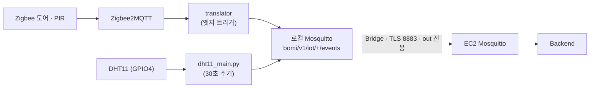

# BOMI IoT

장치별 책임을 분리한 IoT 코드 영역입니다. 여기서 만드는 것은 **백엔드 계약 이벤트
`bomi/v1/iot/{sourceId}/events` 하나**이고, 그 외 통신(로봇 명령·대화)은 전부
`robot/` 소관입니다. `iot/` 안에는 HTTP·DB·ROS 접점이 하나도 없습니다.

| 경로 | 무엇이 있나 | 무엇을 발행하나 |
| --- | --- | --- |
| `raspberry-pi/zigbee2mqtt/` | Zigbee2MQTT + 로컬 Mosquitto + 번역기 Docker Compose | (인프라) |
| `raspberry-pi/translator/` | Zigbee 메시지 → 계약 이벤트 번역기, DHT11 온습도 수집기 | `DOOR_OPENED` `DOOR_CLOSED` `MOTION_DETECTED` `AMBIENT_ENVIRONMENT_OBSERVED` |
| `jetson/` | 젯슨 부팅 시 로봇 스택을 띄우는 systemd 유닛 1개 | (없음 — 실행만 합니다) |

Raspberry Pi 번역기의 설치 및 실행 방법은 `raspberry-pi/README.md`를 따릅니다.
실제 네트워크·인증 정보와 장치별 설정은 커밋하지 않습니다.

## 이벤트가 백엔드까지 가는 길

Bridge 가 EC2 로 올리는 토픽은 `bomi/v1/iot/+/events` **하나뿐**이고 방향은
Pi → EC2 단방향입니다(`raspberry-pi/zigbee2mqtt/mosquitto/bridge.example.conf`).
로봇 토픽(`bomi/v1/robot/…`)은 이 경로를 타지 않으므로, 백엔드가 이 경로로 Pi 에
명령을 보낼 수는 없습니다.

두 가지는 협상 대상이 아닙니다.

- **`sourceId` 는 백엔드 설정과 짝이어야 합니다.** 백엔드
  `application.yml` 의 `bomi.homecoming.sensor-to-senior` ·
  `bomi.observation.ambient-sensor-to-senior` 에 등록된 이름과 다르면 이벤트가
  도착해도 **로그 없이** 버려집니다. iot 라인에서 가장 자주 나는 사고입니다.
- **QoS 1 / retain=false.** QoS 0 이나 retained 메시지는 백엔드가 폐기합니다.
