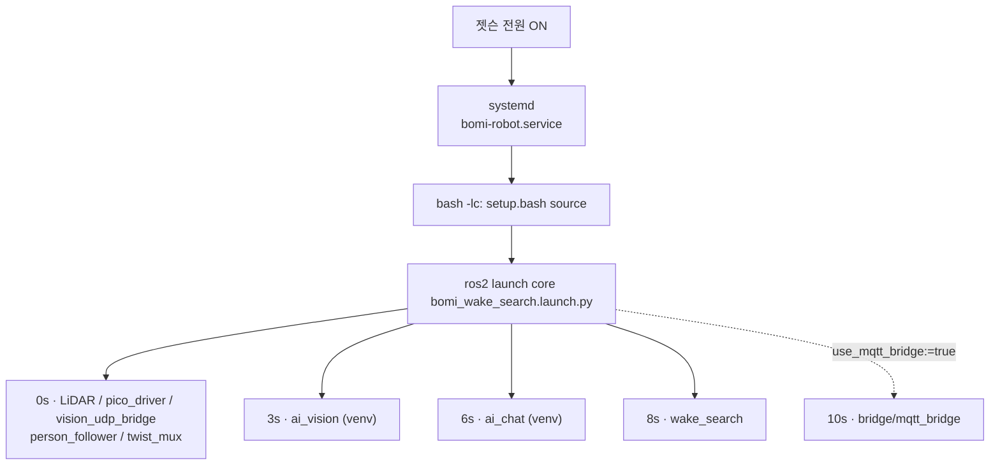

# Jetson Orin Nano

젯슨에서 로봇 스택을 부팅과 함께 띄우기 위한 systemd 유닛을 둡니다. ROS 2 노드
자체는 `robot/ros2_ws` 워크스페이스가 관리하고, 여기에는 **실행 정의만** 있습니다.

## `bomi-robot.service`

전원을 넣으면 `core` 패키지의 `bomi_wake_search.launch.py` 하나를 실행합니다.
이 launch 가 아래를 전부 띄웁니다.

| 시작 시각 | 무엇 |
| --- | --- |
| 0초 | LiDAR · Pico 드라이버 · `vision_udp_bridge` · `person_follower` · `twist_mux` |
| 3초 | `ai_vision` (`bomi_vision.udp_main`, 별도 가상환경) |
| 6초 | `ai_chat` (`bomi_ai_chat`, 별도 가상환경) |
| 8초 | `wake_search` (회전 탐색) |
| 10초 | `mqtt_bridge` — **`use_mqtt_bridge:=true` 일 때만** |

MQTT 브릿지가 선택인 점에 주의합니다. 기본 실행은 "보미야 호출 → 회전 탐색 →
사람 추종"까지의 로봇 내부 경로이고, 백엔드와의 계약 왕복은 인자를 더해야
붙습니다.

유닛의 주요 설정.

| 항목 | 값 | 왜 |
| --- | --- | --- |
| `User` / `WorkingDirectory` | `ssafy` / `/home/ssafy/S15P11E102/robot/ros2_ws` | 저장소 경로가 다르면 유닛을 고쳐야 합니다 |
| `ExecStart` | `bash -lc` 로 감쌈 | systemd 는 셸을 거치지 않으므로 `setup.bash` 를 직접 source 해야 합니다 |
| `BOMI_ROOT` | `/home/ssafy/S15P11E102` | launch 가 저장소 루트를 이 값으로 찾습니다. 경로가 다르면 ai_vision·ai_chat 실행이 실패합니다 |
| 장치 경로 | `/dev/bomi-pico`, `/dev/bomi-lidar` | udev 규칙(`robot/scripts/99-bomi-devices.rules`) 등록이 전제입니다. 등록 전이면 `pico_port`/`lidar_port` 인자를 실제 경로로 바꾸십시오 |
| `KillSignal` / `TimeoutStopSec` | `SIGINT` / `20` | 바로 KILL 하면 **바퀴가 도는 채로 남을 수 있습니다** |
| `Restart` / `RestartSec` | `always` / `5` | |

launch 는 ai_vision·ai_chat 서브프로세스에 `PYTHONPATH=""` 를 강제로 넣습니다.
ROS 2 의 PYTHONPATH 가 AI 가상환경 패키지를 가리는 사고(루트 `CLAUDE.md` §6)를
launch 가 이미 막고 있다는 뜻입니다.

### 등록

```bash
sudo cp bomi-robot.service /etc/systemd/system/
sudo systemctl daemon-reload
sudo systemctl enable --now bomi-robot.service
systemctl status bomi-robot.service
journalctl -u bomi-robot.service -f
```

자동 실행에는 터미널이 없으므로, 진단은 `journalctl -u bomi-robot.service` 로
합니다.

등록 전에 `robot/scripts/preflight.sh` 가 전부 통과해야 합니다 — 특히 `.env`,
가상환경, udev 규칙. 백엔드 MQTT 를 함께 쓰려면 `ExecStart` 에
`use_mqtt_bridge:=true` 와 `broker_*` 인자를 더합니다.

> ⚠️ **자동 실행과 수동 실행을 겹치지 마십시오.** 하나의 `robotId` 에 명령
> 소비자는 하나여야 하고, `/cmd_vel` 에 두 스택이 붙으면 서로 짓밟습니다.
> 수동으로 `demo-start.sh` 를 쓸 때는 `sudo systemctl stop bomi-robot.service`
> 를 먼저 실행합니다.


