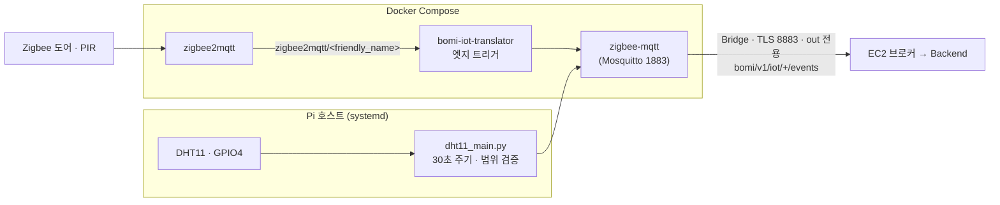

# Raspberry Pi 5 — IoT Gateway

Raspberry Pi에서 동작하는 IoT 게이트웨이 구성 영역이다. 현재는 Zigbee2MQTT가
브로커로 발행한 센서 메시지를 백엔드 계약 형식
(`bomi/v1/iot/{sourceId}/events`)으로 변환·재발행하는 번역기를 포함한다.

발행하는 메시지의 계약은 `docs/mqtt/시나리오 계약 v1.md` 가 정본이고,
최종 권위는 백엔드 파서 코드(`MqttInboundMessageParser.java`)다. 토픽 이름
규칙은 `docs/mqtt/토픽 규약.md` 를 따른다.

## 현재 구성

| 경로 | 역할 |
| --- | --- |
| `zigbee2mqtt/` | Zigbee2MQTT와 로컬 Mosquitto Docker 환경 |
| `translator/` | Zigbee2MQTT 메시지를 백엔드 MQTT 계약으로 변환 |
| `translator/mapping.py` · `ambient_publisher.py` | 센서 값 정규화 — 도어·PIR 엣지 판정, 온습도 범위 검증과 반올림 |
| `translator/config/` | 번역기 장치 설정 예시 |
| `translator/tests/` | 단위 테스트와 실제 브로커 E2E 테스트 |

> 번역기(`main.py`)와 DHT11 수집기(`dht11_main.py`)는 각자 paho 클라이언트를
> 만든다. 공통 연결 모듈은 없고, 그래서 재연결 정책이 서로 다르다 — DHT11 은
> 백오프를 1~30초로 명시하고(`dht11_main.py` 의 `reconnect_delay_set`) 번역기는
> paho 기본값을 쓴다. 둘을 맞출 일이 생기면 이 차이부터 확인한다.
> 두 진입점 모두 paho-mqtt **2.x** 가 필요하다(`CallbackAPIVersion.VERSION2`).
> 루트 `CLAUDE.md` §6 의 "1.x 통일"은 `robot/ai_chat` 이야기다.



두 발행 경로가 완전히 다르다는 점이 중요하다. Zigbee 번역기는 Docker 컨테이너,
DHT11 수집기는 Pi 호스트 systemd 다. 그래서 `bomi-iot-translator` 이미지에는
DHT11 코드가 들어 있지 않고, 번역기 컨테이너는 브로커를 `mqtt:1883`(Compose
서비스 이름)으로 부른다.

`zigbee2mqtt/compose.yaml`은 Zigbee2MQTT, 로컬 Mosquitto, MQTT 번역기를 함께
실행한다. Raspberry Pi Docker 실행 방법은 `zigbee2mqtt/README.md`를 따른다.

## Zigbee2MQTT 연동 화면

현관 도어 센서와 PIR 센서가 Zigbee2MQTT에 연결된 모습입니다. 최근 활동에서
`occupancy` 변화와 장치별 링크 품질을 확인할 수 있습니다. 공개 문서용 이미지에서는
내부 네트워크 주소와 Zigbee 장치 식별자를 제거했습니다.

<p align="center">
  
</p>

## 매핑 규칙 (MVP)

| 입력 | 판정 | 발행 |
| --- | --- | --- |
| 문(`contact`) 열림 전이 | `true`→`false` | `DOOR_OPENED` |
| 문(`contact`) 닫힘 전이 | `false`→`true` | `DOOR_CLOSED` |
| 문 최초 메시지 · 열림(`contact=false`) | 이전 상태 없음 | **즉시 `DOOR_OPENED`** |
| 문 최초 메시지 · 닫힘(`contact=true`) | 이전 상태 없음 | 없음 (기준만 세운다) |
| PIR(`occupancy`) | `false`→`true` 전이에서만 | `MOTION_DETECTED` |
| retained 메시지 | 상태만 갱신 | 없음 |

문의 최초 메시지가 **비대칭**인 점에 주의한다. "엣지 트리거"를 대칭으로만 읽으면
재시작 직후 동작을 예측할 수 없다. retained 도 "무시"가 아니라 "상태만 갱신하고
무발행"이다 — 재시작 직후 retained 로 '열림'을 받아도 발행은 없지만, 이후 실제
전이에서는 정상 발행된다.

`MOTION_DETECTED` 의 payload 는 `{"location": …}` 한 키뿐이다.
`config/device.example.yaml` 주석이 `direction`·`detectionMethod` 를 약속하지만
코드는 넣지 않는다. 같은 파일의 `kind: ambient` 도 번역기에서 아무 동작을 하지
않는다 — 온습도는 Zigbee 경로가 아니기 때문이다.

`friendly_name` 이 중복되면 뒤엣것이 조용히 이긴다. `check-config.sh` 도 이건
잡지 못하므로 설정할 때 직접 확인한다.

`PRESENCE_DETECTED`는 방향 판정 결과용 예약어이므로 센서에서 직접 발행하지 않는다.

## DHT11 온습도 이벤트

DHT11은 Zigbee 장치가 아니므로 Zigbee2MQTT 번역기를 거치지 않는다. Pi 호스트의
`dht11_main.py`가 BCM GPIO4(물리 핀 7번)를 읽고 같은 Mosquitto 브로커의
`bomi/v1/iot/{sourceId}/events`(기본 `bomi/v1/iot/ambient-sensor-01/events`)로
계약 이벤트를 직접 발행한다. `{sourceId}` 는 환경변수 `SENSOR_ID` 로 정하며
토픽과 봉투의 값이 같아야 한다.

| DHT11 | Raspberry Pi 5 |
| --- | --- |
| `+` | 물리 핀 1번 (3.3V) |
| `OUT` | 물리 핀 7번 (BCM GPIO4) |
| `-` | 물리 핀 9번 (GND) |

단품 센서라면 `OUT`과 3.3V 사이에 4.7~10kΩ 풀업 저항을 연결한다. 모듈형 제품은
보통 저항이 내장되어 있다.

발행 계약은 다음과 같다. 봉투는 5개 필드 고정이고, 온습도 값의 **단위는 필드
이름 안에 있다** — `temperatureC`(°C), `humidityPercent`(% RH).

```json
{
  "eventId": "3f6c1b2a8d4e4f0f9c7a5b3e1d0a2c48",
  "type": "AMBIENT_ENVIRONMENT_OBSERVED",
  "occurredAt": "2026-08-15T14:03:21.482913+09:00",
  "sourceId": "ambient-sensor-01",
  "payload": {
    "location": "LIVING_ROOM",
    "temperatureC": 26.0,
    "humidityPercent": 58.0
  }
}
```

세 값은 **협상 대상이 아니다.**

| 항목 | 값 | 어긋나면 |
| --- | --- | --- |
| `sourceId` | `ambient-sensor-01` (`SENSOR_ID` 기본값) | 백엔드 `bomi.observation.ambient-sensor-to-senior` 에 이 이름만 등록돼 있다. 다르면 이벤트가 도착해도 **버려진다** |
| `temperatureC` / `humidityPercent` | 이 철자 그대로 | 백엔드가 정확히 이 두 키만 읽고, 없으면 예외 없이 null 로 처리한다 — **로그도 남지 않고** 임계 판정에서 빠진다 |
| `occurredAt` | 오프셋 포함 ISO 8601 (KST `+09:00`) | 봉투를 만든 시각이지 센서 측정 시각이 아니다. 백엔드 계약의 `observedAt` 키는 IoT 가 보내지 않는다 |

> 2026-08-07 이전에는 이 문서의 옛 예시대로 `temperature`/`humidity` 와
> `living-room-ambient` 를 보냈고, 그래서 온습도 안부 시나리오가 **아무 오류
> 메시지 없이** 한 번도 발동하지 않았다. 이름 하나가 조용한 실패를 만든다.

기본 정책은 30초마다 측정(`READ_INTERVAL_SECONDS`), DHT11 허용 범위
(0~50°C, 20~90% RH) 밖의 값과 읽기 실패는 미발행, MQTT QoS 1, retain false다.

> 이 범위는 **DHT11 데이터시트의 측정 신뢰 구간**이지 안부 시나리오 임계가 아니다.
> "30°C 또는 80% 를 넘으면 로봇이 온다"는 판정은 전부 백엔드 몫이고 IoT 코드에는
> 없다. Pi 는 **임계와 무관하게 30초마다 무조건 발행**하며, 백엔드가 최신 관측값을
> 저장했다가 안부 시나리오 요청 때 쓴다.

Pi 호스트에서 실행한다.

```bash
cd /opt/bomi/iot
python3 -m venv .venv
.venv/bin/pip install -r raspberry-pi/translator/requirements-dht11.txt
cp raspberry-pi/translator/config/dht11.env.example \
  raspberry-pi/translator/config/dht11.env
set -a
. raspberry-pi/translator/config/dht11.env
set +a
.venv/bin/python raspberry-pi/translator/dht11_main.py
```

부팅 시 자동 실행하려면 `config/bomi-dht11.service`의 사용자와 `/opt/bomi/iot`
경로를 실제 배포 경로에 맞춘 후 systemd에 등록한다. GPIO 타이밍과 권한 문제를
피하기 위해 DHT11 수집기는 컨테이너보다 Pi 호스트 서비스 실행을 권장한다.

발행 확인:

```bash
docker exec -it zigbee-mqtt \
  mosquitto_sub -h localhost -t 'bomi/v1/iot/+/events' -v
```

## 실행

```bash
cd raspberry-pi/translator
pip install -r requirements.txt
cp config/device.example.yaml config/device.yaml
# 실제 설정은 config/device.yaml 로 복사(예시: config/device.example.yaml)
python main.py             # 또는: python main.py /path/to/device.yaml
```

## 테스트

```bash
cd raspberry-pi/translator
pip install -r requirements-dev.txt
python -m pytest
```
