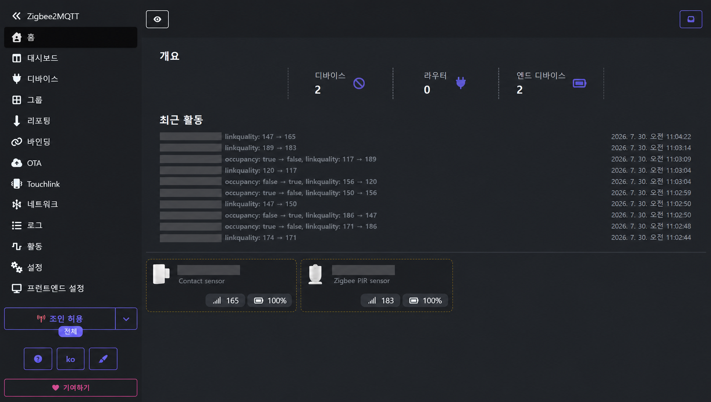

# Raspberry Pi 5 — IoT Gateway

Raspberry Pi에서 동작하는 IoT 게이트웨이 구성 영역이다. 현재는 Zigbee2MQTT가
브로커로 발행한 센서 메시지를 백엔드 계약 형식
(`bomi/v1/iot/<sourceId>/events`)으로 변환·재발행하는 번역기를 포함한다.

## 현재 구성

| 경로 | 역할 |
| --- | --- | --- |
| `zigbee2mqtt/` | Zigbee2MQTT와 로컬 Mosquitto Docker 환경 |
| `translator/` | Zigbee2MQTT 메시지를 백엔드 MQTT 계약으로 변환 |
| `translator/config/` | 번역기 장치 설정 예시 |
| `translator/tests/` | 단위 테스트와 실제 브로커 E2E 테스트 |

`zigbee2mqtt/compose.yaml`은 Zigbee2MQTT, 로컬 Mosquitto, MQTT 번역기를 함께
실행한다. Raspberry Pi Docker 실행 방법은 `zigbee2mqtt/README.md`를 따른다.

## Zigbee2MQTT 연동 화면

현관 도어 센서와 PIR 센서가 Zigbee2MQTT에 연결된 모습입니다. 최근 활동에서
`occupancy` 변화와 장치별 링크 품질을 확인할 수 있습니다. 공개 문서용 이미지에서는
내부 네트워크 주소와 Zigbee 장치 식별자를 제거했습니다.

<p align="center">
  
</p>

## 매핑 규칙 (MVP)

- 문(`contact`): 열림 전이는 `DOOR_OPENED`, 닫힘 전이는 `DOOR_CLOSED`.
- PIR(`occupancy`): `false`→`true` 전이에서만 `MOTION_DETECTED`.
- retained 메시지는 상태만 갱신하고 발행하지 않는다(재시작 오발행 방지).
- `PRESENCE_DETECTED`는 방향 판정 결과용 예약어이므로 센서에서 직접 발행하지 않는다.

## DHT11 온습도 이벤트

DHT11은 Zigbee 장치가 아니므로 Zigbee2MQTT 번역기를 거치지 않는다. Pi 호스트의
`dht11_main.py`가 BCM GPIO4(물리 핀 7번)를 읽고 같은 Mosquitto 브로커의
`bomi/v1/iot/<sensorId>/events`로 계약 이벤트를 직접 발행한다.

| DHT11 | Raspberry Pi 5 |
| --- | --- |
| `+` | 물리 핀 1번 (3.3V) |
| `OUT` | 물리 핀 7번 (BCM GPIO4) |
| `-` | 물리 핀 9번 (GND) |

단품 센서라면 `OUT`과 3.3V 사이에 4.7~10kΩ 풀업 저항을 연결한다. 모듈형 제품은
보통 저항이 내장되어 있다.

발행 계약은 다음과 같다. `temperature` 단위는 °C, `humidity` 단위는 % RH다.

```json
{
  "type": "AMBIENT_ENVIRONMENT_OBSERVED",
  "sourceId": "living-room-ambient",
  "payload": {
    "location": "LIVING_ROOM",
    "temperature": 26.0,
    "humidity": 58.0
  }
}
```

기본 정책은 30초마다 측정, DHT11 허용 범위(0~50°C, 20~90% RH) 밖의 값과 읽기
실패는 미발행, MQTT QoS 1, retain false다. 이 이벤트 자체가 매번 로봇 행동을
유발하지 않도록 Backend는 최신 관측값을 저장하고 안부 시나리오 요청 때 사용한다.

Pi 호스트에서 실행한다.

```bash
cd /opt/bomi/iot
python3 -m venv .venv
.venv/bin/pip install -r raspberry-pi/translator/requirements-dht11.txt
cp raspberry-pi/translator/config/dht11.env.example \
  raspberry-pi/translator/config/dht11.env
set -a
. raspberry-pi/translator/config/dht11.env
set +a
.venv/bin/python raspberry-pi/translator/dht11_main.py
```

부팅 시 자동 실행하려면 `config/bomi-dht11.service`의 사용자와 `/opt/bomi/iot`
경로를 실제 배포 경로에 맞춘 후 systemd에 등록한다. GPIO 타이밍과 권한 문제를
피하기 위해 DHT11 수집기는 컨테이너보다 Pi 호스트 서비스 실행을 권장한다.

발행 확인:

```bash
docker exec -it zigbee-mqtt \
  mosquitto_sub -h localhost -t 'bomi/v1/iot/+/events' -v
```

## 실행

```bash
cd raspberry-pi/translator
pip install -r requirements.txt
cp config/device.example.yaml config/device.yaml
# 실제 설정은 config/device.yaml 로 복사(예시: config/device.example.yaml)
python main.py             # 또는: python main.py /path/to/device.yaml
```

## 테스트

```bash
cd raspberry-pi/translator
pip install -r requirements-dev.txt
python -m pytest
```
