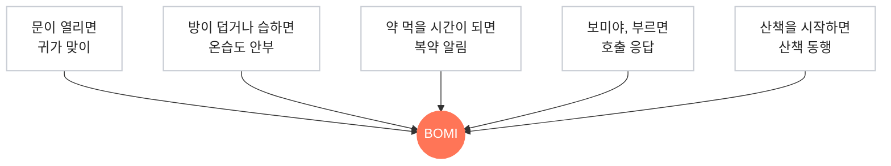
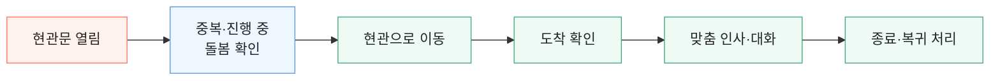
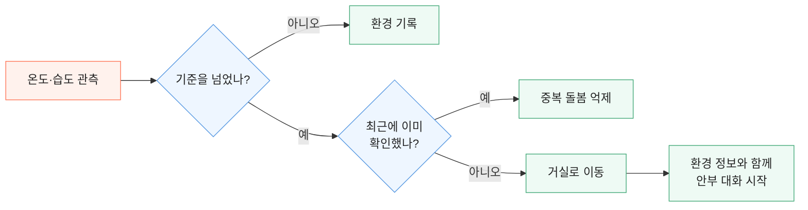
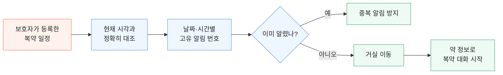
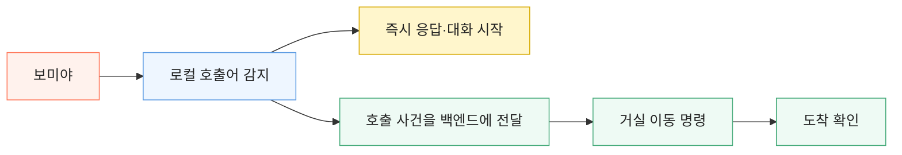
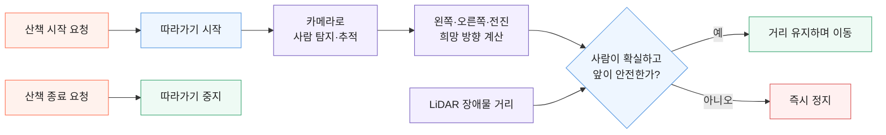
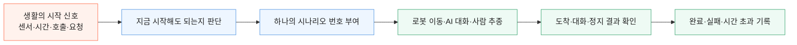

# BOMI 5대 시나리오 — 기능 중심 기술 소개 전달본

> PPT 담당자가 기술을 자세히 몰라도 그대로 장표로 옮길 수 있도록 만든 자료입니다.  
> 핵심 순서는 **기능 → 사용자가 얻는 경험 → 그 경험을 만든 기술**입니다.

## 0. 담당자에게 가장 먼저 보낼 한 문장

**BOMI는 다섯 가지 생활 순간을 알아차리고, 그 순간에 필요한 한 가지 돌봄 행동으로 바꿉니다.**

발표에서 먼저 말할 것은 기술명이 아니라 다음 다섯 장면입니다.

1. 집에 돌아오면 먼저 맞이합니다.
2. 방이 지나치게 덥거나 습하면 직접 안부를 묻습니다.
3. 약 먹을 시간이 되면 곁으로 와서 알려줍니다.
4. “보미야”라고 부르면 바로 답하고 다가옵니다.
5. 산책을 시작하면 사람을 놓치지 않도록 곁을 따라갑니다.

기술은 매번 장면을 먼저 보여준 뒤, **“이 장면을 가능하게 한 흐름”**으로 한 장만 설명합니다.

---

## 1. PPT 담당자에게 복사해서 보낼 메신저 본문

```text
기술 파트는 기술 스택을 나열하지 않고 5가지 기능 장면으로 구성해 주세요.

각 기능은 2장씩 반복합니다.
1장: 사용자가 보는 장면 — 사진 또는 GIF + 한 문장
2장: 우리가 해결한 방식 — 4~5단계 그림 + 하단 기술 키워드 3개 이내

5가지 기능은
① 귀가 맞이 ② 온습도 안부 ③ 복약 알림 ④ “보미야” 호출 ⑤ 산책 동행입니다.

공통 연출은 ‘상황이 발생함 → 보미가 판단함 → 이동/대화함 → 결과를 남김’입니다.
기술 이름은 처음부터 크게 쓰지 말고, 흐름이 완성된 뒤 아래쪽에 작게 공개해 주세요.
각 기능 GIF에는 관객이 봐야 할 행동을 자막 한 줄로 넣어 주세요.
```

---

## 2. 전체 장표 구성 — 13장

| 장표 | 화면에 보일 제목 | 장표의 역할 | 핵심 시각 자료 |
|---:|---|---|---|
| S01 | **BOMI가 돌보는 다섯 순간** | 기능 파트 진입 | 생활 사진 5장이 빠르게 교차 |
| S02 | **하루의 다섯 순간이, 다섯 가지 돌봄이 됩니다** | 전체 기능 예고 | 5대 시나리오 지도 |
| S03 | **집에 돌아오면, 보미가 먼저 마중 나옵니다** | 귀가 맞이 경험 | 현관 이동·인사 GIF |
| S04 | **문 열림을 하나의 귀가 시나리오로 연결했습니다** | 귀가 기술 | 센서→관제→이동→대화 |
| S05 | **환경의 이상을 숫자로 끝내지 않습니다** | 온습도 안부 경험 | 온도 상승→안부 GIF |
| S06 | **반복 센서는 걸러내고, 필요한 한 번만 찾아갑니다** | 온습도 기술 | 임계값·쿨다운→이동→대화 |
| S07 | **약 먹을 시간, 알람 대신 보미가 찾아옵니다** | 복약 경험 | 시간→이동→복약 안내 GIF |
| S08 | **일정과 시간을 정확히 연결해 알림 누락과 중복을 줄였습니다** | 복약 기술 | 일정 조회→고유 슬롯→대화 |
| S09 | **“보미야” 한마디면, 기다리지 않고 바로 답합니다** | 호출 경험 | 호출→즉시 응답·이동 GIF |
| S10 | **대답은 즉시, 이동은 동시에 처리했습니다** | 호출 기술 | AI 응답과 로봇 이동 병렬 흐름 |
| S11 | **산책을 시작하면, 보미가 곁을 따라갑니다** | 산책 경험 | 사람 추종·장애물 정지 영상 |
| S12 | **사람은 카메라로 찾고, 안전은 LiDAR가 한 번 더 확인합니다** | 산책 기술 | 비전→추적→LiDAR→주행/정지 |
| S13 | **다섯 기능을, 하나의 안전한 돌봄 흐름으로 묶었습니다** | 기능 파트 결론 | 공통 기술 뼈대 |

권장 체류 시간은 경험 장표 8~12초, 기술 장표 12~18초입니다. 13장 전체는 약 3분입니다.

---

## 3. S02 — 5대 시나리오 전체 그림

### 화면 문구

**하루의 다섯 순간이, 다섯 가지 돌봄이 됩니다**

### 그림 설계



### PPT 연출

- 처음에는 BOMI만 중앙에 둡니다.
- 클릭할 때마다 다섯 기능이 하나씩 나타납니다.
- 다음 장으로 넘어갈 때 `귀가 맞이`만 컬러로 남기고 나머지는 회색 처리합니다.
- 기능 이름 밑에 기술명은 쓰지 않습니다.

### 발표 멘트

> “저희는 BOMI를 다섯 가지 생활 장면으로 설계했습니다. 이제 기능을 먼저 보여드리고, 그 장면을 어떤 기술로 풀었는지 하나씩 말씀드리겠습니다.”

---

# SCENARIO 1. 귀가 맞이

## 4. S03 — 사용자가 보는 기능

### 화면 문구

**집에 돌아오면, 보미가 먼저 마중 나옵니다**

### 화면

- 현관문이 열리는 장면을 풀 화면으로 시작합니다.
- BOMI가 현관으로 이동하고 인사를 시작하는 8~12초 영상을 넣습니다.
- 영상 자막은 `문 열림 감지 → 현관 이동 → 귀가 인사` 한 줄이면 충분합니다.
- 기술 로고와 코드 화면은 넣지 않습니다.

### 발표 멘트

> “어르신이 집에 돌아오면 앱을 누르지 않아도, 보미가 현관으로 이동해 먼저 인사를 건넵니다.”

## 5. S04 — 이 기능을 기술로 푼 방식

### 화면 문구

**문 열림을 하나의 귀가 시나리오로 연결했습니다**

### 그림 설계



### 그림 아래 기술 키워드

`현관 센서·MQTT`　`시나리오 상태 머신`　`Nav2·AI 대화`

### 관객용 설명

> “문이 열렸다는 신호를 바로 로봇에 보내지 않습니다. 백엔드가 지금 다른 돌봄을 수행 중인지 먼저 확인하고, 하나의 사건번호로 이동과 대화 결과를 끝까지 연결합니다.”

### 애니메이션

1. `현관문 열림`만 보입니다.
2. 신호가 `중복·진행 중 돌봄 확인`으로 이동합니다.
3. `이동 → 도착 → 대화`가 한 칸씩 열립니다.
4. 마지막에만 기술 키워드 3개가 나타납니다.

---

# SCENARIO 2. 온습도 안부

## 6. S05 — 사용자가 보는 기능

### 화면 문구

**환경의 이상을 숫자로 끝내지 않습니다**

### 보조 문구

**보미가 직접 찾아가 몸 상태를 묻습니다**

### 화면

- `32°C`처럼 실제 시연에 사용할 온도 숫자를 먼저 크게 보여줍니다.
- 숫자가 작아지면서 BOMI의 거실 이동·안부 질문 영상으로 모핑합니다.
- 영상 자막: `환경 이상 감지 → 거실 이동 → 안부 확인`

### 발표 멘트

> “센서가 방이 지나치게 덥거나 습하다고 알려오면, 보미는 숫자만 기록하지 않고 어르신에게 직접 찾아가 괜찮은지 묻습니다.”

## 7. S06 — 이 기능을 기술로 푼 방식

### 화면 문구

**반복 센서는 걸러내고, 필요한 한 번만 찾아갑니다**

### 그림 설계



### 그림 아래 기술 키워드

`온습도 센서`　`임계값·쿨다운`　`Nav2·상황 기반 AI 대화`

### 관객용 설명

> “더운 방은 몇 분 뒤에도 계속 덥기 때문에 센서 신호마다 로봇이 출발하면 안 됩니다. 기준을 넘었는지와 최근에 이미 확인했는지를 함께 보고, 필요한 한 번만 안부 시나리오를 시작합니다.”

### 꼭 남길 표현

**신호는 여러 번 와도, 돌봄은 한 번만.**

---

# SCENARIO 3. 복약 알림

## 8. S07 — 사용자가 보는 기능

### 화면 문구

**약 먹을 시간, 알람 대신 보미가 찾아옵니다**

### 화면

- `09:00`과 복약 일정 카드를 크게 보여줍니다.
- 시간이 되면 카드가 BOMI 쪽으로 이동하고, 이어서 실제 복약 안내 영상을 재생합니다.
- 영상 자막: `복약 시간 확인 → 곁으로 이동 → 복약 안내`
- 가능하면 다음 프레임에 보호자 웹의 `오늘 복약 일정` 화면을 2초만 붙입니다.

### 발표 멘트

> “정해진 시간이 되면 보미가 어르신 곁으로 와 어떤 약을 드실 시간인지 자연스럽게 안내합니다.”

## 9. S08 — 이 기능을 기술로 푼 방식

### 화면 문구

**일정과 시간을 정확히 연결해 알림 누락과 중복을 줄였습니다**

### 그림 설계



### 그림 아래 기술 키워드

`Spring Scheduler`　`PostgreSQL 정확 조회`　`고유 슬롯 키·AI 대화`

### 관객용 설명

> “복약은 비슷한 내용을 찾는 AI 검색에 맡기지 않습니다. 보호자가 등록한 일정과 현재 시간을 정확히 비교하고, 같은 날짜와 시간의 알림이 두 번 시작되지 않도록 고유 번호를 붙였습니다.”

### 발표에서 하지 않을 주장

- 사용자가 “먹었어”라고 답하면 복약 완료 상태가 자동 확정된다고 말하지 않습니다.
- 현재 확인된 핵심은 **정확한 시간에 복약 대화를 시작하고 중복 시작을 막는 흐름**입니다.

---

# SCENARIO 4. “보미야” 호출

## 10. S09 — 사용자가 보는 기능

### 화면 문구

**“보미야” 한마디면, 기다리지 않고 바로 답합니다**

### 화면

- 검은 배경에 `“보미야”` 음성 파형만 먼저 보여줍니다.
- 파형이 끝나기 전에 BOMI의 응답 자막이 나타납니다.
- 그와 동시에 작은 화면에서 로봇의 거실 이동을 보여줍니다.
- 영상 자막: `즉시 응답 + 거실 이동`

### 발표 멘트

> “호출을 서버가 처리할 때까지 기다리게 하지 않았습니다. 보미는 부르는 말을 들으면 먼저 답하고, 대화를 이어가며 약속된 생활 공간으로 이동합니다.”

## 11. S10 — 이 기능을 기술로 푼 방식

### 화면 문구

**대답은 즉시, 이동은 동시에 처리했습니다**

### 그림 설계



### 그림 아래 기술 키워드

`openWakeWord`　`로컬 음성 파이프라인`　`MQTT·Nav2`

### 관객용 설명

> “빠른 반응이 필요한 대화는 로컬 AI가 먼저 시작하고, 백엔드는 같은 호출을 다시 말하게 하지 않고 로봇 이동만 관리합니다. 그래서 말과 움직임이 서로 기다리지 않습니다.”

### 애니메이션

- `로컬 호출어 감지`에서 화살표가 두 갈래로 동시에 퍼집니다.
- 위쪽 `즉시 응답`은 0.2초 안에 먼저 나타나게 합니다.
- 아래쪽 `이동`은 조금 느리게 흘러 도착까지 보여줍니다.

---

# SCENARIO 5. 산책 동행

## 12. S11 — 사용자가 보는 기능

### 화면 문구

**산책을 시작하면, 보미가 곁을 따라갑니다**

### 보조 문구

**사람을 놓치거나 길이 막히면 무리해서 움직이지 않습니다**

### 화면

- 실제 카메라 영상에서 한 사람을 추적하는 화면을 먼저 보여줍니다.
- 이어서 LiDAR 장애물 앞에서 정지하는 장면을 붙입니다.
- 최종 이동이 Gazebo라면 화면 하단에 반드시 `실제 카메라·LiDAR 입력 / Gazebo 이동`이라고 표시합니다.
- 영상 자막: `사람 추적 → 거리 유지 → 장애물 우선 정지`

### 발표 멘트

> “산책을 시작하면 보미는 사람을 따라가되, 여러 사람이 보이거나 사람을 놓치거나 장애물이 가까우면 임의로 움직이지 않고 멈춥니다.”

## 13. S12 — 이 기능을 기술로 푼 방식

### 화면 문구

**사람은 카메라로 찾고, 안전은 LiDAR가 한 번 더 확인합니다**

### 그림 설계



### 그림 아래 기술 키워드

`YOLO11·ByteTrack`　`ROS2·LiDAR`　`FOLLOW_START/STOP·Watchdog`

### 관객용 설명

> “카메라 AI는 따라가고 싶은 방향만 제안합니다. 실제 이동 직전에는 ROS2가 LiDAR 거리와 센서 시간 초과를 다시 확인하고, 하나라도 불확실하면 최종 속도를 0으로 만듭니다.”

### 구현 상태 표기

- Backend의 산책 시작·중지와 상태·시간 초과 관리는 현재 `be/feat/S15P11E102-337-walk-along` 작업 브랜치 기준입니다.
- 실제 카메라 한 명 추적, 다중 인물 정지, 실제 LiDAR 장애물 정지와 Gazebo 이동 검증 기록이 있습니다.
- **실제 모터로 사람을 따라 걷는 전체 통합은 검증 전까지 완료라고 표현하지 않습니다.**

---

## 14. S13 — 다섯 기능을 하나로 묶는 결론

### 화면 문구

**다섯 기능을, 하나의 안전한 돌봄 흐름으로 묶었습니다**

### 그림 설계



### 마지막에만 보여줄 공통 기술

`MQTT QoS 1`　`Scenario State Machine`　`PostgreSQL`　`ROS2/Nav2`　`AI Chat/Vision`

### 발표 멘트

> “다섯 기능의 시작점은 다르지만, BOMI는 모두 같은 원칙으로 처리합니다. 중복과 충돌을 먼저 막고, 하나의 시나리오로 이동과 대화를 연결하고, 결과가 확인될 때까지 책임집니다.”

### 다음 파트로 넘기는 문장

> “이제 이 다섯 기능이 실제 사용자 화면과 로봇에서 어떻게 보이는지 시연으로 보여드리겠습니다.”

시연을 이미 먼저 보여줬다면 다음처럼 바꿉니다.

> “방금 보신 다섯 장면은 이렇게 하나의 기술 흐름 위에서 동작합니다.”

---

## 15. PPT 담당자가 받아야 할 최소 자료 목록

각 시나리오 담당자는 PPT 담당자에게 아래 네 파일만 넘기면 됩니다.

| 시나리오 | 필수 영상 | 마지막 정지 화면 | 기술 증거 화면 | 영상 하단 라벨 |
|---|---|---|---|---|
| 귀가 맞이 | 문 열림→현관 이동→인사 8~12초 | 인사 중인 BOMI | 시나리오 로그 또는 MQTT 흐름 | 실제 구동 범위에 맞춰 표기 |
| 온습도 안부 | 온도 상승→거실 이동→질문 8~12초 | 안부 질문 자막 | 임계값·중복 억제 로그 | 센서/로봇 대역 여부 명시 |
| 복약 알림 | 09:00→이동→복약 안내 8~12초 | 복약 안내 자막 | 등록 일정과 알림 시작 로그 | 실 API/Mock 여부 명시 |
| 호출 | “보미야”→즉시 응답→이동 6~10초 | 응답 자막과 이동 화면 | 호출 감지·이동 명령 로그 | 호출어 모델과 주행 범위 |
| 산책 | 한 명 추적→장애물 정지 8~12초 | 정지 프레임 | 추적 상태·LiDAR 거리 | 실제 센서/Gazebo 구분 |

공통 규칙:

- GIF보다는 자막이 필요한 장면은 MP4를 권장합니다.
- 로봇 음성이 들리지 않아도 이해되게 모든 발화에 자막을 넣습니다.
- 영상은 시작 전 대기와 끝난 뒤 마우스 조작을 잘라냅니다.
- 실제 화면에 개인정보·토큰·내부 IP·Mock Data 배너가 보이지 않게 합니다.
- 영상 마지막 프레임을 1.5~2초 유지하면 다음 기술 장표로 자연스럽게 모핑할 수 있습니다.

---

## 16. 기능과 기술을 한눈에 보는 담당자용 표

| 기능 | 사용자가 겪는 순간 | BOMI가 하는 일 | 이 문제를 푼 핵심 기술 | 관객이 기억할 말 |
|---|---|---|---|---|
| 귀가 맞이 | 현관문이 열림 | 현관 이동 후 인사·대화 | 센서, MQTT, 상태 머신, Nav2 | **먼저 마중 나옵니다** |
| 온습도 안부 | 방이 지나치게 덥거나 습함 | 반복 신호를 걸러 한 번만 안부 확인 | 임계값, 쿨다운, 상황 기반 대화 | **숫자를 안부로 바꿉니다** |
| 복약 알림 | 등록한 복약 시간이 됨 | 일정과 시간을 맞춰 복약 대화 시작 | Scheduler, 정확 조회, 고유 슬롯 키 | **알람 대신 찾아옵니다** |
| 호출 | “보미야”라고 부름 | 즉시 응답하면서 거실 이동 | openWakeWord, 로컬 대화, MQTT/Nav2 | **대답은 즉시, 이동은 동시에** |
| 산책 동행 | 음성·앱으로 산책 시작 | 사람을 따라가고 위험하면 정지 | YOLO, ByteTrack, LiDAR, ROS2 | **따라가기보다 멈추기를 먼저 압니다** |

---

## 17. 발표용 기술명 노출 수준

### 본문에서 말해도 되는 수준

- “여러 행동이 겹치지 않게 하나의 시나리오로 관리했습니다.”
- “센서가 반복돼도 한 번만 안부를 묻도록 했습니다.”
- “복약 일정은 AI가 유추하지 않고 정확한 데이터로 확인합니다.”
- “호출 응답과 이동을 분리해 동시에 처리했습니다.”
- “카메라가 사람을 찾고 LiDAR가 이동 가능 여부를 다시 확인합니다.”

### 하단 라벨이나 Q&A에만 둘 용어

- `scenarioId`, `commandId`, `QoS 1`, `State Machine`
- `Spring Scheduler`, `PostgreSQL`, `openWakeWord`
- `YOLO11`, `ByteTrack`, `ROS2`, `Nav2`, `Watchdog`

관객이 기술명을 기억하지 못해도 아래 다섯 문장은 남아야 합니다.

> 먼저 맞이한다.  
> 이상하면 직접 묻는다.  
> 약 시간이 되면 찾아온다.  
> 부르면 바로 답한다.  
> 따라가되 위험하면 멈춘다.

---

## 18. 코드 기준 검증 메모 — PPT 본문에는 넣지 않음

### 공통 시나리오 계약

```text
C:/BOMI/docs/mqtt/scenario-contract-v1.md
C:/BOMI/backend/src/main/java/com/ssafy/bomi/scenario/domain/ScenarioType.java
C:/BOMI/backend/src/main/java/com/ssafy/bomi/scenario/application/ScenarioStartGuard.java
```

### 시나리오별 핵심 코드

```text
귀가 맞이
C:/BOMI/backend/src/main/java/com/ssafy/bomi/scenario/application/HomecomingOrchestrator.java

온습도 안부
C:/BOMI/backend/src/main/java/com/ssafy/bomi/scenario/application/WellnessCheckOrchestrator.java

복약 알림
C:/BOMI/backend/src/main/java/com/ssafy/bomi/scenario/application/MedicationReminderScheduler.java

“보미야” 호출
C:/BOMI/backend/src/main/java/com/ssafy/bomi/scenario/application/WakeWordCallOrchestrator.java

산책 동행 — 현재 작업 브랜치 기준
C:/BOMI/backend/src/main/java/com/ssafy/bomi/scenario/application/WalkOrchestrator.java
C:/BOMI/backend/src/main/java/com/ssafy/bomi/scenario/application/WalkTimeoutWatchdog.java
```

### 발표 전 반드시 다시 확인할 사항

1. 귀가·온습도·복약의 `DEFAULT` 복귀가 최종 로봇에서 실제 동작하는지
2. 복약 안내 뒤 사용자 응답이 보호자 화면의 복용 상태로 자동 반영되는지
3. 호출 시 실제 응답과 이동이 동시에 자연스럽게 보이는지
4. 산책 Backend 작업 브랜치가 최종 병합됐는지
5. 산책의 최종 이동이 실물 모터인지 Gazebo인지
6. 보호자 웹 촬영이 Mock API인지 실 API인지

검증되지 않은 항목은 숨기기보다 영상 하단에 `Simulation`, `robot-sim`, `실제 센서 → Gazebo`처럼 범위를 정확히 적습니다.

