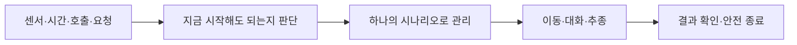

# BOMI 5대 시나리오 — PPT 담당자용 1페이지

## 이 파트에서 남겨야 할 한 문장

**BOMI는 다섯 가지 생활 순간을 감지하고, 그때 필요한 한 가지 돌봄 행동으로 바꿉니다.**

## 구성법

각 기능을 딱 2장으로 반복합니다.

1. **기능 장표:** 사진·GIF + 사용자가 얻는 경험 한 문장
2. **기술 장표:** `시작 신호 → 판단 → BOMI 행동` 그림 + 기술명 3개 이내

총 13장: `표지 1 + 전체 1 + 기능별 2×5 + 결론 1`

---

## 5개 기능과 화면 문구

| 기능 | 기능 장표에 크게 쓸 문장 | 다음 기술 장표에서 설명할 것 | 하단 기술 라벨 |
|---|---|---|---|
| 귀가 맞이 | **집에 돌아오면, 보미가 먼저 마중 나옵니다** | 문 열림을 하나의 귀가 시나리오로 연결 | `현관 센서·MQTT / 상태 머신 / Nav2·AI` |
| 온습도 안부 | **환경의 이상을 숫자로 끝내지 않습니다** | 반복 센서는 걸러내고 필요한 한 번만 안부 확인 | `온습도 센서 / 임계값·쿨다운 / 상황 대화` |
| 복약 알림 | **약 먹을 시간, 알람 대신 보미가 찾아옵니다** | 등록 일정과 시간을 정확히 대조하고 중복 방지 | `Scheduler / PostgreSQL / 고유 슬롯 키·AI` |
| “보미야” 호출 | **“보미야” 한마디면, 기다리지 않고 바로 답합니다** | 로컬 응답과 로봇 이동을 동시에 처리 | `openWakeWord / 로컬 음성 AI / MQTT·Nav2` |
| 산책 동행 | **산책을 시작하면, 보미가 곁을 따라갑니다** | 카메라로 사람을 찾고 LiDAR가 이동을 최종 허가 | `YOLO·ByteTrack / ROS2·LiDAR / Watchdog` |

---

## 그대로 그림으로 옮길 5개 흐름

```mermaid
flowchart TB
    subgraph H["1. 귀가 맞이"]
        H1["문 열림"] --> H2["중복·충돌 확인"] --> H3["현관 이동"] --> H4["인사·대화"]
    end

    subgraph W["2. 온습도 안부"]
        W1["온도·습도 이상"] --> W2["임계값·최근 확인 판단"] --> W3["거실 이동"] --> W4["안부 대화"]
    end

    subgraph M["3. 복약 알림"]
        M1["복약 시간"] --> M2["정확한 일정·중복 확인"] --> M3["거실 이동"] --> M4["복약 안내"]
    end

    subgraph C["4. 보미야 호출"]
        C1["보미야"] --> C2["로컬 호출어 감지"]
        C2 --> C3["즉시 응답·대화"]
        C2 --> C4["동시에 거실 이동"]
    end

    subgraph K["5. 산책 동행"]
        K1["산책 시작"] --> K2["사람 탐지·추적"] --> K3{"사람과 길이<br/>모두 확실한가?"}
        K3 -- "예" --> K4["거리 유지 이동"]
        K3 -- "아니오" --> K5["정지"]
    end

    classDef start fill:#fff2ed,stroke:#ff7557,color:#222;
    classDef think fill:#eef6ff,stroke:#5899e2,color:#222;
    classDef act fill:#eefaf4,stroke:#43a978,color:#222;
    classDef stop fill:#fff0f0,stroke:#dc5757,color:#222;
    class H1,W1,M1,C1,K1 start;
    class H2,W2,M2,C2,K2,K3 think;
    class H3,H4,W3,W4,M3,M4,C3,C4,K4 act;
    class K5 stop;
```

PPT에서는 이 그림 전체를 한 장에 넣지 않습니다. 다섯 줄 중 해당 기능 한 줄만 복사해 한 장에 크게 사용합니다.

---

## 기능별 GIF 한 개씩만 준비

| 기능 | 8~12초 안에 보여줄 장면 | 영상 자막 |
|---|---|---|
| 귀가 맞이 | 문 열림→현관 이동→인사 | `문 열림 감지 → 현관 이동 → 귀가 인사` |
| 온습도 안부 | 온도 상승→거실 이동→질문 | `환경 이상 감지 → 거실 이동 → 안부 확인` |
| 복약 알림 | 09:00→이동→약 안내 | `복약 시간 확인 → 곁으로 이동 → 복약 안내` |
| 호출 | “보미야”→즉시 답변→이동 | `즉시 응답 + 거실 이동` |
| 산책 | 한 명 추적→장애물 앞 정지 | `사람 추적 → 거리 유지 → 장애물 우선 정지` |

영상 마지막 프레임을 2초 유지한 뒤, 그 프레임 위에 흐름도를 모핑하면 됩니다.

---

## 마지막 결론 그림

마지막 멘트:

> **“시작점은 다르지만, BOMI는 모든 돌봄을 같은 원칙으로 처리합니다. 겹치지 않게 판단하고, 필요한 행동 하나를 끝까지 책임집니다.”**

---

## 과장 방지 3줄

- 복약 대답이 복용 완료로 **자동 확정된다**고 말하지 않습니다.
- 산책은 현재 **실제 카메라·LiDAR 입력과 Gazebo 이동** 검증 범위를 구분해 표기합니다.
- 귀가·안부·복약의 실제 로봇 복귀와 전체 E2E는 최종 시연 환경에서 확인한 범위만 말합니다.

더 자세한 장표별 카피·발표 멘트·애니메이션 지시는 `04_BOMI_5대_시나리오_기능중심_기술소개.md`를 참고합니다.

