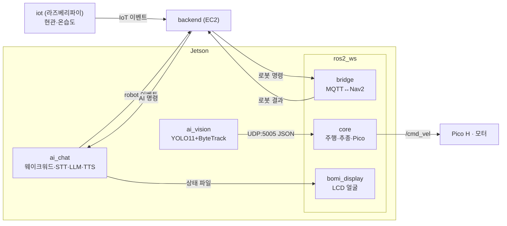

# BOMI Robot

Ubuntu 22.04, ROS 2 Humble, Python 3.10을 기준으로 하는 로봇 워크스페이스입니다.

`core`의 `pico_driver`가 Pico H와 실제로 시리얼 통신하는 드라이버입니다.
실기로 전진·후진·좌우회전·제자리회전까지 확인했습니다.

`bridge`는 백엔드 MQTT 명령을 로봇 동작으로 바꾸며 드라이버를 골라 끼웁니다.
`driver_type:=mock`(기본)은 아무것도 움직이지 않고, `forward_test`는 유효한
NAVIGATE마다 2초 저속 전진만 하며, `timed`는 지도 없이 정해진 시간만 직진하고,
`nav2`는 실제 Nav2 목적지 주행을 수행합니다.

## robot/ 구성

이 디렉터리에는 ROS 2 워크스페이스만 있는 것이 아닙니다. 젯슨 한 대에서 세
프로세스가 함께 돕니다.

| 위치 | 내용 |
| --- | --- |
| [`ros2_ws/`](ros2_ws/) | ROS 2 패키지 8개. 주행·추종·Pico 드라이버·MQTT 브리지·LCD |
| [`ai_chat/`](ai_chat/) | 음성 대화 런타임(독립 Python 패키지). 웨이크워드·STT·LLM·TTS, MQTT 대화 계약 |
| [`ai_vision/`](ai_vision/) | 사람 탐지·추적(YOLO11 + ByteTrack), UDP 송신 |
| [`scripts/`](scripts/) | 실기 운용 스크립트(`demo-start.sh`, `preflight.sh`, `send_navigate.sh` 등)와 udev 규칙 |
| [`tools/waypoint_editor/`](tools/waypoint_editor/) | waypoint YAML 편집 도구 |
| [`pico/`](pico/) | Pico H 펌웨어 원본 |
| [`config/robot.example.yaml`](config/robot.example.yaml) | 로봇 식별자 예시 설정 |
| [`docs/`](docs/) | 하드웨어·지도·시연 문서 |
| `requirements.txt` | `ros2_ws` 쪽 파이썬 의존성 |



> **paho-mqtt 핀이 두 갈래입니다.** `robot/requirements.txt`는
> `paho-mqtt>=2.1,<3`(`ros2_ws`의 `bridge`가 2.x 콜백 API를 씁니다)이고
> `robot/ai_chat/pyproject.toml`은 `paho-mqtt>=1.6,<2`(ai_chat 코드는 1.x 규약)입니다.
> 의도된 분리이므로 **두 프로세스가 같은 venv를 공유하면 안 됩니다.**

## 패키지

| 패키지 | 역할 |
| --- | --- |
| `core` | 이동 명령, 상태 발행, Pico 시리얼 드라이버, Mock 모터 드라이버, waypoint 순찰, 사용자 추종·탐색, Nav2 설정과 launch |
| `description` | Gazebo용 BOMI 차동구동 로봇과 LiDAR 모델 |
| `simulation` | 테스트 월드, 로봇 배치, Gazebo·ROS 2 토픽 브리지 |
| `mapping` | SLAM Toolbox 설정, 통합 launch, RViz 설정과 지도 파일 |
| `bomi_lidar` | YDLIDAR X4-PRO 드라이버 launch와 정적 TF |
| `bomi_obstacle_detection` | LiDAR 전방 장애물 거리 측정 |
| `bomi_display` | LCD 얼굴 표시와 로봇 상태 렌더링 |
| `bridge` | 백엔드와 로봇 사이의 MQTT 브리지, Nav2 주행 드라이버 |

`src/rf2o_laser_odometry`는 외부 저장소를 `rf2o.repos`로 가져오는 패키지이며
Git으로 추적하지 않습니다. 빌드 전에 한 번 가져옵니다.

```bash
cd $WS
vcs import src < rf2o.repos
```

준비 방법과 사용 절차는
[`docs/handheld-lidar-mapping.md`](docs/handheld-lidar-mapping.md)에 있습니다.

> **`core` 패키지에는 추적되는 중복 사본이 있습니다.** 복구 머지 사고로
> `core/person_follower.py`·`core/twist_mux.yaml` 같은 파일이 패키지 루트에도
> 남았고 `core/core/`·`core/config/` 쪽과 바이트가 같습니다. **빌드에 쓰이는 것은
> `core/core/`와 `core/config/` 쪽입니다.** 파일을 고칠 때는 그쪽을 고칩니다.

## 실행 진입점

`core`의 `setup.py`가 등록한 `console_scripts` 12개와 주요 launch 파일입니다.
"환경" 열은 바퀴를 띄우기 전에 무엇을 돌려도 되는지 가르는 기준입니다.

| 명령 | 환경 | 동작 |
| --- | --- | --- |
| `ros2 run core status_publisher` | 공통 | `/bomi/status`에 `bomi is ready`를 1초마다 발행 |
| `ros2 run core keyboard_teleop` | 공통 | 키보드 입력을 `/cmd_vel`의 `geometry_msgs/Twist`로 발행 |
| `ros2 run core mock_motor_driver` | 공통 | `/cmd_vel`을 구독해 값을 로그로 출력 |
| `ros2 run core scan_sanitizer` | 공통 | 각도 범위가 360°가 아닌 LaserScan을 버리고 나머지를 다시 발행 |
| `ros2 launch core pico_driver.launch.py` | 실기 | `/cmd_vel`을 Pico H로 보내고 `/odom`·`/imu` 발행 |
| `ros2 run core joy_cmd_filter` | 실기 | 조이스틱 입력을 `/cmd_vel_joy` 명령으로 변환 |
| `ros2 run core nav2_waypoint_patrol` | 공통 | YAML 순찰 지점을 Nav2 목표로 순서대로 전송 |
| `ros2 run core goto_waypoint` | 공통 | 이름으로 지정한 waypoint 한 곳으로 Nav2 목표를 전송 |
| `ros2 run core person_search_patrol` | 실기 | 웨이포인트를 한 바퀴 돌며 사람을 찾고 Nav2 취소 후 추종 전환 |
| `ros2 run core wake_search` | 실기 | "보미야" 호출 뒤 제자리 회전으로 사람을 찾고 `/cmd_vel_search`에 발행 |
| `ros2 run core vision_udp_bridge` | 실기 | AI 비전의 UDP 추적 결과를 `/vision/follow_result`로 발행 |
| `ros2 run core person_follower` | 실기 | 추적 결과와 LiDAR(`/scan`)로 `/cmd_vel_follow` 생성, 근접 시 정지 |
| `ros2 launch bridge mqtt_bridge.launch.py` | 실기 | 백엔드 MQTT 명령을 받아 로봇을 구동. **시연 본경로**이며 `driver_type:=nav2`로 실주행 |
| `ros2 launch bridge backend_drive_test.launch.py` | 실기 | 유효한 MQTT NAVIGATE마다 저속으로 2초 전진하는 통신 테스트 |

`person_follower`의 토픽 기본값은 `core/config/person_following.yaml`에 있습니다
(`scan_topic: /scan`, `output_topic: /cmd_vel_follow`). `/scan_real`과 `/cmd_vel`은
`person_search_patrol.launch.py`의 인자 기본값이지 노드 기본값이 아닙니다.

> `keyboard_teleop`은 `/cmd_vel`에 직접 발행하는데 `twist_mux` 설정은
> `/cmd_vel_keyboard`를 keyboard 입력으로 등록하고 있습니다. `twist_mux`와 함께 쓸
> 때는 `--ros-args -r /cmd_vel:=/cmd_vel_keyboard`로 재지정하거나, 다른 속도
> 명령원을 함께 띄우지 않습니다.

## 하드웨어

차량은 JGB37-520 엔코더 모터 4개, MDD10A와 Pico H를 사용하는 차동구동
구조입니다. 조립, 모터 구동 확인, Jetson↔Pico 프로토콜과 ROS 2
드라이버(`pico_driver`)까지 실기로 검증했습니다. Odometry 보정도 끝났습니다 —
회전 변환에 쓰는 유효 트레드는 2026-08-06 자이로 실측으로 0.278 m로 확정했고
(기하값 0.257 m가 아닙니다), 1회전 이동거리는 0.1929 m입니다. 두 값 모두
`core/config/pico_driver.yaml`에서 주입합니다.

구성, 진행 상태와 안전 기준은
[`docs/hardware-control.md`](docs/hardware-control.md)에,
Jetson↔Pico 시리얼 규격은
[`docs/pico-serial-protocol.md`](docs/pico-serial-protocol.md)에 있습니다.

Pico H 펌웨어 원본은 [`pico/`](pico/)에 있습니다.

## 시작하기

아래 예제는 워크스페이스 경로를 `$WS` 하나로 씁니다. 새 터미널마다 먼저
정의하세요. 저장소 위치가 다르면 이 한 줄만 바꾸면 됩니다.

```bash
export WS=/mnt/c/S15P11E102/robot/ros2_ws
```

### 1. 개발 환경 준비

ROS 2 설치는 최초 한 번만 필요합니다. 절차는
[`docs/ros2-humble-setup.md`](docs/ros2-humble-setup.md)에 있습니다.

이미 설치되어 있으면 확인만 하고 넘어갑니다. 결과가 `humble`이면 됩니다.

```bash
printenv ROS_DISTRO
```

### 2. 빌드

```bash
cd $WS
source /opt/ros/humble/setup.bash
colcon build --symlink-install
```

`core`와 그 의존 패키지만 빌드하려면 `--packages-up-to core`를 붙입니다.

빌드가 실패하면 [`docs/nav2-troubleshooting.md`](docs/nav2-troubleshooting.md)를
확인하세요. 브랜치를 바꾼 뒤에는 `rm -rf build install log` 후 다시 빌드해야
할 수 있습니다.

### 3. 새 터미널마다 환경 적용

```bash
source /opt/ros/humble/setup.bash
source $WS/install/setup.bash
```

## 저장 지도 기반 Nav2 시뮬레이션

`bomi_navigation_sim.launch.py`는 BOMI Gazebo 모델, 저장된 BOMI 지도, AMCL,
Nav2와 RViz를 함께 실행합니다. SLAM으로 지도를 새로 만들지 않으며, 기본 지도는
`mapping/maps/bomi_test_map.yaml`입니다. 시작 위치는 Gazebo의 BOMI 생성 위치와
같은 `x=0.0`, `y=0.0`, `yaw=0.0`으로 AMCL에 전달합니다.

```bash
cd $WS
source /opt/ros/humble/setup.bash
source install/setup.bash

ros2 launch core bomi_navigation_sim.launch.py
```

30초쯤 뒤 RViz 창이 열립니다. 기본 실행은 WSL의 그래픽 부하를 줄이기 위해
Gazebo 서버를 화면 없이 실행하고 RViz만 표시합니다.

### 목표 지정

RViz 툴바에서 `2D Goal Pose`를 선택하고 지도의 빈 공간을 마우스로 누른 채
드래그한 다음 놓으면 주행이 시작됩니다. 드래그 방향이 도착 후 로봇이 바라볼
방향입니다.

> `2D Pose Estimate`는 목표 지정이 아니라 로봇의 현재 위치를 AMCL에 알려주는
> 도구입니다. 잘못 지정하면 위치 추정이 깨져 로봇이 엉뚱한 방향으로 주행합니다.

명령으로 목표를 보낼 수도 있습니다. `SUCCEEDED`가 나오면 도달한 것입니다.

```bash
ros2 action send_goal /navigate_to_pose nav2_msgs/action/NavigateToPose \
  '{pose: {header: {frame_id: map}, pose: {position: {x: 0.0, y: 1.0, z: 0.0}, orientation: {z: 0.7071068, w: 0.7071068}}}}'
```

기본 지도는 6 m × 6 m이므로 `x`, `y`는 −2.5 ~ 2.5 범위로 지정합니다.
이 launch는 단일 목표 이동 확인용이므로 `nav2_waypoint_patrol`을 자동으로
실행하지 않습니다.

### 실행 옵션

| 목적 | 인자 |
| --- | --- |
| Gazebo 월드 화면도 표시 | `headless:=False` |
| Gazebo 화면 없이 실행 (기본값) | `headless:=True` |
| RViz 없이 실행 | `use_rviz:=False` |
| 다른 지도 사용 | `map:=/absolute/path/to/map.yaml` |

이 launch는 BOMI 차동구동 시뮬레이션 검증용이며 실제 모터 드라이버나 실물
Odometry를 실행하지 않습니다.

주행이 중단되거나 화면이 정상적으로 표시되지 않으면
[`docs/nav2-troubleshooting.md`](docs/nav2-troubleshooting.md)를 확인하세요.

## 비전 기반 사용자 추종

`person_following.launch.py`는 카메라의 사람 추적 결과와 LiDAR 거리로 속도
명령을 만듭니다. 사람이 너무 가까우면 정지합니다.

```text
카메라 → AI 비전 → UDP → vision_udp_bridge → /vision/follow_result
→ person_follower (+ LiDAR /scan) → /cmd_vel_follow
```

출력 토픽 기본값이 `/cmd_vel_follow`이므로 이대로는 로봇이 움직이지 않습니다.
실제로 움직이려면 출력을 `/cmd_vel`로 지정합니다.

```bash
ros2 launch core person_following.launch.py output_topic:=/cmd_vel
```

이때 Nav2 자율주행을 함께 실행하면 두 기능이 모두 `/cmd_vel`에 발행해 명령이
충돌합니다. 하나만 실행합니다.

카메라와 LiDAR 준비, 토픽 설정과 실행 순서는
[`ros2_ws/src/core/README.md`](ros2_ws/src/core/README.md)에 있습니다.

## 웨이포인트 사용자 탐색 MVP

`person_search_patrol`은 저장된 웨이포인트를 한 바퀴만 순찰합니다. 비전 결과에서
동일한 한 사람이 0.5초 동안 유지되면 현재 Nav2 목표를 취소하고, Nav2가 실제
`CANCELED` 상태로 끝난 뒤 `/person_following/enable`을 켭니다. 모든 지점을
확인해도 사람이 없으면 `/person_search/status`에 `not_found`를 발행합니다.

Nav2와 카메라·LiDAR를 먼저 실행한 뒤 다음 launch를 사용합니다.

```bash
ros2 launch core person_search_patrol.launch.py \
  waypoint_file:=$WS/src/core/config/room_waypoints.yaml \
  scan_topic:=/scan_real
```

`start_automatically:=false`로 실행했다면 `/person_search/enable`의 Bool 값으로
탐색을 시작하거나 취소할 수 있습니다. 이 launch는 추종 출력을 `/cmd_vel`에
직접 연결하므로 `nav2_waypoint_patrol`, 키보드 주행 또는 다른 속도 명령원을
동시에 실행하지 않습니다. 사람을 놓친 뒤 순찰 재개, 여러 바퀴 탐색과 MQTT 결과
연결은 MVP 범위에 포함하지 않습니다.

## 지도 만들기

| 방법 | 문서 | 필요한 것 |
| --- | --- | --- |
| 실물 로봇을 조이스틱으로 주행하며 생성 | [`docs/robot-joystick-slam.md`](docs/robot-joystick-slam.md) | BOMI, Pico H, 조이스틱, YDLIDAR X4-PRO |
| Gazebo 시뮬레이션에서 생성 | [`docs/gazebo-slam-mapping.md`](docs/gazebo-slam-mapping.md) | 없음 |
| 실물 LiDAR를 손으로 이동하며 생성 | [`docs/handheld-lidar-mapping.md`](docs/handheld-lidar-mapping.md) | YDLIDAR X4-PRO |

두 방법 모두 SLAM Toolbox로 `/map`을 만들고 `map_saver_cli`로 저장합니다.

## 테스트

```bash
cd $WS
source /opt/ros/humble/setup.bash
colcon test --packages-select simulation core
colcon test-result --verbose
```

`bridge`를 함께 검증할 때는 **`core`도 같이 빌드해야 합니다.** waypoint 좌표가
`core`의 ament share 에서 오므로, `colcon build --packages-select core bridge`
없이 `bridge`만 돌리면 모든 NAVIGATE가 FAILED로 끝납니다.

`ai_chat`은 ROS 2 패키지가 아니므로 `colcon`이 아니라 자체 venv에서 pytest로
검증합니다. **젯슨에서는 `env -u PYTHONPATH`가 필요합니다** — ROS 2가 주입한
`PYTHONPATH`의 lark·numpy가 pytest를 죽입니다. 반대로 로봇을 *구동*할 때는
`PYTHONPATH`를 유지합니다. 자세한 내용은
[`ai_chat/README.md`](ai_chat/README.md)에 있습니다.

## 문서

| 문서 | 내용 |
| --- | --- |
| [`AGENTS.md`](AGENTS.md) | 작업 규칙과 검증 기준 |
| [`docs/demo-runbook.md`](docs/demo-runbook.md) | 시연 실행 절차 |
| [`docs/hardware-control.md`](docs/hardware-control.md) | 하드웨어 구성, 안전 기준, 검증 순서 |
| [`docs/pico-serial-protocol.md`](docs/pico-serial-protocol.md) | Jetson↔Pico 시리얼 프로토콜 |
| [`docs/ros2-humble-setup.md`](docs/ros2-humble-setup.md) | ROS 2 Humble 설치와 개발 환경 설정 |
| [`docs/nav2-troubleshooting.md`](docs/nav2-troubleshooting.md) | 주행 실패, 렌더링, 빌드 문제 해결 |
| [`docs/gazebo-slam-mapping.md`](docs/gazebo-slam-mapping.md) | Gazebo에서 SLAM 지도 생성 |
| [`docs/handheld-lidar-mapping.md`](docs/handheld-lidar-mapping.md) | 실물 LiDAR로 2D 지도 생성 |
| [`docs/robot-joystick-slam.md`](docs/robot-joystick-slam.md) | 실물 조이스틱 구동 확인과 로봇 탑재 LiDAR 지도 생성 |
| [`docs/waypoint-patrol.md`](docs/waypoint-patrol.md) | SLAM 지도 기반 waypoint 순찰 |
| [`docs/entrance-waypoint-field-run.md`](docs/entrance-waypoint-field-run.md) | 현관 waypoint 실기 기록 |
| [`docs/turtlebot3-nav2-sim.md`](docs/turtlebot3-nav2-sim.md) | TurtleBot3 Nav2 통합 시뮬레이션 |
| [`docs/turtlesim-teleop.md`](docs/turtlesim-teleop.md) | turtlesim으로 키보드 제어 확인 |
| [`ros2_ws/src/core/README.md`](ros2_ws/src/core/README.md) | 비전 기반 사용자 추종 실행 방법 |
| [`ros2_ws/src/bridge/README.md`](ros2_ws/src/bridge/README.md) | 백엔드 MQTT 브리지 |
| [`ros2_ws/src/bomi_display/README.md`](ros2_ws/src/bomi_display/README.md) | LCD 얼굴 표시 |
| [`ai_vision/README.md`](ai_vision/README.md) | AI 비전 모듈(사람 탐지·추적, UDP 송신) |
| [`ai_chat/README.md`](ai_chat/README.md) | 음성 대화 런타임(웨이크워드·STT·LLM·TTS, MQTT 대화 계약) |
| [`pico/README.md`](pico/README.md) | Pico H 펌웨어 |
